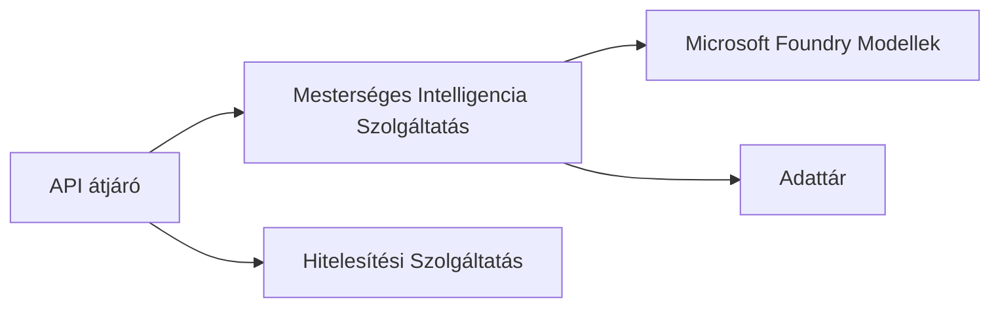

# 8. fejezet: Termelési és vállalati minták

**📚 Tanfolyam**: [AZD kezdőknek](../../README.md) | **⏱️ Időtartam**: 2-3 óra | **⭐ Bonyolultság**: Haladó

---

## Áttekintés

Ez a fejezet a vállalati szintű telepítési mintákat, biztonsági megerősítést, monitorozást és költségoptimalizálást tárgyalja a termelési AI munkaterhelésekhez.

## Tanulási célok

A fejezet elvégzése után képes leszel:
- Több régióra kiterjedő, ellenálló alkalmazások telepítésére
- Vállalati biztonsági minták megvalósítására
- Átfogó monitorozás beállítására
- Nagy léptékű költségoptimalizálásra
- AZD-vel CI/CD pipeline-ok létrehozására

---

## 📚 Tanórák

| # | Tanóra | Leírás | Idő |
|---|--------|-------------|------|
| 1 | [Termelési AI gyakorlatok](production-ai-practices.md) | Vállalati telepítési minták | 90 perc |

---

## 🚀 Termelési Ellenőrzőlista

- [ ] Több régióra kiterjedő telepítés a rugalmasságért
- [ ] Kezelhető identitás hitelesítéshez (kulcsok nélkül)
- [ ] Application Insights a monitorozáshoz
- [ ] Költségkeretek és riasztások konfigurálva
- [ ] Biztonsági szkennelés engedélyezve
- [ ] CI/CD pipeline integráció
- [ ] Katasztrófa-helyreállítási terv

---

## 🏗️ Architektúra minták

### Minta 1: Mikroszolgáltatások AI


### Minta 2: Eseményvezérelt AI


---

## 🔐 Biztonsági Legjobb Gyakorlatok

```bicep
// Use managed identity
identity: {
  type: 'SystemAssigned'
}

// Private endpoints for AI services
properties: {
  publicNetworkAccess: 'Disabled'
  networkAcls: {
    defaultAction: 'Deny'
  }
}
```

---

## 💰 Költségoptimalizálás

| Stratégia | Megtakarítás |
|----------|---------|
| Nulla méretre skálázás (Container Apps) | 60-80% |
| Fogyasztás szerinti rétegek használata fejlesztéshez | 50-70% |
| Ütemezett skálázás | 30-50% |
| Foglalt kapacitás | 20-40% |

```bash
# Költségkeret figyelmeztetések beállítása
az consumption budget create \
  --budget-name "AI-Budget" \
  --amount 500 \
  --category Cost \
  --time-grain Monthly
```

---

## 📊 Monitorozási Beállítás

```bash
# Folyamatosan jelenítse meg a naplókat
azd monitor --logs

# Ellenőrizze az Application Insights szolgáltatást
azd monitor

# Méretek megtekintése
az monitor metrics list --resource <resource-id>
```

---

## 🔗 Navigáció

| Irány | Fejezet |
|-----------|---------|
| **Előző** | [7. fejezet: Hibakeresés](../chapter-07-troubleshooting/README.md) |
| **Tanfolyam vége** | [Tanfolyam kezdőlap](../../README.md) |

---

## 📖 Kapcsolódó Források

- [AI Ügynökök útmutatója](../chapter-02-ai-development/agents.md)
- [Application Insights](../chapter-06-pre-deployment/application-insights.md)
- [Több ügynökös megoldások](../chapter-05-multi-agent/README.md)
- [Mikroszolgáltatások példa](../../examples/microservices/README.md)

---

<!-- CO-OP TRANSLATOR DISCLAIMER START -->
**Nyilatkozat**:  
Ez a dokumentum az AI fordító szolgáltatás, a [Co-op Translator](https://github.com/Azure/co-op-translator) segítségével készült. Bár törekszünk a pontosságra, kérjük, vegye figyelembe, hogy az automatikus fordítások hibákat vagy pontatlanságokat tartalmazhatnak. Az eredeti dokumentum az anyanyelvén tekintendő irányadónak. Fontos információk esetén szakképzett emberi fordítás igénybevétele javasolt. Nem vállalunk felelősséget a fordítás használatából eredő félreértésekért vagy félreértelmezésekért.
<!-- CO-OP TRANSLATOR DISCLAIMER END -->