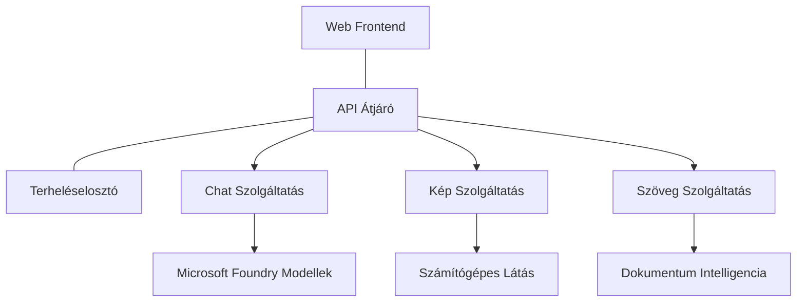

# Termelési AI munkaterhelés legjobb gyakorlatok AZD-vel

**Fejezet navigáció:**
- **📚 Kurzus kezdőlap**: [AZD Kezdőknek](../../README.md)
- **📖 Aktuális fejezet**: 8. fejezet - Termelési és vállalati minták
- **⬅️ Előző fejezet**: [7. fejezet: Hibakeresés](../chapter-07-troubleshooting/debugging.md)
- **⬅️ Kapcsolódó**: [AI Műhely Labor](ai-workshop-lab.md)
- **🎯 Kurzus befejezve**: [AZD Kezdőknek](../../README.md)

## Áttekintés

Ez az útmutató átfogó legjobb gyakorlatokat kínál termelésre kész AI munkaterhelések telepítéséhez az Azure Developer CLI (AZD) segítségével. A Microsoft Foundry Discord közösség visszajelzései és valós ügyféltelepítések alapján ezek a gyakorlatok a termelési AI rendszerek leggyakoribb kihívásait kezelik.

## Megoldott kulcskihívások

Közösségi szavazásunk eredményei alapján a fejlesztők legfontosabb kihívásai:

- **45%** küzd több szolgáltatást magába foglaló AI telepítéssel
- **38%** hitelesítési és titkos kezelési problémákkal  
- **35%** nehézséget okoz a termelési készültség és skálázás
- **32%** jobb költségoptimalizálási stratégiákra van szükségük
- **29%** fejlettebb monitorozást és hibakeresést igényelnek

## Termelési AI architektúra minták

### Minta 1: Mikro-szolgáltatások AI architektúrája

**Mikor használjuk**: Összetett AI alkalmazások esetén, több funkcióval


**AZD megvalósítás**:

```yaml
# azure.yaml
name: enterprise-ai-platform
services:
  web:
    project: ./web
    host: staticwebapp
  api-gateway:
    project: ./api-gateway
    host: containerapp
  chat-service:
    project: ./services/chat
    host: containerapp
  vision-service:
    project: ./services/vision
    host: containerapp
  text-service:
    project: ./services/text
    host: containerapp
```

### Minta 2: Esemény-alapú AI feldolgozás

**Mikor használjuk**: Kötegelt feldolgozás, dokumentum elemzés, aszinkron munkafolyamatok

```bicep
// Event Hub for AI processing pipeline
resource eventHub 'Microsoft.EventHub/namespaces@2023-01-01-preview' = {
  name: eventHubNamespaceName
  location: location
  sku: {
    name: 'Standard'
    tier: 'Standard'
    capacity: 1
  }
}

// Service Bus for reliable message processing
resource serviceBus 'Microsoft.ServiceBus/namespaces@2022-10-01-preview' = {
  name: serviceBusNamespaceName
  location: location
  sku: {
    name: 'Premium'
    tier: 'Premium'
    capacity: 1
  }
}

// Function App for processing
resource functionApp 'Microsoft.Web/sites@2023-01-01' = {
  name: functionAppName
  location: location
  kind: 'functionapp,linux'
  properties: {
    siteConfig: {
      appSettings: [
        {
          name: 'FUNCTIONS_EXTENSION_VERSION'
          value: '~4'
        }
        {
          name: 'AZURE_OPENAI_ENDPOINT'
          value: '@Microsoft.KeyVault(VaultName=${keyVault.name};SecretName=openai-endpoint)'
        }
      ]
    }
  }
}
```

## Gondolkodás az AI ügynök egészségéről

Ha egy hagyományos webalkalmazás meghibásodik, a tünetek ismertek: egy oldal nem töltődik be, egy API hibát ad vissza, vagy egy telepítés nem sikerül. Az AI által vezérelt alkalmazások hasonló módon hibásodhatnak meg—de előfordulhat, hogy finomabb módon viselkednek helytelenül, amelyek nem produkálnak egyértelmű hibajelzéseket.

Ez a rész segít felépíteni egy mentális modellt az AI munkaterhelések monitorozásához, hogy tudd, hol keresd a problémákat, amikor valami nem tűnik rendben lévőnek.

### Hogyan különbözik az ügynök egészsége a hagyományos alkalmazás egészségétől

Egy hagyományos alkalmazás vagy működik, vagy nem. Egy AI ügynök úgy tűnhet, hogy működik, de rossz eredményeket adhat. Az ügynök egészségét két rétegben érdemes gondolkodni:

| Réteg | Mit figyeljünk | Hol keressük |
|-------|----------------|--------------|
| **Infrastruktúra egészsége** | Fut-e a szolgáltatás? Ki vannak-e osztva az erőforrások? Elérhetők az végpontok? | `azd monitor`, Azure Portal erőforrás egészség, konténer/app naplók |
| **Viselkedési egészség** | Pontosan válaszol az ügynök? Időben érkeznek a válaszok? Helyesen hívják a modellt? | Application Insights trace-ek, modell hívási késleltetés, válaszminőség naplók |

Az infrastruktúra egészsége ismerős - ez minden azd alkalmazásnál ugyanaz. A viselkedési egészség az az új réteg, amit az AI munkaterhelések vezetnek be.

### Hol keressük, ha az AI alkalmazások nem úgy viselkednek, ahogy kellene

Ha az AI alkalmazásod nem a várt eredményeket hozza, itt egy fogalmi ellenőrzőlista:

1. **Kezdd az alapokkal.** Fut az alkalmazás? Eléri a függőségeit? Ellenőrizd az `azd monitor`-t és az erőforrás egészséget, ahogy bármely alkalmazásnál tennéd.
2. **Ellenőrizd a modell kapcsolatot.** Az alkalmazás sikeresen hívja-e az AI modellt? Sikertelen vagy időtúllépéses modell hívások a leggyakoribb AI alkalmazás problémák oka, és megjelennek az alkalmazás naplóiban.
3. **Nézd meg, mit kapott a modell.** Az AI válaszok a bemenettől függenek (a prompt és a lekért kontextus). Ha a kimenet helytelen, a bemenet általában hibás. Ellenőrizd, hogy az alkalmazás a megfelelő adatot küldi-e a modellnek.
4. **Vizsgáld meg a válasz késését.** Az AI modell hívások lassabbak, mint a tipikus API hívások. Ha az alkalmazás lassúnak érződik, nézd meg, nem nőtt-e meg a válaszidő — ez jelezheti a korlátozást, kapacitáskorlátokat vagy régiószintű terheltséget.
5. **Figyeld meg a költségjelzéseket.** Váratlan felhasználási vagy API hívási kiugrások jelezhetnek végtelen ciklust, rosszul konfigurált promptot vagy túlzott újrapróbálkozásokat.

Nem kell rögtön mesterévé válnod az észlelhetőségi eszközöknek. A legfontosabb tanulság, hogy az AI alkalmazásoknál egy plusz viselkedési réteget is monitorozni kell, és az azd beépített monitorozója (`azd monitor`) jó kiindulópontot ad mindkét réteg vizsgálatához.

---

## Biztonsági legjobb gyakorlatok

### 1. Zero-Trust biztonsági modell

**Megvalósítási stratégia**:
- Szolgáltatás közötti kommunikáció hitelesítés nélkül nem engedélyezett
- Minden API hívás kezelt identitásokat használ
- Hálózati elszigetelés privát végpontokkal
- Legkisebb jogosultság elvének alkalmazása

```bicep
// Managed Identity for each service
resource chatServiceIdentity 'Microsoft.ManagedIdentity/userAssignedIdentities@2023-01-31' = {
  name: 'chat-service-identity'
  location: location
}

// Role assignments with minimal permissions
resource openAIUserRole 'Microsoft.Authorization/roleAssignments@2022-04-01' = {
  scope: openAIAccount
  name: guid(openAIAccount.id, chatServiceIdentity.id, openAIUserRoleDefinitionId)
  properties: {
    roleDefinitionId: subscriptionResourceId('Microsoft.Authorization/roleDefinitions', '5e0bd9bd-7b93-4f28-af87-19fc36ad61bd')
    principalId: chatServiceIdentity.properties.principalId
    principalType: 'ServicePrincipal'
  }
}
```

### 2. Biztonságos titokkezelés

**Key Vault integrációs minta**:

```bicep
// Key Vault with proper access policies
resource keyVault 'Microsoft.KeyVault/vaults@2023-02-01' = {
  name: keyVaultName
  location: location
  properties: {
    tenantId: tenant().tenantId
    sku: {
      family: 'A'
      name: 'premium'  // Use premium for production
    }
    enableRbacAuthorization: true  // Use RBAC instead of access policies
    enablePurgeProtection: true    // Prevent accidental deletion
    enableSoftDelete: true
    softDeleteRetentionInDays: 90
  }
}

// Store all AI service credentials
resource openAIKeySecret 'Microsoft.KeyVault/vaults/secrets@2023-02-01' = {
  parent: keyVault
  name: 'openai-api-key'
  properties: {
    value: openAIAccount.listKeys().key1
    attributes: {
      enabled: true
    }
  }
}
```

### 3. Hálózati biztonság

**Privát végpont konfiguráció**:

```bicep
// Virtual Network for AI services
resource virtualNetwork 'Microsoft.Network/virtualNetworks@2023-04-01' = {
  name: vnetName
  location: location
  properties: {
    addressSpace: {
      addressPrefixes: ['10.0.0.0/16']
    }
    subnets: [
      {
        name: 'ai-services-subnet'
        properties: {
          addressPrefix: '10.0.1.0/24'
          privateEndpointNetworkPolicies: 'Disabled'
        }
      }
      {
        name: 'app-services-subnet'
        properties: {
          addressPrefix: '10.0.2.0/24'
          delegations: [
            {
              name: 'Microsoft.Web/serverFarms'
              properties: {
                serviceName: 'Microsoft.Web/serverFarms'
              }
            }
          ]
        }
      }
    ]
  }
}

// Private endpoints for all AI services
resource openAIPrivateEndpoint 'Microsoft.Network/privateEndpoints@2023-04-01' = {
  name: '${openAIAccountName}-pe'
  location: location
  properties: {
    subnet: {
      id: virtualNetwork.properties.subnets[0].id
    }
    privateLinkServiceConnections: [
      {
        name: 'openai-connection'
        properties: {
          privateLinkServiceId: openAIAccount.id
          groupIds: ['account']
        }
      }
    ]
  }
}
```

## Teljesítmény és skálázás

### 1. Automatikus skálázási stratégiák

**Container Apps automatikus skálázás**:

```bicep
resource containerApp 'Microsoft.App/containerApps@2023-05-01' = {
  name: containerAppName
  location: location
  properties: {
    configuration: {
      ingress: {
        external: true
        targetPort: 8000
        transport: 'http'
      }
    }
    template: {
      scale: {
        minReplicas: 2  // Always have 2 instances minimum
        maxReplicas: 50 // Scale up to 50 for high load
        rules: [
          {
            name: 'http-scaling'
            http: {
              metadata: {
                concurrentRequests: '20'  // Scale when >20 concurrent requests
              }
            }
          }
          {
            name: 'cpu-scaling'
            custom: {
              type: 'cpu'
              metadata: {
                type: 'Utilization'
                value: '70'  // Scale when CPU >70%
              }
            }
          }
        ]
      }
    }
  }
}
```

### 2. Gyorsítótárazási stratégiák

**Redis gyorsítótár AI válaszokhoz**:

```bicep
// Redis Premium for production workloads
resource redisCache 'Microsoft.Cache/redis@2023-04-01' = {
  name: redisCacheName
  location: location
  properties: {
    sku: {
      name: 'Premium'
      family: 'P'
      capacity: 1
    }
    enableNonSslPort: false
    minimumTlsVersion: '1.2'
    redisConfiguration: {
      'maxmemory-policy': 'allkeys-lru'
    }
    // Enable clustering for high availability
    redisVersion: '6.0'
    shardCount: 2
  }
}

// Cache configuration in application
var cacheConnectionString = '${redisCache.properties.hostName}:6380,password=${redisCache.listKeys().primaryKey},ssl=True,abortConnect=False'
```

### 3. Terhelés elosztás és forgalomkezelés

**Application Gateway WAF-fal**:

```bicep
// Application Gateway with Web Application Firewall
resource applicationGateway 'Microsoft.Network/applicationGateways@2023-04-01' = {
  name: appGatewayName
  location: location
  properties: {
    sku: {
      name: 'WAF_v2'
      tier: 'WAF_v2'
      capacity: 2
    }
    webApplicationFirewallConfiguration: {
      enabled: true
      firewallMode: 'Prevention'
      ruleSetType: 'OWASP'
      ruleSetVersion: '3.2'
    }
    // Backend pools for AI services
    backendAddressPools: [
      {
        name: 'ai-services-pool'
        properties: {
          backendAddresses: [
            {
              fqdn: '${containerApp.properties.configuration.ingress.fqdn}'
            }
          ]
        }
      }
    ]
  }
}
```

## 💰 Költségoptimalizálás

### 1. Erőforrások megfelelő méretezése

**Környezetspecifikus konfigurációk**:

```bash
# Fejlesztői környezet
azd env new development
azd env set AZURE_OPENAI_SKU "S0"
azd env set AZURE_OPENAI_CAPACITY 10
azd env set AZURE_SEARCH_SKU "basic"
azd env set CONTAINER_CPU 0.5
azd env set CONTAINER_MEMORY 1.0

# Termelési környezet
azd env new production
azd env set AZURE_OPENAI_SKU "S0"
azd env set AZURE_OPENAI_CAPACITY 100
azd env set AZURE_SEARCH_SKU "standard"
azd env set CONTAINER_CPU 2.0
azd env set CONTAINER_MEMORY 4.0
```

### 2. Költségmonitorozás és költségkeretek

```bicep
// Cost management and budgets
resource budget 'Microsoft.Consumption/budgets@2023-05-01' = {
  name: 'ai-workload-budget'
  properties: {
    timePeriod: {
      startDate: '2024-01-01'
      endDate: '2024-12-31'
    }
    timeGrain: 'Monthly'
    amount: 2000  // $2000 monthly budget
    category: 'Cost'
    notifications: {
      warning: {
        enabled: true
        operator: 'GreaterThan'
        threshold: 80
        contactEmails: [
          'finance@company.com'
          'engineering@company.com'
        ]
        contactRoles: [
          'Owner'
          'Contributor'
        ]
      }
      critical: {
        enabled: true
        operator: 'GreaterThan'
        threshold: 95
        contactEmails: [
          'cto@company.com'
        ]
      }
    }
  }
}
```

### 3. Token használat optimalizálása

**OpenAI költségkezelés**:

```typescript
// Alkalmazásszintű token optimalizáció
class TokenOptimizer {
  private readonly maxTokens = 4000;
  private readonly reserveTokens = 500;
  
  optimizePrompt(userInput: string, context: string): string {
    const availableTokens = this.maxTokens - this.reserveTokens;
    const estimatedTokens = this.estimateTokens(userInput + context);
    
    if (estimatedTokens > availableTokens) {
      // Kontextus lekicsinyítése, nem a felhasználói bemeneté
      context = this.truncateContext(context, availableTokens - this.estimateTokens(userInput));
    }
    
    return `${context}\n\nUser: ${userInput}`;
  }
  
  private estimateTokens(text: string): number {
    // Durva becslés: 1 token ≈ 4 karakter
    return Math.ceil(text.length / 4);
  }
}
```

## Monitorozás és észlelhetőség

### 1. Átfogó Application Insights

```bicep
// Application Insights with advanced features
resource applicationInsights 'Microsoft.Insights/components@2020-02-02' = {
  name: applicationInsightsName
  location: location
  kind: 'web'
  properties: {
    Application_Type: 'web'
    WorkspaceResourceId: logAnalyticsWorkspace.id
    SamplingPercentage: 100  // Full sampling for AI apps
    DisableIpMasking: false  // Enable for security
  }
}

// Custom metrics for AI operations
resource aiMetricAlerts 'Microsoft.Insights/metricAlerts@2018-03-01' = {
  name: 'ai-high-error-rate'
  location: 'global'
  properties: {
    description: 'Alert when AI service error rate is high'
    severity: 2
    enabled: true
    scopes: [
      applicationInsights.id
    ]
    evaluationFrequency: 'PT1M'
    windowSize: 'PT5M'
    criteria: {
      'odata.type': 'Microsoft.Azure.Monitor.SingleResourceMultipleMetricCriteria'
      allOf: [
        {
          name: 'high-error-rate'
          metricName: 'requests/failed'
          operator: 'GreaterThan'
          threshold: 10
          timeAggregation: 'Count'
        }
      ]
    }
  }
}
```

### 2. AI-specifikus monitorozás

**Egyedi műszerfalak AI mérőszámokhoz**:

```json
// Dashboard configuration for AI workloads
{
  "dashboard": {
    "name": "AI Application Monitoring",
    "tiles": [
      {
        "name": "OpenAI Request Volume",
        "query": "requests | where name contains 'openai' | summarize count() by bin(timestamp, 5m)"
      },
      {
        "name": "AI Response Latency",
        "query": "requests | where name contains 'openai' | summarize avg(duration) by bin(timestamp, 5m)"
      },
      {
        "name": "Token Usage",
        "query": "customMetrics | where name == 'openai_tokens_used' | summarize sum(value) by bin(timestamp, 1h)"
      },
      {
        "name": "Cost per Hour",
        "query": "customMetrics | where name == 'openai_cost' | summarize sum(value) by bin(timestamp, 1h)"
      }
    ]
  }
}
```

### 3. Állapotellenőrzések és rendelkezésre állás

```bicep
// Application Insights availability tests
resource availabilityTest 'Microsoft.Insights/webtests@2022-06-15' = {
  name: 'ai-app-availability-test'
  location: location
  tags: {
    'hidden-link:${applicationInsights.id}': 'Resource'
  }
  properties: {
    SyntheticMonitorId: 'ai-app-availability-test'
    Name: 'AI Application Availability Test'
    Description: 'Tests AI application endpoints'
    Enabled: true
    Frequency: 300  // 5 minutes
    Timeout: 120    // 2 minutes
    Kind: 'ping'
    Locations: [
      {
        Id: 'us-east-2-azr'
      }
      {
        Id: 'us-west-2-azr'
      }
    ]
    Configuration: {
      WebTest: '''
        <WebTest Name="AI Health Check" 
                 Id="8d2de8d2-a2b0-4c2e-9a0d-8f9c9a0b8c8d" 
                 Enabled="True" 
                 CssProjectStructure="" 
                 CssIteration="" 
                 Timeout="120" 
                 WorkItemIds="" 
                 xmlns="http://microsoft.com/schemas/VisualStudio/TeamTest/2010" 
                 Description="" 
                 CredentialUserName="" 
                 CredentialPassword="" 
                 PreAuthenticate="True" 
                 Proxy="default" 
                 StopOnError="False" 
                 RecordedResultFile="" 
                 ResultsLocale="">
          <Items>
            <Request Method="GET" 
                     Guid="a5f10126-e4cd-570d-961c-cea43999a200" 
                     Version="1.1" 
                     Url="${webApp.properties.defaultHostName}/health" 
                     ThinkTime="0" 
                     Timeout="120" 
                     ParseDependentRequests="True" 
                     FollowRedirects="True" 
                     RecordResult="True" 
                     Cache="False" 
                     ResponseTimeGoal="0" 
                     Encoding="utf-8" 
                     ExpectedHttpStatusCode="200" 
                     ExpectedResponseUrl="" 
                     ReportingName="" 
                     IgnoreHttpStatusCode="False" />
          </Items>
        </WebTest>
      '''
    }
  }
}
```

## Katasztrófa helyreállítás és magas rendelkezésre állás

### 1. Többrégiós telepítés

```yaml
# azure.yaml - Multi-region configuration
name: ai-app-multiregion
services:
  api-primary:
    project: ./api
    host: containerapp
    env:
      - AZURE_REGION=eastus
  api-secondary:
    project: ./api
    host: containerapp
    env:
      - AZURE_REGION=westus2
```

```bicep
// Traffic Manager for global load balancing
resource trafficManager 'Microsoft.Network/trafficManagerProfiles@2022-04-01' = {
  name: trafficManagerProfileName
  location: 'global'
  properties: {
    profileStatus: 'Enabled'
    trafficRoutingMethod: 'Priority'
    dnsConfig: {
      relativeName: trafficManagerProfileName
      ttl: 30
    }
    monitorConfig: {
      protocol: 'HTTPS'
      port: 443
      path: '/health'
      intervalInSeconds: 30
      toleratedNumberOfFailures: 3
      timeoutInSeconds: 10
    }
    endpoints: [
      {
        name: 'primary-endpoint'
        type: 'Microsoft.Network/trafficManagerProfiles/azureEndpoints'
        properties: {
          targetResourceId: primaryAppService.id
          endpointStatus: 'Enabled'
          priority: 1
        }
      }
      {
        name: 'secondary-endpoint'
        type: 'Microsoft.Network/trafficManagerProfiles/azureEndpoints'
        properties: {
          targetResourceId: secondaryAppService.id
          endpointStatus: 'Enabled'
          priority: 2
        }
      }
    ]
  }
}
```

### 2. Adatmentés és helyreállítás

```bicep
// Backup configuration for critical data
resource backupVault 'Microsoft.DataProtection/backupVaults@2023-05-01' = {
  name: backupVaultName
  location: location
  identity: {
    type: 'SystemAssigned'
  }
  properties: {
    storageSettings: [
      {
        datastoreType: 'VaultStore'
        type: 'LocallyRedundant'
      }
    ]
  }
}

// Backup policy for AI models and data
resource backupPolicy 'Microsoft.DataProtection/backupVaults/backupPolicies@2023-05-01' = {
  parent: backupVault
  name: 'ai-data-backup-policy'
  properties: {
    policyRules: [
      {
        backupParameters: {
          backupType: 'Full'
          objectType: 'AzureBackupParams'
        }
        trigger: {
          schedule: {
            repeatingTimeIntervals: [
              'R/2024-01-01T02:00:00+00:00/P1D'  // Daily at 2 AM
            ]
          }
          objectType: 'ScheduleBasedTriggerContext'
        }
        dataStore: {
          datastoreType: 'VaultStore'
          objectType: 'DataStoreInfoBase'
        }
        name: 'BackupDaily'
        objectType: 'AzureBackupRule'
      }
    ]
  }
}
```

## DevOps és CI/CD integráció

### 1. GitHub Actions munkafolyamat

```yaml
# .github/workflows/deploy-ai-app.yml
name: Deploy AI Application

on:
  push:
    branches: [main]
  pull_request:
    branches: [main]

jobs:
  test:
    runs-on: ubuntu-latest
    steps:
      - uses: actions/checkout@v4
      
      - name: Setup Python
        uses: actions/setup-python@v4
        with:
          python-version: '3.11'
          
      - name: Install dependencies
        run: |
          pip install -r requirements.txt
          pip install pytest
          
      - name: Run tests
        run: pytest tests/
        
      - name: AI Safety Tests
        run: |
          python scripts/test_ai_safety.py
          python scripts/validate_prompts.py

  deploy-staging:
    needs: test
    if: github.event_name == 'pull_request'
    runs-on: ubuntu-latest
    steps:
      - uses: actions/checkout@v4
      
      - name: Setup AZD
        uses: Azure/setup-azd@v1.0.0
        
      - name: Login to Azure
        uses: azure/login@v1
        with:
          creds: ${{ secrets.AZURE_CREDENTIALS }}
          
      - name: Deploy to Staging
        run: |
          azd env select staging
          azd deploy

  deploy-production:
    needs: test
    if: github.ref == 'refs/heads/main'
    runs-on: ubuntu-latest
    steps:
      - uses: actions/checkout@v4
      
      - name: Setup AZD
        uses: Azure/setup-azd@v1.0.0
        
      - name: Login to Azure
        uses: azure/login@v1
        with:
          creds: ${{ secrets.AZURE_CREDENTIALS }}
          
      - name: Deploy to Production
        run: |
          azd env select production
          azd deploy
          
      - name: Run Production Health Checks
        run: |
          python scripts/health_check.py --env production
```

### 2. Infrastruktúra validáció

```bash
# scripts/validate_infrastructure.sh
#!/bin/bash

echo "Validating AI infrastructure deployment..."

# Ellenőrizze, hogy az összes szükséges szolgáltatás fut-e
services=("openai" "search" "storage" "keyvault")
for service in "${services[@]}"; do
    echo "Checking $service..."
    if ! az resource list --resource-type "Microsoft.CognitiveServices/accounts" --query "[?contains(name, '$service')]" -o tsv; then
        echo "ERROR: $service not found"
        exit 1
    fi
done

# Ellenőrizze az OpenAI modell telepítéseket
echo "Validating OpenAI model deployments..."
models=$(az cognitiveservices account deployment list --name $AZURE_OPENAI_NAME --resource-group $AZURE_RESOURCE_GROUP --query "[].name" -o tsv)
if [[ ! $models == *"gpt-35-turbo"* ]]; then
    echo "ERROR: Required model gpt-35-turbo not deployed"
    exit 1
fi

# Tesztelje az AI szolgáltatás kapcsolódását
echo "Testing AI service connectivity..."
python scripts/test_connectivity.py

echo "Infrastructure validation completed successfully!"
```

## Termelési készültségi ellenőrzőlista

### Biztonság ✅
- [ ] Minden szolgáltatás kezelt identitásokat használ
- [ ] Titkok a Key Vault-ban tárolva
- [ ] Privát végpontok konfigurálva
- [ ] Hálózati biztonsági csoportok megvalósítva
- [ ] RBAC legkisebb jogosultsággal
- [ ] WAF engedélyezve a publikus végpontokon

### Teljesítmény ✅
- [ ] Automatikus skálázás beállítva
- [ ] Gyorsítótárazás megvalósítva
- [ ] Terheléseloszlás beállítva
- [ ] CDN statikus tartalmakhoz
- [ ] Adatbázis kapcsolat-poolozás
- [ ] Token használat optimalizálása

### Monitorozás ✅
- [ ] Application Insights konfigurálva
- [ ] Egyedi metrikák definiálva
- [ ] Értesítési szabályok beállítva
- [ ] Műszerfal létrehozva
- [ ] Állapotellenőrzések implementálva
- [ ] Naplómegőrzési szabályok

### Megbízhatóság ✅
- [ ] Többrégiós telepítés
- [ ] Mentési és helyreállítási terv
- [ ] Kapcsolókörök implementálva
- [ ] Újrapróbálkozási szabályok beállítva
- [ ] Szépen degradálódó működés
- [ ] Állapotellenőrző végpontok

### Költségmenedzsment ✅
- [ ] Költségkeret riasztások beállítva
- [ ] Erőforrások helyes méretezése
- [ ] Fejlesztési/teszt kedvezmények érvényesítve
- [ ] Lefoglalt példányok vásárlása
- [ ] Költségmonitorozó műszerfal
- [ ] Rendszeres költségáttekintések

### Megfelelés ✅
- [ ] Adathely-megfelelőségi követelmények teljesülnek
- [ ] Audit naplózás engedélyezve
- [ ] Megfelelőségi szabályzatok alkalmazva
- [ ] Biztonsági alapértékek implementálva
- [ ] Rendszeres biztonsági értékelések
- [ ] Incidenskezelési terv

## Teljesítmény mutatók

### Tipikus termelési metrikák

| Metrika | Célérték | Monitorozás |
|---------|----------|-------------|
| **Válaszidő** | < 2 másodperc | Application Insights |
| **Rendelkezésre állás** | 99,9% | Rendelkezésre állás monitorozás |
| **Hibaarány** | < 0,1% | Alkalmazás naplók |
| **Token használat** | < 500 $/hó | Költségkezelés |
| **Egyidejű felhasználók** | 1000+ | Terhelés teszt |
| **Helyreállítási idő** | < 1 óra | Katasztrófa helyreállítás tesztek |

### Terhelés tesztelés

```bash
# Betöltési teszt szkript AI alkalmazásokhoz
python scripts/load_test.py \
  --endpoint https://your-ai-app.azurewebsites.net \
  --concurrent-users 100 \
  --duration 300 \
  --ramp-up 60
```

## 🤝 Közösségi legjobb gyakorlatok

A Microsoft Foundry Discord közösség visszajelzései alapján:

### A közösség fő ajánlásai:

1. **Kezdj kicsiben, méretezz fokozatosan**: Alap SKU-kkal indulj, és a tényleges használat alapján skálázz
2. **Figyelj mindent**: Átfogó monitorozást állíts be az első naptól
3. **Automatizáld a biztonságot**: Használj infrastruktúrát kódként a következetes biztonságért
4. **Tesztelj alaposan**: Vond be az AI-specifikus teszteket a pipeline-ba
5. **Tervezd a költségeket**: Figyeld a token használatot és állíts be költség riasztásokat korán

### Gyakori buktatók elkerülése:

- ❌ API kulcsok keménykódolása a kódban
- ❌ Megfelelő monitorozás hiánya
- ❌ Költségoptimalizálás figyelmen kívül hagyása
- ❌ Hibaszcenáriók tesztelésének elhanyagolása
- ❌ Telepítés egészségellenőrzések nélkül

## AZD AI CLI parancsok és kiterjesztések

Az AZD egyre bővülő készletet kínál AI-specifikus parancsokból és kiterjesztésekből, amelyek egyszerűsítik a termelési AI munkafolyamatokat. Ezek az eszközök hidat képeznek a helyi fejlesztés és a termelési telepítés között AI munkaterhelések esetén.

### AZD kiterjesztések AI-hoz

AZD kiterjesztési rendszert használ az AI-specifikus képességek hozzáadásához. Telepítsd és kezeld a kiterjesztéseket ezzel:

```bash
# Sorolja fel az összes elérhető bővítményt (beleértve az AI-t is)
azd extension list

# Telepítse a Foundry agents bővítményt
azd extension install azure.ai.agents

# Telepítse a finomhangolás bővítményt
azd extension install azure.ai.finetune

# Telepítse az egyedi modellek bővítményt
azd extension install azure.ai.models

# Frissítsen minden telepített bővítményt
azd extension upgrade --all
```

**Elérhető AI kiterjesztések:**

| Kiterjesztés | Cél | Állapot |
|--------------|-----|---------|
| `azure.ai.agents` | Foundry Agent Service menedzsment | Előzetes |
| `azure.ai.finetune` | Foundry modell finomhangolás | Előzetes |
| `azure.ai.models` | Foundry egyedi modellek | Előzetes |
| `azure.coding-agent` | Kódoló ügynök konfiguráció | Elérhető |

### Ügynök projektek inicializálása `azd ai agent init` segítségével

Az `azd ai agent init` parancs termelésre kész AI ügynök projektet generál, amely integrált a Microsoft Foundry Agent Service-szel:

```bash
# Új ügynök projekt inicializálása egy ügynök leírófájlból
azd ai agent init -m <manifest-path-or-uri>

# Egy adott Foundry projekt inicializálása és célzása
azd ai agent init -m agent-manifest.yaml --project-id <foundry-project-id>

# Egyedi forráskönyvtárral inicializálás
azd ai agent init -m agent-manifest.yaml --src ./agents/my-agent

# Container Apps megcélzása gazdaként
azd ai agent init -m agent-manifest.yaml --host containerapp
```

**Fontos jelzők:**

| Jelző | Leírás |
|-------|--------|
| `-m, --manifest` | Az ügynök manifest elérési útja vagy URI-ja a projektedhez |
| `-p, --project-id` | Létező Microsoft Foundry projektazonosító az azd környezetedhez |
| `-s, --src` | Könyvtár az ügynök definíció letöltéséhez (alapértelmezett: `src/<agent-id>`) |
| `--host` | Alapértelmezett hoszt felülírása (pl. `containerapp`) |
| `-e, --environment` | Az azd környezet megadása |

**Termelési tipp**: Használd a `--project-id` opciót, hogy közvetlenül kapcsolódj egy meglévő Foundry projekthez, így az ügynök kódod és a felhő erőforrásaid azonnal összekapcsolódnak.

### Model Kontextus Protokoll (MCP) az `azd mcp`-vel

Az AZD beépített MCP szervert kínál (Alpha), amely lehetővé teszi az AI ügynökök és eszközök számára, hogy szabványosított protokollon keresztül kommunikáljanak az Azure erőforrásaiddal:

```bash
# Indítsa el az MCP szervert a projektjéhez
azd mcp start

# Kezelje az eszköz beleegyezést az MCP műveletekhez
azd mcp consent
```

Az MCP szerver elérhetővé teszi az azd projekted kontextusát—környezetek, szolgáltatások és Azure erőforrások—AI-alapú fejlesztői eszközök számára. Ez lehetővé teszi:

- **AI-támogatott telepítést**: Kódoló ügynökök lekérdezhetik a projekt állapotát és indíthatnak telepítéseket
- **Erőforrás felfedezést**: AI eszközök felfedezhetik, milyen Azure erőforrásokat használ a projekt
- **Környezet menedzsmentet**: Ügynökök válthatnak fejlesztői/staging/termelési környezetek között

### Infrastruktúra generálás az `azd infra generate`-bel

Termelési AI munkaterhelésekhez generálhatsz és testreszabhatsz Infrastrukturát Kódként, ahelyett, hogy automatikus kiosztásra hagyatkoznál:

```bash
# Hozzon létre Bicep/Terraform fájlokat a projekt definíciójából
azd infra generate
```

Ez diszkre írja az IaC-t, így:
- Átnézheted és auditálhatod az infrastruktúrát telepítés előtt
- Hozzáadhatsz egyedi biztonsági szabályokat (hálózati szabályok, privát végpontok)
- Integrálhatod meglévő IaC átvizsgálási folyamatokkal
- Verziókezelheted az infrastruktúra változásait külön az alkalmazáskódtól

### Termelési életciklus horogok

Az AZD horogok lehetővé teszik egyedi logikák beillesztését a telepítési életciklus minden lépésébe—kritikus a termelési AI munkafolyamatokhoz:

```yaml
# azure.yaml - Production hooks example
name: ai-production-app
hooks:
  preprovision:
    shell: sh
    run: scripts/validate-quotas.sh    # Check AI model quota before provisioning
  postprovision:
    shell: sh
    run: scripts/configure-networking.sh  # Set up private endpoints
  predeploy:
    shell: sh
    run: scripts/run-ai-safety-tests.sh  # Run prompt safety checks
  postdeploy:
    shell: sh
    run: scripts/smoke-test.sh           # Verify agent responses post-deploy
services:
  agent-api:
    project: ./src/agent
    host: containerapp
    hooks:
      predeploy:
        shell: sh
        run: scripts/validate-model-access.sh  # Per-service hook
```

```bash
# Run a specific hook manually during development
azd hooks run predeploy
```

**Ajánlott production horogok AI munkaterhelésekhez:**

| Horog | Használati eset |
|-------|-----------------|
| `preprovision` | Előfizetési kvóták ellenőrzése AI modell kapacitáshoz |
| `postprovision` | Privát végpontok konfigurálása, modell súlyok telepítése |
| `predeploy` | AI biztonsági tesztek futtatása, prompt sablonok validálása |
| `postdeploy` | Ügynök válaszok smoke tesztje, modell kapcsolat ellenőrzése |

### CI/CD pipeline konfiguráció

Használd az `azd pipeline config` parancsot projekted összekapcsolására GitHub Actions vagy Azure Pipelines szolgáltatással biztonságos Azure hitelesítéssel:

```bash
# CI/CD csővezeték konfigurálása (interaktív)
azd pipeline config

# Konfigurálás egy adott szolgáltatóval
azd pipeline config --provider github
```

Ez a parancs:
- Létrehoz egy legkisebb jogosultságú szolgáltatói identitást
- Konfigurálja a szövetségi hitelesítést (titkok tárolása nélkül)
- Generálja vagy frissíti a pipeline definíciós fájlt
- Beállítja a szükséges környezeti változókat a CI/CD rendszeren

**Termelési munkafolyamat pipeline konfigurációval:**

```bash
# 1. Állítsa be a termelési környezetet
azd env new production
azd env set AZURE_OPENAI_CAPACITY 100

# 2. Állítsa be a pipeline-t
azd pipeline config --provider github

# 3. A pipeline minden push esetén lefuttatja az azd deploy-t a main ágon
```

### Komponensek hozzáadása az `azd add`-dal

Fokozatosan adhatsz Azure szolgáltatásokat meglévő projekthez:

```bash
# Új szolgáltatáskomponenst adjon hozzá interaktívan
azd add
```

Ez különösen hasznos termelési AI alkalmazások bővítéséhez—for például vektoros kereső szolgáltatás, új ügynök végpont, vagy monitorozó komponens hozzáadása meglévő telepítéshez.

## További források
- **Azure Jól megalapozott keretrendszer**: [AI munkaterhelés útmutató](https://learn.microsoft.com/azure/well-architected/ai/)
- **Microsoft Foundry Dokumentáció**: [Hivatalos dokumentumok](https://learn.microsoft.com/azure/ai-studio/)
- **Közösségi sablonok**: [Azure minták](https://github.com/Azure-Samples)
- **Discord közösség**: [#Azure csatorna](https://discord.gg/microsoft-azure)
- **Agent Skills for Azure**: [microsoft/github-copilot-for-azure a skills.sh oldalon](https://skills.sh/microsoft/github-copilot-for-azure) - 37 nyitott agent képesség az Azure AI, Foundry, telepítés, költségoptimalizálás és diagnosztika témákban. Telepítsd az eszközödbe:
  ```bash
  npx skills add microsoft/github-copilot-for-azure
  ```

---

**Fejezet navigáció:**
- **📚 Tanfolyam kezdőlap**: [AZD Kezdőknek](../../README.md)
- **📖 Jelenlegi fejezet**: 8. fejezet - Termelési és vállalati minták
- **⬅️ Előző fejezet**: [7. fejezet: Hibakeresés](../chapter-07-troubleshooting/debugging.md)
- **⬅️ Kapcsolódó**: [AI workshop labor](ai-workshop-lab.md)
- **� Tanfolyam befejezve**: [AZD Kezdőknek](../../README.md)

**Ne feledd**: A termelési AI munkaterhelésekhez alapos tervezés, figyelés és folyamatos optimalizálás szükséges. Kezdd ezekkel a mintákkal, és igazítsd őket a saját igényeidhez.

---

<!-- CO-OP TRANSLATOR DISCLAIMER START -->
**Kizáró nyilatkozat**:  
Ez a dokumentum az AI fordító szolgáltatás, a [Co-op Translator](https://github.com/Azure/co-op-translator) segítségével készült. Bár az igyekszünk a pontosságra, kérjük, vegye figyelembe, hogy az automatikus fordítások hibákat vagy pontatlanságokat tartalmazhatnak. Az eredeti dokumentum a saját nyelvén tekintendő hiteles forrásnak. Kritikus információk esetén professzionális emberi fordítást javaslunk. Nem vállalunk felelősséget a fordítás használatából eredő félreértésekért vagy téves értelmezésekért.
<!-- CO-OP TRANSLATOR DISCLAIMER END -->