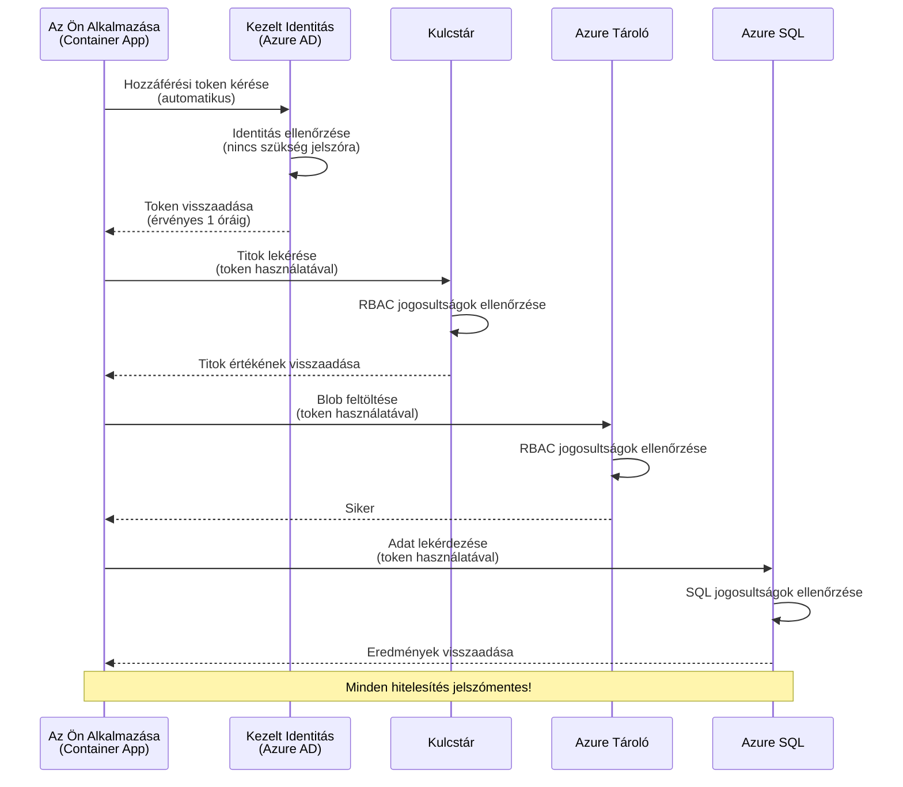
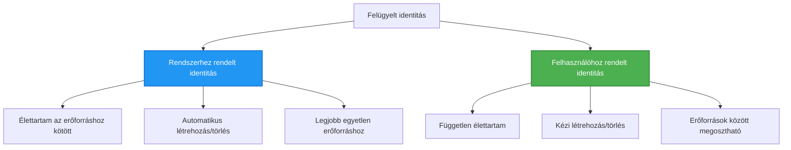

<!--
CO_OP_TRANSLATOR_METADATA:
{
  "original_hash": "e13ff6e1197e0a7462ed0aede7df9f23",
  "translation_date": "2025-11-23T13:21:08+00:00",
  "source_file": "docs/getting-started/authsecurity.md",
  "language_code": "hu"
}
-->
# Hitelesítési minták és kezelt identitás

⏱️ **Becsült idő**: 45-60 perc | 💰 **Költséghatás**: Ingyenes (nincs további díj) | ⭐ **Komplexitás**: Középhaladó

**📚 Tanulási útvonal:**
- ← Előző: [Konfigurációkezelés](configuration.md) - Környezeti változók és titkok kezelése
- 🎯 **Itt tartasz**: Hitelesítés és biztonság (kezelt identitás, Key Vault, biztonságos minták)
- → Következő: [Első projekt](first-project.md) - Építsd meg az első AZD alkalmazásodat
- 🏠 [Kurzus főoldala](../../README.md)

---

## Amit megtanulsz

A lecke elvégzésével:
- Megérted az Azure hitelesítési mintákat (kulcsok, kapcsolat karakterláncok, kezelt identitás)
- Megvalósítod a **kezelt identitást** jelszó nélküli hitelesítéshez
- Biztonságossá teszed a titkokat az **Azure Key Vault** integrációval
- Konfigurálod az **RBAC-t** (szerepkör-alapú hozzáférés-vezérlés) AZD telepítésekhez
- Alkalmazod a biztonsági legjobb gyakorlatokat a Container Apps és Azure szolgáltatásokban
- Áttérsz kulcs-alapú hitelesítésről identitás-alapú hitelesítésre

## Miért fontos a kezelt identitás?

### A probléma: Hagyományos hitelesítés

**Kezelt identitás előtt:**
```javascript
// ❌ BIZTONSÁGI KOCKÁZAT: Kódba ágyazott titkok
const connectionString = "Server=mydb.database.windows.net;User=admin;Password=P@ssw0rd123";
const storageKey = "xK7mN9pQ2wR5tY8uI0oP3aS6dF1gH4jK...";
const cosmosKey = "C2x7B9n4M1p8Q5w3E6r0T2y5U8i1O4p7...";
```

**Problémák:**
- 🔴 **Kódba, konfigurációs fájlokba, környezeti változókba beágyazott titkok**
- 🔴 **Hitelesítő adatok forgatása** kódváltoztatást és újratelepítést igényel
- 🔴 **Audit rémálmok** - ki fér hozzá, mikor?
- 🔴 **Szétszórtság** - titkok több rendszerben szétszórva
- 🔴 **Megfelelőségi kockázatok** - nem felel meg a biztonsági auditoknak

### A megoldás: Kezelt identitás

**Kezelt identitás után:**
```javascript
// ✅ BIZTONSÁGOS: Nincsenek titkok a kódban
const credential = new DefaultAzureCredential();
const client = new BlobServiceClient(
  "https://mystorageaccount.blob.core.windows.net",
  credential  // Az Azure automatikusan kezeli a hitelesítést
);
```

**Előnyök:**
- ✅ **Nincs titok** a kódban vagy konfigurációban
- ✅ **Automatikus forgatás** - az Azure kezeli
- ✅ **Teljes audit nyomvonal** az Azure AD naplókban
- ✅ **Központosított biztonság** - kezelhető az Azure Portálon
- ✅ **Megfelelőségi kész** - megfelel a biztonsági szabványoknak

**Analógia**: A hagyományos hitelesítés olyan, mint több fizikai kulcsot hordani különböző ajtókhoz. A kezelt identitás olyan, mint egy biztonsági kártya, amely automatikusan hozzáférést biztosít az alapján, hogy ki vagy—nincs kulcs, amit elveszíthetsz, másolhatsz vagy forgathatsz.

---

## Architektúra áttekintése

### Hitelesítési folyamat kezelt identitással


### Kezelt identitások típusai


| Tulajdonság | Rendszerhez rendelt | Felhasználóhoz rendelt |
|-------------|---------------------|------------------------|
| **Életciklus** | Erőforráshoz kötött | Független |
| **Létrehozás** | Automatikus az erőforrással | Manuális létrehozás |
| **Törlés** | Erőforrással törlődik | Megmarad az erőforrás törlése után |
| **Megosztás** | Csak egy erőforrás | Több erőforrás |
| **Felhasználási eset** | Egyszerű forgatókönyvek | Összetett, több erőforrást érintő forgatókönyvek |
| **AZD alapértelmezett** | ✅ Ajánlott | Opcionális |

---

## Előfeltételek

### Szükséges eszközök

A korábbi leckékből már telepítve kell lennie:

```bash
# Ellenőrizze az Azure Developer CLI-t
azd version
# ✅ Várható: azd verzió 1.0.0 vagy magasabb

# Ellenőrizze az Azure CLI-t
az --version
# ✅ Várható: azure-cli 2.50.0 vagy magasabb
```

### Azure követelmények

- Aktív Azure előfizetés
- Jogosultságok:
  - Kezelt identitások létrehozása
  - RBAC szerepkörök hozzárendelése
  - Key Vault erőforrások létrehozása
  - Container Apps telepítése

### Tudás előfeltételek

El kell végezned:
- [Telepítési útmutató](installation.md) - AZD beállítása
- [AZD alapok](azd-basics.md) - Alapfogalmak
- [Konfigurációkezelés](configuration.md) - Környezeti változók

---

## 1. lecke: Hitelesítési minták megértése

### Minta 1: Kapcsolat karakterláncok (Legacy - Kerülendő)

**Hogyan működik:**
```bash
# A kapcsolat karakterlánc tartalmaz hitelesítő adatokat
STORAGE_CONNECTION_STRING="DefaultEndpointsProtocol=https;AccountName=myaccount;AccountKey=xK7mN9pQ2wR5..."
COSMOS_CONNECTION_STRING="AccountEndpoint=https://myaccount.documents.azure.com:443/;AccountKey=C2x7..."
SQL_CONNECTION_STRING="Server=myserver.database.windows.net;User=admin;Password=P@ssw0rd..."
```

**Problémák:**
- ❌ Titkok láthatók a környezeti változókban
- ❌ Naplózva a telepítési rendszerekben
- ❌ Nehéz forgatni
- ❌ Nincs audit nyomvonal a hozzáférésről

**Mikor használjuk:** Csak helyi fejlesztéshez, soha produkcióban.

---

### Minta 2: Key Vault hivatkozások (Jobb)

**Hogyan működik:**
```bicep
// Store secret in Key Vault
resource keyVault 'Microsoft.KeyVault/vaults@2023-02-01' = {
  name: 'mykv'
  properties: {
    enableRbacAuthorization: true
  }
}

// Reference in Container App
env: [
  {
    name: 'STORAGE_KEY'
    secretRef: 'storage-key'  // References Key Vault
  }
]
```

**Előnyök:**
- ✅ Titkok biztonságosan tárolva a Key Vaultban
- ✅ Központosított titokkezelés
- ✅ Forgatás kódváltoztatás nélkül

**Korlátok:**
- ⚠️ Még mindig kulcsokat/jelszavakat használ
- ⚠️ Key Vault hozzáférést kell kezelni

**Mikor használjuk:** Átmeneti lépés a kapcsolat karakterláncoktól a kezelt identitásig.

---

### Minta 3: Kezelt identitás (Legjobb gyakorlat)

**Hogyan működik:**
```bicep
// Enable managed identity
resource containerApp 'Microsoft.App/containerApps@2023-05-01' = {
  name: 'myapp'
  identity: {
    type: 'SystemAssigned'  // Automatically creates identity
  }
}

// Grant permissions
resource roleAssignment 'Microsoft.Authorization/roleAssignments@2022-04-01' = {
  scope: storageAccount
  properties: {
    roleDefinitionId: storageBlobDataContributorRole
    principalId: containerApp.identity.principalId
  }
}
```

**Alkalmazás kód:**
```javascript
// Nincs szükség titkokra!
const { DefaultAzureCredential } = require('@azure/identity');
const { BlobServiceClient } = require('@azure/storage-blob');

const credential = new DefaultAzureCredential();
const blobServiceClient = new BlobServiceClient(
  'https://mystorageaccount.blob.core.windows.net',
  credential
);
```

**Előnyök:**
- ✅ Nincs titok a kódban/konfigurációban
- ✅ Automatikus hitelesítő adat forgatás
- ✅ Teljes audit nyomvonal
- ✅ RBAC-alapú jogosultságok
- ✅ Megfelelőségi kész

**Mikor használjuk:** Mindig, produkciós alkalmazásokhoz.

---

## 2. lecke: Kezelt identitás megvalósítása AZD-vel

### Lépésről lépésre megvalósítás

Építsünk egy biztonságos Container Appot, amely kezelt identitást használ az Azure Storage és Key Vault eléréséhez.

### Projektstruktúra

```
secure-app/
├── azure.yaml                 # AZD configuration
├── infra/
│   ├── main.bicep            # Main infrastructure
│   ├── core/
│   │   ├── identity.bicep    # Managed identity setup
│   │   ├── keyvault.bicep    # Key Vault configuration
│   │   └── storage.bicep     # Storage with RBAC
│   └── app/
│       └── container-app.bicep
└── src/
    ├── app.js                # Application code
    ├── package.json
    └── Dockerfile
```

### 1. AZD konfigurálása (azure.yaml)

```yaml
name: secure-app
metadata:
  template: secure-app@1.0.0

services:
  api:
    project: ./src
    language: js
    host: containerapp

# Enable managed identity (AZD handles this automatically)
```

### 2. Infrastruktúra: Kezelt identitás engedélyezése

**Fájl: `infra/main.bicep`**

```bicep
targetScope = 'subscription'

param environmentName string
param location string = 'eastus'

var tags = { 'azd-env-name': environmentName }

// Resource group
resource rg 'Microsoft.Resources/resourceGroups@2021-04-01' = {
  name: 'rg-${environmentName}'
  location: location
  tags: tags
}

// Storage Account
module storage './core/storage.bicep' = {
  name: 'storage'
  scope: rg
  params: {
    name: 'st${uniqueString(rg.id)}'
    location: location
    tags: tags
  }
}

// Key Vault
module keyVault './core/keyvault.bicep' = {
  name: 'keyvault'
  scope: rg
  params: {
    name: 'kv-${uniqueString(rg.id)}'
    location: location
    tags: tags
  }
}

// Container App with Managed Identity
module containerApp './app/container-app.bicep' = {
  name: 'container-app'
  scope: rg
  params: {
    name: 'ca-${environmentName}'
    location: location
    tags: tags
    storageAccountName: storage.outputs.name
    keyVaultName: keyVault.outputs.name
  }
}

// Grant Container App access to Storage
module storageRoleAssignment './core/role-assignment.bicep' = {
  name: 'storage-role'
  scope: rg
  params: {
    principalId: containerApp.outputs.identityPrincipalId
    roleDefinitionId: 'ba92f5b4-2d11-453d-a403-e96b0029c9fe'  // Storage Blob Data Contributor
    targetResourceId: storage.outputs.id
  }
}

// Grant Container App access to Key Vault
module kvRoleAssignment './core/role-assignment.bicep' = {
  name: 'kv-role'
  scope: rg
  params: {
    principalId: containerApp.outputs.identityPrincipalId
    roleDefinitionId: '4633458b-17de-408a-b874-0445c86b69e6'  // Key Vault Secrets User
    targetResourceId: keyVault.outputs.id
  }
}

// Outputs
output AZURE_STORAGE_ACCOUNT_NAME string = storage.outputs.name
output AZURE_KEY_VAULT_NAME string = keyVault.outputs.name
output APP_URL string = containerApp.outputs.url
```

### 3. Container App rendszerhez rendelt identitással

**Fájl: `infra/app/container-app.bicep`**

```bicep
param name string
param location string
param tags object = {}
param storageAccountName string
param keyVaultName string

resource containerApp 'Microsoft.App/containerApps@2023-05-01' = {
  name: name
  location: location
  tags: tags
  identity: {
    type: 'SystemAssigned'  // 🔑 Enable managed identity
  }
  properties: {
    configuration: {
      ingress: {
        external: true
        targetPort: 3000
      }
    }
    template: {
      containers: [
        {
          name: 'api'
          image: 'myregistry.azurecr.io/api:latest'
          resources: {
            cpu: json('0.5')
            memory: '1Gi'
          }
          env: [
            {
              name: 'AZURE_STORAGE_ACCOUNT_NAME'
              value: storageAccountName
            }
            {
              name: 'AZURE_KEY_VAULT_NAME'
              value: keyVaultName
            }
            // 🔑 No secrets - managed identity handles authentication!
          ]
        }
      ]
    }
  }
}

// Output the identity for RBAC assignments
output identityPrincipalId string = containerApp.identity.principalId
output id string = containerApp.id
output url string = 'https://${containerApp.properties.configuration.ingress.fqdn}'
```

### 4. RBAC szerepkör hozzárendelési modul

**Fájl: `infra/core/role-assignment.bicep`**

```bicep
param principalId string
param roleDefinitionId string  // Azure built-in role ID
param targetResourceId string

resource roleAssignment 'Microsoft.Authorization/roleAssignments@2022-04-01' = {
  name: guid(principalId, roleDefinitionId, targetResourceId)
  scope: resourceId('Microsoft.Resources/resourceGroups', resourceGroup().name)
  properties: {
    roleDefinitionId: subscriptionResourceId('Microsoft.Authorization/roleDefinitions', roleDefinitionId)
    principalId: principalId
    principalType: 'ServicePrincipal'
  }
}

output id string = roleAssignment.id
```

### 5. Alkalmazás kód kezelt identitással

**Fájl: `src/app.js`**

```javascript
const express = require('express');
const { DefaultAzureCredential } = require('@azure/identity');
const { BlobServiceClient } = require('@azure/storage-blob');
const { SecretClient } = require('@azure/keyvault-secrets');

const app = express();
const PORT = process.env.PORT || 3000;

// 🔑 Hitelesítő adatok inicializálása (automatikusan működik kezelt identitással)
const credential = new DefaultAzureCredential();

// Azure Storage beállítása
const storageAccountName = process.env.AZURE_STORAGE_ACCOUNT_NAME;
const blobServiceClient = new BlobServiceClient(
  `https://${storageAccountName}.blob.core.windows.net`,
  credential  // Nincs szükség kulcsokra!
);

// Key Vault beállítása
const keyVaultName = process.env.AZURE_KEY_VAULT_NAME;
const secretClient = new SecretClient(
  `https://${keyVaultName}.vault.azure.net`,
  credential  // Nincs szükség kulcsokra!
);

// Egészségügyi ellenőrzés
app.get('/health', (req, res) => {
  res.json({ status: 'healthy', authentication: 'managed-identity' });
});

// Fájl feltöltése blob tárhelyre
app.post('/upload', async (req, res) => {
  try {
    const containerClient = blobServiceClient.getContainerClient('uploads');
    await containerClient.createIfNotExists();
    
    const blobName = `file-${Date.now()}.txt`;
    const blockBlobClient = containerClient.getBlockBlobClient(blobName);
    
    await blockBlobClient.upload('Hello from managed identity!', 30);
    
    res.json({
      success: true,
      blobName: blobName,
      message: 'File uploaded using managed identity!'
    });
  } catch (error) {
    console.error('Upload error:', error);
    res.status(500).json({ error: error.message });
  }
});

// Titok lekérése a Key Vault-ból
app.get('/secret/:name', async (req, res) => {
  try {
    const secretName = req.params.name;
    const secret = await secretClient.getSecret(secretName);
    
    res.json({
      name: secretName,
      value: secret.value,
      message: 'Secret retrieved using managed identity!'
    });
  } catch (error) {
    console.error('Secret error:', error);
    res.status(500).json({ error: error.message });
  }
});

// Blob tárolók listázása (bemutatja az olvasási hozzáférést)
app.get('/containers', async (req, res) => {
  try {
    const containers = [];
    for await (const container of blobServiceClient.listContainers()) {
      containers.push(container.name);
    }
    
    res.json({
      containers: containers,
      count: containers.length,
      message: 'Containers listed using managed identity!'
    });
  } catch (error) {
    console.error('List error:', error);
    res.status(500).json({ error: error.message });
  }
});

app.listen(PORT, () => {
  console.log(`Secure API listening on port ${PORT}`);
  console.log('Authentication: Managed Identity (passwordless)');
});
```

**Fájl: `src/package.json`**

```json
{
  "name": "secure-app",
  "version": "1.0.0",
  "dependencies": {
    "express": "^4.18.2",
    "@azure/identity": "^4.0.0",
    "@azure/storage-blob": "^12.17.0",
    "@azure/keyvault-secrets": "^4.7.0"
  },
  "scripts": {
    "start": "node app.js"
  }
}
```

### 6. Telepítés és tesztelés

```bash
# Inicializálja az AZD környezetet
azd init

# Infrastruktúra és alkalmazás telepítése
azd up

# Szerezze meg az alkalmazás URL-jét
APP_URL=$(azd env get-values | grep APP_URL | cut -d '=' -f2 | tr -d '"')

# Egészségügyi ellenőrzés tesztelése
curl $APP_URL/health
```

**✅ Várható kimenet:**
```json
{
  "status": "healthy",
  "authentication": "managed-identity"
}
```

**Teszt blob feltöltés:**
```bash
curl -X POST $APP_URL/upload
```

**✅ Várható kimenet:**
```json
{
  "success": true,
  "blobName": "file-1700404800000.txt",
  "message": "File uploaded using managed identity!"
}
```

**Teszt konténer lista:**
```bash
curl $APP_URL/containers
```

**✅ Várható kimenet:**
```json
{
  "containers": ["uploads"],
  "count": 1,
  "message": "Containers listed using managed identity!"
}
```

---

## Gyakori Azure RBAC szerepkörök

### Beépített szerepkör ID-k kezelt identitáshoz

| Szolgáltatás | Szerepkör neve | Szerepkör ID | Jogosultságok |
|--------------|----------------|--------------|---------------|
| **Storage** | Storage Blob Data Reader | `2a2b9908-6b94-4a3d-8e5a-a7d8f8cc8a12` | Blobok és konténerek olvasása |
| **Storage** | Storage Blob Data Contributor | `ba92f5b4-2d11-453d-a403-e96b0029c9fe` | Blobok olvasása, írása, törlése |
| **Storage** | Storage Queue Data Contributor | `974c5e8b-45b9-4653-ba55-5f855dd0fb88` | Üzenetek olvasása, írása, törlése |
| **Key Vault** | Key Vault Secrets User | `4633458b-17de-408a-b874-0445c86b69e6` | Titkok olvasása |
| **Key Vault** | Key Vault Secrets Officer | `b86a8fe4-44ce-4948-aee5-eccb2c155cd7` | Titkok olvasása, írása, törlése |
| **Cosmos DB** | Cosmos DB Built-in Data Reader | `00000000-0000-0000-0000-000000000001` | Cosmos DB adatok olvasása |
| **Cosmos DB** | Cosmos DB Built-in Data Contributor | `00000000-0000-0000-0000-000000000002` | Cosmos DB adatok olvasása, írása |
| **SQL Database** | SQL DB Contributor | `9b7fa17d-e63e-47b0-bb0a-15c516ac86ec` | SQL adatbázisok kezelése |
| **Service Bus** | Azure Service Bus Data Owner | `090c5cfd-751d-490a-894a-3ce6f1109419` | Üzenetek küldése, fogadása, kezelése |

### Hogyan találjuk meg a szerepkör ID-kat

```bash
# Listázza az összes beépített szerepkört
az role definition list --query "[].{Name:roleName, ID:name}" --output table

# Keresés konkrét szerepkörre
az role definition list --query "[?contains(roleName, 'Storage Blob')].{Name:roleName, ID:name}" --output table

# Szerepkör részleteinek lekérése
az role definition list --name "Storage Blob Data Contributor"
```

---

## Gyakorlati feladatok

### Feladat 1: Kezelt identitás engedélyezése meglévő alkalmazáshoz ⭐⭐ (Közepes)

**Cél**: Kezelt identitás hozzáadása egy meglévő Container App telepítéshez

**Forgatókönyv**: Van egy Container App, amely kapcsolat karakterláncokat használ. Alakítsd át kezelt identitássá.

**Kiindulási pont**: Container App ezzel a konfigurációval:

```bicep
// ❌ Current: Using connection string
env: [
  {
    name: 'STORAGE_CONNECTION_STRING'
    secretRef: 'storage-connection'
  }
]
```

**Lépések**:

1. **Kezelt identitás engedélyezése Bicepben:**

```bicep
resource containerApp 'Microsoft.App/containerApps@2023-05-01' = {
  name: 'myapp'
  identity: {
    type: 'SystemAssigned'  // Add this
  }
  // ... rest of configuration
}
```

2. **Storage hozzáférés biztosítása:**

```bicep
// Get storage account reference
resource storageAccount 'Microsoft.Storage/storageAccounts@2023-01-01' existing = {
  name: storageAccountName
}

// Assign role
resource roleAssignment 'Microsoft.Authorization/roleAssignments@2022-04-01' = {
  name: guid(containerApp.id, 'ba92f5b4-2d11-453d-a403-e96b0029c9fe', storageAccount.id)
  scope: storageAccount
  properties: {
    roleDefinitionId: subscriptionResourceId('Microsoft.Authorization/roleDefinitions', 'ba92f5b4-2d11-453d-a403-e96b0029c9fe')
    principalId: containerApp.identity.principalId
    principalType: 'ServicePrincipal'
  }
}
```

3. **Alkalmazás kód frissítése:**

**Előtte (kapcsolat karakterlánc):**
```javascript
const { BlobServiceClient } = require('@azure/storage-blob');

const blobServiceClient = BlobServiceClient.fromConnectionString(
  process.env.STORAGE_CONNECTION_STRING
);
```

**Utána (kezelt identitás):**
```javascript
const { DefaultAzureCredential } = require('@azure/identity');
const { BlobServiceClient } = require('@azure/storage-blob');

const credential = new DefaultAzureCredential();
const blobServiceClient = new BlobServiceClient(
  `https://${process.env.STORAGE_ACCOUNT_NAME}.blob.core.windows.net`,
  credential
);
```

4. **Környezeti változók frissítése:**

```bicep
env: [
  {
    name: 'STORAGE_ACCOUNT_NAME'
    value: storageAccountName  // Just the name, no secrets!
  }
  // Remove STORAGE_CONNECTION_STRING
]
```

5. **Telepítés és tesztelés:**

```bash
# Újratelepítés
azd up

# Teszteld, hogy még mindig működik
curl https://myapp.azurecontainerapps.io/upload
```

**✅ Siker kritériumok:**
- ✅ Az alkalmazás hibák nélkül települ
- ✅ Storage műveletek működnek (feltöltés, lista, letöltés)
- ✅ Nincs kapcsolat karakterlánc a környezeti változókban
- ✅ Az identitás látható az Azure Portál "Identity" lapján

**Ellenőrzés:**

```bash
# Ellenőrizze, hogy a kezelt identitás engedélyezve van-e
az containerapp show \
  --name myapp \
  --resource-group rg-myapp \
  --query "identity.type"
# ✅ Várható: "SystemAssigned"

# Ellenőrizze a szerepkör-hozzárendelést
az role assignment list \
  --assignee $(az containerapp show --name myapp --resource-group rg-myapp --query "identity.principalId" -o tsv) \
  --scope /subscriptions/{sub-id}/resourceGroups/rg-myapp/providers/Microsoft.Storage/storageAccounts/mystorageaccount
# ✅ Várható: "Storage Blob Data Contributor" szerepkört mutat
```

**Idő**: 20-30 perc

---

### Feladat 2: Több szolgáltatás hozzáférése felhasználóhoz rendelt identitással ⭐⭐⭐ (Haladó)

**Cél**: Hozz létre egy felhasználóhoz rendelt identitást, amelyet több Container App oszt meg

**Forgatókönyv**: Van 3 mikroszolgáltatásod, amelyek mind ugyanahhoz a Storage fiókhoz és Key Vaulthoz férnek hozzá.

**Lépések**:

1. **Felhasználóhoz rendelt identitás létrehozása:**

**Fájl: `infra/core/identity.bicep`**

```bicep
param name string
param location string
param tags object = {}

resource userAssignedIdentity 'Microsoft.ManagedIdentity/userAssignedIdentities@2023-01-31' = {
  name: name
  location: location
  tags: tags
}

output id string = userAssignedIdentity.id
output principalId string = userAssignedIdentity.properties.principalId
output clientId string = userAssignedIdentity.properties.clientId
```

2. **Szerepkörök hozzárendelése a felhasználóhoz rendelt identitáshoz:**

```bicep
// In main.bicep
module userIdentity './core/identity.bicep' = {
  name: 'user-identity'
  scope: rg
  params: {
    name: 'id-${environmentName}'
    location: location
    tags: tags
  }
}

// Grant Storage access
resource storageRoleAssignment 'Microsoft.Authorization/roleAssignments@2022-04-01' = {
  name: guid(userIdentity.outputs.principalId, 'storage-contributor')
  scope: storageAccount
  properties: {
    roleDefinitionId: subscriptionResourceId('Microsoft.Authorization/roleDefinitions', 'ba92f5b4-2d11-453d-a403-e96b0029c9fe')
    principalId: userIdentity.outputs.principalId
    principalType: 'ServicePrincipal'
  }
}

// Grant Key Vault access
resource kvRoleAssignment 'Microsoft.Authorization/roleAssignments@2022-04-01' = {
  name: guid(userIdentity.outputs.principalId, 'kv-secrets-user')
  scope: keyVault
  properties: {
    roleDefinitionId: subscriptionResourceId('Microsoft.Authorization/roleDefinitions', '4633458b-17de-408a-b874-0445c86b69e6')
    principalId: userIdentity.outputs.principalId
    principalType: 'ServicePrincipal'
  }
}
```

3. **Identitás hozzárendelése több Container Apphoz:**

```bicep
resource apiGateway 'Microsoft.App/containerApps@2023-05-01' = {
  name: 'api-gateway'
  identity: {
    type: 'UserAssigned'
    userAssignedIdentities: {
      '${userIdentity.outputs.id}': {}
    }
  }
  // ... rest of config
}

resource productService 'Microsoft.App/containerApps@2023-05-01' = {
  name: 'product-service'
  identity: {
    type: 'UserAssigned'
    userAssignedIdentities: {
      '${userIdentity.outputs.id}': {}
    }
  }
  // ... rest of config
}

resource orderService 'Microsoft.App/containerApps@2023-05-01' = {
  name: 'order-service'
  identity: {
    type: 'UserAssigned'
    userAssignedIdentities: {
      '${userIdentity.outputs.id}': {}
    }
  }
  // ... rest of config
}
```

4. **Alkalmazás kód (minden szolgáltatás ugyanazt a mintát használja):**

```javascript
const { DefaultAzureCredential, ManagedIdentityCredential } = require('@azure/identity');

// Felhasználó által hozzárendelt identitás esetén adja meg az ügyfélazonosítót
const credential = new ManagedIdentityCredential(
  process.env.AZURE_CLIENT_ID  // Felhasználó által hozzárendelt identitás ügyfélazonosítója
);

// Vagy használja a DefaultAzureCredential-t (automatikus észlelés)
const credential = new DefaultAzureCredential();

const blobServiceClient = new BlobServiceClient(
  `https://${process.env.STORAGE_ACCOUNT_NAME}.blob.core.windows.net`,
  credential
);
```

5. **Telepítés és ellenőrzés:**

```bash
azd up

# Tesztelje, hogy minden szolgáltatás hozzáférhet a tárhelyhez
curl https://api-gateway.azurecontainerapps.io/upload
curl https://product-service.azurecontainerapps.io/upload
curl https://order-service.azurecontainerapps.io/upload
```

**✅ Siker kritériumok:**
- ✅ Egy identitás megosztva 3 szolgáltatás között
- ✅ Minden szolgáltatás hozzáfér a Storage-hoz és Key Vaulthoz
- ✅ Az identitás megmarad, ha egy szolgáltatást törölsz
- ✅ Központosított jogosultságkezelés

**Felhasználóhoz rendelt identitás előnyei:**
- Egyetlen identitás kezelése
- Konzisztens jogosultságok a szolgáltatások között
- Túléli a szolgáltatás törlését
- Jobb összetett architektúrákhoz

**Idő**: 30-40 perc

---

### Feladat 3: Key Vault titok forgatás megvalósítása ⭐⭐⭐ (Haladó)

**Cél**: Harmadik fél API kulcsok tárolása a Key Vaultban és elérése kezelt identitással

**Forgatókönyv**: Az alkalmazásodnak külső API-t (OpenAI, Stripe, SendGrid) kell hívnia, amely API kulcsokat igényel.

**Lépések**:

1. **Key Vault létrehozása RBAC-kal:**

**Fájl: `infra/core/keyvault.bicep`**

```bicep
param name string
param location string
param tags object = {}

resource keyVault 'Microsoft.KeyVault/vaults@2023-02-01' = {
  name: name
  location: location
  tags: tags
  properties: {
    enableRbacAuthorization: true  // Use RBAC instead of access policies
    sku: {
      family: 'A'
      name: 'standard'
    }
    tenantId: subscription().tenantId
    enableSoftDelete: true
    softDeleteRetentionInDays: 90
  }
}

// Allow Container App to read secrets
output id string = keyVault.id
output name string = keyVault.name
output uri string = keyVault.properties.vaultUri
```

2. **Titkok tárolása a Key Vaultban:**

```bash
# Szerezze be a Key Vault nevét
KV_NAME=$(azd env get-values | grep AZURE_KEY_VAULT_NAME | cut -d '=' -f2 | tr -d '"')

# Tárolja harmadik fél API kulcsait
az keyvault secret set \
  --vault-name $KV_NAME \
  --name "OpenAI-ApiKey" \
  --value "sk-proj-xxxxxxxxxxxxx"

az keyvault secret set \
  --vault-name $KV_NAME \
  --name "Stripe-ApiKey" \
  --value "sk_live_xxxxxxxxxxxxx"

az keyvault secret set \
  --vault-name $KV_NAME \
  --name "SendGrid-ApiKey" \
  --value "SG.xxxxxxxxxxxxx"
```

3. **Alkalmazás kód a titkok lekéréséhez:**

**Fájl: `src/config.js`**

```javascript
const { DefaultAzureCredential } = require('@azure/identity');
const { SecretClient } = require('@azure/keyvault-secrets');

class Config {
  constructor() {
    this.credential = new DefaultAzureCredential();
    this.secretClient = new SecretClient(
      `https://${process.env.AZURE_KEY_VAULT_NAME}.vault.azure.net`,
      this.credential
    );
    this.cache = {};
  }

  async getSecret(secretName) {
    // Először ellenőrizze a gyorsítótárat
    if (this.cache[secretName]) {
      return this.cache[secretName];
    }

    try {
      const secret = await this.secretClient.getSecret(secretName);
      this.cache[secretName] = secret.value;
      console.log(`✅ Retrieved secret: ${secretName}`);
      return secret.value;
    } catch (error) {
      console.error(`❌ Failed to get secret ${secretName}:`, error.message);
      throw error;
    }
  }

  async getOpenAIKey() {
    return this.getSecret('OpenAI-ApiKey');
  }

  async getStripeKey() {
    return this.getSecret('Stripe-ApiKey');
  }

  async getSendGridKey() {
    return this.getSecret('SendGrid-ApiKey');
  }
}

module.exports = new Config();
```

4. **Titkok használata az alkalmazásban:**

**Fájl: `src/app.js`**

```javascript
const express = require('express');
const config = require('./config');
const { OpenAI } = require('openai');

const app = express();

// Inicializálja az OpenAI-t a Key Vault kulcsával
let openaiClient;

async function initializeServices() {
  const openaiKey = await config.getOpenAIKey();
  openaiClient = new OpenAI({ apiKey: openaiKey });
  console.log('✅ Services initialized with secrets from Key Vault');
}

// Hívás indításkor
initializeServices().catch(console.error);

app.post('/chat', async (req, res) => {
  try {
    const completion = await openaiClient.chat.completions.create({
      model: 'gpt-4',
      messages: [{ role: 'user', content: 'Hello!' }]
    });
    
    res.json({
      response: completion.choices[0].message.content,
      authentication: 'Key from Key Vault via Managed Identity'
    });
  } catch (error) {
    res.status(500).json({ error: error.message });
  }
});

app.listen(3000, () => {
  console.log('Secure API with Key Vault integration running');
});
```

5. **Telepítés és tesztelés:**

```bash
azd up

# Tesztelje, hogy az API-kulcsok működnek
curl -X POST https://myapp.azurecontainerapps.io/chat \
  -H "Content-Type: application/json" \
  -d '{"message":"Hello AI"}'
```

**✅ Siker kritériumok:**
- ✅ Nincs API kulcs a kódban vagy környezeti változókban
- ✅ Az alkalmazás lekéri a kulcsokat a Key Vaultból
- ✅ Harmadik fél API-k megfelelően működnek
- ✅ Kulcsok forgathatók kódváltoztatás nélkül

**Titok forgatása:**

```bash
# Frissítse a titkot a Key Vault-ban
az keyvault secret set \
  --vault-name $KV_NAME \
  --name "OpenAI-ApiKey" \
  --value "sk-proj-NEW_KEY_HERE"

# Indítsa újra az alkalmazást az új kulcs átvételéhez
az containerapp revision restart \
  --name myapp \
  --resource-group rg-myapp
```

**Idő**: 25-35 perc

---

## Tudásellenőrző pont

### 1. Hitelesítési minták ✓

Teszteld a tudásodat:

- [ ] **Q1**: Mik a három fő hitelesítési minta? 
  - **A**: Kapcsolat karakterláncok (legacy), Key Vault hivatkozások (átmenet), Kezelt identitás (legjobb)

- [ ] **Q2**: Miért jobb a kezelt identitás a kapcsolat karakterláncoknál?
  - **A**: Nincs titok a kódban, automatikus forgatás, teljes audit nyomvonal, RBAC jogosultságok

- [ ] **Q3**: Mikor használnál felhasználóhoz rendelt identitást rendszerhez rendelt helyett?
  - **A**: Ha identitást osztasz meg több erőforrás között, vagy ha az identitás életciklusa független az erőforrás életciklusától

**Gyakorlati ellenőrzés:**
```bash
# Ellenőrizze, hogy az alkalmazása milyen típusú identitást használ
az containerapp show \
  --name myapp \
  --resource-group rg-myapp \
  --query "identity.type"

# Sorolja fel az identitáshoz tartozó összes szerepkör-hozzárendelést
az role assignment list \
  --assignee $(az containerapp show --name myapp --resource-group rg-myapp --query "identity.principalId" -o tsv)
```

---

### 2. RBAC és jogosultságok ✓

Teszteld a tudásodat:

- [ ] **Q1**: Mi a "Storage Blob Data Contributor" szerepkör ID-ja?
  - **A**: `ba92f5b4-2d11-453d-a403-e96b0029c9fe`

- [ ] **Q2**: Milyen jogosultságokat biztosít a "Key Vault Secrets User"?
  - **A**: Csak olvasási hozzáférés a titkokhoz (nem hozhat létre, frissíthet vagy törölhet)

- [ ] **Q3**: Hogyan adsz hozzáférést egy Container Appnak az Azure SQL-hez?
  - **A**: Hozzárendeled a "SQL DB Contributor" szerepkört, vagy konfigurálod az Azure AD hitelesítést az SQL-hez

**Gyakorl
- [ ] **Q1**: Hogyan lehet engedélyezni az RBAC-t a Key Vault számára hozzáférési szabályzatok helyett?
  - **A**: Állítsa be a `enableRbacAuthorization: true` értéket a Bicep-ben

- [ ] **Q2**: Melyik Azure SDK könyvtár kezeli a kezelt identitás hitelesítését?
  - **A**: `@azure/identity` a `DefaultAzureCredential` osztállyal

- [ ] **Q3**: Mennyi ideig maradnak a Key Vault titkok a gyorsítótárban?
  - **A**: Alkalmazásfüggő; valósítsa meg saját gyorsítótárazási stratégiáját

**Gyakorlati Ellenőrzés:**
```bash
# Tesztelje a Key Vault hozzáférést
az keyvault secret show \
  --vault-name $KV_NAME \
  --name "OpenAI-ApiKey" \
  --query "value"

# Ellenőrizze, hogy az RBAC engedélyezve van-e
az keyvault show \
  --name $KV_NAME \
  --query "properties.enableRbacAuthorization"
# ✅ Várható: igaz
```

---

## Biztonsági Legjobb Gyakorlatok

### ✅ AJÁNLOTT:

1. **Mindig használjon kezelt identitást éles környezetben**
   ```bicep
   identity: {
     type: 'SystemAssigned'
   }
   ```

2. **Használjon minimális jogosultságú RBAC szerepköröket**
   - Használjon "Reader" szerepköröket, amikor csak lehetséges
   - Kerülje az "Owner" vagy "Contributor" szerepköröket, hacsak nem szükséges

3. **Tárolja harmadik fél kulcsait a Key Vault-ban**
   ```javascript
   const apiKey = await secretClient.getSecret('ThirdPartyApiKey');
   ```

4. **Engedélyezze az audit naplózást**
   ```bicep
   diagnosticSettings: {
     logs: [{ category: 'AuditEvent', enabled: true }]
   }
   ```

5. **Használjon külön identitásokat fejlesztéshez, teszteléshez és éles környezethez**
   ```bash
   azd env new dev
   azd env new staging
   azd env new prod
   ```

6. **Forgassa rendszeresen a titkokat**
   - Állítson be lejárati dátumokat a Key Vault titkokhoz
   - Automatizálja a forgatást Azure Functions segítségével

### ❌ NE TEGYE:

1. **Soha ne kódolja be a titkokat**
   ```javascript
   // ❌ ROSSZ
   const apiKey = "sk-proj-xxxxxxxxxxxxx";
   ```

2. **Ne használjon kapcsolat karakterláncokat éles környezetben**
   ```javascript
   // ❌ ROSSZ
   BlobServiceClient.fromConnectionString(process.env.STORAGE_CONNECTION_STRING)
   ```

3. **Ne adjon túlzott jogosultságokat**
   ```bicep
   // ❌ BAD - too much access
   roleDefinitionId: 'Owner'
   
   // ✅ GOOD - least privilege
   roleDefinitionId: 'Storage Blob Data Reader'
   ```

4. **Ne naplózza a titkokat**
   ```javascript
   // ❌ ROSSZ
   console.log('API Key:', apiKey);
   
   // ✅ JÓ
   console.log('API Key retrieved successfully');
   ```

5. **Ne ossza meg az éles környezet identitásait más környezetekkel**
   ```bicep
   // ❌ BAD - same identity for dev and prod
   // ✅ GOOD - separate identities per environment
   ```

---

## Hibaelhárítási Útmutató

### Probléma: "Unauthorized" hiba az Azure Storage elérésekor

**Tünetek:**
```
Error: Unauthorized (403)
AuthorizationPermissionMismatch: This request is not authorized to perform this operation
```

**Diagnózis:**

```bash
# Ellenőrizze, hogy a kezelt identitás engedélyezve van-e
az containerapp show \
  --name myapp \
  --resource-group rg-myapp \
  --query "identity.type"
# ✅ Várható: "SystemAssigned" vagy "UserAssigned"

# Ellenőrizze a szerepkör-hozzárendeléseket
PRINCIPAL_ID=$(az containerapp show --name myapp --resource-group rg-myapp --query "identity.principalId" -o tsv)
az role assignment list --assignee $PRINCIPAL_ID

# Várható: Látnia kell a "Storage Blob Data Contributor" vagy hasonló szerepkört
```

**Megoldások:**

1. **Adja meg a megfelelő RBAC szerepkört:**
```bash
STORAGE_ID=$(az storage account show --name mystorageaccount --resource-group rg-myapp --query "id" -o tsv)
az role assignment create \
  --assignee $PRINCIPAL_ID \
  --role "Storage Blob Data Contributor" \
  --scope $STORAGE_ID
```

2. **Várjon a propagációra (5-10 percet is igénybe vehet):**
```bash
# Ellenőrizze a szerepkör-hozzárendelés állapotát
az role assignment list --assignee $PRINCIPAL_ID --scope $STORAGE_ID
```

3. **Ellenőrizze, hogy az alkalmazás kódja a megfelelő hitelesítést használja:**
```javascript
// Győződjön meg arról, hogy a DefaultAzureCredential-t használja
const credential = new DefaultAzureCredential();
```

---

### Probléma: Key Vault hozzáférés megtagadva

**Tünetek:**
```
Error: Forbidden (403)
The user, group or application does not have secrets get permission
```

**Diagnózis:**

```bash
# Ellenőrizze, hogy a Key Vault RBAC engedélyezve van-e
az keyvault show \
  --name $KV_NAME \
  --query "properties.enableRbacAuthorization"
# ✅ Várt: igaz

# Ellenőrizze a szerepkör-hozzárendeléseket
az role assignment list \
  --assignee $PRINCIPAL_ID \
  --scope /subscriptions/{sub-id}/resourceGroups/rg-myapp/providers/Microsoft.KeyVault/vaults/$KV_NAME
```

**Megoldások:**

1. **Engedélyezze az RBAC-t a Key Vault-on:**
```bash
az keyvault update \
  --name $KV_NAME \
  --enable-rbac-authorization true
```

2. **Adja meg a Key Vault Secrets User szerepkört:**
```bash
KV_ID=$(az keyvault show --name $KV_NAME --query "id" -o tsv)
az role assignment create \
  --assignee $PRINCIPAL_ID \
  --role "Key Vault Secrets User" \
  --scope $KV_ID
```

---

### Probléma: DefaultAzureCredential helyben nem működik

**Tünetek:**
```
Error: DefaultAzureCredential failed to retrieve a token
CredentialUnavailableError: No credential available
```

**Diagnózis:**

```bash
# Ellenőrizze, hogy be van-e jelentkezve
az account show

# Ellenőrizze az Azure CLI hitelesítést
az ad signed-in-user show
```

**Megoldások:**

1. **Jelentkezzen be az Azure CLI-be:**
```bash
az login
```

2. **Állítsa be az Azure előfizetést:**
```bash
az account set --subscription "Your Subscription Name"
```

3. **Helyi fejlesztéshez használjon környezeti változókat:**
```bash
export AZURE_TENANT_ID="your-tenant-id"
export AZURE_CLIENT_ID="your-client-id"
export AZURE_CLIENT_SECRET="your-client-secret"
```

4. **Vagy használjon más hitelesítést helyben:**
```javascript
const { DefaultAzureCredential, AzureCliCredential } = require('@azure/identity');

// Használja az AzureCliCredential-t helyi fejlesztéshez
const credential = process.env.NODE_ENV === 'production' 
  ? new DefaultAzureCredential()
  : new AzureCliCredential();
```

---

### Probléma: A szerepkör hozzárendelése túl sokáig tart a propagációhoz

**Tünetek:**
- A szerepkör sikeresen hozzárendelve
- Továbbra is 403 hibák
- Időszakos hozzáférés (néha működik, néha nem)

**Magyarázat:**
Az Azure RBAC változások globális propagációja 5-10 percet is igénybe vehet.

**Megoldás:**

```bash
# Várjon és próbálja újra
echo "Waiting for RBAC propagation..."
sleep 300  # Várjon 5 percet

# Tesztelje a hozzáférést
curl https://myapp.azurecontainerapps.io/upload

# Ha még mindig nem működik, indítsa újra az alkalmazást
az containerapp revision restart \
  --name myapp \
  --resource-group rg-myapp
```

---

## Költségszempontok

### Kezelt Identitás Költségei

| Erőforrás | Költség |
|-----------|--------|
| **Kezelt Identitás** | 🆓 **INGYENES** - Nincs díj |
| **RBAC Szerepkör Hozzárendelések** | 🆓 **INGYENES** - Nincs díj |
| **Azure AD Token Kérések** | 🆓 **INGYENES** - Tartalmazva |
| **Key Vault Műveletek** | $0.03 10,000 műveletenként |
| **Key Vault Tárolás** | $0.024 titkonként havonta |

**A kezelt identitás pénzt takarít meg az alábbi módokon:**
- ✅ Key Vault műveletek kiküszöbölése szolgáltatás-szolgáltatás hitelesítéshez
- ✅ Biztonsági incidensek csökkentése (nincsenek kiszivárgott hitelesítési adatok)
- ✅ Működési költségek csökkentése (nincs manuális forgatás)

**Példa Költség-összehasonlítás (havonta):**

| Forgatókönyv | Kapcsolat Karakterláncok | Kezelt Identitás | Megtakarítás |
|--------------|--------------------------|------------------|-------------|
| Kis alkalmazás (1M kérés) | ~$50 (Key Vault + műveletek) | ~$0 | $50/hó |
| Közepes alkalmazás (10M kérés) | ~$200 | ~$0 | $200/hó |
| Nagy alkalmazás (100M kérés) | ~$1,500 | ~$0 | $1,500/hó |

---

## További Információk

### Hivatalos Dokumentáció
- [Azure Kezelt Identitás](https://learn.microsoft.com/entra/identity/managed-identities-azure-resources/overview)
- [Azure RBAC](https://learn.microsoft.com/azure/role-based-access-control/overview)
- [Azure Key Vault](https://learn.microsoft.com/azure/key-vault/general/overview)
- [DefaultAzureCredential](https://learn.microsoft.com/dotnet/api/azure.identity.defaultazurecredential)

### SDK Dokumentáció
- [@azure/identity (Node.js)](https://www.npmjs.com/package/@azure/identity)
- [Azure.Identity (C#)](https://www.nuget.org/packages/Azure.Identity/)
- [azure-identity (Python)](https://pypi.org/project/azure-identity/)

### Következő Lépések Ebben a Tanfolyamban
- ← Előző: [Konfigurációkezelés](configuration.md)
- → Következő: [Első Projekt](first-project.md)
- 🏠 [Tanfolyam Kezdőlap](../../README.md)

### Kapcsolódó Példák
- [Azure OpenAI Chat Példa](../../../../examples/azure-openai-chat) - Kezelt identitást használ az Azure OpenAI-hoz
- [Mikroszolgáltatások Példa](../../../../examples/microservices) - Többszolgáltatásos hitelesítési minták

---

## Összefoglalás

**Megtanulta:**
- ✅ Három hitelesítési mintát (kapcsolat karakterláncok, Key Vault, kezelt identitás)
- ✅ Hogyan engedélyezze és konfigurálja a kezelt identitást az AZD-ben
- ✅ RBAC szerepkör hozzárendeléseket az Azure szolgáltatásokhoz
- ✅ Key Vault integráció harmadik fél titkaihoz
- ✅ Felhasználó által hozzárendelt és rendszer által hozzárendelt identitások
- ✅ Biztonsági legjobb gyakorlatokat és hibaelhárítást

**Főbb Tanulságok:**
1. **Mindig használjon kezelt identitást éles környezetben** - Nincs titok, automatikus forgatás
2. **Használjon minimális jogosultságú RBAC szerepköröket** - Csak a szükséges jogosultságokat adja meg
3. **Tárolja harmadik fél kulcsait a Key Vault-ban** - Központosított titokkezelés
4. **Különítse el az identitásokat környezetenként** - Fejlesztés, tesztelés, éles környezet elkülönítése
5. **Engedélyezze az audit naplózást** - Kövesse nyomon, ki mit ért el

**Következő Lépések:**
1. Végezze el a fenti gyakorlati feladatokat
2. Migráljon egy meglévő alkalmazást kapcsolat karakterláncokról kezelt identitásra
3. Építse meg első AZD projektjét biztonsággal az első naptól kezdve: [Első Projekt](first-project.md)

---

<!-- CO-OP TRANSLATOR DISCLAIMER START -->
**Felelősség kizárása**:  
Ez a dokumentum az [Co-op Translator](https://github.com/Azure/co-op-translator) AI fordítási szolgáltatás segítségével lett lefordítva. Bár törekszünk a pontosságra, kérjük, vegye figyelembe, hogy az automatikus fordítások hibákat vagy pontatlanságokat tartalmazhatnak. Az eredeti dokumentum az eredeti nyelvén tekintendő hiteles forrásnak. Fontos információk esetén javasolt professzionális emberi fordítást igénybe venni. Nem vállalunk felelősséget semmilyen félreértésért vagy téves értelmezésért, amely a fordítás használatából eredhet.
<!-- CO-OP TRANSLATOR DISCLAIMER END -->