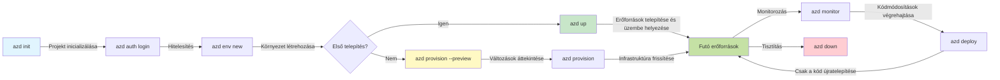
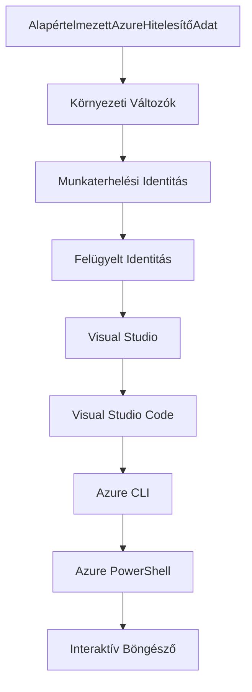

# AZD Alapok - Azure Developer CLI megértése

# AZD Alapok - Alapfogalmak és alapelvek

**Fejezet navigáció:**
- **📚 Kurzus kezdőlap**: [AZD kezdőknek](../../README.md)
- **📖 Aktuális fejezet**: 1. fejezet - Alapok és gyors kezdés
- **⬅️ Előző**: [Kurzus áttekintése](../../README.md#-chapter-1-foundation--quick-start)
- **➡️ Következő**: [Telepítés és beállítás](installation.md)
- **🚀 Következő fejezet**: [2. fejezet: AI-első fejlesztés](../microsoft-foundry/microsoft-foundry-integration.md)

## Bevezetés

Ez a lecke bemutatja az Azure Developer CLI-t (azd), egy hatékony parancssori eszközt, amely felgyorsítja az utat a helyi fejlesztéstől az Azure-ba történő telepítésig. Megismerheted az alapvető fogalmakat, a főbb funkciókat, és megértheted, hogyan egyszerűsíti az azd a felhőalapú alkalmazások telepítését.

## Tanulási célok

A lecke végére:
- Megérted, mi az Azure Developer CLI és mi a fő célja
- Megtanulod a sablonok, környezetek és szolgáltatások alapfogalmait
- Felfedezed a kulcsfontosságú funkciókat, mint például a sablonvezérelt fejlesztés és az infrastruktúra kód formájában
- Megérted az azd projektstruktúráját és munkafolyamatát
- Felkészülsz az azd telepítésére és konfigurálására a fejlesztési környezetedben

## Tanulási eredmények

A lecke elvégzése után képes leszel:
- Elmagyarázni az azd szerepét a modern felhőfejlesztési munkafolyamatokban
- Azonosítani az azd projektstruktúra elemeit
- Leírni, hogyan működnek együtt a sablonok, környezetek és szolgáltatások
- Megérteni az infrastruktúra kód formájában történő előnyeit az azd segítségével
- Felismerni az azd különböző parancsait és azok célját

## Mi az Azure Developer CLI (azd)?

Az Azure Developer CLI (azd) egy parancssori eszköz, amelyet arra terveztek, hogy felgyorsítsa az utat a helyi fejlesztéstől az Azure-ba történő telepítésig. Egyszerűsíti a felhőalapú alkalmazások építésének, telepítésének és kezelésének folyamatát az Azure-on.

### 🎯 Miért használjuk az AZD-t? Valós példák összehasonlítása

Hasonlítsuk össze egy egyszerű webalkalmazás adatbázissal történő telepítését:

#### ❌ AZD NÉLKÜL: Kézi Azure telepítés (30+ perc)

```bash
# 1. lépés: Hozzon létre egy erőforráscsoportot
az group create --name myapp-rg --location eastus

# 2. lépés: Hozzon létre egy App Service tervet
az appservice plan create --name myapp-plan \
  --resource-group myapp-rg \
  --sku B1 --is-linux

# 3. lépés: Hozzon létre egy Web Appot
az webapp create --name myapp-web-unique123 \
  --resource-group myapp-rg \
  --plan myapp-plan \
  --runtime "NODE:18-lts"

# 4. lépés: Hozzon létre egy Cosmos DB fiókot (10-15 perc)
az cosmosdb create --name myapp-cosmos-unique123 \
  --resource-group myapp-rg \
  --kind MongoDB

# 5. lépés: Hozzon létre egy adatbázist
az cosmosdb mongodb database create \
  --account-name myapp-cosmos-unique123 \
  --resource-group myapp-rg \
  --name tododb

# 6. lépés: Hozzon létre egy gyűjteményt
az cosmosdb mongodb collection create \
  --account-name myapp-cosmos-unique123 \
  --resource-group myapp-rg \
  --database-name tododb \
  --name todos

# 7. lépés: Szerezze meg a kapcsolati karakterláncot
CONN_STR=$(az cosmosdb keys list \
  --name myapp-cosmos-unique123 \
  --resource-group myapp-rg \
  --type connection-strings \
  --query "connectionStrings[0].connectionString" -o tsv)

# 8. lépés: Konfigurálja az alkalmazás beállításait
az webapp config appsettings set \
  --name myapp-web-unique123 \
  --resource-group myapp-rg \
  --settings MONGODB_URI="$CONN_STR"

# 9. lépés: Engedélyezze a naplózást
az webapp log config --name myapp-web-unique123 \
  --resource-group myapp-rg \
  --application-logging filesystem \
  --detailed-error-messages true

# 10. lépés: Állítsa be az Application Insights-t
az monitor app-insights component create \
  --app myapp-insights \
  --location eastus \
  --resource-group myapp-rg

# 11. lépés: Kapcsolja össze az App Insights-t a Web Appal
INSTRUMENTATION_KEY=$(az monitor app-insights component show \
  --app myapp-insights \
  --resource-group myapp-rg \
  --query "instrumentationKey" -o tsv)

az webapp config appsettings set \
  --name myapp-web-unique123 \
  --resource-group myapp-rg \
  --settings APPINSIGHTS_INSTRUMENTATIONKEY="$INSTRUMENTATION_KEY"

# 12. lépés: Építse meg az alkalmazást helyileg
npm install
npm run build

# 13. lépés: Hozzon létre egy telepítési csomagot
zip -r app.zip . -x "*.git*" "node_modules/*"

# 14. lépés: Telepítse az alkalmazást
az webapp deployment source config-zip \
  --resource-group myapp-rg \
  --name myapp-web-unique123 \
  --src app.zip

# 15. lépés: Várjon és imádkozzon, hogy működjön 🙏
# (Nincs automatikus érvényesítés, manuális tesztelés szükséges)
```

**Problémák:**
- ❌ Több mint 15 parancsot kell megjegyezni és végrehajtani
- ❌ 30-45 perc kézi munka
- ❌ Könnyű hibázni (elírások, rossz paraméterek)
- ❌ Kapcsolati karakterláncok megjelennek a terminál előzményeiben
- ❌ Nincs automatikus visszaállítás, ha valami elromlik
- ❌ Nehéz megismételni a csapattagok számára
- ❌ Minden alkalommal más (nem reprodukálható)

#### ✅ AZD-VEL: Automatizált telepítés (5 parancs, 10-15 perc)

```bash
# 1. lépés: Inicializálás sablonból
azd init --template todo-nodejs-mongo

# 2. lépés: Hitelesítés
azd auth login

# 3. lépés: Környezet létrehozása
azd env new dev

# 4. lépés: Változások előnézete (opcionális, de ajánlott)
azd provision --preview

# 5. lépés: Minden telepítése
azd up

# ✨ Kész! Minden telepítve, konfigurálva és figyelve
```

**Előnyök:**
- ✅ **5 parancs** vs. több mint 15 kézi lépés
- ✅ **10-15 perc** teljes idő (főként Azure-ra várakozás)
- ✅ **Nulla hiba** - automatizált és tesztelt
- ✅ **Titkok biztonságos kezelése** a Key Vault segítségével
- ✅ **Automatikus visszaállítás** hibák esetén
- ✅ **Teljesen reprodukálható** - minden alkalommal ugyanaz az eredmény
- ✅ **Csapatkész** - bárki telepíthet ugyanazokkal a parancsokkal
- ✅ **Infrastruktúra kód formájában** - verziókövetett Bicep sablonok
- ✅ **Beépített monitorozás** - Application Insights automatikusan konfigurálva

### 📊 Idő- és hibacsökkentés

| Metrika | Kézi telepítés | AZD telepítés | Javulás |
|:-------|:---------------|:--------------|:--------|
| **Parancsok** | 15+ | 5 | 67%-kal kevesebb |
| **Idő** | 30-45 perc | 10-15 perc | 60%-kal gyorsabb |
| **Hibaarány** | ~40% | <5% | 88%-os csökkenés |
| **Konzisztencia** | Alacsony (kézi) | 100% (automatizált) | Tökéletes |
| **Csapat betanítása** | 2-4 óra | 30 perc | 75%-kal gyorsabb |
| **Visszaállítás ideje** | 30+ perc (kézi) | 2 perc (automatizált) | 93%-kal gyorsabb |

## Alapfogalmak

### Sablonok
A sablonok az azd alapját képezik. Tartalmazzák:
- **Alkalmazáskód** - Forráskód és függőségek
- **Infrastruktúra definíciók** - Azure erőforrások Bicep vagy Terraform formájában
- **Konfigurációs fájlok** - Beállítások és környezeti változók
- **Telepítési szkriptek** - Automatizált telepítési munkafolyamatok

### Környezetek
A környezetek különböző telepítési célokat képviselnek:
- **Fejlesztés** - Tesztelésre és fejlesztésre
- **Staging** - Előzetes termelési környezet
- **Termelés** - Éles termelési környezet

Minden környezet saját:
- Azure erőforráscsoportot
- Konfigurációs beállításokat
- Telepítési állapotot tart fenn

### Szolgáltatások
A szolgáltatások az alkalmazás építőelemei:
- **Frontend** - Webalkalmazások, SPÁ-k
- **Backend** - API-k, mikroszolgáltatások
- **Adatbázis** - Adattárolási megoldások
- **Tárolás** - Fájl- és blobtárolás

## Főbb funkciók

### 1. Sablonvezérelt fejlesztés
```bash
# Böngésszen az elérhető sablonok között
azd template list

# Inicializálás egy sablonból
azd init --template <template-name>
```

### 2. Infrastruktúra kód formájában
- **Bicep** - Azure domain-specifikus nyelve
- **Terraform** - Többfelhős infrastruktúra eszköz
- **ARM sablonok** - Azure Resource Manager sablonok

### 3. Integrált munkafolyamatok
```bash
# Teljes telepítési munkafolyamat
azd up            # Előkészítés + Telepítés ez automatikus az első beállításnál

# 🧪 ÚJ: Az infrastruktúra változásainak előnézete telepítés előtt (BIZTONSÁGOS)
azd provision --preview    # Az infrastruktúra telepítésének szimulálása változtatások nélkül

azd provision     # Azure erőforrások létrehozása, ha frissíti az infrastruktúrát, használja ezt
azd deploy        # Alkalmazáskód telepítése vagy újratelepítése frissítés után
azd down          # Erőforrások eltávolítása
```

#### 🛡️ Biztonságos infrastruktúra tervezés előnézettel
Az `azd provision --preview` parancs forradalmi a biztonságos telepítésekhez:
- **Száraz futtatás elemzés** - Megmutatja, mi lesz létrehozva, módosítva vagy törölve
- **Nulla kockázat** - Nem történik tényleges változás az Azure környezetben
- **Csapat együttműködés** - Ossza meg az előnézet eredményeit telepítés előtt
- **Költségbecslés** - Értsd meg az erőforrások költségeit elköteleződés előtt

```bash
# Példa előnézeti munkafolyamat
azd provision --preview           # Nézze meg, mi fog változni
# Tekintse át a kimenetet, beszélje meg a csapattal
azd provision                     # Alkalmazza a változtatásokat magabiztosan
```

### 📊 Vizualizáció: AZD fejlesztési munkafolyamat


**Munkafolyamat magyarázat:**
1. **Init** - Indítás sablonnal vagy új projekttel
2. **Auth** - Hitelesítés az Azure-val
3. **Környezet** - Elkülönített telepítési környezet létrehozása
4. **Preview** - 🆕 Mindig előnézet az infrastruktúra változásokról először (biztonságos gyakorlat)
5. **Provision** - Azure erőforrások létrehozása/frissítése
6. **Deploy** - Alkalmazáskód feltöltése
7. **Monitor** - Alkalmazás teljesítményének megfigyelése
8. **Iterate** - Változtatások végrehajtása és kód újratelepítése
9. **Cleanup** - Erőforrások eltávolítása, ha kész

### 4. Környezetkezelés
```bash
# Környezetek létrehozása és kezelése
azd env new <environment-name>
azd env select <environment-name>
azd env list
```

## 📁 Projektstruktúra

Egy tipikus azd projektstruktúra:
```
my-app/
├── .azd/                    # azd configuration
│   └── config.json
├── .azure/                  # Azure deployment artifacts
├── .devcontainer/          # Development container config
├── .github/workflows/      # GitHub Actions
├── .vscode/               # VS Code settings
├── infra/                 # Infrastructure code
│   ├── main.bicep        # Main infrastructure template
│   ├── main.parameters.json
│   └── modules/          # Reusable modules
├── src/                  # Application source code
│   ├── api/             # Backend services
│   └── web/             # Frontend application
├── azure.yaml           # azd project configuration
└── README.md
```

## 🔧 Konfigurációs fájlok

### azure.yaml
A fő projektkonfigurációs fájl:
```yaml
name: my-awesome-app
metadata:
  template: my-template@1.0.0

services:
  web:
    project: ./src/web
    language: js
    host: appservice
  api:
    project: ./src/api
    language: js
    host: appservice

hooks:
  preprovision:
    shell: pwsh
    run: echo "Preparing to provision..."
```

### .azure/config.json
Környezet-specifikus konfiguráció:
```json
{
  "version": 1,
  "defaultEnvironment": "dev",
  "environments": {
    "dev": {
      "subscriptionId": "your-subscription-id",
      "location": "eastus"
    }
  }
}
```

## 🎪 Gyakori munkafolyamatok gyakorlati feladatokkal

> **💡 Tanulási tipp:** Kövesd ezeket a gyakorlatokat sorrendben, hogy fokozatosan fejleszd az AZD készségeidet.

### 🎯 Gyakorlat 1: Első projekt inicializálása

**Cél:** Hozz létre egy AZD projektet és fedezd fel annak struktúráját

**Lépések:**
```bash
# Használjon bevált sablont
azd init --template todo-nodejs-mongo

# Fedezze fel a generált fájlokat
ls -la  # Tekintse meg az összes fájlt, beleértve a rejtetteket is

# Létrehozott kulcsfájlok:
# - azure.yaml (fő konfiguráció)
# - infra/ (infrastruktúra kód)
# - src/ (alkalmazáskód)
```

**✅ Siker:** Rendelkezel azure.yaml, infra/ és src/ könyvtárakkal

---

### 🎯 Gyakorlat 2: Telepítés az Azure-ra

**Cél:** Teljes körű telepítés végrehajtása

**Lépések:**
```bash
# 1. Hitelesítés
az login && azd auth login

# 2. Környezet létrehozása
azd env new dev
azd env set AZURE_LOCATION eastus

# 3. Változások előnézete (AJÁNLOTT)
azd provision --preview

# 4. Mindent telepíteni
azd up

# 5. Telepítés ellenőrzése
azd show    # Az alkalmazás URL-jének megtekintése
```

**Várható idő:** 10-15 perc  
**✅ Siker:** Az alkalmazás URL-je megnyílik a böngészőben

---

### 🎯 Gyakorlat 3: Több környezet

**Cél:** Telepítés fejlesztési és staging környezetbe

**Lépések:**
```bash
# Már van fejlesztői, hozz létre tesztelőt
azd env new staging
azd env set AZURE_LOCATION westus2
azd up

# Váltás közöttük
azd env list
azd env select dev
```

**✅ Siker:** Két különálló erőforráscsoport az Azure Portálon

---

### 🛡️ Tiszta lap: `azd down --force --purge`

Amikor teljesen újrakezdenéd:

```bash
azd down --force --purge
```

**Mit csinál:**
- `--force`: Nincs megerősítő kérdés
- `--purge`: Törli az összes helyi állapotot és Azure erőforrást

**Használat, amikor:**
- A telepítés félúton meghiúsult
- Projektet váltasz
- Friss kezdésre van szükséged

---

## 🎪 Eredeti munkafolyamat referencia

### Új projekt indítása
```bash
# Módszer 1: Használja a meglévő sablont
azd init --template todo-nodejs-mongo

# Módszer 2: Kezdje elölről
azd init

# Módszer 3: Használja az aktuális könyvtárat
azd init .
```

### Fejlesztési ciklus
```bash
# Állítsa be a fejlesztési környezetet
azd auth login
azd env new dev
azd env select dev

# Telepítsen mindent
azd up

# Végezzen módosításokat és telepítse újra
azd deploy

# Takarítson el, amikor kész
azd down --force --purge # Az Azure Developer CLI parancs egy **kemény visszaállítás** a környezetéhez—különösen hasznos, amikor sikertelen telepítéseket hárít el, árván maradt erőforrásokat takarít el, vagy friss újratelepítésre készül.
```

## Az `azd down --force --purge` megértése
Az `azd down --force --purge` parancs hatékony módja az azd környezet és az összes kapcsolódó erőforrás teljes lebontásának. Íme, mit csinál az egyes jelzők:
```
--force
```
- Kihagyja a megerősítő kérdéseket.
- Hasznos automatizálás vagy szkriptek esetén, ahol a kézi bemenet nem lehetséges.
- Biztosítja, hogy a lebontás megszakítás nélkül folytatódjon, még akkor is, ha a CLI inkonzisztenciákat észlel.

```
--purge
```
Törli **az összes kapcsolódó metaadatot**, beleértve:
Környezet állapot
Helyi `.azure` mappa
Gyorsítótárazott telepítési információk
Megakadályozza, hogy az azd "emlékezzen" korábbi telepítésekre, amelyek problémákat okozhatnak, például nem egyező erőforráscsoportok vagy elavult regisztrációs hivatkozások.

### Miért használjuk mindkettőt?
Amikor az `azd up` elakad a fennmaradó állapot vagy részleges telepítések miatt, ez a kombináció biztosítja a **tiszta lapot**.

Különösen hasznos manuális erőforrás törlések után az Azure portálon, vagy sablonok, környezetek vagy erőforráscsoport elnevezési konvenciók váltásakor.

### Több környezet kezelése
```bash
# Hozzon létre tesztkörnyezetet
azd env new staging
azd env select staging
azd up

# Váltson vissza fejlesztői környezetre
azd env select dev

# Hasonlítsa össze a környezeteket
azd env list
```

## 🔐 Hitelesítés és hitelesítő adatok

A hitelesítés megértése kulcsfontosságú az azd telepítések sikeréhez. Az Azure több hitelesítési módszert használ, és az azd ugyanazt a hitelesítési láncot használja, mint más Azure eszközök.

### Azure CLI hitelesítés (`az login`)

Az azd használata előtt hitelesítened kell az Azure-val. A leggyakoribb módszer az Azure CLI használata:

```bash
# Interaktív bejelentkezés (megnyitja a böngészőt)
az login

# Bejelentkezés adott bérlővel
az login --tenant <tenant-id>

# Bejelentkezés szolgáltatási főazonosítóval
az login --service-principal -u <app-id> -p <password> --tenant <tenant-id>

# Aktuális bejelentkezési állapot ellenőrzése
az account show

# Elérhető előfizetések listázása
az account list --output table

# Alapértelmezett előfizetés beállítása
az account set --subscription <subscription-id>
```

### Hitelesítési folyamat
1. **Interaktív bejelentkezés**: Megnyitja az alapértelmezett böngészőt hitelesítéshez
2. **Eszközkód folyamat**: Böngésző nélküli környezetekhez
3. **Szolgáltatási főazonosító**: Automatizálási és CI/CD forgatókönyvekhez
4. **Kezelt identitás**: Azure-ban hosztolt alkalmazásokhoz

### DefaultAzureCredential lánc

A `DefaultAzureCredential` egy hitelesítési típus, amely egyszerűsített hitelesítési élményt nyújt azáltal, hogy automatikusan több hitelesítési forrást próbál ki meghatározott sorrendben:

#### Hitelesítési lánc sorrendje

#### 1. Környezeti változók
```bash
# Állítsa be a környezeti változókat a szolgáltatási főszereplőhöz
export AZURE_CLIENT_ID="<app-id>"
export AZURE_CLIENT_SECRET="<password>"
export AZURE_TENANT_ID="<tenant-id>"
```

#### 2. Munkaterhelési identitás (Kubernetes/GitHub Actions)
Automatikusan használva:
- Azure Kubernetes Service (AKS) munkaterhelési identitással
- GitHub Actions OIDC federációval
- Egyéb federált identitás forgatókönyvek

#### 3. Kezelt identitás
Azure erőforrásokhoz, mint például:
- Virtuális gépek
- App Service
- Azure Functions
- Konténeres példányok

```bash
# Ellenőrizze, hogy Azure erőforráson fut-e kezelt identitással
az account show --query "user.type" --output tsv
# Visszatér: "servicePrincipal", ha kezelt identitást használ
```

#### 4. Fejlesztői eszközök integrációja
- **Visual Studio**: Automatikusan használja a bejelentkezett fiókot
- **VS Code**: Az Azure Account bővítmény hitelesítő adatait használja
- **Azure CLI**: Az `az login` hitelesítő adatait használja (leggyakoribb helyi fejlesztéshez)

### AZD hitelesítési beállítás

```bash
# Módszer 1: Használja az Azure CLI-t (Fejlesztéshez ajánlott)
az login
azd auth login  # Meglévő Azure CLI hitelesítő adatokat használ

# Módszer 2: Közvetlen azd hitelesítés
azd auth login --use-device-code  # Fej nélküli környezetekhez

# Módszer 3: Hitelesítési állapot ellenőrzése
azd auth login --check-status

# Módszer 4: Kijelentkezés és újrahitelesítés
azd auth logout
azd auth login
```

### Hitelesítési legjobb gyakorlatok

#### Helyi fejlesztéshez
```bash
# 1. Jelentkezzen be az Azure CLI-vel
az login

# 2. Ellenőrizze a megfelelő előfizetést
az account show
az account set --subscription "Your Subscription Name"

# 3. Használja az azd-t meglévő hitelesítő adatokkal
azd auth login
```

#### CI/CD csővezetékekhez
```yaml
# GitHub Actions example
- name: Azure Login
  uses: azure/login@v1
  with:
    creds: ${{ secrets.AZURE_CREDENTIALS }}

- name: Deploy with azd
  run: |
    azd auth login --client-id ${{ secrets.AZURE_CLIENT_ID }} \
                    --client-secret ${{ secrets.AZURE_CLIENT_SECRET }} \
                    --tenant-id ${{ secrets.AZURE_TENANT_ID }}
    azd up --no-prompt
```

#### Termelési környezetekhez
- Használj **kezelt identitást**, ha Azure erőforrásokon futsz
- Használj **szolgáltatási főazonosítót** automatizálási forgatókönyvekhez
- Kerüld a hitelesítő adatok kódban vagy konfigurációs fájlokban történő tárolását
- Használj **Azure Key Vault**-ot érzékeny konfigurációhoz

### Gyakori hitelesítési problémák és megoldások

#### Probléma: "Nincs előfizetés található"
```bash
# Megoldás: Állítsa be az alapértelmezett előfizetést
az account list --output table
az account set --subscription "<subscription-id>"
azd env set AZURE_SUBSCRIPTION_ID "<subscription-id>"
```

#### Probléma: "Elégtelen jogosultságok"
```bash
# Megoldás: Ellenőrizze és rendeljen hozzá szükséges szerepköröket
az role assignment list --assignee $(az account show --query user.name --output tsv)

# Általános szükséges szerepkörök:
# - Közreműködő (erőforrás-kezeléshez)
# - Felhasználói hozzáférés adminisztrátor (szerepkör-hozzárendelésekhez)
```

#### Probléma: "Token lejárt"
```bash
# Megoldás: Újrahitelesítés
az logout
az login
azd auth logout
azd auth login
```

### Hitelesítés különböző forgatókönyvekben

#### Helyi fejlesztés
```bash
# Személyes fejlesztési fiók
az login
azd auth login
```

#### Csapatfejlesztés
```bash
# Használjon konkrét bérlőt a szervezet számára
az login --tenant contoso.onmicrosoft.com
azd auth login
```

#### Több bérlős forgatókönyvek
```bash
# Váltás a bérlők között
az login --tenant tenant1.onmicrosoft.com
# Telepítés az 1. bérlőhöz
azd up

az login --tenant tenant2.onmicrosoft.com  
# Telepítés a 2. bérlőhöz
azd up
```

### Biztonsági megfontolások

1. **Hitelesítő adatok tárolása**: Soha ne tárold a hitelesítő adatokat forráskódban
2. **Hatókör korlátozása**: Használj legkisebb jogosultság elvet a szolgáltatási főazonosítókhoz
3. **Token forgatás**: Rendszeresen forgass szolgáltatási főazonosító titkokat
4. **Audit nyomvonal**: Figyeld a hitelesítési és telepítési tevékenységeket
5.
- [Telepítés és Beállítás](installation.md) - Az azd telepítése és konfigurálása
- [Az első projekted](first-project.md) - Gyakorlati útmutató
- [Konfigurációs útmutató](configuration.md) - Haladó konfigurációs lehetőségek

**🎯 Készen állsz a következő fejezetre?**
- [2. fejezet: AI-első fejlesztés](../microsoft-foundry/microsoft-foundry-integration.md) - Kezdj el AI alkalmazásokat építeni

## További források

- [Azure Developer CLI áttekintés](https://learn.microsoft.com/en-us/azure/developer/azure-developer-cli/)
- [Sablon galéria](https://azure.github.io/awesome-azd/)
- [Közösségi minták](https://github.com/Azure-Samples)

---

## 🙋 Gyakran Ismételt Kérdések

### Általános kérdések

**K: Mi a különbség az AZD és az Azure CLI között?**

V: Az Azure CLI (`az`) egyedi Azure erőforrások kezelésére szolgál. Az AZD (`azd`) teljes alkalmazások kezelésére:

```bash
# Azure CLI - Alacsony szintű erőforrás-kezelés
az webapp create --name myapp --resource-group rg
az sql server create --name myserver --resource-group rg
# ...sokkal több parancs szükséges

# AZD - Alkalmazás szintű kezelés
azd up  # Teljes alkalmazást telepít minden erőforrással együtt
```

**Gondolj rá így:**
- `az` = Egyedi Lego kockák kezelése
- `azd` = Teljes Lego készletek kezelése

---

**K: Szükséges ismernem a Bicep-et vagy a Terraform-ot az AZD használatához?**

V: Nem! Kezdd sablonokkal:
```bash
# Használja a meglévő sablont - nincs szükség IaC ismeretekre
azd init --template todo-nodejs-mongo
azd up
```

Később megtanulhatod a Bicep-et az infrastruktúra testreszabásához. A sablonok működő példákat nyújtanak a tanuláshoz.

---

**K: Mennyibe kerül az AZD sablonok futtatása?**

V: A költségek sablononként változnak. A legtöbb fejlesztési sablon havi 50-150 dollárba kerül:

```bash
# Előzetesen tekintse meg a költségeket a telepítés előtt
azd provision --preview

# Mindig takarítson, ha nem használja
azd down --force --purge  # Eltávolítja az összes erőforrást
```

**Tipp:** Használj ingyenes szinteket, ahol elérhető:
- App Service: F1 (Ingyenes) szint
- Azure OpenAI: 50,000 token/hónap ingyen
- Cosmos DB: 1000 RU/s ingyenes szint

---

**K: Használhatom az AZD-t meglévő Azure erőforrásokkal?**

V: Igen, de egyszerűbb újrakezdeni. Az AZD akkor működik a legjobban, ha az teljes életciklust kezel. Meglévő erőforrások esetén:

```bash
# Opció 1: Létező erőforrások importálása (haladó)
azd init
# Ezután módosítsa az infra/ fájlt, hogy hivatkozzon a meglévő erőforrásokra

# Opció 2: Kezdje tiszta lappal (ajánlott)
azd init --template matching-your-stack
azd up  # Új környezetet hoz létre
```

---

**K: Hogyan oszthatom meg a projektemet a csapattársaimmal?**

V: Kötelezd el az AZD projektet a Git-ben (de NE a .azure mappát):

```bash
# Alapértelmezés szerint már szerepel a .gitignore-ban
.azure/        # Titkokat és környezeti adatokat tartalmaz
*.env          # Környezeti változók

# Csapattagok akkor:
git clone <your-repo>
azd auth login
azd env new <their-name>-dev
azd up
```

Mindenki azonos infrastruktúrát kap ugyanazokból a sablonokból.

---

### Hibaelhárítási kérdések

**K: Az "azd up" félúton leállt. Mit tegyek?**

V: Ellenőrizd a hibát, javítsd ki, majd próbáld újra:

```bash
# Részletes naplók megtekintése
azd show

# Gyakori javítások:

# 1. Ha a kvóta túllépve:
azd env set AZURE_LOCATION "westus2"  # Próbáljon ki egy másik régiót

# 2. Ha erőforrásnév ütközés:
azd down --force --purge  # Tiszta lap
azd up  # Próbálja újra

# 3. Ha a hitelesítés lejárt:
az login
azd auth login
azd up
```

**Leggyakoribb probléma:** Rossz Azure előfizetés van kiválasztva
```bash
az account list --output table
az account set --subscription "<correct-subscription>"
```

---

**K: Hogyan telepíthetem csak a kódváltoztatásokat újraprovisionálás nélkül?**

V: Használd az `azd deploy` parancsot az `azd up` helyett:

```bash
azd up          # Első alkalom: előkészítés + telepítés (lassú)

# Végezzen kódmódosításokat...

azd deploy      # Későbbi alkalmak: csak telepítés (gyors)
```

Sebesség összehasonlítás:
- `azd up`: 10-15 perc (infrastruktúra provisionálása)
- `azd deploy`: 2-5 perc (csak kód)

---

**K: Testreszabhatom az infrastruktúra sablonokat?**

V: Igen! Szerkeszd a Bicep fájlokat az `infra/` mappában:

```bash
# Az azd init után
cd infra/
code main.bicep  # Szerkesztés a VS Code-ban

# Változások előnézete
azd provision --preview

# Változások alkalmazása
azd provision
```

**Tipp:** Kezdd kicsiben - először a SKU-kat változtasd meg:
```bicep
// infra/main.bicep
sku: {
  name: 'B1'  // Change to 'P1V2' for production
}
```

---

**K: Hogyan törölhetek mindent, amit az AZD létrehozott?**

V: Egyetlen parancs eltávolít minden erőforrást:

```bash
azd down --force --purge

# Ez törli:
# - Az összes Azure erőforrást
# - Erőforráscsoportot
# - Helyi környezet állapotát
# - Gyorsítótárazott telepítési adatokat
```

**Mindig futtasd ezt, ha:**
- Befejezted egy sablon tesztelését
- Másik projektre váltasz
- Újrakezdésre van szükséged

**Költségmegtakarítás:** Nem használt erőforrások törlése = $0 költség

---

**K: Mi van, ha véletlenül töröltem egy erőforrást az Azure Portálon?**

V: Az AZD állapota szinkronon kívül kerülhet. Tiszta lap megközelítés:

```bash
# 1. Távolítsa el a helyi állapotot
azd down --force --purge

# 2. Kezdje tiszta lappal
azd up

# Alternatíva: Hagyja, hogy az AZD észlelje és javítsa
azd provision  # Hiányzó erőforrásokat fog létrehozni
```

---

### Haladó kérdések

**K: Használhatom az AZD-t CI/CD pipeline-okban?**

V: Igen! GitHub Actions példa:

```yaml
# .github/workflows/deploy.yml
name: Deploy with AZD

on:
  push:
    branches: [main]

jobs:
  deploy:
    runs-on: ubuntu-latest
    steps:
      - uses: actions/checkout@v2
      
      - name: Install azd
        run: curl -fsSL https://aka.ms/install-azd.sh | bash
      
      - name: Azure Login
        run: |
          azd auth login \
            --client-id ${{ secrets.AZURE_CLIENT_ID }} \
            --client-secret ${{ secrets.AZURE_CLIENT_SECRET }} \
            --tenant-id ${{ secrets.AZURE_TENANT_ID }}
      
      - name: Deploy
        run: azd up --no-prompt
```

---

**K: Hogyan kezeljem a titkokat és érzékeny adatokat?**

V: Az AZD automatikusan integrálódik az Azure Key Vault-tal:

```bash
# A titkok a Key Vaultban vannak tárolva, nem a kódban
azd env set DATABASE_PASSWORD "$(openssl rand -base64 32)"

# AZD automatikusan:
# 1. Létrehozza a Key Vaultot
# 2. Titkot tárol
# 3. Alkalmazás hozzáférést biztosít Kezelt Identitás révén
# 4. Futtatás közben injektál
```

**Soha ne kötelezd el:**
- `.azure/` mappa (környezet adatai)
- `.env` fájlok (helyi titkok)
- Kapcsolati karakterláncok

---

**K: Telepíthetek több régióba?**

V: Igen, hozz létre környezetet régiónként:

```bash
# Kelet-USA környezet
azd env new prod-eastus
azd env set AZURE_LOCATION eastus
azd up

# Nyugat-Európa környezet
azd env new prod-westeurope
azd env set AZURE_LOCATION westeurope
azd up

# Minden környezet független
azd env list
```

Igazi több régiós alkalmazásokhoz testreszabhatod a Bicep sablonokat, hogy egyszerre több régióba telepítsenek.

---

**K: Hol kaphatok segítséget, ha elakadok?**

1. **AZD Dokumentáció:** https://learn.microsoft.com/azure/developer/azure-developer-cli/
2. **GitHub Issues:** https://github.com/Azure/azure-dev/issues
3. **Discord:** [Azure Discord](https://discord.gg/microsoft-azure) - #azure-developer-cli csatorna
4. **Stack Overflow:** Tag `azure-developer-cli`
5. **Ez a kurzus:** [Hibaelhárítási útmutató](../troubleshooting/common-issues.md)

**Tipp:** Kérdés előtt futtasd:
```bash
azd show       # Megjeleníti az aktuális állapotot
azd version    # Megjeleníti a verziódat
```
Tartalmazd ezt az információt a kérdésedben a gyorsabb segítségért.

---

## 🎓 Mi következik?

Most már ismered az AZD alapjait. Válaszd ki az utadat:

### 🎯 Kezdőknek:
1. **Következő:** [Telepítés és Beállítás](installation.md) - Telepítsd az AZD-t a gépedre
2. **Utána:** [Az első projekted](first-project.md) - Telepítsd az első alkalmazásodat
3. **Gyakorolj:** Fejezd be mind a 3 gyakorlatot ebben a leckében

### 🚀 AI fejlesztőknek:
1. **Ugorj ide:** [2. fejezet: AI-első fejlesztés](../microsoft-foundry/microsoft-foundry-integration.md)
2. **Telepítsd:** Kezdd az `azd init --template get-started-with-ai-chat` paranccsal
3. **Tanulj:** Építs, miközben telepítesz

### 🏗️ Tapasztalt fejlesztőknek:
1. **Nézd át:** [Konfigurációs útmutató](configuration.md) - Haladó beállítások
2. **Fedezd fel:** [Infrastruktúra mint kód](../deployment/provisioning.md) - Mélyebb Bicep ismeretek
3. **Építs:** Hozz létre egyedi sablonokat a saját stack-edhez

---

**Fejezet navigáció:**
- **📚 Kurzus kezdőlap**: [AZD Kezdőknek](../../README.md)
- **📖 Jelenlegi fejezet**: 1. fejezet - Alapok és Gyors kezdés  
- **⬅️ Előző**: [Kurzus áttekintés](../../README.md#-chapter-1-foundation--quick-start)
- **➡️ Következő**: [Telepítés és Beállítás](installation.md)
- **🚀 Következő fejezet**: [2. fejezet: AI-első fejlesztés](../microsoft-foundry/microsoft-foundry-integration.md)

---

<!-- CO-OP TRANSLATOR DISCLAIMER START -->
**Felelősség kizárása**:  
Ez a dokumentum az AI fordítási szolgáltatás [Co-op Translator](https://github.com/Azure/co-op-translator) segítségével lett lefordítva. Bár törekszünk a pontosságra, kérjük, vegye figyelembe, hogy az automatikus fordítások hibákat vagy pontatlanságokat tartalmazhatnak. Az eredeti dokumentum az eredeti nyelvén tekintendő hiteles forrásnak. Kritikus információk esetén javasolt professzionális emberi fordítást igénybe venni. Nem vállalunk felelősséget semmilyen félreértésért vagy téves értelmezésért, amely a fordítás használatából eredhet.
<!-- CO-OP TRANSLATOR DISCLAIMER END -->