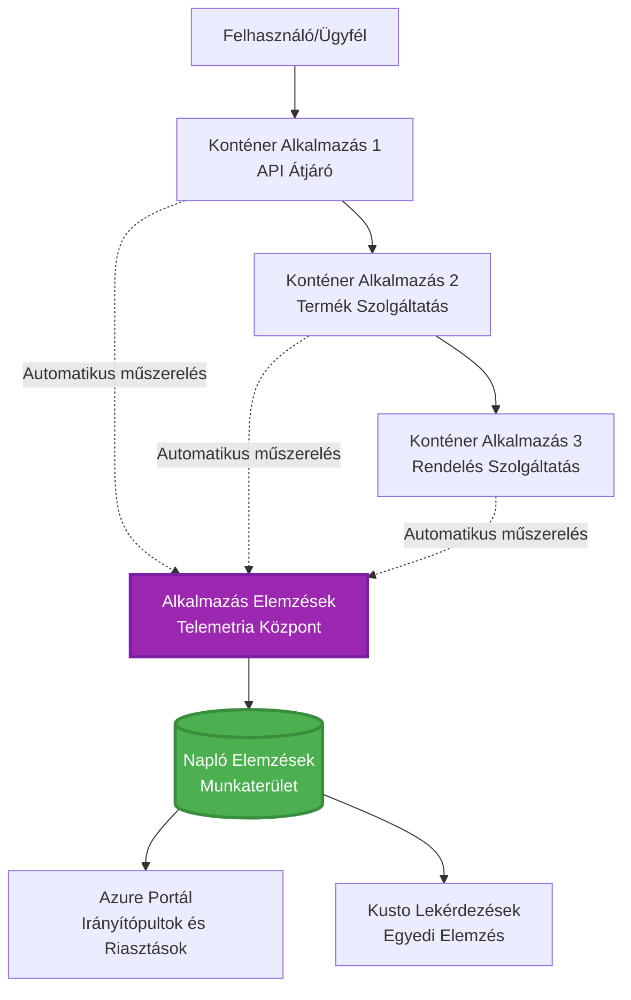
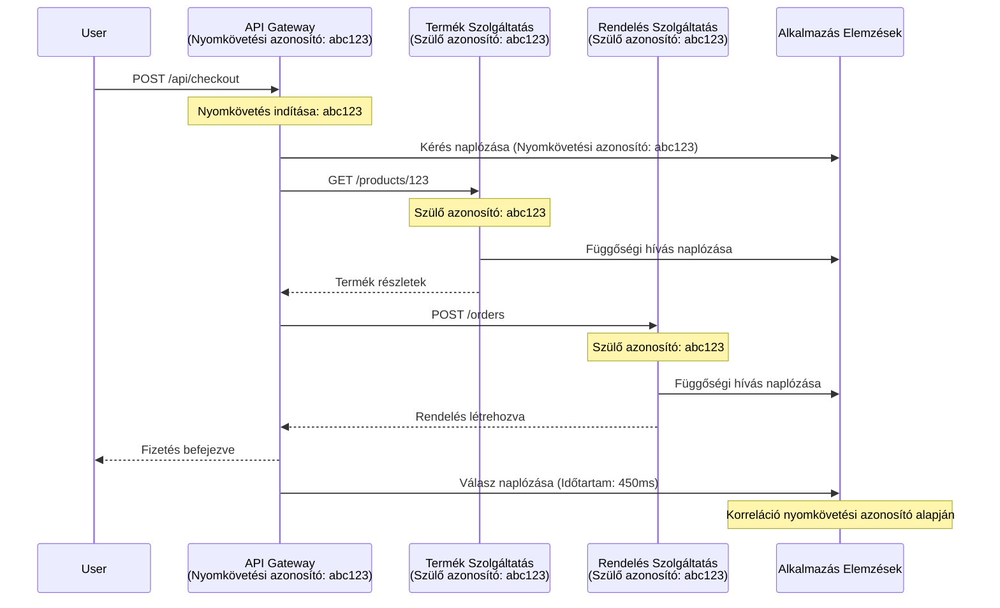

# Alkalmazás Insights integráció az AZD-vel

⏱️ **Becsült idő**: 40-50 perc | 💰 **Költséghatás**: ~5-15 USD/hó | ⭐ **Komplexitás**: Középhaladó

**📚 Tanulási útvonal:**
- ← Előző: [Előzetes ellenőrzések](preflight-checks.md) - Telepítés előtti validáció
- 🎯 **Itt tartasz**: Alkalmazás Insights integráció (monitorozás, telemetria, hibakeresés)
- → Következő: [Telepítési útmutató](../deployment/deployment-guide.md) - Telepítés az Azure-ba
- 🏠 [Kurzus főoldal](../../README.md)

---

## Amit megtanulsz

A lecke elvégzésével:
- Automatikusan integrálod az **Application Insights**-t AZD projektekbe
- Konfigurálod a **disztribuált nyomkövetést** mikroszolgáltatásokhoz
- Megvalósítasz **egyedi telemetriát** (metrikák, események, függőségek)
- Beállítasz **élő metrikákat** valós idejű monitorozáshoz
- Létrehozol **riasztásokat és irányítópultokat** AZD telepítésekből
- Hibakeresést végzel produkciós környezetben **telemetria lekérdezésekkel**
- Optimalizálod a **költségeket és mintavételi stratégiákat**
- Monitorozod **AI/LLM alkalmazásokat** (tokenek, késleltetés, költségek)

## Miért fontos az Application Insights az AZD-vel?

### A kihívás: Produkciós megfigyelhetőség

**Application Insights nélkül:**
```
❌ No visibility into production behavior
❌ Manual log aggregation across services
❌ Reactive debugging (wait for customer complaints)
❌ No performance metrics
❌ Cannot trace requests across services
❌ Unknown failure rates and bottlenecks
```

**Application Insights + AZD-vel:**
```
✅ Automatic telemetry collection
✅ Centralized logs from all services
✅ Proactive issue detection
✅ End-to-end request tracing
✅ Performance metrics and insights
✅ Real-time dashboards
✅ AZD provisions everything automatically
```

**Analógia**: Az Application Insights olyan, mint egy "fekete doboz" repülési adatrögzítő + pilótafülke műszerfal az alkalmazásod számára. Mindent látsz, ami valós időben történik, és bármilyen eseményt visszajátszhatsz.

---

## Architektúra áttekintés

### Application Insights az AZD architektúrában


### Mi kerül automatikusan monitorozásra

| Telemetria típusa | Mit rögzít | Felhasználási eset |
|-------------------|------------|--------------------|
| **Kérések** | HTTP kérések, státuszkódok, időtartam | API teljesítmény monitorozása |
| **Függőségek** | Külső hívások (DB, API-k, tárhely) | Szűk keresztmetszetek azonosítása |
| **Kivétel** | Kezeletlen hibák stack trace-szel | Hibák hibakeresése |
| **Egyedi események** | Üzleti események (regisztráció, vásárlás) | Analitika és tölcsérek |
| **Metrikák** | Teljesítmény számlálók, egyedi metrikák | Kapacitás tervezés |
| **Nyomok** | Naplóüzenetek súlyossággal | Hibakeresés és auditálás |
| **Elérhetőség** | Üzemidő és válaszidő tesztek | SLA monitorozás |

---

## Előfeltételek

### Szükséges eszközök

```bash
# Ellenőrizze az Azure Developer CLI-t
azd version
# ✅ Várható: azd verzió 1.0.0 vagy magasabb

# Ellenőrizze az Azure CLI-t
az --version
# ✅ Várható: azure-cli 2.50.0 vagy magasabb
```

### Azure követelmények

- Aktív Azure előfizetés
- Jogosultság a következők létrehozására:
  - Application Insights erőforrások
  - Log Analytics munkaterületek
  - Container Apps
  - Erőforráscsoportok

### Tudás előfeltételek

El kell végezned:
- [AZD alapok](../getting-started/azd-basics.md) - AZD alapfogalmak
- [Konfiguráció](../getting-started/configuration.md) - Környezet beállítása
- [Első projekt](../getting-started/first-project.md) - Alapvető telepítés

---

## 1. lecke: Automatikus Application Insights az AZD-vel

### Hogyan hozza létre az AZD az Application Insights-t

Az AZD automatikusan létrehozza és konfigurálja az Application Insights-t a telepítés során. Nézzük meg, hogyan működik.

### Projektstruktúra

```
monitored-app/
├── azure.yaml                     # AZD configuration
├── infra/
│   ├── main.bicep                # Main infrastructure
│   ├── core/
│   │   └── monitoring.bicep      # Application Insights + Log Analytics
│   └── app/
│       └── api.bicep             # Container App with monitoring
└── src/
    ├── app.py                    # Application with telemetry
    ├── requirements.txt
    └── Dockerfile
```

---

### 1. lépés: AZD konfigurálása (azure.yaml)

**Fájl: `azure.yaml`**

```yaml
name: monitored-app
metadata:
  template: monitored-app@1.0.0

services:
  api:
    project: ./src
    language: python
    host: containerapp

# AZD automatically provisions monitoring!
```

**Ennyi az egész!** Az AZD alapértelmezés szerint létrehozza az Application Insights-t. Nincs szükség további konfigurációra az alapvető monitorozáshoz.

---

### 2. lépés: Monitorozási infrastruktúra (Bicep)

**Fájl: `infra/core/monitoring.bicep`**

```bicep
param logAnalyticsName string
param applicationInsightsName string
param location string = resourceGroup().location
param tags object = {}

// Log Analytics Workspace (required for Application Insights)
resource logAnalytics 'Microsoft.OperationalInsights/workspaces@2022-10-01' = {
  name: logAnalyticsName
  location: location
  tags: tags
  properties: {
    sku: {
      name: 'PerGB2018'  // Pay-as-you-go pricing
    }
    retentionInDays: 30  // Keep logs for 30 days
    features: {
      enableLogAccessUsingOnlyResourcePermissions: true
    }
  }
}

// Application Insights
resource applicationInsights 'Microsoft.Insights/components@2020-02-02' = {
  name: applicationInsightsName
  location: location
  tags: tags
  kind: 'web'
  properties: {
    Application_Type: 'web'
    WorkspaceResourceId: logAnalytics.id
    IngestionMode: 'LogAnalytics'
    publicNetworkAccessForIngestion: 'Enabled'
    publicNetworkAccessForQuery: 'Enabled'
  }
}

// Outputs for Container Apps
output logAnalyticsWorkspaceId string = logAnalytics.id
output logAnalyticsWorkspaceName string = logAnalytics.name
output applicationInsightsConnectionString string = applicationInsights.properties.ConnectionString
output applicationInsightsInstrumentationKey string = applicationInsights.properties.InstrumentationKey
output applicationInsightsName string = applicationInsights.name
```

---

### 3. lépés: Kapcsolat létrehozása a Container App és az Application Insights között

**Fájl: `infra/app/api.bicep`**

```bicep
param name string
param location string
param tags object = {}
param containerAppsEnvironmentName string
param applicationInsightsConnectionString string

resource containerApp 'Microsoft.App/containerApps@2023-05-01' = {
  name: name
  location: location
  tags: tags
  properties: {
    configuration: {
      ingress: {
        external: true
        targetPort: 8000
      }
      secrets: [
        {
          name: 'appinsights-connection-string'
          value: applicationInsightsConnectionString
        }
      ]
    }
    template: {
      containers: [
        {
          name: 'api'
          image: 'myregistry.azurecr.io/api:latest'
          resources: {
            cpu: json('0.5')
            memory: '1Gi'
          }
          env: [
            {
              name: 'APPLICATIONINSIGHTS_CONNECTION_STRING'
              secretRef: 'appinsights-connection-string'
            }
            {
              name: 'APPLICATIONINSIGHTS_ENABLED'
              value: 'true'
            }
          ]
        }
      ]
    }
  }
}

output uri string = 'https://${containerApp.properties.configuration.ingress.fqdn}'
```

---

### 4. lépés: Alkalmazáskód telemetriával

**Fájl: `src/app.py`**

```python
from flask import Flask, request, jsonify
from opencensus.ext.azure.log_exporter import AzureLogHandler
from opencensus.ext.azure.trace_exporter import AzureExporter
from opencensus.ext.flask.flask_middleware import FlaskMiddleware
from opencensus.trace.samplers import ProbabilitySampler
import logging
import os

app = Flask(__name__)

# Szerezze be az Application Insights kapcsolati karakterláncát
connection_string = os.environ.get('APPLICATIONINSIGHTS_CONNECTION_STRING')

if connection_string:
    # Konfigurálja az elosztott nyomkövetést
    middleware = FlaskMiddleware(
        app,
        exporter=AzureExporter(connection_string=connection_string),
        sampler=ProbabilitySampler(rate=1.0)  # 100%-os mintavétel fejlesztéshez
    )
    
    # Konfigurálja a naplózást
    logger = logging.getLogger(__name__)
    logger.addHandler(AzureLogHandler(connection_string=connection_string))
    logger.setLevel(logging.INFO)
    
    print("✅ Application Insights enabled")
else:
    logger = logging.getLogger(__name__)
    logger.setLevel(logging.INFO)
    print("⚠️ Application Insights not configured")

@app.route('/health')
def health():
    logger.info('Health check endpoint called')
    return jsonify({'status': 'healthy', 'monitoring': 'enabled'})

@app.route('/api/products')
def get_products():
    logger.info('Fetching products')
    
    # Szimulálja az adatbázis-hívást (automatikusan függőségként követve)
    products = [
        {'id': 1, 'name': 'Laptop', 'price': 999.99},
        {'id': 2, 'name': 'Mouse', 'price': 29.99},
        {'id': 3, 'name': 'Keyboard', 'price': 79.99}
    ]
    
    logger.info(f'Returned {len(products)} products')
    return jsonify(products)

@app.route('/api/error-test')
def error_test():
    """Test error tracking"""
    logger.error('Testing error tracking')
    try:
        raise ValueError('This is a test exception')
    except Exception as e:
        logger.exception('Exception occurred in error-test endpoint')
        return jsonify({'error': str(e)}), 500

@app.route('/api/slow')
def slow_endpoint():
    """Test performance tracking"""
    import time
    logger.info('Slow endpoint called')
    time.sleep(3)  # Szimuláljon lassú műveletet
    logger.warning('Endpoint took 3 seconds to respond')
    return jsonify({'message': 'Slow operation completed'})

if __name__ == '__main__':
    app.run(host='0.0.0.0', port=8000)
```

**Fájl: `src/requirements.txt`**

```txt
Flask==3.0.0
opencensus-ext-azure==1.1.13
opencensus-ext-flask==0.8.1
gunicorn==21.2.0
```

---

### 5. lépés: Telepítés és ellenőrzés

```bash
# Inicializálja az AZD-t
azd init

# Telepítés (automatikusan biztosítja az Application Insights-t)
azd up

# Szerezze meg az alkalmazás URL-jét
APP_URL=$(azd env get-values | grep API_URL | cut -d '=' -f2 | tr -d '"')

# Telemetria generálása
curl $APP_URL/health
curl $APP_URL/api/products
curl $APP_URL/api/error-test
curl $APP_URL/api/slow
```

**✅ Várható kimenet:**
```json
{
  "status": "healthy",
  "monitoring": "enabled"
}
```

---

### 6. lépés: Telemetria megtekintése az Azure Portálon

```bash
# Szerezze be az Application Insights részleteit
azd env get-values | grep APPLICATIONINSIGHTS

# Nyissa meg az Azure Portálon
az monitor app-insights component show \
  --app $(azd env get-values | grep APPLICATIONINSIGHTS_NAME | cut -d '=' -f2 | tr -d '"') \
  --resource-group $(azd env get-values | grep AZURE_RESOURCE_GROUP | cut -d '=' -f2 | tr -d '"') \
  --query "appId" -o tsv
```

**Navigálj az Azure Portál → Application Insights → Transaction Search**

Látnod kell:
- ✅ HTTP kérések státuszkódokkal
- ✅ Kérés időtartama (3+ másodperc a `/api/slow` esetében)
- ✅ Kivétel részletei a `/api/error-test`-ből
- ✅ Egyedi naplóüzenetek

---

## 2. lecke: Egyedi telemetria és események

### Üzleti események nyomon követése

Adjunk hozzá egyedi telemetriát üzletkritikus eseményekhez.

**Fájl: `src/telemetry.py`**

```python
from opencensus.ext.azure import metrics_exporter
from opencensus.stats import aggregation as aggregation_module
from opencensus.stats import measure as measure_module
from opencensus.stats import stats as stats_module
from opencensus.stats import view as view_module
from opencensus.tags import tag_map as tag_map_module
from opencensus.ext.azure.log_exporter import AzureLogHandler
from opencensus.ext.azure.trace_exporter import AzureExporter
from opencensus.trace import tracer as tracer_module
import logging
import os

class TelemetryClient:
    """Custom telemetry client for Application Insights"""
    
    def __init__(self, connection_string=None):
        self.connection_string = connection_string or os.environ.get('APPLICATIONINSIGHTS_CONNECTION_STRING')
        
        if not self.connection_string:
            print("⚠️ Application Insights connection string not found")
            return
        
        # Naplózó beállítása
        self.logger = logging.getLogger(__name__)
        self.logger.addHandler(AzureLogHandler(connection_string=self.connection_string))
        self.logger.setLevel(logging.INFO)
        
        # Metrika exportáló beállítása
        self.stats = stats_module.stats
        self.view_manager = self.stats.view_manager
        self.stats_recorder = self.stats.stats_recorder
        
        exporter = metrics_exporter.new_metrics_exporter(
            connection_string=self.connection_string
        )
        self.view_manager.register_exporter(exporter)
        
        # Nyomkövető beállítása
        self.tracer = tracer_module.Tracer(
            exporter=AzureExporter(connection_string=self.connection_string)
        )
        
        print("✅ Custom telemetry client initialized")
    
    def track_event(self, event_name: str, properties: dict = None):
        """Track custom business event"""
        properties = properties or {}
        self.logger.info(
            f"CustomEvent: {event_name}",
            extra={
                'custom_dimensions': {
                    'event_name': event_name,
                    **properties
                }
            }
        )
    
    def track_metric(self, metric_name: str, value: float, properties: dict = None):
        """Track custom metric"""
        properties = properties or {}
        self.logger.info(
            f"CustomMetric: {metric_name} = {value}",
            extra={
                'custom_dimensions': {
                    'metric_name': metric_name,
                    'value': value,
                    **properties
                }
            }
        )
    
    def track_dependency(self, name: str, dependency_type: str, duration: float, success: bool):
        """Track external dependency call"""
        with self.tracer.span(name=name) as span:
            span.add_attribute('dependency.type', dependency_type)
            span.add_attribute('duration', duration)
            span.add_attribute('success', success)

# Globális telemetria kliens
telemetry = TelemetryClient()
```

### Alkalmazás frissítése egyedi eseményekkel

**Fájl: `src/app.py` (bővített)**

```python
from flask import Flask, request, jsonify
from telemetry import telemetry
import time
import random

app = Flask(__name__)

@app.route('/api/purchase', methods=['POST'])
def purchase():
    """Track purchase event with custom telemetry"""
    data = request.json
    product_id = data.get('product_id')
    quantity = data.get('quantity', 1)
    price = data.get('price', 0)
    
    # Kövesd az üzleti eseményt
    telemetry.track_event('Purchase', {
        'product_id': product_id,
        'quantity': quantity,
        'total_amount': price * quantity,
        'user_id': request.headers.get('X-User-Id', 'anonymous')
    })
    
    # Kövesd a bevételi mutatót
    telemetry.track_metric('Revenue', price * quantity, {
        'product_id': product_id,
        'currency': 'USD'
    })
    
    return jsonify({
        'order_id': f'ORD-{random.randint(1000, 9999)}',
        'status': 'confirmed',
        'total': price * quantity
    })

@app.route('/api/search')
def search():
    """Track search queries"""
    query = request.args.get('q', '')
    
    start_time = time.time()
    
    # Szimuláld a keresést (valós adatbázis lekérdezés lenne)
    results = [{'id': 1, 'name': f'Result for {query}'}]
    
    duration = (time.time() - start_time) * 1000  # Alakítsd át ms-re
    
    # Kövesd a keresési eseményt
    telemetry.track_event('Search', {
        'query': query,
        'results_count': len(results),
        'duration_ms': duration
    })
    
    # Kövesd a keresési teljesítmény mutatót
    telemetry.track_metric('SearchDuration', duration, {
        'query_length': len(query)
    })
    
    return jsonify({'results': results, 'count': len(results)})

@app.route('/api/external-call')
def external_call():
    """Track external API dependency"""
    import requests
    
    start_time = time.time()
    success = True
    
    try:
        # Szimuláld a külső API hívást
        response = requests.get('https://api.example.com/data', timeout=5)
        result = response.json()
    except Exception as e:
        success = False
        result = {'error': str(e)}
    
    duration = (time.time() - start_time) * 1000
    
    # Kövesd a függőséget
    telemetry.track_dependency(
        name='ExternalAPI',
        dependency_type='HTTP',
        duration=duration,
        success=success
    )
    
    return jsonify(result)

if __name__ == '__main__':
    app.run(host='0.0.0.0', port=8000)
```

### Egyedi telemetria tesztelése

```bash
# Vásárlási esemény nyomon követése
curl -X POST $APP_URL/api/purchase \
  -H "Content-Type: application/json" \
  -H "X-User-Id: user123" \
  -d '{"product_id": 1, "quantity": 2, "price": 29.99}'

# Keresési esemény nyomon követése
curl "$APP_URL/api/search?q=laptop"

# Külső függőség nyomon követése
curl $APP_URL/api/external-call
```

**Megtekintés az Azure Portálon:**

Navigálj az Application Insights → Logs, majd futtasd:

```kusto
// View purchase events
traces
| where customDimensions.event_name == "Purchase"
| project 
    timestamp,
    product_id = tostring(customDimensions.product_id),
    total_amount = todouble(customDimensions.total_amount),
    user_id = tostring(customDimensions.user_id)
| order by timestamp desc

// View revenue metrics
traces
| where customDimensions.metric_name == "Revenue"
| summarize TotalRevenue = sum(todouble(customDimensions.value)) by bin(timestamp, 1h)
| render timechart

// View search performance
traces
| where customDimensions.event_name == "Search"
| summarize 
    AvgDuration = avg(todouble(customDimensions.duration_ms)),
    SearchCount = count()
  by bin(timestamp, 5m)
| render timechart
```

---

## 3. lecke: Disztribuált nyomkövetés mikroszolgáltatásokhoz

### Keresztszolgáltatás nyomkövetés engedélyezése

Mikroszolgáltatások esetén az Application Insights automatikusan összekapcsolja a kéréseket a szolgáltatások között.

**Fájl: `infra/main.bicep`**

```bicep
targetScope = 'subscription'

param environmentName string
param location string = 'eastus'

var tags = { 'azd-env-name': environmentName }

resource rg 'Microsoft.Resources/resourceGroups@2021-04-01' = {
  name: 'rg-${environmentName}'
  location: location
  tags: tags
}

// Monitoring (shared by all services)
module monitoring './core/monitoring.bicep' = {
  name: 'monitoring'
  scope: rg
  params: {
    logAnalyticsName: 'log-${environmentName}'
    applicationInsightsName: 'appi-${environmentName}'
    location: location
    tags: tags
  }
}

// API Gateway
module apiGateway './app/api-gateway.bicep' = {
  name: 'api-gateway'
  scope: rg
  params: {
    name: 'ca-gateway-${environmentName}'
    location: location
    tags: union(tags, { 'azd-service-name': 'gateway' })
    applicationInsightsConnectionString: monitoring.outputs.applicationInsightsConnectionString
  }
}

// Product Service
module productService './app/product-service.bicep' = {
  name: 'product-service'
  scope: rg
  params: {
    name: 'ca-products-${environmentName}'
    location: location
    tags: union(tags, { 'azd-service-name': 'products' })
    applicationInsightsConnectionString: monitoring.outputs.applicationInsightsConnectionString
  }
}

// Order Service
module orderService './app/order-service.bicep' = {
  name: 'order-service'
  scope: rg
  params: {
    name: 'ca-orders-${environmentName}'
    location: location
    tags: union(tags, { 'azd-service-name': 'orders' })
    applicationInsightsConnectionString: monitoring.outputs.applicationInsightsConnectionString
  }
}

output APPLICATIONINSIGHTS_CONNECTION_STRING string = monitoring.outputs.applicationInsightsConnectionString
output GATEWAY_URL string = apiGateway.outputs.uri
```

### Végponttól végpontig tranzakció megtekintése


**Végponttól végpontig nyomkövetés lekérdezése:**

```kusto
// Find complete request flow
let traceId = "abc123...";  // Get from response header
dependencies
| union requests
| where operation_Id == traceId
| project 
    timestamp,
    type = itemType,
    name,
    duration,
    success,
    cloud_RoleName
| order by timestamp asc
```

---

## 4. lecke: Élő metrikák és valós idejű monitorozás

### Élő metrikák stream engedélyezése

Az Élő Metrikák valós idejű telemetriát biztosítanak <1 másodperces késleltetéssel.

**Élő metrikák elérése:**

```bash
# Szerezze be az Application Insights erőforrást
APPI_NAME=$(azd env get-values | grep APPLICATIONINSIGHTS_NAME | cut -d '=' -f2 | tr -d '"')

# Szerezze be az erőforráscsoportot
RG_NAME=$(azd env get-values | grep AZURE_RESOURCE_GROUP | cut -d '=' -f2 | tr -d '"')

echo "Navigate to: Azure Portal → Resource Groups → $RG_NAME → $APPI_NAME → Live Metrics"
```

**Amit valós időben látsz:**
- ✅ Bejövő kérés arány (kérés/másodperc)
- ✅ Kimenő függőségi hívások
- ✅ Kivétel számláló
- ✅ CPU és memória használat
- ✅ Aktív szerverek száma
- ✅ Mintavételi telemetria

### Terhelés generálása teszteléshez

```bash
# Terhelés generálása az élő metrikák megtekintéséhez
for i in {1..100}; do
  curl $APP_URL/api/products &
  curl $APP_URL/api/search?q=test$i &
done

# Élő metrikák megtekintése az Azure Portálon
# A kérési arány növekedését kell látnia
```

---

## Gyakorlati feladatok

### 1. gyakorlat: Riasztások beállítása ⭐⭐ (Közepes)

**Cél**: Riasztások létrehozása magas hibaarányra és lassú válaszokra.

**Lépések:**

1. **Riasztás létrehozása hibaarányra:**

```bash
# Szerezze be az Application Insights erőforrásazonosítóját
APPI_ID=$(az monitor app-insights component show \
  --app $APPI_NAME \
  --resource-group $RG_NAME \
  --query "id" -o tsv)

# Hozzon létre metrikus riasztást a sikertelen kérésekhez
az monitor metrics alert create \
  --name "High-Error-Rate" \
  --resource-group $RG_NAME \
  --scopes $APPI_ID \
  --condition "count requests/failed > 10" \
  --window-size 5m \
  --evaluation-frequency 1m \
  --description "Alert when error rate exceeds 10 per 5 minutes"
```

2. **Riasztás létrehozása lassú válaszokra:**

```bash
az monitor metrics alert create \
  --name "Slow-Responses" \
  --resource-group $RG_NAME \
  --scopes $APPI_ID \
  --condition "avg requests/duration > 3000" \
  --window-size 5m \
  --evaluation-frequency 1m \
  --description "Alert when average response time exceeds 3 seconds"
```

3. **Riasztás létrehozása Bicep segítségével (AZD-hez ajánlott):**

**Fájl: `infra/core/alerts.bicep`**

```bicep
param applicationInsightsId string
param actionGroupId string = ''
param location string = resourceGroup().location

// High error rate alert
resource errorRateAlert 'Microsoft.Insights/metricAlerts@2018-03-01' = {
  name: 'high-error-rate'
  location: 'global'
  properties: {
    description: 'Alert when error rate exceeds threshold'
    severity: 2
    enabled: true
    scopes: [
      applicationInsightsId
    ]
    evaluationFrequency: 'PT1M'
    windowSize: 'PT5M'
    criteria: {
      'odata.type': 'Microsoft.Azure.Monitor.SingleResourceMultipleMetricCriteria'
      allOf: [
        {
          name: 'Error rate'
          metricName: 'requests/failed'
          operator: 'GreaterThan'
          threshold: 10
          timeAggregation: 'Count'
        }
      ]
    }
    actions: actionGroupId != '' ? [
      {
        actionGroupId: actionGroupId
      }
    ] : []
  }
}

// Slow response alert
resource slowResponseAlert 'Microsoft.Insights/metricAlerts@2018-03-01' = {
  name: 'slow-responses'
  location: 'global'
  properties: {
    description: 'Alert when response time is too high'
    severity: 3
    enabled: true
    scopes: [
      applicationInsightsId
    ]
    evaluationFrequency: 'PT1M'
    windowSize: 'PT5M'
    criteria: {
      'odata.type': 'Microsoft.Azure.Monitor.SingleResourceMultipleMetricCriteria'
      allOf: [
        {
          name: 'Response duration'
          metricName: 'requests/duration'
          operator: 'GreaterThan'
          threshold: 3000
          timeAggregation: 'Average'
        }
      ]
    }
  }
}

output errorAlertId string = errorRateAlert.id
output slowResponseAlertId string = slowResponseAlert.id
```

4. **Riasztások tesztelése:**

```bash
# Hibák generálása
for i in {1..20}; do
  curl $APP_URL/api/error-test
done

# Lassú válaszok generálása
for i in {1..10}; do
  curl $APP_URL/api/slow
done

# Ellenőrizze a riasztási állapotot (várjon 5-10 percet)
az monitor metrics alert list \
  --resource-group $RG_NAME \
  --query "[].{Name:name, Enabled:enabled, State:properties.enabled}" \
  --output table
```

**✅ Siker kritériumok:**
- ✅ Riasztások sikeresen létrehozva
- ✅ Riasztások aktiválódnak, ha a küszöbértékek túllépésre kerülnek
- ✅ Riasztási előzmények megtekinthetők az Azure Portálon
- ✅ Integrálva az AZD telepítéssel

**Idő**: 20-25 perc

---

### 2. gyakorlat: Egyedi irányítópult létrehozása ⭐⭐ (Közepes)

**Cél**: Irányítópult létrehozása, amely kulcsfontosságú alkalmazás metrikákat mutat.

**Lépések:**

1. **Irányítópult létrehozása az Azure Portálon:**

Navigálj ide: Azure Portál → Dashboards → New Dashboard

2. **Csempék hozzáadása kulcsfontosságú metrikákhoz:**

- Kérés száma (utolsó 24 óra)
- Átlagos válaszidő
- Hibaarány
- 5 leglassabb művelet
- Felhasználók földrajzi eloszlása

3. **Irányítópult létrehozása Bicep segítségével:**

**Fájl: `infra/core/dashboard.bicep`**

```bicep
param dashboardName string
param applicationInsightsId string
param location string = resourceGroup().location

resource dashboard 'Microsoft.Portal/dashboards@2020-09-01-preview' = {
  name: dashboardName
  location: location
  properties: {
    lenses: [
      {
        order: 0
        parts: [
          // Request count
          {
            position: { x: 0, y: 0, rowSpan: 4, colSpan: 6 }
            metadata: {
              type: 'Extension/Microsoft_OperationsManagementSuite_Workspace/PartType/LogsDashboardPart'
              inputs: [
                {
                  name: 'resourceId'
                  value: applicationInsightsId
                }
                {
                  name: 'query'
                  value: '''
                    requests
                    | summarize RequestCount = count() by bin(timestamp, 1h)
                    | render timechart
                  '''
                }
              ]
            }
          }
          // Error rate
          {
            position: { x: 6, y: 0, rowSpan: 4, colSpan: 6 }
            metadata: {
              type: 'Extension/Microsoft_OperationsManagementSuite_Workspace/PartType/LogsDashboardPart'
              inputs: [
                {
                  name: 'resourceId'
                  value: applicationInsightsId
                }
                {
                  name: 'query'
                  value: '''
                    requests
                    | summarize 
                        Total = count(),
                        Failed = countif(success == false)
                    | extend ErrorRate = (Failed * 100.0) / Total
                    | project ErrorRate
                  '''
                }
              ]
            }
          }
        ]
      }
    ]
  }
}

output dashboardId string = dashboard.id
```

4. **Irányítópult telepítése:**

```bash
# Adja hozzá a main.bicep fájlhoz
module dashboard './core/dashboard.bicep' = {
  name: 'dashboard'
  scope: rg
  params: {
    dashboardName: 'dashboard-${environmentName}'
    applicationInsightsId: monitoring.outputs.applicationInsightsId
    location: location
  }
}

# Telepítés
azd up
```

**✅ Siker kritériumok:**
- ✅ Az irányítópult megjeleníti a kulcsfontosságú metrikákat
- ✅ Az Azure Portál főoldalára rögzíthető
- ✅ Valós időben frissül
- ✅ AZD-vel telepíthető

**Idő**: 25-30 perc

---

### 3. gyakorlat: AI/LLM alkalmazás monitorozása ⭐⭐⭐ (Haladó)

**Cél**: Azure OpenAI használat nyomon követése (tokenek, költségek, késleltetés).

**Lépések:**

1. **AI monitorozó wrapper létrehozása:**

**Fájl: `src/ai_telemetry.py`**

```python
from telemetry import telemetry
from openai import AzureOpenAI
import time

class MonitoredAzureOpenAI:
    """Azure OpenAI client with automatic telemetry"""
    
    def __init__(self, api_key, endpoint, api_version="2024-02-01"):
        self.client = AzureOpenAI(
            api_key=api_key,
            api_version=api_version,
            azure_endpoint=endpoint
        )
    
    def chat_completion(self, model: str, messages: list, **kwargs):
        """Track chat completion with telemetry"""
        start_time = time.time()
        
        try:
            # Hívja az Azure OpenAI-t
            response = self.client.chat.completions.create(
                model=model,
                messages=messages,
                **kwargs
            )
            
            duration = (time.time() - start_time) * 1000  # ms
            
            # Használat kinyerése
            usage = response.usage
            prompt_tokens = usage.prompt_tokens
            completion_tokens = usage.completion_tokens
            total_tokens = usage.total_tokens
            
            # Költség kiszámítása (GPT-4 árképzés)
            prompt_cost = (prompt_tokens / 1000) * 0.03  # $0.03 1K tokenenként
            completion_cost = (completion_tokens / 1000) * 0.06  # $0.06 1K tokenenként
            total_cost = prompt_cost + completion_cost
            
            # Egyedi esemény követése
            telemetry.track_event('OpenAI_Request', {
                'model': model,
                'prompt_tokens': prompt_tokens,
                'completion_tokens': completion_tokens,
                'total_tokens': total_tokens,
                'duration_ms': duration,
                'cost_usd': total_cost,
                'success': True
            })
            
            # Metrikák követése
            telemetry.track_metric('OpenAI_Tokens', total_tokens, {
                'model': model,
                'type': 'total'
            })
            
            telemetry.track_metric('OpenAI_Cost', total_cost, {
                'model': model,
                'currency': 'USD'
            })
            
            telemetry.track_metric('OpenAI_Duration', duration, {
                'model': model
            })
            
            return response
            
        except Exception as e:
            duration = (time.time() - start_time) * 1000
            
            telemetry.track_event('OpenAI_Request', {
                'model': model,
                'duration_ms': duration,
                'success': False,
                'error': str(e)
            })
            
            raise
```

2. **Monitorozott kliens használata:**

```python
from flask import Flask, request, jsonify
from ai_telemetry import MonitoredAzureOpenAI
import os

app = Flask(__name__)

# Inicializálja a megfigyelt OpenAI klienst
openai_client = MonitoredAzureOpenAI(
    api_key=os.environ['AZURE_OPENAI_API_KEY'],
    endpoint=os.environ['AZURE_OPENAI_ENDPOINT']
)

@app.route('/api/chat', methods=['POST'])
def chat():
    data = request.json
    user_message = data.get('message')
    
    # Hívás automatikus megfigyeléssel
    response = openai_client.chat_completion(
        model='gpt-4',
        messages=[
            {'role': 'user', 'content': user_message}
        ]
    )
    
    return jsonify({
        'response': response.choices[0].message.content,
        'tokens': response.usage.total_tokens
    })
```

3. **AI metrikák lekérdezése:**

```kusto
// Total AI spend over time
traces
| where customDimensions.event_name == "OpenAI_Request"
| where customDimensions.success == "True"
| summarize TotalCost = sum(todouble(customDimensions.cost_usd)) by bin(timestamp, 1h)
| render timechart

// Token usage by model
traces
| where customDimensions.event_name == "OpenAI_Request"
| summarize 
    TotalTokens = sum(toint(customDimensions.total_tokens)),
    RequestCount = count()
  by Model = tostring(customDimensions.model)

// Average latency
traces
| where customDimensions.event_name == "OpenAI_Request"
| summarize AvgDuration = avg(todouble(customDimensions.duration_ms))
| project AvgDurationSeconds = AvgDuration / 1000

// Cost per request
traces
| where customDimensions.event_name == "OpenAI_Request"
| extend Cost = todouble(customDimensions.cost_usd)
| summarize 
    TotalCost = sum(Cost),
    RequestCount = count(),
    AvgCostPerRequest = avg(Cost)
```

**✅ Siker kritériumok:**
- ✅ Minden OpenAI hívás automatikusan nyomon követve
- ✅ Token használat és költségek láthatók
- ✅ Késleltetés monitorozva
- ✅ Költségkeret riasztások beállíthatók

**Idő**: 35-45 perc

---

## Költségoptimalizálás

### Mintavételi stratégiák

Költségek csökkentése telemetria mintavételével:

```python
from opencensus.trace.samplers import ProbabilitySampler

# Fejlesztés: 100%-os mintavétel
sampler = ProbabilitySampler(rate=1.0)

# Gyártás: 10%-os mintavétel (90%-os költségcsökkentés)
sampler = ProbabilitySampler(rate=0.1)

# Adaptív mintavétel (automatikusan alkalmazkodik)
from opencensus.trace.samplers import AdaptiveSampler
sampler = AdaptiveSampler()
```

**Bicep-ben:**

```bicep
resource applicationInsights 'Microsoft.Insights/components@2020-02-02' = {
  name: applicationInsightsName
  properties: {
    SamplingPercentage: 10  // 10% sampling
  }
}
```

### Adatmegőrzés

```bicep
resource logAnalytics 'Microsoft.OperationalInsights/workspaces@2022-10-01' = {
  name: logAnalyticsName
  properties: {
    retentionInDays: 30  // Minimum (cheapest)
    // Options: 30, 31, 60, 90, 120, 180, 270, 365, 550, 730
  }
}
```

### Havi költségbecslések

| Adatmennyiség | Megőrzés | Havi költség |
|---------------|----------|--------------|
| 1 GB/hó | 30 nap | ~2-5 USD |
| 5 GB/hó | 30 nap | ~10-15 USD |
| 10 GB/hó | 90 nap | ~25-40 USD |
| 50 GB/hó | 90 nap | ~100-150 USD |

**Ingyenes szint**: 5 GB/hó tartalmazva

---

## Tudásellenőrzés

### 1. Alapvető integráció ✓

Teszteld a tudásodat:

- [ ] **Q1**: Hogyan hozza létre az AZD az Application Insights-t?
  - **A**: Automatikusan a `infra/core/monitoring.bicep` Bicep sablonokon keresztül

- [ ] **Q2**: Melyik környezeti változó engedélyezi az Application Insights-t?
  - **A**: `APPLICATIONINSIGHTS_CONNECTION_STRING`

- [ ] **Q3**: Melyek a három fő telemetria típus?
  - **A**: Kérések (HTTP hívások), Függőségek (külső hívások), Kivétel (hibák)

**Gyakorlati ellenőrzés:**
```bash
# Ellenőrizze, hogy az Application Insights konfigurálva van-e
azd env get-values | grep APPLICATIONINSIGHTS

# Ellenőrizze, hogy a telemetria működik-e
az monitor app-insights metrics show \
  --app $APPI_NAME \
  --resource-group $RG_NAME \
  --metric "requests/count"
```

---

### 2. Egyedi telemetria ✓

Teszteld a tudásodat:

- [ ] **Q1**: Hogyan követed nyomon az egyedi üzleti eseményeket?
  - **A**: Logger használatával `custom_dimensions`-szel vagy `TelemetryClient.track_event()`-tel

- [ ] **Q2**: Mi a különbség az események és a metrikák között?
  - **A**: Az események diszkrét előfordulások, a metrikák numerikus mérések

- [ ] **Q3**: Hogyan kapcsolod össze a telemetriát a szolgáltatások között?
  - **A**: Az Application Insights automatikusan használja az `operation_Id`-t az összekapcsoláshoz

**Gyakorlati ellenőrzés:**
```kusto
// Verify custom events
traces
| where customDimensions.event_name != ""
| summarize count() by tostring(customDimensions.event_name)
```

---

### 3. Produkciós monitorozás ✓

Teszteld a tudásodat:

- [ ] **Q1**: Mi az a mintavétel, és miért használjuk?
  - **A**: A mintavétel csökkenti az adatmennyiséget (és költséget) azáltal, hogy csak a telemetria egy százalékát rögzíti

- [ ] **Q2**: Hogyan állítasz be riasztásokat?
  - **A**: Metric riasztások használatával Bicep-ben vagy az Azure Portálon az Application Insights metrikák alapján

- [ ] **Q3**: Mi a különbség a Log Analytics és az Application Insights között?
  - **A**: Az Application Insights az adatokat a Log Analytics munkaterületben tárolja; az App Insights alkalmazás-specifikus nézeteket biztosít

**Gyakorlati ellenőrzés:**
```bash
# Ellenőrizze a mintavételi konfigurációt
az monitor app-insights component show \
  --app $APPI_NAME \
  --resource-group $RG_NAME \
  --query "properties.SamplingPercentage"
```

---

## Legjobb gyakorlatok

### ✅ Tedd:

1. **Használj korrelációs azonosítókat**
   ```python
   logger.info('Processing order', extra={
       'custom_dimensions': {
           'order_id': order_id,
           'user_id': user_id
       }
   })
   ```

2. **Állíts be riasztásokat kritikus metrikákhoz**
   ```bicep
   // Error rate, slow responses, availability
   ```

3. **Használj strukturált naplózást**
   ```python
   # ✅ JÓ: Strukturált
   logger.info('User signup', extra={'custom_dimensions': {'user_id': 123}})
   
   # ❌ ROSSZ: Strukturálatlan
   logger.info(f'User 123 signed up')
   ```

4. **Monitorozd a függőségeket**
   ```python
   # Automatikusan kövesse nyomon az adatbázis-hívásokat, HTTP-kéréseket stb.
   ```

5. **Használj élő metrikákat a telepítések során**

### ❌ Ne tedd:

1. **Ne naplózz érzékeny adatokat**
   ```python
   # ❌ ROSSZ
   logger.info(f'Login: {username}:{password}')
   
   # ✅ JÓ
   logger.info('Login attempt', extra={'custom_dimensions': {'username': username}})
   ```

2. **Ne használj 100%-os mintavételt produkcióban**
   ```python
   # ❌ Drága
   sampler = ProbabilitySampler(rate=1.0)
   
   # ✅ Költséghatékony
   sampler = ProbabilitySampler(rate=0.1)
   ```

3. **Ne hagyd figyelmen kívül a dead letter queue-kat**

4. **Ne felejtsd el beállítani az adatmegőrzési korlátokat**

---

## Hibakeresés

### Probléma: Nincs telemetria megjelenítve

**Diagnózis:**
```bash
# Ellenőrizze, hogy a kapcsolat karakterlánc be van-e állítva
azd env get-values | grep APPLICATIONINSIGHTS

# Ellenőrizze az alkalmazásnaplókat
azd logs api --tail 50
```

**Megoldás:**
```bash
# Ellenőrizze a kapcsolat karakterláncát a Container Appban
az containerapp show \
  --name $APP_NAME \
  --resource-group $RG_NAME \
  --query "properties.template.containers[0].env" \
  | grep -i applicationinsights
```

---

### Probléma: Magas költségek

**Diagnózis:**
```bash
# Ellenőrizze az adatok bevitelét
az monitor app-insights metrics show \
  --app $APPI_NAME \
  --resource-group $RG_NAME \
  --metric "availabilityResults/count"
```

**Megoldás:**
- Csökkentsd a mintavételi arányt
- Csökkentsd a megőrzési időszakot
- Távolítsd el a bőbeszédű naplózást

---

## További információk

### Hivatalos dokumentáció
- [Application Insights áttekintés](https://learn.microsoft.com/azure/azure-monitor/app/app-insights-overview)
- [Application Insights Pythonhoz](https://learn.microsoft.com/azure/azure-monitor/app/opencensus-python)
- [Kusto Query Language](https://learn.microsoft.com/azure/data-explorer/kusto/query/)
- [AZD monitorozás](https://learn.microsoft.com/azure/developer/azure-developer-cli/monitor-your-app)

### Következő lépések ebben a kurzusban
- ← Előző: [Előzetes ellenőrzések](preflight-checks.md)
- → Következő: [Telepítési útmutató](../deployment/deployment-guide.md)
- 🏠 [Kurzus főoldal](
- ✅ AI/LLM alkalmazásfigyelés  
- ✅ Költségoptimalizálási stratégiák  

**Fő tanulságok:**  
1. **AZD automatikusan biztosítja a figyelést** - Nincs szükség kézi beállításra  
2. **Használj strukturált naplózást** - Könnyebbé teszi a lekérdezést  
3. **Kövesd az üzleti eseményeket** - Ne csak technikai metrikákat figyelj  
4. **Figyeld az AI költségeket** - Kövesd a tokeneket és a kiadásokat  
5. **Állíts be riasztásokat** - Legyél proaktív, ne reaktív  
6. **Optimalizáld a költségeket** - Használj mintavételezést és megőrzési korlátokat  

**Következő lépések:**  
1. Végezd el a gyakorlati feladatokat  
2. Add hozzá az Application Insights-t az AZD projektjeidhez  
3. Készíts egyedi irányítópultokat a csapatod számára  
4. Tanuld meg a [Telepítési útmutatót](../deployment/deployment-guide.md)  

---

<!-- CO-OP TRANSLATOR DISCLAIMER START -->
**Felelősség kizárása**:  
Ez a dokumentum az AI fordítási szolgáltatás [Co-op Translator](https://github.com/Azure/co-op-translator) segítségével lett lefordítva. Bár törekszünk a pontosságra, kérjük, vegye figyelembe, hogy az automatikus fordítások hibákat vagy pontatlanságokat tartalmazhatnak. Az eredeti dokumentum az eredeti nyelvén tekintendő hiteles forrásnak. Kritikus információk esetén javasolt professzionális emberi fordítást igénybe venni. Nem vállalunk felelősséget semmilyen félreértésért vagy téves értelmezésért, amely a fordítás használatából eredhet.
<!-- CO-OP TRANSLATOR DISCLAIMER END -->