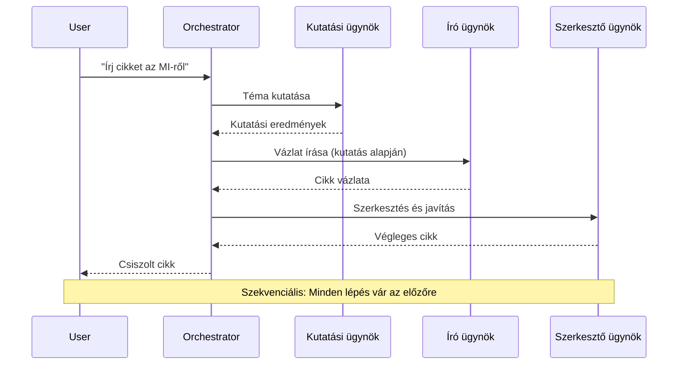
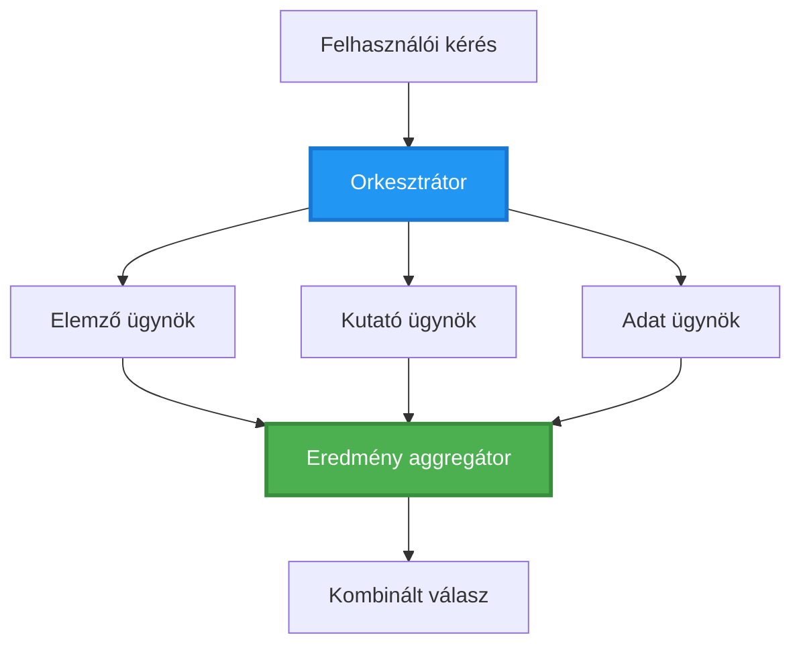
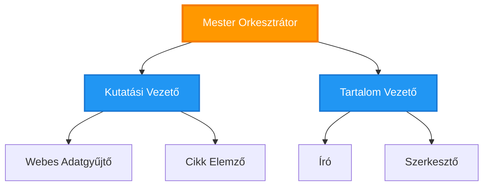
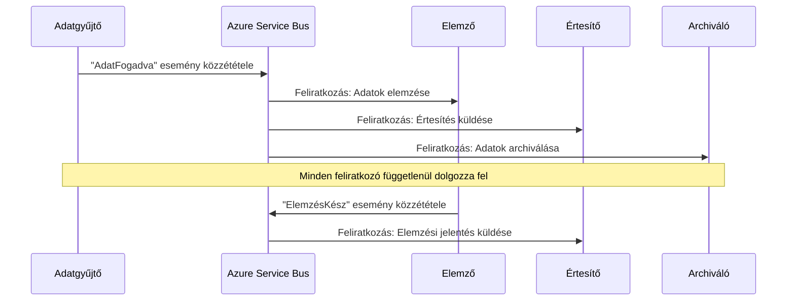
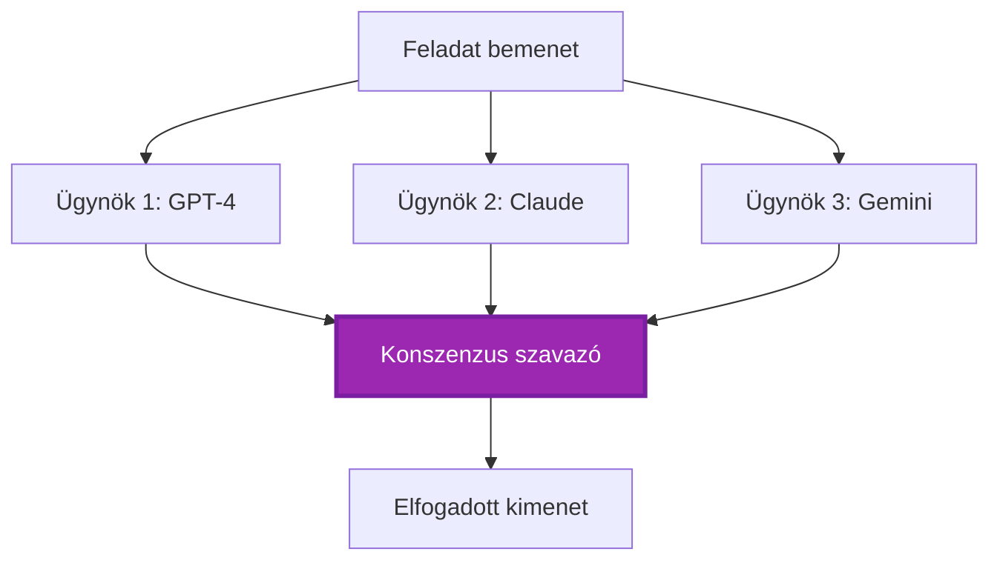
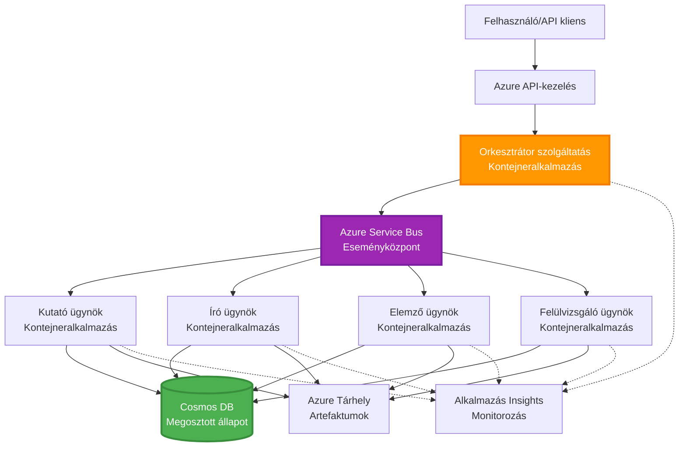

# Többügynökös Koordinációs Minták

⏱️ **Becsült idő**: 60-75 perc | 💰 **Becsült költség**: ~100-300 USD/hó | ⭐ **Komplexitás**: Haladó

**📚 Tanulási útvonal:**
- ← Előző: [Kapacitástervezés](capacity-planning.md) - Erőforrás méretezési és skálázási stratégiák
- 🎯 **Jelenleg itt vagy**: Többügynökös Koordinációs Minták (Orkesztráció, kommunikáció, állapotkezelés)
- → Következő: [SKU kiválasztás](sku-selection.md) - Az Azure szolgáltatások helyes kiválasztása
- 🏠 [Kurzus főoldal](../../README.md)

---

## Amit megtanulsz

A lecke elvégzésével:
- Megérted a **többügynökös architektúra** mintákat és azok alkalmazási területeit
- Megvalósítasz **orkesztrációs mintákat** (központosított, decentralizált, hierarchikus)
- Tervezel **ügynökök közötti kommunikációs** stratégiákat (szinkron, aszinkron, eseményvezérelt)
- Kezeled a **megosztott állapotot** elosztott ügynökök között
- Telepítesz **többügynökös rendszereket** az Azure-on AZD segítségével
- Alkalmazol **koordinációs mintákat** valós AI forgatókönyvekben
- Felügyeled és hibakeresést végzel elosztott ügynökrendszerekben

## Miért fontos a többügynökös koordináció?

### Az evolúció: Egyetlen ügynöktől a többügynökös rendszerig

**Egyetlen ügynök (Egyszerű):**
```
User → Agent → Response
```
- ✅ Könnyen érthető és megvalósítható
- ✅ Gyors egyszerű feladatokhoz
- ❌ Korlátozott egyetlen modell képességei által
- ❌ Nem képes párhuzamosan összetett feladatokat végrehajtani
- ❌ Nincs specializáció

**Többügynökös rendszer (Haladó):**
```
           ┌─────────────┐
           │ Orchestrator│
           └──────┬──────┘
        ┌─────────┼─────────┐
        │         │         │
    ┌───▼──┐  ┌──▼───┐  ┌──▼────┐
    │Agent1│  │Agent2│  │Agent3 │
    │(Plan)│  │(Code)│  │(Review)│
    └──────┘  └──────┘  └───────┘
```
- ✅ Specializált ügynökök konkrét feladatokra
- ✅ Párhuzamos végrehajtás a sebesség érdekében
- ✅ Moduláris és könnyen karbantartható
- ✅ Jobb összetett munkafolyamatok esetén
- ⚠️ Koordinációs logikát igényel

**Analógia**: Az egyetlen ügynök olyan, mint egy ember, aki minden feladatot elvégez. A többügynökös rendszer olyan, mint egy csapat, ahol minden tag specializált képességekkel rendelkezik (kutató, programozó, ellenőrző, író), és együtt dolgoznak.

---

## Alapvető koordinációs minták

### Minta 1: Szekvenciális koordináció (Felelősségi lánc)

**Mikor használjuk**: A feladatoknak meghatározott sorrendben kell végrehajtódniuk, minden ügynök az előző kimenetére épít.


**Előnyök:**
- ✅ Egyértelmű adatfolyam
- ✅ Könnyen hibakereshető
- ✅ Kiszámítható végrehajtási sorrend

**Korlátok:**
- ❌ Lassú (nincs párhuzamosság)
- ❌ Egy hiba blokkolja az egész láncot
- ❌ Nem kezeli az egymástól függő feladatokat

**Példák:**
- Tartalomkészítési folyamat (kutatás → írás → szerkesztés → publikálás)
- Kódgenerálás (tervezés → megvalósítás → tesztelés → telepítés)
- Jelentéskészítés (adatgyűjtés → elemzés → vizualizáció → összefoglaló)

---

### Minta 2: Párhuzamos koordináció (Fan-Out/Fan-In)

**Mikor használjuk**: Független feladatok egyszerre futtathatók, az eredmények a végén kombinálódnak.


**Előnyök:**
- ✅ Gyors (párhuzamos végrehajtás)
- ✅ Hibatűrő (részleges eredmények elfogadhatók)
- ✅ Horizontálisan skálázható

**Korlátok:**
- ⚠️ Az eredmények sorrendje eltérhet
- ⚠️ Aggregációs logikát igényel
- ⚠️ Összetett állapotkezelés

**Példák:**
- Több forrásból történő adatgyűjtés (API-k + adatbázisok + webes adatgyűjtés)
- Versenyképes elemzés (több modell generál megoldásokat, a legjobb kiválasztása)
- Fordítási szolgáltatások (több nyelvre történő fordítás egyszerre)

---

### Minta 3: Hierarchikus koordináció (Menedszer-Munkás)

**Mikor használjuk**: Összetett munkafolyamatok alfeladatokkal, delegálás szükséges.


**Előnyök:**
- ✅ Kezeli az összetett munkafolyamatokat
- ✅ Moduláris és könnyen karbantartható
- ✅ Egyértelmű felelősségi határok

**Korlátok:**
- ⚠️ Összetettebb architektúra
- ⚠️ Magasabb késleltetés (több koordinációs réteg)
- ⚠️ Fejlett orkesztrációt igényel

**Példák:**
- Vállalati dokumentumfeldolgozás (osztályozás → irányítás → feldolgozás → archiválás)
- Többfázisú adatfolyamatok (beolvasás → tisztítás → átalakítás → elemzés → jelentés)
- Összetett automatizációs munkafolyamatok (tervezés → erőforrás-elosztás → végrehajtás → felügyelet)

---

### Minta 4: Eseményvezérelt koordináció (Publish-Subscribe)

**Mikor használjuk**: Ügynököknek eseményekre kell reagálniuk, laza kapcsolódás szükséges.


**Előnyök:**
- ✅ Laza kapcsolódás az ügynökök között
- ✅ Könnyen hozzáadható új ügynökök (csak feliratkozás szükséges)
- ✅ Aszinkron feldolgozás
- ✅ Ellenálló (üzenetmegőrzés)

**Korlátok:**
- ⚠️ Végső konzisztencia
- ⚠️ Összetett hibakeresés
- ⚠️ Üzenetek sorrendjének kihívásai

**Példák:**
- Valós idejű monitorozó rendszerek (riasztások, műszerfalak, naplók)
- Többcsatornás értesítések (e-mail, SMS, push, Slack)
- Adatfeldolgozási folyamatok (ugyanazon adat több fogyasztója)

---

### Minta 5: Konszenzus-alapú koordináció (Szavazás/Kvórum)

**Mikor használjuk**: Több ügynök egyetértése szükséges a folytatáshoz.


**Előnyök:**
- ✅ Magasabb pontosság (több vélemény)
- ✅ Hibatűrő (kisebbségi hibák elfogadhatók)
- ✅ Beépített minőségbiztosítás

**Korlátok:**
- ❌ Költséges (több modellhívás)
- ❌ Lassabb (várakozás minden ügynökre)
- ⚠️ Konfliktuskezelést igényel

**Példák:**
- Tartalom moderálás (több modell vizsgálja a tartalmat)
- Kódellenőrzés (több linter/elemző)
- Orvosi diagnózis (több AI modell, szakértői validáció)

---

## Architektúra Áttekintés

### Teljes többügynökös rendszer az Azure-on


**Kulcskomponensek:**

| Komponens | Cél | Azure Szolgáltatás |
|-----------|-----|--------------------|
| **API Gateway** | Belépési pont, sebességkorlátozás, hitelesítés | API Management |
| **Orkesztrátor** | Ügynökök munkafolyamatainak koordinálása | Container Apps |
| **Üzenetsor** | Aszinkron kommunikáció | Service Bus / Event Hubs |
| **Ügynökök** | Specializált AI munkások | Container Apps / Functions |
| **Állapot tároló** | Megosztott állapot, feladatkövetés | Cosmos DB |
| **Artefakt tároló** | Dokumentumok, eredmények, naplók | Blob Storage |
| **Monitorozás** | Elosztott nyomkövetés, naplók | Application Insights |

---

## Előfeltételek

### Szükséges eszközök

```bash
# Ellenőrizze az Azure Developer CLI-t
azd version
# ✅ Várható: azd verzió 1.0.0 vagy magasabb

# Ellenőrizze az Azure CLI-t
az --version
# ✅ Várható: azure-cli 2.50.0 vagy magasabb

# Ellenőrizze a Dockert (helyi teszteléshez)
docker --version
# ✅ Várható: Docker verzió 20.10 vagy magasabb
```

### Azure követelmények

- Aktív Azure előfizetés
- Jogosultság a következő létrehozására:
  - Container Apps
  - Service Bus névterek
  - Cosmos DB fiókok
  - Tároló fiókok
  - Application Insights

### Tudás előfeltételek

Előzetesen el kell végezned:
- [Konfigurációkezelés](../getting-started/configuration.md)
- [Hitelesítés és biztonság](../getting-started/authsecurity.md)
- [Mikroszolgáltatások példája](../../../../examples/microservices)

---

## Megvalósítási útmutató

### Projektstruktúra

```
multi-agent-system/
├── azure.yaml                    # AZD configuration
├── infra/
│   ├── main.bicep               # Main infrastructure
│   ├── core/
│   │   ├── servicebus.bicep     # Message queue
│   │   ├── cosmos.bicep         # State store
│   │   ├── storage.bicep        # Artifact storage
│   │   └── monitoring.bicep     # Application Insights
│   └── app/
│       ├── orchestrator.bicep   # Orchestrator service
│       └── agent.bicep          # Agent template
└── src/
    ├── orchestrator/            # Orchestration logic
    │   ├── app.py
    │   ├── workflows.py
    │   └── Dockerfile
    ├── agents/
    │   ├── research/            # Research agent
    │   ├── writer/              # Writer agent
    │   ├── analyst/             # Analyst agent
    │   └── reviewer/            # Reviewer agent
    └── shared/
        ├── state_manager.py     # Shared state logic
        └── message_handler.py   # Message handling
```

---

## 1. lecke: Szekvenciális koordinációs minta

### Megvalósítás: Tartalomkészítési folyamat

Építsünk egy szekvenciális folyamatot: Kutatás → Írás → Szerkesztés → Publikálás

### 1. AZD Konfiguráció

**Fájl: `azure.yaml`**

```yaml
name: content-pipeline
metadata:
  template: multi-agent-sequential@1.0.0

services:
  orchestrator:
    project: ./src/orchestrator
    language: python
    host: containerapp
  
  research-agent:
    project: ./src/agents/research
    language: python
    host: containerapp
  
  writer-agent:
    project: ./src/agents/writer
    language: python
    host: containerapp
  
  editor-agent:
    project: ./src/agents/editor
    language: python
    host: containerapp
```

### 2. Infrastruktúra: Service Bus a koordinációhoz

**Fájl: `infra/core/servicebus.bicep`**

```bicep
param name string
param location string
param tags object = {}

resource serviceBusNamespace 'Microsoft.ServiceBus/namespaces@2022-10-01-preview' = {
  name: name
  location: location
  tags: tags
  sku: {
    name: 'Standard'
    tier: 'Standard'
  }
  properties: {
    minimumTlsVersion: '1.2'
  }
}

// Queue for orchestrator → research agent
resource researchQueue 'Microsoft.ServiceBus/namespaces/queues@2022-10-01-preview' = {
  parent: serviceBusNamespace
  name: 'research-tasks'
  properties: {
    maxDeliveryCount: 3
    lockDuration: 'PT5M'
    deadLetteringOnMessageExpiration: true
  }
}

// Queue for research agent → writer agent
resource writerQueue 'Microsoft.ServiceBus/namespaces/queues@2022-10-01-preview' = {
  parent: serviceBusNamespace
  name: 'writer-tasks'
  properties: {
    maxDeliveryCount: 3
    lockDuration: 'PT5M'
  }
}

// Queue for writer agent → editor agent
resource editorQueue 'Microsoft.ServiceBus/namespaces/queues@2022-10-01-preview' = {
  parent: serviceBusNamespace
  name: 'editor-tasks'
  properties: {
    maxDeliveryCount: 3
    lockDuration: 'PT5M'
  }
}

output namespace string = serviceBusNamespace.name
output connectionString string = listKeys('${serviceBusNamespace.id}/AuthorizationRules/RootManageSharedAccessKey', serviceBusNamespace.apiVersion).primaryConnectionString
```

### 3. Megosztott állapotkezelő

**Fájl: `src/shared/state_manager.py`**

```python
from azure.cosmos import CosmosClient, PartitionKey
from datetime import datetime
import os

class StateManager:
    """Manages shared state across agents using Cosmos DB"""
    
    def __init__(self):
        endpoint = os.environ['COSMOS_ENDPOINT']
        key = os.environ['COSMOS_KEY']
        
        self.client = CosmosClient(endpoint, key)
        self.database = self.client.get_database_client('agent-state')
        self.container = self.database.get_container_client('tasks')
    
    def create_task(self, task_id: str, task_type: str, input_data: dict):
        """Create a new task"""
        task = {
            'id': task_id,
            'type': task_type,
            'status': 'pending',
            'input': input_data,
            'created_at': datetime.utcnow().isoformat(),
            'steps': []
        }
        self.container.create_item(task)
        return task
    
    def update_task_step(self, task_id: str, step_name: str, result: dict):
        """Update task with completed step"""
        task = self.container.read_item(task_id, partition_key=task_id)
        
        task['steps'].append({
            'name': step_name,
            'completed_at': datetime.utcnow().isoformat(),
            'result': result
        })
        
        self.container.replace_item(task_id, task)
        return task
    
    def complete_task(self, task_id: str, final_result: dict):
        """Mark task as complete"""
        task = self.container.read_item(task_id, partition_key=task_id)
        task['status'] = 'completed'
        task['result'] = final_result
        task['completed_at'] = datetime.utcnow().isoformat()
        self.container.replace_item(task_id, task)
        return task
    
    def get_task(self, task_id: str):
        """Retrieve task state"""
        return self.container.read_item(task_id, partition_key=task_id)
```

### 4. Orkesztrátor szolgáltatás

**Fájl: `src/orchestrator/app.py`**

```python
from flask import Flask, request, jsonify
from azure.servicebus import ServiceBusClient, ServiceBusMessage
import json
import uuid
import os
from shared.state_manager import StateManager

app = Flask(__name__)
state_manager = StateManager()

# Service Bus kapcsolat
servicebus_connection_str = os.environ['SERVICEBUS_CONNECTION_STRING']
servicebus_client = ServiceBusClient.from_connection_string(servicebus_connection_str)

@app.route('/health', methods=['GET'])
def health():
    return jsonify({'status': 'healthy', 'service': 'orchestrator'})

@app.route('/create-content', methods=['POST'])
def create_content():
    """
    Sequential workflow: Research → Write → Edit → Publish
    """
    data = request.json
    topic = data.get('topic')
    
    if not topic:
        return jsonify({'error': 'Topic required'}), 400
    
    # Feladat létrehozása az állapot tárolóban
    task_id = str(uuid.uuid4())
    task = state_manager.create_task(
        task_id=task_id,
        task_type='content_creation',
        input_data={'topic': topic}
    )
    
    # Üzenet küldése a kutatási ügynöknek (első lépés)
    sender = servicebus_client.get_queue_sender('research-tasks')
    message = ServiceBusMessage(
        body=json.dumps({
            'task_id': task_id,
            'topic': topic,
            'next_queue': 'writer-tasks'  # Hová küldjük az eredményeket
        }),
        content_type='application/json'
    )
    
    with sender:
        sender.send_messages(message)
    
    return jsonify({
        'task_id': task_id,
        'status': 'started',
        'workflow': 'sequential',
        'steps': ['research', 'write', 'edit', 'publish'],
        'message': 'Content creation pipeline initiated'
    }), 202

@app.route('/task/<task_id>', methods=['GET'])
def get_task_status(task_id):
    """Check task status"""
    try:
        task = state_manager.get_task(task_id)
        return jsonify(task)
    except Exception as e:
        return jsonify({'error': str(e)}), 404

if __name__ == '__main__':
    app.run(host='0.0.0.0', port=8080)
```

### 5. Kutató ügynök

**Fájl: `src/agents/research/app.py`**

```python
from azure.servicebus import ServiceBusClient, ServiceBusMessage
from openai import AzureOpenAI
import json
import os
import time
from shared.state_manager import StateManager

# Ügyfelek inicializálása
state_manager = StateManager()
servicebus_client = ServiceBusClient.from_connection_string(
    os.environ['SERVICEBUS_CONNECTION_STRING']
)

openai_client = AzureOpenAI(
    api_key=os.environ['AZURE_OPENAI_API_KEY'],
    api_version="2024-02-01",
    azure_endpoint=os.environ['AZURE_OPENAI_ENDPOINT']
)

def process_research_task(message_data):
    """Process research request and pass to writer"""
    task_id = message_data['task_id']
    topic = message_data['topic']
    next_queue = message_data['next_queue']
    
    print(f"🔬 Researching: {topic}")
    
    # Azure OpenAI hívása kutatáshoz
    response = openai_client.chat.completions.create(
        model="gpt-4",
        messages=[
            {"role": "system", "content": "You are a research assistant. Provide comprehensive research on the given topic."},
            {"role": "user", "content": f"Research this topic thoroughly: {topic}"}
        ],
        max_tokens=1500
    )
    
    research_results = response.choices[0].message.content
    
    # Állapot frissítése
    state_manager.update_task_step(
        task_id=task_id,
        step_name='research',
        result={'research': research_results}
    )
    
    # Küldés a következő ügynöknek (író)
    sender = servicebus_client.get_queue_sender(next_queue)
    message = ServiceBusMessage(
        body=json.dumps({
            'task_id': task_id,
            'topic': topic,
            'research': research_results,
            'next_queue': 'editor-tasks'
        }),
        content_type='application/json'
    )
    
    with sender:
        sender.send_messages(message)
    
    print(f"✅ Research complete for task {task_id}")

def main():
    """Listen to research queue"""
    receiver = servicebus_client.get_queue_receiver('research-tasks')
    
    print("🔬 Research Agent started, listening for tasks...")
    
    with receiver:
        while True:
            messages = receiver.receive_messages(max_wait_time=5)
            for message in messages:
                try:
                    message_data = json.loads(str(message))
                    process_research_task(message_data)
                    receiver.complete_message(message)
                except Exception as e:
                    print(f"❌ Error processing message: {e}")
                    receiver.abandon_message(message)

if __name__ == '__main__':
    main()
```

### 6. Író ügynök

**Fájl: `src/agents/writer/app.py`**

```python
from azure.servicebus import ServiceBusClient, ServiceBusMessage
from openai import AzureOpenAI
import json
import os
from shared.state_manager import StateManager

state_manager = StateManager()
servicebus_client = ServiceBusClient.from_connection_string(
    os.environ['SERVICEBUS_CONNECTION_STRING']
)

openai_client = AzureOpenAI(
    api_key=os.environ['AZURE_OPENAI_API_KEY'],
    api_version="2024-02-01",
    azure_endpoint=os.environ['AZURE_OPENAI_ENDPOINT']
)

def process_writing_task(message_data):
    """Write article based on research"""
    task_id = message_data['task_id']
    topic = message_data['topic']
    research = message_data['research']
    next_queue = message_data['next_queue']
    
    print(f"✍️ Writing article: {topic}")
    
    # Hívja az Azure OpenAI-t cikk írásához
    response = openai_client.chat.completions.create(
        model="gpt-4",
        messages=[
            {"role": "system", "content": "You are a professional writer. Write engaging, well-structured articles."},
            {"role": "user", "content": f"Based on this research:\n\n{research}\n\nWrite a comprehensive article about: {topic}"}
        ],
        max_tokens=2000
    )
    
    article_draft = response.choices[0].message.content
    
    # Állapot frissítése
    state_manager.update_task_step(
        task_id=task_id,
        step_name='writing',
        result={'draft': article_draft}
    )
    
    # Küldés a szerkesztőnek
    sender = servicebus_client.get_queue_sender(next_queue)
    message = ServiceBusMessage(
        body=json.dumps({
            'task_id': task_id,
            'topic': topic,
            'draft': article_draft
        }),
        content_type='application/json'
    )
    
    with sender:
        sender.send_messages(message)
    
    print(f"✅ Article draft complete for task {task_id}")

def main():
    """Listen to writer queue"""
    receiver = servicebus_client.get_queue_receiver('writer-tasks')
    
    print("✍️ Writer Agent started, listening for tasks...")
    
    with receiver:
        while True:
            messages = receiver.receive_messages(max_wait_time=5)
            for message in messages:
                try:
                    message_data = json.loads(str(message))
                    process_writing_task(message_data)
                    receiver.complete_message(message)
                except Exception as e:
                    print(f"❌ Error: {e}")
                    receiver.abandon_message(message)

if __name__ == '__main__':
    main()
```

### 7. Szerkesztő ügynök

**Fájl: `src/agents/editor/app.py`**

```python
from azure.servicebus import ServiceBusClient
from openai import AzureOpenAI
import json
import os
from shared.state_manager import StateManager

state_manager = StateManager()
servicebus_client = ServiceBusClient.from_connection_string(
    os.environ['SERVICEBUS_CONNECTION_STRING']
)

openai_client = AzureOpenAI(
    api_key=os.environ['AZURE_OPENAI_API_KEY'],
    api_version="2024-02-01",
    azure_endpoint=os.environ['AZURE_OPENAI_ENDPOINT']
)

def process_editing_task(message_data):
    """Edit and finalize article"""
    task_id = message_data['task_id']
    topic = message_data['topic']
    draft = message_data['draft']
    
    print(f"📝 Editing article: {topic}")
    
    # Hívja az Azure OpenAI-t szerkesztésre
    response = openai_client.chat.completions.create(
        model="gpt-4",
        messages=[
            {"role": "system", "content": "You are an expert editor. Improve grammar, clarity, and structure."},
            {"role": "user", "content": f"Edit and improve this article:\n\n{draft}"}
        ],
        max_tokens=2000
    )
    
    final_article = response.choices[0].message.content
    
    # Jelölje meg a feladatot késznek
    state_manager.complete_task(
        task_id=task_id,
        final_result={
            'topic': topic,
            'final_article': final_article,
            'word_count': len(final_article.split())
        }
    )
    
    print(f"✅ Article finalized for task {task_id}")

def main():
    """Listen to editor queue"""
    receiver = servicebus_client.get_queue_receiver('editor-tasks')
    
    print("📝 Editor Agent started, listening for tasks...")
    
    with receiver:
        while True:
            messages = receiver.receive_messages(max_wait_time=5)
            for message in messages:
                try:
                    message_data = json.loads(str(message))
                    process_editing_task(message_data)
                    receiver.complete_message(message)
                except Exception as e:
                    print(f"❌ Error: {e}")
                    receiver.abandon_message(message)

if __name__ == '__main__':
    main()
```

### 8. Telepítés és tesztelés

```bash
# Inicializálás és telepítés
azd init
azd up

# Szerezd meg az orchestrator URL-t
ORCHESTRATOR_URL=$(azd env get-values | grep ORCHESTRATOR_URL | cut -d '=' -f2 | tr -d '"')

# Tartalom létrehozása
curl -X POST $ORCHESTRATOR_URL/create-content \
  -H "Content-Type: application/json" \
  -d '{"topic": "The Future of AI in Healthcare"}'
```

**✅ Várható kimenet:**
```json
{
  "task_id": "a1b2c3d4-e5f6-7890-abcd-ef1234567890",
  "status": "started",
  "workflow": "sequential",
  "steps": ["research", "write", "edit", "publish"],
  "message": "Content creation pipeline initiated"
}
```

**Feladat előrehaladásának ellenőrzése:**
```bash
TASK_ID="a1b2c3d4-e5f6-7890-abcd-ef1234567890"
curl $ORCHESTRATOR_URL/task/$TASK_ID
```

**✅ Várható kimenet (befejezve):**
```json
{
  "id": "a1b2c3d4-e5f6-7890-abcd-ef1234567890",
  "type": "content_creation",
  "status": "completed",
  "steps": [
    {
      "name": "research",
      "completed_at": "2025-11-19T10:30:00Z",
      "result": {"research": "..."}
    },
    {
      "name": "writing",
      "completed_at": "2025-11-19T10:32:00Z",
      "result": {"draft": "..."}
    }
  ],
  "result": {
    "topic": "The Future of AI in Healthcare",
    "final_article": "...",
    "word_count": 1500
  }
}
```

---

## 2. lecke: Párhuzamos koordinációs minta

### Megvalósítás: Többforrású kutatási aggregátor

Építsünk egy párhuzamos rendszert, amely egyszerre gyűjt információt több forrásból.

### Párhuzamos orkesztrátor

**Fájl: `src/orchestrator/parallel_workflow.py`**

```python
from flask import Flask, request, jsonify
from azure.servicebus import ServiceBusClient, ServiceBusMessage
import json
import uuid
import os
from shared.state_manager import StateManager

app = Flask(__name__)
state_manager = StateManager()

servicebus_client = ServiceBusClient.from_connection_string(
    os.environ['SERVICEBUS_CONNECTION_STRING']
)

@app.route('/research-parallel', methods=['POST'])
def research_parallel():
    """
    Parallel workflow: Multiple agents work simultaneously
    """
    data = request.json
    query = data.get('query')
    
    task_id = str(uuid.uuid4())
    task = state_manager.create_task(
        task_id=task_id,
        task_type='parallel_research',
        input_data={
            'query': query,
            'agents': ['web', 'academic', 'news', 'social']
        }
    )
    
    # Szétküldés: Küldés minden ügynöknek egyszerre
    agents = [
        ('web-research-queue', 'web'),
        ('academic-research-queue', 'academic'),
        ('news-research-queue', 'news'),
        ('social-research-queue', 'social')
    ]
    
    for queue_name, agent_type in agents:
        sender = servicebus_client.get_queue_sender(queue_name)
        message = ServiceBusMessage(
            body=json.dumps({
                'task_id': task_id,
                'query': query,
                'agent_type': agent_type,
                'result_queue': 'aggregation-queue'
            }),
            content_type='application/json'
        )
        
        with sender:
            sender.send_messages(message)
    
    return jsonify({
        'task_id': task_id,
        'status': 'started',
        'workflow': 'parallel',
        'agents_dispatched': 4,
        'message': 'Parallel research initiated'
    }), 202

if __name__ == '__main__':
    app.run(host='0.0.0.0', port=8080)
```

### Aggregációs logika

**Fájl: `src/agents/aggregator/app.py`**

```python
from azure.servicebus import ServiceBusClient
import json
import os
from collections import defaultdict
from shared.state_manager import StateManager

state_manager = StateManager()
servicebus_client = ServiceBusClient.from_connection_string(
    os.environ['SERVICEBUS_CONNECTION_STRING']
)

# Kövesse nyomon az eredményeket feladatonként
task_results = defaultdict(list)
expected_agents = 4  # web, tudományos, hírek, közösségi

def process_result(message_data):
    """Aggregate results from parallel agents"""
    task_id = message_data['task_id']
    agent_type = message_data['agent_type']
    result = message_data['result']
    
    # Eredmény tárolása
    task_results[task_id].append({
        'agent': agent_type,
        'data': result
    })
    
    print(f"📊 Received result from {agent_type} agent ({len(task_results[task_id])}/{expected_agents})")
    
    # Ellenőrizze, hogy minden ügynök befejezte-e (fan-in)
    if len(task_results[task_id]) == expected_agents:
        print(f"✅ All agents completed for task {task_id}. Aggregating...")
        
        # Eredmények kombinálása
        aggregated = {
            'query': message_data['query'],
            'sources': task_results[task_id],
            'summary': generate_summary(task_results[task_id])
        }
        
        # Jelölje késznek
        state_manager.complete_task(task_id, aggregated)
        
        # Takarítás
        del task_results[task_id]
        
        print(f"✅ Aggregation complete for task {task_id}")

def generate_summary(results):
    """Generate summary from all sources"""
    summaries = [r['data'].get('summary', '') for r in results]
    return '\n\n'.join(summaries)

def main():
    """Listen to aggregation queue"""
    receiver = servicebus_client.get_queue_receiver('aggregation-queue')
    
    print("📊 Aggregator started, listening for results...")
    
    with receiver:
        while True:
            messages = receiver.receive_messages(max_wait_time=5)
            for message in messages:
                try:
                    message_data = json.loads(str(message))
                    process_result(message_data)
                    receiver.complete_message(message)
                except Exception as e:
                    print(f"❌ Error: {e}")
                    receiver.abandon_message(message)

if __name__ == '__main__':
    main()
```

**A párhuzamos minta előnyei:**
- ⚡ **4x gyorsabb** (ügynökök egyszerre futnak)
- 🔄 **Hibatűrő** (részleges eredmények elfogadhatók)
- 📈 **Skálázható** (könnyen hozzáadható több ügynök)

---

## Gyakorlati feladatok

### Feladat 1: Időkorlát kezelés hozzáadása ⭐⭐ (Közepes)

**Cél**: Időkorlát logika megvalósítása, hogy az aggregátor ne várjon örökké lassú ügynökökre.

**Lépések**:

1. **Időkorlát nyomon követése az aggregátorban:**

```python
from datetime import datetime, timedelta

task_timeouts = {}  # feladat_azonosító -> lejárati_idő

def process_result(message_data):
    task_id = message_data['task_id']
    
    # Időtúllépés beállítása az első eredményre
    if task_id not in task_timeouts:
        task_timeouts[task_id] = datetime.utcnow() + timedelta(seconds=30)
    
    task_results[task_id].append({
        'agent': message_data['agent_type'],
        'data': message_data['result']
    })
    
    # Ellenőrizze, hogy befejeződött-e VAGY időtúllépés történt-e
    if len(task_results[task_id]) == expected_agents or \
       datetime.utcnow() > task_timeouts[task_id]:
        
        print(f"📊 Aggregating with {len(task_results[task_id])}/{expected_agents} results")
        
        aggregated = {
            'query': message_data['query'],
            'sources': task_results[task_id],
            'completed_agents': len(task_results[task_id]),
            'timed_out': len(task_results[task_id]) < expected_agents
        }
        
        state_manager.complete_task(task_id, aggregated)
        
        # Takarítás
        del task_results[task_id]
        del task_timeouts[task_id]
```

2. **Tesztelés mesterséges késleltetésekkel:**

```python
# Egy ügynöknél késleltetést adjon hozzá a lassú feldolgozás szimulálásához
import time
time.sleep(35)  # Meghaladja a 30 másodperces időkorlátot
```

3. **Telepítés és ellenőrzés:**

```bash
azd deploy aggregator

# Feladat beküldése
curl -X POST $ORCHESTRATOR_URL/research-parallel \
  -H "Content-Type: application/json" \
  -d '{"query": "AI safety research"}'

# Eredmények ellenőrzése 30 másodperc után
curl $ORCHESTRATOR_URL/task/$TASK_ID
```

**✅ Siker kritériumok:**
- ✅ A feladat 30 másodperc után befejeződik, még ha az ügynökök nem is teljesítik
- ✅ A válasz részleges eredményeket jelez (`"timed_out": true`)
- ✅ Az elérhető eredmények visszatérnek (3 a 4 ügynökből)

**Idő**: 20-25 perc

---

### Feladat 2: Újrapróbálkozási logika megvalósítása ⭐⭐⭐ (Haladó)

**Cél**: Automatikus újrapróbálkozás a sikertelen ügynökfeladatoknál, mielőtt feladnánk.

**Lépések**:

1. **Újrapróbálkozás nyomon követése az orkesztrátorban:**

```python
from dataclasses import dataclass
from typing import Dict

@dataclass
class RetryConfig:
    max_retries: int = 3
    backoff_seconds: int = 5

retry_counts: Dict[str, int] = {}  # message_id -> újrapróbálkozások száma

def send_with_retry(queue_name: str, message_data: dict, retry_config: RetryConfig):
    """Send message with retry metadata"""
    message_id = message_data.get('message_id', str(uuid.uuid4()))
    message_data['message_id'] = message_id
    message_data['retry_count'] = retry_counts.get(message_id, 0)
    message_data['max_retries'] = retry_config.max_retries
    
    sender = servicebus_client.get_queue_sender(queue_name)
    message = ServiceBusMessage(
        body=json.dumps(message_data),
        content_type='application/json',
        message_id=message_id
    )
    
    with sender:
        sender.send_messages(message)
```

2. **Újrapróbálkozási kezelő hozzáadása az ügynökökhöz:**

```python
def process_with_retry(message, receiver, process_func):
    """Process message with automatic retry on failure"""
    try:
        message_data = json.loads(str(message))
        
        # Feldolgozza az üzenetet
        process_func(message_data)
        
        # Siker - befejezve
        receiver.complete_message(message)
        
    except Exception as e:
        message_id = message.message_id
        retry_count = message_data.get('retry_count', 0)
        max_retries = message_data.get('max_retries', 3)
        
        if retry_count < max_retries:
            # Újrapróbálkozás: elhagyás és újrasorba állítás növelt számlálóval
            print(f"⚠️ Retry {retry_count + 1}/{max_retries} for message {message_id}")
            
            message_data['retry_count'] = retry_count + 1
            
            # Visszaküldés ugyanabba a sorba késleltetéssel
            time.sleep(5 * (retry_count + 1))  # Exponenciális visszalépés
            send_with_retry(queue_name, message_data, RetryConfig())
            
            receiver.complete_message(message)  # Eredeti eltávolítása
        else:
            # Maximális újrapróbálkozások túllépve - áthelyezés a halott levél sorba
            print(f"❌ Max retries exceeded for message {message_id}")
            receiver.dead_letter_message(
                message,
                reason="MaxRetriesExceeded",
                error_description=str(e)
            )
```

3. **Halott levélsor monitorozása:**

```python
def monitor_dead_letters():
    """Check dead letter queue for failed messages"""
    receiver = servicebus_client.get_queue_receiver(
        'research-queue',
        sub_queue='deadletter'
    )
    
    with receiver:
        messages = receiver.receive_messages(max_wait_time=5)
        for message in messages:
            print(f"☠️ Dead letter: {message.message_id}")
            print(f"Reason: {message.dead_letter_reason}")
            print(f"Description: {message.dead_letter_error_description}")
```

**✅ Siker kritériumok:**
- ✅ Sikertelen feladatok automatikusan újrapróbálkoznak (legfeljebb 3 alkalommal)
- ✅ Exponenciális visszaállás az újrapróbálkozások között (5s, 10s, 15s)
- ✅ Maximális újrapróbálkozás után az üzenetek a halott levélsorba kerülnek
- ✅ A halott levélsor monitorozható és újra lejátszható

**Idő**: 30-40 perc

---

### Feladat 3: Áramköri megszakító megvalósítása ⭐⭐⭐ (Haladó)

**Cél**: Megakadályozni a láncreakciós hibákat azáltal, hogy leállítjuk a kéréseket a hibás ügynökökhöz.

**Lépések**:

1. **Áramköri megszakító osztály létrehozása:**

```python
from enum import Enum
from datetime import datetime, timedelta

class CircuitState(Enum):
    CLOSED = "closed"      # Normál működés
    OPEN = "open"          # Hiba, kérések elutasítása
    HALF_OPEN = "half_open"  # Tesztelés, hogy helyreállt-e

class CircuitBreaker:
    def __init__(self, failure_threshold=5, timeout_seconds=60):
        self.failure_threshold = failure_threshold
        self.timeout_seconds = timeout_seconds
        self.failure_count = 0
        self.last_failure_time = None
        self.state = CircuitState.CLOSED
    
    def call(self, func):
        """Execute function with circuit breaker protection"""
        if self.state == CircuitState.OPEN:
            # Ellenőrizze, hogy lejárt-e az időkorlát
            if datetime.utcnow() - self.last_failure_time > timedelta(seconds=self.timeout_seconds):
                self.state = CircuitState.HALF_OPEN
                print("🔄 Circuit breaker: HALF_OPEN (testing)")
            else:
                raise Exception(f"Circuit breaker OPEN for agent. Try again in {self.timeout_seconds}s")
        
        try:
            result = func()
            
            # Siker
            if self.state == CircuitState.HALF_OPEN:
                self.state = CircuitState.CLOSED
                self.failure_count = 0
                print("✅ Circuit breaker: CLOSED (recovered)")
            
            return result
            
        except Exception as e:
            self.failure_count += 1
            self.last_failure_time = datetime.utcnow()
            
            if self.failure_count >= self.failure_threshold:
                self.state = CircuitState.OPEN
                print(f"🔴 Circuit breaker: OPEN (too many failures)")
            
            raise e
```

2. **Alkalmazás az ügynökhívásokra:**

```python
# Az orchestrátorban
agent_circuits = {
    'web': CircuitBreaker(failure_threshold=5, timeout_seconds=60),
    'academic': CircuitBreaker(failure_threshold=5, timeout_seconds=60),
    'news': CircuitBreaker(failure_threshold=5, timeout_seconds=60),
    'social': CircuitBreaker(failure_threshold=5, timeout_seconds=60)
}

def send_to_agent(agent_type, message_data):
    """Send with circuit breaker protection"""
    circuit = agent_circuits[agent_type]
    
    try:
        circuit.call(lambda: send_message(agent_type, message_data))
    except Exception as e:
        print(f"⚠️ Skipping {agent_type} agent: {e}")
        # Folytassa más ügynökökkel
```

3. **Áramköri megszakító tesztelése:**

```bash
# Szimulálja az ismételt hibákat (állítsa le egy ügynököt)
az containerapp stop --name web-research-agent --resource-group rg-agents

# Küldjön több kérést
for i in {1..10}; do
  curl -X POST $ORCHESTRATOR_URL/research-parallel \
    -H "Content-Type: application/json" \
    -d '{"query": "test query '$i'"}'
  sleep 2
done

# Ellenőrizze a naplókat - 5 hiba után nyitott áramkört kell látni
azd logs orchestrator --tail 50
```

**✅ Siker kritériumok:**
- ✅ 5 hiba után az áramkör nyitott állapotba kerül (elutasítja a kéréseket)
- ✅ 60 másodperc után az áramkör félig nyitott állapotba kerül (teszteli a helyreállítást)
- ✅ Más ügynökök normálisan folytatják a munkát
- ✅ Az áramkör automatikusan bezárul, amikor az ügynök helyreáll

**Idő**: 40-50 perc

---

## Monitorozás és hibakeresés

### Elosztott nyomkövetés az Application Insights segítségével

**Fájl: `src/shared/tracing.py`**

```python
from opencensus.ext.azure.log_exporter import AzureLogHandler
from opencensus.ext.azure.trace_exporter import AzureExporter
from opencensus.trace import config_integration
from opencensus.trace.tracer import Tracer
from opencensus.trace.samplers import AlwaysOnSampler
import logging
import os

# Nyomkövetés konfigurálása
config_integration.trace_integrations(['requests', 'logging'])

connection_string = os.environ.get('APPLICATIONINSIGHTS_CONNECTION_STRING')

# Nyomkövető létrehozása
tracer = Tracer(
    exporter=AzureExporter(connection_string=connection_string),
    sampler=AlwaysOnSampler()
)

# Naplózás konfigurálása
logger = logging.getLogger(__name__)
logger.addHandler(AzureLogHandler(connection_string=connection_string))
logger.setLevel(logging.INFO)

def trace_agent_call(agent_name, task_id, operation):
    """Trace agent operations"""
    with tracer.span(name=f'{agent_name}.{operation}') as span:
        span.add_attribute('agent', agent_name)
        span.add_attribute('task_id', task_id)
        span.add_attribute('operation', operation)
        
        try:
            result = operation()
            span.add_attribute('status', 'success')
            return result
        except Exception as e:
            span.add_attribute('status', 'error')
            span.add_attribute('error', str(e))
            raise
```

### Application Insights lekérdezések

**Többügynökös munkafolyamatok nyomon követése:**

```kusto
// Trace complete workflow for a task
traces
| where customDimensions.task_id == "a1b2c3d4-..."
| project timestamp, message, customDimensions.agent, customDimensions.operation
| order by timestamp asc
```

**Ügynök teljesítmény összehasonlítása:**

```kusto
// Compare agent execution times
dependencies
| where name contains "agent"
| summarize 
    avg_duration = avg(duration),
    p95_duration = percentile(duration, 95),
    count = count()
  by agent = tostring(customDimensions.agent)
| order by avg_duration desc
```

**Hibaelemzés:**

```kusto
// Find which agents fail most
exceptions
| where customDimensions.agent != ""
| summarize 
    failure_count = count(),
    unique_errors = dcount(outerMessage)
  by agent = tostring(customDimensions.agent)
| order by failure_count desc
```

---

## Költségelemzés

### Többügynökös rendszer költségei (havi becslések)

| Komponens | Konfiguráció | Költség |
|-----------|--------------|---------|
| **Orkesztrátor** | 1 Container App (1 vCPU, 2GB) | $30-50 |
| **4 Ügynök** | 4 Container Apps (0.5 vCPU, 1GB mindegyik) | $60-120 |
| **Service Bus** | Standard szint, 10M üzenet | $10-20 |
| **Cosmos DB** | Szerver nélküli, 5GB tárhely, 1M RUs | $25-50 |
| **Blob Storage** | 10GB tárhely,
## Hibaelhárítási útmutató

### Probléma: Üzenetek elakadnak a sorban

**Tünetek:**
- Üzenetek halmozódnak a sorban
- Ügynökök nem dolgozzák fel őket
- A feladat állapota "függőben" marad

**Diagnózis:**
```bash
# Ellenőrizze a sor mélységét
az servicebus queue show \
  --namespace-name mybus \
  --name research-tasks \
  --query "countDetails"

# Ellenőrizze az ügynök állapotát
azd logs research-agent --tail 50
```

**Megoldások:**

1. **Ügynök replikák számának növelése:**
   ```bash
   az containerapp update \
     --name research-agent \
     --min-replicas 3 \
     --max-replicas 10
   ```

2. **Halott levélsor ellenőrzése:**
   ```bash
   az servicebus queue show \
     --namespace-name mybus \
     --name research-tasks \
     --query "countDetails.deadLetterMessageCount"
   ```

---

### Probléma: Feladat időtúllépés/nem fejeződik be

**Tünetek:**
- A feladat állapota "folyamatban" marad
- Néhány ügynök befejezi, mások nem
- Nincsenek hibaüzenetek

**Diagnózis:**
```bash
# Ellenőrizze a feladat állapotát
curl $ORCHESTRATOR_URL/task/$TASK_ID

# Ellenőrizze az Application Insights-t
# Futtassa a lekérdezést: traces | where customDimensions.task_id == "..."
```

**Megoldások:**

1. **Időtúllépés beállítása az aggregátorban (1. gyakorlat)**

2. **Ügynök hibák ellenőrzése:**
   ```bash
   azd logs --follow | grep "ERROR\|FAIL"
   ```

3. **Győződjön meg arról, hogy minden ügynök fut:**
   ```bash
   az containerapp list \
     --resource-group rg-agents \
     --query "[].{name:name, status:properties.runningStatus}"
   ```

---

## További információk

### Hivatalos dokumentáció
- [Azure Service Bus](https://learn.microsoft.com/azure/service-bus-messaging/service-bus-messaging-overview)
- [Cosmos DB](https://learn.microsoft.com/azure/cosmos-db/introduction)
- [Container Apps DAPR](https://learn.microsoft.com/azure/container-apps/dapr-overview)
- [Multi-Agent Design Patterns](https://learn.microsoft.com/azure/architecture/guide/ai/multi-agent-systems)

### Következő lépések ebben a kurzusban
- ← Előző: [Kapacitástervezés](capacity-planning.md)
- → Következő: [SKU kiválasztása](sku-selection.md)
- 🏠 [Kurzus kezdőlapja](../../README.md)

### Kapcsolódó példák
- [Mikroszolgáltatások példa](../../../../examples/microservices) - Szolgáltatás kommunikációs minták
- [Azure OpenAI példa](../../../../examples/azure-openai-chat) - AI integráció

---

## Összefoglalás

**Amit megtanultál:**
- ✅ Öt koordinációs minta (sorrendi, párhuzamos, hierarchikus, eseményvezérelt, konszenzus)
- ✅ Több ügynökös architektúra az Azure-on (Service Bus, Cosmos DB, Container Apps)
- ✅ Állapotkezelés elosztott ügynökök között
- ✅ Időtúllépés kezelése, újrapróbálkozások és áramkör-megszakítók
- ✅ Elosztott rendszerek monitorozása és hibakeresése
- ✅ Költségoptimalizálási stratégiák

**Fontos tanulságok:**
1. **Válassza ki a megfelelő mintát** - Sorrendi a rendezett munkafolyamatokhoz, párhuzamos a sebességhez, eseményvezérelt a rugalmassághoz
2. **Kezelje az állapotot körültekintően** - Használjon Cosmos DB-t vagy hasonlót a megosztott állapothoz
3. **Kezelje a hibákat rugalmasan** - Időtúllépések, újrapróbálkozások, áramkör-megszakítók, halott levélsorok
4. **Monitorozzon mindent** - Az elosztott nyomkövetés elengedhetetlen a hibakereséshez
5. **Optimalizálja a költségeket** - Skálázás nullára, serverless használata, gyorsítótárak alkalmazása

**Következő lépések:**
1. Végezze el a gyakorlati feladatokat
2. Építsen egy több ügynökös rendszert saját felhasználási esetéhez
3. Tanulmányozza [SKU kiválasztása](sku-selection.md) témát a teljesítmény és költségek optimalizálásához

---

<!-- CO-OP TRANSLATOR DISCLAIMER START -->
**Felelősség kizárása**:  
Ez a dokumentum az AI fordítási szolgáltatás [Co-op Translator](https://github.com/Azure/co-op-translator) segítségével lett lefordítva. Bár törekszünk a pontosságra, kérjük, vegye figyelembe, hogy az automatikus fordítások hibákat vagy pontatlanságokat tartalmazhatnak. Az eredeti dokumentum az eredeti nyelvén tekintendő hiteles forrásnak. Kritikus információk esetén javasolt professzionális emberi fordítást igénybe venni. Nem vállalunk felelősséget semmilyen félreértésért vagy téves értelmezésért, amely a fordítás használatából eredhet.
<!-- CO-OP TRANSLATOR DISCLAIMER END -->