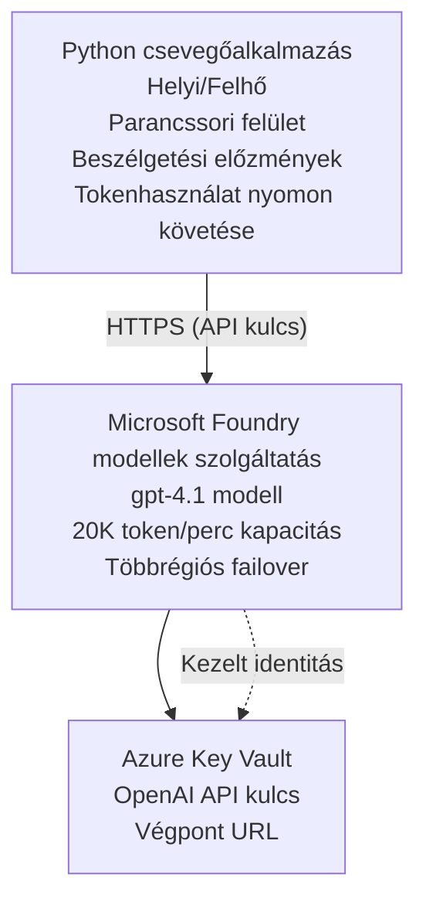

# Microsoft Foundry Models Chat Alkalmazás

**Tanulási út:** Középhaladó ⭐⭐ | **Idő:** 35-45 perc | **Költség:** $50-200/hó

Egy teljes Microsoft Foundry Models chat alkalmazás, amely az Azure Developer CLI (azd) segítségével van telepítve. Ez a példa bemutatja a gpt-4.1 modell telepítését, a biztonságos API-hozzáférést és egy egyszerű chat felületet.

## 🎯 Amit tanulni fogsz

- Microsoft Foundry Models szolgáltatás telepítése gpt-4.1 modellel  
- OpenAI API kulcsok biztonságos tárolása Key Vault használatával  
- Egyszerű chat felület készítése Pythonban  
- Token használat és költségek nyomon követése  
- Korlátozás és hibakezelés megvalósítása  

## 📦 Mi tartalmazza

✅ **Microsoft Foundry Models Szolgáltatás** - gpt-4.1 modell telepítése  
✅ **Python Chat App** - Egyszerű parancssoros chat felület  
✅ **Key Vault Integráció** - Biztonságos API kulcstárolás  
✅ **ARM sablonok** - Teljes infrastruktúra kód formájában  
✅ **Költségfigyelés** - Token használat nyomon követése  
✅ **Korlátozás** - Kvóta kimerülésének megelőzése  

## Architektúra


## Előfeltételek

### Szükséges

- **Azure Developer CLI (azd)** - [Telepítési útmutató](https://learn.microsoft.com/azure/developer/azure-developer-cli/install-azd)
- **Azure előfizetés** OpenAI hozzáféréssel - [Hozzáférés igénylése](https://aka.ms/oai/access)
- **Python 3.9+** - [Python telepítése](https://www.python.org/downloads/)

### Előfeltételek ellenőrzése

```bash
# Ellenőrizze az azd verziót (szükséges az 1.5.0 vagy újabb)
azd version

# Azure bejelentkezés ellenőrzése
azd auth login

# Python verzió ellenőrzése
python --version  # vagy python3 --version

# OpenAI hozzáférés ellenőrzése (ellenőrizze az Azure Portalon)
az cognitiveservices account list-skus \
  --kind OpenAI \
  --location eastus
```

> **⚠️ Fontos:** A Microsoft Foundry Models alkalmazás jóváhagyást igényel. Ha még nem igényelted, látogass el a [aka.ms/oai/access](https://aka.ms/oai/access) oldalra. A jóváhagyás általában 1-2 munkanapot vesz igénybe.

## ⏱️ Telepítési idővonal

| Fázis | Időtartam | Mi történik |
|-------|----------|--------------|
| Előfeltételek ellenőrzése | 2-3 perc | OpenAI kvóta elérhetőségének ellenőrzése |
| Infrastruktúra telepítése | 8-12 perc | OpenAI, Key Vault, modell telepítés létrehozása |
| Alkalmazás konfigurálása | 2-3 perc | Környezet és függőségek beállítása |
| **Összesen** | **12-18 perc** | Készen áll a chatre gpt-4.1-gyel |

**Megjegyzés:** Első OpenAI telepítés hosszabb ideig tarthat a modell előkészítése miatt.

## Gyors indulás

```bash
# Navigáljon a példához
cd examples/azure-openai-chat

# Inicializálja a környezetet
azd env new myopenai

# Telepítsen mindent (infrastruktúra + konfiguráció)
azd up
# Kérni fogjuk, hogy:
# 1. Válassza ki az Azure előfizetést
# 2. Válasszon elhelyezkedést OpenAI elérhetőséggel (pl. eastus, eastus2, westus)
# 3. Várjon 12-18 percet a telepítésre

# Telepítse a Python függőségeket
pip install -r requirements.txt

# Kezdje el a beszélgetést!
python chat.py
```

**Várt kimenet:**
```
🤖 Microsoft Foundry Models Chat Application
Connected to: gpt-4.1 (eastus)
Type your message (or 'quit' to exit)

You: Hello! Tell me about Microsoft Foundry Models.
Assistant: Microsoft Foundry Models Service provides REST API access to OpenAI's powerful language models including gpt-4.1, GPT-3.5-Turbo, and Embeddings...

[Tokens used: 145 | Estimated cost: $0.0044]
```

## ✅ Telepítés ellenőrzése

### 1. lépés: Azure erőforrások ellenőrzése

```bash
# Telepített erőforrások megtekintése
azd show

# A várható kimenet a következőket mutatja:
# - OpenAI Szolgáltatás: (erőforrás neve)
# - Kulcstároló: (erőforrás neve)
# - Telepítés: gpt-4.1
# - Helyszín: eastus (vagy az Ön által választott régió)
```

### 2. lépés: OpenAI API tesztelése

```bash
# Szerezze be az OpenAI végpontot és kulcsot
OPENAI_ENDPOINT=$(azd env get-value AZURE_OPENAI_ENDPOINT)
OPENAI_KEY=$(azd env get-value AZURE_OPENAI_API_KEY)

# API hívás tesztelése
curl "$OPENAI_ENDPOINT/openai/deployments/gpt-4.1/chat/completions?api-version=2024-08-01-preview" \
  -H "Content-Type: application/json" \
  -H "api-key: $OPENAI_KEY" \
  -d '{
    "messages": [{"role": "user", "content": "Say hello!"}],
    "max_tokens": 50
  }'
```

**Várt válasz:**
```json
{
  "choices": [
    {
      "message": {
        "role": "assistant",
        "content": "Hello! How can I assist you today?"
      }
    }
  ],
  "usage": {
    "prompt_tokens": 8,
    "completion_tokens": 9,
    "total_tokens": 17
  }
}
```

### 3. lépés: Key Vault hozzáférés ellenőrzése

```bash
# Titkok listázása a Key Vaultban
KV_NAME=$(azd env get-value AZURE_KEY_VAULT_NAME)

az keyvault secret list \
  --vault-name $KV_NAME \
  --query "[].name" \
  --output table
```

**Várt titkok:**
- `openai-api-key`
- `openai-endpoint`

**Siker kritériumok:**
- ✅ OpenAI szolgáltatás telepítve gpt-4.1 modellel  
- ✅ API hívás érvényes választ ad  
- ✅ Titkok tárolva a Key Vault-ban  
- ✅ Token használat nyomon követése működik  

## Projekt struktúra

```
azure-openai-chat/
├── README.md                   ✅ This guide
├── azure.yaml                  ✅ AZD configuration
├── infra/                      ✅ Infrastructure as Code
│   ├── main.bicep             ✅ Main Bicep template
│   ├── main.parameters.json   ✅ Parameters
│   └── openai.bicep           ✅ OpenAI resource definition
├── src/                        ✅ Application code
│   ├── chat.py                ✅ Chat interface
│   ├── config.py              ✅ Configuration loader
│   └── requirements.txt       ✅ Python dependencies
└── .gitignore                  ✅ Git ignore rules
```

## Alkalmazás funkciói

### Chat felület (`chat.py`)

A chat alkalmazás tartalmazza:

- **Beszélgetés előzményei** - Üzenetek közötti kontextus megtartása  
- **Token számlálás** - Használat követése és költségbecslés  
- **Hibakezelés** - Korlátozások és API hibák szakszerű kezelése  
- **Költségbecslés** - Üzenetenkénti valós idejű költségszámítás  
- **Streaming támogatás** - Opcionális folyamatos válaszadás  

### Parancsok

Chat közben használhatod:
- `quit` vagy `exit` - Munkamenet vége  
- `clear` - Beszélgetési előzmények törlése  
- `tokens` - Összes token használat megjelenítése  
- `cost` - Becslés a teljes költségre  

### Konfiguráció (`config.py`)

Beállítások környezeti változókból töltődnek be:
```python
AZURE_OPENAI_ENDPOINT  # Key Vault-ból
AZURE_OPENAI_API_KEY   # Key Vault-ból
AZURE_OPENAI_MODEL     # Alapértelmezett: gpt-4.1
AZURE_OPENAI_MAX_TOKENS # Alapértelmezett: 800
```

## Használati példák

### Egyszerű chat

```bash
python chat.py
```

### Chat egyéni modellel

```bash
export AZURE_OPENAI_MODEL=gpt-35-turbo
python chat.py
```

### Streaming chates használat

```bash
python chat.py --stream
```

### Példa beszélgetés

```
You: Explain Microsoft Foundry Models Service in 3 sentences.
Assistant: Microsoft Foundry Models Service is Microsoft Azure's cloud platform offering 
that provides access to OpenAI's powerful language models. It enables developers 
to integrate capabilities like gpt-4.1 into their applications with enterprise-grade 
security and compliance. The service includes features for content filtering, 
abuse monitoring, and responsible AI practices.

[Tokens used: 89 | Estimated cost: $0.0027]

You: What models are available?
Assistant: Microsoft Foundry Models Service offers several model families including gpt-4.1 
(most capable), GPT-3.5-Turbo (faster and cost-effective), and Embeddings models 
for vector search. Each model has different capabilities, pricing, and token limits.

[Tokens used: 67 | Estimated cost: $0.0020]

Total session: 156 tokens | $0.0047
```

## Költségkezelés

### Token árak (gpt-4.1)

| Modell | Bemenet (1K tokenenként) | Kimenet (1K tokenenként) |
|--------|--------------------------|--------------------------|
| gpt-4.1 | $0.03 | $0.06 |
| GPT-3.5-Turbo | $0.0015 | $0.002 |

### Becslés havi költségre

Használati minták alapján:

| Használati szint | Üzenetek/nap | Tokenek/nap | Havi költség |
|------------------|--------------|-------------|--------------|
| **Könnyű** | 20 üzenet | 3,000 token | $3-5 |
| **Közepes** | 100 üzenet | 15,000 token | $15-25 |
| **Nehéz** | 500 üzenet | 75,000 token | $75-125 |

**Alap infrastruktúra költség:** $1-2/hó (Key Vault + minimális számítástechnika)

### Költség optimalizálási tippek

```bash
# 1. Egyszerűbb feladatokhoz használja a GPT-3.5-Turbót (20-szor olcsóbb)
export AZURE_OPENAI_MODEL=gpt-35-turbo

# 2. Csökkentse a maximális tokenek számát a rövidebb válaszokért
export AZURE_OPENAI_MAX_TOKENS=400

# 3. Figyelje a tokenhasználatot
python chat.py --show-tokens

# 4. Állítson be költségkeret-értesítéseket
az consumption budget create \
  --budget-name "openai-budget" \
  --amount 50 \
  --time-grain Monthly
```

## Monitorozás

### Token használat megtekintése

```bash
# Az Azure Portálon:
# OpenAI Erőforrás → Metrikák → Válassza a "Token Tranzakciót"

# Vagy az Azure CLI-n keresztül:
az monitor metrics list \
  --resource $(azd env get-value AZURE_OPENAI_RESOURCE_ID) \
  --metric "TokenTransaction" \
  --start-time $(date -u -d '1 hour ago' '+%Y-%m-%dT%H:%M:%S') \
  --interval PT1M
```

### API naplók megtekintése

```bash
# Diagnosztikai naplók folyamatos továbbítása
az monitor diagnostic-settings create \
  --resource $(azd env get-value AZURE_OPENAI_RESOURCE_ID) \
  --name openai-logs \
  --logs '[{"category": "Audit", "enabled": true}]' \
  --workspace $(azd env get-value LOG_ANALYTICS_WORKSPACE_ID)

# Lekérdezési naplók
az monitor log-analytics query \
  --workspace $(azd env get-value LOG_ANALYTICS_WORKSPACE_ID) \
  --analytics-query "AzureDiagnostics | where Category == 'Audit' | top 10 by TimeGenerated"
```

## Hibaelhárítás

### Probléma: "Hozzáférés megtagadva" hiba

**Tünetek:** 403 Forbidden az API híváskor

**Megoldások:**
```bash
# 1. Ellenőrizze, hogy az OpenAI hozzáférés engedélyezett-e
az cognitiveservices account show \
  --name $(azd env get-value AZURE_OPENAI_NAME) \
  --resource-group $(azd env get-value AZURE_RESOURCE_GROUP)

# 2. Ellenőrizze, hogy az API kulcs helyes-e
azd env get-value AZURE_OPENAI_API_KEY

# 3. Ellenőrizze az végpont URL formátumát
azd env get-value AZURE_OPENAI_ENDPOINT
# Ilyennek kell lennie: https://[név].openai.azure.com/
```

### Probléma: "Korlátozás túllépve"

**Tünetek:** 429 Túl sok kérés

**Megoldások:**
```bash
# 1. Ellenőrizze az aktuális kvótát
az cognitiveservices account deployment show \
  --name $(azd env get-value AZURE_OPENAI_NAME) \
  --resource-group $(azd env get-value AZURE_RESOURCE_GROUP) \
  --deployment-name gpt-4.1

# 2. Kvóta növelésének kérelmezése (ha szükséges)
# Menjen az Azure Portálra → OpenAI erőforrás → Kvóták → Növelés kérése

# 3. Valósítsa meg az újrapróbálkozás logikáját (már a chat.py-ben van)
# Az alkalmazás automatikusan újrapróbálkozik exponenciális visszaeséssel
```

### Probléma: "Modell nem található"

**Tünetek:** 404 hiba a telepítéshez

**Megoldások:**
```bash
# 1. Elérhető telepítések listázása
az cognitiveservices account deployment list \
  --name $(azd env get-value AZURE_OPENAI_NAME) \
  --resource-group $(azd env get-value AZURE_RESOURCE_GROUP)

# 2. Ellenőrizze a modell nevét a környezetben
echo $AZURE_OPENAI_MODEL

# 3. Frissítés a helyes telepítési névre
export AZURE_OPENAI_MODEL=gpt-4.1  # vagy gpt-35-turbo
```

### Probléma: Nagy késleltetés

**Tünetek:** Lassú válaszidő (>5 másodperc)

**Megoldások:**
```bash
# 1. Ellenőrizze a régiós késleltetést
# Telepítés a felhasználókhoz legközelebbi régióba

# 2. Csökkentse a max_tokens értékét a gyorsabb válaszokért
export AZURE_OPENAI_MAX_TOKENS=400

# 3. Használjon streaminget a jobb felhasználói élményért
python chat.py --stream
```

## Biztonsági legjobb gyakorlatok

### 1. API kulcsok védelme

```bash
# Soha ne kövessünk el kulcsokat forráskód-kezelőbe
# Használj Key Vault-ot (már konfigurálva)

# Rendszeresen cseréld a kulcsokat
az cognitiveservices account keys regenerate \
  --name $(azd env get-value AZURE_OPENAI_NAME) \
  --resource-group $(azd env get-value AZURE_RESOURCE_GROUP) \
  --key-name key1
```

### 2. Tartalom szűrés megvalósítása

```python
# A Microsoft Foundry Modellek beépített tartalomszűrést tartalmaznak
# Azure portálon konfigurálható:
# OpenAI erőforrás → Tartalomszűrők → Egyéni szűrő létrehozása

# Kategóriák: Gyűlölet, Szexuális, Erőszak, Öngyilkosság
# Szintek: Alacsony, Közepes, Magas szűrés
```

### 3. Kezelt identitás használata (éles környezet)

```bash
# Éles telepítésekhez használjon kezelt identitást
# API kulcsok helyett (az alkalmazás Azure-on történő hosztolását igényli)

# Frissítse az infra/openai.bicep fájlt így:
# identity: { type: 'SystemAssigned' }
```

## Fejlesztés

### Helyi futtatás

```bash
# Telepítse a függőségeket
pip install -r src/requirements.txt

# Állítsa be a környezeti változókat
export AZURE_OPENAI_ENDPOINT="https://[name].openai.azure.com/"
export AZURE_OPENAI_API_KEY="your-api-key"
export AZURE_OPENAI_MODEL="gpt-4.1"

# Futtassa az alkalmazást
python src/chat.py
```

### Tesztek futtatása

```bash
# Telepítse a tesztfüggőségeket
pip install pytest pytest-cov

# Futtassa a teszteket
pytest tests/ -v

# Lefedettséggel
pytest tests/ --cov=src --cov-report=html
```

### Modell telepítés frissítése

```bash
# Különböző modellverziók telepítése
az cognitiveservices account deployment create \
  --name $(azd env get-value AZURE_OPENAI_NAME) \
  --resource-group $(azd env get-value AZURE_RESOURCE_GROUP) \
  --deployment-name gpt-35-turbo \
  --model-name gpt-35-turbo \
  --model-version "0613" \
  --model-format OpenAI \
  --sku-capacity 20 \
  --sku-name "Standard"
```

## Takarítás

```bash
# Törölje az összes Azure erőforrást
azd down --force --purge

# Ez eltávolítja:
# - OpenAI szolgáltatás
# - Kulcstartó (90 napos lágy törléssel)
# - Erőforráscsoport
# - Minden telepítést és konfigurációt
```

## Következő lépések

### Példa bővítése

1. **Webes felület hozzáadása** - React/Vue frontend fejlesztése  
   ```bash
   # Frontend szolgáltatás hozzáadása az azure.yaml-hoz
   # Telepítés az Azure Static Web Apps szolgáltatásba
   ```

2. **RAG megvalósítása** - Dokumentum keresés hozzáadása Azure AI Search segítségével  
   ```python
   # Integrálja az Azure Cognitive Search szolgáltatást
   # Töltsön fel dokumentumokat és hozzon létre vektorindexet
   ```

3. **Funkcióhívás hozzáadása** - Eszközhasználat engedélyezése  
   ```python
   # Funkciók definiálása a chat.py-ben
   # Engedélyezze a gpt-4.1-nek a külső API-k hívását
   ```

4. **Többmodell támogatás** - Több modell telepítése  
   ```bash
   # Adja hozzá a gpt-35-turbo, embeddings modelleket
   # Valósítsa meg a modell útválasztási logikát
   ```

### Kapcsolódó példák

- **[Retail Multi-Agent](../retail-scenario.md)** - Fejlett több ügynökös architektúra  
- **[Database App](../../../../examples/database-app)** - Tartós tárolás hozzáadása  
- **[Container Apps](../../../../examples/container-app)** - Konténerizált szolgáltatás telepítése  

### Tanulási források

- 📚 [AZD Kezdőknek Tanfolyam](../../README.md) - Fő kurzus kezdőoldal  
- 📚 [Microsoft Foundry Models Dokumentáció](https://learn.microsoft.com/azure/ai-services/openai/) - Hivatalos dokumentáció  
- 📚 [OpenAI API Referencia](https://platform.openai.com/docs/api-reference) - API részletek  
- 📚 [Felelős AI](https://www.microsoft.com/ai/responsible-ai) - Legjobb gyakorlatok  

## További források

### Dokumentáció
- **[Microsoft Foundry Models Szolgáltatás](https://learn.microsoft.com/azure/ai-services/openai/)** - Teljes útmutató  
- **[gpt-4.1 modellek](https://learn.microsoft.com/azure/ai-services/openai/concepts/models)** - Modell képességek  
- **[Tartalom szűrés](https://learn.microsoft.com/azure/ai-services/openai/concepts/content-filter)** - Biztonsági funkciók  
- **[Azure Developer CLI](https://learn.microsoft.com/azure/developer/azure-developer-cli/)** - azd referencia  

### Oktatóanyagok
- **[OpenAI Gyorsstart](https://learn.microsoft.com/azure/ai-services/openai/quickstart)** - Első telepítés  
- **[Chat befejezések](https://learn.microsoft.com/azure/ai-services/openai/how-to/chatgpt)** - Chat alkalmazások készítése  
- **[Funkcióhívás](https://learn.microsoft.com/azure/ai-services/openai/how-to/function-calling)** - Haladó funkciók  

### Eszközök
- **[Microsoft Foundry Models Studio](https://oai.azure.com/)** - Webes játszótér  
- **[Prompt Engineering Guide](https://platform.openai.com/docs/guides/prompt-engineering)** - Jobb promptok írása  
- **[Token Kalkulátor](https://platform.openai.com/tokenizer)** - Token használat becslése  

### Közösség
- **[Azure AI Discord](https://discord.gg/azure)** - Közösségi segítség  
- **[GitHub Discussions](https://github.com/Azure-Samples/openai/discussions)** - Kérdések és válaszok fórum  
- **[Azure Blog](https://azure.microsoft.com/blog/tag/azure-openai-service/)** - Legfrissebb hírek  

---

**🎉 Siker!** Telepítetted a Microsoft Foundry Modelst és elkészítetted a működő chat alkalmazást. Kezdd el felfedezni a gpt-4.1 képességeit, és kísérletezz különböző promptokkal és felhasználási esetekkel.

**Kérdések?** [Nyiss hibajegyet](https://github.com/microsoft/AZD-for-beginners/issues) vagy nézd meg a [GYIK](../../resources/faq.md) részt.

**Költségfigyelmeztetés:** Ne felejtsd el futtatni az `azd down` parancsot a tesztelés után a folyamatos költségek (~$50-100/hó aktív használat esetén) elkerülése érdekében.

---

<!-- CO-OP TRANSLATOR DISCLAIMER START -->
**Nyilatkozat**:  
Ez a dokumentum az AI fordító szolgáltatás, a [Co-op Translator](https://github.com/Azure/co-op-translator) használatával készült. Bár igyekszünk pontosságra törekedni, kérjük, vegye figyelembe, hogy az automatikus fordítások tartalmazhatnak hibákat vagy pontatlanságokat. Az eredeti dokumentum az anyanyelvén tekintendő hivatalos forrásnak. Fontos információk esetén javasolt professzionális emberi fordítást igénybe venni. Nem vállalunk felelősséget az ebből eredő félreértésekért vagy félreértelmezésekért.
<!-- CO-OP TRANSLATOR DISCLAIMER END -->