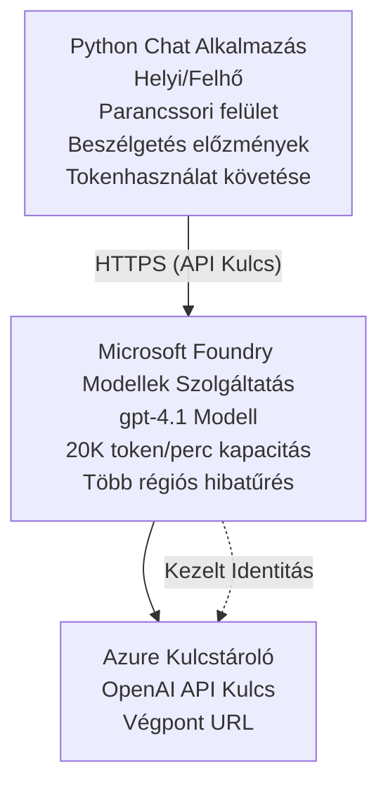

# Microsoft Foundry Models Chat alkalmazás

**Tanulási útvonal:** Középhaladó ⭐⭐ | **Időtartam:** 35-45 perc | **Költség:** 50-200 USD/hónap

Teljes Microsoft Foundry Models chat alkalmazás, amely az Azure Developer CLI-vel (azd) van telepítve. Ez a példa bemutatja a gpt-4.1 telepítését, a biztonságos API-hozzáférést és egy egyszerű chat felületet.

## 🎯 Amit megtanulsz

- Microsoft Foundry Models szolgáltatás telepítése gpt-4.1 modellel  
- OpenAI API kulcsok biztonságos tárolása Key Vault-tal  
- Egyszerű chat felület építése Pythonban  
- Token használat és költségek figyelése  
- Korlátozás és hibakezelés megvalósítása  

## 📦 Mi van benne

✅ **Microsoft Foundry Models Szolgáltatás** - gpt-4.1 modell telepítés  
✅ **Python Chat App** - Egyszerű parancssori chat felület  
✅ **Key Vault Integráció** - Biztonságos API kulcs tárolás  
✅ **ARM Sablonok** - Teljes infrastruktúra kódként  
✅ **Költségfigyelés** - Token használat nyomon követése  
✅ **Korlátozás** - Kvóta kimerülésének megelőzése  

## Architektúra



## Előfeltételek

### Szükséges

- **Azure Developer CLI (azd)** - [Telepítési útmutató](https://learn.microsoft.com/azure/developer/azure-developer-cli/install-azd)  
- **Azure előfizetés** OpenAI hozzáféréssel - [Kérelmezés](https://aka.ms/oai/access)  
- **Python 3.9+** - [Python telepítése](https://www.python.org/downloads/)  

### Előfeltételek ellenőrzése

```bash
# Azd verzió ellenőrzése (1.5.0 vagy újabb szükséges)
azd version

# Azure bejelentkezés ellenőrzése
azd auth login

# Python verzió ellenőrzése
python --version  # vagy python3 --version

# OpenAI hozzáférés ellenőrzése (ellenőrizze az Azure Portálon)
az cognitiveservices account list-skus \
  --kind OpenAI \
  --location eastus
```

> **⚠️ Fontos:** A Microsoft Foundry Models használatához alkalmazás jóváhagyás szükséges. Ha még nem igényelted, látogass el a [aka.ms/oai/access](https://aka.ms/oai/access) oldalra. A jóváhagyás általában 1-2 munkanapot vesz igénybe.

## ⏱️ Telepítési idővonal

| Fázis | Időtartam | Mi történik |
|-------|-----------|-------------|
| Előfeltételek ellenőrzése | 2-3 perc | OpenAI kvóta elérhetőségének ellenőrzése |
| Infrastruktúra telepítése | 8-12 perc | OpenAI, Key Vault, modell telepítés létrehozása |
| Alkalmazás konfigurálása | 2-3 perc | Környezet és függőségek beállítása |
| **Összesen** | **12-18 perc** | Kész a beszélgetés a gpt-4.1-el |

**Megjegyzés:** Első OpenAI telepítéskor a modell előkészítése hosszabb időt vehet igénybe.

## Gyors indulás

```bash
# Navigáljon az példához
cd examples/azure-openai-chat

# Inicializálja a környezetet
azd env new myopenai

# Telepítsen mindent (infrastruktúra + konfiguráció)
azd up
# A következőkre fogják kérni:
# 1. Válassza ki az Azure előfizetést
# 2. Válasszon helyet OpenAI elérhetőséggel (pl. eastus, eastus2, westus)
# 3. Várjon 12-18 percet a telepítésre

# Telepítse a Python függőségeket
pip install -r requirements.txt

# Kezdjen el csevegni!
python chat.py
```

**Várt kimenet:**  
```
🤖 Microsoft Foundry Models Chat Application
Connected to: gpt-4.1 (eastus)
Type your message (or 'quit' to exit)

You: Hello! Tell me about Microsoft Foundry Models.
Assistant: Microsoft Foundry Models Service provides REST API access to OpenAI's powerful language models including gpt-4.1, GPT-3.5-Turbo, and Embeddings...

[Tokens used: 145 | Estimated cost: $0.0044]
```

## ✅ Telepítés ellenőrzése

### 1. lépés: Azure erőforrások ellenőrzése

```bash
# Telepített erőforrások megtekintése
azd show

# A várt kimenet a következőket mutatja:
# - OpenAI Szolgáltatás: (erőforrás neve)
# - Kulcstár: (erőforrás neve)
# - Telepítés: gpt-4.1
# - Helyszín: eastus (vagy a kiválasztott régió)
```

### 2. lépés: OpenAI API tesztelése

```bash
# Szerezze be az OpenAI végpontot és kulcsot
OPENAI_ENDPOINT=$(azd env get-value AZURE_OPENAI_ENDPOINT)
OPENAI_KEY=$(azd env get-value AZURE_OPENAI_API_KEY)

# API hívás tesztelése
curl "$OPENAI_ENDPOINT/openai/deployments/gpt-4.1/chat/completions?api-version=2024-08-01-preview" \
  -H "Content-Type: application/json" \
  -H "api-key: $OPENAI_KEY" \
  -d '{
    "messages": [{"role": "user", "content": "Say hello!"}],
    "max_tokens": 50
  }'
```

**Várt válasz:**  
```json
{
  "choices": [
    {
      "message": {
        "role": "assistant",
        "content": "Hello! How can I assist you today?"
      }
    }
  ],
  "usage": {
    "prompt_tokens": 8,
    "completion_tokens": 9,
    "total_tokens": 17
  }
}
```

### 3. lépés: Key Vault hozzáférés ellenőrzése

```bash
# Titkok listázása a Key Vault-ban
KV_NAME=$(azd env get-value AZURE_KEY_VAULT_NAME)

az keyvault secret list \
  --vault-name $KV_NAME \
  --query "[].name" \
  --output table
```

**Várt titkok:**  
- `openai-api-key`  
- `openai-endpoint`  

**Siker kritériumok:**  
- ✅ OpenAI szolgáltatás telepítve gpt-4.1 modellel  
- ✅ API hívás érvényes választ ad  
- ✅ Titkok tárolva Key Vault-ban  
- ✅ Token használat követése működik  

## Projekt struktúrája

```
azure-openai-chat/
├── README.md                   ✅ This guide
├── azure.yaml                  ✅ AZD configuration
├── infra/                      ✅ Infrastructure as Code
│   ├── main.bicep             ✅ Main Bicep template
│   ├── main.parameters.json   ✅ Parameters
│   └── openai.bicep           ✅ OpenAI resource definition
├── src/                        ✅ Application code
│   ├── chat.py                ✅ Chat interface
│   ├── config.py              ✅ Configuration loader
│   └── requirements.txt       ✅ Python dependencies
└── .gitignore                  ✅ Git ignore rules
```

## Alkalmazás funkciók

### Chat felület (`chat.py`)

A chat alkalmazás tartalmazza:

- **Beszélgetési előzmények** - Üzenetek közti kontextus megtartása  
- **Token számolás** - Használat nyomon követése és költségbecslés  
- **Hibakezelés** - Korlátozások és API hibák kezelése  
- **Költségbecslés** - Üzenetenkénti valós idejű költségkalkuláció  
- **Streaming támogatás** - Opcionális folyamatos válaszadás  

### Parancsok

Beszélgetés közben használhatod:  
- `quit` vagy `exit` - Munkamenet lezárása  
- `clear` - Beszélgetési előzmények törlése  
- `tokens` - Teljes token használat megjelenítése  
- `cost` - Becslés az összkiadásra  

### Konfiguráció (`config.py`)

Környezet változókból tölti be a konfigurációt:  
```python
AZURE_OPENAI_ENDPOINT  # Kulcstárolóból
AZURE_OPENAI_API_KEY   # Kulcstárolóból
AZURE_OPENAI_MODEL     # Alapértelmezett: gpt-4.1
AZURE_OPENAI_MAX_TOKENS # Alapértelmezett: 800
```

## Használati példák

### Alap chat

```bash
python chat.py
```

### Chat egyedi modellel

```bash
export AZURE_OPENAI_MODEL=gpt-35-turbo
python chat.py
```

### Streaminggel chat

```bash
python chat.py --stream
```

### Példa beszélgetés

```
You: Explain Microsoft Foundry Models Service in 3 sentences.
Assistant: Microsoft Foundry Models Service is Microsoft Azure's cloud platform offering 
that provides access to OpenAI's powerful language models. It enables developers 
to integrate capabilities like gpt-4.1 into their applications with enterprise-grade 
security and compliance. The service includes features for content filtering, 
abuse monitoring, and responsible AI practices.

[Tokens used: 89 | Estimated cost: $0.0027]

You: What models are available?
Assistant: Microsoft Foundry Models Service offers several model families including gpt-4.1 
(most capable), GPT-3.5-Turbo (faster and cost-effective), and Embeddings models 
for vector search. Each model has different capabilities, pricing, and token limits.

[Tokens used: 67 | Estimated cost: $0.0020]

Total session: 156 tokens | $0.0047
```

## Költségkezelés

### Token árak (gpt-4.1)

| Modell | Bemenet (1000 tokenenként) | Kimenet (1000 tokenenként) |
|--------|----------------------------|----------------------------|
| gpt-4.1 | 0,03 USD | 0,06 USD |
| GPT-3.5-Turbo | 0,0015 USD | 0,002 USD |

### Becsült havi költségek

A használati szokások alapján:

| Használati szint | Üzenetek/nap | Tokenek/nap | Havi költség |
|------------------|--------------|-------------|--------------|
| **Könnyű** | 20 üzenet | 3 000 token | 3-5 USD |
| **Mérsékelt** | 100 üzenet | 15 000 token | 15-25 USD |
| **Nehéz** | 500 üzenet | 75 000 token | 75-125 USD |

**Alapinfrastruktúra költsége:** 1-2 USD/hónap (Key Vault + minimális számítás)

### Költségoptimalizálási tippek

```bash
# 1. Használd a GPT-3.5-Turbo-t egyszerűbb feladatokhoz (20-szor olcsóbb)
export AZURE_OPENAI_MODEL=gpt-35-turbo

# 2. Csökkentsd a maximális tokenek számát rövidebb válaszokért
export AZURE_OPENAI_MAX_TOKENS=400

# 3. Figyeld a tokenhasználatot
python chat.py --show-tokens

# 4. Állíts be költségvetési értesítéseket
az consumption budget create \
  --budget-name "openai-budget" \
  --amount 50 \
  --time-grain Monthly
```

## Monitorozás

### Token használat megtekintése

```bash
# Az Azure Portalon:
# OpenAI Erőforrás → Metrikák → Válassza a „Token Tranzakció” lehetőséget

# Vagy az Azure CLI segítségével:
az monitor metrics list \
  --resource $(azd env get-value AZURE_OPENAI_RESOURCE_ID) \
  --metric "TokenTransaction" \
  --start-time $(date -u -d '1 hour ago' '+%Y-%m-%dT%H:%M:%S') \
  --interval PT1M
```

### API naplók megtekintése

```bash
# Diagnosztikai naplók továbbítása
az monitor diagnostic-settings create \
  --resource $(azd env get-value AZURE_OPENAI_RESOURCE_ID) \
  --name openai-logs \
  --logs '[{"category": "Audit", "enabled": true}]' \
  --workspace $(azd env get-value LOG_ANALYTICS_WORKSPACE_ID)

# Lekérdezési naplók
az monitor log-analytics query \
  --workspace $(azd env get-value LOG_ANALYTICS_WORKSPACE_ID) \
  --analytics-query "AzureDiagnostics | where Category == 'Audit' | top 10 by TimeGenerated"
```

## Hibaelhárítás

### Probléma: "Hozzáférés megtagadva" hiba

**Tünetek:** 403 Forbidden az API hívásnál

**Megoldások:**  
```bash
# 1. Ellenőrizze, hogy az OpenAI hozzáférés engedélyezett-e
az cognitiveservices account show \
  --name $(azd env get-value AZURE_OPENAI_NAME) \
  --resource-group $(azd env get-value AZURE_RESOURCE_GROUP)

# 2. Ellenőrizze, hogy az API kulcs helyes-e
azd env get-value AZURE_OPENAI_API_KEY

# 3. Ellenőrizze a végpont URL formátumát
azd env get-value AZURE_OPENAI_ENDPOINT
# Ennek a következőnek kell lennie: https://[név].openai.azure.com/
```

### Probléma: "Korlát túllépve"

**Tünetek:** 429 Too Many Requests

**Megoldások:**  
```bash
# 1. Ellenőrizze a jelenlegi kvótát
az cognitiveservices account deployment show \
  --name $(azd env get-value AZURE_OPENAI_NAME) \
  --resource-group $(azd env get-value AZURE_RESOURCE_GROUP) \
  --deployment-name gpt-4.1

# 2. Kérjen kvótaemelést (ha szükséges)
# Menjen az Azure Portálra → OpenAI erőforrás → Kvóták → Kérés növelése

# 3. Valósítsa meg az újrapróbálkozási logikát (már a chat.py-ben van)
# Az alkalmazás automatikusan újrapróbálkozik exponenciális visszaeséssel
```

### Probléma: "Modell nem található"

**Tünetek:** 404 hiba a telepítésnél

**Megoldások:**  
```bash
# 1. Listázza a rendelkezésre álló telepítéseket
az cognitiveservices account deployment list \
  --name $(azd env get-value AZURE_OPENAI_NAME) \
  --resource-group $(azd env get-value AZURE_RESOURCE_GROUP)

# 2. Ellenőrizze a modell nevét a környezetben
echo $AZURE_OPENAI_MODEL

# 3. Frissítse a helyes telepítési névre
export AZURE_OPENAI_MODEL=gpt-4.1  # vagy gpt-35-turbó
```

### Probléma: Nagy késleltetés

**Tünetek:** Lassú válaszidő (>5 másodperc)

**Megoldások:**  
```bash
# 1. Ellenőrizze a regionális késleltetést
# Telepítés a felhasználókhoz legközelebbi régióba

# 2. Csökkentse a max_tokens értéket a gyorsabb válaszokért
export AZURE_OPENAI_MAX_TOKENS=400

# 3. Streaming használata jobb felhasználói élményért
python chat.py --stream
```

## Biztonsági legjobb gyakorlatok

### 1. API kulcsok védelme

```bash
# Soha ne commitolj kulcsokat a forráskezelőbe
# Használj Key Vault-ot (már be van állítva)

# Rendszeresen cseréld a kulcsokat
az cognitiveservices account keys regenerate \
  --name $(azd env get-value AZURE_OPENAI_NAME) \
  --resource-group $(azd env get-value AZURE_RESOURCE_GROUP) \
  --key-name key1
```

### 2. Tartalomszűrés alkalmazása

```python
# A Microsoft Foundry Modellek beépített tartalomszűrést tartalmaznak
# Beállítás az Azure Portálon:
# OpenAI-erőforrás → Tartalomszűrők → Egyéni szűrő létrehozása

# Kategóriák: Gyűlölet, Szexuális, Erőszak, Önkárosítás
# Szintek: Alacsony, Közepes, Magas szűrés
```

### 3. Kezelt identitás használata (éles környezet)

```bash
# Éles telepítésekhez használd a kezelt identitást
# API kulcsok helyett (az alkalmazás Azure-on történő hosztolását igényli)

# Frissítsd az infra/openai.bicep fájlt az alábbiakkal:
# identity: { type: 'SystemAssigned' }
```

## Fejlesztés

### Helyi futtatás

```bash
# Függőségek telepítése
pip install -r src/requirements.txt

# Környezeti változók beállítása
export AZURE_OPENAI_ENDPOINT="https://[name].openai.azure.com/"
export AZURE_OPENAI_API_KEY="your-api-key"
export AZURE_OPENAI_MODEL="gpt-4.1"

# Alkalmazás futtatása
python src/chat.py
```

### Tesztek futtatása

```bash
# Telepítse a teszt függőségeket
pip install pytest pytest-cov

# Futtassa a teszteket
pytest tests/ -v

# Fedettséggel
pytest tests/ --cov=src --cov-report=html
```

### Modell telepítés frissítése

```bash
# Különböző modellverziók telepítése
az cognitiveservices account deployment create \
  --name $(azd env get-value AZURE_OPENAI_NAME) \
  --resource-group $(azd env get-value AZURE_RESOURCE_GROUP) \
  --deployment-name gpt-35-turbo \
  --model-name gpt-35-turbo \
  --model-version "0613" \
  --model-format OpenAI \
  --sku-capacity 20 \
  --sku-name "Standard"
```

## Takarítás

```bash
# Minden Azure-erőforrás törlése
azd down --force --purge

# Ez eltávolítja:
# - OpenAI szolgáltatás
# - Key Vault (90 napos lágy törléssel)
# - Erőforráscsoport
# - Minden telepítést és konfigurációt
```

## Következő lépések

### Példa bővítése

1. **Webes felület hozzáadása** - React/Vue frontend fejlesztése  
   ```bash
   # Frontend szolgáltatás hozzáadása az azure.yaml fájlhoz
   # Telepítés Azure Static Web Apps szolgáltatásba
   ```

2. **RAG megvalósítása** - Dokumentumkeresés Azure AI Search-szal  
   ```python
   # Azure AI Search integrálása
   # Dokumentumok feltöltése és vektor index létrehozása
   ```

3. **Funkcióhívás hozzáadása** - Eszköz használat engedélyezése  
   ```python
   # Függvények definiálása a chat.py fájlban
   # Engedélyezze, hogy a gpt-4.1 külső API-kat hívjon meg
   ```

4. **Többmodell támogatás** - Több modell telepítése  
   ```bash
   # Adja hozzá a gpt-35-turbo, beágyazási modelleket
   # Valósítsa meg a modell útválasztási logikáját
   ```

### Kapcsolódó példák

- **[Retail Multi-Agent](../retail-scenario.md)** - Fejlett multi-agent architektúra  
- **[Adatbázis alkalmazás](../../../../examples/database-app)** - Állandó tárolás hozzáadása  
- **[Konténer alkalmazások](../../../../examples/container-app)** - Konténerizált szolgáltatás telepítése  

### Tanulási források

- 📚 [AZD Kezdőknek tanfolyam](../../README.md) - Fő tanfolyam otthon  
- 📚 [Microsoft Foundry Models dokumentáció](https://learn.microsoft.com/azure/ai-services/openai/) - Hivatalos dokumentáció  
- 📚 [OpenAI API referencia](https://platform.openai.com/docs/api-reference) - API részletek  
- 📚 [Felelős MI](https://www.microsoft.com/ai/responsible-ai) - Legjobb gyakorlatok  

## További források

### Dokumentáció  
- **[Microsoft Foundry Models Szolgáltatás](https://learn.microsoft.com/azure/ai-services/openai/)** - Teljes útmutató  
- **[gpt-4.1 modellek](https://learn.microsoft.com/azure/ai-services/openai/concepts/models)** - Modell képességek  
- **[Tartalomszűrés](https://learn.microsoft.com/azure/ai-services/openai/concepts/content-filter)** - Biztonsági funkciók  
- **[Azure Developer CLI](https://learn.microsoft.com/azure/developer/azure-developer-cli/)** - azd referencia  

### Oktatóanyagok  
- **[OpenAI Gyorsindítás](https://learn.microsoft.com/azure/ai-services/openai/quickstart)** - Első telepítés  
- **[Chat kiegészítések](https://learn.microsoft.com/azure/ai-services/openai/how-to/chatgpt)** - Chat alkalmazások építése  
- **[Funkcióhívás](https://learn.microsoft.com/azure/ai-services/openai/how-to/function-calling)** - Haladó funkciók  

### Eszközök  
- **[Microsoft Foundry Models Studio](https://oai.azure.com/)** - Webes játszótér  
- **[Prompt Engineering Guide](https://platform.openai.com/docs/guides/prompt-engineering)** - Jobb promptok írása  
- **[Token kalkulátor](https://platform.openai.com/tokenizer)** - Token használat becslése  

### Közösség  
- **[Azure AI Discord](https://discord.gg/azure)** - Közösségi segítség  
- **[GitHub Discussions](https://github.com/Azure-Samples/openai/discussions)** - Kérdések és válaszok fórum  
- **[Azure Blog](https://azure.microsoft.com/blog/tag/azure-openai-service/)** - Legfrissebb hírek  

---

**🎉 Siker!** Telepítetted a Microsoft Foundry Modelst és elkészítetted a működő chat alkalmazást. Kezdd el felfedezni a gpt-4.1 képességeit, és kísérletezz különböző promptokkal és felhasználási esetekkel.

**Kérdésed van?** [Nyiss egy issue-t](https://github.com/microsoft/AZD-for-beginners/issues) vagy nézd meg a [GYIK-et](../../resources/faq.md)

**Költségfigyelmeztetés:** Ne felejtsd el a tesztelés után futtatni az `azd down` parancsot, hogy elkerüld a folyamatos díjakat (~50-100 USD/hónap aktív használat esetén).

---

<!-- CO-OP TRANSLATOR DISCLAIMER START -->
**Jogi nyilatkozat**:
Ez a dokumentum az AI fordítási szolgáltatás, a [Co-op Translator](https://github.com/Azure/co-op-translator) segítségével készült. Bár az pontosságra törekszünk, kérjük, vegye figyelembe, hogy az automatikus fordítások hibákat vagy pontatlanságokat tartalmazhatnak. Az eredeti dokumentum az anyanyelvén tekintendő hiteles forrásnak. Fontos információk esetén professzionális emberi fordítást javasolunk. Nem vállalunk felelősséget semmilyen félreértésért vagy téves értelmezésért, amely ebből a fordításból ered.
<!-- CO-OP TRANSLATOR DISCLAIMER END -->