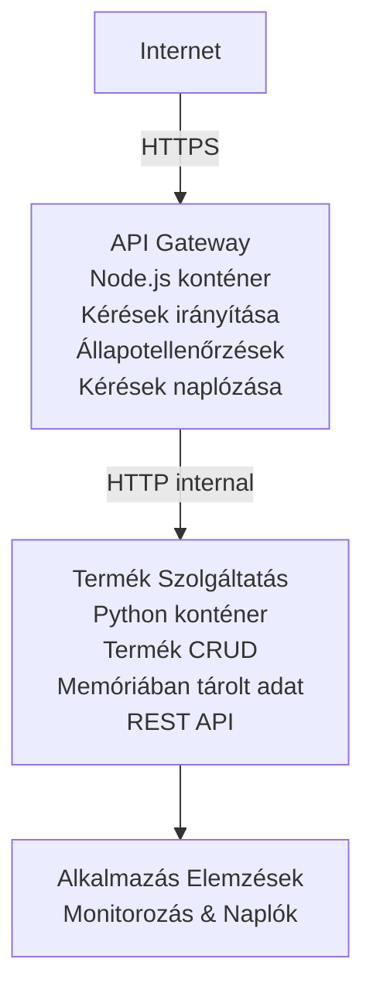

# Microservices architektúra - Container App példa

⏱️ **Becsült idő**: 25-35 perc | 💰 **Becsült költség**: kb. 50-100 USD/hó | ⭐ **Bonyolultság**: Haladó

Egy **egyszerűsített, de működőképes** microservices architektúra, amelyet AZD CLI segítségével telepítünk Azure Container Apps-re. Ez a példa szolgálat-szolgálat kommunikációt, konténer-orchestrationt és monitorozást mutat be egy gyakorlati 2-szolgáltatásos felállással.

> **📚 Tanulási megközelítés**: Ez a példa egy minimális 2-szolgáltatásos architektúrával (API Gateway + Backend Service) kezdődik, amit ténylegesen telepíthetsz és tanulhatsz belőle. Miután elsajátítottad ezt az alapot, útmutatást kapsz a teljes microservices ökoszisztéma bővítéséhez.

## Amit tanulni fogsz

A példa végrehajtásával:
- Több konténert telepítesz Azure Container Apps-re
- Belso hálózaton alapulo szolgáltatás-szolgáltatás kommunikációt valósítasz meg
- Környezeti alapú skálázást és egészségügyi ellenőrzéseket konfigurálsz
- Elosztott alkalmazásokat monitorozol Application Insights-szal
- Megérted a microservices telepítési mintákat és legjobb gyakorlatokat
- Megtanulod az egyszerű architektúráktól a bonyolultabbakig való folyamatos bővítést

## Architektúra

### 1. fázis: Amit építünk (Ez a példa tartalmazza)


**Miért kezdünk egyszerűvel?**
- ✅ Gyors telepítés és megértés (25-35 perc)
- ✅ Alap microservices minták tanulása bonyolultság nélkül
- ✅ Működő kód, amit módosíthatsz és kísérletezhetsz vele
- ✅ Alacsonyabb tanulási költség (~50-100 USD/hó vs 300-1400 USD/hó)
- ✅ Magabiztosság építése adatbázis és üzenetsor hozzáadása előtt

**Hasonlat**: Olyan, mintha vezetést tanulnál. Üres parkolóval (2 szolgáltatás) kezded, elsajátítod az alapokat, majd továbblépsz a városi forgalomba (5+ szolgáltatás adatbázisokkal).

### 2. fázis: Jövőbeli bővítés (Referenciális architektúra)

Amint elsajátítod a 2-szolgáltatásos architektúrát, bővítheted:

```
Full Architecture (Not Included - For Reference)
├── API Gateway (✅ Included)
├── Product Service (✅ Included)
├── Order Service (🔜 Add next)
├── User Service (🔜 Add next)
├── Notification Service (🔜 Add last)
├── Azure Service Bus (🔜 For async communication)
├── Cosmos DB (🔜 For product persistence)
├── Azure SQL (🔜 For order management)
└── Azure Storage (🔜 For file storage)
```

Lépésről lépésre útmutatóért lásd a "Bővítési útmutató" szakaszt a végén.

## Tartalmazott funkciók

✅ **Szolgáltatás-felfedezés**: Konténerek közötti automatikus DNS-alapú felfedezés  
✅ **Terheléselosztás**: Beépített terheléselosztás a replikák között  
✅ **Auto-skalázás**: Szolgáltatásonként független skálázás HTTP-kérések alapján  
✅ **Egészségügyi monitorozás**: Liveness és readiness probe-ok mindkét szolgáltatásra  
✅ **Elosztott naplózás**: Centralizált naplózás Application Insights segítségével  
✅ **Belső hálózat**: Biztonságos szolgáltatás-szolgáltatás kommunikáció  
✅ **Konténer orchestration**: Automatikus telepítés és skálázás  
✅ **Zéró leállásos frissítés**: Rolling update revíziókezeléssel  

## Előfeltételek

### Szükséges eszközök

Kezdés előtt ellenőrizd, hogy telepítve vannak ezek az eszközök:

1. **[Azure Developer CLI (azd)](https://learn.microsoft.com/azure/developer/azure-developer-cli/install-azd)** (1.0.0 vagy újabb verzió)
   ```bash
   azd version
   # Várt kimenet: azd verzió 1.0.0 vagy újabb
   ```

2. **[Azure CLI](https://learn.microsoft.com/cli/azure/install-azure-cli)** (2.50.0 vagy újabb verzió)
   ```bash
   az --version
   # Várt kimenet: azure-cli 2.50.0 vagy újabb
   ```

3. **[Docker](https://www.docker.com/get-started)** (helyi fejlesztéshez/teszteléshez - opcionális)
   ```bash
   docker --version
   # Várt kimenet: Docker verzió 20.10 vagy újabb
   ```

### Azure követelmények

- Aktív **Azure előfizetés** ([ingyenes fiók létrehozása](https://azure.microsoft.com/free/))
- Jogosultság az erőforrások létrehozására előfizetésedben
- **Contributor** szerepkör az előfizetés vagy erőforráscsoport szintjén

### Tudás-előfeltételek

Ez egy **haladó szintű** példa. Ajánlott, hogy:
- Elvégezted a [Simple Flask API példát](../../../../../examples/container-app/simple-flask-api)  
- Alapvető ismereteid legyenek microservices architektúráról
- Ismerd a REST API-kat és HTTP-t
- Értsd a konténer fogalmakat

**Új vagy a Container Apps-ben?** Először a [Simple Flask API példával](../../../../../examples/container-app/simple-flask-api) érdemes kezdeni az alapok megtanulásához.

## Gyors kezdés (lépésről lépésre)

### 1. lépés: Klónozás és navigálás

```bash
git clone https://github.com/microsoft/AZD-for-beginners.git
cd AZD-for-beginners/examples/container-app/microservices
```

**✓ Siker ellenőrzés**: Győződj meg róla, hogy látod az `azure.yaml` fájlt:
```bash
ls
# Várt: README.md, azure.yaml, infra/, src/
```

### 2. lépés: Azure-ba való hitelesítés

```bash
azd auth login
```

Ez megnyitja a böngésződ az Azure hitelesítéshez. Jelentkezz be Azure azonosítóddal.

**✓ Siker ellenőrzés**: Ezt kell látnod:
```
Logged in to Azure.
```

### 3. lépés: Környezet inicializálása

```bash
azd init
```

**Megjelenő kérdések**:
- **Környezet neve**: Adj meg egy rövid nevet (pl. `microservices-dev`)
- **Azure előfizetés**: Válaszd ki az előfizetésed
- **Azure helyszín**: Válassz régiót (pl. `eastus`, `westeurope`)

**✓ Siker ellenőrzés**: Ezt kell látnod:
```
SUCCESS: New project initialized!
```

### 4. lépés: Infrastruktúra és szolgáltatások telepítése

```bash
azd up
```

**Mi történik** (8-12 percet vesz igénybe):
1. Létrehozza a Container Apps környezetet
2. Létrehozza az Application Insights-ot a monitorozáshoz
3. Felépíti az API Gateway konténert (Node.js)
4. Felépíti a Product Service konténert (Python)
5. Telepíti mindkét konténert Azure-be
6. Konfigurálja a hálózatot és egészségügyi ellenőrzéseket
7. Beállítja a monitorozást és naplózást

**✓ Siker ellenőrzés**: Ezt kell látnod:
```
SUCCESS: Your application was deployed to Azure in X minutes Y seconds.
Endpoint: https://api-gateway-<unique-id>.azurecontainerapps.io
```

**⏱️ Idő**: 8-12 perc

### 5. lépés: Teszteld a telepítést

```bash
# Szerezze be a gateway végpontját
GATEWAY_URL=$(azd env get-values | grep API_GATEWAY_URL | cut -d '=' -f2 | tr -d '"')

# Tesztelje az API Gateway állapotát
curl $GATEWAY_URL/health

# Várt kimenet:
# {"status":"healthy","service":"api-gateway","timestamp":"2025-11-19T10:30:00Z"}
```

**Teszteld a termék szolgáltatást a gateway-en keresztül**:
```bash
# Termékek listázása
curl $GATEWAY_URL/api/products

# Várt kimenet:
# [
#   {"id":1,"name":"Laptop","price":999.99,"stock":50},
#   {"id":2,"name":"Mouse","price":29.99,"stock":200},
#   {"id":3,"name":"Keyboard","price":79.99,"stock":150}
# ]
```

**✓ Siker ellenőrzés**: Mindkét végpont JSON adatot ad hibák nélkül vissza.

---

**🎉 Gratulálunk!** Sikeresen telepítettél egy microservices architektúrát Azure-re!

## Projekt struktúra

A teljes implementációs fájlok benne vannak — ez egy teljes, működő példa:

```
microservices/
│
├── README.md                         # This file
├── azure.yaml                        # AZD configuration
├── .gitignore                        # Git ignore patterns
│
├── infra/                           # Infrastructure as Code (Bicep)
│   ├── main.bicep                   # Main orchestration
│   ├── abbreviations.json           # Naming conventions
│   ├── core/                        # Shared infrastructure
│   │   ├── container-apps-environment.bicep  # Container environment + registry
│   │   └── monitor.bicep            # Application Insights + Log Analytics
│   └── app/                         # Service definitions
│       ├── api-gateway.bicep        # API Gateway container app
│       └── product-service.bicep    # Product Service container app
│
└── src/                             # Application source code
    ├── api-gateway/                 # Node.js API Gateway
    │   ├── app.js                   # Express server with routing
    │   ├── package.json             # Node dependencies
    │   └── Dockerfile               # Container definition
    └── product-service/             # Python Product Service
        ├── main.py                  # Flask API with product data
        ├── requirements.txt         # Python dependencies
        └── Dockerfile               # Container definition
```

**Mit csinál az egyes komponens?**

**Infrastruktúra (infra/)**:
- `main.bicep`: Minden Azure erőforrást és függőségeiket összehangolja
- `core/container-apps-environment.bicep`: Létrehozza a Container Apps környezetet és az Azure Container Registry-t
- `core/monitor.bicep`: Beállítja az Application Insights-ot az elosztott naplózáshoz
- `app/*.bicep`: Egyedi konténer app definíciók skálázással és egészségügyi ellenőrzésekkel

**API Gateway (src/api-gateway/)**:
- Közvetlenül elérhető szolgáltatás, ami a backend szolgáltatásokhoz irányít
- Naplózást, hiba kezelést és kérés továbbítást valósít meg
- Mutatja a szolgáltatás-szolgáltatás HTTP kommunikációt

**Product Service (src/product-service/)**:
- Belső szolgáltatás termékkatalógussal (memóriában egyszerűség miatt)
- REST API egészségügyi ellenőrzéssel
- Backend microservice minta példája

## Szolgáltatások áttekintése

### API Gateway (Node.js/Express)

**Port**: 8080  
**Hozzáférés**: Nyilvános (külső bejárat)  
**Cél**: Bejövő kérések továbbítása a megfelelő backend szolgáltatásokhoz  

**Végpontok**:
- `GET /` - Szolgáltatás információ
- `GET /health` - Egészségügyi ellenőrző végpont
- `GET /api/products` - Továbbítja a termék szolgáltatásnak (összes lista)
- `GET /api/products/:id` - Továbbítja a termék szolgáltatásnak (ID alapján lekérés)

**Főbb funkciók**:
- Kérés irányítás axios-szal
- Centralizált naplózás
- Hibakezelés és időkorlát kezelése
- Szolgáltatás felfedezés környezeti változók alapján
- Application Insights integráció

**Kódkiemelés** (`src/api-gateway/app.js`):
```javascript
// Belső szolgáltatás kommunikáció
app.get('/api/products', async (req, res) => {
  const response = await axios.get(`${PRODUCT_SERVICE_URL}/products`);
  res.json(response.data);
});
```

### Product Service (Python/Flask)

**Port**: 8000  
**Hozzáférés**: Csak belső (nincs külső bejárat)  
**Cél**: Termékkatalógus kezelése memóriában  

**Végpontok**:
- `GET /` - Szolgáltatás információ
- `GET /health` - Egészségügyi ellenőrző végpont
- `GET /products` - Összes termék listázása
- `GET /products/<id>` - Termék lekérése ID alapján

**Főbb funkciók**:
- RESTful API Flask-kel
- Memóriában tárolt termékek (egyszerű, adatbázis nem szükséges)
- Egészségügyi ellenőrzés probe-okkal
- Strukturált naplózás
- Application Insights integráció

**Adatmodell**:
```python
{
  "id": 1,
  "name": "Laptop",
  "description": "High-performance laptop",
  "price": 999.99,
  "stock": 50
}
```

**Miért csak belső?**
A termék szolgáltatás nincs kitéve nyilvánosan. Minden kérés az API Gateway-en keresztül megy, ami biztosítja:
- Biztonság: Szabályozott elérési pont
- Rugalmasság: Backend módosítható a kliensek befolyásolása nélkül
- Monitorozás: Centralizált kérés naplózás

## Szolgáltatás kommunikáció megértése

### Hogyan kommunikálnak a szolgáltatások egymással?

Ebben a példában az API Gateway **belső HTTP hívással** kommunikál a Product Service-szel:

```javascript
// API átjáró (src/api-gateway/app.js)
const PRODUCT_SERVICE_URL = process.env.PRODUCT_SERVICE_URL;

// Belső HTTP kérés küldése
const response = await axios.get(`${PRODUCT_SERVICE_URL}/products`);
```

**Főbb pontok**:

1. **DNS alapú felfedezés**: A Container Apps automatikusan biztosít DNS-t a belső szolgáltatásokhoz
   - Termék szolgáltatás FQDN: `product-service.internal.<environment>.azurecontainerapps.io`
   - Egyszerűsítve: `http://product-service` (a Container Apps ezt feloldja)

2. **Nincs nyilvános elérés**: A product service-nek a Bicep-ben `external: false` van
   - Csak a Container Apps környezetében elérhető
   - Internet felől nem érhető el

3. **Környezeti változók**: A szolgáltatások URL-jei telepítéskor injektálódnak
   - A Bicep átadja a belső FQDN-t a gateway-nek
   - Nincs keménykódolt URL a kódban

**Hasonlat**: Olyan, mintha irodai helyiségek lennének. Az API Gateway a recepció (nyilvános), a Product Service egy iroda (csak belső). A látogatóknak át kell menniük a recepción bármelyik irodába való eljutáshoz.

## Telepítési opciók

### Teljes telepítés (ajánlott)

```bash
# Telepítse az infrastruktúrát és mindkét szolgáltatást
azd up
```

Ez telepíti:
1. Container Apps környezet
2. Application Insights
3. Conténer-regisztráció
4. API Gateway konténer
5. Product Service konténer

**Idő**: 8-12 perc

### Egyedi szolgáltatás telepítése

```bash
# Csak egy szolgáltatás telepítése (az első azd up után)
azd deploy api-gateway

# Vagy a termékszolgáltatás telepítése
azd deploy product-service
```

**Használat**: Ha egy szolgáltatás kódját frissítetted, és csak azt akarod újratelepíteni.

### Konfiguráció frissítése

```bash
# Méretezési paraméterek módosítása
azd env set GATEWAY_MAX_REPLICAS 30

# Új konfigurációval történő újratelepítés
azd up
```

## Konfiguráció

### Skálázási konfiguráció

Mindkét szolgáltatáshoz HTTP-alapú automatikus skálázás van beállítva a Bicep fájlokban:

**API Gateway**:
- Min replikák: 2 (mindig legalább kettő az elérhetőségért)
- Max replikák: 20
- Skálázási trigger: 50 párhuzamos kérés replikánként

**Product Service**:
- Min replikák: 1 (szükség esetén leállítható nullára)
- Max replikák: 10
- Skálázási trigger: 100 párhuzamos kérés replikánként

**Skálázás testreszabása** (`infra/app/*.bicep`):
```bicep
scale: {
  minReplicas: 1
  maxReplicas: 10
  rules: [
    {
      name: 'http-scale-rule'
      http: {
        metadata: {
          concurrentRequests: '100'  // Adjust this
        }
      }
    }
  ]
}
```

### Erőforrás allokáció

**API Gateway**:
- CPU: 1.0 vCPU
- Memória: 2 GiB
- Indok: Minden külső forgalmat kezeli

**Product Service**:
- CPU: 0.5 vCPU
- Memória: 1 GiB
- Indok: Könnyű, memórián belüli műveletek

### Egészségügyi ellenőrzések

Mindkét szolgáltatás tartalmaz liveness és readiness probe-okat:

```bicep
probes: [
  {
    type: 'Liveness'
    httpGet: {
      path: '/health'
      port: 8080
    }
    initialDelaySeconds: 10
    periodSeconds: 30
  }
  {
    type: 'Readiness'
    httpGet: {
      path: '/health'
      port: 8080
    }
    initialDelaySeconds: 5
    periodSeconds: 10
  }
]
```

**Mit jelent ez**:
- **Liveness**: Ha az egészségügyi ellenőrzés megbukik, a Container Apps újraindítja a konténert
- **Readiness**: Ha nincs készen, a Container Apps nem irányít forgalmat az adott replikára


## Monitorozás és megfigyelhetőség

### Szolgáltatás naplók megtekintése

```bash
# Naplók megtekintése az azd monitor segítségével
azd monitor --logs

# Vagy használd az Azure CLI-t specifikus Container Apps-hez:
# Naplók folyamatos közvetítése az API Gateway-ről
az containerapp logs show --name api-gateway --resource-group $RG_NAME --follow

# A termék szolgáltatás legutóbbi naplóinak megtekintése
az containerapp logs show --name product-service --resource-group $RG_NAME --tail 100
```

**Várt kimenet**:
```
[api-gateway] API Gateway listening on port 8080
[api-gateway] Product Service URL: http://product-service
[api-gateway] GET /api/products 200 - 45ms
[product-service] Retrieved 5 products
```

### Application Insights lekérdezések

Az Azure Portalban lépj be az Application Insights-ba, majd futtasd ezeket a lekérdezéseket:

**Lassú kérések keresése**:
```kusto
requests
| where timestamp > ago(1h)
| where duration > 1000  // Requests taking >1 second
| summarize count() by name, cloud_RoleName
| order by count_ desc
```

**Szolgáltatás-szolgáltatás hívások követése**:
```kusto
dependencies
| where timestamp > ago(1h)
| where type == "Http"
| project timestamp, name, target, duration, success
| order by timestamp desc
```

**Szolgáltatásonkénti hibaarány**:
```kusto
exceptions
| where timestamp > ago(24h)
| summarize errorCount = count() by cloud_RoleName, type
| order by errorCount desc
```

**Kérések volumen időben**:
```kusto
requests
| where timestamp > ago(1h)
| summarize requestCount = count() by bin(timestamp, 5m), cloud_RoleName
| render timechart
```

### Monitorozó műszerfal elérése

```bash
# Alkalmazásfigyelés részleteinek lekérése
azd env get-values | grep APPLICATIONINSIGHTS

# Azure Portal megnyitása a megfigyeléshez
az monitor app-insights component show \
  --app $(azd env get-values | grep APPLICATIONINSIGHTS_CONNECTION_STRING | cut -d '=' -f2) \
  --resource-group $(azd env get-values | grep AZURE_RESOURCE_GROUP | cut -d '=' -f2) \
  --query "appId" -o tsv
```

### Élő metrikák

1. Lépj az Application Insights-ra az Azure Portalban
2. Kattints az "Élő metrikák" lehetőségre
3. Nézd valós időben a kéréseket, hibákat és teljesítményt
4. Teszteld: `curl $(azd env get-values | grep API_GATEWAY_URL | cut -d '=' -f2 | tr -d '"')/api/products`

## Gyakorlati feladatok

[Figyelem: A teljes gyakorlatokat lásd fent a "Practical Exercises" szakaszban részletes lépésenkénti munkafolyamatokkal a telepítés ellenőrzésére, adatmanipulációra, automatikus skálázás tesztre, hibakezelésre és harmadik szolgáltatás hozzáadására.]

## Költségelemzés

### Becsült havi költségek (ehhez a 2-szolgáltatásos példához)

| Erőforrás | Konfiguráció | Becsült költség |
|----------|--------------|----------------|
| API Gateway | 2-20 replika, 1 vCPU, 2GB RAM | 30-150 USD |
| Product Service | 1-10 replika, 0.5 vCPU, 1GB RAM | 15-75 USD |
| Container Registry | Alap szint | 5 USD |
| Application Insights | 1-2 GB/hó | 5-10 USD |
| Log Analytics | 1 GB/hó | 3 USD |
| **Összesen** | | **58-243 USD/hó** |

**Használat szerinti költségek**:
- **Könnyű forgalom** (tesztelés/tanulás): kb. 60 USD/hó
- **Mérsékelt forgalom** (kis éles környezet): kb. 120 USD/hó
- **Magas forgalom** (forgalmas időszakok): kb. 240 USD/hó

### Költségoptimalizálási tippek

1. **Skálázás nullára fejlesztési környezethez**:
   ```bicep
   scale: {
     minReplicas: 0  // Save $30-40/month when not in use
     maxReplicas: 10
   }
   ```

2. **Cosmos DB esetén fogyasztás alapú terv használata** (ha hozzáadod):
   - Csak a tényleges használat után fizetsz
   - Nincs minimális díj

3. **Állíts be Application Insights mintavételezést**:
   ```javascript
   appInsights.defaultClient.config.samplingPercentage = 50; // A kérések 50%-ának mintavétele
   ```

4. **Takarítsd ki, ha nincs rá szükség**:
   ```bash
   azd down
   ```

### Ingyenes szint lehetőségek

Tanuláshoz/teszteléshez fontold meg:
- Használja az Azure ingyenes jóváírásait (az első 30 napban)
- Tartsa minimálisra a replikákat
- Törölje a tesztelés után (nincs folyamatos díj)

---

## Takarítás

A folyamatos díjak elkerülése érdekében töröljön minden erőforrást:

```bash
azd down --force --purge
```

**Megerősítés felkérés**:
```
? Total resources to delete: 6, are you sure you want to continue? (y/N)
```

Írja be, hogy `y` a megerősítéshez.

**Mi törlődik**:
- Container Apps környezet
- Mindkét Container App (gateway & termék szolgáltatás)
- Container Registry
- Application Insights
- Log Analytics Workspace
- Erőforráscsoport

**✓ Takarítás ellenőrzése**:
```bash
az group list --query "[?starts_with(name,'rg-microservices')]" --output table
```

Üres visszatérítést kell adnia.

---

## Bővítési útmutató: 2 szolgáltatástól 5+ szolgáltatásig

Miután elsajátította ezt a 2-szolgáltatásos architektúrát, így bővíthet:

### 1. fázis: Adatbázis-perzisztencia hozzáadása (Következő lépés)

**Cosmos DB hozzáadása a termék szolgáltatáshoz**:

1. Hozza létre az `infra/core/cosmos.bicep` fájlt:
   ```bicep
   resource cosmosAccount 'Microsoft.DocumentDB/databaseAccounts@2023-04-15' = {
     name: name
     location: location
     kind: 'GlobalDocumentDB'
     properties: {
       databaseAccountOfferType: 'Standard'
       locations: [{ locationName: location, failoverPriority: 0 }]
     }
   }
   ```

2. Frissítse a termék szolgáltatást, hogy a memóriában lévő adatok helyett a Cosmos DB-t használja

3. Becslés szerint további költség: kb. 25 USD/hó (serverless)

### 2. fázis: Harmadik szolgáltatás hozzáadása (Rendeléskezelés)

**Rendelés szolgáltatás létrehozása**:

1. Új mappa: `src/order-service/` (Python/Node.js/C#)
2. Új Bicep: `infra/app/order-service.bicep`
3. Frissítse az API Gateway-t, hogy irányítsa a `/api/orders` útvonalat
4. Adjon hozzá Azure SQL adatbázist a rendelés perzisztenciához

**Az architektúra így alakul**:
```
API Gateway → Product Service (Cosmos DB)
           → Order Service (Azure SQL)
```

### 3. fázis: Aszinkron kommunikáció hozzáadása (Service Bus)

**Eseményvezérelt architektúra megvalósítása**:

1. Adjon hozzá Azure Service Bus-t: `infra/core/servicebus.bicep`
2. A termék szolgáltatás közzéteszi a "ProductCreated" eseményeket
3. A rendelés szolgáltatás feliratkozik a termékeseményekre
4. Adjon hozzá Értesítési szolgáltatást az események feldolgozásához

**Minta**: Kérés/Válasz (HTTP) + eseményvezérelt (Service Bus)

### 4. fázis: Felhasználói hitelesítés hozzáadása

**Felhasználói szolgáltatás megvalósítása**:

1. Hozza létre a `src/user-service/` mappát (Go/Node.js)
2. Adjon hozzá Azure AD B2C-t vagy egyéni JWT hitelesítést
3. Az API Gateway érvényesíti a tokeneket
4. A szolgáltatások ellenőrzik a felhasználói jogosultságokat

### 5. fázis: Termelési kész állapot

**Ezeknek a komponenseknek az hozzáadása**:
- Azure Front Door (globális terheléselosztás)
- Azure Key Vault (titkok kezelése)
- Azure Monitor Workbooks (egyedi műszerfalak)
- CI/CD pipeline (GitHub Actions)
- Blue-Green telepítések
- Kezelt identitás minden szolgáltatásnak

**Teljes termelési architektúra költsége**: kb. 300-1400 USD/hó

---

## További információk

### Kapcsolódó dokumentáció
- [Azure Container Apps dokumentáció](https://learn.microsoft.com/azure/container-apps/)
- [Mikroszolgáltatás-architektúra útmutató](https://learn.microsoft.com/azure/architecture/guide/architecture-styles/microservices)
- [Application Insights elosztott követéshez](https://learn.microsoft.com/azure/azure-monitor/app/distributed-tracing)
- [Azure Developer CLI dokumentáció](https://learn.microsoft.com/azure/developer/azure-developer-cli/)

### Következő lépések a tanfolyamban
- ← Előző: [Egyszerű Flask API](../../../../../examples/container-app/simple-flask-api) – Kezdő egydobozos példa
- → Következő: [AI integrációs útmutató](../../../../../examples/docs/ai-foundry) – AI képességek hozzáadása
- 🏠 [Tanfolyam kezdőlap](../../README.md)

### Összehasonlítás: Mikor mit használjunk

**Egydobozos alkalmazás** (Egyszerű Flask API példa):
- ✅ Egyszerű alkalmazások
- ✅ Monolitikus architektúra
- ✅ Gyors telepítés
- ❌ Korlátozott skálázhatóság
- **Költség**: kb. 15-50 USD/hó

**Mikroszolgáltatások** (Ez a példa):
- ✅ Összetett alkalmazások
- ✅ Szolgáltatásonként független skálázás
- ✅ Csapat autonómia (különböző szolgáltatások, különböző csapatok)
- ❌ Nehezebb menedzselni
- **Költség**: kb. 60-250 USD/hó

**Kubernetes (AKS)**:
- ✅ Maximális irányítás és rugalmasság
- ✅ Többfelhős hordozhatóság
- ✅ Fejlett hálózatkezelés
- ❌ Kubernetes szakértelmet igényel
- **Költség**: kb. 150-500 USD/hó minimum

**Ajánlás**: Kezdje Container Apps alkalmazásokkal (ez a példa), csak akkor lépjen AKS-re, ha Kubernetes-specifikus funkciókra van szüksége.

---

## GYIK

**Kérdés: Miért csak 2 szolgáltatás van az 5+ helyett?**  
Válasz: Oktatási fokozatosság. Sajátítsd el az alapokat (szolgáltatás kommunikáció, monitorozás, skálázás) egy egyszerű példán keresztül, mielőtt bonyolítanál. Itt tanult minták 100-szolgáltatásos architektúrákra is érvényesek.

**Kérdés: Hozzáadhatok több szolgáltatást én magam?**  
Válasz: Természetesen! Kövesd a fentebb leírt bővítési útmutatót. Minden új szolgáltatás ugyanazon a mintán alapul: hozz létre src mappát, Bicep fájlt, frissítsd az azure.yaml fájlt, és telepítsd.

**Kérdés: Ez termelésre is alkalmas?**  
Válasz: Szilárd alap. Termeléshez adj hozzá: kezelt identitást, Key Vault-ot, tartós adatbázisokat, CI/CD pipeline-t, monitorozási riasztásokat és mentési stratégiát.

**Kérdés: Miért ne használjak Dapr-t vagy más service mesh-t?**  
Válasz: Tartsd egyszerűnek a tanuláshoz. Miután megértetted a natív Container Apps hálózatkezelést, ráépíthetsz Dapr-t fejlettebb forgatókönyvekhez.

**Kérdés: Hogyan hibakereshetek helyben?**  
Válasz: Futtasd helyben a szolgáltatásokat Docker-rel:
```bash
cd src/api-gateway
docker build -t local-gateway .
docker run -p 8080:8080 -e PRODUCT_SERVICE_URL=http://localhost:8000 local-gateway
```

**Kérdés: Használhatok más programozási nyelveket?**  
Válasz: Igen! Ez a példa Node.js (gateway) + Python (termék szolgáltatás). Bármilyen konténerben futtatható nyelvet keverhetsz.

**Kérdés: Mi van, ha nincs Azure jóváírásom?**  
Válasz: Használd az Azure ingyenes szintjét (az első 30 nap új fiókoknak), vagy telepíts rövid tesztelési időszakra, majd töröld azonnal.

---

> **🎓 Tanulási útvonal összefoglaló**: Megtanultad, hogyan telepíts több szolgáltatásos architektúrát automatikus skálázással, belső hálózattal, központosított monitorozással és termelésre kész mintákkal. Ez az alap felkészít összetett elosztott rendszerekre és vállalati mikroszolgáltatás-architektúrákra.

**📚 Tanfolyam navigáció:**
- ← Előző: [Egyszerű Flask API](../../../../../examples/container-app/simple-flask-api)
- → Következő: [Adatbázis integrációs példa](../../../../../examples/database-app)
- 🏠 [Tanfolyam kezdőlap](../../../README.md)
- 📖 [Container Apps legjobb gyakorlatok](../../../docs/chapter-04-infrastructure/deployment-guide.md)

---

<!-- CO-OP TRANSLATOR DISCLAIMER START -->
**Jogi nyilatkozat**:  
Ez a dokumentum az AI fordítási szolgáltatás, a [Co-op Translator](https://github.com/Azure/co-op-translator) segítségével készült. Bár törekszünk a pontosságra, kérjük, vegye figyelembe, hogy az automatizált fordítások hibákat vagy pontatlanságokat tartalmazhatnak. Az eredeti dokumentum a saját nyelvén tekintendő hivatalos forrásnak. Kritikus információk esetén professzionális, emberi fordítást javaslunk. Nem vállalunk felelősséget semmilyen félreértésért vagy félreértelmezésért, amely ebből a fordításból ered.
<!-- CO-OP TRANSLATOR DISCLAIMER END -->