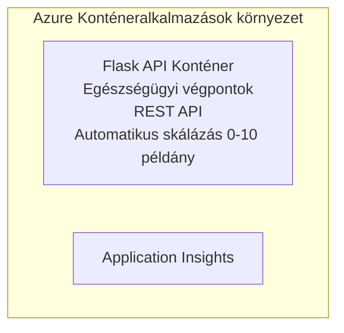

# Egyszerű Flask API - Container App példa

**Tanulási út:** Kezdő ⭐ | **Időtartam:** 25-35 perc | **Költség:** 0-15$/hó

Egy teljesen működő Python Flask REST API, amely Azure Container Apps-re van telepítve az Azure Developer CLI (azd) segítségével. Ez a példa bemutatja a konténer telepítését, az automatikus skálázást és az alapvető megfigyelést.

## 🎯 Amit megtanulsz

- Konténerizált Python alkalmazás telepítése Azure-ra  
- Automatikus skálázás konfigurálása scale-to-zero funkcióval  
- Egészségügyi vizsgálatok és kész állapot ellenőrzések megvalósítása  
- Alkalmazásnaplók és metrikák figyelése  
- Gyors telepítés Azure Developer CLI használatával  

## 📦 Mit tartalmaz

✅ **Flask alkalmazás** - Teljes REST API CRUD műveletekkel (`src/app.py`)  
✅ **Dockerfile** - Termelési szintű konténer konfiguráció  
✅ **Bicep infrastruktúra** - Container Apps környezet és API telepítés  
✅ **AZD konfiguráció** - Egy parancsos telepítés beállítása  
✅ **Egészségügyi vizsgálatok** - Liveness és readiness ellenőrzések konfigurálva  
✅ **Automatikus skálázás** - 0-10 replika HTTP terhelés alapján  

## Architektúra


## Előfeltételek

### Szükséges
- **Azure Developer CLI (azd)** - [Telepítési útmutató](https://learn.microsoft.com/azure/developer/azure-developer-cli/install-azd)
- **Azure előfizetés** - [Ingyenes fiók](https://azure.microsoft.com/free/)
- **Docker Desktop** - [Docker telepítése](https://www.docker.com/products/docker-desktop/) (helyi teszteléshez)

### Előfeltételek ellenőrzése

```bash
# Ellenőrizze az azd verziót (szükséges 1.5.0 vagy újabb)
azd version

# Ellenőrizze az Azure bejelentkezést
azd auth login

# Ellenőrizze a Dockert (opcionális, helyi teszteléshez)
docker --version
```

## ⏱️ Telepítési ütemterv

| Fázis | Időtartam | Mi történik |
|-------|----------|--------------||
| Környezet létrehozása | 30 másodperc | azd környezet létrehozása |
| Konténer buildelése | 2-3 perc | Docker build Flask alkalmazás |
| Infrastruktúra biztosítása | 3-5 perc | Container Apps, registry, monitoring létrehozása |
| Alkalmazás telepítése | 2-3 perc | Kép feltöltése és telepítése Container Apps-be |
| **Összesen** | **8-12 perc** | Teljes telepítés kész |

## Gyors indulás

```bash
# Navigálj a példához
cd examples/container-app/simple-flask-api

# Inicializáld a környezetet (válassz egyedi nevet)
azd env new myflaskapi

# Telepíts mindent (infrastruktúra + alkalmazás)
azd up
# Kérni fogják, hogy:
# 1. Válassz Azure előfizetést
# 2. Válassz helyszínt (pl. eastus2)
# 3. Várj 8-12 percet a telepítésre

# Szerezd meg az API végpontodat
azd env get-values

# Teszteld az API-t
curl $(azd env get-value API_ENDPOINT)/health
```

**Várt kimenet:**  
```json
{
  "status": "healthy",
  "timestamp": "2025-11-19T10:30:00Z",
  "service": "simple-flask-api",
  "version": "1.0.0"
}
```

## ✅ Telepítés ellenőrzése

### 1. lépés: Telepítés állapotának ellenőrzése

```bash
# Telepített szolgáltatások megtekintése
azd show

# A várt kimenet a következőket mutatja:
# - Szolgáltatás: api
# - Végpont: https://ca-api-[env].xxx.azurecontainerapps.io
# - Állapot: Futásban
```

### 2. lépés: API végpontok tesztelése

```bash
# API végpont lekérése
API_URL=$(azd env get-value API_ENDPOINT)

# Egészség ellenőrzése
curl $API_URL/health

# Gyökér végpont tesztelése
curl $API_URL/

# Elem létrehozása
curl -X POST $API_URL/api/items \
  -H "Content-Type: application/json" \
  -d '{"name": "Test Item", "description": "My first item"}'

# Összes elem lekérése
curl $API_URL/api/items
```

**Siker kritériumok:**  
- ✅ Egészségügyi végpont HTTP 200-as választ ad  
- ✅ Gyökér végpont megjeleníti az API információkat  
- ✅ POST kérés létrehoz egy elemet és HTTP 201-et ad vissza  
- ✅ GET kérés visszaadja a létrehozott elemeket  

### 3. lépés: Naplók megtekintése

```bash
# Élő naplók folyamának megtekintése az azd monitor segítségével
azd monitor --logs

# Vagy használja az Azure CLI-t:
az containerapp logs show --name api --resource-group $RG_NAME --follow

# Ezt kell látnia:
# - Gunicorn indítási üzenetek
# - HTTP kérés naplók
# - Alkalmazás információs naplók
```

## Projekt struktúra

```
simple-flask-api/
├── azure.yaml              # AZD configuration
├── infra/
│   ├── main.bicep         # Main infrastructure
│   ├── main.parameters.json
│   └── app/
│       ├── container-env.bicep
│       └── api.bicep
└── src/
    ├── app.py             # Flask application
    ├── requirements.txt
    └── Dockerfile
```

## API végpontok

| Végpont | Módszer | Leírás |
|----------|--------|-------------|
| `/health` | GET | Egészségügyi ellenőrzés |
| `/api/items` | GET | Összes elem listázása |
| `/api/items` | POST | Új elem létrehozása |
| `/api/items/{id}` | GET | Egy adott elem lekérése |
| `/api/items/{id}` | PUT | Elem frissítése |
| `/api/items/{id}` | DELETE | Elem törlése |

## Konfiguráció

### Környezeti változók

```bash
# Egyedi konfiguráció beállítása
azd env set PORT 8000
azd env set LOG_LEVEL info
azd env set MAX_REPLICAS 20
```

### Skálázási beállítások

Az API automatikusan skálázódik a HTTP forgalom alapján:
- **Minimális replika:** 0 (skálázás nullára tétel tétlenség esetén)  
- **Maximális replika:** 10  
- **Egy replika által párhuzamosan kezelhető kérések száma:** 50  

## Fejlesztés

### Helyi futtatás

```bash
# Függőségek telepítése
cd src
pip install -r requirements.txt

# Az alkalmazás futtatása
python app.py

# Helyi tesztelés
curl http://localhost:8000/health
```

### Konténer építése és tesztelése

```bash
# Docker kép építése
docker build -t flask-api:local ./src

# Konténer futtatása helyben
docker run -p 8000:8000 flask-api:local

# Konténer tesztelése
curl http://localhost:8000/health
```

## Telepítés

### Teljes telepítés

```bash
# Infrastruktúra és alkalmazás telepítése
azd up
```

### Csak kód telepítés

```bash
# Csak az alkalmazáskódot telepítse (infrastruktúra változatlan)
azd deploy api
```

### Konfiguráció frissítése

```bash
# Környezeti változók frissítése
azd env set API_KEY "new-api-key"

# Új konfigurációval való újratelepítés
azd deploy api
```

## Megfigyelés

### Naplók megtekintése

```bash
# Élő naplók streamelése az azd monitor segítségével
azd monitor --logs

# Vagy használd az Azure CLI-t Container Apps-hez:
az containerapp logs show --name api --resource-group $RG_NAME --follow

# Az utolsó 100 sor megtekintése
az containerapp logs show --name api --resource-group $RG_NAME --tail 100
```

### Metrikák figyelése

```bash
# Azure Monitor műszerfal megnyitása
azd monitor --overview

# Specifikus metrikák megtekintése
az monitor metrics list \
  --resource $(azd show --output json | jq -r '.services.api.resourceId') \
  --metric "Requests,ResponseTime"
```

## Tesztelés

### Egészségügyi ellenőrzés

```bash
curl $(azd show --output json | jq -r '.services.api.endpoint')/health
```

Várt válasz:  
```json
{
  "status": "healthy",
  "timestamp": "2025-11-19T10:30:00Z"
}
```

### Elem létrehozása

```bash
curl -X POST $(azd show --output json | jq -r '.services.api.endpoint')/api/items \
  -H "Content-Type: application/json" \
  -d '{"name": "Test Item", "description": "A test item"}'
```

### Összes elem lekérése

```bash
curl $(azd show --output json | jq -r '.services.api.endpoint')/api/items
```

## Költségoptimalizálás

Ez a telepítés scale-to-zero-t használ, így csak akkor fizetsz, amikor az API éppen kéréseket dolgoz fel:

- **Tétlenségi költség**: kb. 0$/hó (nullára skálázva)  
- **Aktív költség**: kb. 0.000024$/másodperc replika  
- **Várt havi költség** (könnyű használat): 5-15$  

### További költségcsökkentés

```bash
# Csökkentse a maximális replikák számát fejlesztésre
azd env set MAX_REPLICAS 3

# Rövidebb inaktivitási időkorlát használata
azd env set SCALE_TO_ZERO_TIMEOUT 300  # 5 perc
```

## Hibakeresés

### A konténer nem indul el

```bash
# Konténer naplók ellenőrzése Azure CLI használatával
az containerapp logs show --name api --resource-group $RG_NAME --tail 100

# Docker kép helyi építésének ellenőrzése
docker build -t test ./src
```

### API nem elérhető

```bash
# Ellenőrizze, hogy a bejövő forgalom külső-e
az containerapp show --name api --resource-group rg-simple-flask-api \
  --query properties.configuration.ingress.external
```

### Magas válaszidők

```bash
# Ellenőrizze a CPU/memória használatát
az monitor metrics list \
  --resource $(azd show --output json | jq -r '.services.api.resourceId') \
  --metric "CPUPercentage,MemoryPercentage"

# Növelje az erőforrásokat, ha szükséges
az containerapp update --name api --resource-group rg-simple-flask-api \
  --cpu 1.0 --memory 2Gi
```

## Takarítás

```bash
# Töröld az összes erőforrást
azd down --force --purge
```

## Következő lépések

### A példa bővítése

1. **Adatbázis hozzáadása** - Integrálás Azure Cosmos DB-vel vagy SQL Adatbázissal  
   ```bash
   # Add hozzá a Cosmos DB modult az infra/main.bicep fájlhoz
   # Frissítsd az app.py fájlt az adatbázis csatlakozással
   ```

2. **Hitelesítés hozzáadása** - Azure AD vagy API kulcsok megvalósítása  
   ```python
   # Adj hozzá hitelesítési middleware-t az app.py-hez
   from functools import wraps
   ```

3. **CI/CD beállítása** - GitHub Actions munkafolyamat  
   ```yaml
   # Create .github/workflows/deploy.yml
   name: Deploy to Azure
   on: [push]
   ```

4. **Managed Identity hozzáadása** - Biztonságos hozzáférés Azure szolgáltatásokhoz  
   ```bicep
   # Update infra/app/api.bicep
   identity: { type: 'SystemAssigned' }
   ```

### Kapcsolódó példák

- **[Adatbázis alkalmazás](../../../../../examples/database-app)** - Teljes példa SQL Adatbázissal  
- **[Mikroszolgáltatások](../../../../../examples/container-app/microservices)** - Több szolgáltatás architektúra  
- **[Container Apps mesterguide](../README.md)** - Minden konténer minta  

### Tanulási források

- 📚 [AZD kezdőknek kurzus](../../../README.md) - Fő kurzus kezdőlap  
- 📚 [Container Apps minták](../README.md) - További telepítési minták  
- 📚 [AZD sablonok galéria](https://azure.github.io/awesome-azd/) - Közösségi sablonok  

## További források

### Dokumentáció  
- **[Flask dokumentáció](https://flask.palletsprojects.com/)** - Flask keretrendszer útmutató  
- **[Azure Container Apps](https://learn.microsoft.com/azure/container-apps/)** - Hivatalos Azure dokumentáció  
- **[Azure Developer CLI](https://learn.microsoft.com/azure/developer/azure-developer-cli/)** - azd parancsreferencia  

### Oktatóanyagok  
- **[Container Apps gyorsindító](https://learn.microsoft.com/azure/container-apps/quickstart-portal)** - Első alkalmazás telepítése  
- **[Python Azure-on](https://learn.microsoft.com/azure/developer/python/)** - Python fejlesztési útmutató  
- **[Bicep nyelv](https://learn.microsoft.com/azure/azure-resource-manager/bicep/)** - Infrastruktúra kód formájában  

### Eszközök  
- **[Azure portal](https://portal.azure.com)** - Erőforrások vizuális kezelése  
- **[VS Code Azure kiterjesztés](https://marketplace.visualstudio.com/items?itemName=ms-azuretools.vscode-azurecontainerapps)** - IDE integráció  

---

**🎉 Gratulálunk!** Sikeresen telepítettél egy termelésre kész Flask API-t az Azure Container Apps-re automatikus skálázással és megfigyeléssel.

**Kérdésed van?** [Nyiss egy issue-t](https://github.com/microsoft/AZD-for-beginners/issues) vagy nézd meg a [GYIK-et](../../../resources/faq.md)

---

<!-- CO-OP TRANSLATOR DISCLAIMER START -->
**Jogi nyilatkozat**:
Ez a dokumentum az AI fordító szolgáltatás, a [Co-op Translator](https://github.com/Azure/co-op-translator) segítségével készült. Bár törekszünk a pontosságra, kérjük, vegye figyelembe, hogy az automatikus fordítások hibákat vagy pontatlanságokat tartalmazhatnak. Az eredeti dokumentum az anyanyelvén tekintendő hivatalos forrásnak. Kritikus információk esetén szakmai emberi fordítást javaslunk. Nem vállalunk felelősséget a fordítás használatából eredő félreértésekért vagy félreértelmezésekért.
<!-- CO-OP TRANSLATOR DISCLAIMER END -->