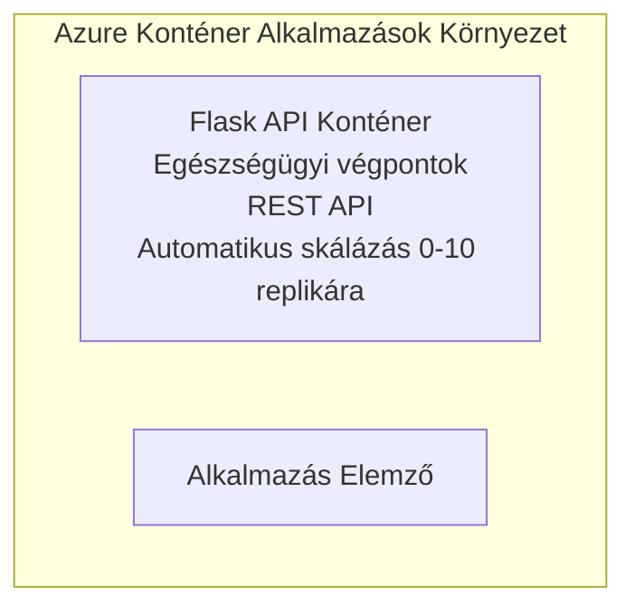

# Egyszerű Flask API - Container App példa

**Tanulási útvonal:** Kezdő ⭐ | **Időtartam:** 25-35 perc | **Költség:** 0-15 USD/hó

Egy teljes, működő Python Flask REST API telepítve Azure Container Apps-be az Azure Developer CLI (azd) használatával. Ez a példa bemutatja a konténer alapú telepítést, az automatikus méretezést és az alapvető monitorozást.

## 🎯 Amit megtanulsz

- Konténerizált Python alkalmazás telepítése Azure-ra  
- Automatikus méretezés konfigurálása, skálázás nullára  
- Egészségügyi ellenőrzések és készenléti vizsgálatok megvalósítása  
- Alkalmazás naplóinak és metrikáinak monitorozása  
- Azure Developer CLI használata gyors telepítéshez

## 📦 Mi van benne

✅ **Flask alkalmazás** - Teljes REST API CRUD műveletekkel (`src/app.py`)  
✅ **Dockerfile** - Éles környezethez készült konténer konfiguráció  
✅ **Bicep infrastruktúra** - Container Apps környezet és API telepítés  
✅ **AZD konfiguráció** - Egysoros telepítés beállítás  
✅ **Egészségügyi ellenőrzések** - Liveness és readiness vizsgálatok konfigurálva  
✅ **Automatikus méretezés** - 0-10 replikára HTTP terhelés alapján  

## Architektúra



## Előfeltételek

### Szükséges
- **Azure Developer CLI (azd)** - [Telepítési útmutató](https://learn.microsoft.com/azure/developer/azure-developer-cli/install-azd)  
- **Azure előfizetés** - [Ingyenes fiók](https://azure.microsoft.com/free/)  
- **Docker Desktop** - [Docker telepítése](https://www.docker.com/products/docker-desktop/) (helyi teszteléshez)

### Előfeltételek ellenőrzése

```bash
# Azd verzió ellenőrzése (szükséges 1.5.0 vagy újabb)
azd version

# Azure bejelentkezés ellenőrzése
azd auth login

# Docker ellenőrzése (opcionális, helyi teszteléshez)
docker --version
```

## ⏱️ Telepítési ütemterv

| Fázis | Időtartam | Mi történik? |
|-------|----------|--------------|
| Környezet beállítása | 30 másodperc | Azd környezet létrehozása |
| Konténer build | 2-3 perc | Flask app Docker build |
| Infrastruktúra létrehozása | 3-5 perc | Container Apps, registry, monitorozás létrehozása |
| Alkalmazás telepítés | 2-3 perc | Kép feltöltése és telepítés Container Apps-be |
| **Összesen** | **8-12 perc** | Teljes telepítés kész |

## Gyors indulás

```bash
# Navigáljon a példához
cd examples/container-app/simple-flask-api

# Inicializálja a környezetet (válasszon egyedi nevet)
azd env new myflaskapi

# Telepítsen mindent (infrastruktúra + alkalmazás)
azd up
# A rendszer felszólítja, hogy:
# 1. Válassza ki az Azure előfizetést
# 2. Válasszon helyszínt (pl. eastus2)
# 3. Várjon 8-12 percet a telepítésre

# Szerezze be az API végpontját
azd env get-values

# Tesztelje az API-t
curl $(azd env get-value API_ENDPOINT)/health
```

**Várt kimenet:**  
```json
{
  "status": "healthy",
  "timestamp": "2025-11-19T10:30:00Z",
  "service": "simple-flask-api",
  "version": "1.0.0"
}
```

## ✅ Telepítés ellenőrzése

### 1. lépés: Telepítési állapot ellenőrzése

```bash
# Telepített szolgáltatások megtekintése
azd show

# A várt kimenet a következőket mutatja:
# - Szolgáltatás: api
# - Végpont: https://ca-api-[env].xxx.azurecontainerapps.io
# - Állapot: Futásban
```

### 2. lépés: API végpontok tesztelése

```bash
# API végpont lekérése
API_URL=$(azd env get-value API_ENDPOINT)

# Egészség tesztelése
curl $API_URL/health

# Gyökér végpont tesztelése
curl $API_URL/

# Elem létrehozása
curl -X POST $API_URL/api/items \
  -H "Content-Type: application/json" \
  -d '{"name": "Test Item", "description": "My first item"}'

# Összes elem lekérése
curl $API_URL/api/items
```

**Siker kritériumok:**  
- ✅ Az egészségügyi végpont HTTP 200 választ ad  
- ✅ A gyökér végpont API információkat mutat  
- ✅ POST létrehoz egy elemet, HTTP 201 választ ad  
- ✅ GET visszaadja a létrehozott elemeket

### 3. lépés: Naplók megtekintése

```bash
# Éles naplók folyamatos közvetítése az azd monitor segítségével
azd monitor --logs

# Vagy használd az Azure CLI-t:
az containerapp logs show --name api --resource-group $RG_NAME --follow

# Ezeket kell látnod:
# - Gunicorn indítási üzenetek
# - HTTP kérés naplók
# - Alkalmazásinformációs naplók
```

## Projekt struktúra

```
simple-flask-api/
├── azure.yaml              # AZD configuration
├── infra/
│   ├── main.bicep         # Main infrastructure
│   ├── main.parameters.json
│   └── app/
│       ├── container-env.bicep
│       └── api.bicep
└── src/
    ├── app.py             # Flask application
    ├── requirements.txt
    └── Dockerfile
```

## API végpontok

| Végpont | Módszer | Leírás |
|----------|--------|-------------|
| `/health` | GET | Egészségügyi ellenőrzés |
| `/api/items` | GET | Az összes elem listázása |
| `/api/items` | POST | Új elem létrehozása |
| `/api/items/{id}` | GET | Megadott elem lekérése |
| `/api/items/{id}` | PUT | Elem frissítése |
| `/api/items/{id}` | DELETE | Elem törlése |

## Konfiguráció

### Környezeti változók

```bash
# Egyedi konfiguráció beállítása
azd env set PORT 8000
azd env set LOG_LEVEL info
azd env set MAX_REPLICAS 20
```

### Méretezési beállítások

Az API automatikusan skálázódik HTTP forgalom alapján:  
- **Minimális replikák:** 0 (alvó állapotban nullára skáláz)  
- **Maximális replikák:** 10  
- **Egyidejű kérések replikánként:** 50

## Fejlesztés

### Helyi futtatás

```bash
# Függőségek telepítése
cd src
pip install -r requirements.txt

# Az alkalmazás futtatása
python app.py

# Helyi tesztelés
curl http://localhost:8000/health
```

### Konténer buildelése és tesztelése

```bash
# Docker kép építése
docker build -t flask-api:local ./src

# Konténer futtatása helyben
docker run -p 8000:8000 flask-api:local

# Konténer tesztelése
curl http://localhost:8000/health
```

## Telepítés

### Teljes telepítés

```bash
# Infrastruktúra és alkalmazás telepítése
azd up
```

### Csak kód telepítés

```bash
# Csak az alkalmazáskódot telepítse (infrastruktúra változatlan)
azd deploy api
```

### Konfiguráció frissítése

```bash
# Környezeti változók frissítése
azd env set API_KEY "new-api-key"

# Új konfigurációval történő újbóli telepítés
azd deploy api
```

## Monitorozás

### Naplók megtekintése

```bash
# Élő naplók streamelése az azd monitorral
azd monitor --logs

# Vagy használd az Azure CLI-t Container Apps-hez:
az containerapp logs show --name api --resource-group $RG_NAME --follow

# Az utolsó 100 sor megtekintése
az containerapp logs show --name api --resource-group $RG_NAME --tail 100
```

### Metrikák figyelése

```bash
# Azure Monitor irányítópult megnyitása
azd monitor --overview

# Specifikus metrikák megtekintése
az monitor metrics list \
  --resource $(azd show --output json | jq -r '.services.api.resourceId') \
  --metric "Requests,ResponseTime"
```

## Tesztelés

### Egészségügyi ellenőrzés

```bash
curl $(azd show --output json | jq -r '.services.api.endpoint')/health
```

Várt válasz:  
```json
{
  "status": "healthy",
  "timestamp": "2025-11-19T10:30:00Z"
}
```

### Elem létrehozása

```bash
curl -X POST $(azd show --output json | jq -r '.services.api.endpoint')/api/items \
  -H "Content-Type: application/json" \
  -d '{"name": "Test Item", "description": "A test item"}'
```

### Összes elem lekérése

```bash
curl $(azd show --output json | jq -r '.services.api.endpoint')/api/items
```

## Költségoptimalizálás

Ez a telepítés nullára skáláz, így csak akkor fizetsz, amikor az API kérdéseket dolgoz fel:

- **Álló költség:** kb. 0 USD/hó (nullára skálázva)  
- **Aktív költség:** kb. 0,000024 USD/másodperc replikánként  
- **Várt havi költség** (kisebb használat): 5-15 USD

### További költségcsökkentés

```bash
# Csökkentse a fejlesztéshez a maximális replikák számát
azd env set MAX_REPLICAS 3

# Használjon rövidebb inaktivitási időkorlátot
azd env set SCALE_TO_ZERO_TIMEOUT 300  # 5 perc
```

## Hibakeresés

### A konténer nem indul el

```bash
# Ellenőrizze a konténer naplóit az Azure CLI segítségével
az containerapp logs show --name api --resource-group $RG_NAME --tail 100

# Ellenőrizze a Docker kép helyi építését
docker build -t test ./src
```

### Nem elérhető az API

```bash
# Ellenőrizze, hogy a bejövő kapcsolat külső-e
az containerapp show --name api --resource-group rg-simple-flask-api \
  --query properties.configuration.ingress.external
```

### Magas válaszidők

```bash
# CPU/Memória használat ellenőrzése
az monitor metrics list \
  --resource $(azd show --output json | jq -r '.services.api.resourceId') \
  --metric "CPUPercentage,MemoryPercentage"

# Erőforrások skálázása szükség esetén
az containerapp update --name api --resource-group rg-simple-flask-api \
  --cpu 1.0 --memory 2Gi
```

## Tisztítás

```bash
# Töröljön minden erőforrást
azd down --force --purge
```

## Következő lépések

### Példa bővítése

1. **Adatbázis hozzáadása** - Azure Cosmos DB vagy SQL Database integrálása  
   ```bash
   # Add Cosmos DB modult az infra/main.bicep fájlhoz
   # Frissítsd az app.py-t az adatbázis kapcsolattal
   ```

2. **Hitelesítés hozzáadása** - Microsoft Entra ID vagy API kulcsok bevezetése  
   ```python
   # Adjunk hozzá hitelesítési köztes réteget az app.py-hoz
   from functools import wraps
   ```

3. **CI/CD beállítása** - GitHub Actions munkafolyamat  
   ```yaml
   # Create .github/workflows/deploy.yml
   name: Deploy to Azure
   on: [push]
   ```

4. **Managed Identity hozzáadása** - Biztonságos hozzáférés az Azure szolgáltatásokhoz  
   ```bicep
   # Update infra/app/api.bicep
   identity: { type: 'SystemAssigned' }
   ```

### Kapcsolódó példák

- **[Adatbázis alkalmazás](../../../../../examples/database-app)** - Teljes példa SQL adatbázissal  
- **[Microservices](../../../../../examples/container-app/microservices)** - Többszolgáltatásos architektúra  
- **[Container Apps Master Guide](../README.md)** - Minden konténer minta

### Tanulási források

- 📚 [AZD kezdőknek tanfolyam](../../../README.md) - Fő kurzus otthona  
- 📚 [Container Apps minták](../README.md) - Több telepítési minták  
- 📚 [AZD sablonok galéria](https://azure.github.io/awesome-azd/) - Közösségi sablonok

## További források

### Dokumentáció  
- **[Flask dokumentáció](https://flask.palletsprojects.com/)** - Flask keretrendszer útmutató  
- **[Azure Container Apps](https://learn.microsoft.com/azure/container-apps/)** - Hivatalos Azure dokumentáció  
- **[Azure Developer CLI](https://learn.microsoft.com/azure/developer/azure-developer-cli/)** - azd parancsreferencia

### Oktatóanyagok  
- **[Container Apps gyors kezdés](https://learn.microsoft.com/azure/container-apps/quickstart-portal)** - Első alkalmazás telepítése  
- **[Python az Azure-on](https://learn.microsoft.com/azure/developer/python/)** - Python fejlesztési útmutató  
- **[Bicep nyelv](https://learn.microsoft.com/azure/azure-resource-manager/bicep/)** - Infrastruktúra kód formában

### Eszközök  
- **[Azure Portal](https://portal.azure.com)** - Erőforrások vizuális kezelése  
- **[VS Code Azure bővítmény](https://marketplace.visualstudio.com/items?itemName=ms-azuretools.vscode-azurecontainerapps)** - IDE integráció

---

**🎉 Gratulálunk!** Sikeresen telepítettél egy éles Flask API-t Azure Container Apps-be automatikus méretezéssel és monitorozással.

**Kérdésed van?** [Nyiss egy hibajegyet](https://github.com/microsoft/AZD-for-beginners/issues) vagy nézd meg a [GYIK](../../../resources/faq.md) részt.

---

<!-- CO-OP TRANSLATOR DISCLAIMER START -->
**Jogi nyilatkozat**:
Ez a dokumentum az AI fordítási szolgáltatás, a [Co-op Translator](https://github.com/Azure/co-op-translator) segítségével készült. Bár az pontosságra törekszünk, kérjük, vegye figyelembe, hogy az automatikus fordítások hibákat vagy pontatlanságokat tartalmazhatnak. Az eredeti dokumentum az anyanyelvén tekintendő hiteles forrásnak. Fontos információk esetén professzionális emberi fordítást javasolunk. Nem vállalunk felelősséget semmilyen félreértésért vagy téves értelmezésért, amely ebből a fordításból ered.
<!-- CO-OP TRANSLATOR DISCLAIMER END -->