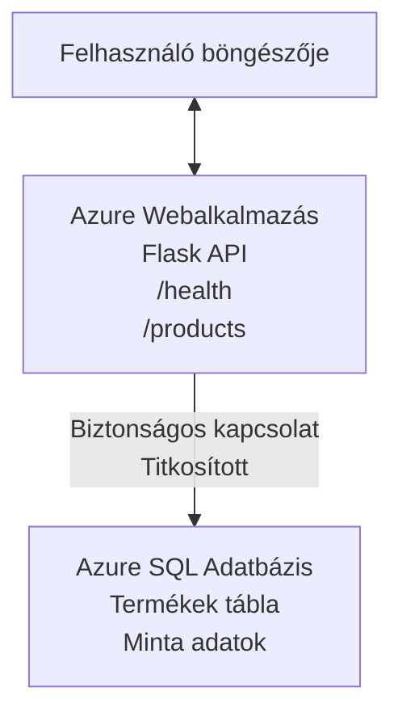

# Microsoft SQL-adatbázis és webalkalmazás telepítése az AZD-vel

⏱️ **Becsült idő**: 20-30 perc | 💰 **Becsült költség**: ~$15-25/hónap | ⭐ **Bonyolultság**: Középhaladó

Ez a **teljes, működő példa** bemutatja, hogyan lehet használni az [Azure Developer CLI (azd)](https://learn.microsoft.com/azure/developer/azure-developer-cli/)-t egy Python Flask webalkalmazás Microsoft SQL adatbázissal történő Azure-ba telepítéséhez. Minden kód szerepel és tesztelt—nem szükségesek külső függőségek.

## Amit megtanulsz

A példa elvégzésével:
- Többrétegű alkalmazást (webalkalmazás + adatbázis) telepítesz infrastruktúra-kódként
- Biztonságos adatbáziskapcsolatot konfigurálsz titkok hardkódolása nélkül
- Figyeled az alkalmazás állapotát az Application Insights segítségével
- Hatékonyan kezeled az Azure erőforrásokat az AZD CLI-vel
- Betartod az Azure biztonsági, költségoptimalizálási és megfigyelési legjobb gyakorlatait

## Forgatókönyv áttekintése
- **Webalkalmazás**: Python Flask REST API adatbáziskapcsolattal
- **Adatbázis**: Azure SQL adatbázis mintaadatokkal
- **Infrastruktúra**: Biceppel (moduláris, újrafelhasználható sablonokkal) biztosított
- **Telepítés**: Teljesen automatizált `azd` parancsokkal
- **Megfigyelés**: Application Insights a naplózásra és telemetriára

## Előfeltételek

### Szükséges eszközök

Az indítás előtt ellenőrizd, hogy telepítve vannak ezek az eszközök:

1. **[Azure CLI](https://learn.microsoft.com/cli/azure/install-azure-cli)** (2.50.0 vagy újabb verzió)
   ```sh
   az --version
   # Várt kimenet: azure-cli 2.50.0 vagy újabb
   ```

2. **[Azure Developer CLI (azd)](https://learn.microsoft.com/azure/developer/azure-developer-cli/install-azd)** (1.0.0 vagy újabb verzió)
   ```sh
   azd version
   # Várt kimenet: azd verzió 1.0.0 vagy újabb
   ```

3. **[Python 3.8+](https://www.python.org/downloads/)** (helyi fejlesztéshez)
   ```sh
   python --version
   # Várt kimenet: Python 3.8 vagy újabb
   ```

4. **[Docker](https://www.docker.com/get-started)** (opcionális, helyi konténerizált fejlesztéshez)
   ```sh
   docker --version
   # Várt kimenet: Docker verzió 20.10 vagy újabb
   ```

### Azure követelmények

- Aktív **Azure-előfizetés** ([ingyenes fiók létrehozása](https://azure.microsoft.com/free/))
- Engedélyek az előfizetésben történő erőforrás létrehozáshoz
- **Tulajdonos** vagy **Közreműködő** szerepkör az előfizetésen vagy erőforráscsoporton

### Szükséges tudás

Ez egy **középhaladó** példája. Ismerned kell:
- Alap parancssoros műveletek
- Alapvető felhő fogalmak (erőforrások, erőforráscsoportok)
- Webalkalmazások és adatbázisok alapfogalmai

**Új vagy az AZD-hez?** Kezdd a [Bevezető útmutatóval](../../docs/chapter-01-foundation/azd-basics.md).

## Architektúra

Ez a példa egy kétlépcsős architektúrát telepít webalkalmazással és SQL adatbázissal:


**Erőforrás telepítés:**
- **Erőforráscsoport**: Minden erőforrás tárolója
- **App Service Plan**: Linux alapú hosztolás (B1 szint költséghatékonyságért)
- **Webalkalmazás**: Python 3.11 futtatókörnyezet Flask app-pal
- **SQL Server**: Felügyelt adatbázis szerver TLS 1.2 minimummal
- **SQL adatbázis**: Alap szint (2GB, fejlesztéshez/teszteléshez alkalmas)
- **Application Insights**: Megfigyelés és naplózás
- **Log Analytics munkaterület**: Központosított naplótárolás

**Analógia**: Gondolj erre úgy, mint egy étteremre (webapp) egy bejárati fagyasztóval (adatbázis). A vendégek a menüről rendelnek (API végpontok), a konyha (Flask alkalmazás) pedig előveszi az alapanyagokat (adatokat) a fagyasztóból. Az étterem vezetője (Application Insights) minden eseményt követ.

## Mappastruktúra

Minden fájl szerepel ebben a példában—nincsenek külső függőségek:

```
examples/database-app/
│
├── README.md                    # This file
├── azure.yaml                   # AZD configuration file
├── .env.sample                  # Sample environment variables
├── .gitignore                   # Git ignore patterns
│
├── infra/                       # Infrastructure as Code (Bicep)
│   ├── main.bicep              # Main orchestration template
│   ├── abbreviations.json      # Azure naming conventions
│   └── resources/              # Modular resource templates
│       ├── sql-server.bicep    # SQL Server configuration
│       ├── sql-database.bicep  # Database configuration
│       ├── app-service-plan.bicep  # Hosting plan
│       ├── app-insights.bicep  # Monitoring setup
│       └── web-app.bicep       # Web application
│
└── src/
    └── web/                    # Application source code
        ├── app.py              # Flask REST API
        ├── requirements.txt    # Python dependencies
        └── Dockerfile          # Container definition
```

**Minden fájl szerepe:**
- **azure.yaml**: Megadja az AZD-nek, mit és hova telepítsen
- **infra/main.bicep**: Együtthangolja az összes Azure erőforrást
- **infra/resources/*.bicep**: Egyedi erőforrásdefiníciók (moduláris és újrafelhasználható)
- **src/web/app.py**: Flask alkalmazás adatbázis logikával
- **requirements.txt**: Python csomagfüggőségek
- **Dockerfile**: Konténerizációs utasítások a telepítéshez

## Gyors kezdés (lépésről lépésre)

### 1. lépés: Klónozás és Navigáció

```sh
git clone https://github.com/microsoft/AZD-for-beginners.git
cd AZD-for-beginners/examples/database-app
```

**✓ Sikerellenőrzés**: Ellenőrizd, hogy látod-e az `azure.yaml` és `infra/` mappát:
```sh
ls
# Várt: README.md, azure.yaml, infra/, src/
```

### 2. lépés: Bejelentkezés Azure-ba

```sh
azd auth login
```

Ez megnyitja a böngésződ az Azure hitelesítéshez. Jelentkezz be az Azure fiókoddal.

**✓ Sikerellenőrzés**: Ezt kell látnod:
```
Logged in to Azure.
```

### 3. lépés: Környezet inicializálása

```sh
azd init
```

**Mi történik**: AZD létrehozza a helyi konfigurációt a telepítéshez.

**Kérdések, amiket meg fogsz látni**:
- **Környezeti név**: Adj meg egy rövid nevet (pl. `dev`, `myapp`)
- **Azure előfizetés**: Válaszd ki az előfizetésed a listából
- **Azure helyszín**: Válassz régiót (pl. `eastus`, `westeurope`)

**✓ Sikerellenőrzés**: Ezt kell látnod:
```
SUCCESS: New project initialized!
```

### 4. lépés: Azure erőforrások létrehozása

```sh
azd provision
```

**Mi történik**: AZD telepíti az összes infrastruktúrát (5-8 perc):
1. Létrehozza az erőforráscsoportot
2. Létrehozza az SQL Servert és adatbázist
3. Létrehozza az App Service Plan-t
4. Létrehozza a Webalkalmazást
5. Létrehozza az Application Insights-ot
6. Konfigurálja a hálózatot és a biztonságot

**Bekér ezektől az adatokat**:
- **SQL admin felhasználónév**: Adj meg egy felhasználónevet (pl. `sqladmin`)
- **SQL admin jelszó**: Adj meg egy erős jelszót (jegyezd meg!)

**✓ Sikerellenőrzés**: Ezt kell látnod:
```
SUCCESS: Your application was provisioned in Azure in X minutes Y seconds.
You can view the resources created under the resource group rg-<env-name> in Azure Portal:
https://portal.azure.com/#@/resource/subscriptions/.../resourceGroups/rg-<env-name>
```

**⏱️ Idő**: 5-8 perc

### 5. lépés: Az alkalmazás telepítése

```sh
azd deploy
```

**Mi történik**: AZD felépíti és telepíti a Flask alkalmazást:
1. Csomagolja a Python alkalmazást
2. Felépíti a Docker konténert
3. Feltölti az Azure Webalkalmazásra
4. Inicializálja az adatbázist minta adatokkal
5. Elindítja az alkalmazást

**✓ Sikerellenőrzés**: Ezt kell látnod:
```
SUCCESS: Your application was deployed to Azure in X minutes Y seconds.
You can view the resources created under the resource group rg-<env-name> in Azure Portal:
https://portal.azure.com/#@/resource/subscriptions/.../resourceGroups/rg-<env-name>
```

**⏱️ Idő**: 3-5 perc

### 6. lépés: Alkalmazás böngészése

```sh
azd browse
```

Ez megnyitja a telepített webalkalmazásodat a böngészőben a `https://app-<unique-id>.azurewebsites.net` címen.

**✓ Sikerellenőrzés**: JSON kimenetet kell látnod:
```json
{
  "message": "Welcome to the Database App API",
  "endpoints": {
    "/": "This help message",
    "/health": "Health check endpoint",
    "/products": "List all products",
    "/products/<id>": "Get product by ID"
  }
}
```

### 7. lépés: API végpontok tesztelése

**Egészségellenőrzés** (adatbázis kapcsolat ellenőrzése):
```sh
curl https://app-<your-id>.azurewebsites.net/health
```

**Várt válasz**:
```json
{
  "status": "healthy",
  "database": "connected"
}
```

**Termékek listázása** (mintaadatokkal):
```sh
curl https://app-<your-id>.azurewebsites.net/products
```

**Várt válasz**:
```json
[
  {
    "id": 1,
    "name": "Laptop",
    "description": "High-performance laptop",
    "price": 1299.99,
    "created_at": "2025-11-19T10:30:00"
  },
  ...
]
```

**Egy termék lekérése**:
```sh
curl https://app-<your-id>.azurewebsites.net/products/1
```

**✓ Sikerellenőrzés**: Minden végpont JSON adatot ad vissza hiba nélkül.

---

**🎉 Gratulálunk!** Sikeresen telepítettél egy webalkalmazást adatbázissal az Azure-ba az AZD segítségével.

## Konfiguráció mélyreható áttekintése

### Környezeti változók

A titkokat biztonságosan kezeli az Azure App Service konfiguráció—**soha nem hardkódoltak a forráskódban**.

**Automatikusan konfigurálja az AZD**:
- `SQL_CONNECTION_STRING`: Adatbázis kapcsolat titkosított hitelesítő adatokkal
- `APPLICATIONINSIGHTS_CONNECTION_STRING`: Megfigyelési telemetria végpont
- `SCM_DO_BUILD_DURING_DEPLOYMENT`: Automatikus függőség telepítés engedélyezése

**Hol tárolódnak a titkok**:
1. Az `azd provision` során megadod az SQL hitelesítő adatokat biztonságos kérdésfeltevéssel
2. Az AZD elmenti őket a helyi `.azure/<env-name>/.env` fájlba (Git által figyelmen kívül hagyva)
3. Az AZD betölti azokat az Azure App Service konfigurációba (lemez titkosítva)
4. Az alkalmazás futás közben az `os.getenv()` segítségével olvassa be

### Helyi fejlesztés

Helyi teszteléshez hozz létre `.env` fájlt a mintából:

```sh
cp .env.sample .env
# Szerkessze a .env fájlt a helyi adatbázis-kapcsolatával
```

**Helyi fejlesztési munkafolyamat**:
```sh
# Függőségek telepítése
cd src/web
pip install -r requirements.txt

# Környezeti változók beállítása
export SQL_CONNECTION_STRING="your-local-connection-string"

# Az alkalmazás futtatása
python app.py
```

**Helyi tesztelés**:
```sh
curl http://localhost:8000/health
# Várt: {"status": "healthy", "database": "connected"}
```

### Infrastruktúra kódként

Minden Azure erőforrás **Bicep sablonokban** van definiálva (`infra/` mappa):

- **Moduláris felépítés**: Minden erőforrástípusnak saját fájlja a könnyű újrafelhasználáshoz
- **Paraméterezhető**: SKU-k, helyszínek, névadás testreszabása
- **Legjobb gyakorlatok**: Azure név- és biztonsági szabványok betartása
- **Verziókezelés**: Az infrastruktúra változásai Git alatt vannak

**Testreszabási példa**:
Az adatbázis szintjének módosításához szerkeszd az `infra/resources/sql-database.bicep` fájlt:
```bicep
sku: {
  name: 'Standard'  // Changed from 'Basic'
  tier: 'Standard'
  capacity: 10
}
```

## Biztonsági legjobb gyakorlatok

Ez a példa követi az Azure biztonsági legjobb gyakorlatait:

### 1. **Nincsenek titkok a forráskódban**
- ✅ Hitelesítő adatok Azure App Service konfigurációban tárolva (titkosítva)
- ✅ `.env` fájlok .gitignore-zal ki vannak zárva a gitből
- ✅ Titkok biztonságos paramétereken keresztül átadva telepítéskor

### 2. **Titkosított kapcsolatok**
- ✅ SQL Server TLS 1.2 minimum
- ✅ Csak HTTPS elvárás Web App esetén
- ✅ Adatbáziskapcsolatok titkosított csatornákon keresztül

### 3. **Hálózati biztonság**
- ✅ SQL Server tűzfal beállítva, csak Azure szolgáltatások engedélyezve
- ✅ Nyilvános hálózati hozzáférés korlátozva (további lezárás privát végpontokkal)
- ✅ FTPS letiltva a Web App-en

### 4. **Hitelesítés és jogosultságkezelés**
- ⚠️ **Jelenleg**: SQL hitelesítés (felhasználónév/jelszó)
- ✅ **Ajánlott éles környezetben**: Azure Managed Identity jelszó nélküli hitelesítéshez

**Managed Identity-re váltás élesben**:
1. Engedélyezd a Managed Identity-t a Web App-en
2. Adj jogosultságot az identitásnak az SQL-hez
3. Frissítsd a kapcsolat karakterláncot a Managed Identity használatára
4. Távolítsd el a jelszavas hitelesítést

### 5. **Naplózás és megfelelés**
- ✅ Application Insights naplózza az összes kérést és hibát
- ✅ SQL adatbázis naplózás engedélyezve (megfelelőséghez konfigurálható)
- ✅ Minden erőforrás címkézve a kormányzás érdekében

**Biztonsági ellenőrző lista élesítés előtt**:
- [ ] Azure Defender engedélyezése SQL-hez
- [ ] Privát végpontok konfigurálása SQL adatbázishoz
- [ ] Webalkalmazás Tűzfal (WAF) engedélyezése
- [ ] Azure Key Vault titkok forgatásához
- [ ] Azure AD hitelesítés beállítása
- [ ] Diagnosztikai naplózás engedélyezése minden erőforráshoz

## Költségoptimalizálás

**Becsült havi költségek** (2025 novemberi állapot szerint):

| Erőforrás | SKU/Szint | Becsült költség |
|----------|----------|----------------|
| App Service Plan | B1 (Alap) | ~$13/hó |
| SQL adatbázis | Alap (2GB) | ~$5/hó |
| Application Insights | Fizess amennyit használsz | ~$2/hó (alacsony forgalom) |
| **Összesen** | | **~$20/hó** |

**💡 Költségcsökkentő tippek**:

1. **Ingyenes szint tanuláshoz**:
   - App Service: F1 szint (ingyenes, korlátozott órák)
   - SQL adatbázis: Azure SQL Database szerver nélküli használat
   - Application Insights: 5 GB/hó ingyenes adatbefogadás

2. **Erőforrások leállítása használat nélkül**:
   ```sh
   # Állítsa le a webalkalmazást (az adatbázis továbbra is terhel)
   az webapp stop --name <app-name> --resource-group <rg-name>
   
   # Szükség esetén indítsa újra
   az webapp start --name <app-name> --resource-group <rg-name>
   ```

3. **Mindent törölni tesztelés után**:
   ```sh
   azd down
   ```
   Ez eltávolít minden erőforrást és megállítja a költségeket.

4. **Fejlesztési és éles SKU-k**:
   - **Fejlesztés**: Alap szint (ebben a példában)
   - **Éles**: Standard/Premium szint, redundanciával

**Költség monitorozása**:
- Nézd meg a költségeket az [Azure Cost Management-ben](https://portal.azure.com/#view/Microsoft_Azure_CostManagement)
- Állíts be költségriasztásokat a meglepetések elkerülésére
- Címkézd az összes erőforrást az `azd-env-name` címkével a nyomon követéshez

**Ingyenes szint alternatíva**:
Tanuláshoz módosíthatod az `infra/resources/app-service-plan.bicep` fájlt:
```bicep
sku: {
  name: 'F1'  // Free tier
  tier: 'Free'
}
```
**Megjegyzés**: Az ingyenes szint korlátai (napi 60 perc CPU, nincs mindig bekapcsolva).

## Megfigyelés és megfigyelhetőség

### Application Insights integráció

Ez a példa tartalmazza az **Application Insights** használatát átfogó megfigyeléshez:

**Mit figyelünk**:
- ✅ HTTP kérések (késleltetés, státuszkódok, végpontok)
- ✅ Alkalmazási hibák és kivételek
- ✅ Egyedi naplózás a Flask alkalmazásból
- ✅ Adatbázis kapcsolat állapota
- ✅ Teljesítménymutatók (CPU, memória)

**Application Insights elérése**:
1. Nyisd meg az [Azure Portal-t](https://portal.azure.com)
2. Navigálj az erőforráscsoporthoz (`rg-<env-name>`)
3. Kattints az Application Insights erőforrásra (`appi-<unique-id>`)

**Hasznos lekérdezések** (Application Insights → Naplók):

**Összes kérés megtekintése**:
```kusto
requests
| where timestamp > ago(1h)
| order by timestamp desc
| project timestamp, name, url, resultCode, duration
```

**Hibák keresése**:
```kusto
exceptions
| where timestamp > ago(24h)
| order by timestamp desc
| project timestamp, type, outerMessage, operation_Name
```

**Egészség-végpont ellenőrzése**:
```kusto
requests
| where name contains "health"
| summarize count() by resultCode, bin(timestamp, 1h)
```

### SQL adatbázis naplózás

**SQL adatbázis naplózás engedélyezve van** a következőkre:
- Adatbázis elérési minták
- Sikertelen bejelentkezések
- Sémaváltozások
- Adatelérés (megfelelőséghez)

**Naplók megtekintése**:
1. Azure Portal → SQL adatbázis → Naplózás
2. Tekintsd meg a naplókat a Log Analytics munkaterületen

### Valós idejű megfigyelés

**Élő metrikák megtekintése**:
1. Application Insights → Live Metrics
2. Lásd élőben a kéréseket, hibákat és teljesítményt

**Riasztások beállítása**:
Kritikus eseményekre állíts be riasztásokat:
- HTTP 500 hibák > 5 az 5 perc alatt
- Adatbázis kapcsolat hibák
- Magas válaszidő (>2 másodperc)

**Példa riasztás létrehozására**:
```sh
az monitor metrics alert create \
  --name "High-Response-Time" \
  --resource-group <rg-name> \
  --scopes <app-insights-resource-id> \
  --condition "avg requests/duration > 2000" \
  --description "Alert when response time exceeds 2 seconds"
```

## Hibakeresés
### Gyakori problémák és megoldásaik

#### 1. Az `azd provision` hibája "Location not available" üzenettel

**Tünet**:  
```
Error: The subscription is not registered for the resource type 'components' in the location 'centralus'.
```
  
**Megoldás**:  
Válasszon egy másik Azure régiót, vagy regisztrálja az erőforrás szolgáltatót:  
```sh
az provider register --namespace Microsoft.Insights
```
  
#### 2. SQL kapcsolat sikertelen telepítés közben

**Tünet**:  
```
pyodbc.OperationalError: ('08001', '[08001] [Microsoft][ODBC Driver 18 for SQL Server]TCP Provider...')
```
  
**Megoldás**:  
- Ellenőrizze, hogy a SQL Server tűzfala engedélyezi-e az Azure szolgáltatásokat (automatikusan beállítva)  
- Győződjön meg róla, hogy a SQL admin jelszót helyesen adta meg az `azd provision` során  
- Ellenőrizze, hogy a SQL Server teljesen telepítve van (2-3 percet is igénybe vehet)  

**Kapcsolat ellenőrzése**:  
```sh
# Az Azure Portálon menjen a SQL-adatbázishoz → Lekérdezés szerkesztő
# Próbáljon meg bejelentkezni a hitelesítő adataival
```
  
#### 3. A webalkalmazás "Application Error" üzenetet mutat

**Tünet**:  
A böngésző általános hibát jelenít meg.  

**Megoldás**:  
Ellenőrizze az alkalmazás naplóit:  
```sh
# Legutóbbi naplók megtekintése
az webapp log tail --name <app-name> --resource-group <rg-name>
```
  
**Gyakori okok**:  
- Hiányzó környezeti változók (ellenőrizze az App Service → Configuration beállításokat)  
- Python csomag telepítés sikertelen (ellenőrizze a telepítési naplókat)  
- Adatbázis inicializálási hiba (ellenőrizze a SQL kapcsolatot)  

#### 4. Az `azd deploy` „Build Error” hibával leáll

**Tünet**:  
```
Error: Failed to build project
```
  
**Megoldás**:  
- Győződjön meg róla, hogy a `requirements.txt` nem tartalmaz szintaktikai hibákat  
- Ellenőrizze, hogy a Python 3.11 van megadva az `infra/resources/web-app.bicep`-ben  
- Ellenőrizze, hogy a Dockerfile helyes alapképet használ  

**Helyi hibakeresés**:  
```sh
cd src/web
docker build -t test-app .
docker run -p 8000:8000 test-app
```
  
#### 5. "Unauthorized" hiba az AZD parancsok futtatásakor

**Tünet**:  
```
ERROR: (Unauthorized) The client '<id>' with object id '<id>' does not have authorization
```
  
**Megoldás**:  
Hitelesítse újra magát az Azure-ba:  
```sh
azd auth login
az login
```
  
Ellenőrizze, hogy rendelkezik-e a megfelelő jogosultságokkal (Contributor szerep) az előfizetésen.  

#### 6. Magas adatbázis költségek

**Tünet**:  
Váratlan Azure számla  

**Megoldás**:  
- Ellenőrizze, hogy nem felejtette-e el futtatni az `azd down` parancsot a tesztelés után  
- Győződjön meg róla, hogy az SQL Database Basic szintet használ (nem Premium)  
- Tekintse át a költségeket az Azure Cost Management-ben  
- Állítson be költségfigyelmeztetéseket  

### Segítségkérés

**Az összes AZD környezeti változó megtekintése**:  
```sh
azd env get-values
```
  
**Telepítés állapotának ellenőrzése**:  
```sh
az webapp show --name <app-name> --resource-group <rg-name> --query state
```
  
**Alkalmazás naplók elérése**:  
```sh
az webapp log download --name <app-name> --resource-group <rg-name> --log-file app-logs.zip
```
  
**Szükség van további segítségre?**  
- [AZD hibaelhárítási útmutató](../../docs/chapter-07-troubleshooting/common-issues.md)  
- [Azure App Service hibakeresés](https://learn.microsoft.com/azure/app-service/troubleshoot-diagnostic-logs)  
- [Azure SQL hibakeresés](https://learn.microsoft.com/azure/azure-sql/database/troubleshoot-common-errors-issues)  

## Gyakorlati feladatok

### 1. feladat: Telepítés ellenőrzése (kezdő)

**Cél**: Ellenőrizze, hogy minden erőforrás telepítve van és az alkalmazás működik.  

**Lépések**:  
1. Listázza az összes erőforrást az erőforráscsoportban:  
   ```sh
   az resource list --resource-group rg-<env-name> --output table
   ```
   **Elvárt**: 6-7 erőforrás (Web App, SQL Server, SQL Database, App Service Plan, Application Insights, Log Analytics)  

2. Tesztelje az összes API végpontot:  
   ```sh
   curl https://app-<your-id>.azurewebsites.net/
   curl https://app-<your-id>.azurewebsites.net/health
   curl https://app-<your-id>.azurewebsites.net/products
   curl https://app-<your-id>.azurewebsites.net/products/1
   ```
   **Elvárt**: Minden valid JSON-t ad hibák nélkül  

3. Ellenőrizze az Application Insights-et:  
   - Nyissa meg az Application Insights-ot az Azure Portalon  
   - Menjen a "Live Metrics" részhez  
   - Frissítse a webalkalmazás böngészőjét  
   **Elvárt**: Kérések valós időben jelennek meg  

**Sikerességi feltétel**: Az összes 6-7 erőforrás létezik, az összes végpont ad vissza adatot, a Live Metrics aktivitást mutat.  

---

### 2. feladat: Új API végpont hozzáadása (középhaladó)

**Cél**: Bővítse a Flask alkalmazást egy új végponttal.  

**Kiinduló kód**: Jelenlegi végpontok a `src/web/app.py`-ben  

**Lépések**:  
1. Szerkessze a `src/web/app.py` fájlt, és adjon hozzá egy új végpontot a `get_product()` függvény után:  
   ```python
   @app.route('/products/search/<keyword>')
   def search_products(keyword):
       """Search products by name or description."""
       try:
           conn = get_db_connection()
           cursor = conn.cursor()
           cursor.execute(
               "SELECT id, name, description, price, created_at FROM products WHERE name LIKE ? OR description LIKE ?",
               (f'%{keyword}%', f'%{keyword}%')
           )
           
           products = []
           for row in cursor.fetchall():
               products.append({
                   'id': row[0],
                   'name': row[1],
                   'description': row[2],
                   'price': float(row[3]) if row[3] else None,
                   'created_at': row[4].isoformat() if row[4] else None
               })
           
           cursor.close()
           conn.close()
           
           logger.info(f"Search for '{keyword}' returned {len(products)} results")
           return jsonify(products), 200
           
       except Exception as e:
           logger.error(f"Error searching products: {str(e)}")
           return jsonify({'error': str(e)}), 500
   ```
  
2. Telepítse az alkalmazás frissített változatát:  
   ```sh
   azd deploy
   ```
  
3. Tesztelje az új végpontot:  
   ```sh
   curl https://app-<your-id>.azurewebsites.net/products/search/laptop
   ```
   **Elvárt**: Visszaadja a "laptop" kulcsszóra illeszkedő termékeket  

**Sikerességi feltétel**: Az új végpont működik, szűrt eredményeket mutat, megjelenik az Application Insights naplóiban.  

---

### 3. feladat: Monitorozás és riasztás hozzáadása (haladó)

**Cél**: Állítson be proaktív monitorozást riasztásokkal.  

**Lépések**:  
1. Hozzon létre riasztást HTTP 500-as hibákra:  
   ```sh
   # Az Application Insights erőforrás azonosítójának lekérése
   AI_ID=$(az monitor app-insights component show \
     --app appi-<your-id> \
     --resource-group rg-<env-name> \
     --query id -o tsv)
   
   # Riasztás létrehozása
   az monitor metrics alert create \
     --name "High-Error-Rate" \
     --resource-group rg-<env-name> \
     --scopes $AI_ID \
     --condition "count requests/failed > 5" \
     --window-size 5m \
     --evaluation-frequency 1m \
     --description "Alert when >5 failed requests in 5 minutes"
   ```
  
2. Váltson ki hibákat a riasztás teszteléséhez:  
   ```sh
   # Nem létező termék lekérése
   for i in {1..10}; do curl https://app-<your-id>.azurewebsites.net/products/999; done
   ```
  
3. Ellenőrizze, hogy a riasztás aktiválódott-e:  
   - Azure Portal → Alerts → Alert Rules  
   - Ellenőrizze az emailt (ha beállítva)  

**Sikerességi feltétel**: A riasztási szabály létrejön, hibák esetén aktiválódik, értesítések érkeznek.  

---

### 4. feladat: Adatbázis séma módosítása (haladó)

**Cél**: Adjon hozzá új táblát és módosítsa az alkalmazást, hogy használja azt.  

**Lépések**:  
1. Csatlakozzon az SQL Database-hez az Azure Portal Query Editor használatával  

2. Hozza létre az új `categories` táblát:  
   ```sql
   CREATE TABLE categories (
       id INT PRIMARY KEY IDENTITY(1,1),
       name NVARCHAR(50) NOT NULL,
       description NVARCHAR(200)
   );
   
   INSERT INTO categories (name, description) VALUES
   ('Electronics', 'Electronic devices and accessories'),
   ('Office Supplies', 'Office equipment and supplies');
   
   -- Add category to products table
   ALTER TABLE products ADD category_id INT;
   UPDATE products SET category_id = 1; -- Set all to Electronics
   ```
  
3. Frissítse a `src/web/app.py`-t, hogy válaszokban szerepeljen a kategória információ  

4. Telepítés és tesztelés  

**Sikerességi feltétel**: Az új tábla létezik, a termékek megjelenítik a kategória adatokat, az alkalmazás működik.  

---

### 5. feladat: Gyorsítótárazás bevezetése (szakértő)

**Cél**: Adja hozzá az Azure Redis Cache-t a teljesítmény javítására.  

**Lépések**:  
1. Adjon hozzá Redis Cache-t az `infra/main.bicep`-hez  
2. Frissítse a `src/web/app.py`-t, hogy gyorsítótárazza a termék lekérdezéseket  
3. Mérje a teljesítményjavulást az Application Insights-szal  
4. Használat előtti és utáni válaszidők összehasonlítása  

**Sikerességi feltétel**: A Redis telepítve van, a gyorsítótárazás működik, a válaszidő >50%-kal javul.  

**Tipp**: Kezdje a [Azure Cache for Redis dokumentációval](https://learn.microsoft.com/azure/azure-cache-for-redis/).  

---

## Takarítás

A további költségek elkerülése érdekében törölje az összes erőforrást a befejezés után:  

```sh
azd down
```
  
**Megerősítő kérelem**:  
```
? Total resources to delete: 7, are you sure you want to continue? (y/N)
```
  
Írja be a `y` betűt a megerősítéshez.  

**✓ Sikerességi ellenőrzés**:  
- Az összes erőforrás törölve van az Azure Portálon  
- Nincsenek folyamatban lévő költségek  
- A helyi `.azure/<env-name>` mappa törölhető  

**Alternatíva** (tartsa meg az infrastruktúrát, törölje az adatokat):  
```sh
# Csak az erőforráscsoport törlése (AZD konfiguráció megtartása)
az group delete --name rg-<env-name> --yes
```
## További információk

### Kapcsolódó dokumentáció  
- [Azure Developer CLI dokumentáció](https://learn.microsoft.com/azure/developer/azure-developer-cli/)  
- [Azure SQL Database dokumentáció](https://learn.microsoft.com/azure/azure-sql/database/)  
- [Azure App Service dokumentáció](https://learn.microsoft.com/azure/app-service/)  
- [Application Insights dokumentáció](https://learn.microsoft.com/azure/azure-monitor/app/app-insights-overview)  
- [Bicep nyelvi referencia](https://learn.microsoft.com/azure/azure-resource-manager/bicep/)  

### További lépések a tanfolyamon  
- **[Container Apps példa](../../../../examples/container-app)**: Mikro-szolgáltatások telepítése Azure Container Apps használatával  
- **[Mesterséges intelligencia integrációs útmutató](../../../../docs/ai-foundry)**: AI képességek hozzáadása az alkalmazáshoz  
- **[Telepítési legjobb gyakorlatok](../../docs/chapter-04-infrastructure/deployment-guide.md)**: Termelési telepítési minták  

### Haladó témakörök  
- **Managed Identity**: Jelszavak eltávolítása és Azure AD hitelesítés használata  
- **Private Endpoints**: Biztonságos adatbázis-kapcsolatok virtuális hálózatban  
- **CI/CD integráció**: Telepítések automatizálása GitHub Actions vagy Azure DevOps használatával  
- **Több környezet**: Fejlesztési, tesztelési, és termelési környezetek beállítása  
- **Adatbázis migrációk**: Alembic vagy Entity Framework használata séma verziókezeléshez  

### Más megközelítésekkel való összehasonlítás

**AZD vs. ARM sablonok**:  
- ✅ AZD: Magasabb szintű absztrakció, egyszerűbb parancsok  
- ⚠️ ARM: Részletesebb, finomhangolt vezérlés  

**AZD vs. Terraform**:  
- ✅ AZD: Azure-native, integrálódik az Azure szolgáltatásokkal  
- ⚠️ Terraform: Többfelhős támogatás, szélesebb ökoszisztéma  

**AZD vs. Azure Portal**:  
- ✅ AZD: Ismételhető, verziózott, automatizálható  
- ⚠️ Portal: Manuális kattintás, nehéz reprodukálni  

**Gondoljon az AZD-re úgy, mint**: Docker Compose az Azure-hoz — egyszerűsített konfiguráció összetett telepítésekhez.  

---

## Gyakran ismételt kérdések

**K: Használhatok más programozási nyelvet?**  
V: Igen! Cserélje le a `src/web/` mappát Node.js-re, C#-ra, Go-ra vagy bármely nyelvre. Frissítse az `azure.yaml`-t és a Bicep fájlt is.  

**K: Hogyan adhatok hozzá több adatbázist?**  
V: Adjon hozzá egy új SQL Database modult az `infra/main.bicep`-hez, vagy használjon PostgreSQL/MySQL szolgáltatásokat az Azure-ból.  

**K: Használhatom ezt éles környezetben?**  
V: Ez egy kiindulópont. Éles környezethez adjon hozzá: managed identity-t, private endpointokat, redundanciát, mentési stratégiát, WAF-ot és fejlett monitorozást.  

**K: Mi van, ha konténereket szeretnék használni kód telepítése helyett?**  
V: Nézze meg a [Container Apps példát](../../../../examples/container-app), amely Docker konténereket használ végig.  

**K: Hogyan csatlakozhatok az adatbázishoz helyi gépről?**  
V: Adja hozzá IP-címét a SQL Server tűzfalához:  
```sh
az sql server firewall-rule create \
  --resource-group rg-<env-name> \
  --server sql-<unique-id> \
  --name AllowMyIP \
  --start-ip-address <your-ip> \
  --end-ip-address <your-ip>
```
  
**K: Használhatok meglévő adatbázist az új létrehozása helyett?**  
V: Igen, módosítsa az `infra/main.bicep`-et, hogy egy meglévő SQL Servert hivatkozzon, és állítsa be a kapcsolati string paramétereket.  

---

> **Megjegyzés:** Ez a példa bemutatja a legjobb gyakorlatokat egy webalkalmazás telepítéséhez adatbázissal az AZD használatával. Tartalmaz működő kódot, átfogó dokumentációt, és gyakorlati feladatokat a tanulás megerősítésére. Éles telepítésekhez vizsgálja meg a biztonsági, skálázási, megfelelőségi és költség követelményeket, amelyek a szervezetére vonatkoznak.  

**📚 Tanfolyam navigáció:**  
- ← Előző: [Container Apps példa](../../../../examples/container-app)  
- → Következő: [Mesterséges intelligencia integrációs útmutató](../../../../docs/ai-foundry)  
- 🏠 [Tanfolyam kezdőlap](../../README.md)

---

<!-- CO-OP TRANSLATOR DISCLAIMER START -->
**Felelősség kizárása**:  
Ez a dokumentum az [Co-op Translator](https://github.com/Azure/co-op-translator) AI fordító szolgáltatás használatával készült. Bár a pontosságra törekszünk, kérjük, vegye figyelembe, hogy az automatikus fordítások tartalmazhatnak hibákat vagy pontatlanságokat. Az eredeti dokumentum anyanyelvén tekintendő hivatalos forrásnak. Kritikus információk esetén szakmai emberi fordítást javaslunk. Nem vállalunk felelősséget a fordítás használatából eredő félreértésekért vagy félreértelmezésekért.
<!-- CO-OP TRANSLATOR DISCLAIMER END -->