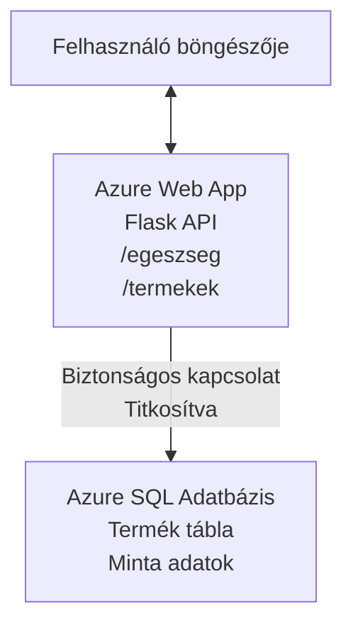

# Microsoft SQL adatbázis és webalkalmazás telepítése az AZD segítségével

⏱️ **Becsült idő**: 20-30 perc | 💰 **Becsült költség**: ~15-25 USD/hónap | ⭐ **Komplexitás**: Középhaladó

Ez a **teljes, működő példa** bemutatja, hogyan használható az [Azure Developer CLI (azd)](https://learn.microsoft.com/azure/developer/azure-developer-cli/) egy Python Flask webalkalmazás Microsoft SQL adatbázissal történő Azure-ba való telepítésére. Minden kód mellékelve van és tesztelve van—külső függőség nem szükséges.

## Amit megtanulsz

A példa végrehajtásával:
- Többrétegű alkalmazást telepítesz (webalkalmazás + adatbázis) infrastruktúra-kód segítségével
- Biztonságos adatbázis-kapcsolatokat konfigurálsz, titkok hardkódolása nélkül
- Alkalmazás egészségügyi állapotát figyeled az Application Insights használatával
- Hatékonyan kezeled az Azure erőforrásokat az AZD CLI-vel
- Követed az Azure legjobb gyakorlatait biztonság, költségoptimalizálás és megfigyelhetőség terén

## Forgatókönyv áttekintése
- **Webalkalmazás**: Python Flask REST API adatbázis-kapcsolattal
- **Adatbázis**: Azure SQL adatbázis mintaadatokkal
- **Infrastruktúra**: Bicep segítségével létrehozva (moduláris, újrahasznosítható sablonok)
- **Telepítés**: Teljesen automatizált az `azd` parancsokkal
- **Megfigyelés**: Application Insights naplózáshoz és telemetriához

## Előfeltételek

### Szükséges eszközök

Kezdés előtt ellenőrizd, hogy a következő eszközök telepítve vannak:

1. **[Azure CLI](https://learn.microsoft.com/cli/azure/install-azure-cli)** (2.50.0-s vagy újabb verzió)
   ```sh
   az --version
   # Várt kimenet: azure-cli 2.50.0 vagy újabb
   ```

2. **[Azure Developer CLI (azd)](https://learn.microsoft.com/azure/developer/azure-developer-cli/install-azd)** (1.0.0 vagy újabb verzió)
   ```sh
   azd version
   # Várt kimenet: azd verzió 1.0.0 vagy magasabb
   ```

3. **[Python 3.8+](https://www.python.org/downloads/)** (helyi fejlesztéshez)
   ```sh
   python --version
   # Várt kimenet: Python 3.8 vagy újabb
   ```

4. **[Docker](https://www.docker.com/get-started)** (opcionális, helyi konténer alapú fejlesztéshez)
   ```sh
   docker --version
   # Elvárt kimenet: Docker verzió 20.10 vagy újabb
   ```

### Azure követelmények

- Aktív **Azure előfizetés** ([ingyenes fiók létrehozása](https://azure.microsoft.com/free/))
- Jogosultság erőforrások létrehozására az előfizetés alatt
- **Tulajdonosi** vagy **Közreműködői** szerepkör az előfizetésben vagy erőforráscsoportban

### Tudás előfeltételek

Ez egy **középhaladó szintű** példa. Jó, ha ismered:
- Az alapvető parancssori műveleteket
- Alapvető felhő fogalmakat (erőforrások, erőforráscsoportok)
- Webalkalmazások és adatbázisok alapjait

**Új vagy az AZD-ben?** Kezdd a [Kezdő útmutatóval](../../docs/chapter-01-foundation/azd-basics.md).

## Architektúra

Ez a példa kétrétegű architektúrát telepít webalkalmazással és SQL adatbázissal:



**Erőforrás telepítés:**
- **Erőforráscsoport**: Minden erőforrás konténere
- **App Service terv**: Linux alapú hosztolás (B1 szint a költséghatékonyságért)
- **Webalkalmazás**: Python 3.11 runtime Flask alkalmazással
- **SQL szerver**: Felügyelt adatbázis szerver legalább TLS 1.2-vel
- **SQL adatbázis**: Alapszint (2GB, fejlesztéshez/testeléshez megfelelő)
- **Application Insights**: Megfigyelés és naplózás
- **Log Analytics munkaterület**: Központosított napló tárolás

**Hasonlat**: Ez olyan, mint egy étterem (webalkalmazás) egy ipari mélyhűtővel (adatbázis). A vendégek rendelnek a menüből (API végpontok), a konyha (Flask alkalmazás) pedig az alapanyagokat (adatokat) veszi elő a mélyhűtőből. Az étterem vezetője (Application Insights) mindent nyomon követ.

## Mappaszerkezet

Minden fájl benne van a példában—külső függőség nem szükséges:

```
examples/database-app/
│
├── README.md                    # This file
├── azure.yaml                   # AZD configuration file
├── .env.sample                  # Sample environment variables
├── .gitignore                   # Git ignore patterns
│
├── infra/                       # Infrastructure as Code (Bicep)
│   ├── main.bicep              # Main orchestration template
│   ├── abbreviations.json      # Azure naming conventions
│   └── resources/              # Modular resource templates
│       ├── sql-server.bicep    # SQL Server configuration
│       ├── sql-database.bicep  # Database configuration
│       ├── app-service-plan.bicep  # Hosting plan
│       ├── app-insights.bicep  # Monitoring setup
│       └── web-app.bicep       # Web application
│
└── src/
    └── web/                    # Application source code
        ├── app.py              # Flask REST API
        ├── requirements.txt    # Python dependencies
        └── Dockerfile          # Container definition
```

**Mit csinál az egyes fájl:**
- **azure.yaml**: Meghatározza az AZD-nek, mit és hova telepítsen
- **infra/main.bicep**: Összehangolja az összes Azure erőforrást
- **infra/resources/*.bicep**: Egyedi erőforrás definíciók (moduláris, újrahasznosítható)
- **src/web/app.py**: Flask alkalmazás adatbázis logikával
- **requirements.txt**: Python csomag függőségek
- **Dockerfile**: Konténerizációs utasítások telepítéshez

## Gyors kezdés (lépésről lépésre)

### 1. lépés: Klónozás és navigálás

```sh
git clone https://github.com/microsoft/AZD-for-beginners.git
cd AZD-for-beginners/examples/database-app
```

**✓ Sikertes ellenőrzés**: Ellenőrizd, hogy látod az `azure.yaml` fájlt és az `infra/` mappát:
```sh
ls
# Várt: README.md, azure.yaml, infra/, src/
```

### 2. lépés: Azure hitelesítés

```sh
azd auth login
```

Megnyílik a böngésző az Azure hitelesítéshez. Jelentkezz be Azure hitelesítő adataiddal.

**✓ Sikertes ellenőrzés**: Ennek kell látszania:
```
Logged in to Azure.
```

### 3. lépés: Környezet inicializálása

```sh
azd init
```

**Mi történik**: AZD létrehoz egy helyi konfigurációt a telepítéshez.

**A megjelenő kérdések**:
- **Környezet neve**: Adj meg egy rövid nevet (pl. `dev`, `myapp`)
- **Azure előfizetés**: Válaszd ki az előfizetésed a listából
- **Azure régió**: Válassz egy régiót (pl. `eastus`, `westeurope`)

**✓ Sikertes ellenőrzés**: Ennek kell látszania:
```
SUCCESS: New project initialized!
```

### 4. lépés: Azure erőforrások előállítása

```sh
azd provision
```

**Mi történik**: AZD telepíti az összes infrastruktúrát (5-8 perc):
1. Erőforráscsoport létrehozása
2. SQL szerver és adatbázis létrehozása
3. App Service terv létrehozása
4. Webalkalmazás létrehozása
5. Application Insights létrehozása
6. Hálózat és biztonság konfigurálása

**Kérni fogja tőled**:
- **SQL admin felhasználónév**: Adj meg egy felhasználónevet (pl. `sqladmin`)
- **SQL admin jelszó**: Adj meg egy erős jelszót (jegyezd meg!)

**✓ Sikertes ellenőrzés**: Ennek kell látszania:
```
SUCCESS: Your application was provisioned in Azure in X minutes Y seconds.
You can view the resources created under the resource group rg-<env-name> in Azure Portal:
https://portal.azure.com/#@/resource/subscriptions/.../resourceGroups/rg-<env-name>
```

**⏱️ Idő**: 5-8 perc

### 5. lépés: Alkalmazás telepítése

```sh
azd deploy
```

**Mi történik**: AZD építi és telepíti Flask alkalmazásod:
1. Csomagolja a Python alkalmazást
2. Felépíti a Docker konténert
3. Feltölti az Azure Web App-ba
4. Inicializálja az adatbázist minta adatokkal
5. Elindítja az alkalmazást

**✓ Sikertes ellenőrzés**: Ennek kell látszania:
```
SUCCESS: Your application was deployed to Azure in X minutes Y seconds.
You can view the resources created under the resource group rg-<env-name> in Azure Portal:
https://portal.azure.com/#@/resource/subscriptions/.../resourceGroups/rg-<env-name>
```

**⏱️ Idő**: 3-5 perc

### 6. lépés: Alkalmazás megnyitása böngészőben

```sh
azd browse
```

Megnyitja a telepített webalkalmazást böngészőben az `https://app-<unique-id>.azurewebsites.net` címen.

**✓ Sikertes ellenőrzés**: JSON kimenetet kell látnod:
```json
{
  "message": "Welcome to the Database App API",
  "endpoints": {
    "/": "This help message",
    "/health": "Health check endpoint",
    "/products": "List all products",
    "/products/<id>": "Get product by ID"
  }
}
```

### 7. lépés: API végpontok tesztelése

**Egészségügyi ellenőrzés** (ellenőrizd az adatbázis kapcsolatot):
```sh
curl https://app-<your-id>.azurewebsites.net/health
```

**Várt válasz**:
```json
{
  "status": "healthy",
  "database": "connected"
}
```

**Termékek listázása** (minta adat):
```sh
curl https://app-<your-id>.azurewebsites.net/products
```

**Várt válasz**:
```json
[
  {
    "id": 1,
    "name": "Laptop",
    "description": "High-performance laptop",
    "price": 1299.99,
    "created_at": "2025-11-19T10:30:00"
  },
  ...
]
```

**Egyetlen termék lekérése**:
```sh
curl https://app-<your-id>.azurewebsites.net/products/1
```

**✓ Sikertes ellenőrzés**: Minden végpont JSON adatot ad hiba nélkül.

---

**🎉 Gratulálunk!** Sikeresen telepítettél egy adatbázissal rendelkező webalkalmazást Azure-ba az AZD használatával.

## Konfiguráció mélyreható ismertetése

### Környezeti változók

A titkokat biztonságosan kezeli az Azure App Service konfiguráció—**soha nem hardkódoltak a forráskódban**.

**Az AZD automatikusan konfigurálja**:
- `SQL_CONNECTION_STRING`: Adatbázis kapcsolat titkosított hitelesítő adatokkal
- `APPLICATIONINSIGHTS_CONNECTION_STRING`: Megfigyelési telemetria végpont
- `SCM_DO_BUILD_DURING_DEPLOYMENT`: Automatikus függőség telepítés engedélyezése

**A titkok tárolása helye**:
1. az `azd provision` alatt megadod a SQL hitelesítő adatokat biztonságos kérdésekben
2. AZD ezeket helyben tárolja `.azure/<env-name>/.env` fájlban (a git figyelmen kívül hagyja)
3. AZD injektálja az Azure App Service konfigurációba (titkosítva tárolva)
4. Az alkalmazás futás időben `os.getenv()`-tel olvassa ki

### Helyi fejlesztés

Helyi teszthez hozz létre `.env` fájlt a mintából:

```sh
cp .env.sample .env
# Szerkessze a .env fájlt a helyi adatbázis-kapcsolathoz
```

**Helyi fejlesztési munkafolyamat**:
```sh
# Függőségek telepítése
cd src/web
pip install -r requirements.txt

# Környezeti változók beállítása
export SQL_CONNECTION_STRING="your-local-connection-string"

# Az alkalmazás futtatása
python app.py
```

**Tesztelj helyileg**:
```sh
curl http://localhost:8000/health
# Várható: {"status": "healthy", "database": "connected"}
```

### Infrastruktúra kód formájában

Az összes Azure erőforrás Bicep sablonokban van definiálva (`infra/` mappa):

- **Moduláris dizájn**: Minden erőforrástípusnak saját fájlja van az újrahasznosíthatóságért
- **Paraméterezett**: Testreszabható SKU-k, régiók, névkonvenciók
- **Legjobb gyakorlatok**: Követi az Azure névhasználati szabványokat és biztonsági alapbeállításokat
- **Verziókövetett**: Az infrastruktúra változásokat Git-ben követjük

**Testreszabási példa**:
Az adatbázis szintjének módosításához szerkeszd az `infra/resources/sql-database.bicep` fájlt:
```bicep
sku: {
  name: 'Standard'  // Changed from 'Basic'
  tier: 'Standard'
  capacity: 10
}
```

## Biztonsági legjobb gyakorlatok

Ez a példa követi az Azure biztonsági legjobb gyakorlatait:

### 1. **Nincsenek titkok a forráskódban**
- ✅ Hitelesítő adatok az Azure App Service konfigurációjában tárolva (titkosított)
- ✅ `.env` fájlok kizárva a Gitből `.gitignore`-ral
- ✅ Titkok biztonságos paramétereken keresztül kerülnek átadásra telepítéskor

### 2. **Titkosított kapcsolatok**
- ✅ TLS 1.2 minimum SQL szerverhez
- ✅ Csak HTTPS kényszerítve a Web App-on
- ✅ Adatbázis kapcsolatok titkosított csatornákon keresztül

### 3. **Hálózati biztonság**
- ✅ SQL szerver tűzfal beállítva, csak Azure szolgáltatások engedélyezve
- ✅ Nyilvános hálózati hozzáférés korlátozva (tovább zárolható privát végpontokkal)
- ✅ FTPS letiltva a Web App-on

### 4. **Hitelesítés és jogosultság**
- ⚠️ **Jelenleg**: SQL hitelesítés (felhasználónév/jelszó)
- ✅ **Éles használathoz ajánlott**: Azure Managed Identity jelszó nélküli hitelesítéshez

**Managed Identity-re váltás (éles környezethez)**:
1. Engedélyezd a menedzselt identitást a Web App-on
2. Adj engedélyt az identitásnak SQL-ben
3. Frissítsd a kapcsolódási stringet a managed identity használatára
4. Távolítsd el a jelszavas hitelesítést

### 5. **Auditing és megfelelőség**
- ✅ Application Insights naplózza a kéréseket és hibákat
- ✅ SQL adatbázis auditing engedélyezve (megfelelőséghez konfigurálható)
- ✅ Minden erőforrás címkézve kormányzás céljából

**Biztonsági ellenőrző lista éles előtt**:
- [ ] Engedélyezd az Azure Defender for SQL-t
- [ ] Konfiguráld a privát végpontokat az SQL adatbázishoz
- [ ] Engedélyezd a Web Application Firewall-t (WAF)
- [ ] Implementáld az Azure Key Vault titkok forgatását
- [ ] Konfiguráld a Microsoft Entra ID hitelesítést
- [ ] Engedélyezd a diagnosztikai naplózást minden erőforráshoz

## Költségoptimalizálás

**Becsült havi költségek** (2025 novemberi állapot szerint):

| Erőforrás | SKU/Szint | Becsült költség |
|----------|----------|----------------|
| App Service terv | B1 (Alap) | kb. 13 USD/hó |
| SQL adatbázis | Alap (2GB) | kb. 5 USD/hó |
| Application Insights | Fogyasztás alapú | kb. 2 USD/hó (alacsony forgalom) |
| **Összesen** | | **kb. 20 USD/hó** |

**💡 Költségcsökkentő tippek**:

1. **Ingyenes szint tanuláshoz**:
   - App Service: F1 szint (ingyenes, korlátozott óraszám)
   - SQL adatbázis: Azure SQL Database serverless használata
   - Application Insights: 5GB/hó ingyenes adatbevitel

2. **Állítsd le az erőforrásokat, ha nem használod**:
   ```sh
   # Állítsa le a webalkalmazást (az adatbázis továbbra is díjat számít fel)
   az webapp stop --name <app-name> --resource-group <rg-name>
   
   # Indítsa újra szükség esetén
   az webapp start --name <app-name> --resource-group <rg-name>
   ```

3. **Törölj mindent tesztelés után**:
   ```sh
   azd down
   ```
   Ez eltávolít mindent és megállítja a díjak felszámolását.

4. **Fejlesztési vs. éles SKU-k**:
   - **Fejlesztés**: Alapszint (ebben a példában használt)
   - **Éles**: Standard/Premium szint redundanciával

**Költségfigyelés**:
- Nézd meg a költségeket az [Azure Cost Management-ben](https://portal.azure.com/#view/Microsoft_Azure_CostManagement)
- Állíts be költségriasztásokat meglepetések elkerülésére
- Címkézd az összes erőforrást `azd-env-name` címkével az azonosításhoz

**Ingyenes szint alternatíva**:
Tanuláshoz módosíthatod az `infra/resources/app-service-plan.bicep` fájlt:
```bicep
sku: {
  name: 'F1'  // Free tier
  tier: 'Free'
}
```
**Megjegyzés**: Az ingyenes szint korlátozásokkal jár (60 perc/nap CPU, nincs mindig futás).

## Megfigyelés és megfigyelhetőség

### Application Insights integráció

Ez a példa tartalmaz **Application Insights**-t átfogó megfigyeléshez:

**Mi kerül megfigyelésre**:
- ✅ HTTP kérések (késleltetés, státuszkódok, végpontok)
- ✅ Alkalmazás hibák és kivételek
- ✅ Egyéni naplózás Flask alkalmazásból
- ✅ Adatbázis kapcsolat egészsége
- ✅ Teljesítmény mutatók (CPU, memória)

**Hozzáférés az Application Insights-hoz**:
1. Nyisd meg az [Azure Portal](https://portal.azure.com)-t
2. Navigálj az erőforráscsoportodhoz (`rg-<env-name>`)
3. Kattints az Application Insights erőforrásra (`appi-<unique-id>`)

**Hasznos lekérdezések** (Application Insights → Naplók):

**Összes kérés megtekintése**:
```kusto
requests
| where timestamp > ago(1h)
| order by timestamp desc
| project timestamp, name, url, resultCode, duration
```

**Hibák keresése**:
```kusto
exceptions
| where timestamp > ago(24h)
| order by timestamp desc
| project timestamp, type, outerMessage, operation_Name
```

**Egészségügyi végpont ellenőrzése**:
```kusto
requests
| where name contains "health"
| summarize count() by resultCode, bin(timestamp, 1h)
```

### SQL adatbázis audit naplózás

**SQL adatbázis audit naplózás engedélyezve** a következők nyomon követésére:
- Adatbázis hozzáférések mintái
- Sikertelen bejelentkezések
- Sémaváltozások
- Adathozzáférés (megfelelőség érdekében)

**Audit naplók megtekintése**:
1. Azure Portal → SQL adatbázis → Auditálás
2. Naplók megtekintése a Log Analytics munkaterületen

### Valós idejű megfigyelés

**Élő metrikák megtekintése**:
1. Application Insights → Élő metrikák
2. Kérések, sikertelenségek és teljesítmény valós időben látható

**Riasztások beállítása**:
Kritikus eseményekhez hozz létre riasztásokat:
- HTTP 500 hiba > 5 db 5 perc alatt
- Adatbázis kapcsolat hibák
- Magas válaszidő (>2 másodperc)

**Riasztás létrehozásának példája**:
```sh
az monitor metrics alert create \
  --name "High-Response-Time" \
  --resource-group <rg-name> \
  --scopes <app-insights-resource-id> \
  --condition "avg requests/duration > 2000" \
  --description "Alert when response time exceeds 2 seconds"
```

## Hibakeresés
### Gyakori problémák és megoldások

#### 1. `azd provision` hibája: "Location not available"

**Tünet**:
```
Error: The subscription is not registered for the resource type 'components' in the location 'centralus'.
```

**Megoldás**:
Válassz másik Azure régiót vagy regisztráld az erőforrás-szolgáltatót:
```sh
az provider register --namespace Microsoft.Insights
```

#### 2. SQL Kapcsolat Hiba Telepítés Közben

**Tünet**:
```
pyodbc.OperationalError: ('08001', '[08001] [Microsoft][ODBC Driver 18 for SQL Server]TCP Provider...')
```

**Megoldás**:
- Ellenőrizd, hogy az SQL Server tűzfala engedélyezi az Azure szolgáltatásokat (automatikusan beállítva)
- Ellenőrizd, hogy az SQL admin jelszót helyesen adtad meg az `azd provision` során
- Győződj meg arról, hogy az SQL Server teljesen elő van készítve (2-3 percet vehet igénybe)

**Kapcsolat ellenőrzése**:
```sh
# Az Azure Portálon navigáljon a SQL Adatbázishoz → Lekérdező szerkesztő
# Próbáljon meg csatlakozni a hitelesítő adataival
```

#### 3. Webalkalmazás "Application Error" Hibaüzenetet Mutat

**Tünet**:
A böngésző általános hibaoldalt jelenít meg.

**Megoldás**:
Ellenőrizd az alkalmazás naplóit:
```sh
# Legutóbbi naplók megtekintése
az webapp log tail --name <app-name> --resource-group <rg-name>
```

**Gyakori okok**:
- Hiányzó környezeti változók (ellenőrizd az App Service → Konfiguráció részt)
- A Python csomag telepítése sikertelen (ellenőrizd a telepítési naplókat)
- Adatbázis inicializációs hiba (ellenőrizd az SQL kapcsolatot)

#### 4. `azd deploy` hibája: "Build Error"

**Tünet**:
```
Error: Failed to build project
```

**Megoldás**:
- Győződj meg róla, hogy a `requirements.txt` nem tartalmaz szintaktikai hibát
- Ellenőrizd, hogy a Python 3.11 szerepel az `infra/resources/web-app.bicep` fájlban
- Ellenőrizd a Dockerfile helyes alapképet

**Helyi hibakeresés**:
```sh
cd src/web
docker build -t test-app .
docker run -p 8000:8000 test-app
```

#### 5. "Unauthorized" Hiba AZD Parancsok Futtatásakor

**Tünet**:
```
ERROR: (Unauthorized) The client '<id>' with object id '<id>' does not have authorization
```

**Megoldás**:
Jelentkezz be újra az Azure-ba:
```sh
# Szükséges az AZD munkafolyamatokhoz
azd auth login

# Opcionális, ha közvetlenül az Azure CLI parancsokat is használja
az login
```

Ellenőrizd, hogy a megfelelő jogosultságokkal rendelkezel (Contributor szerepkör) az előfizetésen.

#### 6. Magas Adatbázis Költségek

**Tünet**:
Váratlan Azure számla.

**Megoldás**:
- Ellenőrizd, hogy nem felejtetted-e el futtatni az `azd down` parancsot tesztelés után
- Győződj meg arról, hogy az SQL adatbázis Basic szintet használ (nem Premium)
- Nézd át a költségeket az Azure Cost Management-ben
- Állíts be költségriasztásokat

### Segítségkérés

**Az összes AZD környezeti változó megtekintése**:
```sh
azd env get-values
```

**Telepítés állapotának ellenőrzése**:
```sh
az webapp show --name <app-name> --resource-group <rg-name> --query state
```

**Alkalmazás naplók elérése**:
```sh
az webapp log download --name <app-name> --resource-group <rg-name> --log-file app-logs.zip
```

**További segítség kell?**
- [AZD Hibakeresési Útmutató](../../docs/chapter-07-troubleshooting/common-issues.md)
- [Azure App Service Hibakeresés](https://learn.microsoft.com/azure/app-service/troubleshoot-diagnostic-logs)
- [Azure SQL Hibakeresés](https://learn.microsoft.com/azure/azure-sql/database/troubleshoot-common-errors-issues)

## Gyakorlati Feladatok

### 1. gyakorlat: Telepítés ellenőrzése (Kezdő)

**Cél**: Ellenőrizd, hogy minden erőforrás telepítve van és az alkalmazás működik.

**Lépések**:
1. Listázd az összes erőforrást az erőforráscsoportodban:
   ```sh
   az resource list --resource-group rg-<env-name> --output table
   ```
   **Várható**: 6-7 erőforrás (Web App, SQL Server, SQL Adatbázis, App Service Plan, Application Insights, Log Analytics)

2. Teszteld az összes API végpontot:
   ```sh
   curl https://app-<your-id>.azurewebsites.net/
   curl https://app-<your-id>.azurewebsites.net/health
   curl https://app-<your-id>.azurewebsites.net/products
   curl https://app-<your-id>.azurewebsites.net/products/1
   ```
   **Várható**: Mindegyik érvényes JSON-t ad vissza, hiba nélkül

3. Ellenőrizd az Application Insightset:
   - Nyisd meg az Application Insights-t az Azure portálon
   - Menj a "Live Metrics" részhez
   - Frissítsd a böngészőt a webalkalmazásnál
   **Várható**: Azonnal megjelenő kérések

**Siker kritériumai**: Mind a 6-7 erőforrás létezik, az összes végpont adatot ad vissza, a Live Metrics aktivitást mutat.

---

### 2. gyakorlat: Új API végpont hozzáadása (Középhaladó)

**Cél**: Bővítsd a Flask alkalmazást egy új végponttal.

**Kezdő kód**: Jelenlegi végpontok a `src/web/app.py` fájlban

**Lépések**:
1. Szerkeszd a `src/web/app.py` fájlt, és adj hozzá egy új végpontot a `get_product()` függvény után:
   ```python
   @app.route('/products/search/<keyword>')
   def search_products(keyword):
       """Search products by name or description."""
       try:
           conn = get_db_connection()
           cursor = conn.cursor()
           cursor.execute(
               "SELECT id, name, description, price, created_at FROM products WHERE name LIKE ? OR description LIKE ?",
               (f'%{keyword}%', f'%{keyword}%')
           )
           
           products = []
           for row in cursor.fetchall():
               products.append({
                   'id': row[0],
                   'name': row[1],
                   'description': row[2],
                   'price': float(row[3]) if row[3] else None,
                   'created_at': row[4].isoformat() if row[4] else None
               })
           
           cursor.close()
           conn.close()
           
           logger.info(f"Search for '{keyword}' returned {len(products)} results")
           return jsonify(products), 200
           
       except Exception as e:
           logger.error(f"Error searching products: {str(e)}")
           return jsonify({'error': str(e)}), 500
   ```

2. Telepítsd az alkalmazás frissített verzióját:
   ```sh
   azd deploy
   ```

3. Teszteld az új végpontot:
   ```sh
   curl https://app-<your-id>.azurewebsites.net/products/search/laptop
   ```
   **Várható**: Visszaadja a "laptop" kulcsszóra illeszkedő termékeket

**Siker kritériumai**: Az új végpont működik, szűrt eredményeket ad, megjelenik az Application Insights naplókban.

---

### 3. gyakorlat: Monitoring és Riasztások Beállítása (Haladó)

**Cél**: Állíts be proaktív monitorozást és riasztásokat.

**Lépések**:
1. Hozz létre riasztást HTTP 500-as hibákra:
   ```sh
   # Alkalmazás Insights erőforrásazonosító lekérése
   AI_ID=$(az monitor app-insights component show \
     --app appi-<your-id> \
     --resource-group rg-<env-name> \
     --query id -o tsv)
   
   # Riasztás létrehozása
   az monitor metrics alert create \
     --name "High-Error-Rate" \
     --resource-group rg-<env-name> \
     --scopes $AI_ID \
     --condition "count requests/failed > 5" \
     --window-size 5m \
     --evaluation-frequency 1m \
     --description "Alert when >5 failed requests in 5 minutes"
   ```

2. Indítsd el a riasztást hibák okozásával:
   ```sh
   # Nem létező termék lekérése
   for i in {1..10}; do curl https://app-<your-id>.azurewebsites.net/products/999; done
   ```

3. Ellenőrizd, hogy a riasztás elindult-e:
   - Azure Portal → Riasztások → Riasztási szabályok
   - Ellenőrizd az emailed (ha beállítottad)

**Siker kritériumai**: Létrejött a riasztási szabály, hibák esetén aktiválódik, értesítéseket kapni.

---

### 4. gyakorlat: Adatbázis sémaváltoztatások (Haladó)

**Cél**: Adj hozzá új táblát és módosítsd az alkalmazást, hogy használja azt.

**Lépések**:
1. Csatlakozz az SQL adatbázishoz az Azure Portal Query Editor-ján keresztül

2. Hozz létre egy új `categories` táblát:
   ```sql
   CREATE TABLE categories (
       id INT PRIMARY KEY IDENTITY(1,1),
       name NVARCHAR(50) NOT NULL,
       description NVARCHAR(200)
   );
   
   INSERT INTO categories (name, description) VALUES
   ('Electronics', 'Electronic devices and accessories'),
   ('Office Supplies', 'Office equipment and supplies');
   
   -- Add category to products table
   ALTER TABLE products ADD category_id INT;
   UPDATE products SET category_id = 1; -- Set all to Electronics
   ```

3. Frissítsd a `src/web/app.py` fájlt, hogy bevonja a kategória információkat a válaszokba

4. Telepítsd és teszteld az alkalmazást

**Siker kritériumai**: Az új tábla létezik, a termékek megjelenítik a kategória információkat, az alkalmazás továbbra is működik.

---

### 5. gyakorlat: Gyorsítótárazás megvalósítása (Szakértő)

**Cél**: Adj Azure Redis Cache-t a teljesítmény javításához.

**Lépések**:
1. Add hozzá a Redis Cache-t az `infra/main.bicep` fájlhoz
2. Frissítsd a `src/web/app.py`-t a termék lekérdezések gyorsítótárazásához
3. Mérd meg a teljesítmény javulást az Application Insights segítségével
4. Hasonlítsd össze a válaszidőket gyorsítótárazás előtt és után

**Siker kritériumai**: Redis telepítve van, a gyorsítótárazás működik, a válaszidők >50%-kal javulnak.

**Tipp**: Kezdd az [Azure Cache for Redis dokumentációjával](https://learn.microsoft.com/azure/azure-cache-for-redis/).

---

## Takarítás

A folyamatos díjak elkerülése érdekében törölj minden erőforrást, ha végeztél:

```sh
azd down
```

**Megerősítő kérés**:
```
? Total resources to delete: 7, are you sure you want to continue? (y/N)
```

Írd be a `y` betűt a megerősítéshez.

**✓ Siker Ellenőrzése**: 
- Minden erőforrás törölve van az Azure Portálról
- Nincsenek további díjak
- A helyi `.azure/<env-name>` mappa törölhető

**Alternatíva** (infrastruktúra megtartása, adat törlése):
```sh
# Csak az erőforráscsoport törlése (AZD konfiguráció megtartása)
az group delete --name rg-<env-name> --yes
```
## További Információk

### Kapcsolódó dokumentáció
- [Azure Developer CLI dokumentáció](https://learn.microsoft.com/azure/developer/azure-developer-cli/)
- [Azure SQL Database dokumentáció](https://learn.microsoft.com/azure/azure-sql/database/)
- [Azure App Service dokumentáció](https://learn.microsoft.com/azure/app-service/)
- [Application Insights dokumentáció](https://learn.microsoft.com/azure/azure-monitor/app/app-insights-overview)
- [Bicep nyelvi referencia](https://learn.microsoft.com/azure/azure-resource-manager/bicep/)

### A tanfolyam következő lépései
- **[Container Apps példa](../../../../examples/container-app)**: Mikroservice-ek telepítése Azure Container Appsszel
- **[AI integráció útmutató](../../../../docs/ai-foundry)**: AI képességek hozzáadása az alkalmazáshoz
- **[Telepítési bevált gyakorlatok](../../docs/chapter-04-infrastructure/deployment-guide.md)**: Gyártási telepítési minták

### Haladó témák
- **Managed Identity**: Jelszavak eltávolítása és Microsoft Entra ID hitelesítés használata
- **Private Endpoints**: Biztonságos adatbázis kapcsolat privát hálózaton belül
- **CI/CD integráció**: Telepítések automatizálása GitHub Actions vagy Azure DevOps segítségével
- **Több környezet**: Fejlesztői, tesztelői és gyártási környezetek létrehozása
- **Adatbázis migrációk**: Alembic vagy Entity Framework használata séma verziókövetéshez

### Összehasonlítás más megközelítésekkel

**AZD vs ARM sablonok**:
- ✅ AZD: Magasabb szintű absztrakció, egyszerűbb parancsok
- ⚠️ ARM: Részletesebb, aprólékosabb vezérlés

**AZD vs Terraform**:
- ✅ AZD: Azure-natív, integrált Azure szolgáltatásokkal
- ⚠️ Terraform: Többfelhős támogatás, nagyobb ökoszisztéma

**AZD vs Azure Portal**:
- ✅ AZD: Ismételhető, verziókövetett, automatizálható
- ⚠️ Portal: Kézi kattintás, nehéz reprodukálni

**Gondolj az AZD-re úgy, mint**: Docker Compose az Azure számára — egyszerűsített konfiguráció komplex telepítésekhez.

---

## Gyakran Ismételt Kérdések

**K: Használhatok más programozási nyelvet?**  
V: Igen! Cseréld le a `src/web/` mappát Node.js-re, C#-ra, Go-ra vagy bármely más nyelvre. Frissítsd az `azure.yaml`-t és a Bicep fájlokat ennek megfelelően.

**K: Hogyan adhatok hozzá több adatbázist?**  
V: Adj hozzá egy másik SQL adatbázis modult az `infra/main.bicep`-ben, vagy használj PostgreSQL/MariaDB-t az Azure adatbázis szolgáltatásaiból.

**K: Használhatom ezt éles környezetben?**  
V: Ez egy kiindulópont. Éles környezethez adj hozzá: managed identity-t, privát végpontokat, redundanciát, mentési stratégiát, WAF-ot és fejlett monitorozást.

**K: Mi van, ha tárolókban akarom futtatni a kód helyett?**  
V: Nézd meg a [Container Apps példát](../../../../examples/container-app), amely egész alkalmazásokat Docker konténerekben futtat.

**K: Hogyan kapcsolódom az adatbázishoz a gépemről?**  
V: Add hozzá az IP címed az SQL Server tűzfal szabályaihoz:
```sh
az sql server firewall-rule create \
  --resource-group rg-<env-name> \
  --server sql-<unique-id> \
  --name AllowMyIP \
  --start-ip-address <your-ip> \
  --end-ip-address <your-ip>
```

**K: Használhatom egy meglévő adatbázist az újak helyett?**  
V: Igen, módosítsd az `infra/main.bicep`-t, hogy egy meglévő SQL Serverre mutasson, és frissítsd a kapcsolódási string paramétereket.

---

> **Megjegyzés:** Ez a példa bemutatja az AZD legjobb gyakorlatait egy webalkalmazás adatbázissal való telepítéséhez. Tartalmaz működő kódot, átfogó dokumentációt, és gyakorlati feladatokat a tanulás megerősítésére. Éles telepítéshez vizsgáld felül a biztonsági, skálázási, megfelelőségi és költségszempontokat, amelyeket a szervezeted igényei szabnak meg.

**📚 Tanfolyam navigáció:**
- ← Előző: [Container Apps példa](../../../../examples/container-app)
- → Következő: [AI integráció útmutató](../../../../docs/ai-foundry)
- 🏠 [Tanfolyam kezdőlap](../../README.md)

---

<!-- CO-OP TRANSLATOR DISCLAIMER START -->
**Jogi nyilatkozat**:
Ez a dokumentum az AI fordítási szolgáltatás, a [Co-op Translator](https://github.com/Azure/co-op-translator) segítségével készült. Bár az pontosságra törekszünk, kérjük, vegye figyelembe, hogy az automatikus fordítások hibákat vagy pontatlanságokat tartalmazhatnak. Az eredeti dokumentum az anyanyelvén tekintendő hiteles forrásnak. Fontos információk esetén professzionális emberi fordítást javasolunk. Nem vállalunk felelősséget semmilyen félreértésért vagy téves értelmezésért, amely ebből a fordításból ered.
<!-- CO-OP TRANSLATOR DISCLAIMER END -->