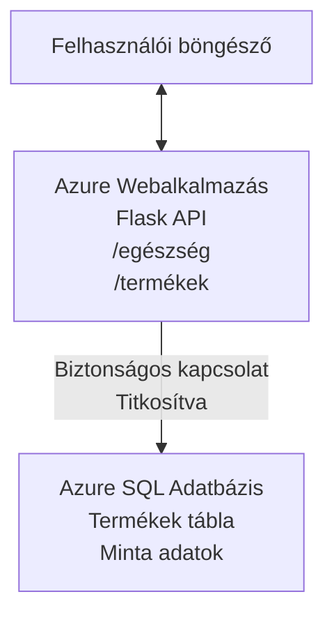

# Microsoft SQL adatbázis és webalkalmazás telepítése az AZD-vel

⏱️ **Becsült idő**: 20-30 perc | 💰 **Becsült költség**: kb. 15-25 $/hónap | ⭐ **Bonyolultság**: Középhaladó

Ez a **teljes, működő példa** bemutatja, hogyan lehet az [Azure Developer CLI (azd)](https://learn.microsoft.com/azure/developer/azure-developer-cli/) eszközt használni egy Python Flask webalkalmazás Microsoft SQL adatbázissal Azure-ra történő telepítéséhez. Minden kódot tartalmaz és tesztelt – nincs szükség külső függőségekre.

## Amit megtanulhatsz

A példa végrehajtásával:
- Telepítesz egy többrétegű alkalmazást (webalkalmazás + adatbázis) infrastruktúraként-kód segítségével
- Biztonságos adatbáziskapcsolatot konfigurálsz titkok keménykódolása nélkül
- Az Application Insights segítségével figyeled az alkalmazás állapotát
- Hatékonyan kezeled az Azure erőforrásokat az AZD CLI-vel
- Követed az Azure biztonsági, költséghatékonysági és megfigyelhetőségi legjobb gyakorlatait

## Forgatókönyv áttekintés
- **Webalkalmazás**: Python Flask REST API adatbázis-kapcsolattal
- **Adatbázis**: Azure SQL adatbázis mintaadatokkal
- **Infrastruktúra**: Bicep segítségével kialakítva (moduláris, újrahasználható sablonok)
- **Telepítés**: Teljesen automatizált `azd` parancsokkal
- **Figyelés**: Application Insights naplózáshoz és telemetriához

## Előfeltételek

### Szükséges eszközök

Kezdés előtt győződj meg róla, hogy ezek az eszközök telepítve vannak:

1. **[Azure CLI](https://learn.microsoft.com/cli/azure/install-azure-cli)** (2.50.0 vagy újabb verzió)
   ```sh
   az --version
   # Várt kimenet: azure-cli 2.50.0 vagy újabb
   ```

2. **[Azure Developer CLI (azd)](https://learn.microsoft.com/azure/developer/azure-developer-cli/install-azd)** (1.0.0 vagy újabb verzió)
   ```sh
   azd version
   # Várt kimenet: azd verzió 1.0.0 vagy magasabb
   ```

3. **[Python 3.8+](https://www.python.org/downloads/)** (helyi fejlesztéshez)
   ```sh
   python --version
   # Várt kimenet: Python 3.8 vagy újabb
   ```

4. **[Docker](https://www.docker.com/get-started)** (opcionális, helyi konténeres fejlesztéshez)
   ```sh
   docker --version
   # Várt kimenet: Docker verzió 20.10 vagy újabb
   ```

### Azure követelmények

- Aktív **Azure előfizetés** ([ingyenes fiók létrehozása](https://azure.microsoft.com/free/))
- Jogosultság az erőforrások létrehozására az előfizetésben
- **Tulajdonos** vagy **Hozzáférő** szerep az előfizetésen vagy erőforráscsoporton belül

### Előzetes tudás

Ez egy **középhaladó** példa. Ismerned kell:
- Alapvető parancssori műveleteket
- Alapfelhő fogalmakat (erőforrások, erőforráscsoportok)
- Az alap webalkalmazások és adatbázisok működését

**Új vagy az AZD-ben?** Először nézd meg a [Bevezető útmutatót](../../docs/chapter-01-foundation/azd-basics.md).

## Architektúra

Ez a példa egy kétrétegű architektúrát telepít webalkalmazással és SQL adatbázissal:


**Erőforrások telepítése:**
- **Erőforráscsoport**: Minden erőforrás konténere
- **App Service terv**: Linux alapú hosztolás (B1 szint a költséghatékonyságért)
- **Webalkalmazás**: Python 3.11 futtatókörnyezet Flask alkalmazással
- **SQL szerver**: Kezelt adatbázis szerver TLS 1.2 minimummal
- **SQL adatbázis**: Basic szint (2GB, fejlesztéshez/teszteléshez megfelelő)
- **Application Insights**: Monitorozás és naplózás
- **Log Analytics munkaterület**: Centralizált napló tárolás

**Hasonlat**: Gondolj erre úgy, mint egy étteremre (webalkalmazás), aminek van egy walk-in fagyasztója (adatbázis). A vendégek a menüből rendelnek (API végpontok), a konyha (Flask app) pedig a fagyasztóból veszi az alapanyagokat (adatokat). Az étteremvezető (Application Insights) mindent nyomon követ.

## Mappa struktúra

Minden fájl benne van ebben a példában – nincs szükség külső függőségekre:

```
examples/database-app/
│
├── README.md                    # This file
├── azure.yaml                   # AZD configuration file
├── .env.sample                  # Sample environment variables
├── .gitignore                   # Git ignore patterns
│
├── infra/                       # Infrastructure as Code (Bicep)
│   ├── main.bicep              # Main orchestration template
│   ├── abbreviations.json      # Azure naming conventions
│   └── resources/              # Modular resource templates
│       ├── sql-server.bicep    # SQL Server configuration
│       ├── sql-database.bicep  # Database configuration
│       ├── app-service-plan.bicep  # Hosting plan
│       ├── app-insights.bicep  # Monitoring setup
│       └── web-app.bicep       # Web application
│
└── src/
    └── web/                    # Application source code
        ├── app.py              # Flask REST API
        ├── requirements.txt    # Python dependencies
        └── Dockerfile          # Container definition
```

**Mire jó az egyes fájl:**
- **azure.yaml**: Megmondja az AZD-nek, mit és hova telepítsen
- **infra/main.bicep**: Együtt irányít minden Azure erőforrást
- **infra/resources/*.bicep**: Egyedi erőforrásdefiníciók (újrahasználható modulok)
- **src/web/app.py**: Flask alkalmazás adatbázis logikával
- **requirements.txt**: Python csomag függőségek
- **Dockerfile**: Konténerizációs utasítások telepítéshez

## Gyors kezdés (lépésről lépésre)

### 1. lépés: Klónozás és navigálás

```sh
git clone https://github.com/microsoft/AZD-for-beginners.git
cd AZD-for-beginners/examples/database-app
```

**✓ Ellenőrzés**: Győződj meg róla, hogy látod az `azure.yaml` fájlt és az `infra/` mappát:
```sh
ls
# Várt: README.md, azure.yaml, infra/, src/
```

### 2. lépés: Azure-ba történő hitelesítés

```sh
azd auth login
```

Megnyitja a böngészőt az Azure hitelesítéshez. Jelentkezz be az Azure fiókoddal.

**✓ Ellenőrzés**: Látnod kell:
```
Logged in to Azure.
```

### 3. lépés: Környezet inicializálása

```sh
azd init
```

**Mi történik**: AZD létrehoz egy helyi konfigurációt a telepítéshez.

**Kérdések**:
- **Környezet neve**: Adj meg egy rövid nevet (pl. `dev`, `myapp`)
- **Azure előfizetés**: Válassz az előfizetéseid közül
- **Azure régió**: Válassz régiót (pl. `eastus`, `westeurope`)

**✓ Ellenőrzés**: Látnod kell:
```
SUCCESS: New project initialized!
```

### 4. lépés: Azure erőforrások létrehozása

```sh
azd provision
```

**Mi történik**: AZD telepíti az egész infrastruktúrát (5-8 perc):
1. Létrehozza az erőforráscsoportot
2. Létrehozza az SQL szervert és adatbázist
3. Létrehozza az App Service tervet
4. Létrehozza a webalkalmazást
5. Létrehozza az Application Insights-ot
6. Konfigurálja a hálózatot és a biztonságot

**Kérdések, amikre válaszolnod kell**:
- **SQL admin felhasználónév**: Add meg a felhasználónevet (pl. `sqladmin`)
- **SQL admin jelszó**: Adj meg egy erős jelszót (mentsd el!)

**✓ Ellenőrzés**: Látnod kell:
```
SUCCESS: Your application was provisioned in Azure in X minutes Y seconds.
You can view the resources created under the resource group rg-<env-name> in Azure Portal:
https://portal.azure.com/#@/resource/subscriptions/.../resourceGroups/rg-<env-name>
```

**⏱️ Idő**: 5-8 perc

### 5. lépés: Az alkalmazás telepítése

```sh
azd deploy
```

**Mi történik**: AZD felépíti és telepíti a Flask alkalmazást:
1. Csomagolja a Python alkalmazást
2. Felépíti a Docker konténert
3. Feltölti az Azure Web App-be
4. Inicializálja az adatbázist mintaadatokkal
5. Elindítja az alkalmazást

**✓ Ellenőrzés**: Látnod kell:
```
SUCCESS: Your application was deployed to Azure in X minutes Y seconds.
You can view the resources created under the resource group rg-<env-name> in Azure Portal:
https://portal.azure.com/#@/resource/subscriptions/.../resourceGroups/rg-<env-name>
```

**⏱️ Idő**: 3-5 perc

### 6. lépés: Az alkalmazás böngészőben történő megnyitása

```sh
azd browse
```

Megnyitja a telepített webalkalmazást a böngésződben `https://app-<unique-id>.azurewebsites.net` címen.

**✓ Ellenőrzés**: JSON adatot kell látnod:
```json
{
  "message": "Welcome to the Database App API",
  "endpoints": {
    "/": "This help message",
    "/health": "Health check endpoint",
    "/products": "List all products",
    "/products/<id>": "Get product by ID"
  }
}
```

### 7. lépés: API végpontok tesztelése

**Állapot ellenőrzés** (adatbáziskapcsolat tesztelése):
```sh
curl https://app-<your-id>.azurewebsites.net/health
```

**Várt válasz**:
```json
{
  "status": "healthy",
  "database": "connected"
}
```

**Terméklista lekérdezése** (mintaadat):
```sh
curl https://app-<your-id>.azurewebsites.net/products
```

**Várt válasz**:
```json
[
  {
    "id": 1,
    "name": "Laptop",
    "description": "High-performance laptop",
    "price": 1299.99,
    "created_at": "2025-11-19T10:30:00"
  },
  ...
]
```

**Egy termék lekérése**:
```sh
curl https://app-<your-id>.azurewebsites.net/products/1
```

**✓ Ellenőrzés**: Minden végpont JSON adatot ad hiba nélkül.

---

**🎉 Gratulálunk!** Sikeresen telepítettél egy webalkalmazást adatbázissal Azure-ra az AZD segítségével.

## Konfiguráció mélyreható ismertetése

### Környezeti változók

A titkokat biztonságosan az Azure App Service konfiguráción keresztül kezeljük – **soha nem keménykódoljuk a forráskódban**.

**AZD automatikusan beállítja**:
- `SQL_CONNECTION_STRING`: Adatbáziskapcsolat titkosított hitelesítő adatokkal
- `APPLICATIONINSIGHTS_CONNECTION_STRING`: Monitorozási telemetria végpont
- `SCM_DO_BUILD_DURING_DEPLOYMENT`: Automatikus függőség telepítést engedélyezi

**Hol tárolódnak a titkok**:
1. Az `azd provision` során adod meg az SQL hitelesítő adatokat biztonságos kérésekben
2. AZD eltárolja ezeket a helyi `.azure/<env-name>/.env` fájlban (git által figyelmen kívül hagyva)
3. AZD beilleszti az adatokat az Azure App Service konfigurációba (titkosítva tárolva)
4. Az alkalmazás az `os.getenv()` segítségével olvassa be futásidőben

### Helyi fejlesztés

Helyi teszteléshez készíts `.env` fájlt a mintából:

```sh
cp .env.sample .env
# Szerkessze a .env fájlt a helyi adatbázis-kapcsolatával
```

**Helyi fejlesztési munkafolyamat**:
```sh
# Futtassa a függőségek telepítését
cd src/web
pip install -r requirements.txt

# Állítsa be a környezeti változókat
export SQL_CONNECTION_STRING="your-local-connection-string"

# Indítsa el az alkalmazást
python app.py
```

**Helyi tesztelés**:
```sh
curl http://localhost:8000/health
# Várt: {"status": "healthy", "database": "connected"}
```

### Infrastruktúra mint kód

Minden Azure erőforrás **Bicep sablonokban** van definiálva (`infra/` mappa):

- **Moduláris felépítés**: minden erőforrástípus külön fájlban az újrafelhasználhatóságért
- **Paraméterezhető**: testreszabható a SKU, régiók, névkonvenciók
- **Legjobb gyakorlatoknak megfelelő**: Azure névadási szabványok és biztonsági alapbeállítások
- **Verziókövetett**: infrastruktúra változásait Git kezeli

**Testreszabási példa**:
Az adatbázis szintjének megváltoztatásához szerkeszd az `infra/resources/sql-database.bicep` fájlt:
```bicep
sku: {
  name: 'Standard'  // Changed from 'Basic'
  tier: 'Standard'
  capacity: 10
}
```

## Biztonsági legjobb gyakorlatok

Ez a példa követi az Azure biztonsági legjobb gyakorlatait:

### 1. **Nincsenek titkok a forráskódban**
- ✅ Hitelesítő adatok az Azure App Service konfigurációban vannak tárolva (titkosítva)
- ✅ `.env` fájlok kizárva a Git-től `.gitignore`-ral
- ✅ Titkok biztonságos paramétereken keresztül kerülnek beállításra telepítés során

### 2. **Titkosított kapcsolatok**
- ✅ TLS 1.2 minimum az SQL szerveren
- ✅ HTTPS-only kötelező a Webalkalmazásnál
- ✅ Adatbáziskapcsolatok titkosított csatornán mennek keresztül

### 3. **Hálózati biztonság**
- ✅ SQL szerver tűzfal csak az Azure szolgáltatások számára engedélyezett
- ✅ Nyilvános hálózati hozzáférés korlátozott (további zárolás Privát végpontokkal)
- ✅ FTPS letiltva Web App-en

### 4. **Hitelesítés és jogosultságok**
- ⚠️ **Jelenlegi**: SQL hitelesítés (felhasználónév/jelszó)
- ✅ **Javaslat éles környezetre**: Azure Managed Identity jelszó nélküli hitelesítéshez

**Managed Identity-re váltás lépései** (éles környezet esetén):
1. Engedélyezd a kezelt identitást Web App-en
2. Add meg az identitás SQL jogosultságait
3. Frissítsd a kapcsolati stringet managed identity használatára
4. Távolítsd el a jelszavas hitelesítést

### 5. **Auditálás és megfelelőség**
- ✅ Az Application Insights naplózza az összes kérést és hibát
- ✅ SQL adatbázis auditálás engedélyezve (állítható megfelelőséghez)
- ✅ Minden erőforrás címkézve van a kormányzás érdekében

**Biztonsági ellenőrzőlista éles üzem előtt**:
- [ ] Engedélyezd az Azure Defender az SQL-hez
- [ ] Konfiguráld a Privát végpontokat SQL adatbázishoz
- [ ] Engedélyezd a Webalkalmazás tűzfalat (WAF)
- [ ] Implementáld az Azure Key Vault-ot titok forgatáshoz
- [ ] Állítsd be az Azure AD hitelesítést
- [ ] Kapcsold be az diagnosztikai naplózást minden erőforráshoz

## Költséghatékonyság

**Becsült havi költségek** (2025 november):

| Erőforrás | SKU/Szint | Becsült költség |
|----------|----------|----------------|
| App Service terv | B1 (alap) | kb. 13 $/hó |
| SQL adatbázis | Basic (2GB) | kb. 5 $/hó |
| Application Insights | Fogyasztás alapú | kb. 2 $/hó (alacsony forgalom) |
| **Összesen** | | **kb. 20 $/hó** |

**💡 Költségcsökkentési tippek**:

1. **Használd az ingyenes szintet tanuláshoz**:
   - App Service: F1 szint (ingyenes, korlátozott óraszám)
   - SQL adatbázis: Azure SQL Database szerver nélküli opció
   - Application Insights: 5 GB/hónap ingyenes bevitel

2. **Állítsd le az erőforrásokat, amikor nem használod**:
   ```sh
   # Állítsa le a webalkalmazást (az adatbázis még mindig számol díjat)
   az webapp stop --name <app-name> --resource-group <rg-name>
   
   # Szükség esetén indítsa újra
   az webapp start --name <app-name> --resource-group <rg-name>
   ```

3. **Törölj mindent tesztelés után**:
   ```sh
   azd down
   ```
   Ez eltávolítja az összes erőforrást és megszünteti a költségeket.

4. **Fejlesztési vs. éles SKU-k**:
   - **Fejlesztés**: Basic szint (ebben a példában)
   - **Éles**: Standard/Premium szintek redundanciával

**Költségfigyelés**:
- Nézd meg a költségeket az [Azure Cost Management](https://portal.azure.com/#view/Microsoft_Azure_CostManagement) felületen
- Állíts be költségriasztásokat váratlan költségek ellen
- Jelöld címkével az összes erőforrást `azd-env-name`-mel a nyomon követéshez

**Ingyenes szint alternatíva**:
Tanulási céllal módosíthatod az `infra/resources/app-service-plan.bicep` fájlt:
```bicep
sku: {
  name: 'F1'  // Free tier
  tier: 'Free'
}
```
**Megjegyzés**: Az ingyenes szint korlátokkal jár (60 perc CPU/nap, nincs always-on).

## Monitorozás és megfigyelhetőség

### Application Insights integráció

Ez a példa tartalmazza az **Application Insights**-ot átfogó monitorozáshoz:

**Mi van monitorozva**:
- ✅ HTTP kérések (késleltetés, státuszkódok, végpontok)
- ✅ Alkalmazás hibák és kivételek
- ✅ Egyedi naplózás Flask alkalmazásból
- ✅ Adatbáziskapcsolat állapota
- ✅ Teljesítménymutatók (CPU, memória)

**Application Insights elérése**:
1. Nyisd meg a [Azure portált](https://portal.azure.com)
2. Navigálj az erőforráscsoportodhoz (`rg-<env-name>`)
3. Kattints az Application Insights erőforrásra (`appi-<unique-id>`)

**Hasznos lekérdezések** (Application Insights → Naplók):

**Összes kérés megtekintése**:
```kusto
requests
| where timestamp > ago(1h)
| order by timestamp desc
| project timestamp, name, url, resultCode, duration
```

**Hibák keresése**:
```kusto
exceptions
| where timestamp > ago(24h)
| order by timestamp desc
| project timestamp, type, outerMessage, operation_Name
```

**Egészség állapot ellenőrzése végpont**:
```kusto
requests
| where name contains "health"
| summarize count() by resultCode, bin(timestamp, 1h)
```

### SQL adatbázis auditálás

**SQL adatbázis auditálás engedélyezve** a következők követésére:
- Adatbázis-hozzáférési minták
- Sikertelen bejelentkezési kísérletek
- Sémaváltozások
- Adathozzáférés (megfelelőség miatt)

**Audit naplók elérése**:
1. Azure Portal → SQL adatbázis → Auditálás
2. A naplókat a Log Analytics munkaterületen tekintheted meg

### Valós idejű monitorozás

**Élő metrikák megtekintése**:
1. Application Insights → Élő metrikák
2. Valós időben láthatod a kéréseket, hibákat és teljesítményt

**Riasztások beállítása**:
Kritikus eseményekhez hozz létre riasztásokat:
- HTTP 500 hibák > 5 db 5 perc alatt
- Adatbáziskapcsolati hibák
- Magas válaszidő (>2 másodperc)

**Példa riasztás létrehozására**:
```sh
az monitor metrics alert create \
  --name "High-Response-Time" \
  --resource-group <rg-name> \
  --scopes <app-insights-resource-id> \
  --condition "avg requests/duration > 2000" \
  --description "Alert when response time exceeds 2 seconds"
```

## Hibakeresés
### Gyakori problémák és megoldások

#### 1. `azd provision` nem sikerül "Location not available" hibával

**Tünet**:
```
Error: The subscription is not registered for the resource type 'components' in the location 'centralus'.
```

**Megoldás**:
Válasszon másik Azure régiót, vagy regisztrálja az erőforrás-szolgáltatót:
```sh
az provider register --namespace Microsoft.Insights
```

#### 2. SQL kapcsolódás sikertelen telepítés közben

**Tünet**:
```
pyodbc.OperationalError: ('08001', '[08001] [Microsoft][ODBC Driver 18 for SQL Server]TCP Provider...')
```

**Megoldás**:
- Ellenőrizze, hogy az SQL Server tűzfala engedélyezi az Azure szolgáltatásokat (automatikusan konfigurálva)
- Győződjön meg róla, hogy az SQL admin jelszó helyesen lett megadva az `azd provision` során
- Ellenőrizze, hogy az SQL Server teljesen fel lett-e állítva (ez 2-3 percet is igénybe vehet)

**Kapcsolódás ellenőrzése**:
```sh
# Az Azure Portálról lépjen a SQL adatbázishoz → Lekérdező szerkesztő
# Próbáljon meg csatlakozni a hitelesítő adataival
```

#### 3. Webalkalmazás "Application Error" hibaüzenetet mutat

**Tünet**:
A böngésző általános hibaképernyőt mutat.

**Megoldás**:
Ellenőrizze az alkalmazás naplóit:
```sh
# Legutóbbi naplók megtekintése
az webapp log tail --name <app-name> --resource-group <rg-name>
```

**Gyakori okok**:
- Hiányzó környezeti változók (ellenőrizze az App Service → Configuration részt)
- Nem sikerült a Python csomagok telepítése (ellenőrizze a telepítési naplókat)
- Adatbázis inicializációs hiba (ellenőrizze az SQL kapcsolódást)

#### 4. `azd deploy` hibát ad "Build Error" üzenettel

**Tünet**:
```
Error: Failed to build project
```

**Megoldás**:
- Győződjön meg róla, hogy a `requirements.txt` nem tartalmaz szintaxis hibákat
- Ellenőrizze, hogy a Python 3.11 szerepel az `infra/resources/web-app.bicep` fájlban
- Ellenőrizze, hogy a Dockerfile helyes alapképet használ

**Helyi hibakeresés**:
```sh
cd src/web
docker build -t test-app .
docker run -p 8000:8000 test-app
```

#### 5. "Unauthorized" hiba AZD parancsok futtatásakor

**Tünet**:
```
ERROR: (Unauthorized) The client '<id>' with object id '<id>' does not have authorization
```

**Megoldás**:
Jelentkezzen be újra az Azure-ba:
```sh
# Szükséges az AZD munkafolyamataihoz
azd auth login

# Nem kötelező, ha közvetlenül Azure CLI parancsokat is használsz
az login
```

Győződjön meg róla, hogy megfelelő jogosultságokkal (Contributor szerepkörrel) rendelkezik az előfizetésen.

#### 6. Magas adatbázis költségek

**Tünet**:
Váratlan Azure számla.

**Megoldás**:
- Ellenőrizze, hogy nem felejtette el futtatni az `azd down` parancsot tesztelés után
- Győződjön meg róla, hogy az SQL adatbázis Basic szintet használ (nem Premium)
- Tekintse át a költségeket az Azure Cost Management-ben
- Állítson be költségértesítéseket

### Segítség kérése

**Az összes AZD környezeti változó megtekintése**:
```sh
azd env get-values
```

**Telepítés állapotának ellenőrzése**:
```sh
az webapp show --name <app-name> --resource-group <rg-name> --query state
```

**Alkalmazásnaplók elérése**:
```sh
az webapp log download --name <app-name> --resource-group <rg-name> --log-file app-logs.zip
```

**További segítségre van szüksége?**
- [AZD hibakeresési útmutató](../../docs/chapter-07-troubleshooting/common-issues.md)
- [Azure App Service hibakeresés](https://learn.microsoft.com/azure/app-service/troubleshoot-diagnostic-logs)
- [Azure SQL hibakeresés](https://learn.microsoft.com/azure/azure-sql/database/troubleshoot-common-errors-issues)

## Gyakorlati feladatok

### 1. feladat: Telepítés ellenőrzése (Kezdő)

**Cél**: Ellenőrizze, hogy minden erőforrás telepítve van és az alkalmazás működik.

**Lépések**:
1. Listázza az összes erőforrást az erőforráscsoportjában:
   ```sh
   az resource list --resource-group rg-<env-name> --output table
   ```
   **Elvárt**: 6-7 erőforrás (Web App, SQL Server, SQL Database, App Service Plan, Application Insights, Log Analytics)

2. Tesztelje az összes API végpontot:
   ```sh
   curl https://app-<your-id>.azurewebsites.net/
   curl https://app-<your-id>.azurewebsites.net/health
   curl https://app-<your-id>.azurewebsites.net/products
   curl https://app-<your-id>.azurewebsites.net/products/1
   ```
   **Elvárt**: Mindegyik valid JSON-t ad vissza hibák nélkül

3. Ellenőrizze az Application Insights-t:
   - Lépjen be az Azure Portálban az Application Insights-ba
   - Menjen a "Live Metrics" részhez
   - Frissítse böngészőben a webalkalmazást
   **Elvárt**: Valós időben megjelenő kérések

**Sikerfeltétel**: Az összes 6-7 erőforrás létezik, minden végpont adatot szolgáltat, a Live Metrics mutat aktivitást.

---

### 2. feladat: Új API végpont hozzáadása (Középhaladó)

**Cél**: Bővítse a Flask alkalmazást új végponttal.

**Indító kód**: Jelenlegi végpontok a `src/web/app.py` fájlban

**Lépések**:
1. Szerkessze a `src/web/app.py` fájlt és adjon hozzá új végpontot a `get_product()` függvény után:
   ```python
   @app.route('/products/search/<keyword>')
   def search_products(keyword):
       """Search products by name or description."""
       try:
           conn = get_db_connection()
           cursor = conn.cursor()
           cursor.execute(
               "SELECT id, name, description, price, created_at FROM products WHERE name LIKE ? OR description LIKE ?",
               (f'%{keyword}%', f'%{keyword}%')
           )
           
           products = []
           for row in cursor.fetchall():
               products.append({
                   'id': row[0],
                   'name': row[1],
                   'description': row[2],
                   'price': float(row[3]) if row[3] else None,
                   'created_at': row[4].isoformat() if row[4] else None
               })
           
           cursor.close()
           conn.close()
           
           logger.info(f"Search for '{keyword}' returned {len(products)} results")
           return jsonify(products), 200
           
       except Exception as e:
           logger.error(f"Error searching products: {str(e)}")
           return jsonify({'error': str(e)}), 500
   ```

2. Telepítse az alkalmazás frissített verzióját:
   ```sh
   azd deploy
   ```

3. Tesztelje az új végpontot:
   ```sh
   curl https://app-<your-id>.azurewebsites.net/products/search/laptop
   ```
   **Elvárt**: Visszaadja a "laptop" keresésnek megfelelő termékeket

**Sikerfeltétel**: Új végpont működik, szűrt eredményeket ad, megjelenik az Application Insights naplókban.

---

### 3. feladat: Monitorozás és riasztások beállítása (Haladó)

**Cél**: Állítson be proaktív monitorozást és riasztásokat.

**Lépések**:
1. Hozzon létre riasztást HTTP 500-as hibákra:
   ```sh
   # Alkalmazás Elemzések erőforrásazonosítójának lekérése
   AI_ID=$(az monitor app-insights component show \
     --app appi-<your-id> \
     --resource-group rg-<env-name> \
     --query id -o tsv)
   
   # Értesítés létrehozása
   az monitor metrics alert create \
     --name "High-Error-Rate" \
     --resource-group rg-<env-name> \
     --scopes $AI_ID \
     --condition "count requests/failed > 5" \
     --window-size 5m \
     --evaluation-frequency 1m \
     --description "Alert when >5 failed requests in 5 minutes"
   ```

2. Váltsa ki a riasztást hibák előidézésével:
   ```sh
   # Nem létező termék lekérése
   for i in {1..10}; do curl https://app-<your-id>.azurewebsites.net/products/999; done
   ```

3. Ellenőrizze, hogy aktiválódott-e a riasztás:
   - Azure Portál → Alerts → Alert Rules
   - Ellenőrizze az e-mailt (ha be van állítva)

**Sikerfeltétel**: Létrejön a riasztási szabály, hibák esetén aktiválódik, értesítések érkeznek.

---

### 4. feladat: Adatbázis sémaváltozások (Haladó)

**Cél**: Hozzon létre új táblát és módosítsa az alkalmazást, hogy használja azt.

**Lépések**:
1. Csatlakozzon az SQL adatbázishoz az Azure Portál Query Editor segítségével

2. Hozzon létre új `categories` táblát:
   ```sql
   CREATE TABLE categories (
       id INT PRIMARY KEY IDENTITY(1,1),
       name NVARCHAR(50) NOT NULL,
       description NVARCHAR(200)
   );
   
   INSERT INTO categories (name, description) VALUES
   ('Electronics', 'Electronic devices and accessories'),
   ('Office Supplies', 'Office equipment and supplies');
   
   -- Add category to products table
   ALTER TABLE products ADD category_id INT;
   UPDATE products SET category_id = 1; -- Set all to Electronics
   ```

3. Módosítsa a `src/web/app.py` fájlt, hogy a válaszok tartalmazzák a kategória információkat

4. Telepítse és tesztelje

**Sikerfeltétel**: Az új tábla létezik, a termékeknél megjelenik a kategória információ, az alkalmazás továbbra is működik.

---

### 5. feladat: Gyorsítótár (Caching) megvalósítása (Szakértő)

**Cél**: Adjon hozzá Azure Redis Cache-et a teljesítmény javításához.

**Lépések**:
1. Adja hozzá a Redis Cache-et az `infra/main.bicep` fájlhoz
2. Módosítsa a `src/web/app.py`-t a terméklekérdezések gyorsítótárazására
3. Mérje a teljesítményjavulást az Application Insights segítségével
4. Hasonlítsa össze a válaszidőket gyorsítótárazás előtt és után

**Sikerfeltétel**: Redis telepítve van, a gyorsítótár működik, a válaszidő több mint 50%-kal javul.

**Tipp**: Kezdje a [Azure Cache for Redis dokumentációval](https://learn.microsoft.com/azure/azure-cache-for-redis/).

---

## Takarítás

Az ismétlődő költségek elkerülése érdekében törölje az összes erőforrást, ha végzett:

```sh
azd down
```

**Megerősítő kérés**:
```
? Total resources to delete: 7, are you sure you want to continue? (y/N)
```

Írja be, hogy `y`, a megerősítéshez.

**✓ Siker ellenőrzése**: 
- Minden erőforrás törölve az Azure Portálból
- Nem keletkeznek további költségek
- A helyi `.azure/<env-name>` mappa törölhető

**Alternatíva** (infrastruktúra megtartása, adatok törlése):
```sh
# Csak az erőforráscsoport törlése (AZD konfiguráció megtartása)
az group delete --name rg-<env-name> --yes
```
## További információk

### Kapcsolódó dokumentáció
- [Azure Developer CLI dokumentáció](https://learn.microsoft.com/azure/developer/azure-developer-cli/)
- [Azure SQL Database dokumentáció](https://learn.microsoft.com/azure/azure-sql/database/)
- [Azure App Service dokumentáció](https://learn.microsoft.com/azure/app-service/)
- [Application Insights dokumentáció](https://learn.microsoft.com/azure/azure-monitor/app/app-insights-overview)
- [Bicep nyelvi referencia](https://learn.microsoft.com/azure/azure-resource-manager/bicep/)

### A kurzus következő lépései
- **[Container Apps példa](../../../../examples/container-app)**: Mikro szolgáltatások telepítése Azure Container Apps segítségével
- **[AI integrációs útmutató](../../../../docs/ai-foundry)**: AI képességek hozzáadása az alkalmazáshoz
- **[Telepítési legjobb gyakorlatok](../../docs/chapter-04-infrastructure/deployment-guide.md)**: Gyártási telepítési minták

### Haladó témák
- **Managed Identity**: Jelszavak eltávolítása és Azure AD hitelesítés használata
- **Privát végpontok**: Biztonságos adatbázis-kapcsolatok virtuális hálózaton belül
- **CI/CD integráció**: Automatizált telepítések GitHub Actions vagy Azure DevOps segítségével
- **Több környezet**: Fejlesztői, staging és gyártási környezetek beállítása
- **Adatbázis migrációk**: Alembic vagy Entity Framework használata séma verziókezeléshez

### Összehasonlítás más megközelítésekkel

**AZD vs. ARM Template-ek**:
- ✅ AZD: Magasabb szintű absztrakció, egyszerűbb parancsok
- ⚠️ ARM: Részletesebb, finomabb vezérlés

**AZD vs. Terraform**:
- ✅ AZD: Azure-natív, Azure szolgáltatásokkal integrált
- ⚠️ Terraform: Többfelhős támogatás, nagyobb ökoszisztéma

**AZD vs. Azure Portál**:
- ✅ AZD: Ismételhető, verziókövetett, automatizálható
- ⚠️ Portál: Manuális kattintások, nehéz reprodukálni

**Gondoljon az AZD-re úgy, mint a Docker Compose Azure-hoz – egyszerűsített konfiguráció összetett telepítésekhez.**

---

## Gyakran Ismételt Kérdések

**K: Használhatok más programozási nyelvet?**  
V: Igen! Cserélje le a `src/web/` mappát Node.js-re, C#-ra, Go-ra vagy bármely más nyelvre. Frissítse az `azure.yaml` és a Bicep fájlokat ennek megfelelően.

**K: Hogyan adhatok hozzá több adatbázist?**  
V: Adjon hozzá új SQL Database modult az `infra/main.bicep` fájlban, vagy használjon PostgreSQL/MySQL szolgáltatásokat az Azure adatbázisai közül.

**K: Használhatom ezt éles környezetben?**  
V: Ez egy kiindulópont. Éles környezethez adja hozzá: managed identity-t, privát végpontokat, redundanciát, biztonsági mentési stratégiát, WAF-ot és fejlett monitorozást.

**K: Mi van, ha konténereket szeretnék használni kód telepítése helyett?**  
V: Nézze meg a [Container Apps példát](../../../../examples/container-app), amely végig Docker konténereket használ.

**K: Hogyan csatlakozhatok az adatbázishoz helyi gépről?**  
V: Adja hozzá az IP-címét az SQL Server tűzfalához:
```sh
az sql server firewall-rule create \
  --resource-group rg-<env-name> \
  --server sql-<unique-id> \
  --name AllowMyIP \
  --start-ip-address <your-ip> \
  --end-ip-address <your-ip>
```

**K: Használhatok meglévő adatbázist új létrehozása helyett?**  
V: Igen, módosítsa az `infra/main.bicep` fájlt úgy, hogy egy meglévő SQL Servert hivatkozzon, és frissítse a kapcsolódási karakterlánc paramétereket.

---

> **Megjegyzés:** Ez a példa AZD használatával mutatja be legjobb gyakorlatokat egy webalkalmazás adatbázissal való telepítéséhez. Tartalmaz működő kódot, részletes dokumentációt és gyakorlati feladatokat a tanulás elmélyítéséhez. Éles telepítéshez vizsgálja meg a szervezete biztonsági, skálázási, megfelelőségi és költségszabályzatait.

**📚 Kurzus navigáció:**
- ← Előző: [Container Apps példa](../../../../examples/container-app)
- → Következő: [AI integrációs útmutató](../../../../docs/ai-foundry)
- 🏠 [Kurzus főoldal](../../README.md)

---

<!-- CO-OP TRANSLATOR DISCLAIMER START -->
**Jogi nyilatkozat**:  
Ezt a dokumentumot az AI fordítási szolgáltatás, a [Co-op Translator](https://github.com/Azure/co-op-translator) segítségével fordítottuk le. Bár a pontosságra törekszünk, kérjük, vegye figyelembe, hogy az automatikus fordítások hibákat vagy pontatlanságokat tartalmazhatnak. Az eredeti, anyanyelvű dokumentum tekintendő a hiteles forrásnak. Kritikus információk esetén professzionális, emberi fordítást javaslunk. Nem vállalunk felelősséget a fordítás használatából eredő félreértésekért vagy félreértelmezésekért.
<!-- CO-OP TRANSLATOR DISCLAIMER END -->