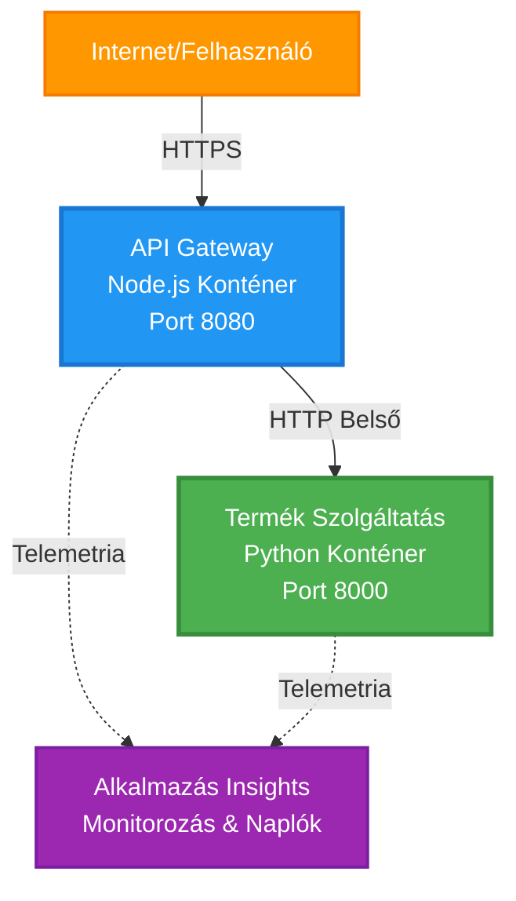
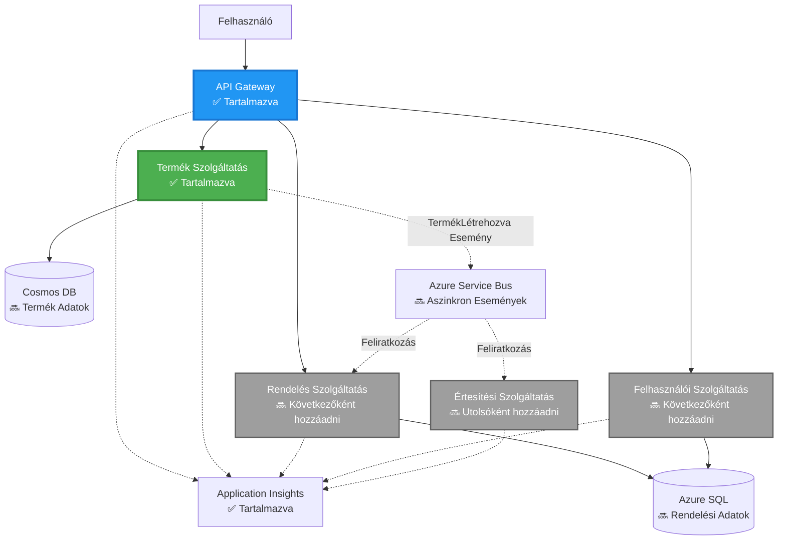
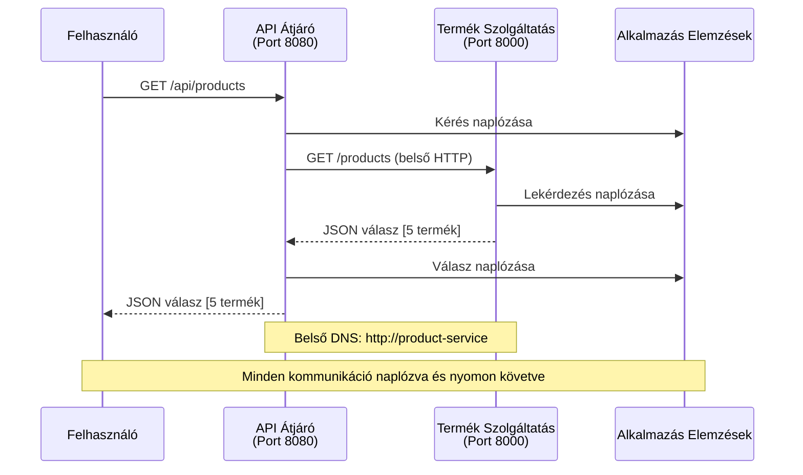

<!--
CO_OP_TRANSLATOR_METADATA:
{
  "original_hash": "eb3a4803a1e80a7f2e64f6bf63738c0f",
  "translation_date": "2025-11-23T12:31:06+00:00",
  "source_file": "examples/microservices/README.md",
  "language_code": "hu"
}
-->
# Mikroszolgáltatások architektúra - Konténeralkalmazás példa

⏱️ **Becsült idő**: 25-35 perc | 💰 **Becsült költség**: ~50-100 USD/hó | ⭐ **Nehézségi szint**: Haladó

**📚 Tanulási útvonal:**
- ← Előző: [Egyszerű Flask API](../../../../examples/container-app/simple-flask-api) - Alapvető egykonténeres megoldások
- 🎯 **Itt tartasz**: Mikroszolgáltatások architektúra (2-szolgáltatásos alap)
- → Következő: [AI integráció](../../../../docs/ai-foundry) - Intelligencia hozzáadása a szolgáltatásokhoz
- 🏠 [Tanfolyam kezdőlapja](../../README.md)

---

Egy **egyszerűsített, de működőképes** mikroszolgáltatási architektúra, amely az Azure Container Apps segítségével kerül telepítésre az AZD CLI használatával. Ez a példa bemutatja a szolgáltatások közötti kommunikációt, a konténer-orkesztációt és a monitorozást egy gyakorlati, 2 szolgáltatásos beállítással.

> **📚 Tanulási megközelítés**: Ez a példa egy minimális, 2 szolgáltatásos architektúrával indul (API Gateway + Backend Service), amelyet ténylegesen telepíthetsz és tanulhatsz belőle. Miután elsajátítottad ezt az alapot, útmutatást nyújtunk a teljes mikroszolgáltatási ökoszisztéma kibővítéséhez.

## Amit megtanulsz

E példa elvégzésével:
- Több konténert telepítesz az Azure Container Apps-re
- Megvalósítod a szolgáltatások közötti kommunikációt belső hálózaton keresztül
- Konfigurálod a környezetalapú skálázást és az állapotellenőrzéseket
- Monitorozod az elosztott alkalmazásokat az Application Insights segítségével
- Megérted a mikroszolgáltatások telepítési mintáit és legjobb gyakorlatait
- Megtanulod az egyszerűtől a bonyolultabb architektúrákig történő fokozatos bővítést

## Architektúra

### 1. fázis: Amit építünk (ebben a példában szerepel)


**Komponens részletek:**

| Komponens | Cél | Hozzáférés | Erőforrások |
|-----------|-----|------------|-------------|
| **API Gateway** | Külső kérések továbbítása a háttérszolgáltatásokhoz | Nyilvános (HTTPS) | 1 vCPU, 2GB RAM, 2-20 replikáció |
| **Product Service** | Termékkatalógus kezelése memóriában tárolt adatokkal | Csak belső | 0.5 vCPU, 1GB RAM, 1-10 replikáció |
| **Application Insights** | Központosított naplózás és elosztott nyomkövetés | Azure Portal | 1-2 GB/hó adatbevitel |

**Miért kezdj egyszerűen?**
- ✅ Gyors telepítés és megértés (25-35 perc)
- ✅ Alapvető mikroszolgáltatási minták megismerése bonyolultság nélkül
- ✅ Működő kód, amelyet módosíthatsz és kísérletezhetsz vele
- ✅ Alacsonyabb tanulási költség (~50-100 USD/hó vs 300-1400 USD/hó)
- ✅ Magabiztosság megszerzése adatbázisok és üzenetküldő sorok hozzáadása előtt

**Analógia**: Gondolj erre úgy, mint az autóvezetés tanulására. Egy üres parkolóval kezded (2 szolgáltatás), elsajátítod az alapokat, majd haladsz a városi forgalom felé (5+ szolgáltatás adatbázisokkal).

### 2. fázis: Jövőbeli bővítés (referencia-architektúra)

Miután elsajátítottad a 2-szolgáltatásos architektúrát, bővítheted:


Lásd a "Bővítési útmutató" szekciót a végén a lépésről lépésre történő útmutatásért.

## Tartalmazott funkciók

✅ **Szolgáltatásfelfedezés**: Automatikus DNS-alapú felfedezés a konténerek között  
✅ **Terheléselosztás**: Beépített terheléselosztás a replikációk között  
✅ **Automatikus skálázás**: Független skálázás szolgáltatásonként a HTTP kérések alapján  
✅ **Állapotfigyelés**: Liveness és readiness probe-ok mindkét szolgáltatáshoz  
✅ **Elosztott naplózás**: Központosított naplózás az Application Insights segítségével  
✅ **Belső hálózat**: Biztonságos szolgáltatás-szolgáltatás közötti kommunikáció  
✅ **Konténer-orkesztáció**: Automatikus telepítés és skálázás  
✅ **Zéró leállási idő frissítések**: Rolling frissítések verziókezeléssel  

## Előfeltételek

### Szükséges eszközök

Mielőtt elkezdenéd, ellenőrizd, hogy ezek az eszközök telepítve vannak:

1. **[Azure Developer CLI (azd)](https://learn.microsoft.com/azure/developer/azure-developer-cli/install-azd)** (1.0.0 vagy újabb verzió)
   ```bash
   azd version
   # Várt kimenet: azd verzió 1.0.0 vagy magasabb
   ```

2. **[Azure CLI](https://learn.microsoft.com/cli/azure/install-azure-cli)** (2.50.0 vagy újabb verzió)
   ```bash
   az --version
   # Várt kimenet: azure-cli 2.50.0 vagy magasabb
   ```

3. **[Docker](https://www.docker.com/get-started)** (helyi fejlesztéshez/teszteléshez - opcionális)
   ```bash
   docker --version
   # Várható kimenet: Docker verzió 20.10 vagy magasabb
   ```

### Ellenőrizd a beállításaidat

Futtasd ezeket a parancsokat, hogy megbizonyosodj arról, hogy minden rendben van:

```bash
# Ellenőrizze az Azure Developer CLI-t
azd version
# ✅ Várható: azd verzió 1.0.0 vagy magasabb

# Ellenőrizze az Azure CLI-t
az --version
# ✅ Várható: azure-cli 2.50.0 vagy magasabb

# Ellenőrizze a Dockert (opcionális)
docker --version
# ✅ Várható: Docker verzió 20.10 vagy magasabb
```

**Siker kritérium**: Minden parancs verziószámot ad vissza, amely megfelel vagy meghaladja a minimális követelményeket.

### Azure követelmények

- Aktív **Azure előfizetés** ([hozz létre ingyenes fiókot](https://azure.microsoft.com/free/))
- Jogosultság az erőforrások létrehozására az előfizetésedben
- **Hozzájáruló** szerepkör az előfizetésen vagy erőforráscsoporton

### Tudás előfeltételek

Ez egy **haladó szintű** példa. Szükséges:
- Az [Egyszerű Flask API példa](../../../../examples/container-app/simple-flask-api) elvégzése
- Alapvető ismeretek a mikroszolgáltatási architektúráról
- REST API-k és HTTP ismerete
- Konténer koncepciók megértése

**Új vagy a Container Apps világában?** Kezdd az [Egyszerű Flask API példával](../../../../examples/container-app/simple-flask-api), hogy megtanuld az alapokat.

## Gyors kezdés (lépésről lépésre)

### 1. lépés: Klónozás és navigáció

```bash
git clone https://github.com/microsoft/AZD-for-beginners.git
cd AZD-for-beginners/examples/microservices
```

**✓ Siker ellenőrzés**: Ellenőrizd, hogy látod az `azure.yaml` fájlt:
```bash
ls
# Várható: README.md, azure.yaml, infra/, src/
```

### 2. lépés: Hitelesítés az Azure-ban

```bash
azd auth login
```

Ez megnyitja a böngészőt az Azure hitelesítéshez. Jelentkezz be az Azure hitelesítő adataiddal.

**✓ Siker ellenőrzés**: Ezt kell látnod:
```
Logged in to Azure.
```

### 3. lépés: Környezet inicializálása

```bash
azd init
```

**Megjelenő kérdések**:
- **Környezet neve**: Adj meg egy rövid nevet (pl. `microservices-dev`)
- **Azure előfizetés**: Válaszd ki az előfizetésed
- **Azure helyszín**: Válassz egy régiót (pl. `eastus`, `westeurope`)

**✓ Siker ellenőrzés**: Ezt kell látnod:
```
SUCCESS: New project initialized!
```

### 4. lépés: Infrastruktúra és szolgáltatások telepítése

```bash
azd up
```

**Mi történik** (8-12 percet vesz igénybe):

```mermaid
graph LR
    A[azd up] --> B[Hozz létre erőforráscsoportot]
    B --> C[Telepítsd a Container Registry-t]
    C --> D[Telepítsd a Log Analytics-et]
    D --> E[Telepítsd az App Insights-ot]
    E --> F[Hozz létre konténerkörnyezetet]
    F --> G[Építsd meg az API Gateway képet]
    F --> H[Építsd meg a Product Service képet]
    G --> I[Töltsd fel a Registry-be]
    H --> I
    I --> J[Telepítsd az API Gateway-t]
    I --> K[Telepítsd a Product Service-t]
    J --> L[Konfiguráld az Ingress-t és az egészségügyi ellenőrzéseket]
    K --> L
    L --> M[Telepítés kész ✓]
    
    style A fill:#2196F3,stroke:#1976D2,stroke-width:3px,color:#fff
    style M fill:#4CAF50,stroke:#388E3C,stroke-width:3px,color:#fff
```


**✓ Siker ellenőrzés**: Ezt kell látnod:
```
SUCCESS: Your application was deployed to Azure in X minutes Y seconds.
Endpoint: https://api-gateway-<unique-id>.azurecontainerapps.io
```

**⏱️ Idő**: 8-12 perc

### 5. lépés: A telepítés tesztelése

```bash
# Szerezd meg a gateway végpontot
GATEWAY_URL=$(azd env get-values | grep API_GATEWAY_URL | cut -d '=' -f2 | tr -d '"')

# Teszteld az API Gateway állapotát
curl $GATEWAY_URL/health
```

**✅ Várható kimenet:**
```json
{
  "status": "healthy",
  "service": "api-gateway",
  "timestamp": "2025-11-19T10:30:00Z"
}
```

**Teszteld a termékszolgáltatást a gateway-en keresztül**:
```bash
# Termékek listázása
curl $GATEWAY_URL/api/products
```

**✅ Várható kimenet:**
```json
[
  {"id":1,"name":"Laptop","price":999.99,"stock":50},
  {"id":2,"name":"Mouse","price":29.99,"stock":200},
  {"id":3,"name":"Keyboard","price":79.99,"stock":150}
]
```

**✓ Siker ellenőrzés**: Mindkét végpont JSON adatot ad vissza hibák nélkül.

---

**🎉 Gratulálunk!** Sikeresen telepítettél egy mikroszolgáltatási architektúrát az Azure-ra!

## Projektstruktúra

Minden implementációs fájl mellékelve van—ez egy teljes, működő példa:

```
microservices/
│
├── README.md                         # This file
├── azure.yaml                        # AZD configuration
├── .gitignore                        # Git ignore patterns
│
├── infra/                           # Infrastructure as Code (Bicep)
│   ├── main.bicep                   # Main orchestration
│   ├── abbreviations.json           # Naming conventions
│   ├── core/                        # Shared infrastructure
│   │   ├── container-apps-environment.bicep  # Container environment + registry
│   │   └── monitor.bicep            # Application Insights + Log Analytics
│   └── app/                         # Service definitions
│       ├── api-gateway.bicep        # API Gateway container app
│       └── product-service.bicep    # Product Service container app
│
└── src/                             # Application source code
    ├── api-gateway/                 # Node.js API Gateway
    │   ├── app.js                   # Express server with routing
    │   ├── package.json             # Node dependencies
    │   └── Dockerfile               # Container definition
    └── product-service/             # Python Product Service
        ├── main.py                  # Flask API with product data
        ├── requirements.txt         # Python dependencies
        └── Dockerfile               # Container definition
```

**Mit csinál az egyes komponens:**

**Infrastruktúra (infra/):**
- `main.bicep`: Az összes Azure erőforrás és függőségeik összehangolása
- `core/container-apps-environment.bicep`: A Container Apps környezet és az Azure Container Registry létrehozása
- `core/monitor.bicep`: Az Application Insights beállítása az elosztott naplózáshoz
- `app/*.bicep`: Egyedi konténeralkalmazás-definíciók skálázással és állapotellenőrzésekkel

**API Gateway (src/api-gateway/):**
- Nyilvános szolgáltatás, amely a kéréseket a háttérszolgáltatásokhoz irányítja
- Naplózást, hibakezelést és kérés-továbbítást valósít meg
- Bemutatja a szolgáltatás-szolgáltatás közötti HTTP kommunikációt

**Product Service (src/product-service/):**
- Belső szolgáltatás termékkatalógussal (egyszerűség kedvéért memóriában tárolt adatokkal)
- REST API állapotellenőrzésekkel
- Példa a háttér mikroszolgáltatási mintára

## Szolgáltatások áttekintése

### API Gateway (Node.js/Express)

**Port**: 8080  
**Hozzáférés**: Nyilvános (külső elérés)  
**Cél**: A bejövő kérések továbbítása a megfelelő háttérszolgáltatásokhoz  

**Végpontok**:
- `GET /` - Szolgáltatás információ
- `GET /health` - Állapotellenőrző végpont
- `GET /api/products` - Továbbítás a termékszolgáltatáshoz (összes listázása)
- `GET /api/products/:id` - Továbbítás a termékszolgáltatáshoz (azonosító alapján)

**Főbb jellemzők**:
- Kérésirányítás axios-szal
- Központosított naplózás
- Hibakezelés és időtúllépés kezelése
- Szolgáltatásfelfedezés környezeti változókon keresztül
- Application Insights integráció

**Kódrészlet** (`src/api-gateway/app.js`):
```javascript
// Belső szolgáltatás kommunikáció
app.get('/api/products', async (req, res) => {
  const response = await axios.get(`${PRODUCT_SERVICE_URL}/products`, {
    timeout: 5000
  });
  res.json(response.data);
});
```

### Product Service (Python/Flask)

**Port**: 8000  
**Hozzáférés**: Csak belső (nincs külső elérés)  
**Cél**: Termékkatalógus kezelése memóriában tárolt adatokkal  

**Végpontok**:
- `GET /` - Szolgáltatás információ
- `GET /health` - Állapotellenőrző végpont
- `GET /products` - Összes termék listázása
- `GET /products/<id>` - Termék lekérése azonosító alapján

**Főbb jellemzők**:
- RESTful API Flask-kel
- Memóriában tárolt termékadatok (egyszerű, nincs szükség adatbázisra)
- Állapotfigyelés probe-okkal
- Strukturált naplózás
- Application Insights integráció

**Adatmodell**:
```python
{
  "id": 1,
  "name": "Laptop",
  "description": "High-performance laptop",
  "price": 999.99,
  "stock": 50
}
```

**Miért csak belső?**
A termékszolgáltatás nem nyilvános. Minden kérésnek az API Gateway-en kell keresztülmennie, amely biztosítja:
- Biztonság: Ellenőrzött hozzáférési pont
- Rugalmasság: A háttér megváltoztatható anélkül, hogy a klienseket érintené
- Monitorozás: Központosított kérésnaplózás

## Szolgáltatások közötti kommunikáció megértése

### Hogyan kommunikálnak a szolgáltatások egymással


Ebben a példában az API Gateway belső HTTP hívásokkal kommunikál a Product Service-szel:

```javascript
// API Gateway (src/api-gateway/app.js)
const PRODUCT_SERVICE_URL = process.env.PRODUCT_SERVICE_URL;

// Tegyen belső HTTP kérést
const response = await axios.get(`${PRODUCT_SERVICE_URL}/products`);
```

**Főbb pontok**:

1. **DNS-alapú felfedezés**: A Container Apps automatikusan biztosít DNS-t a belső szolgáltatásokhoz
   - Product Service FQDN: `product-service.internal.<environment>.azurecontainerapps.io`
   - Egyszerűsítve: `http://product-service` (Container Apps ezt feloldja)

2. **Nincs nyilvános elérés**: A Product Service `external: false` beállítással rendelkezik a Bicep-ben
   - Csak a Container Apps környezeten belül érhető el
   - Az internetről nem érhető el

3. **Környezeti változók**: A szolgáltatás URL-ek telepítéskor kerülnek beállításra
   - A Bicep átadja a belső FQDN-t a gateway-nek
   - Nincsenek hardkódolt URL-ek az alkalmazás kódjában

**Analógia**: Gondolj erre úgy, mint egy irodaházra. Az API Gateway a recepció (nyilvános), a Product Service pedig egy irodahelyiség (csak belső). A látogatóknak a recepción keresztül kell eljutniuk bármelyik irodába.
3. Telepítse újra mindkét szolgáltatást:

```bash
azd deploy product-service
azd deploy api-gateway
```

4. Tesztelje az új végpontot:

```bash
GATEWAY_URL=$(azd env get-values | grep API_GATEWAY_URL | cut -d '=' -f2 | tr -d '"')

# Hozzon létre egy új terméket
curl -X POST $GATEWAY_URL/api/products \
  -H "Content-Type: application/json" \
  -d '{"name":"USB Cable","price":9.99,"stock":500}'
```

**✅ Várható kimenet:**
```json
{"id":6,"name":"USB Cable","description":"","price":9.99,"stock":500}
```

5. Ellenőrizze, hogy megjelenik-e a listában:

```bash
curl $GATEWAY_URL/api/products
# Most már 6 terméket kell mutatnia, beleértve az új USB kábelt.
```

**Siker kritériumok**:
- ✅ A POST kérés HTTP 201-et ad vissza
- ✅ Az új termék megjelenik a GET /api/products listában
- ✅ A termék automatikusan növekvő ID-t kap

**Idő**: 10-15 perc

---

### Gyakorlat 2: Autoscaling szabályok módosítása ⭐⭐ (Közepes)

**Cél**: A Product Service agresszívebb skálázása

**Kiindulási pont**: `infra/app/product-service.bicep`

**Lépések**:

1. Nyissa meg a `infra/app/product-service.bicep` fájlt, és keresse meg a `scale` blokkot (kb. a 95. sor környékén)

2. Módosítsa:
```bicep
scale: {
  minReplicas: 1
  maxReplicas: 10
  rules: [
    {
      name: 'http-scale-rule'
      http: {
        metadata: {
          concurrentRequests: '100'  // OLD
        }
      }
    }
  ]
}
```

Erre:
```bicep
scale: {
  minReplicas: 2  // Always have 2 running
  maxReplicas: 20  // Allow more scaling
  rules: [
    {
      name: 'http-scale-rule'
      http: {
        metadata: {
          concurrentRequests: '20'  // Scale at lower threshold
        }
      }
    }
  ]
}
```

3. Telepítse újra az infrastruktúrát:

```bash
azd up
```

4. Ellenőrizze az új skálázási konfigurációt:

```bash
az containerapp show \
  --name $(azd env get-values | grep PRODUCT_SERVICE | head -1 | cut -d '/' -f5) \
  --resource-group $(azd env get-values | grep AZURE_RESOURCE_GROUP | cut -d '=' -f2 | tr -d '"') \
  --query "properties.template.scale" -o json
```

**✅ Várható kimenet:**
```json
{
  "minReplicas": 2,
  "maxReplicas": 20,
  "rules": [...]
}
```

5. Tesztelje az autoscalinget terheléssel:

```bash
# Generáljon egyidejű kéréseket
for i in {1..500}; do curl $GATEWAY_URL/api/products & done

# Figyelje a skálázás folyamatát
azd logs product-service --follow
# Keresse: Container Apps skálázási események
```

**Siker kritériumok**:
- ✅ A Product Service mindig legalább 2 replikával fut
- ✅ Terhelés alatt több mint 2 replikára skálázódik
- ✅ Az Azure Portalon megjelennek az új skálázási szabályok

**Idő**: 15-20 perc

---

### Gyakorlat 3: Egyedi monitorozási lekérdezés hozzáadása ⭐⭐ (Közepes)

**Cél**: Egyedi Application Insights lekérdezés létrehozása a termék API teljesítményének nyomon követésére

**Lépések**:

1. Lépjen az Application Insights-ba az Azure Portalon:
   - Nyissa meg az Azure Portalt
   - Keresse meg a resource groupot (rg-microservices-*)
   - Kattintson az Application Insights erőforrásra

2. Kattintson a bal oldali menüben a "Logs" opcióra

3. Hozza létre ezt a lekérdezést:

```kusto
requests
| where timestamp > ago(1h)
| where name contains "products"
| summarize 
    RequestCount = count(),
    AvgDuration = avg(duration),
    P95Duration = percentile(duration, 95),
    SuccessRate = 100.0 * countif(success == true) / count()
  by bin(timestamp, 5m)
| render timechart
```

4. Kattintson a "Run" gombra a lekérdezés futtatásához

5. Mentse el a lekérdezést:
   - Kattintson a "Save" gombra
   - Név: "Product API Performance"
   - Kategória: "Performance"

6. Generáljon tesztforgalmat:

```bash
for i in {1..100}; do curl $GATEWAY_URL/api/products; sleep 1; done
```

7. Frissítse a lekérdezést az adatok megtekintéséhez

**✅ Várható kimenet:**
- Diagram, amely az időbeli kérés számát mutatja
- Átlagos időtartam < 500 ms
- Sikerességi arány = 100%
- 5 perces időintervallumok

**Siker kritériumok**:
- ✅ A lekérdezés 100+ kérést mutat
- ✅ Sikerességi arány 100%
- ✅ Átlagos időtartam < 500 ms
- ✅ A diagram 5 perces időintervallumokat jelenít meg

**Tanulási eredmény**: Megérteni, hogyan lehet szolgáltatások teljesítményét egyedi lekérdezésekkel monitorozni

**Idő**: 10-15 perc

---

### Gyakorlat 4: Retry logika implementálása ⭐⭐⭐ (Haladó)

**Cél**: Retry logika hozzáadása az API Gatewayhez, amikor a Product Service ideiglenesen nem elérhető

**Kiindulási pont**: `src/api-gateway/app.js`

**Lépések**:

1. Telepítse a retry könyvtárat:

```bash
cd src/api-gateway
npm install axios-retry --save
cd ../..
```

2. Frissítse a `src/api-gateway/app.js` fájlt (adja hozzá az axios import után):

```javascript
const axiosRetry = require('axios-retry');

// Állítsa be az újrapróbálkozási logikát
axiosRetry(axios, {
  retries: 3,
  retryDelay: (retryCount) => {
    return retryCount * 1000; // 1s, 2s, 3s
  },
  retryCondition: (error) => {
    // Újrapróbálkozás hálózati hibák vagy 5xx válaszok esetén
    return axiosRetry.isNetworkOrIdempotentRequestError(error) ||
           (error.response && error.response.status >= 500);
  }
});

console.log('Retry logic configured: 3 retries with exponential backoff');
```

3. Telepítse újra az API Gatewayt:

```bash
azd deploy api-gateway
```

4. Tesztelje a retry viselkedést szolgáltatás hiba szimulálásával:

```bash
# A termék szolgáltatást skálázza 0-ra (hibát szimulál)
az containerapp update \
  --name $(azd env get-values | grep PRODUCT_SERVICE | head -1 | cut -d '/' -f5) \
  --resource-group $(azd env get-values | grep AZURE_RESOURCE_GROUP | cut -d '=' -f2 | tr -d '"') \
  --min-replicas 0 \
  --max-replicas 0

# Próbáljon hozzáférni a termékekhez (3-szor fog újrapróbálkozni)
time curl -v $GATEWAY_URL/api/products
# Megfigyelés: A válasz körülbelül 6 másodpercet vesz igénybe (1s + 2s + 3s újrapróbálkozások)

# Állítsa vissza a termék szolgáltatást
az containerapp update \
  --name $(azd env get-values | grep PRODUCT_SERVICE | head -1 | cut -d '/' -f5) \
  --resource-group $(azd env get-values | grep AZURE_RESOURCE_GROUP | cut -d '=' -f2 | tr -d '"') \
  --min-replicas 1 \
  --max-replicas 10
```

5. Tekintse meg a retry logokat:

```bash
azd logs api-gateway --tail 50
# Keresse meg: Újrapróbálkozási kísérlet üzeneteket
```

**✅ Várható viselkedés:**
- A kérések 3-szor próbálkoznak újra, mielőtt sikertelenek lennének
- Minden újrapróbálkozás hosszabb ideig vár (1s, 2s, 3s)
- Sikeres kérések a szolgáltatás újraindítása után
- A logok mutatják az újrapróbálkozási kísérleteket

**Siker kritériumok**:
- ✅ A kérések 3-szor próbálkoznak újra, mielőtt sikertelenek lennének
- ✅ Minden újrapróbálkozás hosszabb ideig vár (exponenciális backoff)
- ✅ Sikeres kérések a szolgáltatás újraindítása után
- ✅ A logok mutatják az újrapróbálkozási kísérleteket

**Tanulási eredmény**: Megérteni a mikroszolgáltatásokban alkalmazott reziliencia mintákat (circuit breakers, retry, timeout)

**Idő**: 20-25 perc

---

## Tudásellenőrző pont

A példa befejezése után ellenőrizze tudását:

### 1. Szolgáltatások közötti kommunikáció ✓

Tesztelje tudását:
- [ ] El tudja magyarázni, hogyan találja meg az API Gateway a Product Service-t? (DNS-alapú szolgáltatás felfedezés)
- [ ] Mi történik, ha a Product Service nem elérhető? (Gateway 503 hibát ad vissza)
- [ ] Hogyan adna hozzá egy harmadik szolgáltatást? (Új Bicep fájl létrehozása, hozzáadás a main.bicep-hez, src mappa létrehozása)

**Gyakorlati ellenőrzés**:
```bash
# Szolgáltatás meghibásodásának szimulálása
az containerapp update --name <product-service-name> --min-replicas 0 --max-replicas 0
curl $GATEWAY_URL/api/products
# ✅ Várható: 503 Szolgáltatás nem elérhető

# Szolgáltatás helyreállítása
az containerapp update --name <product-service-name> --min-replicas 1 --max-replicas 10
```

### 2. Monitorozás és megfigyelhetőség ✓

Tesztelje tudását:
- [ ] Hol láthatja az elosztott logokat? (Application Insights az Azure Portalon)
- [ ] Hogyan követné nyomon a lassú kéréseket? (Kusto lekérdezés: `requests | where duration > 1000`)
- [ ] Fel tudja ismerni, melyik szolgáltatás okozott hibát? (Ellenőrizze a `cloud_RoleName` mezőt a logokban)

**Gyakorlati ellenőrzés**:
```bash
# Generáljon lassú kérés szimulációt
curl "$GATEWAY_URL/api/products?delay=2000"

# Lekérdezés az Application Insights-ból lassú kérésekhez
# Navigáljon az Azure Portál → Application Insights → Naplók
# Futtassa: requests | where duration > 1000 | project timestamp, name, duration, cloud_RoleName
```

### 3. Skálázás és teljesítmény ✓

Tesztelje tudását:
- [ ] Mi váltja ki az autoscalinget? (HTTP egyidejű kérés szabályok: 50 a gatewayhez, 100 a termékhez)
- [ ] Hány replika fut jelenleg? (Ellenőrizze az `az containerapp revision list` paranccsal)
- [ ] Hogyan skálázná a Product Service-t 5 replikára? (Frissítse a minReplicas értéket a Bicepben)

**Gyakorlati ellenőrzés**:
```bash
# Terhelés generálása az automatikus skálázás teszteléséhez
for i in {1..1000}; do curl $GATEWAY_URL/api/products & done

# Figyeld a replikák számának növekedését
azd logs api-gateway --follow
# ✅ Várható: Skálázási események megjelenése a naplókban
```

**Siker kritériumok**: Minden kérdésre tud válaszolni és gyakorlati parancsokkal ellenőrizni.

---

## Költségelemzés

### Becsült havi költségek (Ehhez a 2-szolgáltatásos példához)

| Erőforrás | Konfiguráció | Becsült költség |
|----------|--------------|----------------|
| API Gateway | 2-20 replika, 1 vCPU, 2GB RAM | $30-150 |
| Product Service | 1-10 replika, 0.5 vCPU, 1GB RAM | $15-75 |
| Container Registry | Alap szint | $5 |
| Application Insights | 1-2 GB/hónap | $5-10 |
| Log Analytics | 1 GB/hónap | $3 |
| **Összesen** | | **$58-243/hónap** |

### Költségbontás használat szerint

**Kis forgalom** (tesztelés/tanulás): ~60$/hónap
- API Gateway: 2 replika × 24/7 = $30
- Product Service: 1 replika × 24/7 = $15
- Monitorozás + Registry = $13

**Mérsékelt forgalom** (kis produkció): ~120$/hónap
- API Gateway: 5 átlagos replika = $75
- Product Service: 3 átlagos replika = $45
- Monitorozás + Registry = $13

**Nagy forgalom** (forgalmas időszakok): ~240$/hónap
- API Gateway: 15 átlagos replika = $225
- Product Service: 8 átlagos replika = $120
- Monitorozás + Registry = $13

### Költségoptimalizálási tippek

1. **Fejlesztéshez skálázás nullára**:
   ```bicep
   scale: {
     minReplicas: 0  // Save $30-40/month when not in use
     maxReplicas: 10
   }
   ```

2. **Használjon Consumption Plan-t a Cosmos DB-hez** (ha hozzáadja):
   - Csak a használatért fizet
   - Nincs minimális díj

3. **Állítsa be az Application Insights mintavételezést**:
   ```javascript
   appInsights.defaultClient.config.samplingPercentage = 50; // Mintavételezze a kérések 50%-át
   ```

4. **Takarítsa el, ha nincs szükség rá**:
   ```bash
   azd down --force --purge
   ```

### Ingyenes szint opciók

Tanuláshoz/teszteléshez fontolja meg:
- ✅ Használja az Azure ingyenes krediteket (200$ az első 30 napban új fiókokkal)
- ✅ Tartsa minimális replikákon (kb. 50%-os költségmegtakarítás)
- ✅ Törölje tesztelés után (nincs folyamatos díj)
- ✅ Skálázza nullára a tanulási szünetek között

**Példa**: Ezt a példát 2 órán keresztül futtatni naponta × 30 nap = ~5$/hónap ahelyett, hogy 60$/hónap lenne

---

## Gyors hibaelhárítási referencia

### Probléma: `azd up` hibát ad "Subscription not found"

**Megoldás**:
```bash
# Jelentkezzen be újra kifejezett előfizetéssel
az account set --subscription <your-subscription-id>
azd env set AZURE_SUBSCRIPTION_ID <your-subscription-id>
azd up
```

### Probléma: API Gateway 503-at ad vissza "Product service unavailable"

**Diagnózis**:
```bash
# Ellenőrizze a termékszolgáltatás naplóit
azd logs product-service --tail 50

# Ellenőrizze a termékszolgáltatás állapotát
az containerapp show \
  --name $(azd env get-values | grep PRODUCT_SERVICE | head -1 | cut -d '/' -f5) \
  --resource-group $(azd env get-values | grep AZURE_RESOURCE_GROUP | cut -d '=' -f2 | tr -d '"') \
  --query "properties.runningStatus"
```

**Gyakori okok**:
1. A Product Service nem indult el (ellenőrizze a Python hibákat a logokban)
2. Az egészségügyi ellenőrzés sikertelen (ellenőrizze, hogy a `/health` végpont működik-e)
3. A konténerkép építése sikertelen (ellenőrizze a registryben a képet)

### Probléma: Autoscaling nem működik

**Diagnózis**:
```bash
# Ellenőrizze az aktuális replikaszámot
az containerapp revision list \
  --name $(azd env get-values | grep API_GATEWAY | head -1 | cut -d '/' -f5) \
  --resource-group $(azd env get-values | grep AZURE_RESOURCE_GROUP | cut -d '=' -f2 | tr -d '"') \
  --query "[].properties.replicas"

# Terhelés generálása teszteléshez
for i in {1..1000}; do curl $GATEWAY_URL/api/products & done

# Figyelje a skálázási eseményeket
azd logs api-gateway --follow | grep -i scale
```

**Gyakori okok**:
1. A terhelés nem elég magas a skálázási szabály aktiválásához (szükséges >50 egyidejű kérés)
2. A maximális replika már elérve (ellenőrizze a Bicep konfigurációt)
3. A skálázási szabály hibásan van konfigurálva a Bicepben (ellenőrizze a concurrentRequests értéket)

### Probléma: Application Insights nem mutat logokat

**Diagnózis**:
```bash
# Ellenőrizze, hogy a kapcsolat karakterlánc be van-e állítva
azd env get-values | grep APPLICATIONINSIGHTS

# Ellenőrizze, hogy a szolgáltatások küldenek-e telemetriát
az monitor app-insights component show \
  --app $(azd env get-values | grep APPLICATIONINSIGHTS_NAME | cut -d '=' -f2 | tr -d '"') \
  --resource-group $(azd env get-values | grep AZURE_RESOURCE_GROUP | cut -d '=' -f2 | tr -d '"') \
  --query "properties.InstrumentationKey"
```

**Gyakori okok**:
1. A kapcsolati string nincs átadva a konténernek (ellenőrizze a környezeti változókat)
2. Az Application Insights SDK nincs konfigurálva (ellenőrizze az importokat a kódban)
3. Tűzfal blokkolja a telemetriát (ritka, ellenőrizze a hálózati szabályokat)

### Probléma: Docker build helyben sikertelen

**Diagnózis**:
```bash
# Tesztelje az API Gateway buildet
cd src/api-gateway
docker build -t test-gateway .

# Tesztelje a Product Service buildet
cd ../product-service
docker build -t test-product .
```

**Gyakori okok**:
1. Hiányzó függőségek a package.json/requirements.txt-ben
2. Dockerfile szintaxis hibák
3. Hálózati problémák a függőségek letöltésekor

**Még mindig elakadt?** Lásd [Gyakori problémák útmutató](../../docs/troubleshooting/common-issues.md) vagy [Azure Container Apps Troubleshooting](https://learn.microsoft.com/azure/container-apps/troubleshooting)

---

## Takarítás

A folyamatos díjak elkerülése érdekében törölje az összes erőforrást:

```bash
azd down --force --purge
```

**Megerősítő prompt**:
```
? Total resources to delete: 6, are you sure you want to continue? (y/N)
```

Írja be, hogy `y` a megerősítéshez.

**Mi kerül törlésre**:
- Container Apps környezet
- Mindkét Container App (gateway & product service)
- Container Registry
- Application Insights
- Log Analytics Workspace
- Resource Group

**✓ Takarítás ellenőrzése**:
```bash
az group list --query "[?starts_with(name,'rg-microservices')]" --output table
```

Üresnek kell lennie.

---

## Bővítési útmutató: 2-ről 5+ szolgáltatásra

Miután elsajátította ezt a 2-szolgáltatásos architektúrát, itt van, hogyan bővítheti:

### 1. Fázis: Adatbázis perzisztencia hozzáadása (Következő lépés)

**Cosmos DB hozzáadása a Product Service-hez**:

1. Hozzon létre `infra/core/cosmos.bicep` fájlt:
   ```bicep
   resource cosmosAccount 'Microsoft.DocumentDB/databaseAccounts@2023-04-15' = {
     name: name
     location: location
     kind: 'GlobalDocumentDB'
     properties: {
       databaseAccountOfferType: 'Standard'
       consistencyPolicy: { defaultConsistencyLevel: 'Session' }
       locations: [{ locationName: location, failoverPriority: 0 }]
     }
   }
   ```

2. Frissítse a Product Service-t, hogy az Azure Cosmos DB Python SDK-t használja a memória helyett

3. Becsült további költség: ~25$/hónap (serverless)

### 2. Fázis: Harmadik szolgáltatás hozzáadása (Order Management)

**Order Service létrehozása**:

1. Új mappa: `src/order-service/` (Python/Node.js/C#)
2. Új Bicep: `infra/app/order-service.bicep`
3. Frissítse az API Gatewayt, hogy `/api/orders`-t irányítson
4. Adjon hozzá Azure SQL Database-t az order perzisztenciához

**Az architektúra így néz ki**:
```
API Gateway → Product Service (Cosmos DB)
           → Order Service (Azure SQL)
```

### 3. Fázis: Aszinkron kommunikáció hozzáadása (Service Bus)

**Event-Driven Architektúra implementálása**:

1. Adjon hozzá Azure Service Bus-t: `infra/core/servicebus.bicep`
2. A Product Service "ProductCreated" eseményeket publikál
3. Az Order Service feliratkozik a termék eseményekre
4. Adjon hozzá Notification Service-t az események feldolgozásához

**Minta**: Kérés/Válasz (HTTP) + Event-Driven (Service Bus)

### 4. Fázis: Felhasználói hitelesítés hozzáadása

**User Service implementálása**:

1. Hozzon létre `src/user-service/` (Go/Node.js)
2. Adjon hozzá Azure AD B2C-t vagy egyedi JWT hitelesítést
3. Az API Gateway ellenőrzi a tokeneket az irányítás előtt
4. A szolgáltatások ellenőrzik a felhasználói jogosultságokat

### 5. Fázis: Produkciós készültség

**Adja hozzá ezeket az elemeket**:
- ✅ Azure Front Door (globális terheléselosztás)
- ✅ Azure Key Vault (titokkezelés)
- ✅ Azure Monitor Workbooks (egyedi műszerfalak)
- ✅ CI/CD Pipeline (GitHub Actions)
- ✅ Blue-Green Deployments
- ✅ Managed Identity minden szolgáltatáshoz

**Teljes produkciós architektúra költsége**: ~300-1,400$/hónap

---

## További információ

### Kapcsolódó dokumentáció
- [Azure Container Apps Dokumentáció](https://learn.microsoft.com/azure/container-apps/)
- [Mikroszolgáltatások Architektúra Útmutató](https://learn.microsoft.com/azure/architecture/guide/architecture-styles/microservices)
- [Application Insights az Elosztott Nyomkövetéshez](https://learn.microsoft.com/azure/azure-monitor/app/distributed-tracing)
- [Azure Developer CLI Dokumentáció](https://learn.microsoft.com/azure/developer/azure-developer-cli/)

### Következő lépések ebben a kurzusban
- ← Előző: [Egyszerű Flask API](../../../../examples/container-app/simple-flask-api) - Kezdő egykonténeres példa
- → Következő: [AI Integrációs Útmutató](../../../../docs/ai-foundry) - AI képességek hozzáadása
- 🏠 [Kurzus Főoldal](../../README.md)

### Összehasonlítás: Mikor mit használjunk

| Funkció | Egykonténeres | Mikroszolgáltatások (Ez) | Kubernetes (AKS) |
|---------|-----------------|---------------------|------------------|
| **Felhasználási eset** | Eg
| **Legjobb választás** | MVP-k, prototípusok | Éles alkalmazások | Multi-cloud, fejlett hálózatkezelés |

**Ajánlás**: Kezdje a Container Apps-szel (ez a példa), és váltson AKS-re, ha Kubernetes-specifikus funkciókra van szüksége.

---

## Gyakran Ismételt Kérdések

**K: Miért csak 2 szolgáltatás, miért nem 5+?**  
V: Oktatási haladás. Először sajátítsa el az alapokat (szolgáltatások közötti kommunikáció, monitorozás, skálázás) egy egyszerű példával, mielőtt bonyolítaná. Az itt tanult minták alkalmazhatók 100-szolgáltatásos architektúrákra is.

**K: Hozzáadhatok magam több szolgáltatást?**  
V: Természetesen! Kövesse a fenti bővítési útmutatót. Minden új szolgáltatás ugyanazt a mintát követi: hozzon létre egy `src` mappát, készítsen egy Bicep fájlt, frissítse az `azure.yaml`-t, és telepítse.

**K: Ez éles környezetre kész?**  
V: Ez egy szilárd alap. Éles környezethez adjon hozzá: kezelt identitást, Key Vault-ot, tartós adatbázisokat, CI/CD folyamatot, monitorozási riasztásokat és biztonsági mentési stratégiát.

**K: Miért nem használunk Dapr-t vagy más service mesh-t?**  
V: Egyszerűség a tanuláshoz. Miután megértette a natív Container Apps hálózatkezelést, rétegezheti a Dapr-t fejlettebb forgatókönyvekhez (állapotkezelés, pub/sub, kötőelemek).

**K: Hogyan tudok helyben hibakeresni?**  
V: Futtassa a szolgáltatásokat helyben Dockerrel:  
```bash
cd src/api-gateway
docker build -t local-gateway .
docker run -p 8080:8080 -e PRODUCT_SERVICE_URL=http://localhost:8000 local-gateway
```
  
**K: Használhatok különböző programozási nyelveket?**  
V: Igen! Ez a példa Node.js-t (gateway) és Python-t (termék szolgáltatás) mutat be. Bármilyen nyelvet keverhet, amely konténerekben fut: C#, Go, Java, Ruby, PHP stb.

**K: Mi van, ha nincs Azure kreditem?**  
V: Használja az Azure ingyenes szintjét (az új fiókok az első 30 napban 200 dollár kreditet kapnak), vagy telepítsen rövid tesztelési időszakokra, majd azonnal törölje. Ez a példa körülbelül 2 dollár/nap költséggel jár.

**K: Miben különbözik ez az Azure Kubernetes Service-től (AKS)?**  
V: A Container Apps egyszerűbb (nincs szükség Kubernetes-ismeretekre), de kevésbé rugalmas. Az AKS teljes Kubernetes-vezérlést biztosít, de több szakértelmet igényel. Kezdje a Container Apps-szel, és váltson AKS-re, ha szükséges.

**K: Használhatom ezt meglévő Azure-szolgáltatásokkal?**  
V: Igen! Csatlakozhat meglévő adatbázisokhoz, tárfiókokhoz, Service Bus-hoz stb. Frissítse a Bicep fájlokat, hogy meglévő erőforrásokra hivatkozzanak, ahelyett, hogy újakat hoznának létre.

---

> **🎓 Tanulási útvonal összefoglaló**: Megtanulta, hogyan telepítsen egy több szolgáltatásból álló architektúrát automatikus skálázással, belső hálózatkezeléssel, központosított monitorozással és éles környezetre kész mintákkal. Ez az alap felkészíti Önt összetett elosztott rendszerekre és vállalati mikroszolgáltatás-architektúrákra.

**📚 Tanfolyam navigáció:**
- ← Előző: [Egyszerű Flask API](../../../../examples/container-app/simple-flask-api)
- → Következő: [Adatbázis integrációs példa](../../../../database-app)
- 🏠 [Tanfolyam főoldal](../../README.md)
- 📖 [Container Apps legjobb gyakorlatok](../../docs/deployment/deployment-guide.md)

---

**✨ Gratulálunk!** Befejezte a mikroszolgáltatások példáját. Most már érti, hogyan építsen, telepítsen és monitorozzon elosztott alkalmazásokat az Azure Container Apps segítségével. Készen áll AI képességek hozzáadására? Nézze meg az [AI integrációs útmutatót](../../../../docs/ai-foundry)!

---

<!-- CO-OP TRANSLATOR DISCLAIMER START -->
**Felelősség kizárása**:  
Ez a dokumentum az [Co-op Translator](https://github.com/Azure/co-op-translator) AI fordítási szolgáltatás segítségével lett lefordítva. Bár törekszünk a pontosságra, kérjük, vegye figyelembe, hogy az automatikus fordítások hibákat vagy pontatlanságokat tartalmazhatnak. Az eredeti dokumentum az eredeti nyelvén tekintendő hiteles forrásnak. Kritikus információk esetén javasolt professzionális emberi fordítást igénybe venni. Nem vállalunk felelősséget semmilyen félreértésért vagy téves értelmezésért, amely a fordítás használatából eredhet.
<!-- CO-OP TRANSLATOR DISCLAIMER END -->