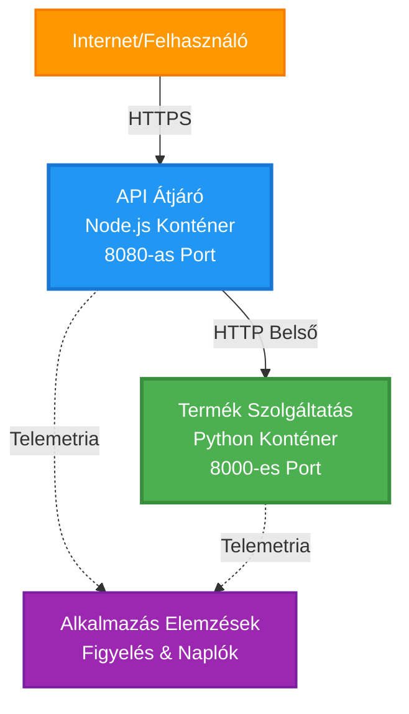
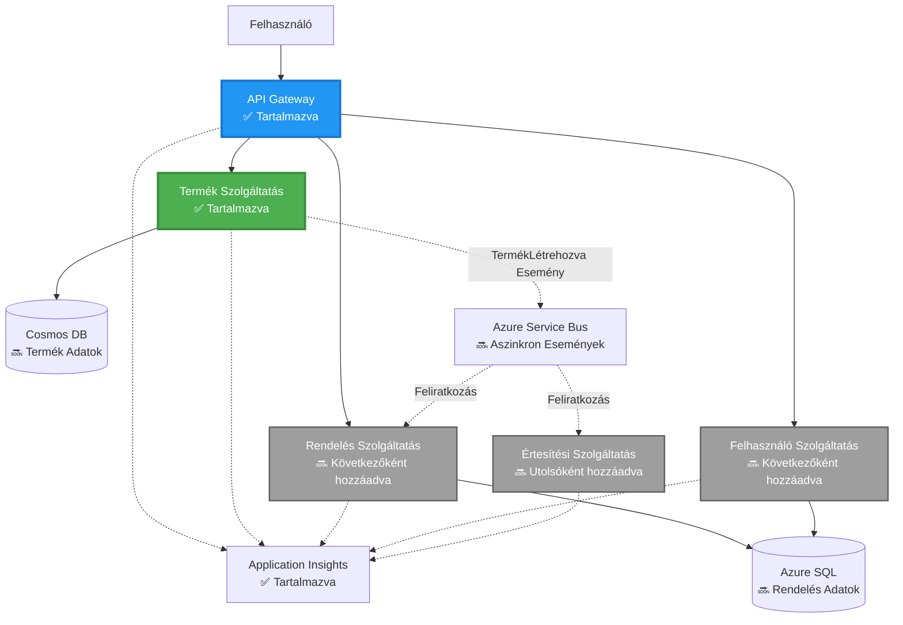
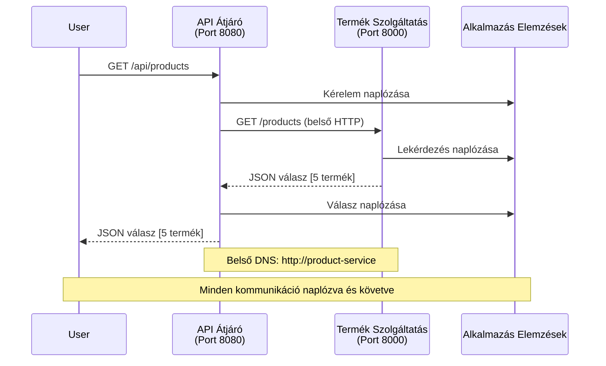

# Mikroszolgáltatások Architektúrája – Container App Példa

⏱️ **Becsült idő**: 25-35 perc | 💰 **Becsült költség**: kb. 50-100 USD/hónap | ⭐ **Bonyolultság**: Haladó

**📚 Tanulási útvonal:**
- ← Előző: [Egyszerű Flask API](../../../../examples/container-app/simple-flask-api) – Egyszerű konténer alapok
- 🎯 **Ön itt tart**: Mikroszolgáltatások architektúrája (2-szolgáltatásos alap)
- → Következő: [AI Integráció](../../../../docs/ai-foundry) – Intelligencia hozzáadása szolgáltatásaihoz
- 🏠 [Tanfolyam kezdőlap](../../README.md)

---

Egy **egyszerűsített, de működőképes** mikroszolgáltatás architektúra, amely AZD CLI használatával van telepítve Azure Container Apps környezetbe. Ez a példa bemutatja a szolgáltatás-szolgáltatás közti kommunikációt, a konténer-orchestrationt és a monitorozást egy gyakorlati 2-szolgáltatásos felállással.

> **📚 Tanítási megközelítés**: Ez a példa egy minimális 2-szolgáltatásos architektúrával (API Gateway + Backend Service) indul, amelyet ténylegesen telepíthet és tanulhat belőle. Az alapok elsajátítása után útmutatást adunk a teljes mikroszolgáltatás ökoszisztéma bővítéséhez.

## Amit megtanul

A példa elvégzése után:
- Több konténert telepít az Azure Container Apps-re
- Megvalósítja a szolgáltatások közti kommunikációt belső hálózaton keresztül
- Konfigurál környezet alapú skálázást és egészségellenőrzéseket
- Monitorozza az elosztott alkalmazásokat az Application Insights segítségével
- Megérti a mikroszolgáltatás telepítési mintákat és bevált gyakorlatokat
- Megtanulja, hogyan bővíthet fokozatosan egyszerűtől a bonyolult architektúrákig

## Architektúra

### 1. fázis: Amit építünk (Ez a példa tartalmazza)


```mermaid
graph TB
    Internet[Internet/Felhasználó]
    Gateway[API Átjáró<br/>Node.js Konténer<br/>8080-as Port]
    Product[Termék Szolgáltatás<br/>Python Konténer<br/>8000-es Port]
    AppInsights[Alkalmazás Elemzések<br/>Figyelés & Naplók]
    
    Internet -->|HTTPS| Gateway
    Gateway -->|HTTP Belső| Product
    Gateway -.->|Telemetria| AppInsights
    Product -.->|Telemetria| AppInsights
    
    style Gateway fill:#2196F3,stroke:#1976D2,stroke-width:3px,color:#fff
    style Product fill:#4CAF50,stroke:#388E3C,stroke-width:3px,color:#fff
    style Internet fill:#FF9800,stroke:#F57C00,stroke-width:2px,color:#fff
    style AppInsights fill:#9C27B0,stroke:#7B1FA2,stroke-width:2px,color:#fff
```
**Komponens részletek:**

| Komponens | Célja | Hozzáférés | Erőforrások |
|-----------|---------|--------|-----------|
| **API Gateway** | Külső kéréseket továbbít a backend szolgáltatásokhoz | Nyilvános (HTTPS) | 1 vCPU, 2GB RAM, 2-20 replika |
| **Termék szolgáltatás** | Termékkatalógus kezelése memóriában tárolt adatokkal | Csak belső | 0.5 vCPU, 1GB RAM, 1-10 replika |
| **Application Insights** | Központosított naplózás és elosztott követés | Azure Portal | 1-2 GB/hónap adatfeldolgozás |

**Miért kezdjünk egyszerűen?**
- ✅ Gyors telepítés és megértés (25-35 perc)
- ✅ Alap mikroszolgáltatás minták tanulása bonyolultság nélkül
- ✅ Működő kód, amit módosíthat és tesztelhet
- ✅ Alacsonyabb költség a tanuláshoz (~50-100 USD/hónap a 300-1400 USD/hónap helyett)
- ✅ Magabiztosság építése mielőtt adatbázisokat és üzenetsorokat adna hozzá

**Példa**: Olyan, mintha vezetni tanulna. Egy üres parkolóval kezdi (2 szolgáltatás), megtanulja az alapokat, majd továbblép a városi forgalomba (5+ szolgáltatás adatbázisokkal).

### 2. fázis: Jövőbeli bővítés (Referencia architektúra)

Ha már elsajátította a 2-szolgáltatásos architektúrát, bővíthet a következőkre:


```mermaid
graph TB
    User[Felhasználó]
    Gateway[API Gateway<br/>✅ Tartalmazva]
    Product[Termék Szolgáltatás<br/>✅ Tartalmazva]
    Order[Rendelés Szolgáltatás<br/>🔜 Következőként hozzáadva]
    UserSvc[Felhasználó Szolgáltatás<br/>🔜 Következőként hozzáadva]
    Notify[Értesítési Szolgáltatás<br/>🔜 Utolsóként hozzáadva]
    
    CosmosDB[(Cosmos DB<br/>🔜 Termék Adatok)]
    AzureSQL[(Azure SQL<br/>🔜 Rendelés Adatok)]
    ServiceBus[Azure Service Bus<br/>🔜 Aszinkron Események]
    AppInsights[Application Insights<br/>✅ Tartalmazva]
    
    User --> Gateway
    Gateway --> Product
    Gateway --> Order
    Gateway --> UserSvc
    
    Product --> CosmosDB
    Order --> AzureSQL
    UserSvc --> AzureSQL
    
    Product -.->|TermékLétrehozva Esemény| ServiceBus
    ServiceBus -.->|Feliratkozás| Notify
    ServiceBus -.->|Feliratkozás| Order
    
    Gateway -.-> AppInsights
    Product -.-> AppInsights
    Order -.-> AppInsights
    UserSvc -.-> AppInsights
    Notify -.-> AppInsights
    
    style Product fill:#4CAF50,stroke:#388E3C,stroke-width:3px,color:#fff
    style Gateway fill:#2196F3,stroke:#1976D2,stroke-width:3px,color:#fff
    style Order fill:#9E9E9E,stroke:#616161,stroke-width:2px,color:#fff
    style UserSvc fill:#9E9E9E,stroke:#616161,stroke-width:2px,color:#fff
    style Notify fill:#9E9E9E,stroke:#616161,stroke-width:2px,color:#fff
```
Lásd a "Bővítési útmutató" részt a végén lépésről lépésre.

## Tartalmazott funkciók

✅ **Szolgáltatás felfedezés**: Automatikus DNS-alapú felfedezés konténerek között  
✅ **Terheléselosztás**: Beépített terheléselosztás replikák között  
✅ **Automatikus skálázás**: Szolgáltatásonkénti, HTTP kérések alapján  
✅ **Egészség monitorozás**: Liveness és readiness ellenőrzések mindkét szolgáltatáshoz  
✅ **Elosztott naplózás**: Központosított naplózás Application Insights segítségével  
✅ **Belső hálózat**: Biztonságos szolgáltatás-szolgáltatás közti kommunikáció  
✅ **Konténer orchestráció**: Automatikus telepítés és skálázás  
✅ **Zéró leállásos frissítések**: Rolling update verziókezeléssel  

## Előfeltételek

### Szükséges eszközök

A kezdés előtt ellenőrizze, hogy ezek az eszközök telepítve vannak:

1. **[Azure Developer CLI (azd)](https://learn.microsoft.com/azure/developer/azure-developer-cli/install-azd)** (1.0.0-s vagy újabb verzió)
   ```bash
   azd version
   # Várt kimenet: azd verzió 1.0.0 vagy újabb
   ```

2. **[Azure CLI](https://learn.microsoft.com/cli/azure/install-azure-cli)** (2.50.0 vagy magasabb verzió)
   ```bash
   az --version
   # Várt kimenet: azure-cli 2.50.0 vagy újabb
   ```

3. **[Docker](https://www.docker.com/get-started)** (helyi fejlesztés/teszteléshez – opcionális)
   ```bash
   docker --version
   # Várt kimenet: Docker verzió 20.10 vagy újabb
   ```

### Beállítás ellenőrzése

Futtassa ezeket a parancsokat a készenlét megerősítéséhez:

```bash
# Azure Developer CLI ellenőrzése
azd version
# ✅ Várt eredmény: azd verzió 1.0.0 vagy magasabb

# Azure CLI ellenőrzése
az --version
# ✅ Várt eredmény: azure-cli 2.50.0 vagy magasabb

# Docker ellenőrzése (opcionális)
docker --version
# ✅ Várt eredmény: Docker verzió 20.10 vagy magasabb
```

**Siker kritérium**: Minden parancs a minimális verziószámot eléri vagy meghaladja.

### Azure követelmények

- Aktív **Azure előfizetés** ([ingyenes fiók létrehozása](https://azure.microsoft.com/free/))
- Jogosultság erőforrás létrehozására az előfizetésben
- **Contributor** szerepkör az előfizetésen vagy az erőforráscsoporton belül

### Tudás előfeltételek

Ez egy **haladó szintű** példa. Ajánlott:
- Elvégezte a [Egyszerű Flask API példát](../../../../examples/container-app/simple-flask-api) 
- Alap mikroszolgáltatás architektúra ismeretekkel rendelkezik
- Ismeri a REST API-kat és a HTTP-t
- Érti a konténer fogalmakat

**Új a Container Apps-ben?** Kezdje az [Egyszerű Flask API példával](../../../../examples/container-app/simple-flask-api), hogy elsajátítsa az alapokat.

## Gyors indítás (lépésről lépésre)

### 1. lépés: Klónozás és navigáció

```bash
git clone https://github.com/microsoft/AZD-for-beginners.git
cd AZD-for-beginners/examples/microservices
```

**✓ Siker ellenőrzés**: Ellenőrizze, hogy látható az `azure.yaml`:
```bash
ls
# Várt: README.md, azure.yaml, infra/, src/
```

### 2. lépés: Azure-ba való hitelesítés

```bash
azd auth login
```

Megnyílik a böngésző az Azure hitelesítéshez. Jelentkezzen be Azure fiókjával.

**✓ Siker ellenőrzés**: Meg kell jelennie:
```
Logged in to Azure.
```

### 3. lépés: Környezet inicializálása

```bash
azd init
```

**Kérdések, amire választ ad:**
- **Környezet neve**: Adjon meg egy rövid nevet (pl. `microservices-dev`)
- **Azure előfizetés**: Válassza ki az előfizetését
- **Azure régió**: Válasszon régiót (pl. `eastus`, `westeurope`)

**✓ Siker ellenőrzés**: Meg kell jelennie:
```
SUCCESS: New project initialized!
```

### 4. lépés: Infrastruktúra és szolgáltatások telepítése

```bash
azd up
```

**Mi történik** (8-12 perc):


```mermaid
graph LR
    A[azd up] --> B[Erőforráscsoport létrehozása]
    B --> C[Konténerregiszter telepítése]
    C --> D[Log Analytics telepítése]
    D --> E[App Insights telepítése]
    E --> F[Konténer környezet létrehozása]
    F --> G[API Gateway kép építése]
    F --> H[Termék szolgáltatás kép építése]
    G --> I[Push a regiszterbe]
    H --> I
    I --> J[API Gateway telepítése]
    I --> K[Termék szolgáltatás telepítése]
    J --> L[Ingress és állapotellenőrzések konfigurálása]
    K --> L
    L --> M[Telepítés kész ✓]
    
    style A fill:#2196F3,stroke:#1976D2,stroke-width:3px,color:#fff
    style M fill:#4CAF50,stroke:#388E3C,stroke-width:3px,color:#fff
```
**✓ Siker ellenőrzés**: Meg kell jelennie:
```
SUCCESS: Your application was deployed to Azure in X minutes Y seconds.
Endpoint: https://api-gateway-<unique-id>.azurecontainerapps.io
```

**⏱️ Idő**: 8-12 perc

### 5. lépés: A telepítés tesztelése

```bash
# Szerezze be a gateway végpontját
GATEWAY_URL=$(azd env get-values | grep API_GATEWAY_URL | cut -d '=' -f2 | tr -d '"')

# Tesztelje az API Gateway állapotát
curl $GATEWAY_URL/health
```

**✅ Várt kimenet:**
```json
{
  "status": "healthy",
  "service": "api-gateway",
  "timestamp": "2025-11-19T10:30:00Z"
}
```

**Tesztelje a termék szolgáltatást a gateway-n keresztül**:
```bash
# Termékek listázása
curl $GATEWAY_URL/api/products
```

**✅ Várt kimenet:**
```json
[
  {"id":1,"name":"Laptop","price":999.99,"stock":50},
  {"id":2,"name":"Mouse","price":29.99,"stock":200},
  {"id":3,"name":"Keyboard","price":79.99,"stock":150}
]
```

**✓ Siker ellenőrzés**: Mindkét végpont JSON adatot ad hibamentesen.

---

**🎉 Gratulálunk!** Sikeresen telepített egy mikroszolgáltatás architektúrát az Azure-ra!

## Projekt struktúra

Minden megvalósítási fájl benne van — ez egy teljes, működő példa:

```
microservices/
│
├── README.md                         # This file
├── azure.yaml                        # AZD configuration
├── .gitignore                        # Git ignore patterns
│
├── infra/                           # Infrastructure as Code (Bicep)
│   ├── main.bicep                   # Main orchestration
│   ├── abbreviations.json           # Naming conventions
│   ├── core/                        # Shared infrastructure
│   │   ├── container-apps-environment.bicep  # Container environment + registry
│   │   └── monitor.bicep            # Application Insights + Log Analytics
│   └── app/                         # Service definitions
│       ├── api-gateway.bicep        # API Gateway container app
│       └── product-service.bicep    # Product Service container app
│
└── src/                             # Application source code
    ├── api-gateway/                 # Node.js API Gateway
    │   ├── app.js                   # Express server with routing
    │   ├── package.json             # Node dependencies
    │   └── Dockerfile               # Container definition
    └── product-service/             # Python Product Service
        ├── main.py                  # Flask API with product data
        ├── requirements.txt         # Python dependencies
        └── Dockerfile               # Container definition
```

**Mit csinál mindegyik komponens:**

**Infrastruktúra (infra/)**:
- `main.bicep`: Azure erőforrásokat és azok függőségeit irányítja
- `core/container-apps-environment.bicep`: Létrehozza a Container Apps környezetet és az Azure Container Registry-t
- `core/monitor.bicep`: Beállítja az Application Insights-ot elosztott naplózáshoz
- `app/*.bicep`: Egyedi konténer app definíciók skálázással és egészségellenőrzéssel

**API Gateway (src/api-gateway/)**:
- Nyilvános szolgáltatás, amely a kéréseket továbbítja a backend szolgáltatásokhoz
- Naplózást, hibakezelést és kérés továbbítást valósít meg
- Bemutatja a szolgáltatás-szolgáltatás közti HTTP kommunikációt

**Termék szolgáltatás (src/product-service/)**:
- Belső szolgáltatás termékkatalógussal (egyszerű memóriában tárolt adat)
- REST API egészségellenőrzésekkel
- Példa backend mikroszolgáltatásra

## Szolgáltatások áttekintése

### API Gateway (Node.js/Express)

**Port**: 8080  
**Hozzáférés**: Nyilvános (külső ingress)  
**Cél**: Bejövő kérések irányítása a backend szolgáltatásokhoz  

**Végpontok**:
- `GET /` - Szolgáltatás információk
- `GET /health` - Egészségellenőrző végpont
- `GET /api/products` - Továbbítás a termék szolgáltatáshoz (összes termék listázása)
- `GET /api/products/:id` - Továbbítás a termék szolgáltatáshoz (ID alapján lekérdezés)

**Főbb funkciók**:
- Kérés irányítás axios-szal
- Központosított naplózás
- Hiba kezelés és időkorlát menedzsment
- Szolgáltatás felfedezés környezeti változókon keresztül
- Application Insights integráció

**Kódrészlet** (`src/api-gateway/app.js`):
```javascript
// Belső szolgáltatáskommunikáció
app.get('/api/products', async (req, res) => {
  const response = await axios.get(`${PRODUCT_SERVICE_URL}/products`, {
    timeout: 5000
  });
  res.json(response.data);
});
```

### Termék szolgáltatás (Python/Flask)

**Port**: 8000  
**Hozzáférés**: Csak belső (nincs külső ingress)  
**Cél**: Termékkatalógus kezelése memóriában  

**Végpontok**:
- `GET /` - Szolgáltatás információk
- `GET /health` - Egészségellenőrző végpont
- `GET /products` - Összes termék listázása
- `GET /products/<id>` - Termék lekérése ID alapján

**Főbb funkciók**:
- REST API Flask-kel
- Memóriában tárolt termék adatbázis (egyszerű, nem kell adatbázis)
- Egészség monitorozás ellenőrzőkkel
- Strukturált naplózás
- Application Insights integráció

**Adatmodell**:
```python
{
  "id": 1,
  "name": "Laptop",
  "description": "High-performance laptop",
  "price": 999.99,
  "stock": 50
}
```

**Miért csak belső?**
A termék szolgáltatás nem érhető el nyilvánosan. Minden kérés az API Gateway-n keresztül megy, ami biztosítja:
- Biztonság: Ellenőrzött elérési pont
- Rugalmasság: Módosítható backend kliens hatás nélkül
- Monitorozás: Központosított kérés naplózás

## Szolgáltatások közötti kommunikáció megértése

### Hogyan kommunikálnak egymással a szolgáltatások


```mermaid
sequenceDiagram
    participant User
    participant Gateway as API Átjáró<br/>(Port 8080)
    participant Product as Termék Szolgáltatás<br/>(Port 8000)
    participant AI as Alkalmazás Elemzések
    
    User->>Gateway: GET /api/products
    Gateway->>AI: Kérelem naplózása
    Gateway->>Product: GET /products (belső HTTP)
    Product->>AI: Lekérdezés naplózása
    Product-->>Gateway: JSON válasz [5 termék]
    Gateway->>AI: Válasz naplózása
    Gateway-->>User: JSON válasz [5 termék]
    
    Note over Gateway,Product: Belső DNS: http://product-service
    Note over User,AI: Minden kommunikáció naplózva és követve
```
Ebben a példában az API Gateway a Termék szolgáltatással **belső HTTP hívásokkal** kommunikál:

```javascript
// API átjáró (src/api-gateway/app.js)
const PRODUCT_SERVICE_URL = process.env.PRODUCT_SERVICE_URL;

// Belső HTTP kérés végrehajtása
const response = await axios.get(`${PRODUCT_SERVICE_URL}/products`);
```

**Fő pontok**:

1. **DNS-alapú felfedezés**: Container Apps automatikusan biztosít DNS-t belső szolgáltatásokhoz
   - Termék szolgáltatás FQDN: `product-service.internal.<environment>.azurecontainerapps.io`
   - Egyszerűsítve: `http://product-service` (Container Apps feloldja)

2. **Nincs nyilvános elérés**: A termék szolgáltatás Bicep-ben `external: false`
   - Csak a Container Apps környezetből érhető el
   - Nem elérhető az internetről

3. **Környezeti változók**: Szolgáltatás URL-ek telepítéskor injektálva
   - Bicep átadja a belső FQDN-t a gateway-nek
   - Nincsenek keménykódolt URL-ek az alkalmazás kódban

**Példa**: Olyan, mint egy irodaépület: az API Gateway a portás (nyilvános), a Termék szolgáltatás egy irodahelyiség (csak belső). A látogatóknak a portán keresztül kell bemenniük az irodába.

## Telepítési lehetőségek

### Teljes telepítés (ajánlott)

```bash
# Infrastruktúra és mindkét szolgáltatás telepítése
azd up
```

Ez telepíti:
1. Container Apps környezetet
2. Application Insights-ot
3. Container Registry-t
4. API Gateway konténert
5. Termék szolgáltatás konténert

**Idő**: 8-12 perc

### Egyedi szolgáltatás telepítése

```bash
# Csak egy szolgáltatás telepítése (az azd up első futtatása után)
azd deploy api-gateway

# Vagy telepítse a termék szolgáltatást
azd deploy product-service
```

**Használat**: Ha csak egy szolgáltatásban történt kódfrissítés és azt szeretné ismét telepíteni.

### Konfiguráció frissítése

```bash
# Módosítsa a skálázási paramétereket
azd env set GATEWAY_MAX_REPLICAS 30

# Telepítse újra az új konfigurációval
azd up
```

## Konfiguráció

### Skálázási beállítások

Mindkét szolgáltatás HTTP-alapú autoskalálással konfigurálva a Bicep fájlokban:

**API Gateway**:
- Minimum replika: 2 (mindig legalább 2 az elérhetőség miatt)
- Maximum replika: 20
- Skálázási trigger: 50 párhuzamos kérés per replika

**Termék szolgáltatás**:
- Minimum replika: 1 (szükség esetén leállhat)
- Maximum replika: 10
- Skálázási trigger: 100 párhuzamos kérés per replika

**Skálázás testreszabása** (`infra/app/*.bicep`):
```bicep
scale: {
  minReplicas: 1
  maxReplicas: 10
  rules: [
    {
      name: 'http-scale-rule'
      http: {
        metadata: {
          concurrentRequests: '100'  // Adjust this
        }
      }
    }
  ]
}
```

### Erőforrás kiosztás

**API Gateway**:
- CPU: 1.0 vCPU
- Memória: 2 GiB
- Indoklás: Minden külső forgalmat kezeli

**Termék szolgáltatás**:
- CPU: 0.5 vCPU
- Memória: 1 GiB
- Indoklás: Könnyű, memóriában történő műveletek

### Egészség ellenőrzések

Mindkét szolgáltatás tartalmaz élő és készenléti ellenőrzéseket:

```bicep
probes: [
  {
    type: 'Liveness'
    httpGet: {
      path: '/health'
      port: 8080
    }
    initialDelaySeconds: 10
    periodSeconds: 30
  }
  {
    type: 'Readiness'
    httpGet: {
      path: '/health'
      port: 8080
    }
    initialDelaySeconds: 5
    periodSeconds: 10
  }
]
```

**Mit jelent ez?**
- **Liveness**: Ha az ellenőrzés hibás, Container Apps újraindítja a konténert
- **Readiness**: Ha nem kész, Container Apps nem irányít forgalmat a replikára

## Monitorozás és megfigyelhetőség

### Szolgáltatási naplók megtekintése

```bash
# A naplók megtekintése az azd monitor segítségével
azd monitor --logs

# Vagy használja az Azure CLI-t egyedi Container Apps-hez:
# Naplók streamelése az API Gateway-ből
az containerapp logs show --name api-gateway --resource-group $RG_NAME --follow

# A legfrissebb termékszolgáltatás naplók megtekintése
az containerapp logs show --name product-service --resource-group $RG_NAME --tail 100
```

**Várt eredmény**:
```
[api-gateway] API Gateway listening on port 8080
[api-gateway] Product Service URL: http://product-service
[api-gateway] GET /api/products 200 - 45ms
[product-service] Retrieved 5 products
```

### Alkalmazás Insights lekérdezések

Az Azure Portalban az Application Insights-ot megnyitva futtassa ezeket a lekérdezéseket:

**Lassú kérések keresése**:
```kusto
requests
| where timestamp > ago(1h)
| where duration > 1000  // Requests taking >1 second
| summarize count() by name, cloud_RoleName
| order by count_ desc
```

**Szolgáltatás-szolgáltatás hívások követése**:
```kusto
dependencies
| where timestamp > ago(1h)
| where type == "Http"
| project timestamp, name, target, duration, success
| order by timestamp desc
```

**Hibaarány szolgáltatásonként**:
```kusto
exceptions
| where timestamp > ago(24h)
| summarize errorCount = count() by cloud_RoleName, type
| order by errorCount desc
```

**Kérések mennyiségének alakulása az időben**:
```kusto
requests
| where timestamp > ago(1h)
| summarize requestCount = count() by bin(timestamp, 5m), cloud_RoleName
| render timechart
```

### Monitorozó irányítópult elérése

```bash
# Alkalmazás elemzési adatok lekérése
azd env get-values | grep APPLICATIONINSIGHTS

# Azure Portal megnyitása a monitorozáshoz
az monitor app-insights component show \
  --app $(azd env get-values | grep APPLICATIONINSIGHTS_CONNECTION_STRING | cut -d '=' -f2) \
  --resource-group $(azd env get-values | grep AZURE_RESOURCE_GROUP | cut -d '=' -f2) \
  --query "appId" -o tsv
```

### Élő metrikák

1. Navigáljon az Azure Portalban az Application Insights-hoz
2. Kattintson az „Élő metrikák” menüpontra
3. Láthatja a valós idejű kéréseket, hibákat és teljesítményt
4. Tesztelje az alábbi paranccsal: `curl $(azd env get-values | grep API_GATEWAY_URL | cut -d '=' -f2 | tr -d '"')/api/products`

## Gyakorlati feladatok

### 1. Feladat: Új termék végpont hozzáadása ⭐ (Egyszerű)

**Cél**: POST végpont hozzáadása az új termék létrehozásához

**Kiinduló pont**: `src/product-service/main.py`

**Lépések**:

1. Adja hozzá ezt a végpontot a `get_product` függvény után `main.py`-ben:

```python
@app.route('/products', methods=['POST'])
def create_product():
    """Create a new product"""
    data = request.get_json()
    
    # Kötelező mezők ellenőrzése
    if not data or 'name' not in data or 'price' not in data:
        return jsonify({'error': 'Missing required fields: name, price'}), 400
    
    new_id = max(p['id'] for p in products) + 1
    new_product = {
        'id': new_id,
        'name': data['name'],
        'description': data.get('description', ''),
        'price': float(data['price']),
        'stock': int(data.get('stock', 0))
    }
    products.append(new_product)
    logger.info(f"Created product {new_id}")
    return jsonify(new_product), 201
```

2. Adjon hozzá POST útvonalat az API Gateway-hez (`src/api-gateway/app.js`):

```javascript
// Add hozzá ezt a GET /api/products útvonal után
app.post('/api/products', async (req, res) => {
  try {
    console.log(`Forwarding POST request to ${PRODUCT_SERVICE_URL}/products`);
    const response = await axios.post(`${PRODUCT_SERVICE_URL}/products`, req.body, {
      timeout: 5000
    });
    res.status(201).json(response.data);
  } catch (error) {
    console.error('Error calling product service:', error.message);
    res.status(503).json({
      error: 'Product service unavailable',
      message: error.message
    });
  }
});
```

3. Telepítse újra mindkét szolgáltatást:

```bash
azd deploy product-service
azd deploy api-gateway
```

4. Tesztelje az új végpontot:

```bash
GATEWAY_URL=$(azd env get-values | grep API_GATEWAY_URL | cut -d '=' -f2 | tr -d '"')

# Új termék létrehozása
curl -X POST $GATEWAY_URL/api/products \
  -H "Content-Type: application/json" \
  -d '{"name":"USB Cable","price":9.99,"stock":500}'
```

**✅ Várt kimenet:**
```json
{"id":6,"name":"USB Cable","description":"","price":9.99,"stock":500}
```

5. Ellenőrizze, hogy megjelenik-e a listában:

```bash
curl $GATEWAY_URL/api/products
# Most már 6 terméket kell mutatnia, beleértve az új USB kábelt is
```

**Siker kritériumok**:
- ✅ A POST kérés HTTP 201 választ ad
- ✅ Az új termék megjelenik a GET /api/products listában
- ✅ A terméknek automatikusan növekvő azonosítója van

**Idő**: 10-15 perc

---

### Gyakorlat 2: Módosítsa az Autoscaling szabályokat ⭐⭐ (Közepes)

**Cél**: Tegye agresszívebbé a Product Service skálázását

**Kezdőpont**: `infra/app/product-service.bicep`

**Lépések**:

1. Nyissa meg az `infra/app/product-service.bicep` fájlt és keresse meg a `scale` blokkot (kb. 95. sor körül)

2. Változtassa meg erről:
```bicep
scale: {
  minReplicas: 1
  maxReplicas: 10
  rules: [
    {
      name: 'http-scale-rule'
      http: {
        metadata: {
          concurrentRequests: '100'  // OLD
        }
      }
    }
  ]
}
```

Erre:
```bicep
scale: {
  minReplicas: 2  // Always have 2 running
  maxReplicas: 20  // Allow more scaling
  rules: [
    {
      name: 'http-scale-rule'
      http: {
        metadata: {
          concurrentRequests: '20'  // Scale at lower threshold
        }
      }
    }
  ]
}
```

3. Telepítse újra az infrastruktúrát:

```bash
azd up
```

4. Ellenőrizze az új skálázási konfigurációt:

```bash
az containerapp show \
  --name $(azd env get-values | grep PRODUCT_SERVICE | head -1 | cut -d '/' -f5) \
  --resource-group $(azd env get-values | grep AZURE_RESOURCE_GROUP | cut -d '=' -f2 | tr -d '"') \
  --query "properties.template.scale" -o json
```

**✅ Várt kimenet:**
```json
{
  "minReplicas": 2,
  "maxReplicas": 20,
  "rules": [...]
}
```

5. Tesztelje az autoskálázást terheléssel:

```bash
# Párhuzamos kérések generálása
for i in {1..500}; do curl $GATEWAY_URL/api/products & done

# Figyeld a skálázódást az Azure CLI használatával
az containerapp logs show --name product-service --resource-group $RG_NAME --follow
# Figyeld a Container Apps skálázódási eseményeit
```

**Siker kritériumok**:
- ✅ A Product Service mindig legalább 2 példánnyal fut
- ✅ Terhelés alatt több mint 2 példányra skálázódik
- ✅ Az Azure Portalon láthatóak az új skálázási szabályok

**Idő**: 15-20 perc

---

### Gyakorlat 3: Egyedi monitorozó lekérdezés hozzáadása ⭐⭐ (Közepes)

**Cél**: Hozzon létre egy egyedi Application Insights lekérdezést a termék API teljesítmény követésére

**Lépések**:

1. Navigáljon az Application Insights-hoz az Azure Portalon:
   - Menjen az Azure Portalra
   - Keresse meg az erőforráscsoportját (rg-microservices-*)
   - Kattintson az Application Insights erőforrásra

2. Kattintson a bal oldali menüben a "Logs" menüpontra

3. Hozza létre ezt a lekérdezést:

```kusto
requests
| where timestamp > ago(1h)
| where name contains "products"
| summarize 
    RequestCount = count(),
    AvgDuration = avg(duration),
    P95Duration = percentile(duration, 95),
    SuccessRate = 100.0 * countif(success == true) / count()
  by bin(timestamp, 5m)
| render timechart
```

4. Kattintson a "Run" gombra a lekérdezés futtatásához

5. Mentse el a lekérdezést:
   - Kattintson a "Save" gombra
   - Név: "Product API Performance"
   - Kategória: "Performance"

6. Generáljon tesztforgalmat:

```bash
for i in {1..100}; do curl $GATEWAY_URL/api/products; sleep 1; done
```

7. Frissítse a lekérdezést az adatok megtekintéséhez

**✅ Várt kimenet:**
- Diagram, amely mutatja a kérés-számokat időben
- Átlagos válaszidő < 500ms
- Sikerességi arány = 100%
- 5 perces időintervallumok

**Siker kritériumok**:
- ✅ A lekérdezés több mint 100 kérést mutat
- ✅ A sikerességi arány 100%
- ✅ Átlagos válaszidő < 500ms
- ✅ A diagram 5 perces időintervallumokat jelenít meg

**Tanulási eredmény**: Megérti, hogyan lehet egyedi lekérdezésekkel figyelni a szolgáltatás teljesítményét

**Idő**: 10-15 perc

---

### Gyakorlat 4: Visszakísérlési logika megvalósítása ⭐⭐⭐ (Haladó)

**Cél**: Visszakísérlési (retry) logika hozzáadása az API Gateway-hez, ha a Product Service átmenetileg nem elérhető

**Kezdőpont**: `src/api-gateway/app.js`

**Lépések**:

1. Telepítse a retry könyvtárat:

```bash
cd src/api-gateway
npm install axios-retry --save
cd ../..
```

2. Frissítse a `src/api-gateway/app.js` fájlt (az axios import után adja hozzá):

```javascript
const axiosRetry = require('axios-retry');

// Konfigurálja az újrapróbálkozási logikát
axiosRetry(axios, {
  retries: 3,
  retryDelay: (retryCount) => {
    return retryCount * 1000; // 1 mp, 2 mp, 3 mp
  },
  retryCondition: (error) => {
    // Újrapróbálkozás hálózati hibák vagy 5xx válaszok esetén
    return axiosRetry.isNetworkOrIdempotentRequestError(error) ||
           (error.response && error.response.status >= 500);
  }
});

console.log('Retry logic configured: 3 retries with exponential backoff');
```

3. Telepítse újra az API Gateway-t:

```bash
azd deploy api-gateway
```

4. Tesztelje a retry viselkedést szolgáltatáshiba szimulálásával:

```bash
# Termék szolgáltatás skálázása 0-ra (hibaszimuláció)
az containerapp update \
  --name $(azd env get-values | grep PRODUCT_SERVICE | head -1 | cut -d '/' -f5) \
  --resource-group $(azd env get-values | grep AZURE_RESOURCE_GROUP | cut -d '=' -f2 | tr -d '"') \
  --min-replicas 0 \
  --max-replicas 0

# Próbálkozzon a termékek elérésével (3 alkalommal újrapróbálkozás)
time curl -v $GATEWAY_URL/api/products
# Megfigyelés: a válasz kb. 6 másodpercet vesz igénybe (1s + 2s + 3s újrapróbálkozások)

# Termék szolgáltatás visszaállítása
az containerapp update \
  --name $(azd env get-values | grep PRODUCT_SERVICE | head -1 | cut -d '/' -f5) \
  --resource-group $(azd env get-values | grep AZURE_RESOURCE_GROUP | cut -d '=' -f2 | tr -d '"') \
  --min-replicas 1 \
  --max-replicas 10
```

5. Tekintse meg a retry naplókat:

```bash
az containerapp logs show --name api-gateway --resource-group $RG_NAME --tail 50
# Keresd az ismételt próbálkozásról szóló üzeneteket
```

**✅ Várt viselkedés:**
- A kérések 3-szor próbálkoznak újra hibát megelőzően
- Minden újrapróbálkozás hosszabb várakozási idővel (1s, 2s, 3s)
- Sikertelen újrapróbálkozás után újrainduló szolgáltatással sikeres kérés
- Naplók mutatják a visszakísérlési kísérleteket

**Siker kritériumok**:
- ✅ A kérések 3-szor próbálkoznak újra hibát megelőzően
- ✅ Minden újrapróbálkozás egyre hosszabb várakozás (exponenciális visszavonás)
- ✅ Sikertelen újrapróbálkozás után újrainduló szolgáltatással sikeres kérés
- ✅ Naplók mutatják a visszakísérlések próbálkozásait

**Tanulási eredmény**: Megérti a reziliencia mintákat mikroszolgáltatásokban (körkapcsolók, visszakísérés, időkorlátok)

**Idő**: 20-25 perc

---

## Tudásellenőrző pont

A példa befejezése után ellenőrizze a tudását:

### 1. Szolgáltatás Kommunikáció ✓

Tesztelje a tudását:
- [ ] El tudod magyarázni, hogyan találja meg az API Gateway a Product Service-t? (DNS alapú szolgáltatás felfedezés)
- [ ] Mi történik, ha a Product Service leáll? (A Gateway 503 hibát ad vissza)
- [ ] Hogyan adnál hozzá egy harmadik szolgáltatást? (Új Bicep fájl létrehozása, hozzáadása a main.bicep-hez, src mappa létrehozása)

**Gyakorlat ellenőrzés:**
```bash
# Szolgáltatás leállásának szimulálása
az containerapp update --name <product-service-name> --min-replicas 0 --max-replicas 0
curl $GATEWAY_URL/api/products
# ✅ Várt eredmény: 503 Szolgáltatás nem elérhető

# Szolgáltatás visszaállítása
az containerapp update --name <product-service-name> --min-replicas 1 --max-replicas 10
```

### 2. Monitorozás és Megfigyelhetőség ✓

Tesztelje a tudását:
- [ ] Hol láthatod az elosztott naplókat? (Application Insights az Azure Portalon)
- [ ] Hogyan követed a lassú kéréseket? (Kusto lekérdezés: `requests | where duration > 1000`)
- [ ] Ki tudod azonosítani, melyik szolgáltatás okozott hibát? (Nézd meg a `cloud_RoleName` mezőt a naplókban)

**Gyakorlat ellenőrzés:**
```bash
# Lassú kérés szimulálása
curl "$GATEWAY_URL/api/products?delay=2000"

# Lassú kérések lekérdezése az Application Insights-ból
# Navigáljon az Azure Portal → Application Insights → Logs oldalra
# Futtassa: requests | where duration > 1000 | project timestamp, name, duration, cloud_RoleName
```

### 3. Skálázás és Teljesítmény ✓

Tesztelje a tudását:
- [ ] Mi váltja ki az autoskálázást? (HTTP egyidejű kérések szabályai: gateway-nek 50, terméknek 100)
- [ ] Hány példány fut most? (Ellenőrizd `az containerapp revision list` paranccsal)
- [ ] Hogyan skáláznád a Product Service-t 5 példányra? (Frissítsd a minReplicas értéket a Bicep-ben)

**Gyakorlat ellenőrzés:**
```bash
# Terhelés generálása az automatikus méretezés teszteléséhez
for i in {1..1000}; do curl $GATEWAY_URL/api/products & done

# Nézd, ahogy a replikák száma nő az Azure CLI segítségével
az containerapp logs show --name api-gateway --resource-group $RG_NAME --follow
# ✅ Elvárt: Láthatók a méretezési események a naplókban
```

**Siker kritériumok**: Minden kérdésre tudsz válaszolni és ellenőrizni a parancsokkal.

---

## Költségelemzés

### Becslés havi költségekre (e hibrid 2-szolgáltatásos példához)

| Erőforrás | Konfiguráció | Becsült költség |
|----------|--------------|----------------|
| API Gateway | 2-20 példány, 1 vCPU, 2GB RAM | 30-150 $ |
| Product Service | 1-10 példány, 0.5 vCPU, 1GB RAM | 15-75 $ |
| Container Registry | Alapszint | 5 $ |
| Application Insights | 1-2 GB/hónap | 5-10 $ |
| Log Analytics | 1 GB/hónap | 3 $ |
| **Összesen** | | **58-243 $/hónap** |

### Költség bontása használat szerint

**Kis forgalom** (tesztelés/tanulás): kb. 60 $/hónap
- API Gateway: 2 példány × 24/7 = 30 $
- Product Service: 1 példány × 24/7 = 15 $
- Monitorozás + Registry = 13 $

**Közepes forgalom** (kis éles): kb. 120 $/hónap
- API Gateway: átlag 5 példány = 75 $
- Product Service: átlag 3 példány = 45 $
- Monitorozás + Registry = 13 $

**Nagy forgalom** (forgalmi csúcsok): kb. 240 $/hónap
- API Gateway: átlag 15 példány = 225 $
- Product Service: átlag 8 példány = 120 $
- Monitorozás + Registry = 13 $

### Költségoptimalizálási tippek

1. **Fejlesztéshez skálázz nulla példányra**:
   ```bicep
   scale: {
     minReplicas: 0  // Save $30-40/month when not in use
     maxReplicas: 10
   }
   ```

2. **Használd a fogyasztás alapon fizetést Cosmos DB-hez** (amikor hozzáadod):
   - Csak a használat után fizetsz
   - Nincs minimum díj

3. **Állítsd be az Application Insights mintavételezést**:
   ```javascript
   appInsights.defaultClient.config.samplingPercentage = 50; // Mintavételezés 50% a kérésekből
   ```

4. **Takarítsd ki, ha nincs rá szükség**:
   ```bash
   azd down --force --purge
   ```

### Ingyenes szint lehetőségek

Tanuláshoz/teszteléshez érdemes:
- ✅ Használj Azure ingyenes kreditet (200 $ az első 30 napra új fiókoknál)
- ✅ Minimális példányszám megtartása (kb. 50% költségmegtakarítás)
- ✅ Törlés teszt után (nincs folyamatos díj)
- ✅ Tanulási időszakok között skálázz nulla példányra

**Példa**: A példát napi 2 órán át futtatni × 30 nap = kb. 5 $/hónap a 60 $ helyett

---

## Gyors Referencia Hibakereséshez

### Probléma: `azd up` hibát ad „Subscription not found”

**Megoldás**:
```bash
# Jelentkezzen be újra kifejezett előfizetéssel
az account set --subscription <your-subscription-id>
azd env set AZURE_SUBSCRIPTION_ID <your-subscription-id>
azd up
```

### Probléma: API Gateway 503-at ad vissza „Product service unavailable”

**Diagnózis**:
```bash
# Termék szolgáltatás naplók ellenőrzése Azure CLI használatával
az containerapp logs show --name product-service --resource-group $RG_NAME --tail 50

# Termék szolgáltatás állapotának ellenőrzése
az containerapp show \
  --name $(azd env get-values | grep PRODUCT_SERVICE | head -1 | cut -d '/' -f5) \
  --resource-group $(azd env get-values | grep AZURE_RESOURCE_GROUP | cut -d '=' -f2 | tr -d '"') \
  --query "properties.runningStatus"
```

**Gyakori okok**:
1. A termék szolgáltatás nem indult el (ellenőrizze a Python hibákat a naplókban)
2. Health check sikertelen (/health végpont nem elérhető)
3. A konténerkép építés sikertelen (ellenőrizze a registry-ben a képet)

### Probléma: Az autoskálázás nem működik

**Diagnózis**:
```bash
# Ellenőrizze az aktuális replika számát
az containerapp revision list \
  --name $(azd env get-values | grep API_GATEWAY | head -1 | cut -d '/' -f5) \
  --resource-group $(azd env get-values | grep AZURE_RESOURCE_GROUP | cut -d '=' -f2 | tr -d '"') \
  --query "[].properties.replicas"

# Terhelés generálása teszteléshez
for i in {1..1000}; do curl $GATEWAY_URL/api/products & done

# Azure CLI segítségével figyelje a skálázási eseményeket
az containerapp logs show --name api-gateway --resource-group $RG_NAME --follow | grep -i scale
```

**Gyakori okok**:
1. A terhelés nem elég magas az autoskálázáshoz (>50 egyidejű kérés szükséges)
2. Már elérte a maximális példányszámot (ellenőrizze a Bicep konfigurációt)
3. Hibás skálázási szabályok a Bicep-ben (ellenőrizze a concurrentRequests értéket)

### Probléma: Application Insights nem jelenít meg naplókat

**Diagnózis**:
```bash
# Ellenőrizze, hogy a kapcsolati karakterlánc be van-e állítva
azd env get-values | grep APPLICATIONINSIGHTS

# Ellenőrizze, hogy a szolgáltatások küldenek-e telemetriát
az monitor app-insights component show \
  --app $(azd env get-values | grep APPLICATIONINSIGHTS_NAME | cut -d '=' -f2 | tr -d '"') \
  --resource-group $(azd env get-values | grep AZURE_RESOURCE_GROUP | cut -d '=' -f2 | tr -d '"') \
  --query "properties.InstrumentationKey"
```

**Gyakori okok**:
1. A connection string nincs átadva a konténernek (ellenőrizze a környezeti változókat)
2. Nem konfigurálták az Application Insights SDK-t (ellenőrizze a kódban az importokat)
3. Tűzfal blokkolja a telemetriát (ritka, ellenőrizze a hálózati szabályokat)

### Probléma: A Docker build helyileg hibás

**Diagnózis**:
```bash
# API Gateway építés tesztelése
cd src/api-gateway
docker build -t test-gateway .

# Product Service építés tesztelése
cd ../product-service
docker build -t test-product .
```

**Gyakori okok**:
1. Hiányzó függőségek a package.json-ban/requirements.txt-ben
2. Hibák a Dockerfile-ban
3. Hálózati problémák a függőségek letöltésekor

**Még mindig elakadt?** Lásd a [Gyakori problémák útmutatóját](../../docs/chapter-07-troubleshooting/common-issues.md) vagy az [Azure Container Apps hibakeresési oldalát](https://learn.microsoft.com/azure/container-apps/troubleshooting)

---

## Takarítás

Folyamatos költségek elkerüléséhez töröljön minden erőforrást:

```bash
azd down --force --purge
```

**Megerősítő kérelem**:
```
? Total resources to delete: 6, are you sure you want to continue? (y/N)
```

Írja be a `y` betűt a megerősítéshez.

**Amit törölni fog:**
- Container Apps környezet
- Mindkét Container App (gateway és product service)
- Container Registry
- Application Insights
- Log Analytics munkaterület
- Erőforráscsoport

**✓ Takarítás ellenőrzése**:
```bash
az group list --query "[?starts_with(name,'rg-microservices')]" --output table
```

Üres listának kell visszatérnie.

---

## Bővítési útmutató: 2-től 5+ szolgáltatásig

Ha már kiismeri ezt a 2-szolgáltatásos architektúrát, itt az útmutató a bővítéshez:

### 1. fázis: Adatbázis perzisztencia hozzáadása (Következő lépés)

**Adjon hozzá Cosmos DB-t a Product Service-hez**:

1. Hozza létre az `infra/core/cosmos.bicep` fájlt:
   ```bicep
   resource cosmosAccount 'Microsoft.DocumentDB/databaseAccounts@2023-04-15' = {
     name: name
     location: location
     kind: 'GlobalDocumentDB'
     properties: {
       databaseAccountOfferType: 'Standard'
       consistencyPolicy: { defaultConsistencyLevel: 'Session' }
       locations: [{ locationName: location, failoverPriority: 0 }]
     }
   }
   ```

2. Frissítse a product service-t, hogy az Azure Cosmos DB Python SDK-t használja a memóriában tárolás helyett

3. Becsült extra költség: kb. 25 $/hónap (szerver nélküli)

### 2. fázis: Harmadik szolgáltatás hozzáadása (Rendelés kezelése)

**Hozzon létre Order Service-t**:

1. Új mappa: `src/order-service/` (Python/Node.js/C#)
2. Új Bicep fájl: `infra/app/order-service.bicep`
3. Frissítse az API Gateway-t az `/api/orders` útvonal kezelésére
4. Adjon hozzá Azure SQL adatbázist a rendelés perzisztenciához

**Az architektúra így alakul:**
```
API Gateway → Product Service (Cosmos DB)
           → Order Service (Azure SQL)
```

### 3. fázis: Aszinkron kommunikáció hozzáadása (Service Bus)

**Valósítson meg eseményvezérelt architektúrát**:

1. Adjon hozzá Azure Service Bus-t: `infra/core/servicebus.bicep`
2. A Product Service közzéteszi a "ProductCreated" eseményeket
3. Az Order Service feliratkozik a termék eseményekre
4. Adjon hozzá Notification Service-t az események feldolgozására

**Minta**: Kérés/Válasz (HTTP) + Eseményvezérelt (Service Bus)

### 4. fázis: Felhasználói hitelesítés hozzáadása

**Valósítson meg User Service-t**:

1. Hozza létre a `src/user-service/` mappát (Go/Node.js)
2. Adjon hozzá Azure AD B2C-t vagy egyedi JWT hitelesítést
3. API Gateway ellenőrzi a tokeneket az útválasztás előtt
4. A szolgáltatások ellenőrzik a felhasználó jogosultságait

### 5. fázis: Élesítésre való felkészülés

**Adjon hozzá ezekhez az összetevőkhöz**:
- ✅ Azure Front Door (globális terheléselosztás)
- ✅ Azure Key Vault (titokkezelés)
- ✅ Azure Monitor Workbooks (egyedi műszerfalak)
- ✅ CI/CD csővezeték (GitHub Actions)
- ✅ Kék-Zöld telepítések
- ✅ Kezelt identitás minden szolgáltatáshoz

**Teljes éles architektúra költsége**: kb. 300-1400 $/hónap

---

## Tudjon meg többet

### Kapcsolódó dokumentációk
- [Azure Container Apps dokumentáció](https://learn.microsoft.com/azure/container-apps/)
- [Mikroszolgáltatások architektúra útmutató](https://learn.microsoft.com/azure/architecture/guide/architecture-styles/microservices)
- [Application Insights elosztott követéshez](https://learn.microsoft.com/azure/azure-monitor/app/distributed-tracing)
- [Azure Developer CLI dokumentáció](https://learn.microsoft.com/azure/developer/azure-developer-cli/)

### Következő lépések a tanfolyamban
- ← Előző: [Egyszerű Flask API](../../../../examples/container-app/simple-flask-api) - Kezdő egydobozos példa
- → Következő: [AI integrációs útmutató](../../../../docs/ai-foundry) - AI képességek hozzáadása
- 🏠 [Tanfolyam kezdőlap](../../README.md)

### Összehasonlítás: Mikor mit használjunk

| Funkció | Egydobozos konténer | Mikroszolgáltatások (ez) | Kubernetes (AKS) |
|---------|---------------------|-------------------------|-----------------|
| **Alkalmazási terület** | Egyszerű alkalmazások | Összetett alkalmazások | Vállalati alkalmazások |
| **Skálázhatóság** | Egyszeri szolgáltatás | Szolgáltatásonkénti skálázás | Maximális rugalmasság |
| **Bonyolultság** | Alacsony | Közepes | Magas |
| **Csapatméret** | 1-3 fejlesztő | 3-10 fejlesztő | 10+ fejlesztő |
| **Költség** | kb. 15-50 $/hó | kb. 60-250 $/hó | kb. 150-500 $/hó |
| **Telepítési idő** | 5-10 perc | 8-12 perc | 15-30 perc |
| **Legjobb** | MVP-k, prototípusok | Termékalkalmazások | Többfelhős, fejlett hálózatkezelés |

**Ajánlás**: Kezdj a Container Apps-szel (ez a példa), csak akkor válts AKS-re, ha Kubernetes-specifikus funkciókra van szükséged.

---

## Gyakran Ismételt Kérdések

**K: Miért csak 2 szolgáltatás az 5+ helyett?**  
V: Oktatási folyamat. Sajátítsd el az alapokat (szolgáltatás kommunikáció, monitorozás, skálázás) egy egyszerű példán keresztül, mielőtt bonyolítanál. Az itt tanult minták 100 szolgáltatásos architektúrákra is alkalmazhatók.

**K: Tudok magam hozzáadni több szolgáltatást?**  
V: Természetesen! Kövesd a fentebb leírt bővítési útmutatót. Minden új szolgáltatásnál ugyanaz a minta: hozz létre src mappát, készíts Bicep fájlt, frissítsd az azure.yaml-t, telepítsd.

**K: Ez termékérett?**  
V: Jó alapot jelent. Termékbe helyezéshez adj hozzá: kezelt identitást, Key Vault-ot, állandó adatbázisokat, CI/CD folyamatot, monitorozási riasztásokat és mentési stratégiát.

**K: Miért ne használjak Dapr-t vagy más service mesh-t?**  
V: A tanulás kedvéért legyen egyszerű. Ha megérted a natív Container Apps hálózatkezelést, rátehetsz Dapr-t fejlettebb esetekhez (állapotkezelés, pub/sub, kötés).

**K: Hogyan tudok helyben hibakeresni?**  
V: Futtasd a szolgáltatásokat helyben Docker-rel:  
```bash
cd src/api-gateway
docker build -t local-gateway .
docker run -p 8080:8080 -e PRODUCT_SERVICE_URL=http://localhost:8000 local-gateway
```
  
**K: Használhatok más programozási nyelveket?**  
V: Igen! Ez a példa Node.js (gateway) + Python (termék szolgáltatás). Bármi, ami konténerben futtatható: C#, Go, Java, Ruby, PHP stb.

**K: Mi van, ha nincs Azure kreditem?**  
V: Használd az Azure ingyenes réteget (új fiókoknak az első 30 napban 200$ kredit jár) vagy telepíts rövid tesztelésre, majd töröld azonnal. Ez a példa kb. 2$/napba kerül.

**K: Miben különbözik az Azure Kubernetes Service (AKS) a Container Apps-től?**  
V: A Container Apps egyszerűbb (nem kell Kubernetes tudás), de kevésbé rugalmas. Az AKS teljes Kubernetes irányítást ad, viszont több szakértelmet igényel. Kezdd Container Apps-szel, majd ha kell, lépj AKS-re.

**K: Használhatom ezt meglévő Azure szolgáltatásokkal?**  
V: Igen! Csatlakozhatsz meglévő adatbázisokhoz, tárfiókokhoz, Service Bus-hoz stb. Frissítsd Bicep fájlokat, hogy meglévő erőforrásokat referáljanak új létrehozása helyett.

---

> **🎓 Tanulási Út Áttekintés**: Megtanultad, hogyan telepíts több szolgáltatásos architektúrát automatikus skálázással, belső hálózattal, központosított monitorozással és termékérett mintákkal. Ez az alap felkészít összetett elosztott rendszerek és vállalati mikroszolgáltatási architektúrák kezelésére.

**📚 Kurzus Navigáció:**  
- ← Előző: [Egyszerű Flask API](../../../../examples/container-app/simple-flask-api)  
- → Következő: [Adatbázis Integrációs Példa](../../../../database-app)  
- 🏠 [Kurzus Főoldal](../../README.md)  
- 📖 [Container Apps Legjobb Gyakorlatai](../../docs/chapter-04-infrastructure/deployment-guide.md)

---

**✨ Gratulálunk!** Befejezted a mikroszolgáltatás példát. Most már érted, hogyan építs, telepíts és monitoroz elosztott alkalmazásokat Azure Container Apps-en. Készen állsz AI képességek hozzáadására? Nézd meg az [AI Integrációs Útmutatót](../../../../docs/ai-foundry)!

---

<!-- CO-OP TRANSLATOR DISCLAIMER START -->
**Jogi nyilatkozat**:  
Ez a dokumentum az AI fordítószolgáltatás, a [Co-op Translator](https://github.com/Azure/co-op-translator) segítségével készült. Bár a pontosságra törekszünk, kérjük, vegye figyelembe, hogy az automatikus fordítások tartalmazhatnak hibákat vagy pontatlanságokat. Az eredeti dokumentum az anyanyelvén tekintendő hivatalos forrásnak. Kritikus információk esetén professzionális emberi fordítás igénylése javasolt. Nem vállalunk felelősséget az ebből eredő félreértésekért vagy téves értelmezésekért.
<!-- CO-OP TRANSLATOR DISCLAIMER END -->