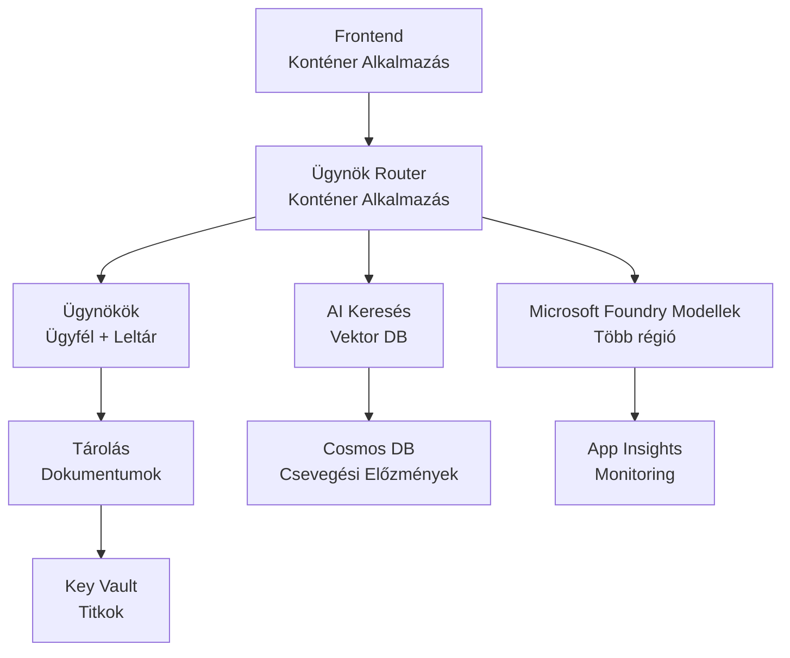

# Retail Multi-Agent Megoldás - Infrastruktúra Sablon

**5. fejezet: Termelési Telepítési Csomag**  
- **📚 Tanfolyam Kezdőlap**: [AZD Kezdőknek](../../README.md)  
- **📖 Kapcsolódó Fejezet**: [5. fejezet: Többügynökös AI megoldások](../../README.md#-chapter-5-multi-agent-ai-solutions-advanced)  
- **📝 Forgatókönyv Útmutató**: [Teljes Architektúra](../retail-scenario.md)  
- **🎯 Gyors Telepítés**: [Egyszeri Kattintásos Telepítés](#-quick-deployment)  

> **⚠️ CSAK INFRASTRUKTÚRA SABLON**  
> Ez az ARM sablon **Azure erőforrásokat** telepít egy többügynökös rendszerhez.  
>  
> **Mi kerül telepítésre (15-25 perc):**  
> - ✅ Microsoft Foundry Modellek (gpt-4.1, gpt-4.1-mini, beágyazások 3 régióban)  
> - ✅ AI Keresési szolgáltatás (üres, készen áll index létrehozására)  
> - ✅ Konténer Alkalmazások (helykitöltő képek, készen áll a kódodra)  
> - ✅ Tárolás, Cosmos DB, Key Vault, Application Insights  
>  
> **Mi NINCS benne (fejlesztés szükséges):**  
> - ❌ Ügynök implementációs kód (Ügyfél Ügynök, Készlet Ügynök)  
> - ❌ Útválasztási logika és API végpontok  
> - ❌ Frontend csevegő UI  
> - ❌ Keresési index sémák és adatcsatornák  
> - ❌ **Becsült fejlesztési idő: 80-120 óra**  
>  
> **Ezt a sablont használd, ha:**  
> - ✅ Azure infrastruktúrát szeretnél létrehozni egy többügynökös projekthez  
> - ✅ Külön kívánod fejleszteni az ügynök implementációt  
> - ✅ Termelésre kész infrastruktúra alapot szeretnél  
>  
> **Ne használd, ha:**  
> - ❌ Azonnali működő többügynökös demót vársz  
> - ❌ Teljes alkalmazáskód példákat keresel  

## Áttekintés

Ez a könyvtár egy átfogó Azure Resource Manager (ARM) sablont tartalmaz a többügynökös ügyféltámogatási rendszer **infrastruktúra alapjának** telepítéséhez. A sablon minden szükséges Azure szolgáltatást létrehoz, megfelelően konfigurálva és összekapcsolva, készen állva az alkalmazásfejlesztésre.

**Telepítés után rendelkezésre áll:** Termelésre kész Azure infrastruktúra  
**A rendszer befejezéséhez szükséges:** Ügynökkód, frontend UI és adatkonfiguráció (lásd [Architektúra Útmutató](../retail-scenario.md))

## 🎯 Mi kerül telepítésre

### Alap Infrastrukturális Elemei (Állapot Telepítés Után)

✅ **Microsoft Foundry Modellek Szolgáltatások** (API hívásokra készen)  
  - Elsődleges régió: gpt-4.1 telepítés (20K TPM kapacitás)  
  - Másodlagos régió: gpt-4.1-mini telepítés (10K TPM kapacitás)  
  - Harmadlagos régió: Szöveges beágyazás modell (30K TPM kapacitás)  
  - Értékelő régió: gpt-4.1 értékelő modell (15K TPM kapacitás)  
  - **Állapot:** Teljesen működőképes - azonnal API hívható  

✅ **Azure AI Keresés** (Üres - konfigurációra kész)  
  - Vektor keresés engedélyezve  
  - Szabványos szint 1 partícióval, 1 replikával  
  - **Állapot:** A szolgáltatás fut, de index létrehozás szükséges  
  - **Teendő:** Hozd létre a keresési indexet az adat sémád alapján  

✅ **Azure Tárolási Fiók** (Üres - feltöltésre kész)  
  - Blob konténerek: `documents`, `uploads`  
  - Biztonságos beállítás (csak HTTPS, nincs nyilvános hozzáférés)  
  - **Állapot:** Fájlok fogadására kész  
  - **Teendő:** Töltsd fel a termékinformációkat és dokumentumokat  

⚠️ **Konténer Alkalmazások Környezet** (Helykitöltő képek telepítve)  
  - Ügynök útválasztó alkalmazás (nginx alapértelmezett kép)  
  - Frontend alkalmazás (nginx alapértelmezett kép)  
  - Automatikus skálázás beállítva (0-10 példány)  
  - **Állapot:** Helykitöltő konténerek futnak  
  - **Teendő:** Fejleszd és telepítsd az ügynökalkalmazásaidat  

✅ **Azure Cosmos DB** (Üres - adatfogadásra kész)  
  - Adatbázis és konténer előkonfigurálva  
  - Alacsony késleltetésű műveletekre optimalizálva  
  - TTL engedélyezve automatikus tisztításhoz  
  - **Állapot:** Csevegéstörténet tárolására kész  

✅ **Azure Key Vault** (Opcionális - titkok tárolására kész)  
  - Soft delete engedélyezve  
  - RBAC beállítva kezelt identitásoknak  
  - **Állapot:** API kulcsok és kapcsolati stringek tárolására kész  

✅ **Application Insights** (Opcionális - aktív megfigyelés)  
  - Kapcsolódik a Log Analytics munkaterülethez  
  - Egyedi mérőszámok és riasztások konfigurálva  
  - **Állapot:** Telemetria gyűjtésére készen áll  

✅ **Dokumentum Intelligencia** (API hívásokra készen)  
  - S0 szint termelési terhelésekhez  
  - **Állapot:** Feltöltött dokumentumok feldolgozására készen  

✅ **Bing Search API** (API hívásokra készen)  
  - S1 szint valós idejű keresésekhez  
  - **Állapot:** Webes keresési lekérdezésekre készen  

### Telepítési Módok  

| Mód | OpenAI Kapacitás | Konténer Példányok | Keresési Szint | Tárolási Redundancia | Ajánlott Leírás |
|------|-----------------|---------------------|---------------|--------------------|---------------|
| **Minimális** | 10K-20K TPM | 0-2 replikák | Alap | LRS (helyi) | Fejlesztési/testelési, tanulási, proof-of-concept |
| **Standard** | 30K-60K TPM | 2-5 replikák | Standard | ZRS (zónás) | Termelés, mérsékelt forgalom (<10K felhasználó) |
| **Prémium** | 80K-150K TPM | 5-10 replikák, zóna-redundáns | Prémium | GRS (földrajzi) | Vállalati, nagy forgalom (>10K felhasználó), 99,99% SLA |

**Költséghatás:**  
- **Minimális → Standard:** kb. 4x költségnövekedés ($100-370/hó → $420-1,450/hó)  
- **Standard → Prémium:** kb. 3x költségnövekedés ($420-1,450/hó → $1,150-3,500/hó)  
- **Választás alapja:** Várt terhelés, SLA követelmények, költségvetés  

**Kapacitástervezés:**  
- **TPM (Tokens Per Minute):** Összesített minden modell telepítésen  
- **Konténer Példányok:** Automatikus skálázás tartománya (minimum-maximum replikák)  
- **Keresési Szint:** Befolyásolja a lekérdezési teljesítményt és index méret korlátokat  

## 📋 Előfeltételek

### Szükséges Eszközök  
1. **Azure CLI** (2.50.0 vagy újabb verzió)  
   ```bash
   az --version  # Verzió ellenőrzése
   az login      # Hitelesítés
   ```
  
2. **Aktív Azure előfizetés** Tulajdonos vagy Közreműködő hozzáféréssel  
   ```bash
   az account show  # Előfizetés ellenőrzése
   ```
  
### Szükséges Azure Kvóták

Telepítés előtt ellenőrizd a megfelelő kvótákat a cél régiókban:

```bash
# Ellenőrizze a Microsoft Foundry modellek elérhetőségét az Ön régiójában
az cognitiveservices account list-skus \
  --kind OpenAI \
  --location eastus2

# Ellenőrizze az OpenAI kvótát (példa a gpt-4.1-re)
az cognitiveservices usage list \
  --location eastus2 \
  --query "[?name.value=='OpenAI.Standard.gpt-4.1']"

# Ellenőrizze a Container Apps kvótát
az provider show \
  --namespace Microsoft.App \
  --query "resourceTypes[?resourceType=='managedEnvironments'].locations"
```
  
**Minimálisan Szükséges Kvóták:**  
- **Microsoft Foundry Modellek:** 3-4 modell telepítés régiók között  
  - gpt-4.1: 20K TPM (Token másodpercenként)  
  - gpt-4.1-mini: 10K TPM  
  - text-embedding-ada-002: 30K TPM  
  - **Megjegyzés:** gpt-4.1 helyenként várólistás – ellenőrizd [modell elérhetőség](https://learn.microsoft.com/azure/ai-services/openai/concepts/models)  
- **Konténer Alkalmazások:** Kezelt környezet + 2-10 konténer példány  
- **AI Keresés:** Standard szint (Alap nem elegendő vektor kereséshez)  
- **Cosmos DB:** Standard fenntartott áteresztő képesség  

**Ha nem elegendő a kvóta:**  
1. Menj az Azure Portál → Kvóták → Kérelem növelésére  
2. Vagy használd az Azure CLI-t:  
   ```bash
   az support tickets create \
     --ticket-name "OpenAI-Quota-Increase" \
     --severity "minimal" \
     --description "Request quota increase for Microsoft Foundry Models gpt-4.1 in eastus2"
   ```
3. Fontold meg alternatív régiókat elérhetőség szerint  

## 🚀 Gyors Telepítés

### 1. lehetőség: Azure CLI használata

```bash
# Klónozd vagy töltsd le a sablonfájlokat
git clone <repository-url>
cd examples/retail-multiagent-arm-template

# Tedd futtathatóvá a telepítő szkriptet
chmod +x deploy.sh

# Telepítés alapértelmezett beállításokkal
./deploy.sh -g myResourceGroup

# Telepítés éles környezetbe prémium funkciókkal
./deploy.sh -g myProdRG -e prod -m premium -l eastus2
```
  
### 2. lehetőség: Azure Portál használata

[](https://portal.azure.com/#create/Microsoft.Template/uri/https%3A%2F%2Fraw.githubusercontent.com%2Fmicrosoft%2Fazd-for-beginners%2Fmain%2Fexamples%2Fretail-multiagent-arm-template%2Fazuredeploy.json)

### 3. lehetőség: Azure CLI közvetlenül

```bash
# Erőforráscsoport létrehozása
az group create --name myResourceGroup --location eastus2

# Sablon telepítése
az deployment group create \
  --resource-group myResourceGroup \
  --template-file azuredeploy.json \
  --parameters azuredeploy.parameters.json
```
  
## ⏱️ Telepítési Idővonal

### Mire Számíthatsz

| Fázis | Időtartam | Mi történik |
|-------|----------|-------------|
| **Sablon Érvényesítés** | 30-60 másodperc | Azure ellenőrzi az ARM sablon szintaxisát és paramétereit |
| **Erőforrás Csoport létrehozás** | 10-20 másodperc | Erőforrás csoportot létrehozza (ha szükséges) |
| **OpenAI Előkészítés** | 5-8 perc | 3-4 OpenAI fiókot hoz létre és telepíti a modelleket |
| **Konténer Alkalmazások** | 3-5 perc | Környezetet hoz létre és helykitöltő konténereket telepít |
| **Keresés & Tárolás** | 2-4 perc | AI Keresést és tárolási fiókokat állít be |
| **Cosmos DB** | 2-3 perc | Adatbázist és konténereket készít elő |
| **Megfigyelés Beállítása** | 2-3 perc | Application Insights és Log Analytics konfigurálása |
| **RBAC-Konfiguráció** | 1-2 perc | Kezelt identitásokat és jogosultságokat állít be |
| **Össz Telepítés** | **15-25 perc** | Teljes infrastruktúra készen áll |

**Telepítés Után:**  
- ✅ **Infrastruktúra Kész:** Minden Azure szolgáltatás telepítve és fut  
- ⏱️ **Alkalmazásfejlesztés:** 80-120 óra (a te felelősséged)  
- ⏱️ **Index Konfiguráció:** 15-30 perc (a te sémád szükséges)  
- ⏱️ **Adatfeltöltés:** Változó a dataset méretétől függően  
- ⏱️ **Tesztelés & Ellenőrzés:** 2-4 óra  

---

## ✅ Telepítés Sikerességének Ellenőrzése

### 1. lépés: Erőforrások ellenőrzése (2 perc)

```bash
# Ellenőrizze, hogy az összes erőforrás sikeresen települt-e
az resource list \
  --resource-group myResourceGroup \
  --query "[?provisioningState!='Succeeded'].{Name:name, Status:provisioningState, Type:type}" \
  --output table
```
  
**Várt eredmény:** Üres tábla (minden erőforrásnál "Succeeded" állapot)  

### 2. lépés: Microsoft Foundry Modellek Telepítésének ellenőrzése (3 perc)

```bash
# Listázza az összes OpenAI fiókot
az cognitiveservices account list \
  --resource-group myResourceGroup \
  --query "[?kind=='OpenAI'].{Name:name, Location:location, Status:properties.provisioningState}" \
  --output table

# Ellenőrizze a modelltelepítéseket az elsődleges régióban
OPENAI_NAME=$(az cognitiveservices account list \
  --resource-group myResourceGroup \
  --query "[?kind=='OpenAI'] | [0].name" -o tsv)

az cognitiveservices account deployment list \
  --name $OPENAI_NAME \
  --resource-group myResourceGroup \
  --output table
```
  
**Várt eredmény:**  
- 3-4 OpenAI fiók (elsődleges, másodlagos, harmadlagos, értékelő régiók)  
- 1-2 modell telepítés fiókonként (gpt-4.1, gpt-4.1-mini, text-embedding-ada-002)  

### 3. lépés: Infrastruktúra végpontok tesztelése (5 perc)

```bash
# Konténer alkalmazás URL-ek lekérése
az containerapp list \
  --resource-group myResourceGroup \
  --query "[].{Name:name, URL:properties.configuration.ingress.fqdn, Status:properties.runningStatus}" \
  --output table

# Router végpont tesztelése (helyőrző kép fog válaszolni)
ROUTER_URL=$(az containerapp show \
  --name retail-router \
  --resource-group myResourceGroup \
  --query "properties.configuration.ingress.fqdn" -o tsv)

echo "Testing: https://$ROUTER_URL"
curl -I https://$ROUTER_URL || echo "Container running (placeholder image - expected)"
```
  
**Várt eredmény:**  
- Konténer Alkalmazások "Running" állapotban  
- Helykitöltő nginx HTTP 200 vagy 404 választ ad (még nincs alkalmazáskód)  

### 4. lépés: Microsoft Foundry Modellek API elérés tesztelése (3 perc)

```bash
# OpenAI végpont és kulcs lekérése
OPENAI_ENDPOINT=$(az cognitiveservices account show \
  --name $OPENAI_NAME \
  --resource-group myResourceGroup \
  --query "properties.endpoint" -o tsv)

OPENAI_KEY=$(az cognitiveservices account keys list \
  --name $OPENAI_NAME \
  --resource-group myResourceGroup \
  --query "key1" -o tsv)

# gpt-4.1 telepítés tesztelése
curl "${OPENAI_ENDPOINT}openai/deployments/gpt-4.1/chat/completions?api-version=2024-08-01-preview" \
  -H "Content-Type: application/json" \
  -H "api-key: $OPENAI_KEY" \
  -d '{
    "messages": [{"role": "user", "content": "Say hello"}],
    "max_tokens": 10
  }'
```
  
**Várt eredmény:** JSON válasz chat kiegészítéssel (megerősíti OpenAI működését)  

### Mi működik és mi nem

**✅ Működik telepítés után:**  
- Microsoft Foundry Modellek telepítve, API hívások fogadására készek  
- AI Keresési szolgáltatás fut (üres, még nincs index)  
- Konténer Alkalmazások futnak (helykitöltő nginx képekkel)  
- Tárolási fiókok elérhetők, feltöltésre kész  
- Cosmos DB készen áll adatműveletekre  
- Application Insights gyűjti az infrastruktúra telemetriát  
- Key Vault készen áll titkok tárolására  

**❌ Még nem működik (fejlesztést igényel):**  
- Ügynök végpontok (nincs alkalmazáskód telepítve)  
- Csevegő funkciók (frontend + backend implementáció szükséges)  
- Keresési lekérdezések (még nincs létrehozott index)  
- Dokumentum feldolgozó adatcsatorna (nincs adat feltöltve)  
- Egyedi telemetria (alkalmazás instrumentáció szükséges)  

**Következő lépések:** Lásd [Post-Telepítés Konfiguráció](#-post-deployment-next-steps), hogy fejleszd és telepítsd az alkalmazásodat  

---

## ⚙️ Konfigurációs Opciók

### Sablon Paraméterek

| Paraméter | Típus | Alapértelmezett | Leírás |
|-----------|-------|-----------------|--------|
| `projectName` | string | "retail" | Erőforrásnevek előtagja |
| `location` | string | Erőforrás csoport helyszíne | Elsődleges telepítési régió |
| `secondaryLocation` | string | "westus2" | Másodlagos régió több régiós telepítéshez |
| `tertiaryLocation` | string | "francecentral" | Régió a beágyazó modellhez |
| `environmentName` | string | "dev" | Környezet megjelölése (dev/staging/prod) |
| `deploymentMode` | string | "standard" | Telepítési konfiguráció (minimal/standard/premium) |
| `enableMultiRegion` | bool | true | Több régiós telepítés engedélyezése |
| `enableMonitoring` | bool | true | Application Insights és naplózás engedélyezése |
| `enableSecurity` | bool | true | Key Vault és megerősített biztonság engedélyezése |

### Paraméterek Testreszabása

Szerkeszd az `azuredeploy.parameters.json` fájlt:

```json
{
  "$schema": "https://schema.management.azure.com/schemas/2019-04-01/deploymentParameters.json#",
  "contentVersion": "1.0.0.0",
  "parameters": {
    "projectName": {
      "value": "mycompany"
    },
    "environmentName": {
      "value": "prod"
    },
    "deploymentMode": {
      "value": "premium"
    },
    "location": {
      "value": "eastus2"
    }
  }
}
```
  
## 🏗️ Architektúra Áttekintés


## 📖 Telepítési Szkript Használata

A `deploy.sh` script interaktív telepítési élményt nyújt:

```bash
# Segítség megjelenítése
./deploy.sh --help

# Alap telepítés
./deploy.sh -g myResourceGroup

# Haladó telepítés egyedi beállításokkal
./deploy.sh \
  -g myProductionRG \
  -p companyname \
  -e prod \
  -m premium \
  -l eastus2

# Fejlesztői telepítés több régió nélküli
./deploy.sh \
  -g myDevRG \
  -e dev \
  -m minimal \
  --no-multi-region \
  --no-security
```
  
### Szkript Funkciók

- ✅ **Előfeltételek ellenőrzése** (Azure CLI, bejelentkezés, sablon fájlok)  
- ✅ **Erőforrás csoport kezelése** (ha nincs, létrehozza)  
- ✅ **Sablon érvényesítés** telepítés előtt  
- ✅ **Folyamatkövetés** színes kimenettel  
- ✅ **Telepítési eredmények megjelenítése**  
- ✅ **Telepítés utáni útmutató**

## 📊 Telepítés Monitorozása

### Telepítési Állapot Ellenőrzése

```bash
# Telepítések listázása
az deployment group list --resource-group myResourceGroup --output table

# Telepítés részleteinek lekérése
az deployment group show \
  --resource-group myResourceGroup \
  --name retail-deployment-YYYYMMDD-HHMMSS

# Telepítés előrehaladásának figyelése
az deployment group create \
  --resource-group myResourceGroup \
  --template-file azuredeploy.json \
  --parameters azuredeploy.parameters.json \
  --verbose
```
  
### Telepítési Kimenetek

Sikeres telepítés után elérhető kimenetek:

- **Frontend URL:** Nyilvános végpont a webes felülethez  
- **Router URL:** API végpont az ügynök útválasztóhoz  
- **OpenAI Végpontok:** Elsődleges és másodlagos OpenAI szolgáltatási végpontok  
- **Keresési Szolgáltatás:** Azure AI Keresési szolgáltatás végpontja  
- **Tárolási Fiók:** A tárolási fiók neve a dokumentumokhoz  
- **Key Vault:** Key Vault neve (ha engedélyezve)  
- **Application Insights:** Megfigyelési szolgáltatás neve (ha engedélyezve)  

## 🔧 Telepítés Utáni Teendők


> **📝 Fontos:** Az infrastruktúra telepítve van, de az alkalmazáskód fejlesztése és telepítése a te feladatod.

### 1. fázis: Ügynökalkalmazások fejlesztése (a te felelősséged)

Az ARM sablon **üres Container Appokat** hoz létre helyőrző nginx képekkel. Neked a következőket kell tenned:

**Szükséges fejlesztés:**
1. **Ügynök megvalósítása** (30-40 óra)
   - Ügyfélszolgálati ügynök gpt-4.1 integrációval
   - Készletkezelő ügynök gpt-4.1-mini integrációval
   - Ügynök útvonal-kezelési logika

2. **Frontend fejlesztés** (20-30 óra)
   - Csevegőfelület UI (React/Vue/Angular)
   - Fájl feltöltési funkció
   - Válaszok megjelenítése és formázása

3. **Backend szolgáltatások** (12-16 óra)
   - FastAPI vagy Express router
   - Hitelesítés köztes szoftver
   - Telemetria integráció

**Nézd meg:** [Architektúra útmutató](../retail-scenario.md) a részletes megvalósítási mintákért és kódpéldákért

### 2. fázis: AI keresési index konfigurálása (15-30 perc)

Hozz létre egy keresési indexet, amely megfelel az adatmodellnek:

```bash
# Keresési szolgáltatás részleteinek lekérése
SEARCH_NAME=$(az search service list \
  --resource-group myResourceGroup \
  --query "[0].name" -o tsv)

SEARCH_KEY=$(az search admin-key show \
  --service-name $SEARCH_NAME \
  --resource-group myResourceGroup \
  --query "primaryKey" -o tsv)

# Index létrehozása a sémád szerint (példa)
curl -X POST "https://${SEARCH_NAME}.search.windows.net/indexes?api-version=2023-11-01" \
  -H "Content-Type: application/json" \
  -H "api-key: ${SEARCH_KEY}" \
  -d '{
    "name": "products",
    "fields": [
      {"name": "id", "type": "Edm.String", "key": true},
      {"name": "title", "type": "Edm.String", "searchable": true},
      {"name": "content", "type": "Edm.String", "searchable": true},
      {"name": "category", "type": "Edm.String", "filterable": true},
      {"name": "content_vector", "type": "Collection(Edm.Single)", 
       "searchable": true, "dimensions": 1536, "vectorSearchProfile": "default"}
    ],
    "vectorSearch": {
      "algorithms": [{"name": "default", "kind": "hnsw"}],
      "profiles": [{"name": "default", "algorithm": "default"}]
    }
  }'
```

**Erőforrások:**
- [AI keresési index séma tervezése](https://learn.microsoft.com/azure/search/search-what-is-an-index)
- [Vektor keresés konfigurálása](https://learn.microsoft.com/azure/search/vector-search-how-to-create-index)

### 3. fázis: Adatok feltöltése (az idő változó)

Miután megvannak a termékadatok és dokumentumok:

```bash
# Tárolófiók adatainak lekérése
STORAGE_NAME=$(az storage account list \
  --resource-group myResourceGroup \
  --query "[0].name" -o tsv)

STORAGE_KEY=$(az storage account keys list \
  --account-name $STORAGE_NAME \
  --resource-group myResourceGroup \
  --query "[0].value" -o tsv)

# Dokumentumok feltöltése
az storage blob upload-batch \
  --destination documents \
  --source /path/to/your/product/docs \
  --account-name $STORAGE_NAME \
  --account-key $STORAGE_KEY

# Példa: Egyetlen fájl feltöltése
az storage blob upload \
  --container-name documents \
  --name "product-manual.pdf" \
  --file /path/to/product-manual.pdf \
  --account-name $STORAGE_NAME \
  --account-key $STORAGE_KEY
```

### 4. fázis: Alkalmazások építése és telepítése (8-12 óra)

Miután elkészült az ügynökkód:

```bash
# 1. Azure Container Registry létrehozása (ha szükséges)
az acr create \
  --name myregistry \
  --resource-group myResourceGroup \
  --sku Basic

# 2. Agent router kép építése és feltöltése
docker build -t myregistry.azurecr.io/agent-router:v1 /path/to/your/router/code
az acr login --name myregistry
docker push myregistry.azurecr.io/agent-router:v1

# 3. Frontend kép építése és feltöltése
docker build -t myregistry.azurecr.io/frontend:v1 /path/to/your/frontend/code
docker push myregistry.azurecr.io/frontend:v1

# 4. Container Apps frissítése a képeiddel
az containerapp update \
  --name retail-router \
  --resource-group myResourceGroup \
  --image myregistry.azurecr.io/agent-router:v1

az containerapp update \
  --name retail-frontend \
  --resource-group myResourceGroup \
  --image myregistry.azurecr.io/frontend:v1

# 5. Környezeti változók konfigurálása
az containerapp update \
  --name retail-router \
  --resource-group myResourceGroup \
  --set-env-vars \
    OPENAI_ENDPOINT=secretref:openai-endpoint \
    OPENAI_KEY=secretref:openai-key \
    SEARCH_ENDPOINT=secretref:search-endpoint \
    SEARCH_KEY=secretref:search-key
```

### 5. fázis: Alkalmazás tesztelése (2-4 óra)

```bash
# Szerezze be az alkalmazás URL-címét
ROUTER_URL=$(az containerapp show \
  --name retail-router \
  --resource-group myResourceGroup \
  --query "properties.configuration.ingress.fqdn" -o tsv)

# Tesztügynök végpont (amikor a kód telepítve van)
curl -X POST "https://${ROUTER_URL}/chat" \
  -H "Content-Type: application/json" \
  -d '{
    "message": "Hello, I need help with my order",
    "agent": "customer"
  }'

# Alkalmazás naplók ellenőrzése
az containerapp logs show \
  --name retail-router \
  --resource-group myResourceGroup \
  --follow
```

### Megvalósítási erőforrások

**Architektúra és tervezés:**
- 📖 [Teljes architektúra útmutató](../retail-scenario.md) – Részletes megvalósítási minták
- 📖 [Multi-ügynök tervezési minták](https://learn.microsoft.com/azure/architecture/ai-ml/guide/multi-agent-systems)

**Kódpéldák:**
- 🔗 [Microsoft Foundry Models Chat minta](https://github.com/Azure-Samples/azure-search-openai-demo) – RAG minta
- 🔗 [Semantic Kernel](https://github.com/microsoft/semantic-kernel) – Ügynök keretrendszer (C#)
- 🔗 [LangChain Azure](https://github.com/langchain-ai/langchain) – Ügynök koordináció (Python)
- 🔗 [AutoGen](https://github.com/microsoft/autogen) – Többügynök beszélgetések

**Becsült összes erőfeszítés:**
- Infrastruktúra telepítés: 15-25 perc (✅ Kész)
- Alkalmazás fejlesztés: 80-120 óra (🔨 A te feladatod)
- Tesztelés és optimalizálás: 15-25 óra (🔨 A te feladatod)

## 🛠️ Hibakeresés

### Gyakori problémák

#### 1. Microsoft Foundry Models kvóta túllépés

```bash
# Ellenőrizze az aktuális kvóta használatot
az cognitiveservices usage list --location eastus2

# Kvóta növelésének kérése
az support tickets create \
  --ticket-name "OpenAI-Quota-Increase" \
  --severity "minimal" \
  --description "Request quota increase for Microsoft Foundry Models in region X"
```

#### 2. Container Apps telepítése sikertelen

```bash
# Konténeralkalmazás naplóinak ellenőrzése
az containerapp logs show \
  --name retail-router \
  --resource-group myResourceGroup \
  --follow

# Konténeralkalmazás újraindítása
az containerapp revision restart \
  --name retail-router \
  --resource-group myResourceGroup
```

#### 3. Keresőszolgáltatás inicializálása

```bash
# Ellenőrizze a keresési szolgáltatás állapotát
az search service show \
  --name <search-service-name> \
  --resource-group myResourceGroup

# Tesztelje a keresési szolgáltatás kapcsolódását
curl -X GET "https://<search-service-name>.search.windows.net/indexes?api-version=2023-11-01" \
  -H "api-key: <search-admin-key>"
```

### Telepítés ellenőrzése

```bash
# Ellenőrizze, hogy minden erőforrás létre van-e hozva
az resource list \
  --resource-group myResourceGroup \
  --output table

# Erőforrás állapotának ellenőrzése
az resource list \
  --resource-group myResourceGroup \
  --query "[?provisioningState!='Succeeded'].{Name:name, Status:provisioningState, Type:type}" \
  --output table
```

## 🔐 Biztonsági szempontok

### Kulcskezelés
- Minden titok az Azure Key Vaultban tárolódik (ha engedélyezve van)
- A Container appok kezelt identitást használnak hitelesítéshez
- A tárolók biztonságos alapbeállításokkal rendelkeznek (csak HTTPS, nincs nyilvános blob hozzáférés)

### Hálózati biztonság
- A Container appok belső hálózatot használnak, amennyire lehetséges
- A keresőszolgáltatás privát végpont opcióval van konfigurálva
- A Cosmos DB minimálisan szükséges jogosultságokkal van beállítva

### RBAC konfiguráció
```bash
# Szükséges szerepkörök hozzárendelése a kezelt identitáshoz
az role assignment create \
  --assignee <container-app-managed-identity> \
  --role "Cognitive Services OpenAI User" \
  --scope <openai-resource-id>
```

## 💰 Költségoptimalizálás

### Költségbecslések (havonta, USD)

| Mód | OpenAI | Container Apps | Keresés | Tárolás | Össz. becslés |
|------|--------|----------------|--------|---------|------------|
| Minimális | $50-200 | $20-50 | $25-100 | $5-20 | $100-370 |
| Standard | $200-800 | $100-300 | $100-300 | $20-50 | $420-1450 |
| Prémium | $500-2000 | $300-800 | $300-600 | $50-100 | $1150-3500 |

### Költségfigyelés

```bash
# Költségkeret-értesítések beállítása
az consumption budget create \
  --account-name <subscription-id> \
  --budget-name "retail-budget" \
  --amount 500 \
  --time-grain Monthly \
  --start-date 2024-01-01 \
  --end-date 2024-12-31
```

## 🔄 Frissítések és karbantartás

### Sablon frissítések
- ARM sablonfájlok verziókövetése
- Változtatások tesztelése először fejlesztői környezetben
- Inkremens telepítési mód használata frissítésekhez

### Erőforrás frissítések
```bash
# Frissítés új paraméterekkel
az deployment group create \
  --resource-group myResourceGroup \
  --template-file azuredeploy.json \
  --parameters azuredeploy.parameters.json \
  --mode Incremental
```

### Biztonsági mentés és helyreállítás
- Cosmos DB automatikus biztonsági mentés engedélyezve
- Key Vault soft delete engedélyezve
- Container app verziók fenntartása visszaállításhoz

## 📞 Támogatás

- **Sablon problémák:** [GitHub Issues](https://github.com/microsoft/azd-for-beginners/issues)
- **Azure támogatás:** [Azure Support Portal](https://portal.azure.com/#blade/Microsoft_Azure_Support/HelpAndSupportBlade)
- **Közösség:** [Azure AI Discord](https://discord.gg/microsoft-azure)

---

**⚡ Készen állsz a többügynökös megoldásod telepítésére?**

Indítsd ezzel: `./deploy.sh -g myResourceGroup`

---

<!-- CO-OP TRANSLATOR DISCLAIMER START -->
**Jogi nyilatkozat**:  
Ezt a dokumentumot az AI fordító szolgáltatás [Co-op Translator](https://github.com/Azure/co-op-translator) segítségével fordítottuk le. Míg az pontosságra törekszünk, kérjük, vegye figyelembe, hogy az automatikus fordítások hibákat vagy pontatlanságokat tartalmazhatnak. Az eredeti dokumentum annak anyanyelvén tekintendő hiteles forrásnak. Kritikus információk esetén professzionális emberi fordítást javaslunk. Nem vállalunk felelősséget a fordítás használatából eredő félreértésekért vagy félreértelmezésekért.
<!-- CO-OP TRANSLATOR DISCLAIMER END -->