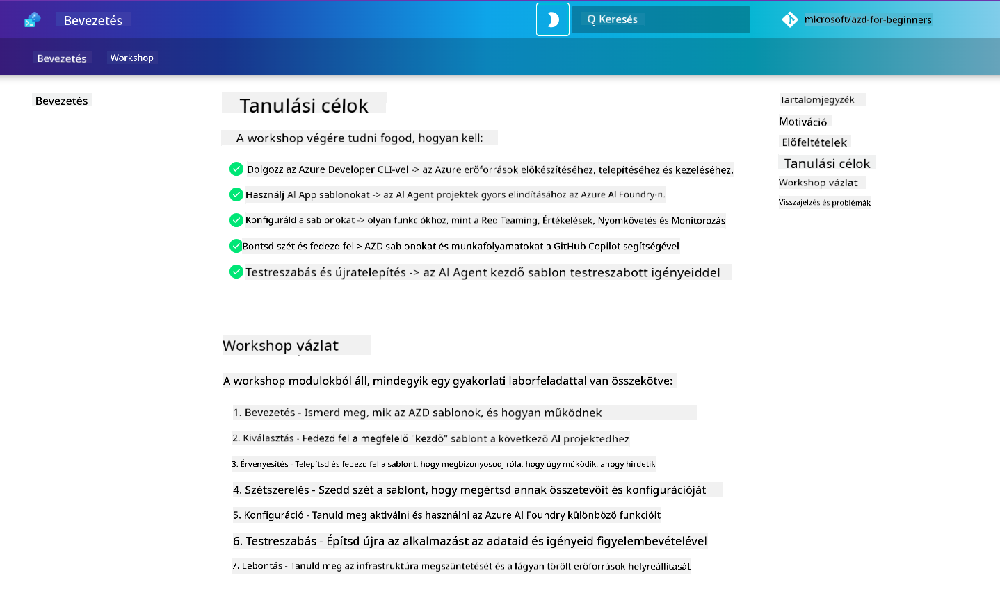

<!--
CO_OP_TRANSLATOR_METADATA:
{
  "original_hash": "9cc966416ab431c38b2ab863884b196c",
  "translation_date": "2025-09-25T00:50:07+00:00",
  "source_file": "workshop/README.md",
  "language_code": "hu"
}
-->
# AZD az AI fejlesztők workshopja

Üdvözlünk az Azure Developer CLI (AZD) gyakorlati workshopján, amely az AI alkalmazások telepítésére összpontosít. Ez a workshop segít gyakorlati ismereteket szerezni az AZD sablonokról 3 lépésben:

1. **Felfedezés** - találd meg a számodra megfelelő sablont.
1. **Telepítés** - telepítsd és ellenőrizd, hogy működik-e.
1. **Testreszabás** - módosítsd és alakítsd a saját igényeid szerint!

A workshop során megismerkedsz alapvető fejlesztői eszközökkel és munkafolyamatokkal is, amelyek segítenek az end-to-end fejlesztési folyamatok egyszerűsítésében.

<br/>

## Böngésző-alapú útmutató

A workshop leckéi Markdown formátumban vannak. Közvetlenül a GitHub-on böngészheted őket, vagy elindíthatsz egy böngésző-alapú előnézetet, ahogy az alábbi képernyőképen látható.



Ehhez az opcióhoz forkolnod kell a repót a profilodra, majd elindítanod a GitHub Codespaces-t. Amikor a VS Code terminál aktív, írd be ezt a parancsot:

```bash title="" linenums="0"
mkdocs serve > /dev/null 2>&1 &
```

Néhány másodperc múlva megjelenik egy felugró párbeszédablak. Válaszd az `Open in browser` opciót. Az útmutató most megnyílik egy új böngészőfülön. Az előnézet néhány előnye:

1. **Beépített keresés** - gyorsan megtalálhatod a kulcsszavakat vagy leckéket.
1. **Másolás ikon** - kódblokkok fölé húzva megjelenik ez az opció.
1. **Téma váltás** - válthatsz sötét és világos témák között.
1. **Segítség kérése** - kattints a Discord ikonra a láblécben, hogy csatlakozz!

<br/>

## Workshop áttekintés

**Időtartam:** 3-4 óra  
**Szint:** Kezdő és középhaladó  
**Előfeltételek:** Alapismeretek az Azure-ról, AI koncepciókról, VS Code-ról és parancssori eszközökről.

Ez egy gyakorlati workshop, ahol tanulás közben cselekszel. Miután elvégezted a gyakorlatokat, javasoljuk, hogy tekintsd át az AZD kezdőknek szóló tananyagot, hogy folytathasd a tanulási utadat a biztonsági és produktivitási legjobb gyakorlatok irányába.

| Idő | Modul  | Cél |
|:---|:---|:---|
| 15 perc | [Bevezetés](docs/instructions/0-Introduction.md) | Célok megértése, alapok lefektetése |
| 30 perc | [AI sablon kiválasztása](docs/instructions/1-Select-AI-Template.md) | Opciók felfedezése és kezdő sablon kiválasztása | 
| 30 perc | [AI sablon validálása](docs/instructions/2-Validate-AI-Template.md) | Alapértelmezett megoldás telepítése az Azure-ra |
| 30 perc | [AI sablon elemzése](docs/instructions/3-Deconstruct-AI-Template.md) | Struktúra és konfiguráció felfedezése |
| 30 perc | [AI sablon konfigurálása](docs/instructions/4-Configure-AI-Template.md) | Funkciók aktiválása és kipróbálása |
| 30 perc | [AI sablon testreszabása](docs/instructions/5-Customize-AI-Template.md) | Sablon adaptálása saját igényekhez |
| 30 perc | [Infrastruktúra lebontása](docs/instructions/6-Teardown-Infrastructure.md) | Erőforrások felszabadítása és takarítás |
| 15 perc | [Összegzés és következő lépések](docs/instructions/7-Wrap-up.md) | Tanulási források, workshop kihívás |

<br/>

## Amit megtanulsz

Az AZD sablonokat tekintsd egy tanulási homokozónak, amely lehetőséget ad különböző képességek és eszközök felfedezésére az Azure AI Foundry end-to-end fejlesztési környezetében. A workshop végére intuitív megértést szerezhetsz az eszközökről és koncepciókról ebben a kontextusban.

| Koncepció  | Cél |
|:---|:---|
| **Azure Developer CLI** | Eszközparancsok és munkafolyamatok megértése |
| **AZD sablonok**| Projektstruktúra és konfiguráció megértése |
| **Azure AI Agent**| Azure AI Foundry projekt létrehozása és telepítése |
| **Azure AI Search**| Kontextus mérnöki munka engedélyezése ügynökökkel |
| **Megfigyelhetőség**| Nyomkövetés, monitorozás és értékelés felfedezése |
| **Red Teaming**| Adverzárius tesztelés és enyhítési stratégiák felfedezése |

<br/>

## Workshop felépítése

A workshop célja, hogy végigvezessen a sablon felfedezésétől a telepítésen, elemzésen és testreszabáson keresztül - az [AI ügynökök kezdő sablonja](https://github.com/Azure-Samples/get-started-with-ai-agents) hivatalos sablon alapján.

### [1. modul: AI sablon kiválasztása](docs/instructions/1-Select-AI-Template.md) (30 perc)

- Mik azok az AI sablonok?
- Hol találhatók AI sablonok?
- Hogyan kezdhetek el AI ügynököket építeni?
- **Lab**: Gyorsindítás GitHub Codespaces-szel

### [2. modul: AI sablon validálása](docs/instructions/2-Validate-AI-Template.md) (30 perc)

- Mi az AI sablon architektúrája?
- Mi az AZD fejlesztési munkafolyamat?
- Hogyan kaphatok segítséget AZD fejlesztéshez?
- **Lab**: AI ügynök sablon telepítése és validálása

### [3. modul: AI sablon elemzése](docs/instructions/3-Deconstruct-AI-Template.md) (30 perc)

- Környezet felfedezése `.azure/` mappában
- Erőforrás beállítás felfedezése `infra/` mappában
- AZD konfiguráció felfedezése `azure.yaml` fájlokban
- **Lab**: Környezeti változók módosítása és újratelepítés

### [4. modul: AI sablon konfigurálása](docs/instructions/4-Configure-AI-Template.md) (30 perc)
- Felfedezés: Retrieval Augmented Generation
- Felfedezés: Ügynök értékelés és Red Teaming
- Felfedezés: Nyomkövetés és monitorozás
- **Lab**: AI ügynök + megfigyelhetőség felfedezése

### [5. modul: AI sablon testreszabása](docs/instructions/5-Customize-AI-Template.md) (30 perc)
- Meghatározás: PRD forgatókönyv követelményekkel
- Konfigurálás: Környezeti változók AZD-hez
- Implementálás: Lifecycle Hooks további feladatokhoz
- **Lab**: Sablon testreszabása saját forgatókönyvhöz

### [6. modul: Infrastruktúra lebontása](docs/instructions/6-Teardown-Infrastructure.md) (30 perc)
- Összefoglalás: Mik azok az AZD sablonok?
- Összefoglalás: Miért használjuk az Azure Developer CLI-t?
- Következő lépések: Próbálj ki egy másik sablont!
- **Lab**: Infrastruktúra lebontása és takarítás

<br/>

## Workshop kihívás

Szeretnéd magad nagyobb kihívás elé állítani? Íme néhány projektjavaslat - vagy oszd meg velünk saját ötleteidet!

| Projekt | Leírás |
|:---|:---|
|1. **Egy összetett AI sablon elemzése** | Használd az általunk bemutatott munkafolyamatot és eszközöket, és próbálj meg telepíteni, validálni és testreszabni egy másik AI megoldás sablont. _Mit tanultál?_|
|2. **Testreszabás saját forgatókönyvvel**  | Próbálj meg írni egy PRD-t (Product Requirements Document) egy másik forgatókönyvhöz. Ezután használd a GitHub Copilotot a sablon repódban ügynök modellben - és kérd meg, hogy generáljon testreszabási munkafolyamatot számodra. _Mit tanultál? Hogyan tudnád továbbfejleszteni ezeket a javaslatokat?_|
| | |

## Van visszajelzésed?

1. Nyiss egy issue-t ebben a repóban - címkézd `Workshop`-ként az egyszerűség kedvéért.
1. Csatlakozz az Azure AI Foundry Discordhoz - lépj kapcsolatba társaiddal!

| | | 
|:---|:---|
| **📚 Kurzus kezdőlapja**| [AZD kezdőknek](../README.md)|
| **📖 Dokumentáció** | [AI sablonok kezdő lépései](https://learn.microsoft.com/en-us/azure/ai-foundry/how-to/develop/ai-template-get-started)|
| **🛠️AI sablonok** | [Azure AI Foundry sablonok](https://ai.azure.com/templates) |
|**🚀 Következő lépések** | [Próbáld ki a kihívást](../../../workshop) |
| | |

<br/>

---

**Előző:** [AI hibaelhárítási útmutató](../docs/troubleshooting/ai-troubleshooting.md) | **Következő:** Kezdj az [1. Lab: AZD alapok](../../../workshop/lab-1-azd-basics)

**Készen állsz AI alkalmazások építésére AZD-vel?**

[Indítsd el az 1. Labot: AZD alapok →](./lab-1-azd-basics/README.md)

---

