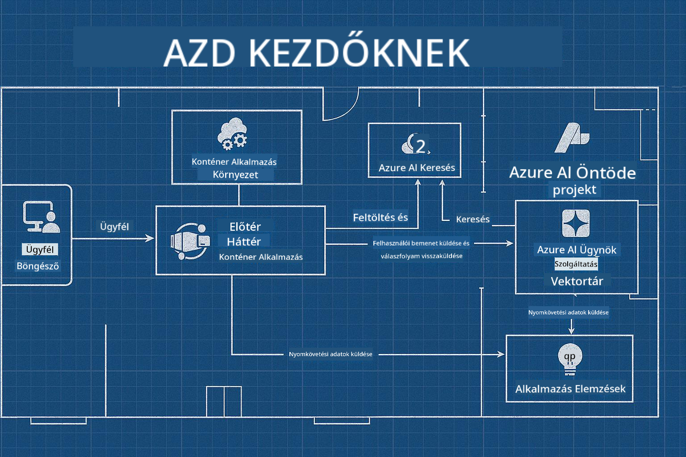

<!--
CO_OP_TRANSLATOR_METADATA:
{
  "original_hash": "245d24997bbcf2bae93bb2a503845d37",
  "translation_date": "2025-09-23T12:02:50+00:00",
  "source_file": "workshop/README.md",
  "language_code": "hu"
}
-->
# AZD az AI fejlesztők workshopjához

## AZD sablonok

Egy vállalati szintű AI alkalmazás megoldás felépítése az adott forgatókönyvhöz nagyon hasonlít ahhoz, mintha saját otthont építenél. Megtervezheted magad, tégláról téglára felépítheted, és vállalhatod a felelősséget azért, hogy megfeleljen minden irányelvnek és fejlesztési követelménynek.

**VAGY ....**

Dolgozhatsz egy építésszel, aki ad neked egy _tervrajzot_ egy kezdő otthonhoz, majd együtt dolgozhattok azon, hogy _testre szabjátok_ azt az igényeid szerint. Ez lehetővé teszi, hogy arra koncentrálj, ami **az otthonodat** különlegessé teszi, miközben a vezetékek, vízvezetékek és egyéb függőségek kezelését az szakértőkre bízhatod.

**Ez a megközelítés áll az [AI App Templates](https://ai.azure.com/templates)** mögött - egy sor tervrajz különböző típusú AI alkalmazás "otthonok" építéséhez, az alapvető igényeid és függőségeid alapján.

## Sablon testreszabása

A sablonokat úgy tervezték, hogy működjenek az [Azure AI Foundry](https://ai.azure.com) platformmal. Gondolj erre a platformra úgy, mint a "kiviteleződre", amely hozzáférést biztosít minden erőforráshoz, eszközhöz és szakértelemhez, amire szükséged van a munka elvégzéséhez!

Csak ki kell választanod [a kezdő sablonodat](https://learn.microsoft.com/en-us/azure/ai-foundry/how-to/develop/ai-template-get-started). Például, mi az _Get Started with AI Agents_ sablonra fogunk összpontosítani, hogy felépítsünk egy "Agentic AI Home"-ot, amely olyan funkciókkal van ellátva, mint az AI keresés, Red Teaming, értékelések, nyomkövetés, monitorozás és még sok más!



Csak időpontot kell foglalnod az építésszel, hogy végigvezessen a testreszabási folyamaton. [GitHub Copilot for Azure](https://learn.microsoft.com/en-us/azure/developer/github-copilot-azure/get-started) lehet az útmutatód. Csak "beszélgess vele", hogy:

- Megismerd a sablonodban található Azure funkciókat
- Azure erőforrásokat telepíts
- Információt kapj a telepítésedről
- Diagnosztizáld és elhárítsd a problémákat!

Ebben a workshopban megtanuljuk, hogyan _bontjuk le_ a meglévő sablont (hogy megértsük, mit nyújt), majd _testre szabjuk_ (hogy megfeleljen az igényeinknek) - lépésről lépésre.

Az AI sablonok **működnek** - a workshop elvégzésével megtanulod, hogyan **teheted sajátoddá**.

----

**Workshop navigáció**
- **📚 Kurzus kezdőlapja**: [AZD kezdőknek](../README.md)
- **📖 Kapcsolódó fejezetek**: Lefedi [1. fejezetet](../README.md#-chapter-1-foundation--quick-start), [2. fejezetet](../README.md#-chapter-2-ai-first-development-recommended-for-ai-developers), és [5. fejezetet](../README.md#-chapter-5-multi-agent-ai-solutions-advanced)
- **🛠️ Gyakorlati labor**: [AI Workshop Lab](../docs/ai-foundry/ai-workshop-lab.md)
- **🚀 Következő lépések**: [Workshop Lab modulok](../../../workshop)

Üdvözlünk az Azure Developer CLI (AZD) tanulására fókuszáló gyakorlati workshopon, amely az AI alkalmazások telepítésére összpontosít. Ez a workshop célja, hogy az AZD alapjaitól eljuttasson a termelésre kész AI megoldások telepítéséig.

## Workshop áttekintés

**Időtartam:** 2-3 óra  
**Szint:** Kezdő-től középhaladóig  
**Előfeltételek:** Alapvető ismeretek az Azure-ról, parancssori eszközökről és AI fogalmakról

### Amit megtanulsz

- **AZD alapok**: Infrastruktúra mint kód megértése AZD-vel
- 🤖 **AI szolgáltatások integrációja**: Azure OpenAI, AI keresés és más AI szolgáltatások telepítése
- **Konténer telepítés**: Azure Container Apps használata AI alkalmazásokhoz
- **Biztonsági legjobb gyakorlatok**: Kezelt identitás és biztonságos konfigurációk megvalósítása
- **Monitorozás és megfigyelhetőség**: Application Insights beállítása AI munkaterhelésekhez
- **Termelési minták**: Vállalati szintű telepítési stratégiák

## Workshop felépítése

### 1. modul: AZD alapok (30 perc)
- AZD telepítése és konfigurálása
- AZD projektstruktúra megértése
- Az első AZD telepítésed
- **Labor**: Egyszerű webalkalmazás telepítése

### 2. modul: Azure OpenAI integráció (45 perc)
- Azure OpenAI erőforrások beállítása
- Modell telepítési stratégiák
- API hozzáférés és hitelesítés konfigurálása
- **Labor**: Chat alkalmazás telepítése GPT-4-gyel

### 3. modul: RAG alkalmazások (45 perc)
- Azure AI keresés integrációja
- Dokumentumfeldolgozás Azure Document Intelligence segítségével
- Vektor beágyazások és szemantikus keresés
- **Labor**: Dokumentum Q&A rendszer építése

### 4. modul: Termelési telepítés (30 perc)
- Konténer alkalmazások konfigurálása
- Skálázás és teljesítmény optimalizálás
- Monitorozás és naplózás
- **Labor**: Telepítés termelésbe megfigyelhetőséggel

### 5. modul: Haladó minták (15 perc)
- Több környezet telepítése
- CI/CD integráció
- Költségoptimalizálási stratégiák
- **Összegzés**: Termelési készség ellenőrzőlista

## Előfeltételek

### Szükséges eszközök

Kérjük, telepítsd ezeket az eszközöket a workshop előtt:

```bash
# Azure Developer CLI
curl -fsSL https://aka.ms/install-azd.sh | bash

# Azure CLI
curl -sL https://aka.ms/InstallAzureCLIDeb | sudo bash

# Git
sudo apt-get install git

# Docker
curl -fsSL https://get.docker.com -o get-docker.sh
sudo sh get-docker.sh

# Python 3.10+
sudo apt-get install python3.10 python3.10-venv python3-pip
```

### Azure fiók beállítása

1. **Azure előfizetés**: [Regisztrálj ingyen](https://azure.microsoft.com/free/)
2. **Azure OpenAI hozzáférés**: [Kérj hozzáférést](https://aka.ms/oai/access)
3. **Szükséges jogosultságok**:
   - Contributor szerepkör az előfizetésen vagy erőforráscsoporton
   - User Access Administrator (RBAC hozzárendelésekhez)

### Előfeltételek ellenőrzése

Futtasd ezt a szkriptet a beállítás ellenőrzéséhez:

```bash
#!/bin/bash
echo "Verifying workshop prerequisites..."

# Check AZD installation
if command -v azd &> /dev/null; then
    echo "✅ Azure Developer CLI: $(azd --version)"
else
    echo "❌ Azure Developer CLI not found"
fi

# Check Azure CLI
if command -v az &> /dev/null; then
    echo "✅ Azure CLI: $(az --version | head -n1)"
else
    echo "❌ Azure CLI not found"
fi

# Check Docker
if command -v docker &> /dev/null; then
    echo "✅ Docker: $(docker --version)"
else
    echo "❌ Docker not found"
fi

# Check Python
if command -v python3 &> /dev/null; then
    echo "✅ Python: $(python3 --version)"
else
    echo "❌ Python 3 not found"
fi

# Check Azure login
if az account show &> /dev/null; then
    echo "✅ Azure: Logged in as $(az account show --query user.name -o tsv)"
else
    echo "❌ Azure: Not logged in (run 'az login')"
fi

echo "Setup verification complete!"
```

## Workshop anyagok

### Labor gyakorlatok

Minden modul gyakorlati laborokat tartalmaz kezdő kóddal és lépésről lépésre útmutatóval:

- **[lab-1-azd-basics/](../../../workshop/lab-1-azd-basics)** - Az első AZD telepítésed
- **[lab-2-openai-chat/](../../../workshop/lab-2-openai-chat)** - Chat alkalmazás Azure OpenAI-val
- **[lab-3-rag-search/](../../../workshop/lab-3-rag-search)** - RAG alkalmazás AI kereséssel
- **[lab-4-production/](../../../workshop/lab-4-production)** - Termelési telepítési minták
- **[lab-5-advanced/](../../../workshop/lab-5-advanced)** - Haladó telepítési forgatókönyvek

### Referencia anyagok

- **[AI Foundry integrációs útmutató](../docs/ai-foundry/azure-ai-foundry-integration.md)** - Átfogó integrációs minták
- **[AI modell telepítési útmutató](../docs/ai-foundry/ai-model-deployment.md)** - Modell telepítési legjobb gyakorlatok
- **[Termelési AI gyakorlatok](../docs/ai-foundry/production-ai-practices.md)** - Vállalati telepítési minták
- **[AI hibaelhárítási útmutató](../docs/troubleshooting/ai-troubleshooting.md)** - Gyakori problémák és megoldások

### Példa sablonok

Gyorsindító sablonok gyakori AI forgatókönyvekhez:

```
workshop/templates/
├── minimal-chat/          # Basic OpenAI chat app
├── rag-application/       # RAG with AI Search
├── multi-model/          # Multiple AI services
└── production-ready/     # Enterprise template
```

## Kezdés

### Opció 1: GitHub Codespaces (Ajánlott)

A leggyorsabb módja a workshop elkezdésének:

[](https://github.com/codespaces/new?hide_repo_select=true&ref=main&repo=YOUR_REPO_ID)

### Opció 2: Helyi fejlesztés

1. **Workshop repozitórium klónozása:**
```bash
git clone https://github.com/YOUR_ORG/AZD-for-beginners.git
cd AZD-for-beginners/workshop
```

2. **Azure-ba való bejelentkezés:**
```bash
az login
azd auth login
```

3. **Kezdd az 1. laborral:**
```bash
cd lab-1-azd-basics
cat README.md  # Follow the instructions
```

### Opció 3: Oktató által vezetett workshop

Ha oktató által vezetett foglalkozáson veszel részt:

- 🎥 **Workshop felvétel**: [Elérhető igény szerint](https://aka.ms/azd-ai-workshop)
- 💬 **Discord közösség**: [Csatlakozz élő támogatásért](https://aka.ms/foundry/discord)
- **Workshop visszajelzés**: [Oszd meg tapasztalataidat](https://aka.ms/azd-workshop-feedback)

## Workshop idővonal

### Önálló tanulás (3 óra)

```
⏰ 00:00 - 00:30  Module 1: AZD Foundations
⏰ 00:30 - 01:15  Module 2: Azure OpenAI Integration
⏰ 01:15 - 02:00  Module 3: RAG Applications
⏰ 02:00 - 02:30  Module 4: Production Deployment
⏰ 02:30 - 02:45  Module 5: Advanced Patterns
⏰ 02:45 - 03:00  Q&A and Next Steps
```

### Oktató által vezetett foglalkozás (2,5 óra)

```
⏰ 00:00 - 00:15  Welcome & Prerequisites Check
⏰ 00:15 - 00:40  Module 1: Live Demo + Lab
⏰ 00:40 - 01:20  Module 2: OpenAI Integration
⏰ 01:20 - 01:30  Break
⏰ 01:30 - 02:10  Module 3: RAG Applications
⏰ 02:10 - 02:30  Module 4: Production Patterns
⏰ 02:30 - 02:45  Module 5: Advanced Topics
⏰ 02:45 - 03:00  Q&A and Resources
```

## Siker kritériumok

A workshop végére képes leszel:

✅ **AI alkalmazásokat telepíteni** AZD sablonokkal  
✅ **Azure OpenAI szolgáltatásokat konfigurálni** megfelelő biztonsággal  
✅ **RAG alkalmazásokat építeni** Azure AI keresés integrációval  
✅ **Termelési mintákat megvalósítani** vállalati AI munkaterhelésekhez  
✅ **AI alkalmazás telepítéseket monitorozni és hibaelhárítani**  
✅ **Költségoptimalizálási stratégiákat alkalmazni** AI munkaterhelésekhez  

## Közösség és támogatás

### A workshop alatt

- 🙋 **Kérdések**: Használd a workshop chatet vagy emeld fel a kezed
- 🐛 **Problémák**: Nézd meg a [hibaelhárítási útmutatót](../docs/troubleshooting/ai-troubleshooting.md)
- **Tippek**: Oszd meg felfedezéseidet más résztvevőkkel

### A workshop után

- 💬 **Discord**: [Azure AI Foundry közösség](https://aka.ms/foundry/discord)
- **GitHub Issues**: [Jelentsd a sablon problémákat](https://github.com/YOUR_ORG/AZD-for-beginners/issues)
- 📧 **Visszajelzés**: [Workshop értékelési űrlap](https://aka.ms/azd-workshop-feedback)

## Következő lépések

### Folytasd a tanulást

1. **Haladó forgatókönyvek**: Fedezd fel a [több régiós telepítéseket](../docs/ai-foundry/production-ai-practices.md#multi-region-deployment)
2. **CI/CD integráció**: Állítsd be a [GitHub Actions munkafolyamatokat](../docs/deployment/github-actions.md)
3. **Egyedi sablonok**: Készítsd el saját [AZD sablonjaidat](../docs/getting-started/custom-templates.md)

### Alkalmazd a projektjeidben

1. **Értékelés**: Használd a [készség ellenőrzőlistát](./production-readiness-checklist.md)
2. **Sablonok**: Kezdd az [AI-specifikus sablonokkal](../../../workshop/templates)
3. **Támogatás**: Csatlakozz az [Azure AI Foundry Discordhoz](https://aka.ms/foundry/discord)

### Oszd meg a sikereidet

- ⭐ **Csillagozd a repozitóriumot**, ha segített a workshop
- 🐦 **Oszd meg a közösségi médiában** a #AzureDeveloperCLI #AzureAI hashtaggel
- 📝 **Írj blogbejegyzést** az AI telepítési utazásodról

---

## Workshop visszajelzés

A visszajelzésed segít javítani a workshop élményét:

| Szempont | Értékelés (1-5) | Megjegyzések |
|----------|-----------------|--------------|
| Tartalom minősége | ⭐⭐⭐⭐⭐ | |
| Gyakorlati laborok | ⭐⭐⭐⭐⭐ | |
| Dokumentáció | ⭐⭐⭐⭐⭐ | |
| Nehézségi szint | ⭐⭐⭐⭐⭐ | |
| Általános élmény | ⭐⭐⭐⭐⭐ | |

**Visszajelzés beküldése**: [Workshop értékelési űrlap](https://aka.ms/azd-workshop-feedback)

---

**Előző:** [AI hibaelhárítási útmutató](../docs/troubleshooting/ai-troubleshooting.md) | **Következő:** Kezdj az [1. laborral: AZD alapok](../../../workshop/lab-1-azd-basics)

**Készen állsz AI alkalmazások építésére AZD-vel?**

[Kezdd az 1. laborral: AZD alapok →](./lab-1-azd-basics/README.md)

---

