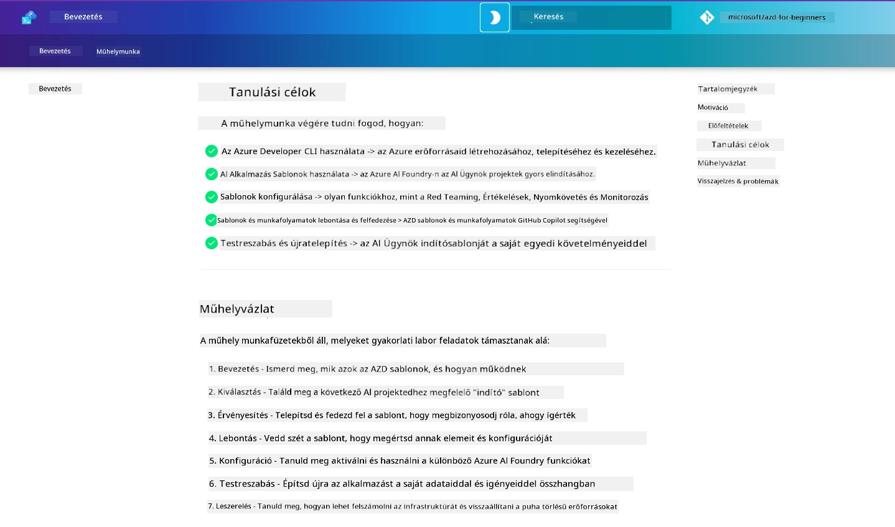

<div align="center">
  <div style="background: linear-gradient(135deg, #0078d4, #106ebe); border-radius: 10px; padding: 20px; margin: 20px 0; box-shadow: 0 4px 15px rgba(0, 120, 212, 0.3); border: 2px solid #005a9e;">
    <h2 style="color: white; margin: 0; font-size: 24px; text-shadow: 1px 1px 2px rgba(0,0,0,0.3);">
      🎯 AZD a mesterséges intelligencia fejlesztőknek műhelymunka
    </h2>
    <p style="color: white; margin: 10px 0 0 0; font-size: 16px; text-shadow: 1px 1px 2px rgba(0,0,0,0.3);">
      <strong>Gyakorlati műhelymunka az Azure Developer CLI használatával történő MI-alkalmazások építéséhez.</strong><br>
      Teljesíts 7 modult az AZD sablonok és az MI telepítési munkafolyamatok elsajátításához.
    </p>
    <div style="margin-top: 15px;">
      <span style="background: rgba(255,255,255,0.2); padding: 5px 10px; border-radius: 15px; color: white; font-size: 14px;">
        📅 Utolsó frissítés: 2026 március
      </span>
    </div>
  </div>
</div>

# AZD a mesterséges intelligencia fejlesztőknek műhelymunka

Üdvözlünk a gyakorlati műhelymunkán, ahol az Azure Developer CLI (AZD) megtanulására fókuszálunk, különös tekintettel az MI-alkalmazások telepítésére. Ez a műhelymunka segít alkalmazott szinten megérteni az AZD sablonokat 3 lépésben:

1. **Felfedezés** - találd meg a számodra legmegfelelőbb sablont.
1. **Telepítés** - telepítsd és ellenőrizd, hogy működik-e
1. **Testreszabás** - módosítsd és ismételd, hogy a sajátoddá váljon!

A műhelymunka során megismerkedsz alapvető fejlesztői eszközökkel és munkafolyamatokkal is, hogy hatékonyabbá tedd az end-to-end fejlesztési utadat.

<br/>

## Böngésző alapú útmutató

A műhely leckék Markdown formátumban vannak. Közvetlenül a GitHubon navigálhatsz közöttük - vagy elindíthatsz egy böngésző alapú előnézetet a lenti képernyőkép szerint.



Ehhez az opcióhoz - forkold az adattárat a profilodra, majd indítsd el a GitHub Codespaces-t. Amint aktiválódik a VS Code terminál, írd be ezt a parancsot:

Ez a böngésző előnézet működik GitHub Codespaces-ben, fejlesztői konténerekben vagy helyi klónban, ahol Python és MkDocs telepítve van.

```bash title="" linenums="0"
mkdocs serve > /dev/null 2>&1 &
```

Néhány másodperc múlva megjelenik egy felugró párbeszédablak. Válaszd az `Open in browser` opciót. A webes útmutató ekkor új böngészőfülön nyílik meg. Ennek az előnézetnek néhány előnye:

1. **Beépített keresés** - gyorsan megtalálhatod a kulcsszavakat vagy leckéket.
1. **Másolás ikon** - kódblokkok fölé mozgatva található
1. **Téma váltó** - válthatsz világos és sötét téma között
1. **Segítség kérése** - kattints a Discord ikonra a láblécben, hogy csatlakozz!

<br/>

## Műhely áttekintése

**Időtartam:** 3-4 óra  
**Szint:** Kezdő és középhaladó  
**Előfeltételek:** Azure, MI koncepciók, VS Code és parancssori eszközök ismerete.

Ez egy gyakorlati műhely, ahol tanulás közben csinálsz. A feladatok teljesítése után javasoljuk az AZD kezdőknek tananyagot, hogy folytasd tanulmányaidat biztonság és termelékenység legjobb gyakorlatairól.

| Idő | Modul  | Cél |
|:---|:---|:---|
| 15 perc | [Bevezetés](docs/instructions/0-Introduction.md) | Alapok lefektetése, célok megértése |
| 30 perc | [Válassz MI sablont](docs/instructions/1-Select-AI-Template.md) | Fedezd fel a lehetőségeket, válassz kezdőt | 
| 30 perc | [Érvényesíts MI sablont](docs/instructions/2-Validate-AI-Template.md) | Alapértelmezett megoldás telepítése Azure-ban |
| 30 perc | [Bonts szét MI sablont](docs/instructions/3-Deconstruct-AI-Template.md) | Fedezd fel a szerkezetet és beállításokat |
| 30 perc | [Konfiguráld MI sablont](docs/instructions/4-Configure-AI-Template.md) | Aktiváld és próbáld ki a funkciókat |
| 30 perc | [Testreszabás MI sablont](docs/instructions/5-Customize-AI-Template.md) | Alakítsd a sablont a saját igényeid szerint |
| 30 perc | [Infrastruktúra felszámolása](docs/instructions/6-Teardown-Infrastructure.md) | Takard le és szabadíts fel erőforrásokat |
| 15 perc | [Összegzés és továbblépés](docs/instructions/7-Wrap-up.md) | Tanulási források, műhely kihívás |

<br/>

## Amit tanulni fogsz

Gondolj az AZD sablonra úgy, mint egy tanulási homokozóra, ahol felfedezheted a Microsoft Foundry end-to-end fejlesztési képességeit és eszközeit. A műhely végére intuitív érzésed lesz a különböző eszközökről és fogalmakról ebben a kontextusban.

| Fogalom  | Cél |
|:---|:---|
| **Azure Developer CLI** | Értsd meg az eszköz parancsait és munkafolyamatait |
| **AZD Sablonok**| Értsd meg a projekt struktúráját és konfigurációját |
| **Azure AI Agent**| Microsoft Foundry projekt előkészítése és telepítése |
| **Azure AI Search**| Kontextus alapú MI szolgáltatások üzemeltetése |
| **Megfigyelhetőség**| Tracing, monitorozás és értékelések vizsgálata |
| **Red Teaming**| Adverszári tesztelés és kivédési módszerek megismerése |

<br/>

## Műhely szerkezete

A műhely úgy van felépítve, hogy végigvezessen a sablonfelfedezéstől a telepítésen, szétbontáson és testreszabáson át - amely az hivatalos [Getting Started with AI Agents](https://github.com/Azure-Samples/get-started-with-ai-agents) kezdősablont használja alapul.

### [1. modul: MI sablon kiválasztása](docs/instructions/1-Select-AI-Template.md) (30 perc)

- Mik az MI sablonok?
- Hol találok MI sablonokat?
- Hogyan kezdjem el az MI ügynökök építését?
- **Lab:** Gyors indítás Codespaces-ben vagy fejlesztői konténerben

### [2. modul: MI sablon érvényesítése](docs/instructions/2-Validate-AI-Template.md) (30 perc)

- Mi az MI sablon architektúrája?
- Mi az AZD fejlesztési munkafolyamat?
- Hol kérhetek segítséget az AZD fejlesztéshez?
- **Lab:** Telepítsd és érvényesítsd az MI ügynök sablont

### [3. modul: MI sablon szétbontása](docs/instructions/3-Deconstruct-AI-Template.md) (30 perc)

- Fedezd fel a környezeted `.azure/` mappát  
- Fedezd fel az erőforrás beállításaiddat az `infra/` mappában  
- Fedezd fel AZD konfigurációdat az `azure.yaml` fájlokban  
- **Lab:** Módosíts környezeti változókat és telepíts újra

### [4. modul: MI sablon konfigurálása](docs/instructions/4-Configure-AI-Template.md) (30 perc)
- Fedezd fel: Retrieval Augmented Generation (kiegészített lekérdezés generálás)
- Fedezd fel: Ügynök értékelés és Red Teaming
- Fedezd fel: Tracing és monitorozás
- **Lab:** Fedezd fel az MI ügynököt + megfigyelhetőséget

### [5. modul: MI sablon testreszabása](docs/instructions/5-Customize-AI-Template.md) (30 perc)
- Határozd meg: Funkcionális specifikációt (PRD) forgatókönyvekhez
- Konfiguráld: Környezeti változókat az AZD-hez
- Implementáld: Életciklus hookokat további feladatokhoz
- **Lab:** Testreszabás a saját forgatókönyvedhez

### [6. modul: Infrastruktúra felszámolása](docs/instructions/6-Teardown-Infrastructure.md) (30 perc)
- Összefoglalás: Mik az AZD sablonok?
- Összefoglalás: Miért érdemes az Azure Developer CLI-t használni?
- Következő lépések: Próbálj ki más sablont!
- **Lab:** Erőforrások felszámolása és takarítás

<br/>

## Műhely kihívás

Szeretnéd magad próbára tenni? Néhány projektjavaslat - vagy oszd meg ötleteidet velünk!!

| Projekt | Leírás |
|:---|:---|
|1. **Bonts szét egy összetett MI sablont** | Használd a munkafolyamatot és eszközöket, amiket bemutattunk, és próbálj meg telepíteni, érvényesíteni és testreszabni egy másik MI megoldás sablont. _Mit tanultál?_|
|2. **Testreszabás a saját forgatókönyvedhez**  | Írj egy PRD-t (termék követelmény dokumentumot) egy másik forgatókönyvhöz. Használd a GitHub Copilotot a sablon repo-dban Agent Model módban, és kérd meg a testreszabási munkafolyamat generálását. _Mit tanultál? Hogyan fejleszthetnéd tovább ezeket a javaslatokat?_|
| | |

## Van visszajelzésed?

1. Hozz létre egy issue-t ebben az adattárban – címkézd „Workshop”-ként a könnyebb kereshetőségért.
1. Csatlakozz a Microsoft Foundry Discord szerveréhez – lépj kapcsolatba a társakkal!


| | | 
|:---|:---|
| **📚 Kurzus kezdőlap**| [AZD kezdőknek](../README.md)|
| **📖 Dokumentáció** | [Kezdés MI sablonokkal](https://learn.microsoft.com/en-us/azure/ai-foundry/how-to/develop/ai-template-get-started)|
| **🛠️MI sablonok** | [Microsoft Foundry sablonok](https://ai.azure.com/templates) |
|**🚀 Következő lépések** | [Kezdő műhelymunka](#műhely-áttekintése) |
| | |

<br/>

---

**Navigáció:** [Fő kurzus](../README.md) | [Bevezetés](docs/instructions/0-Introduction.md) | [1. modul: Sablon kiválasztása](docs/instructions/1-Select-AI-Template.md)

**Készen állsz, hogy elkezdd MI alkalmazások építését AZD-vel?**

[Kezdő műhelymunka: Bevezetés →](docs/instructions/0-Introduction.md)

---

<!-- CO-OP TRANSLATOR DISCLAIMER START -->
**Jogi nyilatkozat**:  
Ez a dokumentum az AI fordítószolgáltatás, a [Co-op Translator](https://github.com/Azure/co-op-translator) használatával készült. Habár a pontosságra törekszünk, kérjük, vegye figyelembe, hogy az automatizált fordítások hibákat vagy pontatlanságokat tartalmazhatnak. Az eredeti dokumentum a saját nyelvén számít hiteles forrásnak. Kritikus információk esetén ajánlott szakmai emberi fordítást igénybe venni. Nem vállalunk felelősséget a fordítás használatából eredő félreértésekért vagy félreértelmezésekért.
<!-- CO-OP TRANSLATOR DISCLAIMER END -->