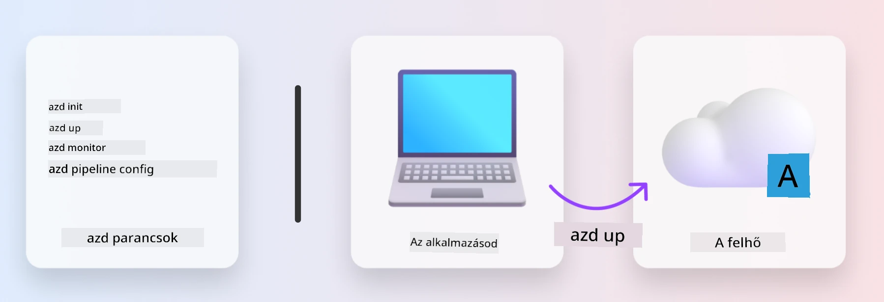
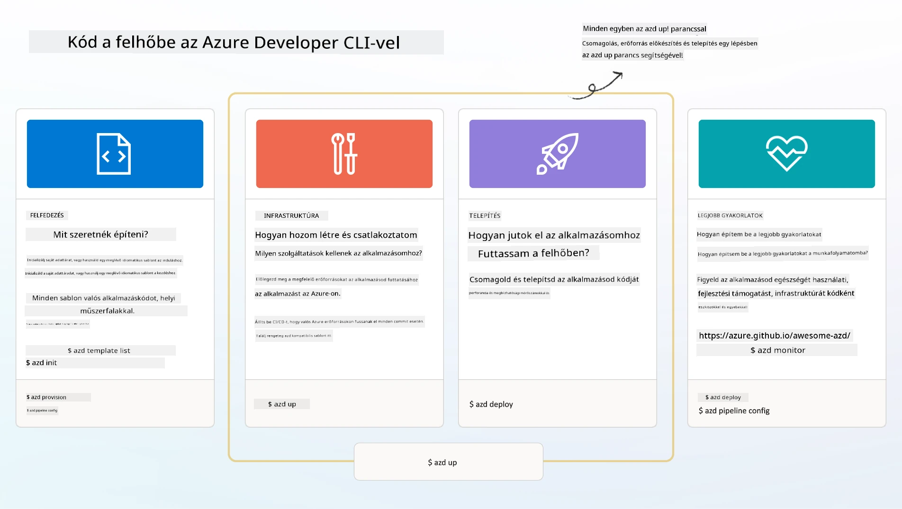

<!--
CO_OP_TRANSLATOR_METADATA:
{
  "original_hash": "06d6207eff634aefcaa41739490a5324",
  "translation_date": "2025-09-25T01:58:46+00:00",
  "source_file": "workshop/docs/instructions/1-Select-AI-Template.md",
  "language_code": "hu"
}
-->
# 1. Válassz egy sablont

!!! tip "A MODUL VÉGÉRE KÉPES LESZEL"

    - [ ] Leírni, hogy mik azok az AZD sablonok
    - [ ] Felfedezni és használni AZD sablonokat AI-hoz
    - [ ] Elkezdni az AI Agents sablonnal
    - [ ] **Lab 1:** AZD gyorsindítás GitHub Codespaces segítségével

---

## 1. Egy építő analógia

Egy modern, vállalati szintű AI alkalmazás _nulláról_ történő felépítése ijesztő feladat lehet. Ez egy kicsit olyan, mintha saját kezűleg építenéd fel az új otthonodat, tégláról téglára. Igen, meg lehet csinálni! De ez nem a leghatékonyabb módja annak, hogy elérjük a kívánt végeredményt!

Ehelyett gyakran egy meglévő _tervrajzzal_ kezdünk, és egy építésszel dolgozunk együtt, hogy testre szabjuk azt a személyes igényeink szerint. Pontosan ezt a megközelítést kell alkalmazni az intelligens alkalmazások építésekor is. Először találj egy jó tervezési architektúrát, amely illeszkedik a problémádhoz. Ezután dolgozz együtt egy megoldás-architektával, hogy testre szabja és fejlessze a megoldást a konkrét esetedre.

De hol találhatunk ilyen tervrajzokat? És hogyan találhatunk egy építészt, aki hajlandó megtanítani minket arra, hogyan szabjuk testre és telepítsük ezeket a tervrajzokat saját magunk? Ebben a workshopban ezekre a kérdésekre adunk választ, három technológia bemutatásával:

1. [Azure Developer CLI](https://aka.ms/azd) - egy nyílt forráskódú eszköz, amely felgyorsítja a fejlesztők útját a helyi fejlesztéstől (build) a felhőbe történő telepítésig (ship).
1. [Azure AI Foundry Templates](https://ai.azure.com/templates) - szabványosított nyílt forráskódú adattárak, amelyek mintakódot, infrastruktúrát és konfigurációs fájlokat tartalmaznak egy AI megoldás architektúra telepítéséhez.
1. [GitHub Copilot Agent Mode](https://code.visualstudio.com/docs/copilot/chat/chat-agent-mode) - egy Azure tudásra alapozott kódolási ügynök, amely segít eligazodni a kódbázisban és változtatásokat végrehajtani - természetes nyelv használatával.

Ezekkel az eszközökkel a kezünkben most már _felfedezhetjük_ a megfelelő sablont, _telepíthetjük_, hogy megbizonyosodjunk róla, hogy működik, és _testre szabhatjuk_, hogy megfeleljen a konkrét eseteinknek. Merüljünk el és tanuljuk meg, hogyan működnek ezek.

---

## 2. Azure Developer CLI

Az [Azure Developer CLI](https://learn.microsoft.com/en-us/azure/developer/azure-developer-cli/) (vagy `azd`) egy nyílt forráskódú parancssori eszköz, amely felgyorsíthatja a kód-felhő utat egy sor fejlesztőbarát parancs segítségével, amelyek következetesen működnek az IDE (fejlesztés) és CI/CD (devops) környezetekben.

Az `azd` segítségével a telepítési folyamat egyszerű lehet:

- `azd init` - Új AI projekt inicializálása egy meglévő AZD sablonból.
- `azd up` - Infrastruktúra létrehozása és az alkalmazás telepítése egy lépésben.
- `azd monitor` - Valós idejű monitorozás és diagnosztika a telepített alkalmazáshoz.
- `azd pipeline config` - CI/CD folyamatok beállítása az Azure-ba történő automatikus telepítéshez.

**🎯 | GYAKORLAT**: <br/> Fedezd fel az `azd` parancssori eszközt a GitHub Codespaces környezetedben. Kezdd ezzel a parancssal, hogy megnézd, mit tud az eszköz:

```bash title="" linenums="0"
azd help
```



---

## 3. Az AZD sablon

Ahhoz, hogy az `azd` ezt elérje, tudnia kell, milyen infrastruktúrát kell létrehozni, milyen konfigurációs beállításokat kell alkalmazni, és milyen alkalmazást kell telepíteni. Itt jönnek képbe az [AZD sablonok](https://learn.microsoft.com/en-us/azure/developer/azure-developer-cli/azd-templates?tabs=csharp).

Az AZD sablonok nyílt forráskódú adattárak, amelyek mintakódot, infrastruktúrát és konfigurációs fájlokat kombinálnak, amelyek szükségesek a megoldás architektúra telepítéséhez. Az _Infrastructure-as-Code_ (IaC) megközelítést alkalmazva lehetővé teszik, hogy a sablon erőforrás-definíciói és konfigurációs beállításai verziókövetettek legyenek (akárcsak az alkalmazás forráskódja) - így újrahasználható és következetes munkafolyamatokat hoznak létre a projekt felhasználói között.

Amikor AZD sablont hozol létre vagy használsz _saját_ esetedre, fontold meg ezeket a kérdéseket:

1. Mit építesz? → Van-e sablon, amely kezdőkódot tartalmaz az adott esetre?
1. Hogyan van felépítve a megoldásod? → Van-e sablon, amely tartalmazza a szükséges erőforrásokat?
1. Hogyan van telepítve a megoldásod? → Gondolj az `azd deploy`-ra elő-/utófeldolgozási horgokkal!
1. Hogyan optimalizálhatod tovább? → Gondolj beépített monitorozásra és automatizálási folyamatokra!

**🎯 | GYAKORLAT**: <br/> 
Látogasd meg az [Awesome AZD](https://azure.github.io/awesome-azd/) galériát, és használd a szűrőket, hogy felfedezd a jelenleg elérhető több mint 250 sablont. Nézd meg, találsz-e olyat, amely megfelel _saját_ eseted követelményeinek.



---

## 4. AI alkalmazás sablonok

---

