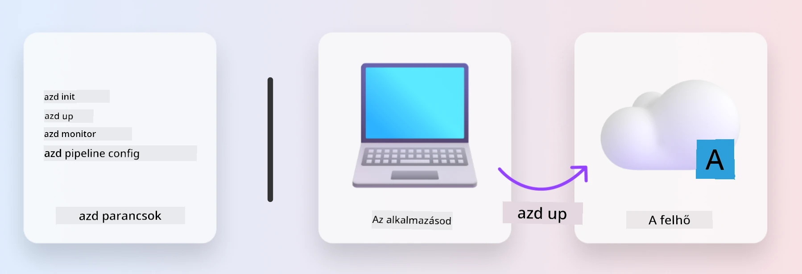
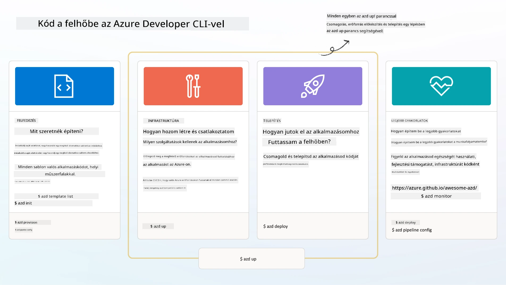

# 1. Válasszon sablont

!!! tip "A MODUL VÉGÉRE KÉPES LESZ"

    - [ ] Leírni, mik azok az AZD sablonok
    - [ ] Felfedezni és használni az AZD sablonokat AI-hoz
    - [ ] Elkezdni az AI Agents sablonnal
    - [ ] **Lab 1:** AZD gyorsindítás GitHub Codespaces használatával

---

## 1. Az építő hasonlata

Egy modern, vállalati szintű AI alkalmazás _nulláról_ történő felépítése ijesztő lehet. Egy kicsit olyan, mintha saját magad építenéd fel új otthonodat tégláról téglára. Igen, meg lehet csinálni! De nem ez a leghatékonyabb módja a kívánt végeredmény elérésének!

Ehelyett gyakran egy létező _tervrajzzal_ kezdünk, és együtt dolgozunk egy építészhallal, hogy személyre szabjuk az igényeink szerint. Pontosan ezt az elvet érdemes követni intelligens alkalmazások építésekor is. Először találj egy jó tervezési architektúrát, amely illeszkedik a problémádhoz. Majd dolgozz együtt egy megoldásépítővel, hogy személyre szabja és kifejlessze a megoldást a konkrét esetedhez.

De hol találhatók ezek a tervrajzok? És hol találunk egy építészt, aki hajlandó megtanítani, hogyan testre szabjuk és telepítsük ezeket a tervrajzokat saját magunk? Ebben a műhelymunkában ezekre a kérdésekre válaszolunk három technológia segítségével:

1. [Azure Developer CLI](https://aka.ms/azd) - egy nyílt forráskódú eszköz, amely felgyorsítja a fejlesztői utat a helyi fejlesztéstől (build) a felhőbeli telepítésig (ship).
1. [Microsoft Foundry Templates](https://ai.azure.com/templates) - szabványosított, nyílt forráskódú tárolók, melyek mintakódot, infrastruktúrát és konfigurációs fájlokat tartalmaznak AI megoldásarchitektúra telepítéséhez.
1. [GitHub Copilot Agent Mode](https://code.visualstudio.com/docs/copilot/chat/chat-agent-mode) - egy programozási asszisztens, amely az Azure tudására épül, és segít eligazodni a kódbázisban, valamint módosításokat végezni – természetes nyelvet használva.

Ezekkel az eszközökkel most már képesek vagyunk _felfedezni_ a megfelelő sablont, _telepíteni_ azt, hogy meggyőződjünk a működéséről, és _testre szabni_, hogy megfeleljen a saját forgatókönyveinknek. Merüljünk el benne, és tanuljuk meg, hogyan működnek ezek.

---

## 2. Azure Developer CLI

Az [Azure Developer CLI](https://learn.microsoft.com/en-us/azure/developer/azure-developer-cli/) (vagy `azd`) egy nyílt forráskódú parancssori eszköz, amely felgyorsítja a kód-felhő útját fejlesztőbarát parancsokkal, amelyek következetesen működnek IDE (fejlesztés) és CI/CD (devops) környezetekben.

Az `azd` használatával a telepítés folyamata egyszerű lehet:

- `azd init` - Új AI projekt inicializálása létező AZD sablonból.
- `azd up` - Infrastrukturális erőforrások létrehozása és alkalmazás telepítése egy lépésben.
- `azd monitor` - Valós idejű megfigyelés és diagnosztika a telepített alkalmazáshoz.
- `azd pipeline config` - CI/CD pipeline-ok beállítása a telepítés automatizálásához Azure-ba.

**🎯 | GYAKORLAT**: <br/> Fedezd fel az `azd` parancssori eszközt a GitHub Codespaces környezetedben most. Kezdd azzal, hogy beírod ezt a parancsot, hogy lássad, mit tud az eszköz:

```bash title="" linenums="0"
azd help
```



---

## 3. Az AZD sablon

Ahhoz, hogy az `azd` működjön, tudnia kell, milyen infrastruktúrát kell létrehozni, milyen konfigurációs beállításokat kell alkalmazni, és milyen alkalmazást kell telepíteni. Itt jönnek be az [AZD sablonok](https://learn.microsoft.com/en-us/azure/developer/azure-developer-cli/azd-templates?tabs=csharp).

Az AZD sablonok olyan nyílt forráskódú tárolók, amelyek mintakódot ötvöznek az infrastruktúra- és konfigurációs fájlokkal, melyek szükségesek a megoldás architektúra telepítéséhez.
Az _Infrastructure-as-Code_ (IaC) megközelítés lehetővé teszi a sablon erőforrás-definíciók és konfigurációs beállítások verziókövetését (akárcsak az alkalmazás forráskódját) – így újrahasznosítható és következetes munkafolyamatokat hozva létre a projekt felhasználói között.

Amikor létrehozol vagy újrafelhasználsz egy AZD sablont _a te_ forgatókönyvedhez, fontold meg ezeket a kérdéseket:

1. Mit építesz? → Van olyan sablon, amelynek van kezdőkódja ehhez a forgatókönyvhöz?
1. Hogyan van az alkalmazásod megtervezve? → Van olyan sablon, amely tartalmazza a szükséges erőforrásokat?
1. Hogyan történik a megoldás telepítése? → Gondolj az `azd deploy` elő- és utófeldolgozási hookjaira!
1. Hogyan lehet tovább optimalizálni? → Gondolj beépített megfigyelésre és automatizált pipeline-okra!

**🎯 | GYAKORLAT**: <br/>
Látogasd meg az [Awesome AZD](https://azure.github.io/awesome-azd/) galériát, és használd a szűrőket, hogy felfedezd a több mint 250 elérhető sablont. Próbáld megtalálni azt, amely megfelel _a te_ forgatókönyved követelményeinek.



---

## 4. AI alkalmazás sablonok

AI-alapú alkalmazásokhoz a Microsoft speciális sablonokat biztosít, amelyek a **Microsoft Foundry** és **Foundry Agents** megoldásokat tartalmazzák. Ezek a sablonok felgyorsítják az intelligens és éles bevetésre kész alkalmazások építését.

### Microsoft Foundry & Foundry Agents Sablonok

Válassz ki egy sablont alább a telepítéshez. Minden sablon elérhető az [Awesome AZD](https://azure.github.io/awesome-azd/) galériában, és egyetlen parancssal inicializálható.

| Sablon | Leírás | Telepítő parancs |
|----------|-------------|----------------|
| **[AI Chat with RAG](https://azure.github.io/awesome-azd/?tags=ai&tags=rag)** | Csevegőalkalmazás Retrieval Augmented Generation technológiával a Microsoft Foundry segítségével | `azd init -t azure-samples/azure-search-openai-demo` |
| **[Foundry Agent Service Starter](https://azure.github.io/awesome-azd/?tags=ai&tags=agents)** | AI ügynökök építése a Foundry Agents segítségével autonóm feladatvégrehajtáshoz | `azd init -t azure-samples/foundry-agent-service-starter` |
| **[Multi-Agent Orchestration](https://azure.github.io/awesome-azd/?tags=ai&tags=agents)** | Több Foundry Agent koordinálása komplex munkafolyamatokhoz | `azd init -t azure-samples/multi-agent-orchestration` |
| **[AI Document Intelligence](https://azure.github.io/awesome-azd/?tags=ai&tags=document)** | Dokumentumok kinyerése és elemzése a Microsoft Foundry modellekkel | `azd init -t azure-samples/ai-document-processing` |
| **[Conversational AI Bot](https://azure.github.io/awesome-azd/?tags=ai&tags=bot)** | Intelligens chatbotok építése Microsoft Foundry integrációval | `azd init -t azure-samples/ai-chat-protocol` |
| **[AI Image Generation](https://azure.github.io/awesome-azd/?tags=ai&tags=dalle)** | Képgenerálás DALL-E segítségével a Microsoft Foundry-on keresztül | `azd init -t azure-samples/ai-image-generation` |
| **[Semantic Kernel Agent](https://azure.github.io/awesome-azd/?tags=ai&tags=semantic-kernel)** | AI ügynökök a Semantic Kernel és Foundry Agents kombinációjával | `azd init -t azure-samples/semantic-kernel-agent` |
| **[AutoGen Multi-Agent](https://azure.github.io/awesome-azd/?tags=ai&tags=autogen)** | Többügynökös rendszerek az AutoGen keretrendszerrel | `azd init -t azure-samples/autogen-multi-agent` |

### Gyors Kezdés

1. **Böngéssz a sablonok között**: Látogass el a [https://azure.github.io/awesome-azd/](https://azure.github.io/awesome-azd/) oldalra, és szűrj az `AI`, `Agents` vagy `Microsoft Foundry` címkék szerint
2. **Válassz sablont**: Válaszd ki azt, amelyik leginkább megfelel az esetednek
3. **Inicializáld**: Futtasd az `azd init` parancsot a választott sablonra
4. **Telepítsd**: Futtasd az `azd up` parancsot az infrastruktúra kiépítéséhez és az alkalmazás telepítéséhez

**🎯 | GYAKORLAT**: <br/>
Válassz az alábbi sablonok közül a saját forgatókönyved alapján:

- **Chatbotot építesz?** → Kezdd az **AI Chat with RAG** vagy a **Conversational AI Bot** sablonnal
- **Autonóm ügynökökre van szükséged?** → Próbáld ki a **Foundry Agent Service Starter** vagy a **Multi-Agent Orchestration** sablont
- **Dokumentumfeldolgozás?** → Használd az **AI Document Intelligence** sablont
- **AI kódolási segítséget szeretnél?** → Fedezd fel a **Semantic Kernel Agent** vagy **AutoGen Multi-Agent** sablonokat

```bash title="Example: Deploy the AI Chat with RAG template" linenums="0"
azd init -t azure-samples/azure-search-openai-demo
azd up
```

!!! info "További sablonok felfedezése"
    Az [Awesome AZD galéria](https://azure.github.io/awesome-azd/) több mint 250 sablont tartalmaz. Használd a szűrőket, hogy megtaláld azokat a sablonokat, melyek megfelelnek a nyelvi, keretrendszerbeli és Azure szolgáltatások szerinti igényeidnek.

---

<!-- CO-OP TRANSLATOR DISCLAIMER START -->
**Felmentés**:
Ezt a dokumentumot a [Co-op Translator](https://github.com/Azure/co-op-translator) AI fordító szolgáltatás segítségével fordítottuk le. Bár a pontosságra törekszünk, kérjük, vegye figyelembe, hogy az automatikus fordítások hibákat vagy pontatlanságokat tartalmazhatnak. Az eredeti dokumentum a saját nyelvén tekintendő hiteles forrásnak. Fontos információk esetén szakmai, emberi fordítást javaslunk. Nem vállalunk felelősséget a fordítás használatából eredő félreértésekért vagy téves értelmezésekért.
<!-- CO-OP TRANSLATOR DISCLAIMER END -->