<!--
CO_OP_TRANSLATOR_METADATA:
{
  "original_hash": "7816c6ec50c694c331e7c6092371be4d",
  "translation_date": "2025-09-25T02:09:14+00:00",
  "source_file": "workshop/docs/instructions/2-Validate-AI-Template.md",
  "language_code": "hu"
}
-->
# 2. Sablon érvényesítése

!!! tip "A MODUL VÉGÉRE KÉPES LESZ"

    - [ ] Az AI megoldás architektúrájának elemzése
    - [ ] Az AZD telepítési munkafolyamat megértése
    - [ ] A GitHub Copilot használata az AZD használatának támogatására
    - [ ] **Lab 2:** AI ügynök sablon telepítése és érvényesítése

---

## 1. Bevezetés

Az [Azure Developer CLI](https://learn.microsoft.com/en-us/azure/developer/azure-developer-cli/) vagy `azd` egy nyílt forráskódú parancssori eszköz, amely leegyszerűsíti a fejlesztői munkafolyamatot az Azure-ra történő alkalmazásépítés és -telepítés során.

[AZD sablonok](https://learn.microsoft.com/azure/developer/azure-developer-cli/azd-templates) szabványosított adattárak, amelyek mintapéldány kódot, _infrastruktúra mint kód_ elemeket és `azd` konfigurációs fájlokat tartalmaznak egy összefüggő megoldás architektúrához. Az infrastruktúra létrehozása olyan egyszerűvé válik, mint egy `azd provision` parancs - míg az `azd up` használatával egyszerre hozhat létre infrastruktúrát **és** telepítheti az alkalmazást!

Ennek eredményeként az alkalmazásfejlesztési folyamat elindítása olyan egyszerű lehet, mint megtalálni a megfelelő _AZD kezdő sablont_, amely a legközelebb áll az alkalmazás és infrastruktúra igényeihez - majd testreszabni az adattárat az adott forgatókönyv követelményeinek megfelelően.

Mielőtt elkezdenénk, győződjön meg róla, hogy az Azure Developer CLI telepítve van.

1. Nyisson meg egy VS Code terminált, és írja be ezt a parancsot:

      ```bash title="" linenums="0"
      azd version
      ```

1. Valami ilyesmit kell látnia!

      ```bash title="" linenums="0"
      azd version 1.19.0 (commit b3d68cea969b2bfbaa7b7fa289424428edb93e97)
      ```

**Most készen áll arra, hogy kiválasszon és telepítsen egy sablont az azd segítségével**

---

## 2. Sablon kiválasztása

Az Azure AI Foundry platform [ajánlott AZD sablonok](https://learn.microsoft.com/en-us/azure/ai-foundry/how-to/develop/ai-template-get-started) készletével érkezik, amelyek népszerű megoldási forgatókönyveket fednek le, mint például _több ügynök munkafolyamat automatizálása_ és _több módú tartalomfeldolgozás_. Ezeket a sablonokat az Azure AI Foundry portálon is felfedezheti.

1. Látogasson el ide: [https://ai.azure.com/templates](https://ai.azure.com/templates)
1. Jelentkezzen be az Azure AI Foundry portálra, amikor erre felszólítják - valami ilyesmit fog látni.

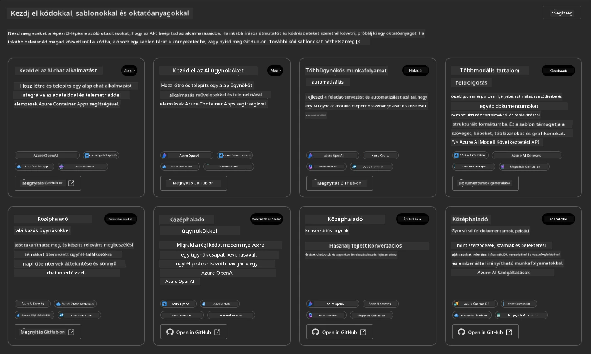

A **Basic** opciók az Ön kezdő sablonjai:

1. [ ] [Get Started with AI Chat](https://github.com/Azure-Samples/get-started-with-ai-chat), amely egy alapvető chat alkalmazást telepít _az Ön adataival_ az Azure Container Apps szolgáltatásba. Használja ezt egy alapvető AI chatbot forgatókönyv felfedezéséhez.
1. [X] [Get Started with AI Agents](https://github.com/Azure-Samples/get-started-with-ai-agents), amely egy szabványos AI ügynököt is telepít (az Azure AI Agent Service segítségével). Használja ezt az eszközöket és modelleket magában foglaló ügynöki AI megoldások megismeréséhez.

Nyissa meg a második linket egy új böngészőfülön (vagy kattintson az `Open in GitHub` gombra a kapcsolódó kártyán). Látni fogja az AZD sablon adattárát. Szánjon egy percet a README felfedezésére. Az alkalmazás architektúrája így néz ki:

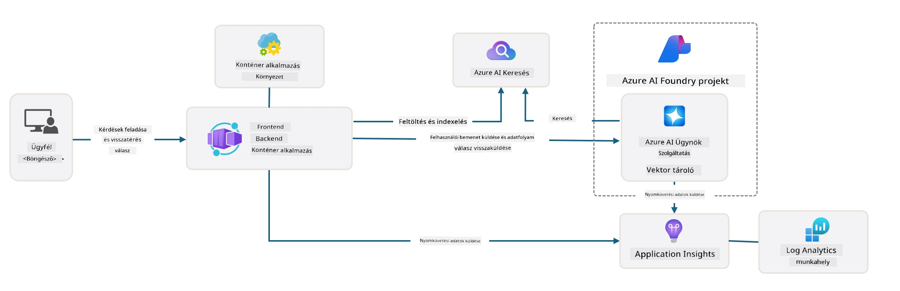

---

## 3. Sablon aktiválása

Próbáljuk meg telepíteni ezt a sablont, és győződjünk meg róla, hogy érvényes. Kövessük a [Getting Started](https://github.com/Azure-Samples/get-started-with-ai-agents?tab=readme-ov-file#getting-started) szakaszban található irányelveket.

1. Kattintson [erre a linkre](https://github.com/codespaces/new/Azure-Samples/get-started-with-ai-agents) - erősítse meg az alapértelmezett műveletet a `Create codespace` gombra
1. Ez megnyit egy új böngészőfület - várja meg, amíg a GitHub Codespaces munkamenet betöltődik
1. Nyissa meg a VS Code terminált a Codespaces-ben - írja be a következő parancsot:

   ```bash title="" linenums="0"
   azd up
   ```

Teljesítse az ezzel kiváltott munkafolyamat lépéseit:

1. Felszólítják, hogy jelentkezzen be az Azure-ba - kövesse az utasításokat a hitelesítéshez
1. Adjon meg egy egyedi környezetnevet - például én a `nitya-mshack-azd` nevet használtam
1. Ez létrehoz egy `.azure/` mappát - látni fog egy almappát a környezet nevével
1. Felszólítják, hogy válasszon egy előfizetés nevet - válassza az alapértelmezettet
1. Felszólítják, hogy válasszon egy helyet - használja az `East US 2`-t

Most várja meg, amíg a létrehozás befejeződik. **Ez 10-15 percet vesz igénybe**

1. Ha kész, a konzolban egy SIKERES üzenetet fog látni, például ezt:
      ```bash title="" linenums="0"
      SUCCESS: Your up workflow to provision and deploy to Azure completed in 10 minutes 17 seconds.
      ```
1. Az Azure Portálon most egy létrehozott erőforráscsoportot fog látni az adott környezetnévvel:

      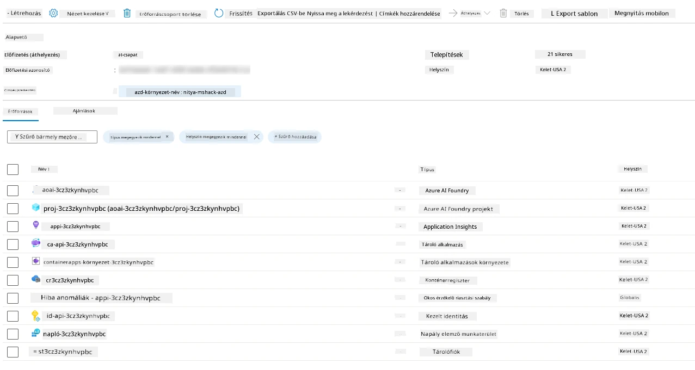

1. **Most készen áll az infrastruktúra és az alkalmazás érvényesítésére**.

---

## 4. Sablon érvényesítése

1. Látogasson el az Azure Portál [Resource Groups](https://portal.azure.com/#browse/resourcegroups) oldalára - jelentkezzen be, amikor erre felszólítják
1. Kattintson a környezetnevéhez tartozó RG-re - látni fogja a fenti oldalt

      - kattintson az Azure Container Apps erőforrásra
      - kattintson az _Essentials_ szakaszban (jobb felső sarok) található Application Url-re

1. Egy hosztolt alkalmazás front-end UI-t kell látnia, például ezt:

   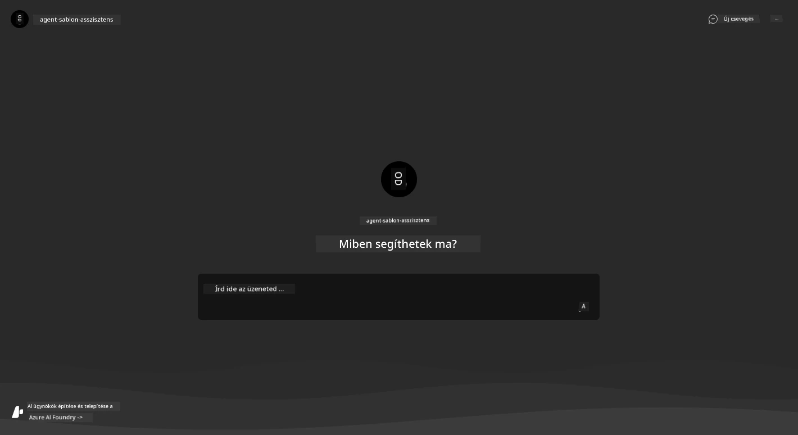

1. Próbáljon ki néhány [minta kérdést](https://github.com/Azure-Samples/get-started-with-ai-agents/blob/main/docs/sample_questions.md)

      1. Kérdezze: ```Mi Franciaország fővárosa?``` 
      1. Kérdezze: ```Mi a legjobb sátor 200 dollár alatt két személy számára, és milyen funkciókat tartalmaz?```

1. Olyan válaszokat kell kapnia, mint az alábbiak. _De hogyan működik ez?_ 

      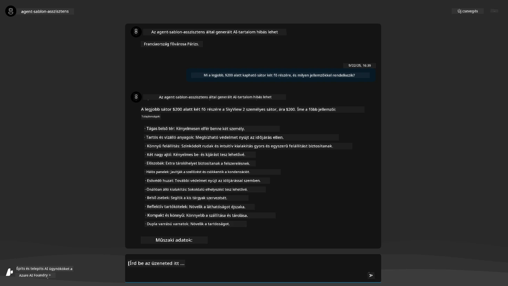

---

## 5. Ügynök érvényesítése

Az Azure Container App egy végpontot telepít, amely csatlakozik az Azure AI Foundry projektben létrehozott AI ügynökhöz ehhez a sablonhoz. Nézzük meg, mit jelent ez.

1. Térjen vissza az Azure Portál _Overview_ oldalára az erőforráscsoportjához

1. Kattintson az `Azure AI Foundry` erőforrásra a listában

1. Ezt kell látnia. Kattintson a `Go to Azure AI Foundry Portal` gombra. 
   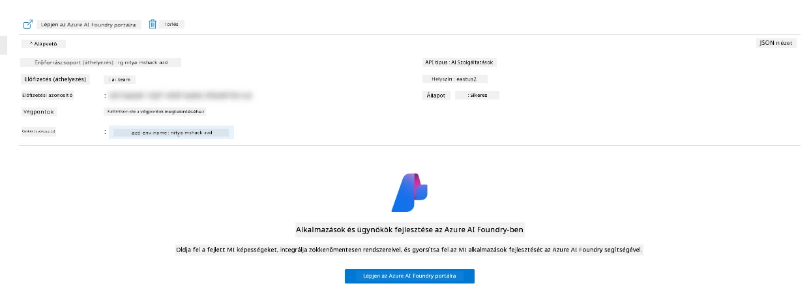

1. Látni fogja az AI alkalmazás Foundry Projekt oldalát
   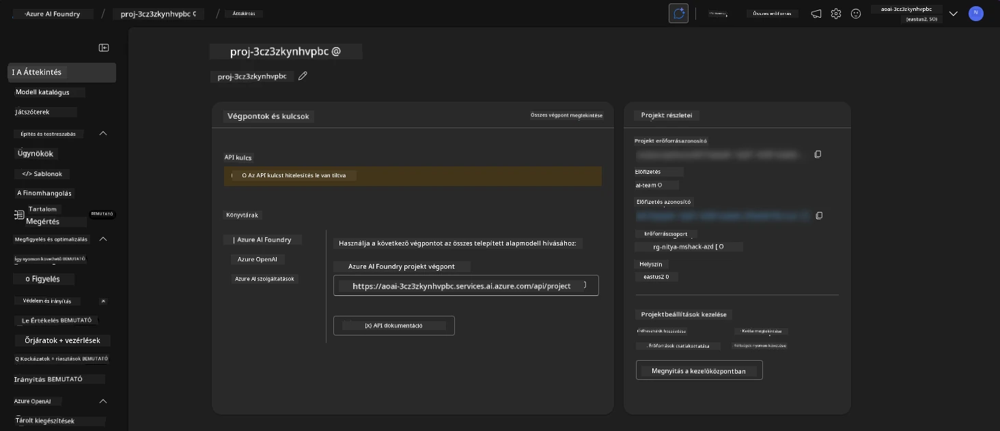

1. Kattintson az `Agents` opcióra - látni fogja az alapértelmezett ügynököt a projektben
   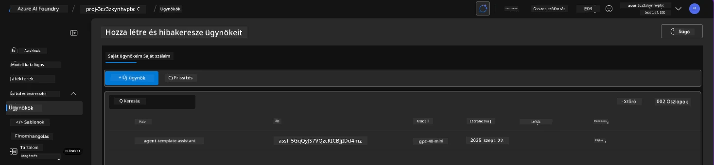

1. Válassza ki - és látni fogja az ügynök részleteit. Vegye figyelembe a következőket:

      - Az ügynök alapértelmezés szerint File Search-t használ (mindig)
      - Az ügynök `Knowledge` azt jelzi, hogy 32 fájl van feltöltve (fájlkereséshez)
      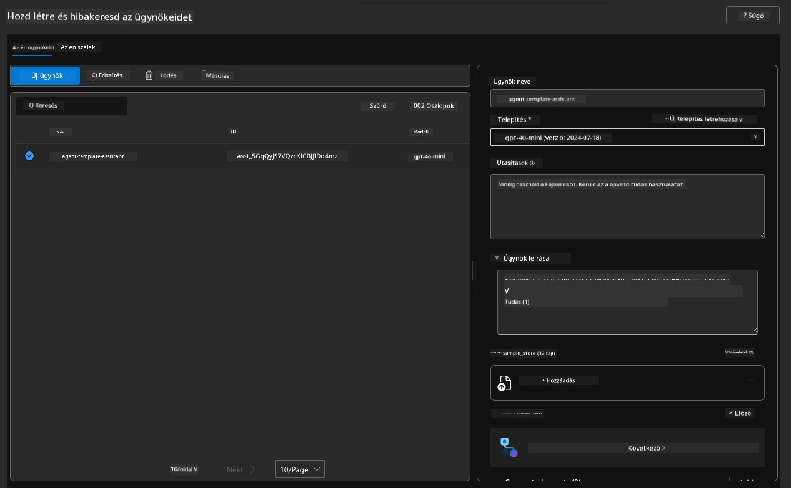

1. Keresse meg a bal oldali menüben a `Data+indexes` opciót, és kattintson a részletekért. 

      - Látni fogja a 32 adatfájlt, amelyek feltöltve vannak a tudás számára.
      - Ezek megfelelnek a `src/files` alatt található 12 ügyfélfájlnak és 20 termékfájlnak 
      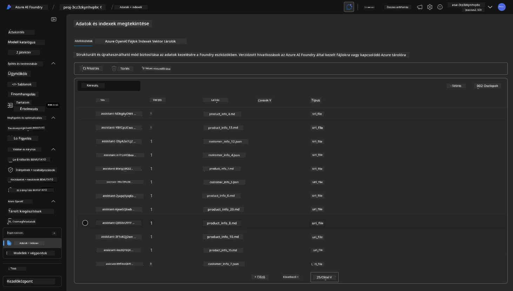

**Érvényesítette az ügynök működését!** 

1. Az ügynök válaszai az adott fájlokban található tudásra alapozottak. 
1. Most kérdéseket tehet fel az adatokkal kapcsolatban, és megalapozott válaszokat kap.
1. Példa: `customer_info_10.json` leírja "Amanda Perez" három vásárlását

Térjen vissza a böngészőfülre a Container App végponttal, és kérdezze: `Milyen termékekkel rendelkezik Amanda Perez?`. Valami ilyesmit kell látnia:

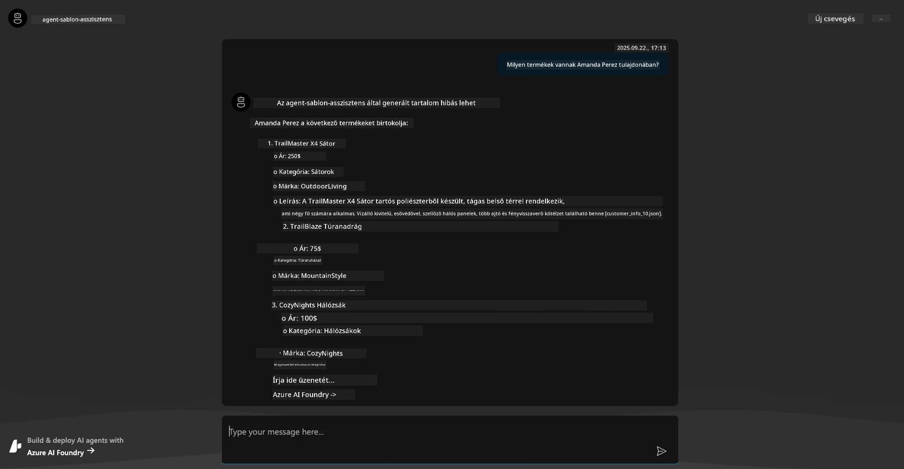

---

## 6. Ügynök játszótér

Nézzük meg közelebbről az Azure AI Foundry képességeit, és próbáljuk ki az ügynököt az Ügynökök Játszótéren. 

1. Térjen vissza az `Agents` oldalra az Azure AI Foundry-ban - válassza ki az alapértelmezett ügynököt
1. Kattintson a `Try in Playground` opcióra - egy Játszótér UI-t kell látnia, például ezt
1. Tegye fel ugyanazt a kérdést: `Milyen termékekkel rendelkezik Amanda Perez?`

    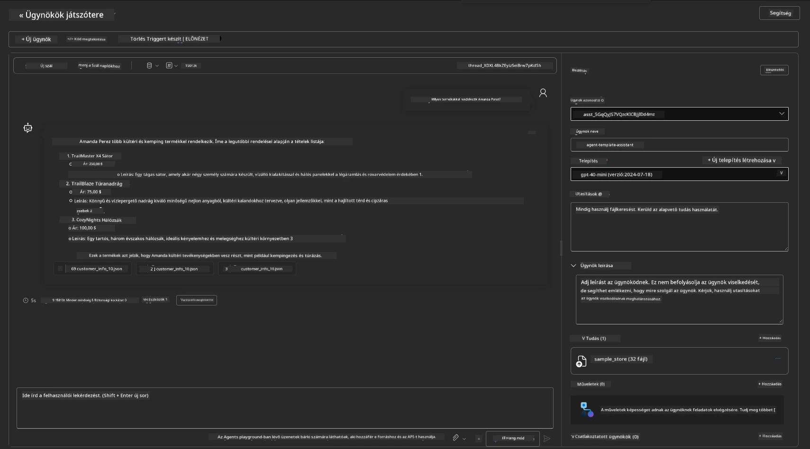

Ugyanazt (vagy hasonló) választ kapja - de további információkat is kap, amelyek segítenek megérteni az ügynöki alkalmazás minőségét, költségeit és teljesítményét. Például:

1. Vegye figyelembe, hogy a válasz idézi azokat az adatfájlokat, amelyekre a válasz alapozott
1. Vigye az egérmutatót bármelyik fájl címkéje fölé - egyezik-e az adat az Ön kérdésével és a megjelenített válasszal?

Egy _statisztika_ sor is látható a válasz alatt. 

1. Vigye az egérmutatót bármelyik metrika fölé - például Biztonság. Valami ilyesmit fog látni
1. Megfelel-e az értékelt besorolás az Ön intuíciójának a válasz biztonsági szintjéről?

      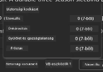

---x

## 7. Beépített megfigyelhetőség

A megfigyelhetőség az alkalmazás instrumentálásáról szól, hogy olyan adatokat generáljon, amelyek segítségével megérthető, hibakereshető és optimalizálható a működése. Ennek érzékeltetésére:

1. Kattintson a `View Run Info` gombra - ezt a nézetet kell látnia. Ez az [Ügynök nyomkövetés](https://learn.microsoft.com/en-us/azure/ai-foundry/how-to/develop/trace-agents-sdk#view-trace-results-in-the-azure-ai-foundry-agents-playground) példája működés közben. _Ezt a nézetet a Thread Logs menüpontban is elérheti._

   - Értsük meg az ügynök által végrehajtott lépéseket és eszközöket
   - Értsük meg a teljes Token számot (szemben a kimeneti tokenek használatával) a válaszhoz
   - Értsük meg a késleltetést és azt, hogy hol tölt időt a végrehajtás során

      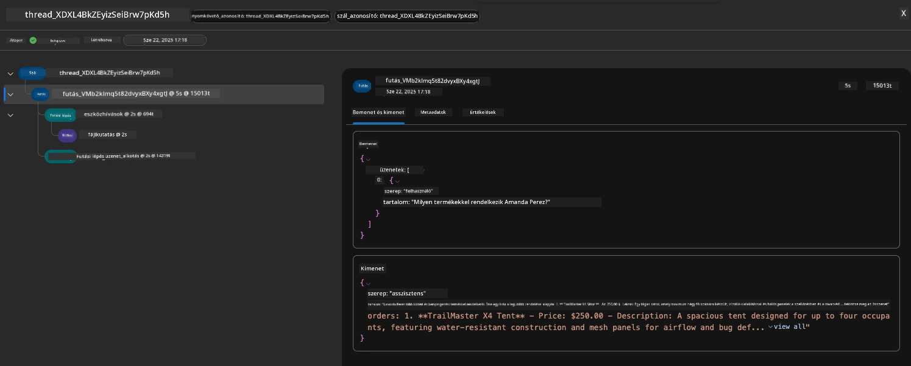

1. Kattintson a `Metadata` fülre, hogy további attribútumokat láthasson a futtatásról, amelyek hasznos kontextust nyújthatnak a későbbi hibakereséshez.   

      

1. Kattintson az `Evaluations` fülre, hogy lássa az ügynök válaszára vonatkozó automatikus értékeléseket. Ezek tartalmazzák a biztonsági értékeléseket (például Önkárosítás) és az ügynök-specifikus értékeléseket (például Szándék feloldása, Feladat betartása).

      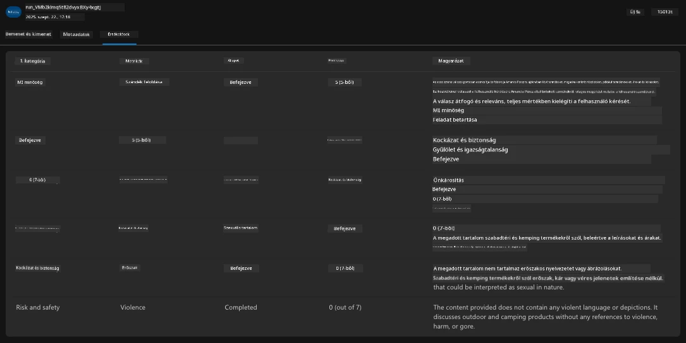

1. Végül kattintson a `Monitoring` fülre az oldalsó menüben.

      - Válassza ki a `Resource usage` fület a megjelenített oldalon - és tekintse meg a metrikákat.
      - Kövesse nyomon az alkalmazás használatát költségek (tokenek) és terhelés (kérések) szempontjából.
      - Kövesse nyomon az alkalmazás késleltetését az első byte (bemenet feldolgozása) és az utolsó byte (kimenet) között.

      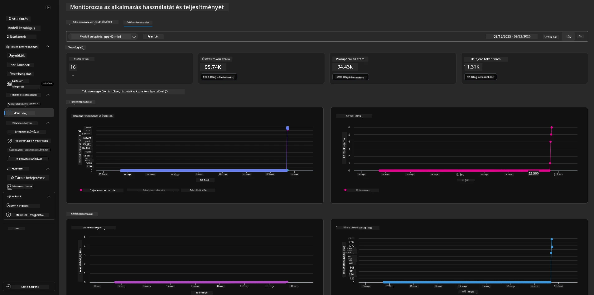

---

## 8. Környezeti változók

Eddig böngészőben végeztük a telepítést - és érvényesítettük, hogy az infrastruktúra létrehozva van, és az alkalmazás működik. Azonban ahhoz, hogy _kód-alapú_ módon dolgozzunk az alkalmazással, konfigurálnunk kell a helyi fejlesztési környezetet az adott erőforrásokkal való munkához szükséges változókkal. Az `azd` használata ezt megkönnyíti.

1. Az Azure Developer CLI [környezeti változókat használ](https://learn.microsoft.com/en-us/azure/developer/azure-developer-cli/manage-environment-variables?tabs=bash) az alkalmazás telepítéseinek konfigurációs beállításainak tárolására és kezelésére.

1. A környezeti változók a `.azure/<env-name>/.env` fájlban vannak tárolva - ez a telepítés során használt `env-name` környezetre korlátozza őket, és segít elkülöníteni a környezeteket ugyanazon adattár különböző telepítési célpontjai között.

1. A környezeti változókat az `azd` parancs automatikusan betölti, amikor egy adott parancsot végrehajt (például `azd up`). Vegye figyelembe, hogy az `azd` nem olvassa automatikusan az _operációs rendszer szintű_ környezeti változókat (például a shellben beállítottakat) - ehelyett használja az `azd set env` és `azd get env` parancsokat az információk átvitelére szkriptekben.

Próbáljunk ki néhány parancsot:

1. Az `azd` által ebben a környezetben beállított összes környezeti változó lekérése:

      ```bash title="" linenums="0"
      azd env get-values
      ```
      
      Valami ilyesmit fog látni:

      ```bash title="" linenums="0"
      AZURE_AI_AGENT_DEPLOYMENT_NAME="gpt-4o-mini"
      AZURE_AI_AGENT_NAME="agent-template-assistant"
      AZURE_AI_EMBED_DEPLOYMENT_NAME="text-embedding-3-small"
      AZURE_AI_EMBED_DIMENSIONS=100
      ...
      ```

1. Egy adott érték lekérése - például szeretném tudni, hogy beállítottuk-e az `AZURE_AI_AGENT_MODEL_NAME` értéket

      ```bash title="" linenums="0"
      azd env get-value AZURE_AI_AGENT_MODEL_NAME 
      ```
      
      Valami ilyesmit fog látni - alapértelmezés szerint nem volt beállítva!

      ```bash title="" linenums="0"
      ERROR: key 'AZURE_AI_AGENT_MODEL_NAME' not found in the environment values
      ```

1. Új környezeti változó beállítása az `azd` számára. Itt frissítjük az ügynök modell nevét. _Megjegyzés: minden változtatás azonnal tükröződik a `.azure/<env-name>/.env` fájlban.

      ```bash title="" linenums="0"
      azd env set AZURE_AI_AGENT_MODEL_NAME gpt-4.1
      azd env set AZURE_AI_AGENT_MODEL_VERSION 2025-04-14
      azd env set AZURE_AI_AGENT_DEPLOYMENT_CAPACITY 150
      ```

      Most meg kell találnunk, hogy az érték be van állítva:

@@CODE_BLOCK_9
      ```bash title="" linenums="0"
      azd env refresh
      ```

      Ez egy hatékony módja annak, hogy _szinkronizáljuk_ a környezeti változókat két vagy több helyi fejlesztési környezet között (például egy több fejlesztőből álló csapat esetén) - lehetővé téve, hogy a telepített infrastruktúra szolgáljon a környezeti változók állapotának alapigazságaként. A csapattagok egyszerűen _frissítik_ a változókat, hogy újra szinkronba kerüljenek.

---

## 9. Gratulálunk 🏆

Most fejeztél be egy teljes körű munkafolyamatot, amely során:

- [X] Kiválasztottad az AZD sablont, amelyet használni szeretnél
- [X] Elindítottad a sablont a GitHub Codespaces segítségével
- [X] Telepítetted a sablont és ellenőrizted, hogy működik

---

