# 2. Egy sablon érvényesítése

!!! tip "A MODUL VÉGÉRE KÉPES LESZEL"

    - [ ] Elemezni az AI Megoldás Architektúrát
    - [ ] Megérteni az AZD Telepítési munkafolyamatot
    - [ ] GitHub Copilot segítségével támogatást kapni az AZD használatához
    - [ ] **2. labor:** AI Ügynökök sablonjának telepítése és érvényesítése

---


## 1. Bevezetés

Az [Azure Developer CLI](https://learn.microsoft.com/en-us/azure/developer/azure-developer-cli/) vagy `azd` egy nyílt forráskódú parancssori eszköz, amely egyszerűsíti a fejlesztői munkafolyamatot alkalmazások Azure-ba történő fejlesztése és telepítése során.

Az [AZD Sablonok](https://learn.microsoft.com/azure/developer/azure-developer-cli/azd-templates) szabványosított tárolók, amelyek mintapéldául alkalmazáskódot, _infrastruktúra-kód formájában_ eszközöket és `azd` konfigurációs fájlokat tartalmaznak egy összehangolt megoldás architektúrához. Az infrastruktúra létrehozása olyan egyszerű, mint egy `azd provision` parancs végrehajtása – míg az `azd up` használatával egyszerre tudod létrehozni az infrastruktúrát **és** telepíteni az alkalmazást!

Ennek eredményeként az alkalmazásfejlesztési folyamat elindítása annyira egyszerű lehet, hogy megtalálod a megfelelő _AZD Starter sablont_, amely a leginkább megfelel az alkalmazásodnak és infrastruktúrádnak – majd testreszabod a tárolót az adott forgatókönyved követelményeihez igazodva.

Mielőtt elkezdenénk, győződj meg róla, hogy telepítve van az Azure Developer CLI.

1. Nyiss egy VS Code terminált és írd be ezt a parancsot:

      ```bash title="" linenums="0"
      azd version
      ```

1. Valami hasonlót kell látnod!

      ```bash title="" linenums="0"
      azd version 1.19.0 (commit b3d68cea969b2bfbaa7b7fa289424428edb93e97)
      ```

**Most készen állsz sablon kiválasztására és telepítésére az azd segítségével**

---

## 2. Sablon kiválasztása

A Microsoft Foundry platform egy [ajánlott AZD sablonok készletét](https://learn.microsoft.com/en-us/azure/ai-foundry/how-to/develop/ai-template-get-started) kínálja, amelyek népszerű megoldási forgatókönyveket fednek le, mint például a _többügynökös munkafolyamat-automatizálást_ és a _többmodális tartalomfeldolgozást_. Ezeket a sablonokat megtekintheted a Microsoft Foundry portálján is.

1. Látogass el ide: [https://ai.azure.com/templates](https://ai.azure.com/templates)
1. Jelentkezz be a Microsoft Foundry portálra, amikor kéri – ilyesmit fogsz látni.

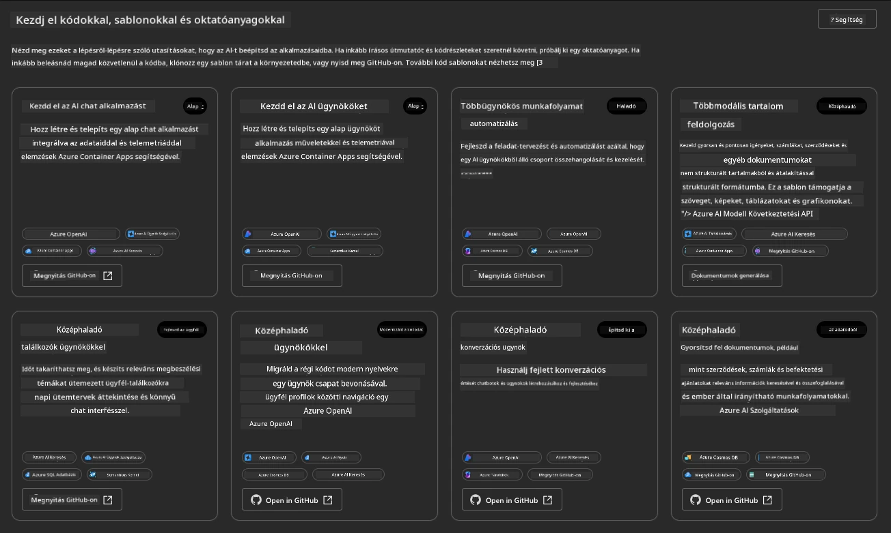


A **Basic** opciók a kezdő sablonjaid:

1. [ ] [Kezdés az AI Chat-tel](https://github.com/Azure-Samples/get-started-with-ai-chat), amely egy alap chat alkalmazást telepít _a saját adataiddal_ az Azure Container Apps-be. Ezt használd egy alap AI chatbot forgatókönyv felfedezéséhez.
1. [X] [Kezdés az AI Ügynökökkel](https://github.com/Azure-Samples/get-started-with-ai-agents), amely egy szabványos AI Ügynököt telepít (a Foundry Ügynökökkel együtt). Ezt használd, hogy megismerkedj az eszközöket és modelleket alkalmazó ügynök-alapú AI megoldásokkal.

Nyisd meg a második linket egy új böngészőfülön (vagy kattints az adott kártyán az `Open in GitHub`-ra). Látnod kell ennek az AZD sablonnak a tárolóját. Szánj egy percet, hogy átnézd a README-t. Az alkalmazás architektúrája így néz ki:

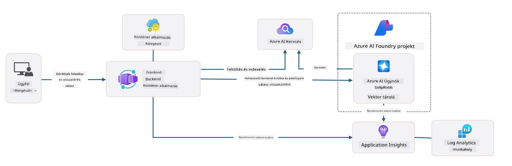

---

## 3. Sablon aktiválása

Próbáljuk meg telepíteni ezt a sablont és ellenőrizni, hogy érvényes-e. Kövessük a [Getting Started](https://github.com/Azure-Samples/get-started-with-ai-agents?tab=readme-ov-file#getting-started) szakasz útmutatásait.

1. Kattints [erre a linkre](https://github.com/codespaces/new/Azure-Samples/get-started-with-ai-agents) – erősítsd meg az alapértelmezett műveletet: `Create codespace`
1. Ez megnyit egy új böngészőfület – várd meg, amíg a GitHub Codespaces munkamenet betöltődik
1. Nyisd meg a VS Code terminált a Codespaces-ben – írd be a következő parancsot:

   ```bash title="" linenums="0"
   azd up
   ```

Teljesítsd a munkafolyamat lépéseit, amelyeket ez elindít:

1. Bejelentkezés az Azure-ba – kövesd az utasításokat az azonosításhoz
1. Adj meg egy egyedi környezetnevet – például én `nitya-mshack-azd`-t használtam
1. Ez létrehoz egy `.azure/` mappát – benne az adott környezet nevét tartalmazó almappával
1. Kérni fogja az előfizetés nevét – válaszd az alapértelmezettet
1. Kérni fog helyszínt – használd az `East US 2`-t

Most várj az infrastruktúra létrehozásának befejezésére. **Ez 10-15 percet vesz igénybe**

1. Amikor kész, a konzol egy SIKER üzenetet jelenít meg, hasonlót ehhez:
      ```bash title="" linenums="0"
      SUCCESS: Your up workflow to provision and deploy to Azure completed in 10 minutes 17 seconds.
      ```
1. Az Azure portálodon mostantól létrejött egy erőforráscsoport az adott környezetnévvel:

      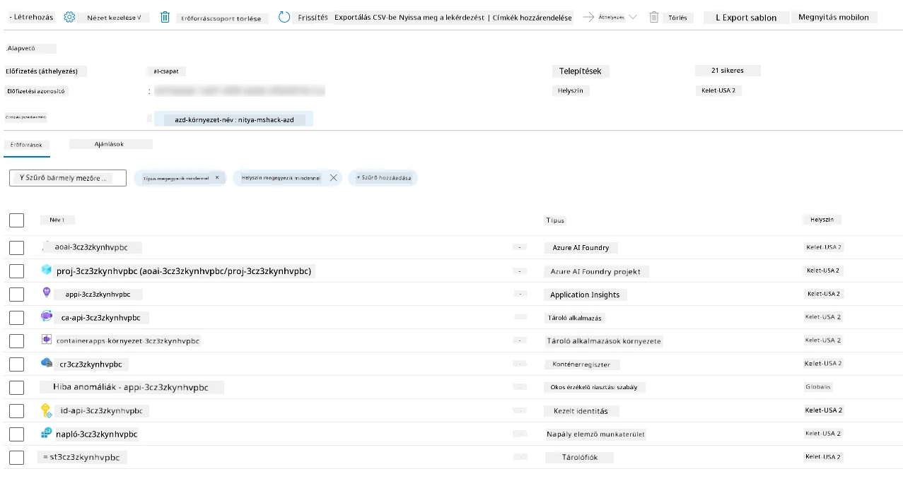

1. **Most készen állsz az infrastruktúra és az alkalmazás érvényesítésére**.

---

## 4. Sablon érvényesítése

1. Látogass el az Azure Portál [Erőforráscsoportok](https://portal.azure.com/#browse/resourcegroups) oldalára – jelentkezz be, ha kéri
1. Kattints az adott környezeted nevét viselő RG-re – az előző oldalhoz hasonló oldalt látsz

      - kattints az Azure Container Apps erőforrásra
      - kattints az Alkalmazás URL-re az _Essentials_ szakaszban (jobb felső sarokban)

1. Látnod kell egy hosztolt alkalmazás front-end felületet, ilyen formában:

   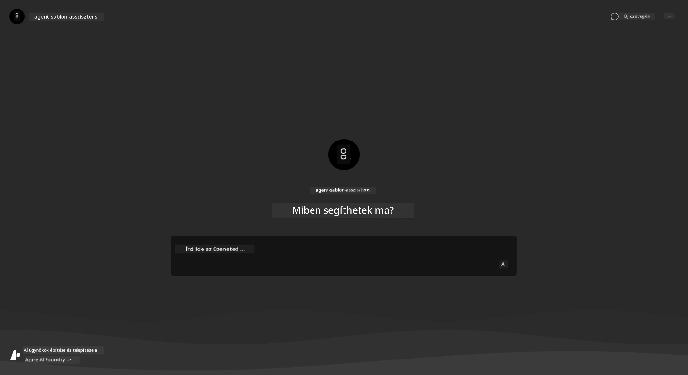

1. Próbálj feltenni néhány [példa kérdést](https://github.com/Azure-Samples/get-started-with-ai-agents/blob/main/docs/sample_questions.md)

      1. Kérdezd: ```Mi Párizs fővárosa?``` 
      1. Kérdezd: ```Mi a legjobb sátor 200 dollár alatt két személynek, és milyen jellemzői vannak?```

1. Olyan válaszokat kell kapnod, mint az alábbi ábrán. _De hogyan is működik ez?_

      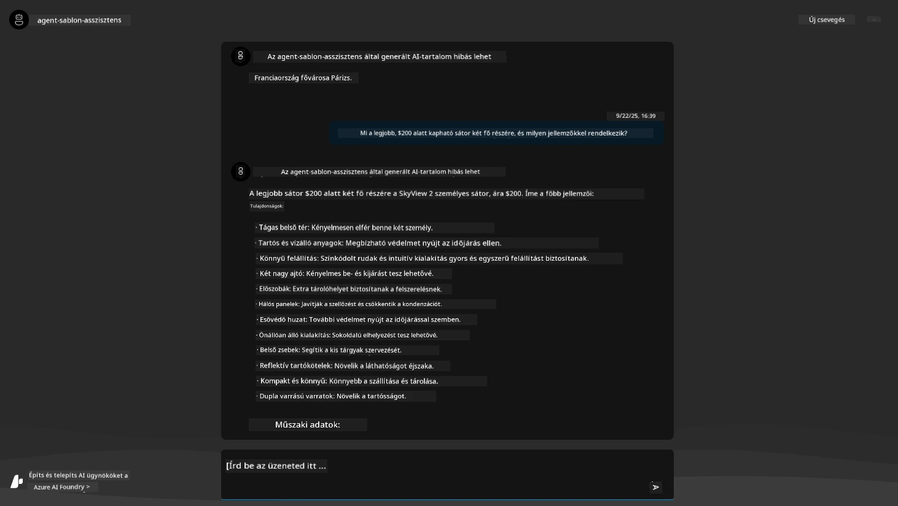

---

## 5. Ügynök érvényesítése

Az Azure Container App egy végpontot telepít, amely kapcsolódik az AI Ügynökhöz, amelyet a Microsoft Foundry projektben hoztak létre ehhez a sablonhoz. Nézzük meg, mit is jelent ez.

1. Térj vissza az Azure Portál _Áttekintés_ oldalára az erőforráscsoportodhoz

1. Kattints a listában a `Microsoft Foundry` erőforrásra

1. Ezt kell látnod. Kattints a `Go to Microsoft Foundry Portal` gombra. 
   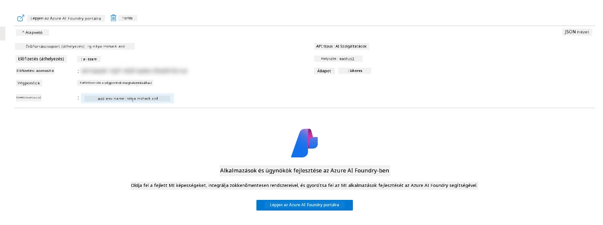

1. Megjelenik a Foundry projektoldal az AI alkalmazásodhoz
   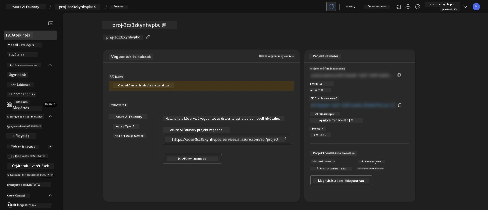

1. Kattints az `Agents` fülre – látod az alapértelmezett ügynököt, amely telepítve van a projektedhez
   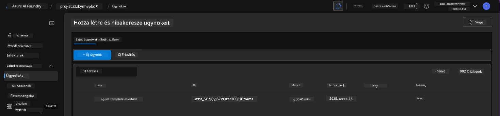

1. Válaszd ki – és látod az ügynök részleteit. Figyelj az alábbiakra:

      - Az ügynök alapértelmezettként a Fájlkeresést használja (mindig)
      - Az ügynök `Knowledge` mezője 32 fájl feltöltését jelzi (a fájlkereséshez)
      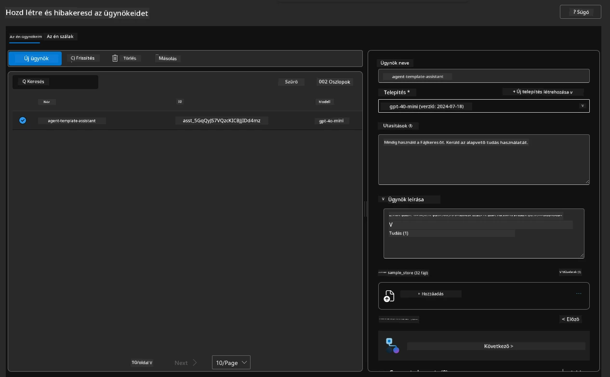

1. Keresd meg a bal oldali menüben a `Data+indexes` opciót, és kattints a részletekre.

      - Látnod kell a 32 adatfájlt, amit feltöltöttek a tudásbázishoz.
      - Ezek megfelelnek a 12 ügyfélfájlnak és 20 termékfájlnak a `src/files` mappában
      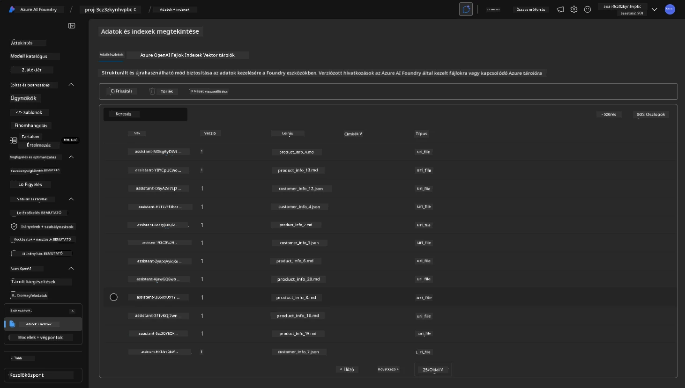

**Érvényesítetted az ügynök működését!**

1. Az ügynök válaszai e fájlokban lévő tudásra alapoznak.
1. Most már kérdéseket tehetsz fel ezekkel az adatokkal kapcsolatban, és megalapozott válaszokat kapsz.
1. Példa: a `customer_info_10.json` leírja az "Amanda Perez" által történt 3 vásárlást.

Térj vissza a böngészőfülre az Container App végponthoz, és kérdezd meg: `Milyen termékek vannak Amanda Perez tulajdonában?`. Valami ilyesmit kell látnod:

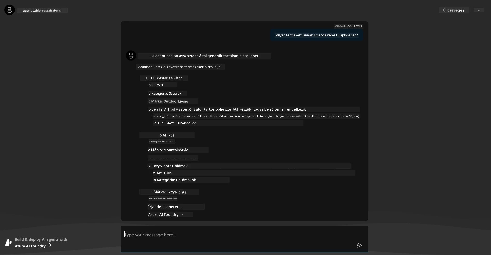

---

## 6. Ügynök próbapálya

Ismerjük meg kicsit jobban a Microsoft Foundry képességeit az ügynök próbapályán való kipróbálásával.

1. Térj vissza az `Agents` oldalra a Microsoft Foundry-ban – válaszd ki az alapértelmezett ügynököt
1. Kattints a `Try in Playground` opcióra – egy ilyen próbapálya felületet kell látnod
1. Tedd fel ugyanazt a kérdést: `Milyen termékek vannak Amanda Perez tulajdonában?`

    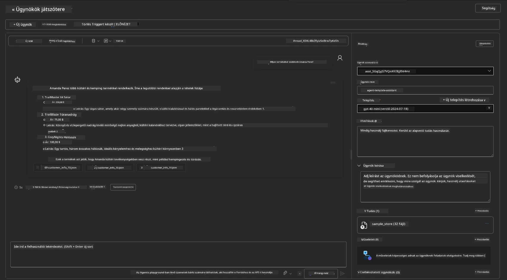

Ugyanazt (vagy hasonló) választ kapod – de emellett további információkat is kapsz, amelyek segítségével megértheted az ügynökös alkalmazás minőségét, költségét és teljesítményét. Például:

1. Figyeld meg, hogy a válasz idézi azokat az adatfájlokat, amelyeket a válasz „megalapozásához” használt
1. Vidd az egeret ezek bármelyik fájlcímkéje fölé – egyezik az adat a kérdéseddel és a megjelenített válasszal?

A válasz alatt egy _statisztikai_ sor is megjelenik.

1. Vidd az egeret bármelyik mutató fölé – pl. Safety (biztonság). Ilyet látsz:
1. Az értékelt besorolás megfelel a te intuíciódnak a válasz biztonsági szintjéről?

      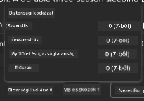

---

## 7. Beépített megfigyelhetőség

A megfigyelhetőség azt jelenti, hogy az alkalmazásodat úgy hangolod be, hogy adatokat generáljon, amelyek segítségével megértheted, hibakeresheted és optimalizálhatod a működését. Ehhez:

1. Kattints a `View Run Info` gombra – ezt a nézetet kell látnod. Ez egy példa az [Agent követésére](https://learn.microsoft.com/en-us/azure/ai-foundry/how-to/develop/trace-agents-sdk#view-trace-results-in-the-azure-ai-foundry-agents-playground) működés közben. _Ezt a nézetet úgy is elérheted, ha kattintasz a Thread Logs-ra a felső menüben_.

   - Tájékozódj a futási lépésekről és az ügynök által használt eszközökről
   - Értsd meg a teljes Token számlálót (szemben a kimeneti token használattal) a válasz esetén
   - Értsd meg a késést és azt, hogy hol töltődik az idő a végrehajtásban

      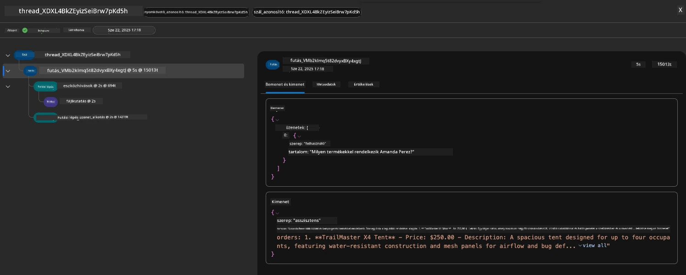

1. Kattints a `Metadata` fülre, hogy további attribútumokat láss a futtatásról, amelyek hasznos kontextust nyújthatnak esetleges hibakereséskor.

      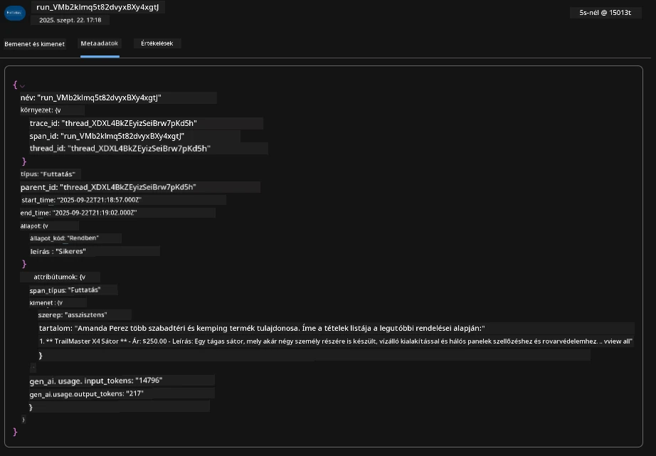


1. Kattints az `Evaluations` fülre az automatikus értékelések megtekintéséhez az ügynök válaszán. Ezek tartalmaznak biztonsági értékeléseket (pl. Önkárosítás) és ügynökspecifikus értékeléseket (pl. Szándék feloldása, Feladat betartása).

      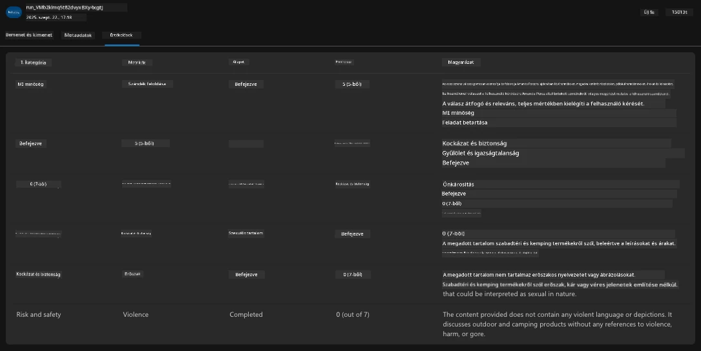

1. Végül, kattints a `Monitoring` fülre az oldalsó menüben.

      - Válaszd ki az ott megjelenő oldalon a `Resource usage` fület – és tekintsd meg a metrikákat.
      - Kövesd az alkalmazás használatát költségek (tokenek) és terhelés (kérések) szerint.
      - Kövesd az alkalmazás késleltetését az első bájt (bemenet feldolgozás) és az utolsó bájt (kimenet) között.

      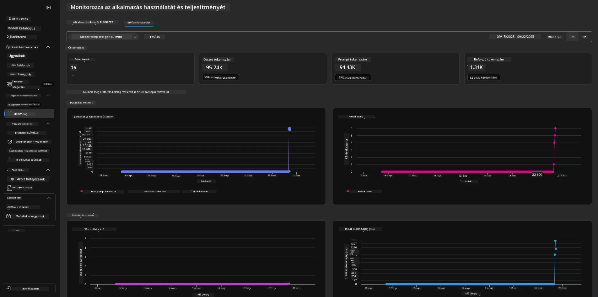

---

## 8. Környezeti változók

Eddig végigkövettük a telepítést a böngészőből – és érvényesítettük, hogy az infrastruktúra létrejött és az alkalmazás működik. De ahhoz, hogy _kódszinten_ dolgozzunk az alkalmazással, konfigurálnunk kell a helyi fejlesztői környezetet a releváns változókkal, amelyek szükségesek ezekhez az erőforrásokhoz. Az `azd` használata megkönnyíti ezt.

1. Az Azure Developer CLI [környezeti változókat használ](https://learn.microsoft.com/en-us/azure/developer/azure-developer-cli/manage-environment-variables?tabs=bash) a konfigurációs beállítások tárolására és kezelésére az alkalmazástelepítésekhez.

1. A környezeti változók a `.azure/<env-name>/.env` fájlban vannak tárolva – ez a helyi környezetre korlátozza őket a `env-name` környezetben, amelyet a telepítés során használunk, és segít elkülöníteni a különböző környezeteket ugyanazon tárolón belül.

1. A környezeti változókat az `azd` parancs automatikusan betölti, amikor egy adott parancsot futtat (pl. `azd up`). Az `azd` nem olvassa automatikusan az _operációs rendszer szintű_ változókat (pl. shell-ben beállítottakat) – ehelyett használd az `azd set env` és `azd get env` parancsokat az információk átadására szkriptek között.

Próbáljuk ki néhány parancsot:

1. Listázd az összes környezeti változót, amely az `azd` számára be van állítva ebben a környezetben:

      ```bash title="" linenums="0"
      azd env get-values
      ```
      
      Valami ilyesmit látsz:

      ```bash title="" linenums="0"
      AZURE_AI_AGENT_DEPLOYMENT_NAME="gpt-4.1-mini"
      AZURE_AI_AGENT_NAME="agent-template-assistant"
      AZURE_AI_EMBED_DEPLOYMENT_NAME="text-embedding-3-small"
      AZURE_AI_EMBED_DIMENSIONS=100
      ...
      ```

1. Kérdezz le egy konkrét értéket – pl. szeretném megtudni, hogy be van-e állítva az `AZURE_AI_AGENT_MODEL_NAME`

      ```bash title="" linenums="0"
      azd env get-value AZURE_AI_AGENT_MODEL_NAME 
      ```
      
      Valami ilyesmit látsz – ez nincs alapértelmezetten beállítva!

      ```bash title="" linenums="0"
      ERROR: key 'AZURE_AI_AGENT_MODEL_NAME' not found in the environment values
      ```

1. Állíts be egy új környezeti változót az `azd`-hez. Itt frissítjük az ügynök modell nevét. _Megjegyzés: a változtatások azonnal megjelennek a `.azure/<env-name>/.env` fájlban._

      ```bash title="" linenums="0"
      azd env set AZURE_AI_AGENT_MODEL_NAME gpt-4.1
      azd env set AZURE_AI_AGENT_MODEL_VERSION 2025-04-14
      azd env set AZURE_AI_AGENT_DEPLOYMENT_CAPACITY 150
      ```

      Most már látnod kell, hogy az érték be van állítva:

      ```bash title="" linenums="0"
      azd env get-value AZURE_AI_AGENT_MODEL_NAME 
      ```

1. Ne feledd, hogy néhány erőforrás tartós (pl. modell telepítések), és a módosítások hatékony alkalmazásához nem elég csak egy `azd up` – újratelepítésre lehet szükség. Próbáljuk meg eltávolítani az eredeti telepítést és újratelepíteni a módosított környezeti változókkal.

1. **Frissítés** Ha korábban már telepítettél infrastruktúrát egy azd sablonnal, akkor az aktuális Azure telepítés állapotának megfelelően tudod _frissíteni_ a helyi környezeti változók állapotát ezzel a paranccsal:

      ```bash title="" linenums="0"
      azd env refresh
      ```

      Ez egy hatékony módja annak, hogy _szinkronizáld_ a környezeti változókat két vagy több helyi fejlesztői környezet között (pl. több fejlesztőből álló csapat) – lehetővé téve, hogy az éles infrastruktúra szolgáljon az env változó állapotának alapértékeként. A csapattagok egyszerűen csak _frissítik_ a változókat, hogy újra szinkronban legyenek.

---

## 9. Gratulálunk 🏆

Épp most fejeztél be egy teljes munkafolyamatot, ahol:

- [X] Kiválasztottad a Használni kívánt AZD sablont
- [X] Elindítottad a sablont a GitHub Codespaces segítségével
- [X] Telepítetted a sablont és ellenőrizted, hogy működik

---

<!-- CO-OP TRANSLATOR DISCLAIMER START -->
**Felmentés**:
Ezt a dokumentumot az AI fordító szolgáltatás, a [Co-op Translator](https://github.com/Azure/co-op-translator) segítségével fordítottuk le. Bár a pontosságra törekszünk, kérjük, vegye figyelembe, hogy az automatikus fordítások hibákat vagy pontatlanságokat tartalmazhatnak. Az eredeti dokumentum a saját nyelvén tekintendő hiteles forrásnak. Kritikus információk esetén professzionális emberi fordítást javaslunk. Nem vállalunk felelősséget a fordítás használatából eredő félreértésekért vagy hibás értelmezésekért.
<!-- CO-OP TRANSLATOR DISCLAIMER END -->