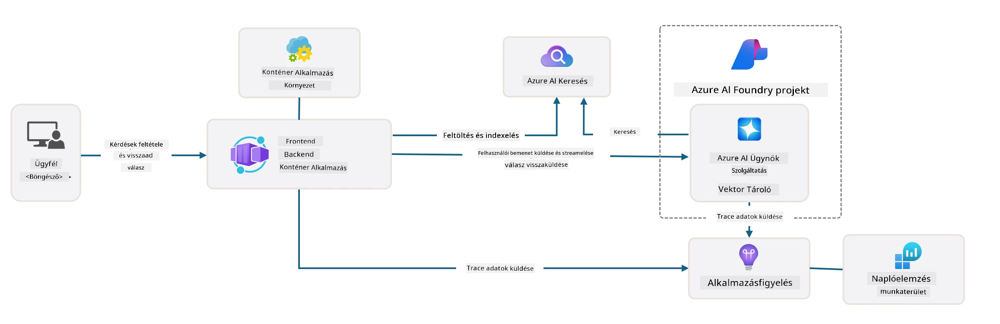

<!--
CO_OP_TRANSLATOR_METADATA:
{
  "original_hash": "4e403f041411361140d6beb88ab2a181",
  "translation_date": "2025-09-25T02:25:39+00:00",
  "source_file": "workshop/docs/instructions/3-Deconstruct-AI-Template.md",
  "language_code": "hu"
}
-->
# 3. Sablon szétbontása

!!! tip "A MODUL VÉGÉRE KÉPES LESZEL"

    - [ ] Elem
    - [ ] Elem
    - [ ] Elem
    - [ ] **3. Labor:**

---

Az AZD sablonok és az Azure Developer CLI (`azd`) segítségével gyorsan elindíthatjuk AI fejlesztési utunkat szabványosított repozitóriumokkal, amelyek mintakódot, infrastruktúrát és konfigurációs fájlokat biztosítanak - egy azonnal telepíthető _kezdő_ projekt formájában.

**Most azonban meg kell értenünk a projekt struktúráját és kódbázisát - és testre kell szabnunk az AZD sablont - előzetes tapasztalat vagy AZD ismeret nélkül!**

---

## 1. GitHub Copilot aktiválása

### 1.1 GitHub Copilot Chat telepítése

Ideje felfedezni a [GitHub Copilot Agent Mode](https://code.visualstudio.com/docs/copilot/chat/chat-agent-mode) funkcióját. Most természetes nyelven írhatjuk le feladatainkat magas szinten, és segítséget kaphatunk a végrehajtásban. Ehhez a laborhoz a [Copilot Free tervet](https://github.com/github-copilot/signup) fogjuk használni, amely havi korlátot szab a befejezések és chat interakciók számára.

A bővítmény telepíthető a piactérről, de már elérhetőnek kell lennie a Codespaces környezetedben. _Kattints az `Open Chat` gombra a Copilot ikon legördülő menüjéből - és írj be egy promptot, például `Mit tudsz csinálni?`_ - lehet, hogy be kell jelentkezned. **GitHub Copilot Chat készen áll.**

### 1.2 MCP szerverek telepítése

Ahhoz, hogy az Agent mód hatékony legyen, hozzáférést kell biztosítani a megfelelő eszközökhöz, amelyek segítenek a tudás visszakeresésében vagy cselekvések végrehajtásában. Itt jönnek képbe az MCP szerverek. A következő szervereket fogjuk konfigurálni:

1. [Azure MCP Server](../../../../../workshop/docs/instructions)
1. [Microsoft Docs MCP Server](../../../../../workshop/docs/instructions)

Az aktiváláshoz:

1. Hozz létre egy `.vscode/mcp.json` nevű fájlt, ha még nem létezik
1. Másold be a következőt ebbe a fájlba - és indítsd el a szervereket!
   ```json title=".vscode/mcp.json"
   {
      "servers": {
         "Azure MCP Server": {
            "command": "npx",
            "args": [
            "-y",
            "@azure/mcp@latest",
            "server",
            "start"
            ]
         },
         "microsoft.docs.mcp": {
            "type": "http",
            "url": "https://learn.microsoft.com/api/mcp"
         }
      }
   }
   ```

??? warning "Hibaüzenetet kaphatsz, hogy `npx` nincs telepítve (kattints a javításért)"

      A javításhoz nyisd meg a `.devcontainer/devcontainer.json` fájlt, és add hozzá ezt a sort a features szekcióhoz. Ezután építsd újra a konténert. Most már telepítve kell lennie az `npx`-nek.

      ```title="" linenums="0"
         "features": {
            "ghcr.io/devcontainers/features/node:1": {},
            ...
         },
      ```

---

### 1.3 GitHub Copilot Chat tesztelése

**Először használd az `az login` parancsot, hogy hitelesítsd magad az Azure-ban a VS Code parancssorából.**

Most már lekérdezheted az Azure előfizetésed állapotát, és kérdéseket tehetsz fel a telepített erőforrásokról vagy konfigurációról. Próbáld ki ezeket a promptokat:

1. `Listázd az Azure erőforráscsoportjaimat`
1. `#foundry listázd az aktuális telepítéseimet`

Kérdéseket tehetsz fel az Azure dokumentációval kapcsolatban is, és válaszokat kaphatsz a Microsoft Docs MCP szerver alapján. Próbáld ki ezeket a promptokat:

1. `#microsoft_docs_search Mi az Azure Developer CLI?`
1. `#microsoft_docs_search Mutass egy Python oktatóanyagot a telepített modellel való chateléshez`

Kérhetsz kódrészleteket is egy feladat elvégzéséhez. Próbáld ki ezt a promptot:

1. `Adj egy Python kódpéldát, amely AAD-t használ egy interaktív chat klienshez`

`Ask` módban ez olyan kódot biztosít, amelyet másolhatsz és kipróbálhatsz. `Agent` módban ez akár egy lépéssel tovább is mehet, és létrehozhatja a releváns erőforrásokat - beleértve a telepítési szkripteket és dokumentációt - hogy segítsen a feladat végrehajtásában.

**Most már készen állsz a sablon repozitórium felfedezésére**

---

## 2. Architektúra szétbontása

??? prompt "KÉRDÉS: Magyarázd el az alkalmazás architektúráját a docs/images/architecture.png fájl alapján egy bekezdésben"

      Ez az alkalmazás egy Azure-ra épülő AI-alapú chat alkalmazás, amely bemutatja a modern ügynök-alapú architektúrát. A megoldás középpontjában egy Azure Container App áll, amely a fő alkalmazáskódot futtatja, és amely feldolgozza a felhasználói bemeneteket, valamint intelligens válaszokat generál egy AI ügynök segítségével.

      Az architektúra az Azure AI Foundry Projectet használja az AI képességek alapjaként, és kapcsolódik az Azure AI Services-hez, amelyek biztosítják az alapvető nyelvi modelleket (például GPT-4o-mini) és az ügynök funkciókat. A felhasználói interakciók egy React-alapú frontendből egy FastAPI backendbe áramlanak, amely kommunikál az AI ügynök szolgáltatással a kontextuális válaszok generálásához.

      A rendszer tudásvisszakeresési képességeket is tartalmaz fájlkeresés vagy Azure AI Search szolgáltatás révén, lehetővé téve az ügynök számára, hogy hozzáférjen és idézzen információkat feltöltött dokumentumokból. Az operatív kiválóság érdekében az architektúra átfogó monitorozást tartalmaz az Application Insights és Log Analytics Workspace segítségével a nyomkövetéshez, naplózáshoz és teljesítményoptimalizáláshoz.

      Az Azure Storage blob tárolást biztosít az alkalmazás adataihoz és fájlfeltöltésekhez, míg a Managed Identity biztonságos hozzáférést biztosít az Azure erőforrások között hitelesítő adatok tárolása nélkül. Az egész megoldás skálázhatóságra és fenntarthatóságra van tervezve, a konténeres alkalmazás automatikusan skálázódik a kereslet alapján, miközben beépített biztonságot, monitorozást és CI/CD képességeket nyújt az Azure kezelt szolgáltatási ökoszisztémáján keresztül.



---

## 3. Repó struktúra

!!! prompt "KÉRDÉS: Magyarázd el a sablon mappastruktúráját. Kezdd egy vizuális hierarchikus diagrammal."

??? info "VÁLASZ: Vizuális hierarchikus diagram"

      ```bash title="" 
      get-started-with-ai-agents/
      ├── 📋 Konfiguráció és beállítás
      │   ├── azure.yaml                    # Azure Developer CLI konfiguráció
      │   ├── docker-compose.yaml           # Lokális fejlesztési konténerek
      │   ├── pyproject.toml                # Python projekt konfiguráció
      │   ├── requirements-dev.txt          # Fejlesztési függőségek
      │   └── .devcontainer/                # VS Code fejlesztői konténer beállítás
      │
      ├── 🏗️ Infrastruktúra (infra/)
      │   ├── main.bicep                    # Fő infrastruktúra sablon
      │   ├── api.bicep                     # API-specifikus erőforrások
      │   ├── main.parameters.json          # Infrastruktúra paraméterek
      │   └── core/                         # Moduláris infrastruktúra komponensek
      │       ├── ai/                       # AI szolgáltatás konfigurációk
      │       ├── host/                     # Hosting infrastruktúra
      │       ├── monitor/                  # Monitorozás és naplózás
      │       ├── search/                   # Azure AI Search beállítás
      │       ├── security/                 # Biztonság és identitás
      │       └── storage/                  # Tároló fiók konfigurációk
      │
      ├── 💻 Alkalmazás forráskód (src/)
      │   ├── api/                          # Backend API
      │   │   ├── main.py                   # FastAPI alkalmazás belépési pont
      │   │   ├── routes.py                 # API útvonal definíciók
      │   │   ├── search_index_manager.py   # Keresési funkciók
      │   │   ├── data/                     # API adatkezelés
      │   │   ├── static/                   # Statikus webes elemek
      │   │   └── templates/                # HTML sablonok
      │   ├── frontend/                     # React/TypeScript frontend
      │   │   ├── package.json              # Node.js függőségek
      │   │   ├── vite.config.ts            # Vite build konfiguráció
      │   │   └── src/                      # Frontend forráskód
      │   ├── data/                         # Mintafájlok
      │   │   └── embeddings.csv            # Előre számított beágyazások
      │   ├── files/                        # Tudásbázis fájlok
      │   │   ├── customer_info_*.json      # Ügyféladat minták
      │   │   └── product_info_*.md         # Termékdokumentáció
      │   ├── Dockerfile                    # Konténer konfiguráció
      │   └── requirements.txt              # Python függőségek
      │
      ├── 🔧 Automatizálás és szkriptek (scripts/)
      │   ├── postdeploy.sh/.ps1           # Telepítés utáni beállítás
      │   ├── setup_credential.sh/.ps1     # Hitelesítő adatok konfigurációja
      │   ├── validate_env_vars.sh/.ps1    # Környezeti változók ellenőrzése
      │   └── resolve_model_quota.sh/.ps1  # Modell kvóta kezelése
      │
      ├── 🧪 Tesztelés és értékelés
      │   ├── tests/                        # Egység- és integrációs tesztek
      │   │   └── test_search_index_manager.py
      │   ├── evals/                        # Ügynök értékelési keretrendszer
      │   │   ├── evaluate.py               # Értékelési futtató
      │   │   ├── eval-queries.json         # Tesztlekérdezések
      │   │   └── eval-action-data-path.json
      │   ├── sandbox/                      # Fejlesztési játszótér
      │   │   ├── 1-quickstart.py           # Kezdő példák
      │   │   └── aad-interactive-chat.py   # Hitelesítési példák
      │   └── airedteaming/                 # AI biztonsági értékelés
      │       └── ai_redteaming.py          # Red team tesztelés
      │
      ├── 📚 Dokumentáció (docs/)
      │   ├── deployment.md                 # Telepítési útmutató
      │   ├── local_development.md          # Lokális beállítási utasítások
      │   ├── troubleshooting.md            # Gyakori problémák és megoldások
      │   ├── azure_account_setup.md        # Azure előfeltételek
      │   └── images/                       # Dokumentációs elemek
      │
      └── 📄 Projekt metaadatok
         ├── README.md                     # Projekt áttekintés
         ├── CODE_OF_CONDUCT.md           # Közösségi irányelvek
         ├── CONTRIBUTING.md              # Hozzájárulási útmutató
         ├── LICENSE                      # Licenc feltételek
         └── next-steps.md                # Telepítés utáni útmutató
      ```

### 3.1 Alkalmazás alapvető architektúrája

Ez a sablon egy **teljes stack webalkalmazás** mintát követ:

- **Backend**: Python FastAPI Azure AI integrációval
- **Frontend**: TypeScript/React Vite build rendszerrel
- **Infrastruktúra**: Azure Bicep sablonok felhő erőforrásokhoz
- **Konténerizáció**: Docker a konzisztens telepítéshez

### 3.2 Infrastruktúra kódként (bicep)

Az infrastruktúra réteg **Azure Bicep** sablonokat használ modulárisan szervezve:

   - **`main.bicep`**: Az összes Azure erőforrás összehangolása
   - **`core/` modulok**: Újrafelhasználható komponensek különböző szolgáltatásokhoz
      - AI szolgáltatások (Azure OpenAI, AI Search)
      - Konténer hosting (Azure Container Apps)
      - Monitorozás (Application Insights, Log Analytics)
      - Biztonság (Key Vault, Managed Identity)

### 3.3 Alkalmazás forráskód (`src/`)

**Backend API (`src/api/`)**:

- FastAPI-alapú REST API
- Azure AI ügynök szolgáltatás integráció
- Keresési index kezelés tudásvisszakereséshez
- Fájl feltöltési és feldolgozási képességek

**Frontend (`src/frontend/`)**:

- Modern React/TypeScript SPA
- Vite gyors fejlesztéshez és optimalizált buildhez
- Chat interfész ügynök interakciókhoz

**Tudásbázis (`src/files/`)**:

- Minták ügyfél- és termékadatokhoz
- Fájlalapú tudásvisszakeresés bemutatása
- JSON és Markdown formátumú példák

### 3.4 DevOps és automatizálás

**Szkriptek (`scripts/`)**:

- Platformfüggetlen PowerShell és Bash szkriptek
- Környezet ellenőrzése és beállítása
- Telepítés utáni konfiguráció
- Modell kvóta kezelése

**Azure Developer CLI integráció**:

- `azure.yaml` konfiguráció `azd` munkafolyamatokhoz
- Automatikus előkészítés és telepítés
- Környezeti változók kezelése

### 3.5 Tesztelés és minőségbiztosítás

**Értékelési keretrendszer (`evals/`)**:

- Ügynök teljesítményértékelés
- Lekérdezés-válasz minőség tesztelés
- Automatikus értékelési folyamat

**AI biztonság (`airedteaming/`)**:

- Red team tesztelés AI biztonság érdekében
- Biztonsági sebezhetőség vizsgálat
- Felelős AI gyakorlatok

---

## 4. Gratulálok 🏆

Sikeresen használtad a GitHub Copilot Chat-et MCP szerverekkel, hogy felfedezd a repozitóriumot.

- [X] GitHub Copilot aktiválása Azure-hoz
- [X] Alkalmazás architektúrájának megértése
- [X] AZD sablon struktúrájának felfedezése

Ez betekintést nyújt az _infrastruktúra kódként_ eszközökbe ehhez a sablonhoz. Következő lépésként az AZD konfigurációs fájlt fogjuk megvizsgálni.

---

