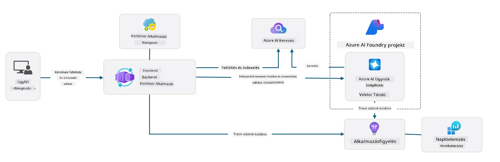

# 3. Dekonstruáld a sablont

!!! tip "ENNEK A MODULNAK A VÉGÉRE KÉPES LESZEL"

    - [ ] Aktiválni a GitHub Copilotot MCP szerverekkel az Azure támogatásához
    - [ ] Megérteni az AZD sablon könyvtárszerkezetét és komponenseit
    - [ ] Felfedezni az infrastruktúra-kód (Bicep) szervezési mintáit
    - [ ] **Lab 3:** Használni a GitHub Copilotot a tárház architektúrájának felfedezéséhez és megértéséhez

---


Az AZD sablonokkal és az Azure Developer CLI-vel (`azd`) gyorsan elindíthatjuk AI fejlesztési utunkat szabványosított tárházakkal, amelyek mintakódot, infrastruktúrát és konfigurációs fájlokat biztosítanak – egy telepítésre kész _starter_ projekt formájában.

**De most meg kell értenünk a projekt szerkezetét és kódbázisát – és képesnek kell lennünk az AZD sablon testreszabására – előzetes tapasztalat vagy AZD ismerete nélkül!**

---

## 1. Aktiváld a GitHub Copilotot

### 1.1 Telepítsd a GitHub Copilot Chat-et

Ideje felfedezni a [GitHub Copilot Agent Mode-ot](https://code.visualstudio.com/docs/copilot/chat/chat-agent-mode). Most már természetes nyelven írhatjuk le feladatunkat magas szinten, és kaphatunk segítséget a végrehajtásához. Ehhez a laborhoz a [Copilot Free tervet](https://github.com/github-copilot/signup) fogjuk használni, amely havi korlátot tartalmaz a válaszokra és a csevegési interakciókra.

A kiterjesztés telepíthető a Marketplace-ről, és gyakran már elérhető Codespaces vagy fejlesztői konténer környezetekben. _Kattints a Copilot ikon legördülő menüjében az `Open Chat`-ra, és írj be egy kérdést, például `What can you do?`_ – előfordulhat, hogy bejelentkezésre kérnek. **A GitHub Copilot Chat készen áll**.

### 1.2. Telepítsd az MCP szervereket

Az Agent mód hatékony működéséhez hozzáférés kell a megfelelő eszközökhöz, hogy tudást szerezzen vagy műveleteket hajtson végre. Itt segíthetnek az MCP szerverek. A következő szervereket fogjuk konfigurálni:

1. [Azure MCP Server](../../../../../workshop/docs/instructions)
1. [Microsoft Docs MCP Server](../../../../../workshop/docs/instructions)

Aktiválásukhoz:

1. Hozz létre egy `.vscode/mcp.json` nevű fájlt, ha még nem létezik
1. Másold bele a következőt – és indítsd el a szervereket!
   ```json title=".vscode/mcp.json"
   {
      "servers": {
         "Azure MCP Server": {
            "command": "npx",
            "args": [
            "-y",
            "@azure/mcp@latest",
            "server",
            "start"
            ]
         },
         "microsoft.docs.mcp": {
            "type": "http",
            "url": "https://learn.microsoft.com/api/mcp"
         }
      }
   }
   ```

??? warning "Előfordulhat, hogy hibát kapsz, miszerint a `npx` nincs telepítve (kattints a javításért)"

      Javításhoz nyisd meg a `.devcontainer/devcontainer.json` fájlt, és add hozzá ezt a sort a features szekcióhoz. Ezután építsd újra a konténert. Most már telepítve lesz az `npx`.

      ```title="" linenums="0"
         "features": {
            "ghcr.io/devcontainers/features/node:1": {},
            ...
         },
      ```

---

### 1.3. Teszteld a GitHub Copilot Chat-et

**Először használd az `azd auth login` parancsot az Azure-ba való azonosításhoz a VS Code parancssorból. Az `az login` használata is ajánlott, ha közvetlenül Azure CLI parancsokat szeretnél futtatni.**

Most már lekérdezheted Azure előfizetésed állapotát, és kérdéseket tehetsz fel az üzembe helyezett erőforrásokról vagy konfigurációkról. Próbáld ki ezeket a promptokat:

1. `List my Azure resource groups`
1. `#foundry list my current deployments`

Kérdezhetsz az Azure dokumentációról is, és a Microsoft Docs MCP szerver által alapozott válaszokat kaphatsz. Próbáld ki ezeket:

1. `#microsoft_docs_search What is Azure Developer CLI?`
1. `#microsoft_docs_search Show me a Python tutorial to chat with deployed model`

Vagy kérhetsz kódrészleteket egy feladat befejezéséhez. Próbáld ki ezt:

1. `Give me a Python code example that uses AAD for an interactive chat client`

Az `Ask` módban olyan kódot kapsz, amit kimásolhatsz és kipróbálhatsz. Az `Agent` módban ez továbbmehet, és létrehozhatja a kapcsolódó erőforrásokat is – beleértve beállító szkripteket és dokumentációt –, hogy segítsen a feladat végrehajtásában.

**Most már fel vagy készülve arra, hogy felfedezd a sablon tárházat**

---

## 2. Dekonstruáld az architektúrát

??? prompt "KÉRÉS: Magyarázd el az alkalmazás architektúráját docs/images/architecture.png fájl alapján 1 bekezdésben"

      Ez az alkalmazás egy Azure-on futó, AI által vezérelt csevegőalkalmazás, amely egy modern, ügynök-alapú architektúrát mutat be. A megoldás középpontjában egy Azure Container App áll, amely hosztolja a fő alkalmazáskódot, mely feldolgozza a felhasználói inputot és intelligens válaszokat generál egy AI ügynök segítségével. 
      
      Az architektúra a Microsoft Foundry Projectet használja AI képességek alapjaként, amely kapcsolódik az Azure AI szolgáltatásokhoz, amelyek biztosítják az alapul szolgáló nyelvi modelleket (például a gpt-4.1-mini) és az ügynök funkciókat. A felhasználói interakciók egy React alapú frontendből a FastAPI backendhez folynak, amely kommunikál az AI ügynökszolgáltatással a kontextuális válaszok generálásához. 
      
      A rendszer tudás-visszakeresési képességeket is magában foglal vagy fájlkeresés, vagy az Azure AI Search szolgáltatás használatával, lehetővé téve az ügynök számára, hogy hozzáférjen és hivatkozzon a feltöltött dokumentumokból származó információkra. Az üzemeltetési kiválóság érdekében az architektúra átfogó monitorozást tartalmaz az Application Insights és Log Analytics Workspace által a nyomkövetéshez, naplózáshoz és teljesítményoptimalizáláshoz. 
      
      Az Azure Storage blob tárolást biztosít az alkalmazás adatainak és fájlfeltöltéseknek, míg a Managed Identity biztonságos hozzáférést garantál az Azure erőforrások között hitelesítő adatok tárolása nélkül. Az egész megoldás skálázhatóságra és karbantarthatóságra van tervezve, a konténerizált alkalmazás automatikusan skálázódik a terhelés függvényében, miközben beépített biztonságot, monitorozást és CI/CD képességeket biztosít az Azure kezelt szolgáltatások ökoszisztémáján keresztül.



---

## 3. Tárház szerkezet

!!! prompt "KÉRÉS: Magyarázd el a sablon könyvtárszerkezetét. Kezdd egy vizuális hierarchikus ábrával."

??? info "VÁLASZ: Vizuális hierarchikus ábra"

      ```bash title="" 
      get-started-with-ai-agents/
      ├── 📋 Konfiguráció és beállítás
      │   ├── azure.yaml                    # Azure Developer CLI konfiguráció
      │   ├── docker-compose.yaml           # Helyi fejlesztő konténerek
      │   ├── pyproject.toml                # Python projekt konfiguráció
      │   ├── requirements-dev.txt          # Fejlesztési függőségek
      │   └── .devcontainer/                # VS Code fejlesztői konténer beállítása
      │
      ├── 🏗️ Infrastruktúra (infra/)
      │   ├── main.bicep                    # Fő infrastrukturális sablon
      │   ├── api.bicep                     # API-specifikus erőforrások
      │   ├── main.parameters.json          # Infrastruktúra paraméterek
      │   └── core/                         # Moduláris infrastruktúra komponensek
      │       ├── ai/                       # AI szolgáltatás konfigurációk
      │       ├── host/                     # Host infrastruktúra
      │       ├── monitor/                  # Monitorozás és naplózás
      │       ├── search/                   # Azure AI Search beállítás
      │       ├── security/                 # Biztonság és identitás
      │       └── storage/                  # Tárfiók konfigurációk
      │
      ├── 💻 Alkalmazás forráskód (src/)
      │   ├── api/                          # Backend API
      │   │   ├── main.py                   # FastAPI alkalmazás belépési pont
      │   │   ├── routes.py                 # API útvonal definíciók
      │   │   ├── search_index_manager.py   # Keresési funkciók
      │   │   ├── data/                     # API adatok kezelése
      │   │   ├── static/                   # Statikus webes erőforrások
      │   │   └── templates/                # HTML sablonok
      │   ├── frontend/                     # React/TypeScript frontend
      │   │   ├── package.json              # Node.js függőségek
      │   │   ├── vite.config.ts            # Vite build konfiguráció
      │   │   └── src/                      # Frontend forráskód
      │   ├── data/                         # Minta adatfájlok
      │   │   └── embeddings.csv            # Előre kalkulált embeddingek
      │   ├── files/                        # Tudásbázis fájlok
      │   │   ├── customer_info_*.json      # Ügyféladat minták
      │   │   └── product_info_*.md         # Termék dokumentációk
      │   ├── Dockerfile                    # Konténer konfiguráció
      │   └── requirements.txt              # Python függőségek
      │
      ├── 🔧 Automatizálás és szkriptek (scripts/)
      │   ├── postdeploy.sh/.ps1           # Telepítés utáni beállítások
      │   ├── setup_credential.sh/.ps1     # Hitelesítés konfiguráció
      │   ├── validate_env_vars.sh/.ps1    # Környezeti változók érvényesítése
      │   └── resolve_model_quota.sh/.ps1  # Modelkvóta kezelése
      │
      ├── 🧪 Tesztelés és értékelés
      │   ├── tests/                        # Egység- és integrációs tesztek
      │   │   └── test_search_index_manager.py
      │   ├── evals/                        # Ügynök értékelő keretrendszer
      │   │   ├── evaluate.py               # Értékelő futtató
      │   │   ├── eval-queries.json         # Teszt lekérdezések
      │   │   └── eval-action-data-path.json
      │   ├── sandbox/                      # Fejlesztői játszótér
      │   │   ├── 1-quickstart.py           # Gyorsindítási példák
      │   │   └── aad-interactive-chat.py   # Hitelesítési példák
      │   └── airedteaming/                 # AI biztonsági értékelés
      │       └── ai_redteaming.py          # Red team tesztelés
      │
      ├── 📚 Dokumentáció (docs/)
      │   ├── deployment.md                 # Telepítési útmutató
      │   ├── local_development.md          # Helyi beállítási utasítások
      │   ├── troubleshooting.md            # Gyakori problémák és megoldások
      │   ├── azure_account_setup.md        # Azure előfeltételek
      │   └── images/                       # Dokumentációs erőforrások
      │
      └── 📄 Projekt metaadatok
         ├── README.md                     # Projekt áttekintés
         ├── CODE_OF_CONDUCT.md           # Közösségi irányelvek
         ├── CONTRIBUTING.md              # Hozzájárulási útmutató
         ├── LICENSE                      # Licencfeltételek
         └── next-steps.md                # Telepítés utáni útmutatás
      ```

### 3.1. Alkalmazás architektúra magja

Ez a sablon egy **full-stack webalkalmazás** mintát követ az alábbiakkal:

- **Backend**: Python FastAPI Azure AI integrációval
- **Frontend**: TypeScript/React Vite build rendszerrel
- **Infrastruktúra**: Azure Bicep sablonok felhő erőforrásokhoz
- **Konténerizáció**: Docker az egységes telepítésért

### 3.2 Infra mint kód (bicep)

Az infrastruktúra réteg **Azure Bicep** sablonokat használ moduláris szervezésben:

   - **`main.bicep`**: Minden Azure erőforrást összehangol
   - **`core/` modulok**: Újrahasználható komponensek különféle szolgáltatásokhoz
      - AI szolgáltatások (Microsoft Foundry modellek, AI Search)
      - Konténer hosztolás (Azure Container Apps)
      - Monitorozás (Application Insights, Log Analytics)
      - Biztonság (Key Vault, Managed Identity)

### 3.3 Alkalmazás forráskód (`src/`)

**Backend API (`src/api/`)**:

- FastAPI alapú REST API
- Foundry Agents integráció
- Keresési index kezelés tudás-visszakereséshez
- Fájl feltöltés és feldolgozás képességek

**Frontend (`src/frontend/`)**:

- Modern React/TypeScript SPA
- Vite gyors fejlesztéshez és optimalizált buildhez
- Csevegő felület ügynök interakciókhoz

**Tudásbázis (`src/files/`)**:

- Minta ügyfél- és termékadatok
- Fájl alapú tudás-visszakeresés bemutatása
- JSON és Markdown formátumú példák


### 3.4 DevOps és automatizálás

**Szkriptek (`scripts/`)**:

- Platformfüggetlen PowerShell és Bash szkriptek
- Környezet validáció és beállítás
- Telepítés utáni konfiguráció
- Modellkvóta menedzsment

**Azure Developer CLI integráció**:

- `azure.yaml` konfiguráció az `azd` munkafolyamatokhoz
- Automatizált felügyelet és telepítés
- Környezeti változók kezelése

### 3.5 Tesztelés és minőségbiztosítás

**Értékelő keretrendszer (`evals/`)**:

- Ügynök teljesítmény értékelése
- Lekérdezés-válasz minőség tesztelése
- Automatizált értékelő csővezeték

**AI biztonság (`airedteaming/`)**:

- Red team tesztelés AI biztonságához
- Biztonsági sebezhetőség vizsgálat
- Felelős AI gyakorlatok

---

## 4. Gratulálunk 🏆

Sikeresen használtad a GitHub Copilot Chat-et MCP szerverekkel a tárház felfedezéséhez.

- [X] Aktiváltad a GitHub Copilotot Azure-hoz
- [X] Megértetted az alkalmazás architektúráját
- [X] Felfedezted az AZD sablon szerkezetét

Ez egy áttekintést ad a sablon _infrastruktúra mint kód_ eszközeiről. Következő lépésként megnézzük az AZD konfigurációs fájlját.

---

<!-- CO-OP TRANSLATOR DISCLAIMER START -->
**Jogi nyilatkozat**:  
Ez a dokumentum az AI fordító szolgáltatás [Co-op Translator](https://github.com/Azure/co-op-translator) segítségével készült. Bár a pontosságra törekszünk, kérjük, vegye figyelembe, hogy az automatikus fordítások hibákat vagy pontatlanságokat tartalmazhatnak. Az eredeti dokumentum az anyanyelvén tekintendő hiteles forrásnak. Kritikus információk esetén szakmai emberi fordítást javaslunk. Nem vállalunk felelősséget az ebből a fordításból eredő félreértésekért vagy téves értelmezésekért.
<!-- CO-OP TRANSLATOR DISCLAIMER END -->