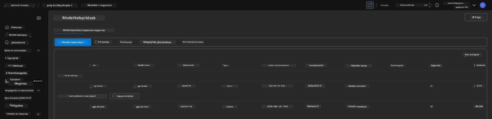
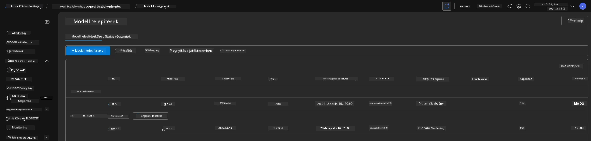

# 6. Infrastruktúra lebontása

!!! tip "A MODUL VÉGÉRE KÉPES LESZEL"

    - [ ] Elem
    - [ ] Elem
    - [ ] Elem

---

## Bónusz Gyakorlatok

Mielőtt lebontanánk a projektet, szánj néhány percet nyitott végű felfedezésre.

!!! danger "NITYA-TODO: Néhány javaslat kidolgozása"

---

## Infrastruktúra megszüntetése

1. Az infrastruktúra lebontása olyan egyszerű, mint:
      
      ```bash title="" linenums="0"
      azd down --purge
      ```
1. A `--purge` kapcsoló biztosítja, hogy a rendszer a soft-deleted Cognitive Service erőforrásokat is törölje, így felszabadítva az ezek által foglalt kvótát. A folyamat befejezése után valami ilyesmit fogsz látni:
      
      ```bash title="" linenums="0"
      ? Total resources to delete: 11, are you sure you want to continue? Yes
      Deleting your resources can take some time.
      (✓) Done: Deleted resource group rg-nitya-mshack-azd
      (✓) Done: Purging Cognitive Account: aoai-3cz3zkynhvpbc

      SUCCESS: Your application was removed from Azure in 11 minutes 4 seconds.
      ```

1. (Opcionális) Ha most újra futtatod az `azd up` parancsot, észre fogod venni, hogy a gpt-4.1 modell telepítésre kerül, mivel a környezeti változó megváltozott (és elmentésre került) a helyi `.azure` mappában.

      Íme a modell telepítések **előtte**:

      

      És íme **utána**:
      

---

