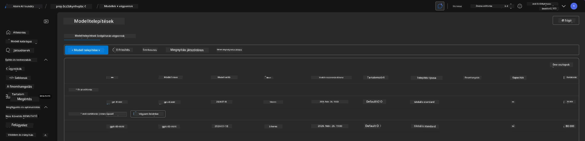
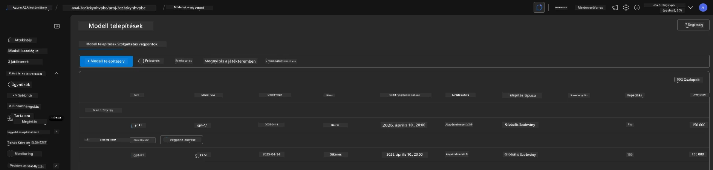

# 6. Infrastruktúra lebontása

!!! tip "A MODUL VÉGÉRE KÉPES LESZ ARRA, HOGY"

    - [ ] Megértse az erőforrások takarításának és a költségkezelés fontosságát
    - [ ] Használja az `azd down` parancsot az infrastruktúra biztonságos lebontásához
    - [ ] Szükség esetén állítsa vissza a lágyan törölt kognitív szolgáltatásokat
    - [ ] **Labor 6:** Tisztítsa meg az Azure erőforrásokat és ellenőrizze az eltávolítást

---

## Bónusz gyakorlatok

Mielőtt lebontanánk a projektet, szánjon néhány percet néhány szabadon választott felfedező feladatra.

!!! info "Próbálja ki ezeket a felfedező kérdéseket"

    **Kísérletezzen a GitHub Copilottal:**
    
    1. Kérdezze meg: `Milyen más AZD sablonokat próbálhatok többügynökös forgatókönyvekhez?`
    2. Kérdezze meg: `Hogyan szabhatom testre az ügynök utasításokat egy egészségügyi esethez?`
    3. Kérdezze meg: `Milyen környezeti változók szabályozzák a költségoptimalizálást?`
    
    **Fedezze fel az Azure Portált:**
    
    1. Tekintse át az Application Insights mérőszámait a telepítéséhez
    2. Ellenőrizze a költségek elemzését az előterjesztett erőforrásokhoz
    3. Fedezze fel még egyszer a Microsoft Foundry portál ügynök játékterét

---

## Infrastruktúra lebontása

1. Az infrastruktúra lebontása olyan egyszerű, mint:
      
      ```bash title="" linenums="0"
      azd down --purge
      ```
1. A `--purge` zászló garantálja, hogy a lágyan törölt Kognitív Szolgáltatás erőforrások is törlődnek, ezzel felszabadítva az ezek által tartott kvótát. A végrehajtás után valami ilyesmit fog látni:
      
      ```bash title="" linenums="0"
      ? Total resources to delete: 11, are you sure you want to continue? Yes
      Deleting your resources can take some time.
      (✓) Done: Deleted resource group rg-nitya-mshack-azd
      (✓) Done: Purging Cognitive Account: aoai-3cz3zkynhvpbc

      SUCCESS: Your application was removed from Azure in 11 minutes 4 seconds.
      ```

1. (Opcionális) Ha most újra futtatja az `azd up` parancsot, észreveheti, hogy a gpt-4.1 modell telepítve lesz, mivel a környezeti változó megváltozott (és elmentve) a helyi `.azure` mappában. 

      Íme a modell telepítések **előtt**:

      

      És itt van **utána**:
      

---

<!-- CO-OP TRANSLATOR DISCLAIMER START -->
**Nyilatkozat**:  
Ezt a dokumentumot az [Co-op Translator](https://github.com/Azure/co-op-translator) mesterséges intelligencia alapú fordító szolgáltatás segítségével fordítottuk. Míg a pontosságra törekszünk, kérjük, vegye figyelembe, hogy az automatikus fordítások hibákat vagy pontatlanságokat tartalmazhatnak. Az eredeti, anyanyelvi dokumentum tekintendő hivatalos forrásnak. Fontos információk esetén szakmai, emberi fordítást javaslunk. Nem vállalunk felelősséget az ezen fordítás használatából eredő félreértésekért vagy félreértelmezésekért.
<!-- CO-OP TRANSLATOR DISCLAIMER END -->