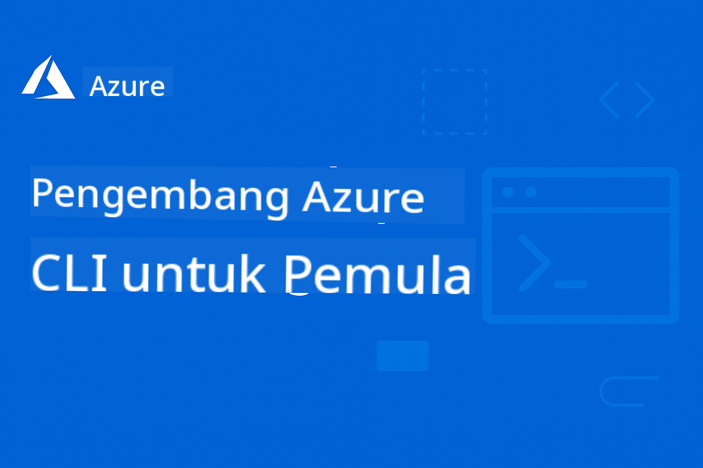

<!--
CO_OP_TRANSLATOR_METADATA:
{
  "original_hash": "ee9a026a572535444287d531dbd75d78",
  "translation_date": "2025-09-12T21:22:50+00:00",
  "source_file": "README.md",
  "language_code": "id"
}
-->
# AZD Untuk Pemula

 

[](https://GitHub.com/microsoft/azd-for-beginners/watchers/?WT.mc_id=academic-105485-koreyst)
[](https://GitHub.com/microsoft/azd-for-beginners/network/?WT.mc_id=academic-105485-koreyst)
[](https://GitHub.com/microsoft/azd-for-beginners/stargazers/?WT.mc_id=academic-105485-koreyst)


Ikuti langkah-langkah berikut untuk mulai menggunakan sumber daya ini:
1. **Fork Repository**: Klik [](https://GitHub.com/microsoft/azd-for-beginners/fork)
2. **Clone Repository**:   `git clone https://github.com/microsoft/azd-for-beginners.git`
3. [**Bergabunglah dengan Komunitas Azure Discord dan temui para ahli serta pengembang lainnya**](https://discord.com/invite/ByRwuEEgH4)

### Dukungan Multi-Bahasa

#### Didukung melalui GitHub Action (Otomatis & Selalu Terbaru)

[French](../fr/README.md) | [Spanish](../es/README.md) | [German](../de/README.md) | [Russian](../ru/README.md) | [Arabic](../ar/README.md) | [Persian (Farsi)](../fa/README.md) | [Urdu](../ur/README.md) | [Chinese (Simplified)](../zh/README.md) | [Chinese (Traditional, Macau)](../mo/README.md) | [Chinese (Traditional, Hong Kong)](../hk/README.md) | [Chinese (Traditional, Taiwan)](../tw/README.md) | [Japanese](../ja/README.md) | [Korean](../ko/README.md) | [Hindi](../hi/README.md) | [Bengali](../bn/README.md) | [Marathi](../mr/README.md) | [Nepali](../ne/README.md) | [Punjabi (Gurmukhi)](../pa/README.md) | [Portuguese (Portugal)](../pt/README.md) | [Portuguese (Brazil)](../br/README.md) | [Italian](../it/README.md) | [Polish](../pl/README.md) | [Turkish](../tr/README.md) | [Greek](../el/README.md) | [Thai](../th/README.md) | [Swedish](../sv/README.md) | [Danish](../da/README.md) | [Norwegian](../no/README.md) | [Finnish](../fi/README.md) | [Dutch](../nl/README.md) | [Hebrew](../he/README.md) | [Vietnamese](../vi/README.md) | [Indonesian](./README.md) | [Malay](../ms/README.md) | [Tagalog (Filipino)](../tl/README.md) | [Swahili](../sw/README.md) | [Hungarian](../hu/README.md) | [Czech](../cs/README.md) | [Slovak](../sk/README.md) | [Romanian](../ro/README.md) | [Bulgarian](../bg/README.md) | [Serbian (Cyrillic)](../sr/README.md) | [Croatian](../hr/README.md) | [Slovenian](../sl/README.md) | [Ukrainian](../uk/README.md) | [Burmese (Myanmar)](../my/README.md)

**Jika Anda ingin mendukung bahasa tambahan, daftar bahasa yang didukung tersedia [di sini](https://github.com/Azure/co-op-translator/blob/main/getting_started/supported-languages.md)**

## Pengantar

Selamat datang di panduan lengkap untuk Azure Developer CLI (azd). Repository ini dirancang untuk membantu pengembang dari berbagai tingkat, mulai dari pelajar hingga profesional, mempelajari dan menguasai Azure Developer CLI untuk penerapan cloud yang efisien, **dengan fokus khusus pada penerapan aplikasi AI menggunakan Azure AI Foundry**. Sumber belajar yang terstruktur ini memberikan pengalaman langsung dengan penerapan cloud Azure, pemecahan masalah umum, dan penerapan praktik terbaik untuk keberhasilan penerapan template AZD.

### **Mengapa Panduan Ini Penting untuk Pengembang AI**
Berdasarkan survei komunitas Discord Azure AI Foundry baru-baru ini, **45% pengembang tertarik menggunakan AZD untuk beban kerja AI** tetapi menghadapi tantangan dengan:
- Arsitektur AI multi-layanan yang kompleks
- Praktik terbaik penerapan AI di lingkungan produksi
- Integrasi dan konfigurasi layanan Azure AI
- Optimasi biaya untuk beban kerja AI
- Pemecahan masalah penerapan khusus AI

## Tujuan Pembelajaran

Dengan mempelajari repository ini, Anda akan:
- Menguasai dasar-dasar dan konsep inti Azure Developer CLI
- Belajar menerapkan dan menyediakan sumber daya Azure menggunakan Infrastructure as Code
- Mengembangkan keterampilan pemecahan masalah untuk masalah penerapan AZD yang umum
- Memahami validasi pra-penerapan dan perencanaan kapasitas
- Menerapkan praktik terbaik keamanan dan strategi optimasi biaya
- Membangun kepercayaan diri dalam menerapkan aplikasi siap produksi ke Azure

## Hasil Pembelajaran

Setelah menyelesaikan kursus ini, Anda akan dapat:
- Menginstal, mengonfigurasi, dan menggunakan Azure Developer CLI dengan sukses
- Membuat dan menerapkan aplikasi menggunakan template AZD
- Memecahkan masalah autentikasi, infrastruktur, dan penerapan
- Melakukan pemeriksaan pra-penerapan termasuk perencanaan kapasitas dan pemilihan SKU
- Menerapkan praktik terbaik untuk pemantauan, keamanan, dan manajemen biaya
- Mengintegrasikan alur kerja AZD ke dalam pipeline CI/CD

## Daftar Isi

- [Apa itu Azure Developer CLI?](../..)
- [Memulai Cepat](../..)
- [Jalur Pembelajaran](../..)
  - [Untuk Pengembang AI (Disarankan Mulai di Sini!)](../..)
  - [Untuk Pelajar & Pemula](../..)
  - [Untuk Pengembang](../..)
  - [Untuk Insinyur DevOps](../..)
- [Dokumentasi](../..)
  - [Memulai](../..)
  - [Penerapan & Penyediaan](../..)
  - [Pemeriksaan Pra-Penerapan](../..)
  - [AI & Azure AI Foundry](../..)
  - [Pemecahan Masalah](../..)
- [Contoh & Template](../..)
  - [Unggulan: Template Azure AI Foundry](../..)
  - [Unggulan: Skenario E2E Azure AI Foundry](../..)
  - [Template AZD Tambahan](../..)
  - [Lab & Workshop Praktis](../..)
- [Sumber Daya](../..)
- [Kontribusi](../..)
- [Dukungan](../..)
- [Komunitas](../..)

## Apa itu Azure Developer CLI?

Azure Developer CLI (azd) adalah antarmuka baris perintah yang berpusat pada pengembang yang mempercepat proses pembangunan dan penerapan aplikasi ke Azure. Fitur yang disediakan:

- **Penerapan berbasis template** - Gunakan template yang sudah dibuat untuk pola aplikasi umum
- **Infrastructure as Code** - Kelola sumber daya Azure menggunakan Bicep atau Terraform
- **Alur kerja terintegrasi** - Menyediakan, menerapkan, dan memantau aplikasi secara mulus
- **Ramah pengembang** - Dioptimalkan untuk produktivitas dan pengalaman pengembang

### **AZD + Azure AI Foundry: Sempurna untuk Penerapan AI**

**Mengapa AZD untuk Solusi AI?** AZD mengatasi tantangan utama yang dihadapi pengembang AI:

- **Template Siap AI** - Template yang sudah dikonfigurasi untuk Azure OpenAI, Cognitive Services, dan beban kerja ML
- **Penerapan AI yang Aman** - Pola keamanan bawaan untuk layanan AI, kunci API, dan endpoint model
- **Pola AI Produksi** - Praktik terbaik untuk penerapan aplikasi AI yang skalabel dan hemat biaya
- **Alur Kerja AI End-to-End** - Dari pengembangan model hingga penerapan produksi dengan pemantauan yang tepat
- **Optimasi Biaya** - Strategi alokasi dan penskalaan sumber daya yang cerdas untuk beban kerja AI
- **Integrasi Azure AI Foundry** - Koneksi mulus ke katalog model dan endpoint AI Foundry

## Memulai Cepat

### Prasyarat
- Langganan Azure
- Azure CLI terinstal
- Git (untuk cloning template)

### Instalasi
```bash
# Windows (PowerShell)
powershell -ex AllSigned -c "Invoke-RestMethod 'https://aka.ms/install-azd.ps1' | Invoke-Expression"

# macOS/Linux
curl -fsSL https://aka.ms/install-azd.sh | bash
```

### Penerapan Pertama Anda
```bash
# Initialize a new project
azd init --template todo-nodejs-mongo

# Provision Azure resources and deploy
azd up
```

### Penerapan AI Pertama Anda
```bash
# Initialize an AI-powered chat application with Azure OpenAI
azd init --template azure-search-openai-demo

# Configure AI services and deploy
azd up

# Or try other AI templates:
azd init --template openai-chat-app-quickstart
azd init --template ai-document-processing
azd init --template contoso-chat
```

## Jalur Pembelajaran

### Untuk Pengembang AI (Disarankan Mulai di Sini!)
1. **Memulai Cepat**: Coba template [azure-search-openai-demo](https://github.com/Azure-Samples/azure-search-openai-demo)
2. **Pelajari Dasar-Dasar**: [Dasar-Dasar AZD](docs/getting-started/azd-basics.md) + [Integrasi Azure AI Foundry](docs/ai-foundry/azure-ai-foundry-integration.md)
3. **Latihan Praktis**: Selesaikan [Lab Workshop AI](docs/ai-foundry/ai-workshop-lab.md)
4. **Siap Produksi**: Tinjau [Praktik Terbaik AI Produksi](docs/ai-foundry/production-ai-practices.md)
5. **Lanjutan**: Terapkan template perusahaan [contoso-chat](https://github.com/Azure-Samples/contoso-chat)

### Untuk Pelajar & Pemula
1. Mulai dengan [Dasar-Dasar AZD](docs/getting-started/azd-basics.md)
2. Ikuti [Panduan Instalasi](docs/getting-started/installation.md)
3. Selesaikan [Proyek Pertama Anda](docs/getting-started/first-project.md)
4. Latihan dengan [Contoh Aplikasi Web Sederhana](../../examples/simple-web-app)

### Untuk Pengembang
1. Tinjau [Panduan Konfigurasi](docs/getting-started/configuration.md)
2. Pelajari [Panduan Penerapan](docs/deployment/deployment-guide.md)
3. Kerjakan [Contoh Aplikasi Database](../../examples/database-app)
4. Jelajahi [Contoh Aplikasi Container](../../examples/container-app)

### Untuk Insinyur DevOps
1. Kuasai [Penyediaan Sumber Daya](docs/deployment/provisioning.md)
2. Terapkan [Pemeriksaan Pra-Penerbangan](docs/pre-deployment/preflight-checks.md)
3. Latihan [Perencanaan Kapasitas](docs/pre-deployment/capacity-planning.md)
4. Lanjutan [Contoh Microservices](../../examples/microservices)

## Dokumentasi

### Memulai
- [**Dasar-Dasar AZD**](docs/getting-started/azd-basics.md) - Konsep inti dan terminologi
- [**Instalasi & Pengaturan**](docs/getting-started/installation.md) - Panduan instalasi spesifik platform
- [**Konfigurasi**](docs/getting-started/configuration.md) - Pengaturan lingkungan dan autentikasi
- [**Proyek Pertama Anda**](docs/getting-started/first-project.md) - Tutorial langkah demi langkah

### Penerapan & Penyediaan
- [**Panduan Penerapan**](docs/deployment/deployment-guide.md) - Alur kerja penerapan lengkap
- [**Penyediaan Sumber Daya**](docs/deployment/provisioning.md) - Manajemen sumber daya Azure

### Pemeriksaan Pra-Penerapan
- [**Perencanaan Kapasitas**](docs/pre-deployment/capacity-planning.md) - Validasi kapasitas sumber daya Azure
- [**Pemilihan SKU**](docs/pre-deployment/sku-selection.md) - Memilih SKU Azure yang tepat
- [**Pemeriksaan Pra-Penerbangan**](docs/pre-deployment/preflight-checks.md) - Skrip validasi otomatis

### AI & Azure AI Foundry
- [**Integrasi Azure AI Foundry**](docs/ai-foundry/azure-ai-foundry-integration.md) - Hubungkan AZD dengan layanan Azure AI Foundry
- [**Pola Penerapan Model AI**](docs/ai-foundry/ai-model-deployment.md) - Terapkan dan kelola model AI dengan AZD
- [**Lab Workshop AI**](docs/ai-foundry/ai-workshop-lab.md) - Lab praktis: Membuat solusi AI siap AZD
- [**Praktik Terbaik AI Produksi**](docs/ai-foundry/production-ai-practices.md) - Keamanan, penskalaan, dan pemantauan untuk beban kerja AI

### Pemecahan Masalah
- [**Masalah Umum**](docs/troubleshooting/common-issues.md) - Masalah yang sering ditemui dan solusinya
- [**Panduan Debugging**](docs/troubleshooting/debugging.md) - Strategi debugging langkah demi langkah  
- [**Pemecahan Masalah Khusus AI**](docs/troubleshooting/ai-troubleshooting.md) - Masalah layanan AI dan penerapan model  

## Contoh & Template  

### [Unggulan: Template Azure AI Foundry](https://ai.azure.com/resource/build/templates)  
**Mulai di sini jika Anda menerapkan aplikasi AI!**  

| Template | Deskripsi | Kompleksitas | Layanan |
|----------|-------------|------------|----------|
| [**Memulai dengan AI chat**](https://github.com/Azure-Samples/get-started-with-ai-chat) | Buat dan terapkan aplikasi chat dasar yang terintegrasi dengan data dan wawasan telemetri Anda menggunakan Azure Container Apps |⭐⭐ | AzureOpenAI + Azure AI Model Inference API + Azure AI Search + Azure Container Apps + Application Insights |
| [**Memulai dengan agen AI**](https://github.com/Azure-Samples/get-started-with-ai-agents) | Buat dan terapkan aplikasi agen dasar dengan tindakan dan wawasan telemetri menggunakan Azure Container Apps. |⭐⭐ | Azure AI Agent Service + AzureOpenAI + Azure AI Search + Azure Container Apps + Application Insights|
| [**Otomasi alur kerja multi-agen**](https://github.com/Azure-Samples/get-started-with-ai-chat) | Tingkatkan perencanaan tugas dan otomasi dengan mengorkestrasi dan mengelola sekelompok agen AI.|⭐⭐⭐ | AzureOpenAI + Azure AI Agent Service + Semantic Kernel + Azure CosmosDB + Azure Container Apps|
| [**Menghasilkan dokumen dari data Anda**](https://github.com/Azure-Samples/get-started-with-ai-chat) | Percepat pembuatan dokumen seperti kontrak, faktur, dan proposal investasi dengan menemukan dan merangkum informasi relevan dari data Anda. |⭐⭐⭐  | AzureOpenAI + Azure AI Search + Azure AI Services + Azure CosmosDB|
| [**Meningkatkan pertemuan klien dengan agen**](https://github.com/Azure-Samples/get-started-with-ai-chat) | Migrasi kode lama ke bahasa modern dengan memanfaatkan tim agen. |⭐⭐⭐| AzureOpenAI + Azure AI Search + Azure CosmosDB + Azure SQL Database |
| [**Modernisasi kode Anda dengan agen**](https://github.com/Azure-Samples/get-started-with-ai-chat) | Buat dan terapkan aplikasi chat dasar yang terintegrasi dengan data dan wawasan telemetri Anda menggunakan Azure Container Apps |⭐⭐⭐ | AzureOpenAI + Azure Agent Service + Semantic Kernel + Azure CosmosDB + Azure Container Apps|
| [**Bangun agen percakapan Anda**](https://github.com/Azure-Samples/get-started-with-ai-chat) | Manfaatkan pemahaman percakapan tingkat lanjut untuk membuat dan meningkatkan chatbot serta agen dengan alur kerja deterministik dan dapat dikontrol manusia. |⭐⭐⭐ | AI Language + AzureOpenAI + AI Search + Azure Storage + Azure Container Registry|
| [**Membuka wawasan dari data percakapan**](https://github.com/Azure-Samples/get-started-with-ai-chat) | Tingkatkan efisiensi pusat kontak dengan mengungkap wawasan dari kumpulan data audio dan teks besar menggunakan kemampuan pemahaman konten tingkat lanjut. |⭐⭐⭐ | AzureOpenAI + AI Search + Semantic Kernel + Azure Agent Service + AI AI Content Understanding|
| [**Pemrosesan konten multi-modal**](https://github.com/Azure-Samples/get-started-with-ai-chat) | Proses klaim, faktur, kontrak, dan dokumen lainnya dengan cepat dan akurat dengan mengekstrak informasi dari konten tidak terstruktur dan memetakannya ke format terstruktur. Template ini mendukung teks, gambar, tabel, dan grafik. |⭐⭐⭐⭐ | AzureOpenAI + Azure Content Understanding + Azure CosmosDB + Azure Container Apps|

### Unggulan: Skenario E2E Azure AI Foundry  
**Mulai di sini jika Anda menerapkan aplikasi AI!**  

| Template | Deskripsi | Kompleksitas | Layanan |
|----------|-------------|------------|----------|
| [**openai-chat-app-quickstart**](https://github.com/Azure-Samples/openai-chat-app-quickstart) | Antarmuka chat sederhana dengan Azure OpenAI | ⭐ | AzureOpenAI + Container Apps |
| [**azure-search-openai-demo**](https://github.com/Azure-Samples/azure-search-openai-demo) | Aplikasi chat dengan RAG yang diaktifkan menggunakan Azure OpenAI | ⭐⭐ | AzureOpenAI + Search + App Service |
| [**ai-document-processing**](https://github.com/Azure-Samples/ai-document-processing) | Analisis dokumen dengan layanan AI | ⭐⭐ | Azure Document Intelligence + Functions |
| [**agent-openai-python-prompty**](https://github.com/Azure-Samples/agent-openai-python-prompty) | Kerangka kerja agen AI dengan pemanggilan fungsi | ⭐⭐⭐ | AzureOpenAI + Azure Container Apps + Functions |
| [**contoso-chat**](https://github.com/Azure-Samples/contoso-chat) | Chat perusahaan dengan orkestrasi AI | ⭐⭐⭐ | AzureOpenAI + Azure AI Search + Container Apps |

### Template AZD Tambahan  
- [**Direktori Contoh**](examples/README.md) - Contoh praktis, template, dan skenario dunia nyata  
- [**Template AZD Azure-Samples**](https://github.com/Azure-Samples/azd-templates) - Template contoh resmi Microsoft  
- [**Galeri AZD yang Luar Biasa**](https://azure.github.io/awesome-azd/) - Template yang disumbangkan oleh komunitas  

### Lab & Workshop Praktis  
- [**Lab Workshop AI**](docs/ai-foundry/ai-workshop-lab.md) - **BARU**: Buat solusi AI Anda dapat diterapkan dengan AZD  
- [**Workshop AZD Untuk Pemula**](workshop/README.md) - Fokus pada penerapan template agen AI dengan AZD  

## Sumber Daya  

### Referensi Cepat  
- [**Lembar Cheat Perintah**](resources/cheat-sheet.md) - Perintah azd penting  
- [**Glosarium**](resources/glossary.md) - Terminologi Azure dan azd  
- [**FAQ**](resources/faq.md) - Pertanyaan yang sering diajukan  
- [**Panduan Belajar**](resources/study-guide.md) - Tujuan pembelajaran dan latihan komprehensif  

### Sumber Daya Eksternal  
- [Dokumentasi Azure Developer CLI](https://learn.microsoft.com/en-us/azure/developer/azure-developer-cli/)  
- [Pusat Arsitektur Azure](https://learn.microsoft.com/en-us/azure/architecture/)  
- [Kalkulator Harga Azure](https://azure.microsoft.com/pricing/calculator/)  
- [Status Azure](https://status.azure.com/)  

## Kontribusi  

Kami menyambut kontribusi! Silakan baca [Panduan Kontribusi](CONTRIBUTING.md) untuk detail tentang:  
- Cara mengirimkan masalah dan permintaan fitur  
- Panduan kontribusi kode  
- Peningkatan dokumentasi  
- Standar komunitas  

## Dukungan  

- **Masalah**: [Laporkan bug dan minta fitur](https://github.com/microsoft/azd-for-beginners/issues)  
- **Diskusi**: [Tanya jawab dan diskusi Komunitas Microsoft Azure Discord](https://discord.gg/microsoft-azure)  
- **Dukungan Khusus AI**: Bergabunglah dengan [#Azure channel](https://discord.gg/microsoft-azure) untuk diskusi AZD + AI Foundry  
- **Email**: Untuk pertanyaan pribadi  
- **Microsoft Learn**: [Dokumentasi resmi Azure Developer CLI](https://learn.microsoft.com/en-us/azure/developer/azure-developer-cli/)  

### Wawasan Komunitas dari Discord Azure AI Foundry  

**Hasil Polling dari #Azure Channel:**  
- **45%** pengembang ingin menggunakan AZD untuk beban kerja AI  
- **Tantangan utama**: Penerapan multi-layanan, manajemen kredensial, kesiapan produksi  
- **Permintaan terbanyak**: Template khusus AI, panduan pemecahan masalah, praktik terbaik  

**Bergabunglah dengan komunitas kami untuk:**  
- Bagikan pengalaman AZD + AI Anda dan dapatkan bantuan  
- Akses pratinjau awal template AI baru  
- Berkontribusi pada praktik terbaik penerapan AI  
- Pengaruhi pengembangan fitur AI + AZD di masa depan  

## Lisensi  

Proyek ini dilisensikan di bawah Lisensi MIT - lihat file [LICENSE](../../LICENSE) untuk detailnya.  

## Kursus Lain  

Tim kami membuat kursus lainnya! Lihat:  

- [**BARU** Protokol Konteks Model (MCP) Untuk Pemula](https://github.com/microsoft/mcp-for-beginners?WT.mc_id=academic-105485-koreyst)  
- [Agen AI untuk Pemula](https://github.com/microsoft/ai-agents-for-beginners?WT.mc_id=academic-105485-koreyst)  
- [Generative AI untuk Pemula menggunakan .NET](https://github.com/microsoft/Generative-AI-for-beginners-dotnet?WT.mc_id=academic-105485-koreyst)  
- [Generative AI untuk Pemula](https://github.com/microsoft/generative-ai-for-beginners?WT.mc_id=academic-105485-koreyst)  
- [Generative AI untuk Pemula menggunakan Java](https://github.com/microsoft/generative-ai-for-beginners-java?WT.mc_id=academic-105485-koreyst)  
- [ML untuk Pemula](https://aka.ms/ml-beginners?WT.mc_id=academic-105485-koreyst)  
- [Data Science untuk Pemula](https://aka.ms/datascience-beginners?WT.mc_id=academic-105485-koreyst)  
- [AI untuk Pemula](https://aka.ms/ai-beginners?WT.mc_id=academic-105485-koreyst)  
- [Keamanan Siber untuk Pemula](https://github.com/microsoft/Security-101??WT.mc_id=academic-96948-sayoung)  
- [Pengembangan Web untuk Pemula](https://aka.ms/webdev-beginners?WT.mc_id=academic-105485-koreyst)  
- [IoT untuk Pemula](https://aka.ms/iot-beginners?WT.mc_id=academic-105485-koreyst)  
- [Pengembangan XR untuk Pemula](https://github.com/microsoft/xr-development-for-beginners?WT.mc_id=academic-105485-koreyst)  
- [Menguasai GitHub Copilot untuk Pemrograman Berpasangan AI](https://aka.ms/GitHubCopilotAI?WT.mc_id=academic-105485-koreyst)  
- [Menguasai GitHub Copilot untuk Pengembang C#/.NET](https://github.com/microsoft/mastering-github-copilot-for-dotnet-csharp-developers?WT.mc_id=academic-105485-koreyst)  
- [Pilih Petualangan Copilot Anda Sendiri](https://github.com/microsoft/CopilotAdventures?WT.mc_id=academic-105485-koreyst)  

---

**Navigasi**  
- **Pelajaran Berikutnya**: [Dasar-dasar AZD](docs/getting-started/azd-basics.md)  

---

**Penafian**:  
Dokumen ini telah diterjemahkan menggunakan layanan penerjemahan AI [Co-op Translator](https://github.com/Azure/co-op-translator). Meskipun kami berusaha untuk memberikan hasil yang akurat, harap diingat bahwa terjemahan otomatis mungkin mengandung kesalahan atau ketidakakuratan. Dokumen asli dalam bahasa aslinya harus dianggap sebagai sumber yang otoritatif. Untuk informasi yang bersifat kritis, disarankan menggunakan jasa penerjemahan profesional oleh manusia. Kami tidak bertanggung jawab atas kesalahpahaman atau penafsiran yang keliru yang timbul dari penggunaan terjemahan ini.