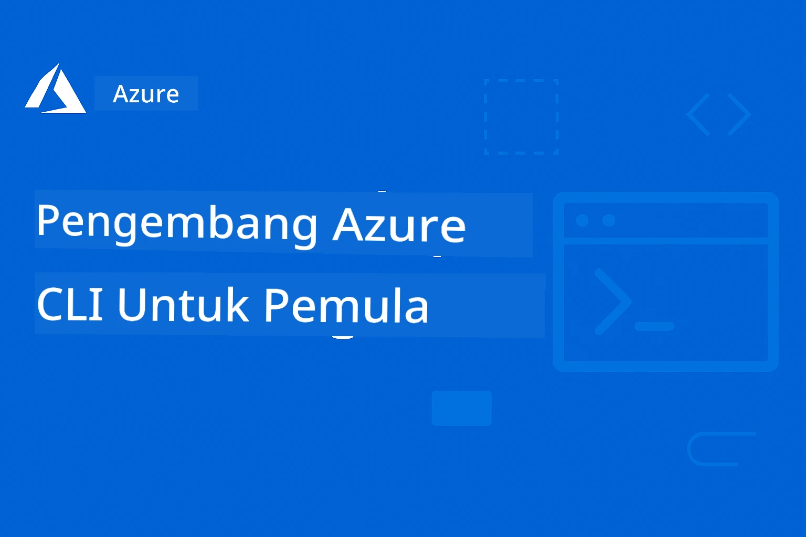

# AZD Untuk Pemula: Perjalanan Pembelajaran Terstruktur

 

[](https://GitHub.com/microsoft/azd-for-beginners/watchers/)
[](https://GitHub.com/microsoft/azd-for-beginners/network/)
[](https://GitHub.com/microsoft/azd-for-beginners/stargazers/)

[](https://discord.com/invite/nkVh3dp)
[](https://discord.gg/nTYy5BXMWG)

---

### Terjemahan Otomatis (Selalu Terbaru)

<!-- CO-OP TRANSLATOR LANGUAGES TABLE START -->
[Arabic](../ar/README.md) | [Bengali](../bn/README.md) | [Bulgarian](../bg/README.md) | [Burmese (Myanmar)](../my/README.md) | [Chinese (Simplified)](../zh-CN/README.md) | [Chinese (Traditional, Hong Kong)](../zh-HK/README.md) | [Chinese (Traditional, Macau)](../zh-MO/README.md) | [Chinese (Traditional, Taiwan)](../zh-TW/README.md) | [Croatian](../hr/README.md) | [Czech](../cs/README.md) | [Danish](../da/README.md) | [Dutch](../nl/README.md) | [Estonian](../et/README.md) | [Finnish](../fi/README.md) | [French](../fr/README.md) | [German](../de/README.md) | [Greek](../el/README.md) | [Hebrew](../he/README.md) | [Hindi](../hi/README.md) | [Hungarian](../hu/README.md) | [Indonesian](./README.md) | [Italian](../it/README.md) | [Japanese](../ja/README.md) | [Kannada](../kn/README.md) | [Korean](../ko/README.md) | [Lithuanian](../lt/README.md) | [Malay](../ms/README.md) | [Malayalam](../ml/README.md) | [Marathi](../mr/README.md) | [Nepali](../ne/README.md) | [Nigerian Pidgin](../pcm/README.md) | [Norwegian](../no/README.md) | [Persian (Farsi)](../fa/README.md) | [Polish](../pl/README.md) | [Portuguese (Brazil)](../pt-BR/README.md) | [Portuguese (Portugal)](../pt-PT/README.md) | [Punjabi (Gurmukhi)](../pa/README.md) | [Romanian](../ro/README.md) | [Russian](../ru/README.md) | [Serbian (Cyrillic)](../sr/README.md) | [Slovak](../sk/README.md) | [Slovenian](../sl/README.md) | [Spanish](../es/README.md) | [Swahili](../sw/README.md) | [Swedish](../sv/README.md) | [Tagalog (Filipino)](../tl/README.md) | [Tamil](../ta/README.md) | [Telugu](../te/README.md) | [Thai](../th/README.md) | [Turkish](../tr/README.md) | [Ukrainian](../uk/README.md) | [Urdu](../ur/README.md) | [Vietnamese](../vi/README.md)

> **Lebih Suka Mengkloning Secara Lokal?**
>
> This repository includes 50+ language translations which significantly increases the download size. To clone without translations, use sparse checkout:
>
> **Bash / macOS / Linux:**
> ```bash
> git clone --filter=blob:none --sparse https://github.com/microsoft/AZD-for-beginners.git
> cd AZD-for-beginners
> git sparse-checkout set --no-cone '/*' '!translations' '!translated_images'
> ```
>
> **CMD (Windows):**
> ```cmd
> git clone --filter=blob:none --sparse https://github.com/microsoft/AZD-for-beginners.git
> cd AZD-for-beginners
> git sparse-checkout set --no-cone "/*" "!translations" "!translated_images"
> ```
>
> Ini memberi Anda semua yang Anda butuhkan untuk menyelesaikan kursus dengan unduhan yang jauh lebih cepat.
<!-- CO-OP TRANSLATOR LANGUAGES TABLE END -->

## 🆕 Apa yang Baru di azd Hari Ini

Azure Developer CLI telah berkembang melampaui aplikasi web dan API tradisional. Hari ini, azd adalah satu-satunya alat untuk melakukan deploy **apapun** aplikasi ke Azure—termasuk aplikasi bertenaga AI dan agen cerdas.

Berikut artinya bagi Anda:

- **Agen AI kini menjadi workload azd kelas satu.** Anda dapat menginisialisasi, mendeploy, dan mengelola proyek agen AI menggunakan alur kerja yang sama `azd init` → `azd up` yang sudah Anda kenal.
- **Integrasi Microsoft Foundry** membawa deployment model, hosting agen, dan konfigurasi layanan AI langsung ke dalam ekosistem template azd.
- **Alur kerja inti tidak berubah.** Baik Anda mendeploy aplikasi todo, sebuah microservice, atau solusi AI multi-agen, perintahnya tetap sama.

Jika Anda sudah pernah menggunakan azd sebelumnya, dukungan AI adalah perluasan alami—bukan alat terpisah atau jalur lanjutan. Jika Anda memulai dari awal, Anda akan belajar satu alur kerja yang bekerja untuk segalanya.

---

## 🚀 Apa itu Azure Developer CLI (azd)?

**Azure Developer CLI (azd)** adalah alat baris perintah yang ramah pengembang yang memudahkan penerapan aplikasi ke Azure. Alih-alih membuat dan menghubungkan puluhan sumber daya Azure secara manual, Anda dapat mendeploy seluruh aplikasi dengan satu perintah.

### Keajaiban `azd up`

```bash
# Perintah tunggal ini melakukan semuanya:
# ✅ Membuat semua sumber daya Azure
# ✅ Mengonfigurasi jaringan dan keamanan
# ✅ Membangun kode aplikasi Anda
# ✅ Menerapkan ke Azure
# ✅ Memberikan Anda URL yang berfungsi
azd up
```

**Itu dia!** Tidak perlu mengklik Azure Portal, tidak perlu mempelajari template ARM yang kompleks terlebih dahulu, tidak perlu konfigurasi manual - hanya aplikasi yang berjalan di Azure.

---

## ❓ Azure Developer CLI vs Azure CLI: Apa Perbedaannya?

Ini adalah pertanyaan paling umum yang diajukan pemula. Berikut jawaban singkatnya:

| Fitur | **Azure CLI (`az`)** | **Azure Developer CLI (`azd`)** |
|---------|---------------------|--------------------------------|
| **Tujuan** | Mengelola sumber daya Azure individu | Menerapkan aplikasi lengkap |
| **Pendekatan** | Berfokus pada infrastruktur | Berfokus pada aplikasi |
| **Contoh** | `az webapp create --name myapp...` | `azd up` |
| **Kurva Pembelajaran** | Harus mengetahui layanan Azure | Cukup tahu aplikasi Anda |
| **Terbaik untuk** | DevOps, Infrastruktur | Pengembang, Pembuatan prototipe |

### Analogi Sederhana

- **Azure CLI** seperti memiliki semua alat untuk membangun rumah - palu, gergaji, paku. Anda bisa membangun apa saja, tetapi Anda perlu mengetahui konstruksi.
- **Azure Developer CLI** seperti menyewa kontraktor - Anda menjelaskan apa yang Anda mau, dan mereka menangani pembangunannya.

### Kapan Menggunakan Masing-Masing

| Skenario | Gunakan Ini |
|----------|----------|
| "I want to deploy my web app quickly" | `azd up` |
| "I need to create just a storage account" | `az storage account create` |
| "I'm building a full AI application" | `azd init --template azure-search-openai-demo` |
| "I need to debug a specific Azure resource" | `az resource show` |
| "I want production-ready deployment in minutes" | `azd up --environment production` |

### Mereka Bekerja Bersama!

AZD menggunakan Azure CLI di balik layar. Anda dapat menggunakan keduanya:
```bash
# Deploy aplikasi Anda dengan AZD
azd up

# Kemudian sesuaikan sumber daya tertentu dengan Azure CLI
az webapp config set --name myapp --always-on true
```

---

## 🌟 Temukan Template di Awesome AZD

Jangan memulai dari awal! **Awesome AZD** adalah kumpulan komunitas template yang siap dideploy:

| Sumber Daya | Deskripsi |
|----------|-------------|
| 🔗 [**Awesome AZD Gallery**](https://azure.github.io/awesome-azd/) | Telusuri lebih dari 200 template dengan deploy sekali klik |
| 🔗 [**Submit a Template**](https://github.com/Azure/awesome-azd/issues) | Kontribusikan template Anda ke komunitas |
| 🔗 [**GitHub Repository**](https://github.com/Azure/awesome-azd) | Beri bintang dan jelajahi sumbernya |

### Template AI Populer dari Awesome AZD

```bash
# Obrolan RAG dengan Model Microsoft Foundry + Pencarian AI
azd init --template azure-search-openai-demo

# Aplikasi Obrolan AI Cepat
azd init --template openai-chat-app-quickstart

# Agen AI dengan Agen Foundry
azd init --template get-started-with-ai-agents
```

---

## 🎯 Memulai dalam 3 Langkah

### Langkah 1: Instal AZD (2 menit)

**Windows:**
```powershell
winget install microsoft.azd
```

**macOS:**
```bash
brew tap azure/azd && brew install azd
```

**Linux:**
```bash
curl -fsSL https://aka.ms/install-azd.sh | bash
```

### Langkah 2: Login ke Azure

```bash
azd auth login
```

### Langkah 3: Deploy Aplikasi Pertama Anda

```bash
# Inisialisasi dari template
azd init --template todo-nodejs-mongo

# Deploy ke Azure (membuat semuanya!)
azd up
```

**🎉 Itu dia!** Aplikasi Anda sekarang live di Azure.

### Pembersihan (Jangan Lupa!)

```bash
# Remove all resources when done experimenting
azd down --force --purge
```

---

## 📚 Cara Menggunakan Kursus Ini

Kursus ini dirancang untuk **pembelajaran progresif** - mulai dari tempat yang Anda nyaman dan tingkatkan secara bertahap:

| Pengalaman Anda | Mulai Di Sini |
|-----------------|------------|
| **Baru mengenal Azure** | [Bab 1: Fondasi](#-chapter-1-foundation--quick-start) |
| **Tahu Azure, baru mengenal AZD** | [Bab 1: Fondasi](#-chapter-1-foundation--quick-start) |
| **Ingin mendeploy aplikasi AI** | [Bab 2: Pengembangan Berfokus pada AI](#-chapter-2-ai-first-development-recommended-for-ai-developers) |
| **Ingin praktik langsung** | [🎓 Workshop Interaktif](workshop/README.md) - lab terpandu 3-4 jam |
| **Butuh pola produksi** | [Bab 8: Produksi & Pola Perusahaan](#-chapter-8-production--enterprise-patterns) |

### Pengaturan Cepat

1. **Fork Repositori Ini**: [](https://GitHub.com/microsoft/azd-for-beginners/fork)
2. **Clone**: `git clone https://github.com/YOUR-USERNAME/azd-for-beginners.git`
3. **Dapatkan Bantuan**: [Komunitas Discord Azure](https://discord.com/invite/ByRwuEEgH4)

> **Lebih Suka Mengkloning Secara Lokal?**

> This repository includes 50+ language translations which significantly increases the download size. To clone without translations, use sparse checkout:
> ```bash
> git clone --filter=blob:none --sparse https://github.com/microsoft/AZD-for-beginners.git
> cd AZD-for-beginners
> git sparse-checkout set --no-cone '/*' '!translations' '!translated_images'
> ```
> Ini memberi Anda semua yang Anda butuhkan untuk menyelesaikan kursus dengan unduhan yang jauh lebih cepat.


## Ikhtisar Kursus

Kuasi Azure Developer CLI (azd) melalui bab-bab terstruktur yang dirancang untuk pembelajaran progresif. **Fokus khusus pada penerapan aplikasi AI dengan integrasi Microsoft Foundry.**

### Mengapa Kursus Ini Penting bagi Pengembang Modern

Berdasarkan wawasan komunitas Microsoft Foundry Discord, **45% pengembang ingin menggunakan AZD untuk beban kerja AI** tetapi menghadapi tantangan seperti:
- Arsitektur AI multi-layanan yang kompleks
- Praktik terbaik penerapan AI di produksi  
- Integrasi dan konfigurasi layanan Azure AI
- Optimisasi biaya untuk beban kerja AI
- Pemecahan masalah khusus penerapan AI

### Tujuan Pembelajaran

Dengan menyelesaikan kursus terstruktur ini, Anda akan:
- **Menguasai Dasar AZD**: Konsep inti, instalasi, dan konfigurasi
- **Mendeploy Aplikasi AI**: Menggunakan AZD dengan layanan Microsoft Foundry
- **Mengimplementasikan Infrastructure as Code**: Mengelola sumber daya Azure dengan template Bicep
- **Memecahkan Masalah Deployment**: Menyelesaikan masalah umum dan melakukan debug
- **Mengoptimalkan untuk Produksi**: Keamanan, penskalaan, pemantauan, dan pengelolaan biaya
- **Membangun Solusi Multi-Agen**: Mendeploy arsitektur AI yang kompleks

## 🗺️ Peta Kursus: Navigasi Cepat per Bab

Setiap bab memiliki README khusus dengan tujuan pembelajaran, panduan cepat, dan latihan:

| Bab | Topik | Pelajaran | Durasi | Kompleksitas |
|---------|-------|---------|----------|------------|
| **[Ch 1: Foundation](docs/chapter-01-foundation/README.md)** | Getting Started | [AZD Basics](docs/chapter-01-foundation/azd-basics.md) &#124; [Installation](docs/chapter-01-foundation/installation.md) &#124; [First Project](docs/chapter-01-foundation/first-project.md) | 30-45 min | ⭐ |
| **[Bab 2: Pengembangan AI](docs/chapter-02-ai-development/README.md)** | Aplikasi Berfokus pada AI | [Integrasi Foundry](docs/chapter-02-ai-development/microsoft-foundry-integration.md) &#124; [Agen AI](docs/chapter-02-ai-development/agents.md) &#124; [Penyebaran Model](docs/chapter-02-ai-development/ai-model-deployment.md) &#124; [Lokakarya](docs/chapter-02-ai-development/ai-workshop-lab.md) | 1-2 jam | ⭐⭐ |
| **[Bab 3: Konfigurasi](docs/chapter-03-configuration/README.md)** | Otentikasi & Keamanan | [Konfigurasi](docs/chapter-03-configuration/configuration.md) &#124; [Otentikasi & Keamanan](docs/chapter-03-configuration/authsecurity.md) | 45-60 menit | ⭐⭐ |
| **[Bab 4: Infrastruktur](docs/chapter-04-infrastructure/README.md)** | IaC & Penyebaran | [Panduan Penyebaran](docs/chapter-04-infrastructure/deployment-guide.md) &#124; [Penyediaan](docs/chapter-04-infrastructure/provisioning.md) | 1-1,5 jam | ⭐⭐⭐ |
| **[Bab 5: Multi-Agen](docs/chapter-05-multi-agent/README.md)** | Solusi Agen AI | [Skenario Ritel](examples/retail-scenario.md) &#124; [Pola Koordinasi](docs/chapter-06-pre-deployment/coordination-patterns.md) | 2-3 jam | ⭐⭐⭐⭐ |
| **[Bab 6: Pra-Penyebaran](docs/chapter-06-pre-deployment/README.md)** | Perencanaan & Validasi | [Pemeriksaan Pra-penerbangan](docs/chapter-06-pre-deployment/preflight-checks.md) &#124; [Perencanaan Kapasitas](docs/chapter-06-pre-deployment/capacity-planning.md) &#124; [Pemilihan SKU](docs/chapter-06-pre-deployment/sku-selection.md) &#124; [Application Insights](docs/chapter-06-pre-deployment/application-insights.md) | 1 jam | ⭐⭐ |
| **[Bab 7: Pemecahan Masalah](docs/chapter-07-troubleshooting/README.md)** | Debug & Perbaikan | [Masalah Umum](docs/chapter-07-troubleshooting/common-issues.md) &#124; [Debugging](docs/chapter-07-troubleshooting/debugging.md) &#124; [Masalah AI](docs/chapter-07-troubleshooting/ai-troubleshooting.md) | 1-1,5 jam | ⭐⭐ |
| **[Bab 8: Produksi](docs/chapter-08-production/README.md)** | Pola Enterprise | [Praktik Produksi](docs/chapter-08-production/production-ai-practices.md) | 2-3 jam | ⭐⭐⭐⭐ |
| **[🎓 Lokakarya](workshop/README.md)** | Lab Praktik | [Pendahuluan](workshop/docs/instructions/0-Introduction.md) &#124; [Pemilihan](workshop/docs/instructions/1-Select-AI-Template.md) &#124; [Validasi](workshop/docs/instructions/2-Validate-AI-Template.md) &#124; [Dekonstruksi](workshop/docs/instructions/3-Deconstruct-AI-Template.md) &#124; [Konfigurasi](workshop/docs/instructions/4-Configure-AI-Template.md) &#124; [Kustomisasi](workshop/docs/instructions/5-Customize-AI-Template.md) &#124; [Pembongkaran Infrastruktur](workshop/docs/instructions/6-Teardown-Infrastructure.md) &#124; [Penutup](workshop/docs/instructions/7-Wrap-up.md) | 3-4 jam | ⭐⭐ |

**Total Course Duration:** ~10-14 jam | **Skill Progression:** Pemula → Siap Produksi

---

## 📚 Bab Pembelajaran

*Pilih jalur pembelajaran Anda berdasarkan tingkat pengalaman dan tujuan*

### 🚀 Bab 1: Dasar & Memulai Cepat
**Prasyarat**: langganan Azure, pengetahuan dasar baris perintah  
**Durasi**: 30-45 menit  
**Kompleksitas**: ⭐

#### Apa yang Akan Anda Pelajari
- Memahami dasar-dasar Azure Developer CLI
- Menginstal AZD di platform Anda
- Penyebaran pertama Anda yang berhasil

#### Sumber Belajar
- **🎯 Mulai Di Sini**: [Apa itu Azure Developer CLI?](#what-is-azure-developer-cli)
- **📖 Teori**: [Dasar-dasar AZD](docs/chapter-01-foundation/azd-basics.md) - Konsep inti dan terminologi
- **⚙️ Pengaturan**: [Instalasi & Pengaturan](docs/chapter-01-foundation/installation.md) - Panduan spesifik platform
- **🛠️ Praktik**: [Proyek Pertama Anda](docs/chapter-01-foundation/first-project.md) - Tutorial langkah demi langkah
- **📋 Referensi Cepat**: [Daftar Perintah](resources/cheat-sheet.md)

#### Latihan Praktis
```bash
# Pemeriksaan cepat instalasi
azd version

# Terapkan aplikasi pertama Anda
azd init --template todo-nodejs-mongo
azd up
```

**💡 Hasil Bab**: Berhasil menyebarkan aplikasi web sederhana ke Azure menggunakan AZD

**✅ Validasi Keberhasilan:**
```bash
# Setelah menyelesaikan Bab 1, Anda seharusnya dapat:
azd version              # Menampilkan versi yang terpasang
azd init --template todo-nodejs-mongo  # Menginisialisasi proyek
azd up                  # Menerapkan ke Azure
azd show                # Menampilkan URL aplikasi yang sedang berjalan
# Aplikasi terbuka di browser dan berfungsi
azd down --force --purge  # Membersihkan sumber daya
```

**📊 Investasi Waktu:** 30-45 menit  
**📈 Tingkat Keahlian Setelah:** Dapat menyebarkan aplikasi dasar secara mandiri
**📈 Tingkat Keahlian Setelah:** Dapat menyebarkan aplikasi dasar secara mandiri

---

### 🤖 Bab 2: Pengembangan Berfokus AI (Direkomendasikan untuk Pengembang AI)
**Prasyarat**: Bab 1 selesai  
**Durasi**: 1-2 jam  
**Kompleksitas**: ⭐⭐

#### Apa yang Akan Anda Pelajari
- Integrasi Microsoft Foundry dengan AZD
- Menyebarkan aplikasi bertenaga AI
- Memahami konfigurasi layanan AI

#### Sumber Belajar
- **🎯 Mulai Di Sini**: [Integrasi Microsoft Foundry](docs/chapter-02-ai-development/microsoft-foundry-integration.md)
- **🤖 Agen AI**: [Panduan Agen AI](docs/chapter-02-ai-development/agents.md) - Menyebarkan agen cerdas dengan AZD
- **📖 Pola**: [Penyebaran Model AI](docs/chapter-02-ai-development/ai-model-deployment.md) - Menyebarkan dan mengelola model AI
- **🛠️ Lokakarya**: [Lab Lokakarya AI](docs/chapter-02-ai-development/ai-workshop-lab.md) - Menjadikan solusi AI Anda siap untuk AZD
- **🎥 Panduan Interaktif**: [Materi Lokakarya](workshop/README.md) - Pembelajaran berbasis browser dengan MkDocs * Lingkungan DevContainer
- **📋 Template**: [Template Microsoft Foundry](#sumber-daya-workshop)
- **📝 Contoh**: [Contoh Penyebaran AZD](examples/README.md)

#### Latihan Praktis
```bash
# Terapkan aplikasi AI pertama Anda
azd init --template azure-search-openai-demo
azd up

# Coba templat AI tambahan
azd init --template openai-chat-app-quickstart
azd init --template agent-openai-python-prompty
```

**💡 Hasil Bab**: Menyebarkan dan mengonfigurasi aplikasi chat bertenaga AI dengan kemampuan RAG

**✅ Validasi Keberhasilan:**
```bash
# Setelah Bab 2, Anda seharusnya dapat:
azd init --template azure-search-openai-demo
azd up
# Menguji antarmuka obrolan AI
# Mengajukan pertanyaan dan mendapatkan respons bertenaga AI dengan sumber
# Memverifikasi bahwa integrasi pencarian berfungsi
azd monitor  # Memeriksa bahwa Application Insights menampilkan telemetri
azd down --force --purge
```

**📊 Investasi Waktu:** 1-2 jam  
**📈 Tingkat Keahlian Setelah:** Dapat menyebarkan dan mengonfigurasi aplikasi AI siap produksi  
**💰 Kesadaran Biaya:** Memahami biaya pengembangan $80-150/bulan, biaya produksi $300-3500/bulan

#### 💰 Pertimbangan Biaya untuk Penyebaran AI

**Lingkungan Pengembangan (Perkiraan $80-150/bulan):**
- Model Microsoft Foundry (Bayar sesuai pemakaian): $0-50/bulan (berdasarkan penggunaan token)
- AI Search (tingkat Basic): $75/bulan
- Container Apps (Konsumsi): $0-20/bulan
- Penyimpanan (Standar): $1-5/bulan

**Lingkungan Produksi (Perkiraan $300-3,500+/bulan):**
- Model Microsoft Foundry (PTU untuk kinerja konsisten): $3,000+/bulan ATAU Bayar sesuai pemakaian dengan volume tinggi
- AI Search (tingkat Standard): $250/bulan
- Container Apps (Dedicated): $50-100/bulan
- Application Insights: $5-50/bulan
- Penyimpanan (Premium): $10-50/bulan

**💡 Tips Optimisasi Biaya:**
- Gunakan **Free Tier** Microsoft Foundry Models untuk pembelajaran (Azure OpenAI 50,000 tokens/month included)
- Jalankan `azd down` untuk melepaskan sumber daya ketika tidak sedang mengembangkan
- Mulai dengan penagihan berbasis konsumsi, tingkatkan ke PTU hanya untuk produksi
- Gunakan `azd provision --preview` untuk memperkirakan biaya sebelum penyebaran
- Aktifkan auto-scaling: bayar hanya untuk penggunaan aktual

**Pemantauan Biaya:**
```bash
# Periksa perkiraan biaya bulanan
azd provision --preview

# Pantau biaya aktual di Azure Portal
az consumption budget list --resource-group <your-rg>
```

---

### ⚙️ Bab 3: Konfigurasi & Otentikasi
**Prasyarat**: Bab 1 selesai  
**Durasi**: 45-60 menit  
**Kompleksitas**: ⭐⭐

#### Apa yang Akan Anda Pelajari
- Konfigurasi dan manajemen lingkungan
- Praktik terbaik otentikasi dan keamanan
- Penamaan dan pengorganisasian sumber daya

#### Sumber Belajar
- **📖 Konfigurasi**: [Panduan Konfigurasi](docs/chapter-03-configuration/configuration.md) - Pengaturan lingkungan
- **🔐 Keamanan**: [Pola otentikasi dan managed identity](docs/chapter-03-configuration/authsecurity.md) - Pola otentikasi
- **📝 Contoh**: [Contoh Aplikasi Database](examples/database-app/README.md) - Contoh Database AZD

#### Latihan Praktis
- Konfigurasikan beberapa lingkungan (dev, staging, prod)
- Siapkan otentikasi managed identity
- Terapkan konfigurasi spesifik lingkungan

**💡 Hasil Bab**: Mengelola beberapa lingkungan dengan otentikasi dan keamanan yang tepat

---

### 🏗️ Bab 4: Infrastruktur sebagai Kode & Penyebaran
**Prasyarat**: Bab 1-3 selesai  
**Durasi**: 1-1,5 jam  
**Kompleksitas**: ⭐⭐⭐

#### Apa yang Akan Anda Pelajari
- Pola penyebaran lanjutan
- Infrastruktur sebagai Kode dengan Bicep
- Strategi penyediaan sumber daya

#### Sumber Belajar
- **📖 Penyebaran**: [Panduan Penyebaran](docs/chapter-04-infrastructure/deployment-guide.md) - Alur kerja lengkap
- **🏗️ Penyediaan**: [Penyediaan Sumber Daya](docs/chapter-04-infrastructure/provisioning.md) - Manajemen sumber daya Azure
- **📝 Contoh**: [Contoh Aplikasi Container](../../examples/container-app) - Penyebaran terkontainer

#### Latihan Praktis
- Buat template Bicep kustom
- Sebarkan aplikasi multi-layanan
- Terapkan strategi penyebaran blue-green

**💡 Hasil Bab**: Menyebarkan aplikasi multi-layanan kompleks menggunakan template infrastruktur kustom

---

### 🎯 Bab 5: Solusi AI Multi-Agen (Lanjutan)
**Prasyarat**: Bab 1-2 selesai  
**Durasi**: 2-3 jam  
**Kompleksitas**: ⭐⭐⭐⭐

#### Apa yang Akan Anda Pelajari
- Pola arsitektur multi-agen
- Orkestrasi dan koordinasi agen
- Penyebaran AI siap produksi

#### Sumber Belajar
- **🤖 Proyek Unggulan**: [Solusi Multi-Agen Ritel](examples/retail-scenario.md) - Implementasi lengkap
- **🛠️ Template ARM**: [Paket Template ARM](../../examples/retail-multiagent-arm-template) - Penyebaran satu-klik
- **📖 Arsitektur**: [Pola koordinasi multi-agen](docs/chapter-06-pre-deployment/coordination-patterns.md) - Pola

#### Latihan Praktis
```bash
# Terapkan solusi multi-agen ritel lengkap
cd examples/retail-multiagent-arm-template
./deploy.sh

# Jelajahi konfigurasi agen
az deployment group show --resource-group <rg-name> --name <deployment-name>
```

**💡 Hasil Bab**: Menyebarkan dan mengelola solusi AI multi-agen siap produksi dengan agen Pelanggan dan Inventaris

---

### 🔍 Bab 6: Validasi & Perencanaan Pra-Penyebaran
**Prasyarat**: Bab 4 selesai  
**Durasi**: 1 jam  
**Kompleksitas**: ⭐⭐

#### Apa yang Akan Anda Pelajari
- Perencanaan kapasitas dan validasi sumber daya
- Strategi pemilihan SKU
- Pemeriksaan pra-penerbangan dan automasi

#### Sumber Belajar
- **📊 Perencanaan**: [Perencanaan Kapasitas](docs/chapter-06-pre-deployment/capacity-planning.md) - Validasi sumber daya
- **💰 Pemilihan**: [Pemilihan SKU](docs/chapter-06-pre-deployment/sku-selection.md) - Pilihan hemat biaya
- **✅ Validasi**: [Pemeriksaan Pra-penerbangan](docs/chapter-06-pre-deployment/preflight-checks.md) - Skrip otomatis

#### Latihan Praktis
- Jalankan skrip validasi kapasitas
- Optimalkan pemilihan SKU untuk biaya
- Terapkan pemeriksaan pra-penyebaran otomatis

**💡 Hasil Bab**: Memvalidasi dan mengoptimalkan penyebaran sebelum pelaksanaan

---

### 🚨 Bab 7: Pemecahan Masalah & Debugging
**Prasyarat**: Selesaikan salah satu bab penyebaran  
**Durasi**: 1-1,5 jam  
**Kompleksitas**: ⭐⭐

#### Apa yang Akan Anda Pelajari
- Pendekatan debugging yang sistematis
- Masalah umum dan solusinya
- Pemecahan masalah khusus AI

#### Sumber Belajar
- **🔧 Masalah Umum**: [Masalah Umum](docs/chapter-07-troubleshooting/common-issues.md) - FAQ dan solusi
- **🕵️ Debugging**: [Panduan Debugging](docs/chapter-07-troubleshooting/debugging.md) - Strategi langkah demi langkah
- **🤖 Masalah AI**: [Pemecahan Masalah Khusus AI](docs/chapter-07-troubleshooting/ai-troubleshooting.md) - Masalah layanan AI

#### Latihan Praktis
- Mendiagnosis kegagalan penyebaran
- Menyelesaikan masalah otentikasi
- Debug konektivitas layanan AI

**💡 Hasil Bab**: Mendiagnosis dan menyelesaikan masalah penyebaran umum secara mandiri

---

### 🏢 Bab 8: Produksi & Pola Enterprise
**Prasyarat**: Bab 1-4 selesai  
**Durasi**: 2-3 jam  
**Kompleksitas**: ⭐⭐⭐⭐

#### Apa yang Akan Anda Pelajari
- Strategi penyebaran produksi
- Pola keamanan enterprise
- Pemantauan dan optimisasi biaya

#### Sumber Belajar
- **🏭 Production**: [Production AI Best Practices](docs/chapter-08-production/production-ai-practices.md) - Pola perusahaan
- **📝 Examples**: [Microservices Example](../../examples/microservices) - Arsitektur kompleks
- **📊 Pemantauan**: [Application Insights integration](docs/chapter-06-pre-deployment/application-insights.md) - Pemantauan

#### Latihan Praktis
- Terapkan pola keamanan perusahaan
- Siapkan pemantauan menyeluruh
- Deploy ke produksi dengan tata kelola yang tepat

**💡 Hasil Bab**: Mendeploy aplikasi siap perusahaan dengan kemampuan produksi penuh

---

## 🎓 Ikhtisar Workshop: Pengalaman Belajar Praktis

> **⚠️ STATUS WORKSHOP: Sedang Dikembangkan**  
> Materi workshop saat ini sedang dikembangkan dan disempurnakan. Modul inti berfungsi, tetapi beberapa bagian lanjutan belum selesai. Kami aktif bekerja untuk menyelesaikan semua konten. [Lacak kemajuan →](workshop/README.md)

### Materi Workshop Interaktif
**Pembelajaran praktis yang komprehensif dengan alat berbasis browser dan latihan terpandu**

Materi workshop kami menyediakan pengalaman belajar yang terstruktur dan interaktif yang melengkapi kurikulum berbasis bab di atas. Workshop dirancang untuk pembelajaran mandiri maupun sesi yang dipimpin instruktur.

#### 🛠️ Fitur Workshop
- **Antarmuka berbasis browser**: Workshop lengkap bertenaga MkDocs dengan fitur pencarian, salin, dan tema
- **Integrasi GitHub Codespaces**: Pengaturan lingkungan pengembangan satu-klik
- **Jalur Pembelajaran Terstruktur**: 8 modul latihan terpandu (3-4 jam total)
- **Metodologi Bertahap**: Pendahuluan → Seleksi → Validasi → Dekonstruksi → Konfigurasi → Kustomisasi → Pembongkaran → Penutup
- **Lingkungan DevContainer Interaktif**: Alat dan dependensi pra-konfigurasi

#### 📚 Struktur Modul Workshop
Workshop mengikuti sebuah **metodologi bertahap 8-modul** yang membawa Anda dari penemuan hingga penguasaan penerapan:

| Module | Topic | What You'll Do | Duration |
|--------|-------|----------------|----------|
| **0. Pendahuluan** | Ikhtisar Workshop | Memahami tujuan pembelajaran, prasyarat, dan struktur workshop | 15 min |
| **1. Seleksi** | Penemuan Templat | Jelajahi templat AZD dan pilih templat AI yang tepat untuk skenario Anda | 20 min |
| **2. Validasi** | Deploy & Verify | Deploy templat dengan `azd up` dan verifikasi infrastruktur berfungsi | 30 min |
| **3. Dekonstruksi** | Memahami Struktur | Gunakan GitHub Copilot untuk menjelajahi arsitektur templat, file Bicep, dan organisasi kode | 30 min |
| **4. Konfigurasi** | Mendalami azure.yaml | Kuasai konfigurasi `azure.yaml`, lifecycle hooks, dan variabel lingkungan | 30 min |
| **5. Kustomisasi** | Jadikan Milik Anda | Aktifkan AI Search, tracing, evaluasi, dan sesuaikan untuk skenario Anda | 45 min |
| **6. Pembongkaran** | Pembersihan | Menghapus sumber daya dengan aman menggunakan `azd down --purge` | 15 min |
| **7. Penutup** | Langkah Selanjutnya | Tinjau pencapaian, konsep kunci, dan lanjutkan perjalanan pembelajaran Anda | 15 min |

**Alur Workshop:**
```
Introduction → Selection → Validation → Deconstruction → Configuration → Customization → Teardown → Wrap-up
     ↓            ↓           ↓              ↓               ↓              ↓            ↓           ↓
  Overview    Find the     Deploy &      Explore        Master         Customize     Clean up    Review &
             right        verify        code &        azure.yaml      for your      resources   next steps
             template                   structure                     scenario
```

#### 🚀 Memulai Workshop
```bash
# Opsi 1: GitHub Codespaces (Direkomendasikan)
# Klik "Code" → "Create codespace on main" di repositori

# Opsi 2: Pengembangan Lokal
git clone https://github.com/microsoft/azd-for-beginners.git
cd azd-for-beginners/workshop
# Ikuti petunjuk penyiapan di workshop/README.md
```

#### 🎯 Hasil Pembelajaran Workshop
Dengan menyelesaikan workshop, peserta akan:
- **Mendeploy Aplikasi AI Produksi**: Gunakan AZD dengan layanan Microsoft Foundry
- **Menguasai Arsitektur Multi-Agen**: Terapkan solusi agen AI yang terkoordinasi
- **Menerapkan Praktik Keamanan Terbaik**: Konfigurasikan otentikasi dan kontrol akses
- **Mengoptimalkan untuk Skala**: Rancang deployment yang hemat biaya dan berkinerja tinggi
- **Memecahkan Masalah Deployment**: Menyelesaikan masalah umum secara mandiri

#### 📖 Sumber Daya Workshop
- **🎥 Panduan Interaktif**: [Materi Workshop](workshop/README.md) - Lingkungan pembelajaran berbasis browser
- **📋 Instruksi Per Modul**:
  - [0. Pendahuluan](workshop/docs/instructions/0-Introduction.md) - Ikhtisar workshop dan tujuan
  - [1. Seleksi](workshop/docs/instructions/1-Select-AI-Template.md) - Temukan dan pilih templat AI
  - [2. Validasi](workshop/docs/instructions/2-Validate-AI-Template.md) - Deploy dan verifikasi templat
  - [3. Dekonstruksi](workshop/docs/instructions/3-Deconstruct-AI-Template.md) - Jelajahi arsitektur templat
  - [4. Konfigurasi](workshop/docs/instructions/4-Configure-AI-Template.md) - Kuasai azure.yaml
  - [5. Kustomisasi](workshop/docs/instructions/5-Customize-AI-Template.md) - Sesuaikan untuk skenario Anda
  - [6. Pembongkaran](workshop/docs/instructions/6-Teardown-Infrastructure.md) - Bersihkan sumber daya
  - [7. Penutup](workshop/docs/instructions/7-Wrap-up.md) - Tinjauan dan langkah selanjutnya
- **🛠️ Laboratorium Workshop AI**: [AI Workshop Lab](docs/chapter-02-ai-development/ai-workshop-lab.md) - Latihan berfokus AI
- **💡 Panduan Mulai Cepat**: [Panduan Pengaturan Workshop](workshop/README.md#quick-start) - Konfigurasi lingkungan

**Sangat cocok untuk**: Pelatihan perusahaan, mata kuliah universitas, pembelajaran mandiri, dan bootcamp pengembang.

---

## 📖 Pendalaman: Kapabilitas AZD

Di luar dasar-dasarnya, AZD menyediakan fitur kuat untuk deployment produksi:

- **Penerapan berbasis templat** - Gunakan templat pra-buat untuk pola aplikasi umum
- **Infrastruktur sebagai Kode** - Kelola sumber daya Azure menggunakan Bicep atau Terraform  
- **Alur kerja terintegrasi** - Menyediakan, mendeploy, dan memantau aplikasi secara mulus
- **Ramah Pengembang** - Dioptimalkan untuk produktivitas dan pengalaman pengembang

### **AZD + Microsoft Foundry: Sempurna untuk Penerapan AI**

**Mengapa AZD untuk Solusi AI?** AZD mengatasi tantangan utama yang dihadapi pengembang AI:

- **Templat Siap-AI** - Templat pra-konfigurasi untuk Microsoft Foundry Models, Cognitive Services, dan beban kerja ML
- **Penerapan AI Aman** - Pola keamanan bawaan untuk layanan AI, kunci API, dan endpoint model  
- **Pola AI Produksi** - Praktik terbaik untuk penerapan aplikasi AI yang dapat diskalakan dan hemat biaya
- **Alur Kerja AI End-to-End** - Dari pengembangan model hingga penerapan produksi dengan pemantauan yang tepat
- **Optimisasi Biaya** - Alokasi sumber daya cerdas dan strategi penskalaan untuk beban kerja AI
- **Integrasi Microsoft Foundry** - Koneksi mulus ke katalog model Microsoft Foundry dan endpointnya

---

## 🎯 Perpustakaan Templat & Contoh

### Unggulan: Templat Microsoft Foundry
**Mulai di sini jika Anda menerapkan aplikasi AI!**

> **Catatan:** Templat ini menunjukkan berbagai pola AI. Beberapa merupakan Azure Samples eksternal, yang lain adalah implementasi lokal.

| Templat | Bab | Kompleksitas | Layanan | Tipe |
|----------|---------|------------|----------|------|
| [**Mulai dengan AI chat**](https://github.com/Azure-Samples/get-started-with-ai-chat) | Bab 2 | ⭐⭐ | AzureOpenAI + Azure AI Model Inference API + Azure AI Search + Azure Container Apps + Application Insights | Eksternal |
| [**Mulai dengan agen AI**](https://github.com/Azure-Samples/get-started-with-ai-agents) | Bab 2 | ⭐⭐ | Foundry Agents + AzureOpenAI + Azure AI Search + Azure Container Apps + Application Insights| Eksternal |
| [**Demo Azure Search + OpenAI**](https://github.com/Azure-Samples/azure-search-openai-demo) | Bab 2 | ⭐⭐ | AzureOpenAI + Azure AI Search + App Service + Storage | Eksternal |
| [**OpenAI Chat App Quickstart**](https://github.com/Azure-Samples/openai-chat-app-quickstart) | Bab 2 | ⭐ | AzureOpenAI + Container Apps + Application Insights | Eksternal |
| [**Agent OpenAI Python Prompty**](https://github.com/Azure-Samples/agent-openai-python-prompty) | Bab 5 | ⭐⭐⭐ | AzureOpenAI + Azure Functions + Prompty | Eksternal |
| [**Contoso Chat RAG**](https://github.com/Azure-Samples/contoso-chat) | Bab 8 | ⭐⭐⭐⭐ | AzureOpenAI + AI Search + Cosmos DB + Container Apps | Eksternal |
| [**Retail Multi-Agent Solution**](examples/retail-scenario.md) | Bab 5 | ⭐⭐⭐⭐ | AzureOpenAI + AI Search + Storage + Container Apps + Cosmos DB | **Lokal** |

### Unggulan: Skenario Pembelajaran Lengkap
**Templat aplikasi siap produksi yang dipetakan ke bab pembelajaran**

| Templat | Bab Pembelajaran | Kompleksitas | Pembelajaran Utama |
|----------|------------------|------------|--------------|
| [**openai-chat-app-quickstart**](https://github.com/Azure-Samples/openai-chat-app-quickstart) | Bab 2 | ⭐ | Pola penerapan AI dasar |
| [**azure-search-openai-demo**](https://github.com/Azure-Samples/azure-search-openai-demo) | Bab 2 | ⭐⭐ | Implementasi RAG dengan Azure AI Search |
| [**ai-document-processing**](https://github.com/Azure-Samples/ai-document-processing) | Bab 4 | ⭐⭐ | Integrasi Document Intelligence |
| [**agent-openai-python-prompty**](https://github.com/Azure-Samples/agent-openai-python-prompty) | Bab 5 | ⭐⭐⭐ | Kerangka agen dan pemanggilan fungsi |
| [**contoso-chat**](https://github.com/Azure-Samples/contoso-chat) | Bab 8 | ⭐⭐⭐ | Orkestrasi AI perusahaan |
| [**retail-multi-agent-solution**](examples/retail-scenario.md) | Bab 5 | ⭐⭐⭐⭐ | Arsitektur multi-agen dengan agen Pelanggan dan Inventaris |

### Belajar Berdasarkan Jenis Contoh

> **📌 Contoh Lokal vs. Eksternal:**  
> **Contoh Lokal** (di repo ini) = Siap digunakan segera  
> **Contoh Eksternal** (Azure Samples) = Klon dari repositori yang ditautkan

#### Contoh Lokal (Siap Digunakan)
- [**Retail Multi-Agent Solution**](examples/retail-scenario.md) - Implementasi siap produksi lengkap dengan templat ARM
  - Arsitektur multi-agen (agen Pelanggan + Inventaris)
  - Pemantauan dan evaluasi komprehensif
  - Deploy satu-klik via templat ARM

#### Contoh Lokal - Aplikasi Kontainer (Bab 2-5)
**Contoh penerapan kontainer komprehensif dalam repositori ini:**
- [**Contoh Aplikasi Kontainer**](examples/container-app/README.md) - Panduan lengkap untuk penerapan tercontainerisasi
  - [API Flask Sederhana](../../examples/container-app/simple-flask-api) - REST API dasar dengan scale-to-zero
  - [Arsitektur Microservices](../../examples/container-app/microservices) - Deployment multi-layanan siap produksi
  - Quick Start, Production, dan pola penerapan Lanjutan
  - Panduan pemantauan, keamanan, dan optimisasi biaya

#### Contoh Eksternal - Aplikasi Sederhana (Bab 1-2)
**Klon repositori Azure Samples ini untuk memulai:**
- [Simple Web App - Node.js + MongoDB](https://github.com/Azure-Samples/todo-nodejs-mongo) - Pola penerapan dasar
- [Static Website - React SPA](https://github.com/Azure-Samples/todo-csharp-sql-swa-func) - Penerapan konten statis
- [Container App - Python Flask](https://github.com/Azure-Samples/container-apps-store-api-microservice) - Penerapan REST API

#### Contoh Eksternal - Integrasi Basis Data (Bab 3-4)  
- [Database App - C# + SQL](https://github.com/Azure-Samples/todo-csharp-sql) - Pola konektivitas basis data
- [Functions + Cosmos DB](https://github.com/Azure-Samples/todo-python-mongo-swa-func) - Alur data serverless

#### Contoh Eksternal - Pola Lanjutan (Bab 4-8)
- [Java Microservices](https://github.com/Azure-Samples/java-microservices-aca-lab) - Arsitektur multi-layanan
- [Container Apps Jobs](https://github.com/Azure-Samples/container-apps-jobs) - Pemrosesan latar belakang  
- [Enterprise ML Pipeline](https://github.com/Azure-Samples/mlops-v2) - Pola ML siap produksi

### Koleksi Templat Eksternal
- [**Galeri Template AZD Resmi**](https://azure.github.io/awesome-azd/) - Koleksi kurasi templat resmi dan komunitas
- [**Templat Azure Developer CLI**](https://learn.microsoft.com/en-us/azure/developer/azure-developer-cli/azd-templates) - Dokumentasi templat Microsoft Learn
- [**Direktori Contoh**](examples/README.md) - Contoh pembelajaran lokal dengan penjelasan rinci

---

## 📚 Sumber Belajar & Referensi

### Referensi Cepat
- [**Ringkasan Perintah**](resources/cheat-sheet.md) - Perintah azd esensial yang diorganisir per bab
- [**Glosarium**](resources/glossary.md) - Terminologi Azure dan azd  
- [**FAQ**](resources/faq.md) - Pertanyaan umum yang diorganisir per bab pembelajaran
- [**Panduan Studi**](resources/study-guide.md) - Latihan praktik komprehensif

### Workshop Praktis
- [**Laboratorium Workshop AI**](docs/chapter-02-ai-development/ai-workshop-lab.md) - Buat solusi AI Anda dapat dideploy dengan AZD (2-3 jam)
- [**Workshop Interaktif**](workshop/README.md) - Latihan terpandu 8-modul dengan MkDocs dan GitHub Codespaces
  - Mengikuti: Pendahuluan → Seleksi → Validasi → Dekonstruksi → Konfigurasi → Kustomisasi → Pembongkaran → Penutup

### Sumber Belajar Eksternal
- [Dokumentasi Azure Developer CLI](https://learn.microsoft.com/en-us/azure/developer/azure-developer-cli/)
- [Pusat Arsitektur Azure](https://learn.microsoft.com/en-us/azure/architecture/)
- [Kalkulator Harga Azure](https://azure.microsoft.com/pricing/calculator/)
- [Status Azure](https://status.azure.com/)

### Keterampilan Agen AI untuk Editor Anda
- [**Keterampilan Microsoft Azure di skills.sh**](https://skills.sh/microsoft/github-copilot-for-azure) - 37 keterampilan agen terbuka untuk Azure AI, Foundry, penerapan, diagnostik, optimisasi biaya, dan lainnya. Instal mereka di GitHub Copilot, Cursor, Claude Code, atau agen yang didukung:
  ```bash
  npx skills add microsoft/github-copilot-for-azure
  ```

---

## 🔧 Panduan Pemecahan Masalah Cepat

**Masalah umum yang dihadapi pemula dan solusi segera:**

<details>
<summary><strong>❌ "azd: perintah tidak ditemukan"</strong></summary>

```bash
# Instal AZD terlebih dahulu
# Windows (PowerShell):
winget install microsoft.azd

# macOS:
brew tap azure/azd && brew install azd

# Linux:
curl -fsSL https://aka.ms/install-azd.sh | bash

# Verifikasi instalasi
azd version
```
</details>

<details>
<summary><strong>❌ "Tidak ada langganan yang ditemukan" atau "Langganan belum diatur"</strong></summary>

```bash
# Daftar langganan yang tersedia
az account list --output table

# Tetapkan langganan default
az account set --subscription "<subscription-id-or-name>"

# Tetapkan untuk lingkungan AZD
azd env set AZURE_SUBSCRIPTION_ID "<subscription-id>"

# Verifikasi
az account show
```
</details>

<details>
<summary><strong>❌ "InsufficientQuota" atau "Quota exceeded"</strong></summary>

```bash
# Coba wilayah Azure yang berbeda
azd env set AZURE_LOCATION "westus2"
azd up

# Atau gunakan SKU yang lebih kecil saat pengembangan
# Sunting infra/main.parameters.json:
{
  "sku": "B1"  // Instead of "P1V2"
}
```
</details>

<details>
<summary><strong>❌ "azd up" gagal di tengah proses</strong></summary>

```bash
# Opsi 1: Bersihkan dan coba lagi
azd down --force --purge
azd up

# Opsi 2: Cukup perbaiki infrastruktur
azd provision

# Opsi 3: Periksa status rinci
azd show

# Opsi 4: Periksa log di Azure Monitor
azd monitor --logs
```
</details>

<details>
<summary><strong>❌ "Autentikasi gagal" atau "Token kedaluwarsa"</strong></summary>

```bash
# Autentikasi ulang
az logout
az login

azd auth logout
azd auth login

# Verifikasi autentikasi
az account show
```
</details>

<details>
<summary><strong>❌ "Resource already exists" atau konflik penamaan</strong></summary>

```bash
# AZD menghasilkan nama yang unik, tetapi jika terjadi konflik:
azd down --force --purge

# Kemudian coba lagi dengan lingkungan baru
azd env new dev-v2
azd up
```
</details>

<details>
<summary><strong>❌ Penerapan template memakan waktu terlalu lama</strong></summary>

**Waktu tunggu normal:**
- Aplikasi web sederhana: 5-10 menit
- Aplikasi dengan database: 10-15 menit
- Aplikasi AI: 15-25 menit (penyediaan OpenAI lambat)

```bash
# Periksa kemajuan
azd show

# Jika terhenti >30 menit, periksa Azure Portal:
azd monitor
# Cari penyebaran yang gagal
```
</details>

<details>
<summary><strong>❌ "Izin ditolak" atau "Terlarang"</strong></summary>

```bash
# Periksa peran Azure Anda
az role assignment list --assignee $(az account show --query user.name -o tsv)

# Anda memerlukan setidaknya peran "Contributor"
# Minta admin Azure Anda untuk memberikan:
# - Contributor (untuk sumber daya)
# - User Access Administrator (untuk penugasan peran)
```
</details>

<details>
<summary><strong>❌ Tidak dapat menemukan URL aplikasi yang diterapkan</strong></summary>

```bash
# Tampilkan semua endpoint layanan
azd show

# Atau buka Azure Portal
azd monitor

# Periksa layanan tertentu
azd env get-values
# Cari variabel *_URL
```
</details>

### 📚 Sumber Daya Pemecahan Masalah Lengkap

- **Panduan Masalah Umum:** [Solusi Terperinci](docs/chapter-07-troubleshooting/common-issues.md)
- **Masalah Khusus AI:** [Pemecahan Masalah AI](docs/chapter-07-troubleshooting/ai-troubleshooting.md)
- **Panduan Debugging:** [Debugging langkah demi langkah](docs/chapter-07-troubleshooting/debugging.md)
- **Dapatkan Bantuan:** [Azure Discord](https://discord.gg/microsoft-azure) #azure-developer-cli

---

## 🎓 Penyelesaian Kursus & Sertifikasi

### Pelacakan Kemajuan
Lacak kemajuan pembelajaran Anda melalui setiap bab:

- [ ] **Bab 1**: Dasar & Mulai Cepat ✅
- [ ] **Bab 2**: Pengembangan Berfokus AI ✅  
- [ ] **Bab 3**: Konfigurasi & Otentikasi ✅
- [ ] **Bab 4**: Infrastruktur sebagai Kode & Penerapan ✅
- [ ] **Bab 5**: Solusi AI Multi-Agen ✅
- [ ] **Bab 6**: Validasi & Perencanaan Pra-Penerapan ✅
- [ ] **Bab 7**: Pemecahan Masalah & Debugging ✅
- [ ] **Bab 8**: Produksi & Pola Perusahaan ✅

### Verifikasi Pembelajaran
Setelah menyelesaikan setiap bab, verifikasi pengetahuan Anda dengan:
1. **Latihan Praktis**: Selesaikan penerapan langsung pada bab tersebut
2. **Pemeriksaan Pengetahuan**: Tinjau bagian FAQ untuk bab Anda
3. **Diskusi Komunitas**: Bagikan pengalaman Anda di Azure Discord
4. **Bab Berikutnya**: Lanjut ke tingkat kompleksitas berikutnya

### Manfaat Penyelesaian Kursus
Setelah menyelesaikan semua bab, Anda akan memiliki:
- **Pengalaman Produksi**: Menerapkan aplikasi AI nyata ke Azure
- **Keterampilan Profesional**: Kemampuan penerapan siap perusahaan  
- **Pengakuan Komunitas**: Anggota aktif komunitas pengembang Azure
- **Kemajuan Karier**: Keahlian AZD dan penerapan AI yang diminati

---

## 🤝 Komunitas & Dukungan

### Dapatkan Bantuan & Dukungan
- **Masalah Teknis**: [Laporkan bug dan minta fitur](https://github.com/microsoft/azd-for-beginners/issues)
- **Pertanyaan Pembelajaran**: [Komunitas Discord Microsoft Azure](https://discord.gg/microsoft-azure) and [](https://discord.gg/nTYy5BXMWG)
- **Bantuan Khusus AI**: Bergabung dengan [](https://discord.gg/nTYy5BXMWG)
- **Dokumentasi**: [Dokumentasi resmi Azure Developer CLI](https://learn.microsoft.com/en-us/azure/developer/azure-developer-cli/)

### Wawasan Komunitas dari Microsoft Foundry Discord

**Hasil Polling Terbaru dari Saluran #Azure:**
- **45%** pengembang ingin menggunakan AZD untuk beban kerja AI
- **Tantangan utama**: Penerapan multi-layanan, manajemen kredensial, kesiapan produksi  
- **Paling diminta**: template khusus AI, panduan pemecahan masalah, praktik terbaik

**Bergabunglah dengan komunitas kami untuk:**
- Bagikan pengalaman AZD + AI Anda dan dapatkan bantuan
- Akses pratinjau awal template AI baru
- Berkontribusi pada praktik terbaik penerapan AI
- Mempengaruhi pengembangan fitur AI + AZD di masa depan

### Berkontribusi pada Kursus
Kami menyambut kontribusi! Bacalah [Panduan Kontribusi](CONTRIBUTING.md) untuk detail tentang:
- **Peningkatan Konten**: Tingkatkan bab dan contoh yang ada
- **Contoh Baru**: Tambahkan skenario dunia nyata dan template  
- **Terjemahan**: Bantu memelihara dukungan multi-bahasa
- **Laporan Bug**: Tingkatkan akurasi dan kejelasan
- **Standar Komunitas**: Ikuti pedoman komunitas inklusif kami

---

## 📄 Informasi Kursus

### Lisensi
Proyek ini dilisensikan di bawah Lisensi MIT - lihat file [LICENSE](../../LICENSE) untuk detail.

### Sumber Belajar Microsoft Terkait

Tim kami menghasilkan kursus pembelajaran komprehensif lainnya:

<!-- CO-OP TRANSLATOR OTHER COURSES START -->
### LangChain
[](https://aka.ms/langchain4j-for-beginners)
[](https://aka.ms/langchainjs-for-beginners?WT.mc_id=m365-94501-dwahlin)
[](https://github.com/microsoft/langchain-for-beginners?WT.mc_id=m365-94501-dwahlin)
---

### Azure / Edge / MCP / Agen
[](https://github.com/microsoft/AZD-for-beginners?WT.mc_id=academic-105485-koreyst)
[](https://github.com/microsoft/edgeai-for-beginners?WT.mc_id=academic-105485-koreyst)
[](https://github.com/microsoft/mcp-for-beginners?WT.mc_id=academic-105485-koreyst)
[](https://github.com/microsoft/ai-agents-for-beginners?WT.mc_id=academic-105485-koreyst)

---
 
### Seri AI Generatif
[](https://github.com/microsoft/generative-ai-for-beginners?WT.mc_id=academic-105485-koreyst)
[-9333EA?style=for-the-badge&labelColor=E5E7EB&color=9333EA)](https://github.com/microsoft/Generative-AI-for-beginners-dotnet?WT.mc_id=academic-105485-koreyst)
[-C084FC?style=for-the-badge&labelColor=E5E7EB&color=C084FC)](https://github.com/microsoft/generative-ai-for-beginners-java?WT.mc_id=academic-105485-koreyst)
[-E879F9?style=for-the-badge&labelColor=E5E7EB&color=E879F9)](https://github.com/microsoft/generative-ai-with-javascript?WT.mc_id=academic-105485-koreyst)

---
 
### Pembelajaran Inti
[](https://aka.ms/ml-beginners?WT.mc_id=academic-105485-koreyst)
[](https://aka.ms/datascience-beginners?WT.mc_id=academic-105485-koreyst)
[](https://aka.ms/ai-beginners?WT.mc_id=academic-105485-koreyst)
[](https://github.com/microsoft/Security-101?WT.mc_id=academic-96948-sayoung)
[](https://aka.ms/webdev-beginners?WT.mc_id=academic-105485-koreyst)
[](https://aka.ms/iot-beginners?WT.mc_id=academic-105485-koreyst)
[](https://github.com/microsoft/xr-development-for-beginners?WT.mc_id=academic-105485-koreyst)

---
 
### Seri Copilot
[](https://aka.ms/GitHubCopilotAI?WT.mc_id=academic-105485-koreyst)
[](https://github.com/microsoft/mastering-github-copilot-for-dotnet-csharp-developers?WT.mc_id=academic-105485-koreyst)
[](https://github.com/microsoft/CopilotAdventures?WT.mc_id=academic-105485-koreyst)
<!-- CO-OP TRANSLATOR OTHER COURSES END -->

---

## 🗺️ Navigasi Kursus

**🚀 Siap Memulai Belajar?**

**Pemula**: Mulai dengan [Bab 1: Dasar & Mulai Cepat](#-chapter-1-foundation--quick-start)  
**Pengembang AI**: Langsung ke [Bab 2: Pengembangan Berfokus pada AI](#-chapter-2-ai-first-development-recommended-for-ai-developers)  
**Pengembang Berpengalaman**: Mulai dengan [Bab 3: Konfigurasi & Otentikasi](#️-chapter-3-configuration--authentication)

**Langkah Selanjutnya**: [Mulai Bab 1 - Dasar AZD](docs/chapter-01-foundation/azd-basics.md) →

---

<!-- CO-OP TRANSLATOR DISCLAIMER START -->
**Disclaimer**:
Dokumen ini telah diterjemahkan menggunakan layanan terjemahan AI [Co-op Translator](https://github.com/Azure/co-op-translator). Meskipun kami berusaha untuk memastikan akurasi, harap diingat bahwa terjemahan otomatis dapat mengandung kesalahan atau ketidakakuratan. Dokumen asli dalam bahasa aslinya harus dianggap sebagai sumber otoritatif. Untuk informasi penting, disarankan untuk menggunakan terjemahan profesional oleh penerjemah manusia. Kami tidak bertanggung jawab atas kesalahpahaman atau penafsiran yang salah yang timbul dari penggunaan terjemahan ini.
<!-- CO-OP TRANSLATOR DISCLAIMER END -->