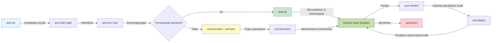
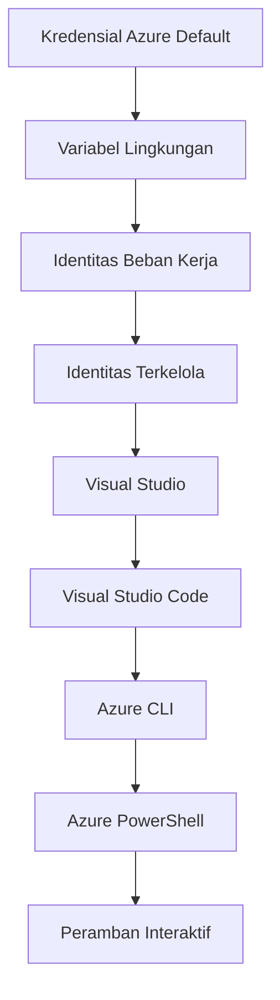

# AZD Basics - Memahami Azure Developer CLI

# AZD Basics - Konsep Inti dan Dasar

**Navigasi Bab:**
- **📚 Course Home**: [AZD Untuk Pemula](../../README.md)
- **📖 Current Chapter**: Bab 1 - Fondasi & Mulai Cepat
- **⬅️ Previous**: [Ringkasan Kursus](../../README.md#-chapter-1-foundation--quick-start)
- **➡️ Next**: [Instalasi & Pengaturan](installation.md)
- **🚀 Next Chapter**: [Bab 2: Pengembangan Berbasis AI](../chapter-02-ai-development/microsoft-foundry-integration.md)

## Pendahuluan

Pelajaran ini memperkenalkan Anda pada Azure Developer CLI (azd), sebuah alat baris perintah yang kuat yang mempercepat perjalanan Anda dari pengembangan lokal ke penerapan di Azure. Anda akan mempelajari konsep dasar, fitur inti, dan memahami bagaimana azd menyederhanakan penerapan aplikasi cloud-native.

## Tujuan Pembelajaran

Pada akhir pelajaran ini, Anda akan:
- Memahami apa itu Azure Developer CLI dan tujuan utamanya
- Mempelajari konsep inti template, lingkungan, dan layanan
- Mengeksplor fitur utama termasuk pengembangan berbasis template dan Infrastruktur sebagai Kode
- Memahami struktur proyek azd dan alur kerjanya
- Siap untuk menginstal dan mengonfigurasi azd untuk lingkungan pengembangan Anda

## Hasil Pembelajaran

Setelah menyelesaikan pelajaran ini, Anda akan dapat:
- Menjelaskan peran azd dalam alur kerja pengembangan cloud modern
- Mengidentifikasi komponen struktur proyek azd
- Mendeskripsikan bagaimana template, lingkungan, dan layanan bekerja bersama
- Memahami manfaat Infrastruktur sebagai Kode dengan azd
- Mengenali berbagai perintah azd dan tujuannya

## Apa itu Azure Developer CLI (azd)?

Azure Developer CLI (azd) adalah alat baris perintah yang dirancang untuk mempercepat perjalanan Anda dari pengembangan lokal ke penerapan di Azure. Ia menyederhanakan proses membangun, menerapkan, dan mengelola aplikasi cloud-native di Azure.

### Apa yang Dapat Anda Deploy dengan azd?

azd mendukung beragam beban kerja—dan daftar terus bertambah. Hari ini, Anda dapat menggunakan azd untuk menerapkan:

| Tipe Beban Kerja | Contoh | Alur Kerja Sama? |
|---------------|----------|----------------|
| **Aplikasi tradisional** | Aplikasi web, REST API, situs statis | ✅ `azd up` |
| **Layanan dan mikroservis** | Container Apps, Function Apps, backend multi-layanan | ✅ `azd up` |
| **Aplikasi berbasis AI** | Aplikasi chat dengan Microsoft Foundry Models, solusi RAG dengan AI Search | ✅ `azd up` |
| **Agen cerdas** | Agen yang dihosting Foundry, orkestrasi multi-agen | ✅ `azd up` |

Inti pemahaman adalah bahwa **siklus hidup azd tetap sama terlepas dari apa yang Anda terapkan**. Anda menginisialisasi proyek, menyediakan infrastruktur, menerapkan kode, memantau aplikasi, dan membersihkan—baik itu situs web sederhana atau agen AI yang kompleks.

Kontinuitas ini sengaja dirancang. azd memperlakukan kemampuan AI sebagai jenis layanan lain yang dapat digunakan aplikasi Anda, bukan sesuatu yang berbeda secara fundamental. Sebuah endpoint chat yang didukung oleh Microsoft Foundry Models, dari perspektif azd, hanyalah layanan lain yang perlu dikonfigurasi dan diterapkan.

### 🎯 Mengapa Menggunakan AZD? Perbandingan di Dunia Nyata

Mari bandingkan menerapkan aplikasi web sederhana dengan database:

#### ❌ TANPA AZD: Penerapan Manual di Azure (30+ menit)

```bash
# Langkah 1: Buat grup sumber daya
az group create --name myapp-rg --location eastus

# Langkah 2: Buat App Service Plan
az appservice plan create --name myapp-plan \
  --resource-group myapp-rg \
  --sku B1 --is-linux

# Langkah 3: Buat Web App
az webapp create --name myapp-web-unique123 \
  --resource-group myapp-rg \
  --plan myapp-plan \
  --runtime "NODE:18-lts"

# Langkah 4: Buat akun Cosmos DB (10-15 menit)
az cosmosdb create --name myapp-cosmos-unique123 \
  --resource-group myapp-rg \
  --kind MongoDB

# Langkah 5: Buat database
az cosmosdb mongodb database create \
  --account-name myapp-cosmos-unique123 \
  --resource-group myapp-rg \
  --name tododb

# Langkah 6: Buat koleksi
az cosmosdb mongodb collection create \
  --account-name myapp-cosmos-unique123 \
  --resource-group myapp-rg \
  --database-name tododb \
  --name todos

# Langkah 7: Dapatkan string koneksi
CONN_STR=$(az cosmosdb keys list \
  --name myapp-cosmos-unique123 \
  --resource-group myapp-rg \
  --type connection-strings \
  --query "connectionStrings[0].connectionString" -o tsv)

# Langkah 8: Konfigurasikan pengaturan aplikasi
az webapp config appsettings set \
  --name myapp-web-unique123 \
  --resource-group myapp-rg \
  --settings MONGODB_URI="$CONN_STR"

# Langkah 9: Aktifkan pencatatan
az webapp log config --name myapp-web-unique123 \
  --resource-group myapp-rg \
  --application-logging filesystem \
  --detailed-error-messages true

# Langkah 10: Siapkan Application Insights
az monitor app-insights component create \
  --app myapp-insights \
  --location eastus \
  --resource-group myapp-rg

# Langkah 11: Hubungkan Application Insights ke Web App
INSTRUMENTATION_KEY=$(az monitor app-insights component show \
  --app myapp-insights \
  --resource-group myapp-rg \
  --query "instrumentationKey" -o tsv)

az webapp config appsettings set \
  --name myapp-web-unique123 \
  --resource-group myapp-rg \
  --settings APPINSIGHTS_INSTRUMENTATIONKEY="$INSTRUMENTATION_KEY"

# Langkah 12: Bangun aplikasi secara lokal
npm install
npm run build

# Langkah 13: Buat paket penerapan
zip -r app.zip . -x "*.git*" "node_modules/*"

# Langkah 14: Terapkan aplikasi
az webapp deployment source config-zip \
  --resource-group myapp-rg \
  --name myapp-web-unique123 \
  --src app.zip

# Langkah 15: Tunggu dan berdoa semoga berhasil 🙏
# (Tidak ada validasi otomatis, pengujian manual diperlukan)
```

**Masalah:**
- ❌ 15+ perintah yang harus diingat dan dijalankan secara berurutan
- ❌ 30-45 menit kerja manual
- ❌ Mudah membuat kesalahan (typo, parameter salah)
- ❌ string koneksi terekspos di riwayat terminal
- ❌ Tidak ada rollback otomatis jika terjadi kegagalan
- ❌ Sulit direplikasi oleh anggota tim
- ❌ Berbeda setiap kali (tidak dapat direproduksi)

#### ✅ DENGAN AZD: Penerapan Otomatis (5 perintah, 10-15 menit)

```bash
# Langkah 1: Inisialisasi dari template
azd init --template todo-nodejs-mongo

# Langkah 2: Autentikasi
azd auth login

# Langkah 3: Buat lingkungan
azd env new dev

# Langkah 4: Pratinjau perubahan (opsional tetapi disarankan)
azd provision --preview

# Langkah 5: Terapkan semuanya
azd up

# ✨ Selesai! Semua telah diterapkan, dikonfigurasi, dan dipantau
```

**Manfaat:**
- ✅ **5 perintah** vs. 15+ langkah manual
- ✅ **10-15 menit** total (sebagian besar menunggu Azure)
- ✅ **Lebih sedikit kesalahan manual** - alur kerja konsisten berbasis template
- ✅ **Penanganan rahasia yang aman** - banyak template menggunakan penyimpanan rahasia yang dikelola Azure
- ✅ **Penerapan yang dapat diulang** - alur kerja yang sama setiap kali
- ✅ **Sepenuhnya dapat direproduksi** - hasil yang sama setiap kali
- ✅ **Siap tim** - siapa pun dapat menerapkan dengan perintah yang sama
- ✅ **Infrastruktur sebagai Kode** - template Bicep dengan kontrol versi
- ✅ **Pemantauan bawaan** - Application Insights dikonfigurasi otomatis

### 📊 Pengurangan Waktu & Kesalahan

| Metrik | Penerapan Manual | Penerapan AZD | Peningkatan |
|:-------|:------------------|:---------------|:------------|
| **Perintah** | 15+ | 5 | 67% lebih sedikit |
| **Waktu** | 30-45 menit | 10-15 menit | 60% lebih cepat |
| **Tingkat Kesalahan** | ~40% | <5% | 88% pengurangan |
| **Konsistensi** | Rendah (manual) | 100% (otomatis) | Sempurna |
| **Onboarding Tim** | 2-4 jam | 30 menit | 75% lebih cepat |
| **Waktu Rollback** | 30+ menit (manual) | 2 menit (otomatis) | 93% lebih cepat |

## Konsep Inti

### Template
Template adalah dasar dari azd. Mereka berisi:
- **Kode aplikasi** - Kode sumber dan dependensi Anda
- **Definisi infrastruktur** - sumber daya Azure yang didefinisikan dalam Bicep atau Terraform
- **Berkas konfigurasi** - Pengaturan dan variabel lingkungan
- **Skrip deployment** - Alur kerja deployment otomatis

### Lingkungan
Lingkungan mewakili target deployment yang berbeda:
- **Pengembangan** - Untuk pengujian dan pengembangan
- **Staging** - Lingkungan pra-produksi
- **Produksi** - Lingkungan produksi langsung

Setiap lingkungan memelihara:
- Grup sumber daya Azure
- Pengaturan konfigurasi
- Status deployment

### Layanan
Layanan adalah blok bangunan dari aplikasi Anda:
- **Frontend** - Aplikasi web, SPA
- **Backend** - API, mikroservis
- **Database** - Solusi penyimpanan data
- **Storage** - Penyimpanan file dan blob

## Fitur Utama

### 1. Pengembangan Berbasis Template
```bash
# Jelajahi template yang tersedia
azd template list

# Inisialisasi dari template
azd init --template <template-name>
```

### 2. Infrastruktur sebagai Kode
- **Bicep** - bahasa domain-spesifik Azure
- **Terraform** - alat infrastruktur multi-cloud
- **ARM Templates** - template Azure Resource Manager

### 3. Alur Kerja Terintegrasi
```bash
# Alur kerja penyebaran lengkap
azd up            # Penyediaan + Penyebaran ini otomatis untuk pengaturan pertama kali

# 🧪 BARU: Pratinjau perubahan infrastruktur sebelum penyebaran (AMAN)
azd provision --preview    # Simulasikan penyebaran infrastruktur tanpa membuat perubahan

azd provision     # Buat sumber daya Azure; jika Anda memperbarui infrastruktur, gunakan ini
azd deploy        # Sebarkan kode aplikasi atau sebarkan ulang kode aplikasi setelah pembaruan
azd down          # Bersihkan sumber daya
```

#### 🛡️ Perencanaan Infrastruktur Aman dengan Pratinjau
Perintah `azd provision --preview` mengubah permainan untuk penerapan yang aman:
- **Analisis dry-run** - Menunjukkan apa yang akan dibuat, dimodifikasi, atau dihapus
- **Tanpa risiko** - Tidak ada perubahan nyata yang dibuat pada lingkungan Azure Anda
- **Kolaborasi tim** - Bagikan hasil pratinjau sebelum penerapan
- **Estimasi biaya** - Pahami biaya sumber daya sebelum komitmen

```bash
# Contoh alur kerja pratinjau
azd provision --preview           # Lihat apa yang akan berubah
# Tinjau keluaran, diskusikan dengan tim
azd provision                     # Terapkan perubahan dengan percaya diri
```

### 📊 Visual: Alur Pengembangan AZD



**Penjelasan Alur Kerja:**
1. **Init** - Mulai dengan template atau proyek baru
2. **Auth** - Autentikasi dengan Azure
3. **Environment** - Buat lingkungan deployment terisolasi
4. **Preview** - 🆕 Selalu pratinjau perubahan infrastruktur terlebih dahulu (praktik aman)
5. **Provision** - Buat/perbarui sumber daya Azure
6. **Deploy** - Dorong kode aplikasi Anda
7. **Monitor** - Amati kinerja aplikasi
8. **Iterate** - Lakukan perubahan dan terapkan ulang kode
9. **Cleanup** - Hapus sumber daya saat selesai

### 4. Manajemen Lingkungan
```bash
# Buat dan kelola lingkungan
azd env new <environment-name>
azd env select <environment-name>
azd env list
```

### 5. Ekstensi dan Perintah AI

azd menggunakan sistem ekstensi untuk menambah kemampuan di luar CLI inti. Ini sangat berguna untuk beban kerja AI:

```bash
# Daftar ekstensi yang tersedia
azd extension list

# Instal ekstensi agen Foundry
azd extension install azure.ai.agents

# Inisialisasi proyek agen AI dari manifes
azd ai agent init -m agent-manifest.yaml

# Uji agen yang telah diterapkan (menampilkan latensi dan waktu hingga byte pertama)
azd ai agent invoke

# Mulai server MCP untuk pengembangan berbantuan AI (Alpha)
azd mcp start
```

**Siklus hidup agen, ujung ke ujung.** Setelah Anda memasang `azure.ai.agents`, satu alur kerja membawa Anda dari ide ke agen yang berjalan dan dimonitor. Anda tidak perlu semuanya pada hari pertama—cukup ketahui mereka ada:

| Tahap | Perintah | Fungsi |
|-------|---------|--------------|
| **Scaffold** | `azd ai agent init -m <manifest>` | Menghasilkan proyek agen dari sebuah manifest |
| **Test** | `azd ai agent invoke` | Panggil agen dan lihat waktu respons |
| **Measure** | `azd ai agent eval generate` | Buat dataset evaluasi untuk agen |
| **Improve** | `azd ai agent optimize` | Optimalkan instruksi agen terhadap data Anda |
| **Inspect** | `azd ai agent endpoint show` | Lihat konfigurasi endpoint yang aktif |
| **Clean up** | `azd ai agent delete` | Hapus agen yang dihosting dan semua versinya |

> Ekstensi dibahas secara rinci di [Bab 2: Pengembangan Berbasis AI](../chapter-02-ai-development/agents.md) dan referensi [Perintah AZD AI CLI](../chapter-08-production/production-ai-practices.md#azd-ai-cli-commands-and-extensions).

## 📁 Struktur Proyek

Struktur proyek azd yang khas:
```
my-app/
├── .azd/                    # azd configuration
│   └── config.json
├── .azure/                  # Azure deployment artifacts
├── .devcontainer/          # Development container config
├── .github/workflows/      # GitHub Actions
├── .vscode/               # VS Code settings
├── infra/                 # Infrastructure code
│   ├── main.bicep        # Main infrastructure template
│   ├── main.parameters.json
│   └── modules/          # Reusable modules
├── src/                  # Application source code
│   ├── api/             # Backend services
│   └── web/             # Frontend application
├── azure.yaml           # azd project configuration
└── README.md
```

## 🔧 Berkas Konfigurasi

### azure.yaml
Berkas konfigurasi utama proyek:
```yaml
name: my-awesome-app
metadata:
  template: my-template@1.0.0

services:
  web:
    project: ./src/web
    language: js
    host: appservice
  api:
    project: ./src/api
    language: js
    host: appservice

hooks:
  preprovision:
    shell: pwsh
    run: echo "Preparing to provision..."
```

### .azure/config.json
Konfigurasi spesifik lingkungan:
```json
{
  "version": 1,
  "defaultEnvironment": "dev",
  "environments": {
    "dev": {
      "subscriptionId": "your-subscription-id",
      "location": "eastus"
    }
  }
}
```

## 🎪 Alur Kerja Umum dengan Latihan Praktis

> **💡 Tip Pembelajaran:** Ikuti latihan ini secara berurutan untuk membangun keterampilan AZD Anda secara bertahap.

### 🎯 Latihan 1: Inisialisasi Proyek Pertama Anda

**Tujuan:** Buat proyek AZD dan jelajahi strukturnya

**Langkah-langkah:**
```bash
# Gunakan template yang terbukti
azd init --template todo-nodejs-mongo

# Jelajahi file yang dihasilkan
ls -la  # Lihat semua file termasuk yang tersembunyi

# File utama yang dibuat:
# - azure.yaml (konfigurasi utama)
# - infra/ (kode infrastruktur)
# - src/ (kode aplikasi)
```

**✅ Sukses:** Anda memiliki direktori azure.yaml, infra/, dan src/

---

### 🎯 Latihan 2: Terapkan ke Azure

**Tujuan:** Selesaikan penerapan ujung ke ujung

**Langkah-langkah:**
```bash
# 1. Autentikasi
az login && azd auth login

# 2. Buat lingkungan
azd env new dev
azd env set AZURE_LOCATION eastus

# 3. Pratinjau perubahan (DISARANKAN)
azd provision --preview

# 4. Terapkan semuanya
azd up

# 5. Verifikasi penerapan
azd show    # Lihat URL aplikasi Anda
```

**Perkiraan Waktu:** 10-15 menit  
**✅ Sukses:** URL aplikasi terbuka di browser

---

### 🎯 Latihan 3: Banyak Lingkungan

**Tujuan:** Terapkan ke dev dan staging

**Langkah-langkah:**
```bash
# Sudah ada dev, buat staging
azd env new staging
azd env set AZURE_LOCATION westus2
azd up

# Beralih di antara keduanya
azd env list
azd env select dev
```

**✅ Sukses:** Dua grup sumber daya terpisah di Azure Portal

---

### 🛡️ Bersih Total: `azd down --force --purge`

Ketika Anda perlu melakukan reset total:

```bash
azd down --force --purge
```

**Apa yang dilakukannya:**
- `--force`: Tanpa prompt konfirmasi
- `--purge`: Menghapus semua state lokal dan sumber daya Azure

**Gunakan ketika:**
- Penerapan gagal di tengah jalan
- Berpindah proyek
- Perlu memulai dari awal

---

## 🎪 Referensi Alur Kerja Asli

### Memulai Proyek Baru
```bash
# Metode 1: Gunakan templat yang ada
azd init --template todo-nodejs-mongo

# Metode 2: Mulai dari awal
azd init

# Metode 3: Gunakan direktori saat ini
azd init .
```

### Siklus Pengembangan
```bash
# Siapkan lingkungan pengembangan
azd auth login
azd env new dev
azd env select dev

# Sebarkan semuanya
azd up

# Lakukan perubahan dan terapkan ulang
azd deploy

# Bersihkan setelah selesai
azd down --force --purge # Perintah di Azure Developer CLI adalah **reset total** untuk lingkungan Anda—terutama berguna saat Anda sedang menangani penyebaran yang gagal, membersihkan sumber daya terlantar, atau mempersiapkan penyebaran ulang yang bersih.
```

## Memahami `azd down --force --purge`
Perintah `azd down --force --purge` adalah cara yang kuat untuk sepenuhnya menghancurkan lingkungan azd Anda dan semua sumber daya terkait. Berikut rincian apa yang dilakukan setiap flag:
```
--force
```
- Melewati prompt konfirmasi.
- Berguna untuk otomatisasi atau scripting di mana input manual tidak memungkinkan.
- Memastikan teardown berjalan tanpa gangguan, bahkan jika CLI mendeteksi inkonsistensi.

```
--purge
```
Menghapus **semua metadata terkait**, termasuk:
Status lingkungan
Folder lokal `.azure`
Informasi deployment yang di-cache
Mencegah azd dari "mengingat" penerapan sebelumnya, yang dapat menyebabkan masalah seperti grup sumber daya yang tidak cocok atau referensi registry yang usang.


### Mengapa menggunakan keduanya?
Ketika Anda menemui kebuntuan dengan `azd up` karena state yang tersisa atau penerapan sebagian, kombinasi ini memastikan **awal yang bersih**.

Ini sangat membantu setelah penghapusan sumber daya manual di portal Azure atau saat beralih template, lingkungan, atau konvensi penamaan grup sumber daya.


### Mengelola Banyak Lingkungan
```bash
# Buat lingkungan staging
azd env new staging
azd env select staging
azd up

# Kembali ke dev
azd env select dev

# Bandingkan lingkungan
azd env list
```

## 🔐 Otentikasi dan Kredensial

Memahami otentikasi sangat penting untuk keberhasilan penerapan azd. Azure menggunakan beberapa metode otentikasi, dan azd memanfaatkan rantai kredensial yang sama yang digunakan oleh alat Azure lainnya.

### Otentikasi Azure CLI (`az login`)

Sebelum menggunakan azd, Anda perlu melakukan autentikasi dengan Azure. Metode paling umum adalah menggunakan Azure CLI:

```bash
# Masuk interaktif (membuka browser)
az login

# Masuk dengan penyewa tertentu
az login --tenant <tenant-id>

# Masuk dengan prinsipal layanan
az login --service-principal -u <app-id> -p <password> --tenant <tenant-id>

# Periksa status masuk saat ini
az account show

# Daftar langganan yang tersedia
az account list --output table

# Tetapkan langganan default
az account set --subscription <subscription-id>
```

### Alur Otentikasi
1. **Login Interaktif**: Membuka browser default Anda untuk autentikasi
2. **Device Code Flow**: Untuk lingkungan tanpa akses browser
3. **Service Principal**: Untuk otomatisasi dan skenario CI/CD
4. **Managed Identity**: Untuk aplikasi yang dihosting di Azure

### Rantai DefaultAzureCredential

`DefaultAzureCredential` adalah tipe kredensial yang menyediakan pengalaman otentikasi yang disederhanakan dengan secara otomatis mencoba beberapa sumber kredensial dalam urutan tertentu:

#### Urutan Rantai Kredensial


#### 1. Variabel Lingkungan
```bash
# Tetapkan variabel lingkungan untuk prinsipal layanan
export AZURE_CLIENT_ID="<app-id>"
export AZURE_CLIENT_SECRET="<password>"
export AZURE_TENANT_ID="<tenant-id>"
```

#### 2. Workload Identity (Kubernetes/GitHub Actions)
Digunakan secara otomatis di:
- Azure Kubernetes Service (AKS) dengan Workload Identity
- GitHub Actions dengan federasi OIDC
- Skenario identitas federasi lainnya

#### 3. Managed Identity
Untuk sumber daya Azure seperti:
- Mesin Virtual
- App Service
- Azure Functions
- Instans Kontainer

```bash
# Periksa apakah sedang berjalan pada sumber daya Azure dengan identitas terkelola
az account show --query "user.type" --output tsv
# Mengembalikan: "servicePrincipal" jika menggunakan identitas terkelola
```

#### 4. Integrasi Alat Pengembang
- **Visual Studio**: Secara otomatis menggunakan akun yang masuk
- **VS Code**: Menggunakan kredensial ekstensi Azure Account
- **Azure CLI**: Menggunakan kredensial `az login` (paling umum untuk pengembangan lokal)

### Pengaturan Otentikasi AZD

```bash
# Metode 1: Gunakan Azure CLI (Direkomendasikan untuk pengembangan)
az login
azd auth login  # Menggunakan kredensial Azure CLI yang ada

# Metode 2: Otentikasi azd langsung
azd auth login --use-device-code  # Untuk lingkungan tanpa antarmuka pengguna

# Metode 3: Periksa status otentikasi
azd auth login --check-status

# Metode 4: Keluar dan otentikasi ulang
azd auth logout
azd auth login
```

### Praktik Terbaik Otentikasi

#### Untuk Pengembangan Lokal
```bash
# 1. Masuk dengan Azure CLI
az login

# 2. Verifikasi langganan yang benar
az account show
az account set --subscription "Your Subscription Name"

# 3. Gunakan azd dengan kredensial yang ada
azd auth login
```

#### Untuk Pipeline CI/CD
```yaml
# GitHub Actions example
- name: Azure Login
  uses: azure/login@v1
  with:
    creds: ${{ secrets.AZURE_CREDENTIALS }}

- name: Deploy with azd
  run: |
    azd auth login --client-id ${{ secrets.AZURE_CLIENT_ID }} \
                    --client-secret ${{ secrets.AZURE_CLIENT_SECRET }} \
                    --tenant-id ${{ secrets.AZURE_TENANT_ID }}
    azd up --no-prompt
```

#### Untuk Lingkungan Produksi
- Gunakan **Managed Identity** saat dijalankan pada sumber daya Azure
- Gunakan **Service Principal** untuk skenario otomatisasi
- Hindari menyimpan kredensial di kode atau file konfigurasi
- Gunakan **Azure Key Vault** untuk konfigurasi sensitif

### Masalah dan Solusi Autentikasi Umum

#### Masalah: "No subscription found"
```bash
# Solusi: Tetapkan langganan default
az account list --output table
az account set --subscription "<subscription-id>"
azd env set AZURE_SUBSCRIPTION_ID "<subscription-id>"
```

#### Masalah: "Insufficient permissions"
```bash
# Solusi: Periksa dan tetapkan peran yang diperlukan
az role assignment list --assignee $(az account show --query user.name --output tsv)

# Peran yang umum diperlukan:
# - Kontributor (untuk pengelolaan sumber daya)
# - Administrator Akses Pengguna (untuk penugasan peran)
```

#### Masalah: "Token expired"
```bash
# Solusi: Autentikasi ulang
az logout
az login
azd auth logout
azd auth login
```

### Autentikasi di Berbagai Skenario

#### Pengembangan Lokal
```bash
# Akun pengembangan pribadi
az login
azd auth login
```

#### Pengembangan Tim
```bash
# Gunakan tenant tertentu untuk organisasi
az login --tenant contoso.onmicrosoft.com
azd auth login
```

#### Skenario Multi-tenant
```bash
# Beralih antar penyewa
az login --tenant tenant1.onmicrosoft.com
# Terapkan ke penyewa 1
azd up

az login --tenant tenant2.onmicrosoft.com  
# Terapkan ke penyewa 2
azd up
```

### Pertimbangan Keamanan

1. **Penyimpanan Kredensial**: Jangan pernah menyimpan kredensial dalam kode sumber
2. **Pembatasan Lingkup**: Gunakan prinsip least-privilege untuk service principals
3. **Rotasi Token**: Perbarui rahasia service principal secara berkala
4. **Jejak Audit**: Pantau aktivitas autentikasi dan penyebaran
5. **Keamanan Jaringan**: Gunakan private endpoints bila memungkinkan

### Memecahkan Masalah Autentikasi

```bash
# Men-debug masalah otentikasi
azd auth login --check-status
az account show
az account get-access-token

# Perintah diagnostik umum
whoami                          # Konteks pengguna saat ini
az ad signed-in-user show      # Detail pengguna Microsoft Entra ID
az group list                  # Uji akses sumber daya
```

## Memahami `azd down --force --purge`

### Penemuan
```bash
azd template list              # Jelajahi template
azd template show <template>   # Detail template
azd init --help               # Opsi inisialisasi
```

### Manajemen Proyek
```bash
azd show                     # Ikhtisar proyek
azd env list                # Lingkungan yang tersedia dan default yang dipilih
azd config show            # Pengaturan konfigurasi
```

### Pemantauan
```bash
azd monitor                  # Buka portal Azure untuk pemantauan
azd monitor --logs           # Lihat log aplikasi
azd monitor --live           # Lihat metrik secara langsung
azd pipeline config          # Siapkan CI/CD
```

## Praktik Terbaik

### 1. Gunakan Nama yang Bermakna
```bash
# Bagus
azd env new production-east
azd init --template web-app-secure

# Hindari
azd env new env1
azd init --template template1
```

### 2. Manfaatkan Template
- Mulai dengan template yang ada
- Sesuaikan dengan kebutuhan Anda
- Buat template yang dapat digunakan ulang untuk organisasi Anda

### 3. Isolasi Lingkungan
- Gunakan lingkungan terpisah untuk dev/staging/prod
- Jangan pernah menerapkan langsung ke produksi dari mesin lokal
- Gunakan pipeline CI/CD untuk penyebaran produksi

### 4. Manajemen Konfigurasi
- Gunakan variabel lingkungan untuk data sensitif
- Simpan konfigurasi di version control
- Dokumentasikan pengaturan spesifik lingkungan

## Progres Pembelajaran

### Pemula (Minggu 1-2)
1. Instal azd dan lakukan autentikasi
2. Terapkan template sederhana
3. Pahami struktur proyek
4. Pelajari perintah dasar (up, down, deploy)

### Menengah (Minggu 3-4)
1. Sesuaikan template
2. Kelola banyak lingkungan
3. Pahami kode infrastruktur
4. Siapkan pipeline CI/CD

### Lanjutan (Minggu 5+)
1. Buat template kustom
2. Pola infrastruktur lanjutan
3. Penyebaran multi-region
4. Konfigurasi kelas enterprise

## Langkah Selanjutnya

**📖 Lanjutkan Pembelajaran Bab 1:**
- [Instalasi & Pengaturan](installation.md) - Pasang azd dan konfigurasikan
- [Proyek Pertamamu](first-project.md) - Selesaikan tutorial praktik
- [Panduan Konfigurasi](configuration.md) - Opsi konfigurasi lanjutan

**🎯 Siap untuk Bab Selanjutnya?**
- [Bab 2: Pengembangan Berbasis AI](../chapter-02-ai-development/microsoft-foundry-integration.md) - Mulai membangun aplikasi AI

## Sumber Tambahan

- [Tinjauan Azure Developer CLI](https://learn.microsoft.com/en-us/azure/developer/azure-developer-cli/)
- [Galeri Template](https://azure.github.io/awesome-azd/)
- [Contoh Komunitas](https://github.com/Azure-Samples)

---

## 🙋 Pertanyaan yang Sering Diajukan

### Pertanyaan Umum

**Q: Apa perbedaan antara AZD dan Azure CLI?**

A: Azure CLI (`az`) digunakan untuk mengelola sumber daya Azure individual. AZD (`azd`) digunakan untuk mengelola seluruh aplikasi:

```bash
# Azure CLI - manajemen sumber daya tingkat rendah
az webapp create --name myapp --resource-group rg
az sql server create --name myserver --resource-group rg
# ...diperlukan banyak perintah lagi

# AZD - manajemen tingkat aplikasi
azd up  # Menyebarkan seluruh aplikasi dengan semua sumber daya
```

**Pikirkan seperti ini:**
- `az` = Mengoperasikan balok Lego individu
- `azd` = Bekerja dengan set Lego lengkap

---

**Q: Apakah saya perlu tahu Bicep atau Terraform untuk menggunakan AZD?**

A: Tidak! Mulai dengan template:
```bash
# Gunakan template yang sudah ada - tidak perlu pengetahuan IaC
azd init --template todo-nodejs-mongo
azd up
```

Anda dapat mempelajari Bicep nanti untuk menyesuaikan infrastruktur. Template menyediakan contoh kerja untuk dipelajari.

---

**Q: Berapa biaya menjalankan template AZD?**

A: Biaya bervariasi tergantung template. Sebagian besar template pengembangan berbiaya $50-150/bulan:

```bash
# Pratinjau biaya sebelum menerapkan
azd provision --preview

# Selalu bersihkan saat tidak digunakan
azd down --force --purge  # Menghapus semua sumber daya
```

**Tips pro:** Gunakan tier gratis jika tersedia:
- App Service: Tier F1 (Gratis)
- Microsoft Foundry Models: Azure OpenAI 50.000 tokens/bulan gratis
- Cosmos DB: 1000 RU/s tier gratis

---

**Q: Bisakah saya menggunakan AZD dengan sumber daya Azure yang sudah ada?**

A: Ya, tetapi lebih mudah memulai dari awal. AZD bekerja paling baik ketika mengelola seluruh siklus hidup. Untuk sumber daya yang sudah ada:

```bash
# Opsi 1: Impor sumber daya yang ada (lanjutan)
azd init
# Kemudian ubah infra/ untuk merujuk ke sumber daya yang ada

# Opsi 2: Mulai dari awal (direkomendasikan)
azd init --template matching-your-stack
azd up  # Membuat lingkungan baru
```

---

**Q: Bagaimana cara membagikan proyek saya dengan rekan satu tim?**

A: Commit proyek AZD ke Git (tetapi JANGAN folder .azure):

```bash
# Sudah ada di .gitignore secara default
.azure/        # Berisi rahasia dan data lingkungan
*.env          # Variabel lingkungan

# Anggota tim saat itu:
git clone <your-repo>
azd auth login
azd env new <their-name>-dev
azd up
```

Semua orang mendapatkan infrastruktur yang identik dari template yang sama.

---

### Pertanyaan Pemecahan Masalah

**Q: "azd up" gagal di tengah jalan. Apa yang harus saya lakukan?**

A: Periksa error, perbaiki, lalu coba lagi:

```bash
# Lihat log terperinci
azd show

# Perbaikan umum:

# 1. Jika kuota terlampaui:
azd env set AZURE_LOCATION "westus2"  # Coba wilayah yang berbeda

# 2. Jika ada konflik nama sumber daya:
azd down --force --purge  # Mulai dari awal
azd up  # Coba lagi

# 3. Jika autentikasi kedaluwarsa:
az login
azd auth login
azd up
```

**Masalah yang paling umum:** Subscription Azure yang dipilih salah
```bash
az account list --output table
az account set --subscription "<correct-subscription>"
```

---

**Q: Bagaimana saya menerapkan hanya perubahan kode tanpa reprovisioning?**

A: Gunakan `azd deploy` bukan `azd up`:

```bash
azd up          # Pertama kali: penyiapan + penyebaran (lambat)

# Lakukan perubahan kode...

azd deploy      # Kali berikutnya: hanya penyebaran (cepat)
```

Perbandingan kecepatan:
- `azd up`: 10-15 menit (menyediakan infrastruktur)
- `azd deploy`: 2-5 menit (hanya kode)

---

**Q: Bisakah saya menyesuaikan template infrastruktur?**

A: Ya! Edit file Bicep di `infra/`:

```bash
# Setelah azd init
cd infra/
code main.bicep  # Sunting di VS Code

# Pratinjau perubahan
azd provision --preview

# Terapkan perubahan
azd provision
```

**Tip:** Mulai dari kecil - ubah SKU terlebih dahulu:
```bicep
// infra/main.bicep
sku: {
  name: 'B1'  // Change to 'P1V2' for production
}
```

---

**Q: Bagaimana saya menghapus semua yang dibuat AZD?**

A: Satu perintah menghapus semua sumber daya:

```bash
azd down --force --purge

# Ini menghapus:
# - Semua sumber daya Azure
# - Grup sumber daya
# - Status lingkungan lokal
# - Data penyebaran yang di-cache
```

**Selalu jalankan ini ketika:**
- Selesai menguji template
- Beralih ke proyek yang berbeda
- Ingin memulai dari awal

**Penghematan biaya:** Menghapus sumber daya yang tidak digunakan = $0 biaya

---

**Q: Bagaimana jika saya tidak sengaja menghapus sumber daya di Azure Portal?**

A: State AZD bisa menjadi tidak sinkron. Pendekatan bersih (clean slate):

```bash
# 1. Hapus status lokal
azd down --force --purge

# 2. Mulai dari awal
azd up

# Alternatif: Biarkan AZD mendeteksi dan memperbaiki
azd provision  # Akan membuat sumber daya yang hilang
```

---

### Pertanyaan Lanjutan

**Q: Bisakah saya menggunakan AZD di pipeline CI/CD?**

A: Ya! Contoh GitHub Actions:

```yaml
# .github/workflows/deploy.yml
name: Deploy with AZD

on:
  push:
    branches: [main]

jobs:
  deploy:
    runs-on: ubuntu-latest
    steps:
      - uses: actions/checkout@v2
      
      - name: Install azd
        run: curl -fsSL https://aka.ms/install-azd.sh | bash
      
      - name: Azure Login
        run: |
          azd auth login \
            --client-id ${{ secrets.AZURE_CLIENT_ID }} \
            --client-secret ${{ secrets.AZURE_CLIENT_SECRET }} \
            --tenant-id ${{ secrets.AZURE_TENANT_ID }}
      
      - name: Deploy
        run: azd up --no-prompt
```

---

**Q: Bagaimana saya menangani rahasia dan data sensitif?**

A: AZD terintegrasi dengan Azure Key Vault secara otomatis:

```bash
# Rahasia disimpan di Key Vault, bukan di kode
azd env set DATABASE_PASSWORD "$(openssl rand -base64 32)"

# AZD secara otomatis:
# 1. Membuat Key Vault
# 2. Menyimpan rahasia
# 3. Memberikan aplikasi akses melalui Identitas Terkelola
# 4. Menyuntikkan saat runtime
```

**Jangan pernah commit:**
- `.azure/` folder (mengandung data lingkungan)
- `.env` files (rahasia lokal)
- String koneksi

---

**Q: Bisakah saya melakukan deploy ke banyak region?**

A: Ya, buat lingkungan per region:

```bash
# Lingkungan AS Timur
azd env new prod-eastus
azd env set AZURE_LOCATION eastus
azd up

# Lingkungan Eropa Barat
azd env new prod-westeurope
azd env set AZURE_LOCATION westeurope
azd up

# Setiap lingkungan bersifat independen
azd env list
```

Untuk aplikasi multi-region sejati, sesuaikan template Bicep untuk menyebarkan ke beberapa region secara bersamaan.

---

**Q: Di mana saya bisa mendapatkan bantuan jika saya terjebak?**

1. **Dokumentasi AZD:** https://learn.microsoft.com/azure/developer/azure-developer-cli/
2. **GitHub Issues:** https://github.com/Azure/azure-dev/issues
3. **Discord:** [Azure Discord](https://discord.gg/microsoft-azure) - saluran #azure-developer-cli
4. **Stack Overflow:** Tag `azure-developer-cli`
5. **Kursus Ini:** [Panduan Pemecahan Masalah](../chapter-07-troubleshooting/common-issues.md)

**Tips pro:** Sebelum bertanya, jalankan:
```bash
azd show       # Menampilkan status saat ini
azd version    # Menampilkan versi Anda
```
Sertakan info ini dalam pertanyaan Anda untuk bantuan lebih cepat.

---

## 🎓 Apa Selanjutnya?

Sekarang Anda memahami dasar-dasar AZD. Pilih jalur Anda:

### 🎯 Untuk Pemula:
1. **Selanjutnya:** [Instalasi & Pengaturan](installation.md) - Pasang AZD di mesin Anda
2. **Kemudian:** [Proyek Pertamamu](first-project.md) - Terapkan aplikasi pertamamu
3. **Latihan:** Selesaikan ketiga latihan dalam pelajaran ini

### 🚀 Untuk Pengembang AI:
1. **Langsung ke:** [Bab 2: Pengembangan Berbasis AI](../chapter-02-ai-development/microsoft-foundry-integration.md)
2. **Deploy:** Mulai dengan `azd init --template get-started-with-ai-chat`
3. **Pelajari:** Bangun sambil melakukan deploy

### 🏗️ Untuk Pengembang Berpengalaman:
1. **Tinjau:** [Panduan Konfigurasi](configuration.md) - Pengaturan lanjutan
2. **Jelajahi:** [Infrastruktur sebagai Kode](../chapter-04-infrastructure/provisioning.md) - Pembahasan mendalam tentang Bicep
3. **Bangun:** Buat template kustom untuk stack Anda

---

**Navigasi Bab:**
- **📚 Beranda Kursus**: [AZD untuk Pemula](../../README.md)
- **📖 Bab Saat Ini**: Bab 1 - Dasar & Memulai Cepat  
- **⬅️ Sebelumnya**: [Ikhtisar Kursus](../../README.md#-chapter-1-foundation--quick-start)
- **➡️ Berikutnya**: [Instalasi & Pengaturan](installation.md)
- **🚀 Bab Selanjutnya**: [Bab 2: Pengembangan Berbasis AI](../chapter-02-ai-development/microsoft-foundry-integration.md)

---

<!-- CO-OP TRANSLATOR DISCLAIMER START -->
**Penafian**:
Dokumen ini telah diterjemahkan menggunakan layanan terjemahan AI [Co-op Translator](https://github.com/Azure/co-op-translator). Meskipun kami berupaya untuk mencapai akurasi, harap diketahui bahwa terjemahan otomatis mungkin mengandung kesalahan atau ketidakakuratan. Dokumen asli dalam bahasa aslinya harus dianggap sebagai sumber yang sah. Untuk informasi penting, disarankan menggunakan terjemahan profesional oleh manusia. Kami tidak bertanggung jawab atas kesalahpahaman atau penafsiran yang keliru yang timbul dari penggunaan terjemahan ini.
<!-- CO-OP TRANSLATOR DISCLAIMER END -->