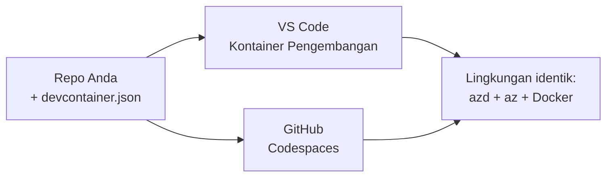

# Dev Containers & GitHub Codespaces untuk azd

**Navigasi Bab:**
- **📚 Beranda Kursus**: [AZD Untuk Pemula](../../README.md)
- **📖 Bab Saat Ini**: Bab 1 - Dasar & Mulai Cepat
- **⬅️ Sebelumnya**: [Bawa Aplikasi Anda Sendiri](bring-your-own-app.md)
- **🚀 Bab Berikutnya**: [Chapter 2: AI-First Development](../chapter-02-ai-development/README.md)

> Divalidasi terhadap `azd 1.25.6` pada Juni 2026.

## Pendahuluan

Menginstal azd, runtime bahasa yang tepat, Docker, dan Azure CLI di setiap mesin itu merepotkan—dan ini adalah alasan nomor satu ketika sebuah tutorial yang "berfungsi di mesin saya" gagal untuk orang lain. Sebuah **dev container** menyelesaikan ini dengan mendeskripsikan seluruh toolchain Anda dalam sebuah file. Siapa pun yang membuka proyek di VS Code atau GitHub Codespaces akan mendapat lingkungan yang persis sama, dengan azd sudah terpasang. Pelajaran ini menunjukkan cara menambahkannya.

## Tujuan Pembelajaran

Pada akhir pelajaran ini, Anda akan:
- Memahami apa itu dev container dan mengapa itu membantu dengan azd
- Menambahkan `.devcontainer/devcontainer.json` minimal ke suatu proyek
- Menyertakan azd, Azure CLI, dan Docker melalui *features* Dev Container
- Membuka proyek di GitHub Codespaces atau VS Code

## Hasil Pembelajaran

Setelah menyelesaikan pelajaran ini, Anda akan mampu:
- Menulis `devcontainer.json` untuk proyek azd
- Menambahkan azd dan tooling Azure tanpa instalasi manual
- Menjalankan `azd up` dari dalam kontainer atau Codespace

---

## Apa itu Dev Container?

Sebuah dev container adalah lingkungan pengembangan berbasis Docker yang didefinisikan oleh file `.devcontainer/devcontainer.json` di repositori Anda. Ketika Anda membuka proyek:

- **VS Code** (dengan ekstensi Dev Containers) membangun kontainer dan menempelkan diri ke dalamnya.
- **GitHub Codespaces** membangun kontainer yang sama di cloud dan memberi Anda editor berbasis browser.

Bagaimanapun, setiap kontributor mendapat alat yang identik—tidak ada lagi troubleshooting "apakah kamu sudah menginstal azd?".



---

## Langkah 1: Buat File devcontainer

Buat `.devcontainer/devcontainer.json` di root proyek Anda:

```json
{
  "name": "azd-project",
  "image": "mcr.microsoft.com/devcontainers/base:bookworm",
  "features": {
    "ghcr.io/devcontainers/features/azure-cli:1": {},
    "ghcr.io/azure/azure-dev/azd:latest": {},
    "ghcr.io/devcontainers/features/docker-in-docker:2": {},
    "ghcr.io/devcontainers/features/node:1": {}
  },
  "customizations": {
    "vscode": {
      "extensions": [
        "ms-azuretools.azure-dev",
        "ms-azuretools.vscode-bicep"
      ]
    }
  },
  "forwardPorts": [3000],
  "postCreateCommand": "azd version"
}
```

Apa yang dilakukan setiap bagian:

| Key | Tujuan |
|-----|--------|
| `image` | OS dasar untuk kontainer |
| `features` | Penginstal pra-bangun—di sini: Azure CLI, **azd**, Docker, dan Node.js |
| `customizations.vscode.extensions` | Menginstal otomatis ekstensi azd dan Bicep untuk VS Code |
| `forwardPorts` | Mengekspos port aplikasi Anda ke browser |
| `postCreateCommand` | Dijalankan sekali setelah kontainer dibangun (di sini, pemeriksaan sanity) |

> Fitur `ghcr.io/azure/azure-dev/azd:latest` adalah cara resmi untuk mendapatkan azd di dalam kontainer. Pin versi tertentu (misalnya `azd:1.25.6`) jika Anda membutuhkan reproduksibilitas.

---

## Langkah 2: Sesuaikan Feature dengan Bahasa Aplikasi Anda

Ganti fitur `node` dengan apa pun yang digunakan aplikasi Anda:

```jsonc
// Python project
"ghcr.io/devcontainers/features/python:1": {},

// .NET project
"ghcr.io/devcontainers/features/dotnet:2": {},

// Java project
"ghcr.io/devcontainers/features/java:1": {},

// Go project
"ghcr.io/devcontainers/features/go:1": {}
```

Biarkan `docker-in-docker` jika `host` Anda adalah `containerapp`, `aks`, atau apa pun yang membangun image kontainer—azd membutuhkan Docker untuk membangun dan mendorong image.

---

## Langkah 3: Buka

**Di VS Code:**
1. Instal ekstensi **Dev Containers**.
2. Buka folder proyek.
3. Klik **Reopen in Container** ketika diminta (atau jalankan *Dev Containers: Reopen in Container*).

**Di GitHub Codespaces:**
1. Push repo ke GitHub.
2. Klik **Code → Codespaces → Create codespace on main**.
3. Tunggu sampai kontainer dibangun—azd siap di terminal.

---

## Langkah 4: Terapkan dari Dalam Kontainer

Kontainer sudah memiliki azd terpasang, jadi alur kerja biasa langsung berfungsi:

```bash
azd auth login --use-device-code   # kode perangkat berguna di dalam Codespaces
azd up
```

> **Mengapa `--use-device-code`?** Di dalam kontainer jarak jauh atau Codespace tidak ada browser lokal untuk diarahkan, jadi login dengan device-code adalah jalur yang andal. Anda akan menempelkan kode ke tab browser untuk menyelesaikan masuk.

---

## Masalah Umum

| Masalah | Perbaikan |
|---------|----------|
| `azd up` tidak bisa membangun image | Tambahkan fitur `docker-in-docker` |
| Login browser macet di Codespaces | Gunakan `azd auth login --use-device-code` |
| Alat berbeda antar rekan tim | Pin versi fitur (mis. `azd:1.25.6`) |
| Aplikasi tidak dapat diakses di browser | Tambahkan port ke `forwardPorts` |

---

## Ringkasan

- Sebuah dev container membuat toolchain azd Anda dapat direproduksi untuk semua orang.
- Tambahkan azd, Azure CLI, dan Docker melalui *features* Dev Container.
- Sesuaikan fitur bahasa dengan aplikasi Anda dan pertahankan `docker-in-docker` untuk host berbasis kontainer.
- Gunakan login device-code saat berjalan di dalam Codespaces.

---

## 🔗 Navigasi

| Arah | Resource |
|-------|----------|
| **Sebelumnya** | [Bawa Aplikasi Anda Sendiri](bring-your-own-app.md) |
| **Beranda Bab** | [Bab 1: Dasar & Mulai Cepat](README.md) |
| **Bab Berikutnya** | [Chapter 2: AI-First Development](../chapter-02-ai-development/README.md) |

## 📖 Sumber Terkait

- [Installation & Setup](installation.md)
- [Command Cheat Sheet](../../resources/cheat-sheet.md)
- [Official Dev Containers specification](https://containers.dev/)
- [azd Dev Container feature](https://github.com/Azure/azure-dev/tree/main/ext/devcontainer)

---

<!-- CO-OP TRANSLATOR DISCLAIMER START -->
**Penafian**:
Dokumen ini telah diterjemahkan menggunakan layanan terjemahan AI [Co-op Translator](https://github.com/Azure/co-op-translator). Meskipun kami berupaya untuk mencapai akurasi, harap diketahui bahwa terjemahan otomatis mungkin mengandung kesalahan atau ketidakakuratan. Dokumen asli dalam bahasa aslinya harus dianggap sebagai sumber yang sah. Untuk informasi penting, disarankan menggunakan terjemahan profesional oleh manusia. Kami tidak bertanggung jawab atas kesalahpahaman atau penafsiran yang keliru yang timbul dari penggunaan terjemahan ini.
<!-- CO-OP TRANSLATOR DISCLAIMER END -->