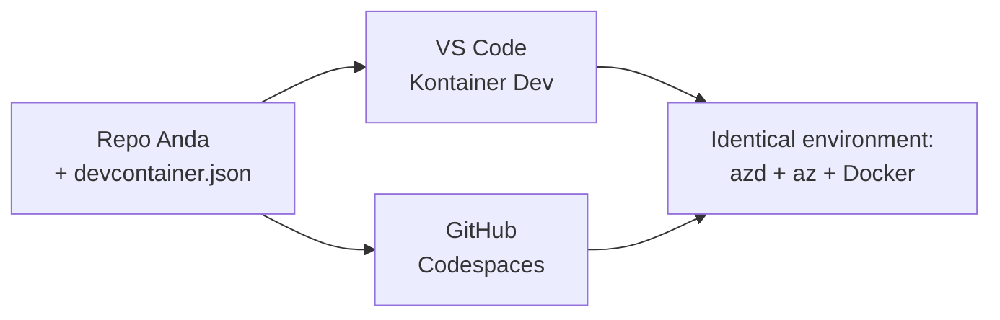

# Dev Containers & GitHub Codespaces untuk azd

**Navigasi Bab:**
- **📚 Beranda Kursus**: [AZD Untuk Pemula](../../README.md)
- **📖 Bab Saat Ini**: Bab 1 - Dasar & Mulai Cepat
- **⬅️ Sebelumnya**: [Bawa Aplikasimu Sendiri](bring-your-own-app.md)
- **🚀 Bab Selanjutnya**: [Bab 2: Pengembangan AI-Pertama](../chapter-02-ai-development/README.md)

> Divalidasi dengan `azd 1.27.1` pada Juli 2026.

## Pendahuluan

Menginstal azd, runtime bahasa yang tepat, Docker, dan Azure CLI di setiap mesin adalah pekerjaan yang melelahkan—dan ini adalah alasan utama tutorial yang "berjalan di mesin saya" gagal bagi orang lain. Sebuah **dev container** menyelesaikan masalah ini dengan mendeskripsikan seluruh rantai alat Anda dalam sebuah file. Siapa pun yang membuka proyek di VS Code atau GitHub Codespaces mendapatkan lingkungan yang sama persis, dengan azd sudah terpasang. Pelajaran ini menunjukkan cara menambahkannya.

## Tujuan Pembelajaran

Pada akhir pelajaran ini, Anda akan:
- Memahami apa itu dev container dan mengapa membantu dengan azd
- Menambahkan `.devcontainer/devcontainer.json` minimal ke sebuah proyek
- Menyertakan azd, Azure CLI, dan Docker melalui *fitur* Dev Container
- Membuka proyek di GitHub Codespaces atau VS Code

## Hasil Pembelajaran

Setelah menyelesaikan pelajaran ini, Anda akan dapat:
- Membuat `devcontainer.json` untuk proyek azd
- Menambah azd dan alat Azure tanpa instalasi manual
- Menjalankan `azd up` dari dalam container atau Codespace

---

## Apa Itu Dev Container?

Dev container adalah lingkungan pengembangan berbasis Docker yang didefinisikan oleh file `.devcontainer/devcontainer.json` di repositori Anda. Saat Anda membuka proyek:

- **VS Code** (dengan ekstensi Dev Containers) membangun container dan menghubungkannya.
- **GitHub Codespaces** membangun container yang sama di cloud dan memberi Anda editor berbasis browser.

Dengan cara apa pun, setiap kontributor mendapatkan alat yang identik—tidak ada lagi "apakah kamu sudah menginstal azd?" yang perlu diselesaikan.



---

## Langkah 1: Buat File devcontainer

Buat `.devcontainer/devcontainer.json` di root proyek Anda:

```json
{
  "name": "azd-project",
  "image": "mcr.microsoft.com/devcontainers/base:bookworm",
  "features": {
    "ghcr.io/devcontainers/features/azure-cli:1": {},
    "ghcr.io/azure/azure-dev/azd:latest": {},
    "ghcr.io/devcontainers/features/docker-in-docker:2": {},
    "ghcr.io/devcontainers/features/node:1": {}
  },
  "customizations": {
    "vscode": {
      "extensions": [
        "ms-azuretools.azure-dev",
        "ms-azuretools.vscode-bicep"
      ]
    }
  },
  "forwardPorts": [3000],
  "postCreateCommand": "azd version"
}
```

Apa fungsi setiap bagian:

| Kunci | Tujuan |
|-----|---------|
| `image` | OS dasar untuk container |
| `features` | Installer pra-bangun—di sini: Azure CLI, **azd**, Docker, dan Node.js |
| `customizations.vscode.extensions` | Menginstal otomatis ekstensi VS Code azd dan Bicep |
| `forwardPorts` | Membuka port aplikasi Anda ke browser |
| `postCreateCommand` | Dijalan sekali setelah container dibangun (di sini, pemeriksaan sanitas) |

> Fitur `ghcr.io/azure/azure-dev/azd:latest` adalah cara resmi mendapatkan azd di container. Tetapkan versi spesifik (misalnya `azd:1.27.1`) jika Anda membutuhkan keterulangan.

---

## Langkah 2: Sesuaikan Fitur dengan Bahasa Aplikasi Anda

Ganti fitur `node` dengan apa pun yang digunakan aplikasi Anda:

```jsonc
// Python project
"ghcr.io/devcontainers/features/python:1": {},

// .NET project
"ghcr.io/devcontainers/features/dotnet:2": {},

// Java project
"ghcr.io/devcontainers/features/java:1": {},

// Go project
"ghcr.io/devcontainers/features/go:1": {}
```

Pertahankan `docker-in-docker` jika `host` Anda adalah `containerapp`, `aks`, atau apa pun yang membangun image container—azd membutuhkan Docker untuk membangun dan mendorong image.

---

## Langkah 3: Buka

**Di VS Code:**
1. Pasang ekstensi **Dev Containers**.
2. Buka folder proyek.
3. Klik **Buka Lagi dalam Container** saat diminta (atau jalankan *Dev Containers: Reopen in Container*).

**Di GitHub Codespaces:**
1. Dorong repo ke GitHub.
2. Klik **Code → Codespaces → Buat codespace di main**.
3. Tunggu container dibangun—azd siap di terminal.

---

## Langkah 4: Deploy Dari Dalam Container

Container sudah terpasang azd, jadi alur kerja normal langsung berjalan:

```bash
azd auth login --use-device-code   # kode perangkat sangat berguna di dalam Codespaces
azd up
```

> **Kenapa `--use-device-code`?** Di container atau Codespace jarak jauh tidak ada browser lokal untuk pengalihan, jadi login kode-perangkat adalah jalur terpercaya. Anda akan menempelkan kode ke tab browser untuk menyelesaikan masuk.

---

## Kesalahan Umum

| Kesalahan | Solusi |
|---------|-----|
| `azd up` gagal membangun image | Tambahkan fitur `docker-in-docker` |
| Login browser macet di Codespaces | Gunakan `azd auth login --use-device-code` |
| Alat berbeda antar anggota tim | Tetapkan versi fitur (mis. `azd:1.27.1`) |
| Aplikasi tidak dapat diakses di browser | Tambahkan port ke `forwardPorts` |

---

## Ringkasan

- Dev container membuat rantai alat azd Anda dapat direproduksi untuk semua orang.
- Tambahkan azd, Azure CLI, dan Docker melalui *fitur* Dev Container.
- Sesuaikan fitur bahasa dengan aplikasi Anda dan pertahankan `docker-in-docker` untuk host container.
- Gunakan login kode-perangkat saat menjalankan di dalam Codespaces.

---

## 🔗 Navigasi

| Arah | Sumber Daya |
|-----------|----------|
| **Sebelumnya** | [Bawa Aplikasimu Sendiri](bring-your-own-app.md) |
| **Beranda Bab** | [Bab 1: Dasar & Mulai Cepat](README.md) |
| **Bab Selanjutnya** | [Bab 2: Pengembangan AI-Pertama](../chapter-02-ai-development/README.md) |

## 📖 Sumber Daya Terkait

- [Instalasi & Pengaturan](installation.md)
- [Cheat Sheet Perintah](../../resources/cheat-sheet.md)
- [Spesifikasi Dev Containers resmi](https://containers.dev/)
- [Fitur Dev Container azd](https://github.com/Azure/azure-dev/tree/main/ext/devcontainer)

---

<!-- CO-OP TRANSLATOR DISCLAIMER START -->
**Penafian**:
Dokumen ini telah diterjemahkan menggunakan layanan terjemahan AI [Co-op Translator](https://github.com/Azure/co-op-translator). Meskipun kami berupaya untuk mencapai akurasi, harap diketahui bahwa terjemahan otomatis mungkin mengandung kesalahan atau ketidakakuratan. Dokumen asli dalam bahasa aslinya harus dianggap sebagai sumber yang sah. Untuk informasi penting, disarankan menggunakan terjemahan profesional oleh manusia. Kami tidak bertanggung jawab atas kesalahpahaman atau penafsiran yang keliru yang timbul dari penggunaan terjemahan ini.
<!-- CO-OP TRANSLATOR DISCLAIMER END -->