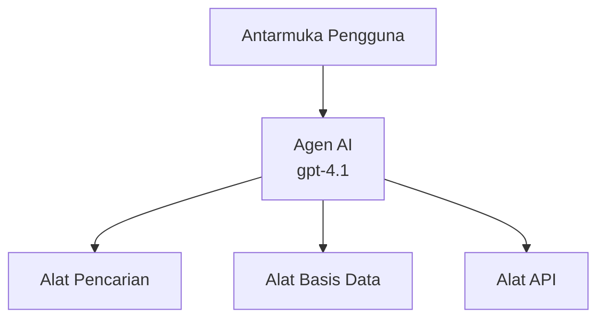
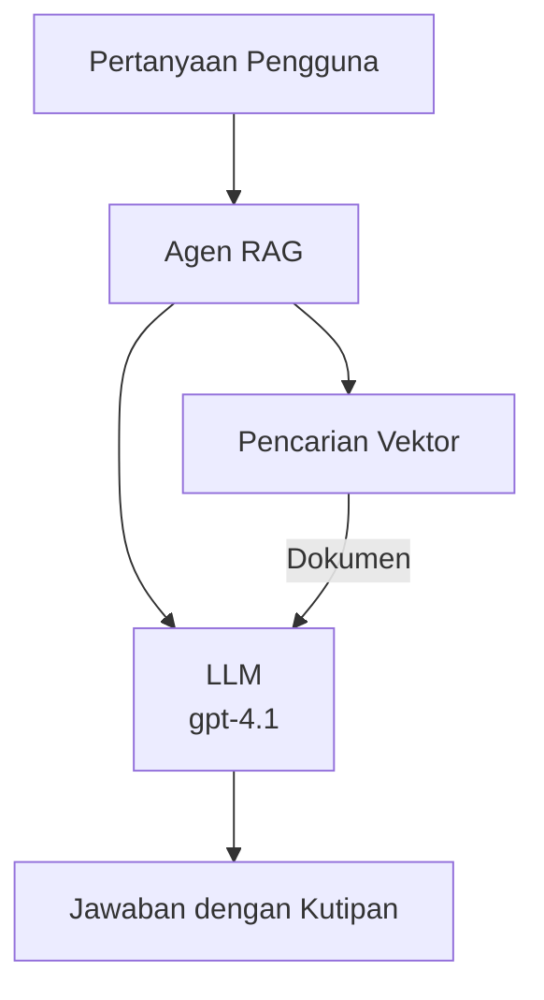
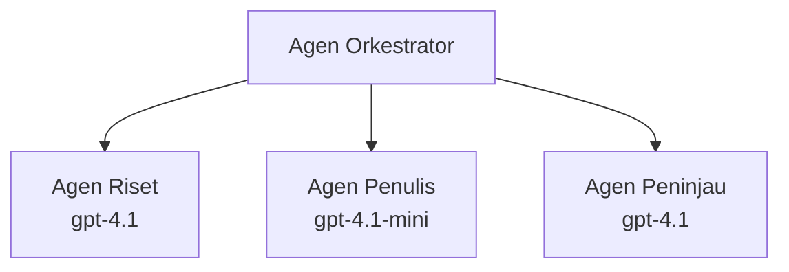

# Agen AI dengan Azure Developer CLI

**Navigasi Bab:**
- **📚 Beranda Kursus**: [AZD For Beginners](../../README.md)
- **📖 Bab Saat Ini**: Bab 2 - Pengembangan Berbasis AI
- **⬅️ Sebelumnya**: [Microsoft Foundry Integration](microsoft-foundry-integration.md)
- **➡️ Berikutnya**: [AI Model Deployment](ai-model-deployment.md)
- **🚀 Lanjutan**: [Multi-Agent Solutions](../../examples/retail-scenario.md)

---

## Pengenalan

Agen AI adalah program otonom yang dapat memahami lingkungan mereka, membuat keputusan, dan mengambil tindakan untuk mencapai tujuan tertentu. Berbeda dengan chatbot sederhana yang merespons prompt, agen dapat:

- **Menggunakan alat** - Memanggil API, mencari basis data, mengeksekusi kode
- **Merencanakan dan bernalar** - Memecah tugas kompleks menjadi langkah-langkah
- **Belajar dari konteks** - Menjaga memori dan menyesuaikan perilaku
- **Berkolaborasi** - Bekerja dengan agen lain (sistem multi-agen)

Panduan ini menunjukkan cara menerapkan agen AI ke Azure menggunakan Azure Developer CLI (azd).

## Tujuan Pembelajaran

Dengan menyelesaikan panduan ini, Anda akan:
- Memahami apa itu agen AI dan bagaimana perbedaannya dengan chatbot
- Menerapkan template agen AI yang sudah dibuat menggunakan AZD
- Mengonfigurasi Foundry Agents untuk agen kustom
- Mengimplementasikan pola agen dasar (penggunaan alat, RAG, multi-agen)
- Memantau dan men-debug agen yang diterapkan

## Hasil Pembelajaran

Setelah selesai, Anda akan dapat:
- Menerapkan aplikasi agen AI ke Azure dengan satu perintah
- Mengonfigurasi alat dan kemampuan agen
- Mengimplementasikan retrieval-augmented generation (RAG) dengan agen
- Merancang arsitektur multi-agen untuk alur kerja kompleks
- Memecahkan masalah umum penerapan agen

---

## 🤖 Apa yang Membuat Agen Berbeda dari Chatbot?

| Fitur | Chatbot | Agen AI |
|---------|---------|----------|
| **Perilaku** | Merespons prompt | Mengambil tindakan otonom |
| **Alat** | Tidak ada | Dapat memanggil API, mencari, mengeksekusi kode |
| **Memori** | Hanya berbasis sesi | Memori persisten antar sesi |
| **Perencanaan** | Respons tunggal | Penalaran multi-langkah |
| **Kolaborasi** | Entitas tunggal | Dapat bekerja dengan agen lain |

### Analogi Sederhana

- **Chatbot** = Seorang penjaga informasi yang membantu menjawab pertanyaan di meja informasi
- **Agen AI** = Asisten pribadi yang dapat menelpon, membuat janji, dan menyelesaikan tugas untuk Anda

---

## 🚀 Mulai Cepat: Terapkan Agen Pertama Anda

### Opsi 1: Template Foundry Agents (Direkomendasikan)

```bash
# Inisialisasi template agen AI
azd init --template get-started-with-ai-agents

# Terapkan ke Azure
azd up
```

**Yang diterapkan:**
- ✅ Foundry Agents
- ✅ Microsoft Foundry Models (gpt-4.1)
- ✅ Azure AI Search (untuk RAG)
- ✅ Azure Container Apps (antarmuka web)
- ✅ Application Insights (pemantauan)

**Waktu:** ~15-20 menit
**Biaya:** ~$100-150/bulan (pengembangan)

### Opsi 2: OpenAI Agent dengan Prompty

```bash
# Inisialisasi template agen berbasis Prompty
azd init --template agent-openai-python-prompty

# Terapkan ke Azure
azd up
```

**Yang diterapkan:**
- ✅ Azure Functions (eksekusi agen tanpa server)
- ✅ Microsoft Foundry Models
- ✅ File konfigurasi Prompty
- ✅ Implementasi agen contoh

**Waktu:** ~10-15 menit
**Biaya:** ~$50-100/bulan (pengembangan)

### Opsi 3: Agen Chat RAG

```bash
# Inisialisasi template obrolan RAG
azd init --template azure-search-openai-demo

# Terapkan ke Azure
azd up
```

**Yang diterapkan:**
- ✅ Microsoft Foundry Models
- ✅ Azure AI Search dengan data contoh
- ✅ Pipeline pemrosesan dokumen
- ✅ Antarmuka chat dengan sitasi

**Waktu:** ~15-25 menit
**Biaya:** ~$80-150/bulan (pengembangan)

### Opsi 4: AZD AI Agent Init (Berbasis Manifest)

Jika Anda memiliki file manifest agen, Anda dapat menggunakan perintah `azd ai` untuk membuat proyek Foundry Agent Service secara langsung:

```bash
# Instal ekstensi agen AI
azd extension install azure.ai.agents

# Inisialisasi dari manifes agen
azd ai agent init -m agent-manifest.yaml

# Terapkan ke Azure
azd up
```

**Kapan menggunakan `azd ai agent init` vs `azd init --template`:**

| Pendekatan | Terbaik Untuk | Cara Kerjanya |
|----------|----------|------|
| `azd init --template` | Memulai dari aplikasi sampel yang berfungsi | Mengkloning repositori template lengkap dengan kode + infrastruktur |
| `azd ai agent init -m` | Membangun dari manifest agen Anda sendiri | Membuat struktur proyek dari definisi agen Anda |

> **Tip:** Gunakan `azd init --template` saat belajar (Opsi 1-3 di atas). Gunakan `azd ai agent init` saat membangun agen produksi dengan manifest Anda sendiri. Lihat [AZD AI CLI Commands](../chapter-08-production/production-ai-practices.md#azd-ai-cli-commands-and-extensions) untuk referensi lengkap.

---

## 🏗️ Pola Arsitektur Agen

### Pola 1: Agen Tunggal dengan Alat

Pola agen paling sederhana - satu agen yang dapat menggunakan beberapa alat.


**Terbaik untuk:**
- Bot dukungan pelanggan
- Asisten riset
- Agen analisis data

**AZD Template:** `azure-search-openai-demo`

### Pola 2: Agen RAG (Retrieval-Augmented Generation)

Agen yang mengambil dokumen relevan sebelum menghasilkan respons.


**Terbaik untuk:**
- Basis pengetahuan perusahaan
- Sistem tanya jawab dokumen
- Riset kepatuhan dan hukum

**AZD Template:** `azure-search-openai-demo`

### Pola 3: Sistem Multi-Agen

Beberapa agen khusus yang bekerja sama pada tugas kompleks.


**Terbaik untuk:**
- Generasi konten kompleks
- Alur kerja multi-langkah
- Tugas yang memerlukan keahlian berbeda

**Pelajari Lebih Lanjut:** [Multi-Agent Coordination Patterns](../chapter-06-pre-deployment/coordination-patterns.md)

---

## ⚙️ Mengonfigurasi Alat Agen

Agen menjadi kuat ketika mereka dapat menggunakan alat. Berikut cara mengonfigurasi alat umum:

### Konfigurasi Alat di Foundry Agents

```python
# agent_config.py
from azure.ai.projects import AIProjectClient
from azure.ai.projects.models import FunctionTool, CodeInterpreterTool

# Definisikan alat-alat kustom
search_tool = FunctionTool(
    name="search_knowledge_base",
    description="Search the company knowledge base for relevant documents",
    parameters={
        "type": "object",
        "properties": {
            "query": {
                "type": "string",
                "description": "The search query"
            }
        },
        "required": ["query"]
    }
)

# Buat agen dengan alat-alat
agent = project_client.agents.create_agent(
    model="gpt-4.1",
    name="Support Agent",
    instructions="You are a helpful support agent. Use the search tool to find relevant information.",
    tools=[search_tool, CodeInterpreterTool()]
)
```

### Konfigurasi Lingkungan

```bash
# Siapkan variabel lingkungan khusus agen
azd env set AZURE_OPENAI_MODEL "gpt-4.1"
azd env set AGENT_INSTRUCTIONS "You are a helpful assistant..."
azd env set ENABLE_CODE_INTERPRETER "true"
azd env set ENABLE_FILE_SEARCH "true"

# Terapkan dengan konfigurasi yang diperbarui
azd deploy
```

---

## 📊 Memantau Agen

### Integrasi Application Insights

Semua template agen AZD menyertakan Application Insights untuk pemantauan:

```bash
# Buka dasbor pemantauan
azd monitor --overview

# Lihat log langsung
azd monitor --logs

# Lihat metrik langsung
azd monitor --live
```

### Metrik Kunci untuk Dilacak

| Metrik | Deskripsi | Sasaran |
|--------|-------------|--------|
| Latensi Respon | Waktu untuk menghasilkan respon | < 5 detik |
| Penggunaan Token | Token per permintaan | Pantau untuk biaya |
| Tingkat Keberhasilan Panggilan Alat | % eksekusi alat yang berhasil | > 95% |
| Tingkat Error | Permintaan agen yang gagal | < 1% |
| Kepuasan Pengguna | Skor umpan balik | > 4.0/5.0 |

### Logging Kustom untuk Agen

```python
import os
from azure.monitor.opentelemetry import configure_azure_monitor
from opentelemetry import trace

# Konfigurasikan Azure Monitor dengan OpenTelemetry
configure_azure_monitor(
    connection_string=os.environ["APPLICATIONINSIGHTS_CONNECTION_STRING"]
)

tracer = trace.get_tracer(__name__)

def log_agent_interaction(user_query, agent_response, tools_used, latency_ms):
    with tracer.start_as_current_span("agent_interaction") as span:
        span.set_attributes({
            "user_query": user_query,
            "response_length": len(agent_response),
            "tools_used": tools_used,
            "latency_ms": latency_ms
        })
```

> **Catatan:** Instal paket yang diperlukan: `pip install azure-monitor-opentelemetry opentelemetry`

---

## 💰 Pertimbangan Biaya

### Perkiraan Biaya Bulanan berdasarkan Pola

| Pola | Lingkungan Dev | Produksi |
|---------|-----------------|------------|
| Agen Tunggal | $50-100 | $200-500 |
| Agen RAG | $80-150 | $300-800 |
| Multi-Agen (2-3 agen) | $150-300 | $500-1,500 |
| Multi-Agen Perusahaan | $300-500 | $1,500-5,000+ |

### Tips Optimisasi Biaya

1. **Gunakan gpt-4.1-mini untuk tugas sederhana**
   ```bash
   azd env set AZURE_OPENAI_MODEL "gpt-4.1-mini"
   ```

2. **Implementasikan caching untuk kueri berulang**
   ```python
   from functools import lru_cache
   
   @lru_cache(maxsize=1000)
   def get_cached_response(query_hash):
       return agent.run(query_hash)
   ```

3. **Atur batas token per eksekusi**
   ```python
   # Atur max_completion_tokens saat menjalankan agen, bukan saat pembuatan
   run = project_client.agents.create_run(
       thread_id=thread.id,
       agent_id=agent.id,
       max_completion_tokens=1000  # Batasi panjang respons
   )
   ```

4. **Skalakan ke nol saat tidak digunakan**
   ```bash
   # Container Apps secara otomatis diskalakan hingga nol
   azd env set MIN_REPLICAS "0"
   ```

---

## 🔧 Memecahkan Masalah Agen

### Masalah Umum dan Solusi

<details>
<summary><strong>❌ Agen tidak merespons pemanggilan alat</strong></summary>

```bash
# Periksa apakah alat terdaftar dengan benar
azd show

# Verifikasi penyebaran OpenAI
az cognitiveservices account deployment list \
  --name $AZURE_OPENAI_NAME \
  --resource-group $RG_NAME

# Periksa log agen
azd monitor --logs
```

**Penyebab umum:**
- Ketidaksesuaian tanda tangan fungsi alat
- Izin yang diperlukan hilang
- Endpoint API tidak dapat diakses
</details>

<details>
<summary><strong>❌ Latensi tinggi pada respons agen</strong></summary>

```bash
# Periksa Application Insights untuk hambatan
azd monitor --live

# Pertimbangkan menggunakan model yang lebih cepat
azd env set AZURE_OPENAI_MODEL "gpt-4.1-mini"
azd deploy
```

**Tips optimisasi:**
- Gunakan respons streaming
- Implementasikan caching respons
- Kurangi ukuran jendela konteks
</details>

<details>
<summary><strong>❌ Agen mengembalikan informasi yang tidak akurat atau halusinasi</strong></summary>

```python
# Perbaiki dengan prompt sistem yang lebih baik
instructions = """
You are a helpful assistant. IMPORTANT:
- Only answer based on provided context
- If you don't know, say "I don't know"
- Always cite your sources
- Never make up information
"""

# Tambahkan pengambilan untuk pemantapan
agent = project_client.agents.create_agent(
    model="gpt-4.1",
    instructions=instructions,
    tools=[FileSearchTool()]  # Dasarkan respons pada dokumen
)
```
</details>

<details>
<summary><strong>❌ Kesalahan batas token terlampaui</strong></summary>

```python
# Implementasikan manajemen jendela konteks
def truncate_context(messages, max_tokens=8000, model="gpt-4.1"):
    """Keep only recent messages within token limit."""
    import tiktoken
    encoding = tiktoken.encoding_for_model(model)
    total_tokens = 0
    truncated = []
    
    for msg in reversed(messages):
        msg_tokens = len(encoding.encode(msg.content))
        if total_tokens + msg_tokens > max_tokens:
            break
        truncated.insert(0, msg)
        total_tokens += msg_tokens
    
    return truncated
```
</details>

---

## 🎓 Latihan Praktik

### Latihan 1: Terapkan Agen Dasar (20 menit)

**Tujuan:** Terapkan agen AI pertama Anda menggunakan AZD

```bash
# Langkah 1: Inisialisasi templat
azd init --template get-started-with-ai-agents

# Langkah 2: Masuk ke Azure
azd auth login

# Langkah 3: Terapkan
azd up

# Langkah 4: Uji agen
# Keluaran yang diharapkan setelah penyebaran:
#   Penyebaran selesai!
#   Titik akhir: https://<app-name>.<region>.azurecontainerapps.io
# Buka URL yang ditampilkan di keluaran dan coba ajukan pertanyaan

# Langkah 5: Lihat pemantauan
azd monitor --overview

# Langkah 6: Bersihkan
azd down --force --purge
```

**Kriteria Keberhasilan:**
- [ ] Agen merespon pertanyaan
- [ ] Dapat mengakses dasbor pemantauan via `azd monitor`
- [ ] Sumber daya dibersihkan dengan sukses

### Latihan 2: Tambahkan Alat Kustom (30 menit)

**Tujuan:** Perluas agen dengan alat kustom

1. Terapkan template agen:
   ```bash
   azd init --template get-started-with-ai-agents
   azd up
   ```
2. Buat fungsi alat baru dalam kode agen Anda:
   ```python
   def get_weather(location: str) -> str:
       """Get current weather for a location."""
       # Panggilan API ke layanan cuaca
       return f"Weather in {location}: Sunny, 72°F"
   ```
3. Daftarkan alat ke agen:
   ```python
   from azure.ai.projects.models import FunctionTool

   weather_tool = FunctionTool(
       name="get_weather",
       description="Get current weather for a location",
       parameters={
           "type": "object",
           "properties": {
               "location": {"type": "string", "description": "City name"}
           },
           "required": ["location"]
       }
   )

   agent = project_client.agents.create_agent(
       model="gpt-4.1",
       name="Weather Agent",
       tools=[weather_tool]
   )
   ```
4. Redeploy dan uji:
   ```bash
   azd deploy
   # Tanya: "Bagaimana cuaca di Seattle?"
   # Diharapkan: Agen memanggil get_weather("Seattle") dan mengembalikan informasi cuaca
   ```

**Kriteria Keberhasilan:**
- [ ] Agen mengenali kueri terkait cuaca
- [ ] Alat dipanggil dengan benar
- [ ] Respons menyertakan informasi cuaca

### Latihan 3: Bangun Agen RAG (45 menit)

**Tujuan:** Buat agen yang menjawab pertanyaan dari dokumen Anda

```bash
# Langkah 1: Terapkan templat RAG
azd init --template azure-search-openai-demo
azd up

# Langkah 2: Unggah dokumen Anda
# Letakkan file PDF/TXT di direktori data/, lalu jalankan:
python scripts/prepdocs.py

# Langkah 3: Uji dengan pertanyaan khusus domain
# Buka URL aplikasi web dari keluaran azd up
# Ajukan pertanyaan tentang dokumen yang Anda unggah
# Respons harus menyertakan referensi sitasi seperti [doc.pdf]
```

**Kriteria Keberhasilan:**
- [ ] Agen menjawab dari dokumen yang diunggah
- [ ] Respons menyertakan sitasi
- [ ] Tidak terjadi halusinasi pada pertanyaan di luar cakupan

---

## 📚 Langkah Berikutnya

Sekarang setelah Anda memahami agen AI, jelajahi topik lanjutan ini:

| Topik | Deskripsi | Link |
|-------|-------------|------|
| **Multi-Agent Systems** | Bangun sistem dengan beberapa agen yang berkolaborasi | [Retail Multi-Agent Example](../../examples/retail-scenario.md) |
| **Coordination Patterns** | Pelajari pola orkestrasi dan komunikasi | [Coordination Patterns](../chapter-06-pre-deployment/coordination-patterns.md) |
| **Production Deployment** | Penerapan agen siap-enterprise | [Production AI Practices](../chapter-08-production/production-ai-practices.md) |
| **Agent Evaluation** | Uji dan evaluasi performa agen | [AI Troubleshooting](../chapter-07-troubleshooting/ai-troubleshooting.md) |
| **AI Workshop Lab** | Praktik langsung: Siapkan solusi AI Anda agar siap AZD | [AI Workshop Lab](ai-workshop-lab.md) |

---

## 📖 Sumber Daya Tambahan

### Dokumentasi Resmi
- [Azure AI Agent Service](https://learn.microsoft.com/azure/ai-services/agents/)
- [Azure AI Foundry Agent Service Quickstart](https://learn.microsoft.com/azure/ai-services/agents/quickstart)
- [Semantic Kernel Agent Framework](https://learn.microsoft.com/semantic-kernel/)

### Template AZD untuk Agen
- [Get Started with AI Agents](https://github.com/Azure-Samples/get-started-with-ai-agents)
- [Agent OpenAI Python Prompty](https://github.com/Azure-Samples/agent-openai-python-prompty)
- [Azure Search OpenAI Demo](https://github.com/Azure-Samples/azure-search-openai-demo)

### Sumber Komunitas
- [Awesome AZD - Agent Templates](https://azure.github.io/awesome-azd/?tags=ai-agents)
- [Azure AI Discord](https://discord.gg/microsoft-azure)
- [Microsoft Foundry Discord](https://discord.gg/nTYy5BXMWG)

### Keterampilan Agen untuk Editor Anda
- [**Microsoft Azure Agent Skills**](https://skills.sh/microsoft/github-copilot-for-azure) - Instal keterampilan agen AI yang dapat digunakan kembali untuk pengembangan Azure di GitHub Copilot, Cursor, atau agen yang didukung. Termasuk keterampilan untuk [Azure AI](https://skills.sh/microsoft/github-copilot-for-azure/azure-ai), [Microsoft Foundry](https://skills.sh/microsoft/github-copilot-for-azure/microsoft-foundry), [deployment](https://skills.sh/microsoft/github-copilot-for-azure/azure-deploy), dan [diagnostics](https://skills.sh/microsoft/github-copilot-for-azure/azure-diagnostics):
  ```bash
  npx skills add microsoft/github-copilot-for-azure
  ```

---

**Navigasi**
- **Pelajaran Sebelumnya**: [Microsoft Foundry Integration](microsoft-foundry-integration.md)
- **Pelajaran Berikutnya**: [AI Model Deployment](ai-model-deployment.md)

---

<!-- CO-OP TRANSLATOR DISCLAIMER START -->
**Penafian**:
Dokumen ini telah diterjemahkan menggunakan layanan terjemahan AI [Co-op Translator](https://github.com/Azure/co-op-translator). Meskipun kami berusaha mencapai keakuratan, harap diketahui bahwa terjemahan otomatis dapat mengandung kesalahan atau ketidaktepatan. Dokumen asli dalam bahasa aslinya harus dianggap sebagai sumber yang otoritatif. Untuk informasi penting, disarankan menggunakan terjemahan profesional oleh penerjemah manusia. Kami tidak bertanggung jawab atas kesalahpahaman atau penafsiran yang salah yang timbul dari penggunaan terjemahan ini.
<!-- CO-OP TRANSLATOR DISCLAIMER END -->