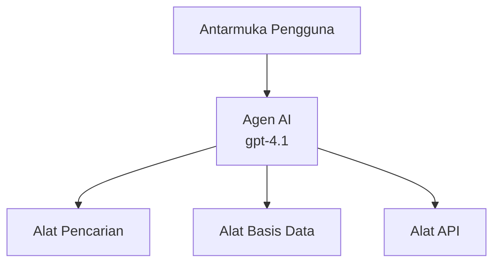
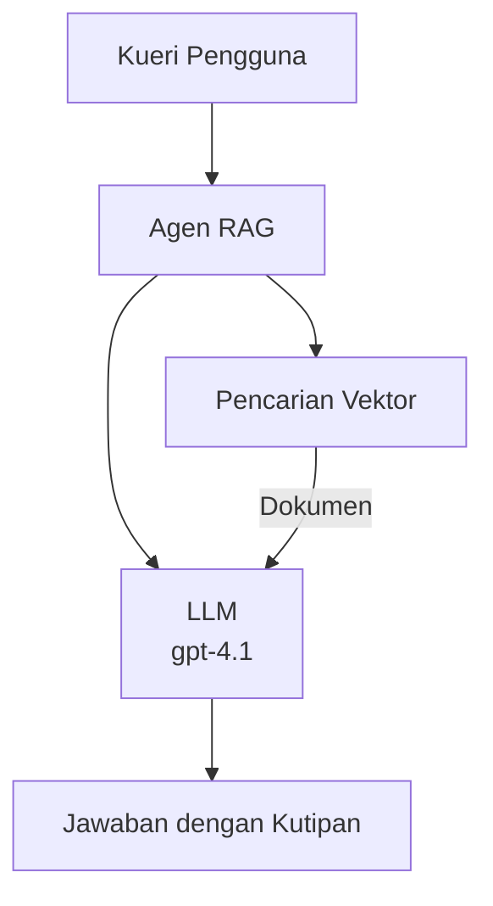
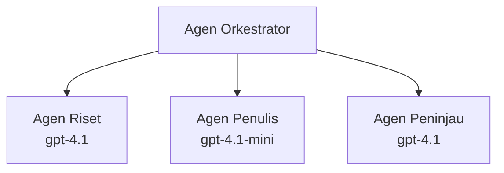

# AI Agents with Azure Developer CLI

**Chapter Navigation:**
- **📚 Course Home**: [AZD For Beginners](../../README.md)
- **📖 Current Chapter**: Chapter 2 - AI-First Development
- **⬅️ Previous**: [Microsoft Foundry Integration](microsoft-foundry-integration.md)
- **➡️ Next**: [AI Model Deployment](ai-model-deployment.md)
- **🚀 Advanced**: [Multi-Agent Solutions](../../examples/retail-scenario.md)

---

## Introduction

AI agents are autonomous programs that can perceive their environment, make decisions, and take actions to achieve specific goals. Unlike simple chatbots that respond to prompts, agents can:

- **Use tools** - Call APIs, search databases, execute code
- **Plan and reason** - Break complex tasks into steps
- **Learn from context** - Maintain memory and adapt behavior
- **Collaborate** - Work with other agents (multi-agent systems)

This guide shows you how to deploy AI agents to Azure using Azure Developer CLI (azd).

> **Validation note (2026-03-25):** This guide was reviewed against `azd` `1.23.12` and `azure.ai.agents` `0.1.18-preview`. The `azd ai` experience is still preview-driven, so check extension help if your installed flags differ.

## Learning Goals

By completing this guide, you will:
- Understand what AI agents are and how they differ from chatbots
- Deploy pre-built AI agent templates using AZD
- Configure Foundry Agents for custom agents
- Implement basic agent patterns (tool use, RAG, multi-agent)
- Monitor and debug deployed agents

## Learning Outcomes

Upon completion, you will be able to:
- Deploy AI agent applications to Azure with a single command
- Configure agent tools and capabilities
- Implement retrieval-augmented generation (RAG) with agents
- Design multi-agent architectures for complex workflows
- Troubleshoot common agent deployment issues

---

## 🤖 What Makes an Agent Different from a Chatbot?

| Feature | Chatbot | AI Agent |
|---------|---------|----------|
| **Behavior** | Responds to prompts | Takes autonomous actions |
| **Tools** | None | Can call APIs, search, execute code |
| **Memory** | Session-based only | Persistent memory across sessions |
| **Planning** | Single response | Multi-step reasoning |
| **Collaboration** | Single entity | Can work with other agents |

### Simple Analogy

- **Chatbot** = A helpful person answering questions at an information desk
- **AI Agent** = A personal assistant who can make calls, book appointments, and complete tasks for you

---

## 🚀 Quick Start: Deploy Your First Agent

### Option 1: Foundry Agents Template (Recommended)

```bash
# Inisialisasikan templat agen AI
azd init --template get-started-with-ai-agents

# Terapkan ke Azure
azd up
```

**What gets deployed:**
- ✅ Foundry Agents
- ✅ Microsoft Foundry Models (gpt-4.1)
- ✅ Azure AI Search (for RAG)
- ✅ Azure Container Apps (web interface)
- ✅ Application Insights (monitoring)

**Time:** ~15-20 minutes
**Cost:** ~$100-150/month (development)

### Option 2: OpenAI Agent with Prompty

```bash
# Inisialisasi templat agen berbasis Prompty
azd init --template agent-openai-python-prompty

# Terapkan ke Azure
azd up
```

**What gets deployed:**
- ✅ Azure Functions (serverless agent execution)
- ✅ Microsoft Foundry Models
- ✅ Prompty configuration files
- ✅ Sample agent implementation

**Time:** ~10-15 minutes
**Cost:** ~$50-100/month (development)

### Option 3: RAG Chat Agent

```bash
# Inisialisasi template obrolan RAG
azd init --template azure-search-openai-demo

# Terapkan ke Azure
azd up
```

**What gets deployed:**
- ✅ Microsoft Foundry Models
- ✅ Azure AI Search with sample data
- ✅ Document processing pipeline
- ✅ Chat interface with citations

**Time:** ~15-25 minutes
**Cost:** ~$80-150/month (development)

### Option 4: AZD AI Agent Init (Manifest- or Template-Based Preview)

If you have an agent manifest file, you can use the `azd ai` command to scaffold a Foundry Agent Service project directly. Recent preview releases also added template-based initialization support, so the exact prompt flow may differ slightly depending on your installed extension version.

```bash
# Instal ekstensi agen AI
azd extension install azure.ai.agents

# Opsional: verifikasi versi pratinjau yang terpasang
azd extension show azure.ai.agents

# Inisialisasi dari manifest agen
azd ai agent init -m agent-manifest.yaml

# Sebarkan ke Azure
azd up
```

**When to use `azd ai agent init` vs `azd init --template`:**

| Approach | Best For | How It Works |
|----------|----------|------|
| `azd init --template` | Starting from a working sample app | Clones a full template repo with code + infra |
| `azd ai agent init -m` | Building from your own agent manifest | Scaffolds project structure from your agent definition |

> **Tip:** Use `azd init --template` when learning (Options 1-3 above). Use `azd ai agent init` when building production agents with your own manifests. See [AZD AI CLI Commands](../chapter-08-production/production-ai-practices.md#azd-ai-cli-commands-and-extensions) for full reference.

---

## 🏗️ Agent Architecture Patterns

### Pattern 1: Single Agent with Tools

The simplest agent pattern - one agent that can use multiple tools.


**Best for:**
- Customer support bots
- Research assistants
- Data analysis agents

**AZD Template:** `azure-search-openai-demo`

### Pattern 2: RAG Agent (Retrieval-Augmented Generation)

An agent that retrieves relevant documents before generating responses.


**Best for:**
- Enterprise knowledge bases
- Document Q&A systems
- Compliance and legal research

**AZD Template:** `azure-search-openai-demo`

### Pattern 3: Multi-Agent System

Multiple specialized agents working together on complex tasks.


**Best for:**
- Complex content generation
- Multi-step workflows
- Tasks requiring different expertise

**Learn More:** [Multi-Agent Coordination Patterns](../chapter-06-pre-deployment/coordination-patterns.md)

---

## ⚙️ Configuring Agent Tools

Agents become powerful when they can use tools. Here's how to configure common tools:

### Tool Configuration in Foundry Agents

```python
# agent_config.py
from azure.ai.projects import AIProjectClient
from azure.ai.projects.models import FunctionTool, CodeInterpreterTool

# Definisikan alat kustom
search_tool = FunctionTool(
    name="search_knowledge_base",
    description="Search the company knowledge base for relevant documents",
    parameters={
        "type": "object",
        "properties": {
            "query": {
                "type": "string",
                "description": "The search query"
            }
        },
        "required": ["query"]
    }
)

# Buat agen dengan alat
agent = project_client.agents.create_agent(
    model="gpt-4.1",
    name="Support Agent",
    instructions="You are a helpful support agent. Use the search tool to find relevant information.",
    tools=[search_tool, CodeInterpreterTool()]
)
```

### Environment Configuration

```bash
# Siapkan variabel lingkungan khusus agen
azd env set AZURE_OPENAI_MODEL "gpt-4.1"
azd env set AGENT_INSTRUCTIONS "You are a helpful assistant..."
azd env set ENABLE_CODE_INTERPRETER "true"
azd env set ENABLE_FILE_SEARCH "true"

# Terapkan dengan konfigurasi yang diperbarui
azd deploy
```

---

## 📊 Monitoring Agents

### Application Insights Integration

All AZD agent templates include Application Insights for monitoring:

```bash
# Buka dasbor pemantauan
azd monitor --overview

# Lihat log langsung
azd monitor --logs

# Lihat metrik langsung
azd monitor --live
```

### Key Metrics to Track

| Metric | Description | Target |
|--------|-------------|--------|
| Response Latency | Time to generate response | < 5 seconds |
| Token Usage | Tokens per request | Monitor for cost |
| Tool Call Success Rate | % of successful tool executions | > 95% |
| Error Rate | Failed agent requests | < 1% |
| User Satisfaction | Feedback scores | > 4.0/5.0 |

### Custom Logging for Agents

```python
import os
from azure.monitor.opentelemetry import configure_azure_monitor
from opentelemetry import trace

# Konfigurasikan Azure Monitor dengan OpenTelemetry
configure_azure_monitor(
    connection_string=os.environ["APPLICATIONINSIGHTS_CONNECTION_STRING"]
)

tracer = trace.get_tracer(__name__)

def log_agent_interaction(user_query, agent_response, tools_used, latency_ms):
    with tracer.start_as_current_span("agent_interaction") as span:
        span.set_attributes({
            "user_query": user_query,
            "response_length": len(agent_response),
            "tools_used": tools_used,
            "latency_ms": latency_ms
        })
```

> **Note:** Install the required packages: `pip install azure-monitor-opentelemetry opentelemetry`

---

## 💰 Cost Considerations

### Estimated Monthly Costs by Pattern

| Pattern | Dev Environment | Production |
|---------|-----------------|------------|
| Single Agent | $50-100 | $200-500 |
| RAG Agent | $80-150 | $300-800 |
| Multi-Agent (2-3 agents) | $150-300 | $500-1,500 |
| Enterprise Multi-Agent | $300-500 | $1,500-5,000+ |

### Cost Optimization Tips

1. **Use gpt-4.1-mini for simple tasks**
   ```bash
   azd env set AZURE_OPENAI_MODEL "gpt-4.1-mini"
   ```

2. **Implement caching for repeated queries**
   ```python
   from functools import lru_cache
   
   @lru_cache(maxsize=1000)
   def get_cached_response(query_hash):
       return agent.run(query_hash)
   ```

3. **Set token limits per run**
   ```python
   # Tetapkan max_completion_tokens saat menjalankan agen, bukan saat pembuatan
   run = project_client.agents.create_run(
       thread_id=thread.id,
       agent_id=agent.id,
       max_completion_tokens=1000  # Batasi panjang respons
   )
   ```

4. **Scale to zero when not in use**
   ```bash
   # Container Apps secara otomatis diskalakan menjadi nol
   azd env set MIN_REPLICAS "0"
   ```

---

## 🔧 Troubleshooting Agents

### Common Issues and Solutions

<details>
<summary><strong>❌ Agent not responding to tool calls</strong></summary>

```bash
# Periksa apakah alat-alat terdaftar dengan benar
azd show

# Verifikasi penyebaran OpenAI
az cognitiveservices account deployment list \
  --name $AZURE_OPENAI_NAME \
  --resource-group $RG_NAME

# Periksa log agen
azd monitor --logs
```

**Common causes:**
- Tool function signature mismatch
- Missing required permissions
- API endpoint not accessible
</details>

<details>
<summary><strong>❌ High latency in agent responses</strong></summary>

```bash
# Periksa Application Insights untuk hambatan
azd monitor --live

# Pertimbangkan menggunakan model yang lebih cepat
azd env set AZURE_OPENAI_MODEL "gpt-4.1-mini"
azd deploy
```

**Optimization tips:**
- Use streaming responses
- Implement response caching
- Reduce context window size
</details>

<details>
<summary><strong>❌ Agent returning incorrect or hallucinated information</strong></summary>

```python
# Tingkatkan dengan prompt sistem yang lebih baik
instructions = """
You are a helpful assistant. IMPORTANT:
- Only answer based on provided context
- If you don't know, say "I don't know"
- Always cite your sources
- Never make up information
"""

# Tambahkan pengambilan untuk pembumian
agent = project_client.agents.create_agent(
    model="gpt-4.1",
    instructions=instructions,
    tools=[FileSearchTool()]  # Dasarkan respons pada dokumen
)
```
</details>

<details>
<summary><strong>❌ Token limit exceeded errors</strong></summary>

```python
# Implementasikan manajemen jendela konteks
def truncate_context(messages, max_tokens=8000, model="gpt-4.1"):
    """Keep only recent messages within token limit."""
    import tiktoken
    encoding = tiktoken.encoding_for_model(model)
    total_tokens = 0
    truncated = []
    
    for msg in reversed(messages):
        msg_tokens = len(encoding.encode(msg.content))
        if total_tokens + msg_tokens > max_tokens:
            break
        truncated.insert(0, msg)
        total_tokens += msg_tokens
    
    return truncated
```
</details>

---

## 🎓 Hands-On Exercises

### Exercise 1: Deploy a Basic Agent (20 minutes)

**Goal:** Deploy your first AI agent using AZD

```bash
# Langkah 1: Inisialisasi template
azd init --template get-started-with-ai-agents

# Langkah 2: Masuk ke Azure
azd auth login
# Jika Anda bekerja di beberapa tenant, tambahkan --tenant-id <tenant-id>

# Langkah 3: Deploy
azd up

# Langkah 4: Uji agen
# Keluaran yang diharapkan setelah penyebaran:
#   Penyebaran Selesai!
#   Titik akhir: https://<app-name>.<region>.azurecontainerapps.io
# Buka URL yang ditampilkan di keluaran dan coba ajukan pertanyaan

# Langkah 5: Lihat pemantauan
azd monitor --overview

# Langkah 6: Bersihkan
azd down --force --purge
```

**Success Criteria:**
- [ ] Agent responds to questions
- [ ] Can access monitoring dashboard via `azd monitor`
- [ ] Resources cleaned up successfully

### Exercise 2: Add a Custom Tool (30 minutes)

**Goal:** Extend an agent with a custom tool

1. Deploy the agent template:
   ```bash
   azd init --template get-started-with-ai-agents
   azd up
   ```
2. Create a new tool function in your agent code:
   ```python
   def get_weather(location: str) -> str:
       """Get current weather for a location."""
       # Panggilan API ke layanan cuaca
       return f"Weather in {location}: Sunny, 72°F"
   ```
3. Register the tool with the agent:
   ```python
   from azure.ai.projects.models import FunctionTool

   weather_tool = FunctionTool(
       name="get_weather",
       description="Get current weather for a location",
       parameters={
           "type": "object",
           "properties": {
               "location": {"type": "string", "description": "City name"}
           },
           "required": ["location"]
       }
   )

   agent = project_client.agents.create_agent(
       model="gpt-4.1",
       name="Weather Agent",
       tools=[weather_tool]
   )
   ```
4. Redeploy and test:
   ```bash
   azd deploy
   # Tanya: "Bagaimana cuaca di Seattle?"
   # Diharapkan: Agen memanggil get_weather("Seattle") dan mengembalikan informasi cuaca
   ```

**Success Criteria:**
- [ ] Agent recognizes weather-related queries
- [ ] Tool is called correctly
- [ ] Response includes weather information

### Exercise 3: Build a RAG Agent (45 minutes)

**Goal:** Create an agent that answers questions from your documents

```bash
# Langkah 1: Terapkan template RAG
azd init --template azure-search-openai-demo
azd up

# Langkah 2: Unggah dokumen Anda
# Letakkan file PDF/TXT di direktori data/, lalu jalankan:
python scripts/prepdocs.py

# Langkah 3: Uji dengan pertanyaan khusus domain
# Buka URL aplikasi web dari output azd up
# Ajukan pertanyaan tentang dokumen yang Anda unggah
# Respons harus menyertakan referensi kutipan seperti [doc.pdf]
```

**Success Criteria:**
- [ ] Agent answers from uploaded documents
- [ ] Responses include citations
- [ ] No hallucination on out-of-scope questions

---

## 📚 Next Steps

Now that you understand AI agents, explore these advanced topics:

| Topic | Description | Link |
|-------|-------------|------|
| **Multi-Agent Systems** | Build systems with multiple collaborating agents | [Retail Multi-Agent Example](../../examples/retail-scenario.md) |
| **Coordination Patterns** | Learn orchestration and communication patterns | [Coordination Patterns](../chapter-06-pre-deployment/coordination-patterns.md) |
| **Production Deployment** | Enterprise-ready agent deployment | [Production AI Practices](../chapter-08-production/production-ai-practices.md) |
| **Agent Evaluation** | Test and evaluate agent performance | [AI Troubleshooting](../chapter-07-troubleshooting/ai-troubleshooting.md) |
| **AI Workshop Lab** | Hands-on: Make your AI solution AZD-ready | [AI Workshop Lab](ai-workshop-lab.md) |

---

## 📖 Additional Resources

### Official Documentation
- [Azure AI Agent Service](https://learn.microsoft.com/azure/ai-services/agents/)
- [Azure AI Foundry Agent Service Quickstart](https://learn.microsoft.com/azure/ai-services/agents/quickstart)
- [Semantic Kernel Agent Framework](https://learn.microsoft.com/semantic-kernel/)

### AZD Templates for Agents
- [Get Started with AI Agents](https://github.com/Azure-Samples/get-started-with-ai-agents)
- [Agent OpenAI Python Prompty](https://github.com/Azure-Samples/agent-openai-python-prompty)
- [Azure Search OpenAI Demo](https://github.com/Azure-Samples/azure-search-openai-demo)

### Community Resources
- [Awesome AZD - Agent Templates](https://azure.github.io/awesome-azd/?tags=ai-agents)
- [Azure AI Discord](https://discord.gg/microsoft-azure)
- [Microsoft Foundry Discord](https://discord.gg/nTYy5BXMWG)

### Agent Skills for Your Editor
- [**Microsoft Azure Agent Skills**](https://skills.sh/microsoft/github-copilot-for-azure) - Install reusable AI agent skills for Azure development in GitHub Copilot, Cursor, or any supported agent. Includes skills for [Azure AI](https://skills.sh/microsoft/github-copilot-for-azure/azure-ai), [Microsoft Foundry](https://skills.sh/microsoft/github-copilot-for-azure/microsoft-foundry), [deployment](https://skills.sh/microsoft/github-copilot-for-azure/azure-deploy), and [diagnostics](https://skills.sh/microsoft/github-copilot-for-azure/azure-diagnostics):
  ```bash
  npx skills add microsoft/github-copilot-for-azure
  ```

---

**Navigation**
- **Previous Lesson**: [Microsoft Foundry Integration](microsoft-foundry-integration.md)
- **Next Lesson**: [AI Model Deployment](ai-model-deployment.md)

---

<!-- CO-OP TRANSLATOR DISCLAIMER START -->
**Penafian**:
Dokumen ini telah diterjemahkan menggunakan layanan terjemahan AI [Co-op Translator](https://github.com/Azure/co-op-translator). Meskipun kami berupaya mencapai ketepatan, harap diperhatikan bahwa terjemahan otomatis mungkin mengandung kesalahan atau ketidakakuratan. Dokumen asli dalam bahasa aslinya harus dianggap sebagai sumber yang otoritatif. Untuk informasi penting, disarankan menggunakan terjemahan manusia profesional. Kami tidak bertanggung jawab atas kesalahpahaman atau salah tafsir yang timbul dari penggunaan terjemahan ini.
<!-- CO-OP TRANSLATOR DISCLAIMER END -->