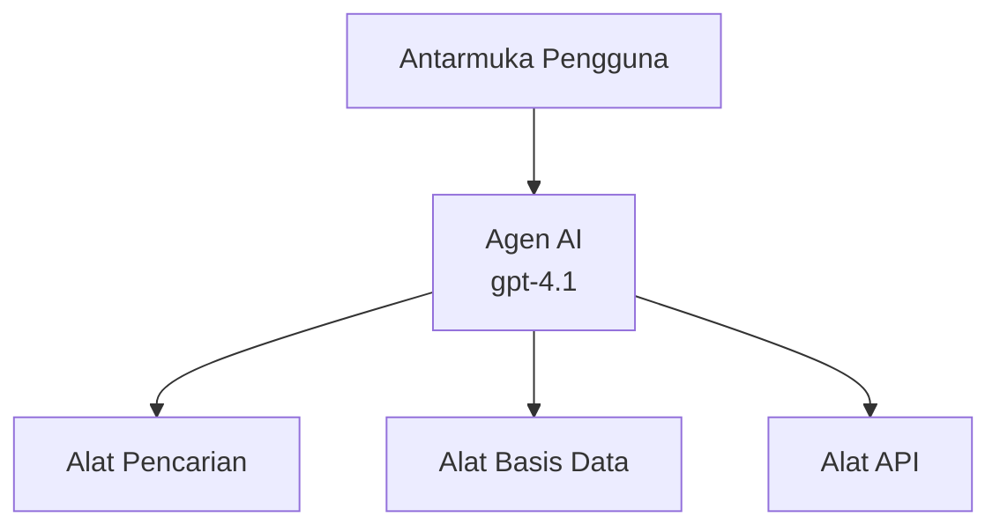
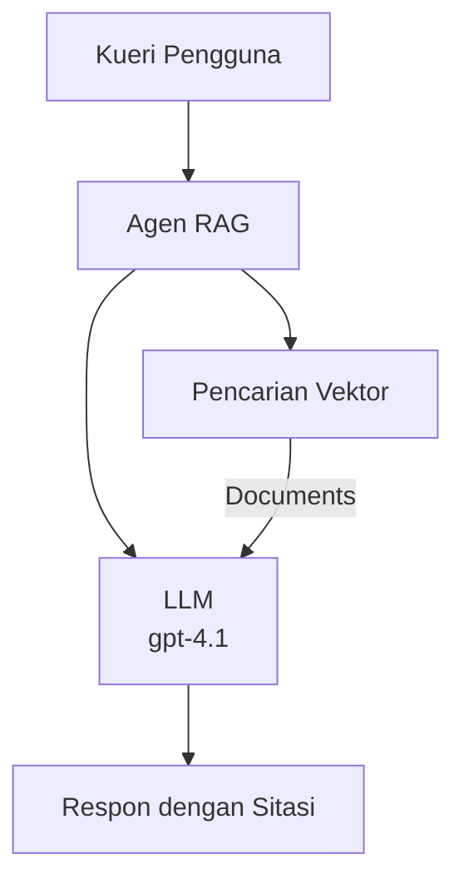
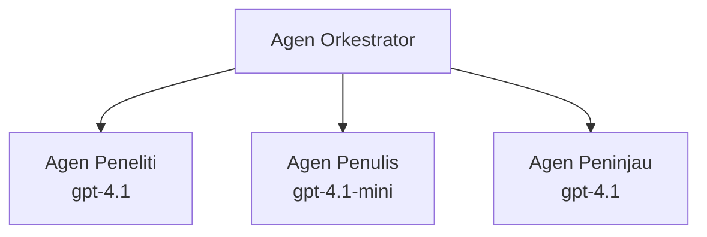

# Agen AI dengan Azure Developer CLI

**Navigasi Bab:**
- **📚 Beranda Kursus**: [AZD Untuk Pemula](../../README.md)
- **📖 Bab Saat Ini**: Bab 2 - Pengembangan AI-Pertama
- **⬅️ Sebelumnya**: [Integrasi Microsoft Foundry](microsoft-foundry-integration.md)
- **➡️ Berikutnya**: [Penerapan Model AI](ai-model-deployment.md)
- **🚀 Lanjutan**: [Solusi Multi-Agen](../../examples/retail-scenario.md)

---

## Pendahuluan

Agen AI adalah program otonom yang dapat mengamati lingkungan mereka, mengambil keputusan, dan melakukan tindakan untuk mencapai tujuan tertentu. Berbeda dengan chatbot sederhana yang hanya merespons perintah, agen dapat:

- **Menggunakan alat** - Memanggil API, mencari database, mengeksekusi kode
- **Merencanakan dan bernalar** - Memecah tugas kompleks menjadi langkah-langkah
- **Belajar dari konteks** - Mempertahankan memori dan menyesuaikan perilaku
- **Bekerja sama** - Bekerja dengan agen lain (sistem multi-agen)

Panduan ini menunjukkan cara menerapkan agen AI ke Azure menggunakan Azure Developer CLI (azd).

> **Catatan validasi (2026-07-13):** Panduan ini telah diperiksa dengan `azd` `1.27.1` dan `azure.ai.agents` `1.0.0-beta.5`. Pengalaman `azd ai` masih berbasis preview, jadi periksa bantuan ekstensi jika flag yang Anda pasang berbeda.

## Tujuan Pembelajaran

Dengan menyelesaikan panduan ini, Anda akan:
- Memahami apa itu agen AI dan bagaimana perbedaannya dengan chatbot
- Menerapkan template agen AI yang sudah dibuat menggunakan AZD
- Mengonfigurasi Foundry Agents untuk agen kustom
- Menerapkan pola agen dasar (penggunaan alat, RAG, multi-agen)
- Memantau dan meng-debug agen yang diterapkan

## Hasil Pembelajaran

Setelah selesai, Anda akan dapat:
- Menerapkan aplikasi agen AI ke Azure dengan satu perintah
- Mengonfigurasi alat dan kemampuan agen
- Menerapkan retrieval-augmented generation (RAG) dengan agen
- Merancang arsitektur multi-agen untuk alur kerja kompleks
- Memecahkan masalah umum penerapan agen

---

## 🤖 Apa yang Membuat Agen Berbeda dari Chatbot?

| Fitur | Chatbot | Agen AI |
|---------|---------|----------|
| **Perilaku** | Merespon perintah | Mengambil tindakan secara otonom |
| **Alat** | Tidak ada | Bisa memanggil API, mencari, mengeksekusi kode |
| **Memori** | Hanya berbasis sesi | Memori persisten antar sesi |
| **Perencanaan** | Respon tunggal | Penalaran berlangkah banyak |
| **Kolaborasi** | Entitas tunggal | Bisa bekerja dengan agen lain |

### Analogi Sederhana

- **Chatbot** = Seseorang yang membantu menjawab pertanyaan di meja informasi
- **Agen AI** = Asisten pribadi yang bisa membuat panggilan, memesan janji, dan menyelesaikan tugas untuk Anda

---

## 🚀 Mulai Cepat: Terapkan Agen Pertama Anda

### Opsi 1: Template Foundry Agents (Direkomendasikan)

```bash
# Inisialisasi template agen AI
azd init --template get-started-with-ai-agents

# Deploy ke Azure
azd up
```

**Yang diterapkan:**
- ✅ Foundry Agents
- ✅ Microsoft Foundry Models (gpt-4.1)
- ✅ Azure AI Search (untuk RAG)
- ✅ Azure Container Apps (antarmuka web)
- ✅ Application Insights (pemantauan)

**Waktu:** ~15-20 menit
**Biaya:** ~$100-150/bulan (pengembangan)

### Opsi 2: Agen OpenAI dengan Prompty

```bash
# Inisialisasi template agen berbasis Prompty
azd init --template agent-openai-python-prompty

# Deploy ke Azure
azd up
```

**Yang diterapkan:**
- ✅ Azure Functions (eksekusi agen serverless)
- ✅ Microsoft Foundry Models
- ✅ File konfigurasi Prompty
- ✅ Implementasi agen contoh

**Waktu:** ~10-15 menit
**Biaya:** ~$50-100/bulan (pengembangan)

### Opsi 3: Agen Chat RAG

```bash
# Inisialisasi template obrolan RAG
azd init --template azure-search-openai-demo

# Terapkan ke Azure
azd up
```

**Yang diterapkan:**
- ✅ Microsoft Foundry Models
- ✅ Azure AI Search dengan data contoh
- ✅ Pipeline pemrosesan dokumen
- ✅ Antarmuka chat dengan kutipan

**Waktu:** ~15-25 menit
**Biaya:** ~$80-150/bulan (pengembangan)

### Opsi 4: AZD AI Agent Init (Preview Berbasis Manifest atau Template)

Jika Anda memiliki file manifest agen, Anda bisa menggunakan perintah `azd ai` untuk membuat proyek Foundry Agent Service langsung. Rilis preview terbaru juga menambahkan dukungan inisialisasi berbasis template, jadi alur prompt tepat mungkin sedikit berbeda tergantung versi ekstensi yang Anda pasang.

```bash
# Instal ekstensi agen AI
azd extension install azure.ai.agents

# Opsional: verifikasi versi pratinjau yang terpasang
azd extension show azure.ai.agents

# Inisialisasi dari manifes agen
azd ai agent init -m agent-manifest.yaml

# Terapkan ke Azure
azd up

# Uji agen yang diterapkan (menampilkan latensi + waktu-ke-byte-pertama)
azd ai agent invoke
```

**Kapan menggunakan `azd ai agent init` vs `azd init --template`:**

| Pendekatan | Terbaik Untuk | Cara Kerja |
|----------|----------|------|
| `azd init --template` | Memulai dari aplikasi contoh kerja | Mengkloning repositori template lengkap dengan kode + infrastruktur |
| `azd ai agent init -m` | Membangun dari manifest agen sendiri | Membuat struktur proyek dari definisi agen Anda |

> **Tips:** Gunakan `azd init --template` saat belajar (Opsi 1-3 di atas). Gunakan `azd ai agent init` saat membangun agen produksi dengan manifest Anda sendiri.

Setelah `azd up`, ekstensi yang sama membawa Anda melewati siklus hidup agen: `azd ai agent invoke` untuk menguji, `azd ai agent eval generate` dan `azd ai agent optimize` untuk mengukur dan meningkatkan kualitas, serta `azd ai agent delete` untuk membersihkan. Lihat [Perintah AZD AI CLI](../chapter-08-production/production-ai-practices.md#azd-ai-cli-commands-and-extensions) untuk referensi lengkap.

---

## 🏗️ Pola Arsitektur Agen

### Pola 1: Agen Tunggal dengan Alat

Pola agen paling sederhana - satu agen yang dapat menggunakan berbagai alat.



**Terbaik untuk:**
- Bot dukungan pelanggan
- Asisten riset
- Agen analisis data

**Template AZD:** `azure-search-openai-demo`

### Pola 2: Agen RAG (Retrieval-Augmented Generation)

Agen yang mengambil dokumen relevan sebelum menghasilkan jawaban.



**Terbaik untuk:**
- Basis pengetahuan perusahaan
- Sistem Q&A dokumen
- Riset kepatuhan dan hukum

**Template AZD:** `azure-search-openai-demo`

### Pola 3: Sistem Multi-Agen

Beberapa agen khusus bekerja sama pada tugas kompleks.



**Terbaik untuk:**
- Generasi konten kompleks
- Alur kerja bertahap
- Tugas yang memerlukan keahlian berbeda

**Pelajari Lebih Lanjut:** [Pola Koordinasi Multi-Agen](../chapter-06-pre-deployment/coordination-patterns.md)

---

## ⚙️ Mengonfigurasi Alat Agen

Agen menjadi kuat ketika bisa menggunakan alat. Berikut cara mengonfigurasi alat umum:

### Konfigurasi Alat di Foundry Agents

```python
# agent_config.py
from azure.ai.projects import AIProjectClient
from azure.ai.projects.models import FunctionTool, CodeInterpreterTool

# Definisikan alat khusus
search_tool = FunctionTool(
    name="search_knowledge_base",
    description="Search the company knowledge base for relevant documents",
    parameters={
        "type": "object",
        "properties": {
            "query": {
                "type": "string",
                "description": "The search query"
            }
        },
        "required": ["query"]
    }
)

# Buat agen dengan alat-alat
agent = project_client.agents.create_agent(
    model="gpt-4.1",
    name="Support Agent",
    instructions="You are a helpful support agent. Use the search tool to find relevant information.",
    tools=[search_tool, CodeInterpreterTool()]
)
```

### Konfigurasi Lingkungan

```bash
# Atur variabel lingkungan spesifik agen
azd env set AZURE_OPENAI_MODEL "gpt-4.1"
azd env set AGENT_INSTRUCTIONS "You are a helpful assistant..."
azd env set ENABLE_CODE_INTERPRETER "true"
azd env set ENABLE_FILE_SEARCH "true"

# Deploy dengan konfigurasi yang diperbarui
azd deploy
```

---

## 📊 Memantau Agen

### Integrasi Application Insights

Semua template agen AZD menyertakan Application Insights untuk pemantauan:

```bash
# Buka dasbor pemantauan
azd monitor --overview

# Lihat log langsung
azd monitor --logs

# Lihat metrik langsung
azd monitor --live
```

### Metrik Kunci yang Dipantau

| Metrik | Deskripsi | Target |
|--------|-------------|--------|
| Latensi Respon | Waktu menghasilkan respon | < 5 detik |
| Penggunaan Token | Token per permintaan | Pantau untuk biaya |
| Tingkat Keberhasilan Panggilan Alat | % eksekusi alat berhasil | > 95% |
| Tingkat Kesalahan | Permintaan agen yang gagal | < 1% |
| Kepuasan Pengguna | Skor umpan balik | > 4.0/5.0 |

### Logging Kustom untuk Agen

```python
import os
from azure.monitor.opentelemetry import configure_azure_monitor
from opentelemetry import trace

# Konfigurasikan Azure Monitor dengan OpenTelemetry
configure_azure_monitor(
    connection_string=os.environ["APPLICATIONINSIGHTS_CONNECTION_STRING"]
)

tracer = trace.get_tracer(__name__)

def log_agent_interaction(user_query, agent_response, tools_used, latency_ms):
    with tracer.start_as_current_span("agent_interaction") as span:
        span.set_attributes({
            "user_query": user_query,
            "response_length": len(agent_response),
            "tools_used": tools_used,
            "latency_ms": latency_ms
        })
```

> **Catatan:** Instal paket yang diperlukan: `pip install azure-monitor-opentelemetry opentelemetry`

---

## 💰 Pertimbangan Biaya

### Estimasi Biaya Bulanan berdasarkan Pola

| Pola | Lingkungan Dev | Produksi |
|---------|-----------------|------------|
| Agen Tunggal | $50-100 | $200-500 |
| Agen RAG | $80-150 | $300-800 |
| Multi-Agen (2-3 agen) | $150-300 | $500-1,500 |
| Multi-Agen Perusahaan | $300-500 | $1,500-5,000+ |

### Tips Optimasi Biaya

1. **Gunakan gpt-4.1-mini untuk tugas sederhana**
   ```bash
   azd env set AZURE_OPENAI_MODEL "gpt-4.1-mini"
   ```

2. **Terapkan caching untuk kueri berulang**
   ```python
   from functools import lru_cache
   
   @lru_cache(maxsize=1000)
   def get_cached_response(query_hash):
       return agent.run(query_hash)
   ```

3. **Tetapkan batas token per jalankan**
   ```python
   # Tetapkan max_completion_tokens saat menjalankan agen, bukan saat pembuatan
   run = project_client.agents.create_run(
       thread_id=thread.id,
       agent_id=agent.id,
       max_completion_tokens=1000  # Batasi panjang respons
   )
   ```

4. **Skalakan ke nol saat tidak digunakan**
   ```bash
   # Aplikasi Kontainer secara otomatis skala hingga nol
   azd env set MIN_REPLICAS "0"
   ```

---

## 🔧 Pemecahan Masalah Agen

### Masalah dan Solusi Umum

<details>
<summary><strong>❌ Agen tidak merespons panggilan alat</strong></summary>

```bash
# Periksa apakah alat sudah terdaftar dengan benar
azd show

# Verifikasi penempatan OpenAI
az cognitiveservices account deployment list \
  --name $AZURE_OPENAI_NAME \
  --resource-group $RG_NAME

# Periksa log agen
azd monitor --logs
```

**Penyebab umum:**
- Ketidaksesuaian tanda tangan fungsi alat
- Izin yang dibutuhkan hilang
- Endpoint API tidak dapat diakses
</details>

<details>
<summary><strong>❌ Latensi tinggi pada respon agen</strong></summary>

```bash
# Periksa Application Insights untuk hambatan
azd monitor --live

# Pertimbangkan menggunakan model yang lebih cepat
azd env set AZURE_OPENAI_MODEL "gpt-4.1-mini"
azd deploy
```

**Tips optimasi:**
- Gunakan respon streaming
- Terapkan caching respon
- Kurangi ukuran jendela konteks
</details>

<details>
<summary><strong>❌ Agen mengembalikan informasi salah atau halusinasi</strong></summary>

```python
# Tingkatkan dengan prompt sistem yang lebih baik
instructions = """
You are a helpful assistant. IMPORTANT:
- Only answer based on provided context
- If you don't know, say "I don't know"
- Always cite your sources
- Never make up information
"""

# Tambahkan pengambilan untuk dasar
agent = project_client.agents.create_agent(
    model="gpt-4.1",
    instructions=instructions,
    tools=[FileSearchTool()]  # Dasarkan respons dalam dokumen
)
```
</details>

<details>
<summary><strong>❌ Kesalahan batas token terlampaui</strong></summary>

```python
# Terapkan manajemen jendela konteks
def truncate_context(messages, max_tokens=8000, model="gpt-4.1"):
    """Keep only recent messages within token limit."""
    import tiktoken
    encoding = tiktoken.encoding_for_model(model)
    total_tokens = 0
    truncated = []
    
    for msg in reversed(messages):
        msg_tokens = len(encoding.encode(msg.content))
        if total_tokens + msg_tokens > max_tokens:
            break
        truncated.insert(0, msg)
        total_tokens += msg_tokens
    
    return truncated
```
</details>

---

## 🎓 Latihan Praktik

### Latihan 1: Terapkan Agen Dasar (20 menit)

**Tujuan:** Terapkan agen AI pertama Anda menggunakan AZD

```bash
# Langkah 1: Inisialisasi template
azd init --template get-started-with-ai-agents

# Langkah 2: Masuk ke Azure
azd auth login
# Jika Anda bekerja lintas tenant, tambahkan --tenant-id <tenant-id>

# Langkah 3: Deploy
azd up

# Langkah 4: Uji agen
# Output yang diharapkan setelah deployment:
#   Deployment Selesai!
#   Endpoint: https://<app-name>.<region>.azurecontainerapps.io
# Buka URL yang ditampilkan di output dan coba ajukan pertanyaan

# Langkah 5: Lihat monitoring
azd monitor --overview

# Langkah 6: Bersihkan
azd down --force --purge
```

**Kriteria Keberhasilan:**
- [ ] Agen merespon pertanyaan
- [ ] Dapat mengakses dasbor pemantauan melalui `azd monitor`
- [ ] Sumber daya dibersihkan dengan sukses

### Latihan 2: Tambahkan Alat Kustom (30 menit)

**Tujuan:** Perluas agen dengan alat kustom

1. Terapkan template agen:
   ```bash
   azd init --template get-started-with-ai-agents
   azd up
   ```
2. Buat fungsi alat baru dalam kode agen Anda:
   ```python
   def get_weather(location: str) -> str:
       """Get current weather for a location."""
       # Panggilan API ke layanan cuaca
       return f"Weather in {location}: Sunny, 72°F"
   ```
3. Daftarkan alat dengan agen:
   ```python
   from azure.ai.projects.models import FunctionTool

   weather_tool = FunctionTool(
       name="get_weather",
       description="Get current weather for a location",
       parameters={
           "type": "object",
           "properties": {
               "location": {"type": "string", "description": "City name"}
           },
           "required": ["location"]
       }
   )

   agent = project_client.agents.create_agent(
       model="gpt-4.1",
       name="Weather Agent",
       tools=[weather_tool]
   )
   ```
4. Terapkan ulang dan uji:
   ```bash
   azd deploy
   # Tanya: "Bagaimana cuaca di Seattle?"
   # Diharapkan: Agen memanggil get_weather("Seattle") dan mengembalikan info cuaca
   ```

**Kriteria Keberhasilan:**
- [ ] Agen mengenali kueri terkait cuaca
- [ ] Alat dipanggil dengan benar
- [ ] Respon menyertakan informasi cuaca

### Latihan 3: Bangun Agen RAG (45 menit)

**Tujuan:** Buat agen yang menjawab pertanyaan dari dokumen Anda

```bash
# Langkah 1: Terapkan template RAG
azd init --template azure-search-openai-demo
azd up

# Langkah 2: Unggah dokumen Anda
# Tempatkan file PDF/TXT di direktori data/, kemudian jalankan:
python scripts/prepdocs.py

# Langkah 3: Uji dengan pertanyaan khusus domain
# Buka URL aplikasi web dari output azd up
# Ajukan pertanyaan tentang dokumen yang Anda unggah
# Respons harus menyertakan referensi kutipan seperti [doc.pdf]
```

**Kriteria Keberhasilan:**
- [ ] Agen menjawab dari dokumen yang diunggah
- [ ] Respon menyertakan kutipan
- [ ] Tidak ada halusinasi pada pertanyaan di luar cakupan

---

## 📚 Langkah Selanjutnya

Sekarang Anda memahami agen AI, jelajahi topik lanjutan ini:

| Topik | Deskripsi | Tautan |
|-------|-------------|------|
| **Sistem Multi-Agen** | Bangun sistem dengan banyak agen yang berkolaborasi | [Contoh Multi-Agen Retail](../../examples/retail-scenario.md) |
| **Pola Koordinasi** | Pelajari pola orkestrasi dan komunikasi | [Pola Koordinasi](../chapter-06-pre-deployment/coordination-patterns.md) |
| **Penerapan Produksi** | Penerapan agen siap perusahaan | [Praktik AI Produksi](../chapter-08-production/production-ai-practices.md) |
| **Evaluasi Agen** | Uji dan evaluasi kinerja agen | [Pemecahan Masalah AI](../chapter-07-troubleshooting/ai-troubleshooting.md) |
| **Workshop Lab AI** | Praktik langsung: Buat solusi AI Anda siap AZD | [Workshop Lab AI](ai-workshop-lab.md) |

---

## 📖 Sumber Daya Tambahan

### Dokumentasi Resmi
- [Microsoft Foundry Agent Service](https://learn.microsoft.com/azure/ai-services/agents/)
- [Microsoft Foundry Agent Service Quickstart](https://learn.microsoft.com/azure/ai-services/agents/quickstart)
- [Semantic Kernel Agent Framework](https://learn.microsoft.com/semantic-kernel/)

### Template AZD untuk Agen
- [Memulai dengan Agen AI](https://github.com/Azure-Samples/get-started-with-ai-agents)
- [Agent OpenAI Python Prompty](https://github.com/Azure-Samples/agent-openai-python-prompty)
- [Azure Search OpenAI Demo](https://github.com/Azure-Samples/azure-search-openai-demo)

### Sumber Daya Komunitas
- [Awesome AZD - Template Agen](https://azure.github.io/awesome-azd/?tags=ai-agents)
- [Azure AI Discord](https://discord.gg/microsoft-azure)
- [Microsoft Foundry Discord](https://discord.gg/nTYy5BXMWG)

### Keterampilan Agen untuk Editor Anda
- [**Microsoft Azure Agent Skills**](https://skills.sh/microsoft/github-copilot-for-azure) - Instal keterampilan agen AI yang dapat digunakan ulang untuk pengembangan Azure di GitHub Copilot, Cursor, atau agen yang didukung lainnya. Termasuk keterampilan untuk [Azure AI](https://skills.sh/microsoft/github-copilot-for-azure/azure-ai), [Microsoft Foundry](https://skills.sh/microsoft/github-copilot-for-azure/microsoft-foundry), [penerapan](https://skills.sh/microsoft/github-copilot-for-azure/azure-deploy), dan [diagnostik](https://skills.sh/microsoft/github-copilot-for-azure/azure-diagnostics):
  ```bash
  npx skills add microsoft/github-copilot-for-azure
  ```

---

**Navigasi**
- **Pelajaran Sebelumnya**: [Integrasi Microsoft Foundry](microsoft-foundry-integration.md)
- **Pelajaran Berikutnya**: [Penerapan Model AI](ai-model-deployment.md)

---

<!-- CO-OP TRANSLATOR DISCLAIMER START -->
**Penafian**:
Dokumen ini telah diterjemahkan menggunakan layanan terjemahan AI [Co-op Translator](https://github.com/Azure/co-op-translator). Meskipun kami berupaya untuk mencapai akurasi, harap diketahui bahwa terjemahan otomatis mungkin mengandung kesalahan atau ketidakakuratan. Dokumen asli dalam bahasa aslinya harus dianggap sebagai sumber yang sah. Untuk informasi penting, disarankan menggunakan terjemahan profesional oleh manusia. Kami tidak bertanggung jawab atas kesalahpahaman atau penafsiran yang keliru yang timbul dari penggunaan terjemahan ini.
<!-- CO-OP TRANSLATOR DISCLAIMER END -->