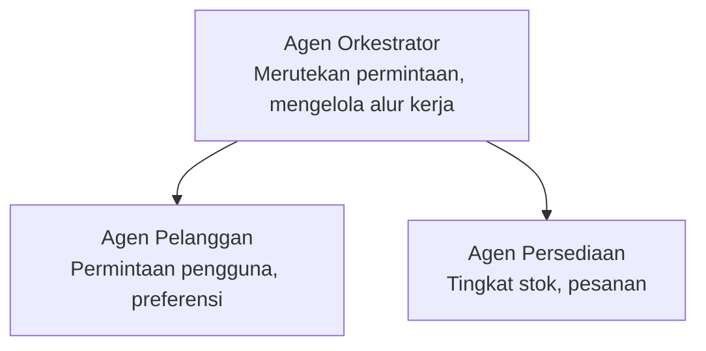

# Chapter 5: Multi-Agent AI Solutions

**📚 Kursus**: [AZD For Beginners](../../README.md) | **⏱️ Durasi**: 2-3 hours | **⭐ Kompleksitas**: Advanced

---

## Ikhtisar

Bab ini membahas pola arsitektur multi-agen tingkat lanjut, orkestrasi agen, dan penerapan AI siap-produksi untuk skenario kompleks.

> Divalidasi terhadap `azd 1.25.6` pada Juni 2026.

## Tujuan Pembelajaran

Dengan menyelesaikan bab ini, Anda akan:
- Memahami pola arsitektur multi-agen
- Menerapkan sistem agen AI yang terkoordinasi
- Mengimplementasikan komunikasi antar-agen
- Membangun solusi multi-agen siap-produksi

---

## 📚 Pelajaran

| # | Pelajaran | Deskripsi | Waktu |
|---|--------|-------------|------|
| 1 | [Multi-Agent Basics](multi-agent-basics.md) | Praktik langsung: terapkan aplikasi multi-agen yang berfungsi dengan `azd up` | 45 menit |
| 2 | [Coordination Patterns](../chapter-06-pre-deployment/coordination-patterns.md) | Strategi orkestrasi agen (berlanjut di Bab 6) | 30 menit |
| 3 | [ARM Template Deployment](../../examples/retail-multiagent-arm-template/README.md) | Contoh penerapan dengan satu klik | 30 menit |

> **Mulai dengan Pelajaran 1.** Itu satu-satunya pelajaran yang sepenuhnya praktis dan dapat diterapkan di bab ini. Pelajaran 2 berada di Bab 6 (dibagikan dengan perencanaan pra-penerapan), dan [Solusi Multi-Agen Ritel](../../examples/retail-scenario.md) adalah cetak biru arsitektur—referensi desain, bukan template satu-perintah.

---

## 🚀 Panduan Cepat

```bash
# Opsi 1: Terapkan dari templat
azd init --template agent-openai-python-prompty
azd up

# Opsi 2: Terapkan dari manifes agen (memerlukan ekstensi azure.ai.agents)
azd extension install azure.ai.agents
azd ai agent init -m agent-manifest.yaml
azd up
```

> **Pendekatan mana?** Gunakan `azd init --template` untuk memulai dari contoh yang berfungsi. Gunakan `azd ai agent init` ketika Anda memiliki manifest agen sendiri. Lihat [Referensi AZD AI CLI](../chapter-08-production/production-ai-practices.md#azd-ai-cli-commands-and-extensions) untuk detail lengkap.

---

## 🤖 Arsitektur Multi-Agen



---

## 🎯 Solusi Unggulan: Multi-Agen Ritel

The [Solusi Multi-Agen Ritel](../../examples/retail-scenario.md) demonstrates:

- **Customer Agent**: Menangani interaksi pengguna dan preferensi
- **Inventory Agent**: Mengelola stok dan pemrosesan pesanan
- **Orchestrator**: Mengkoordinasikan antar agen
- **Shared Memory**: Manajemen konteks lintas agen

### Layanan yang Digunakan

| Service | Purpose |
|---------|---------|
| Microsoft Foundry Models | Pemahaman bahasa |
| Azure AI Search | Katalog produk |
| Cosmos DB | Status agen dan memori |
| Container Apps | Hosting agen |
| Application Insights | Pemantauan |

---

## 🔗 Navigasi

| Arah | Bab |
|-----------|---------|
| **Sebelumnya** | [Bab 4: Infrastructure](../chapter-04-infrastructure/README.md) |
| **Berikutnya** | [Bab 6: Pre-Deployment](../chapter-06-pre-deployment/README.md) |

---

## 📖 Sumber Terkait

- [Panduan Agen AI](../chapter-02-ai-development/agents.md)
- [Praktik AI Produksi](../chapter-08-production/production-ai-practices.md)
- [Pemecahan Masalah AI](../chapter-07-troubleshooting/ai-troubleshooting.md)

---

<!-- CO-OP TRANSLATOR DISCLAIMER START -->
**Penafian**:
Dokumen ini telah diterjemahkan menggunakan layanan terjemahan AI [Co-op Translator](https://github.com/Azure/co-op-translator). Meskipun kami berupaya untuk mencapai akurasi, harap diketahui bahwa terjemahan otomatis mungkin mengandung kesalahan atau ketidakakuratan. Dokumen asli dalam bahasa aslinya harus dianggap sebagai sumber yang sah. Untuk informasi penting, disarankan menggunakan terjemahan profesional oleh manusia. Kami tidak bertanggung jawab atas kesalahpahaman atau penafsiran yang keliru yang timbul dari penggunaan terjemahan ini.
<!-- CO-OP TRANSLATOR DISCLAIMER END -->