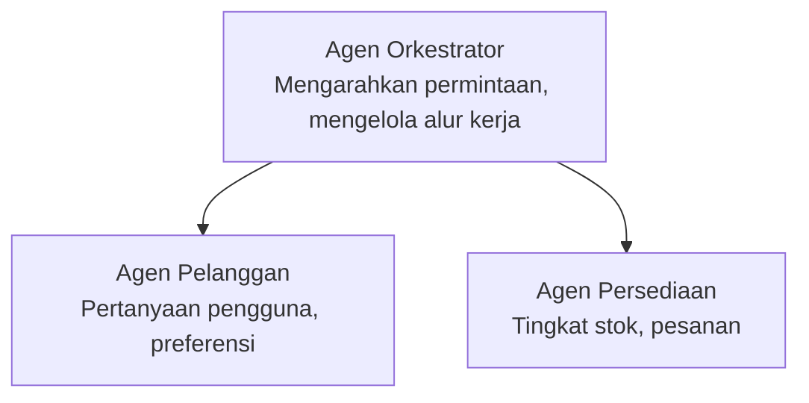

# Bab 5: Solusi AI Multi-Agen

**📚 Kursus**: [AZD For Beginners](../../README.md) | **⏱️ Durasi**: 2-3 jam | **⭐ Kompleksitas**: Lanjutan

---

## Ikhtisar

Bab ini membahas pola arsitektur multi-agen tingkat lanjut, orkestrasi agen, dan penyebaran AI siap produksi untuk skenario kompleks.

> Divalidasi terhadap `azd 1.23.12` pada Maret 2026.

## Tujuan Pembelajaran

Dengan menyelesaikan bab ini, Anda akan:
- Memahami pola arsitektur multi-agen
- Menyebarkan sistem agen AI yang terkoordinasi
- Mengimplementasikan komunikasi antar-agen
- Membangun solusi multi-agen siap produksi

---

## 📚 Pelajaran

| # | Pelajaran | Deskripsi | Waktu |
|---|--------|-------------|------|
| 1 | [Solusi Multi-Agen Ritel](../../examples/retail-scenario.md) | Panduan implementasi lengkap | 90 menit |
| 2 | [Pola Koordinasi](../chapter-06-pre-deployment/coordination-patterns.md) | Strategi orkestrasi agen | 30 menit |
| 3 | [Penyebaran Template ARM](../../examples/retail-multiagent-arm-template/README.md) | Penyebaran sekali-klik | 30 menit |

---

## 🚀 Mulai Cepat

```bash
# Opsi 1: Terapkan dari templat
azd init --template agent-openai-python-prompty
azd up

# Opsi 2: Terapkan dari manifes agen (membutuhkan ekstensi azure.ai.agents)
azd extension install azure.ai.agents
azd ai agent init -m agent-manifest.yaml
azd up
```

> **Pendekatan mana?** Use `azd init --template` to start from a working sample. Use `azd ai agent init` when you have your own agent manifest. Lihat the [Referensi AZD AI CLI](../chapter-08-production/production-ai-practices.md#azd-ai-cli-commands-and-extensions) untuk detail lengkap.

---

## 🤖 Arsitektur Multi-Agen


---

## 🎯 Solusi Unggulan: Multi-Agen Ritel

The [Solusi Multi-Agen Ritel](../../examples/retail-scenario.md) menunjukkan:

- **Agen Pelanggan**: Menangani interaksi pengguna dan preferensi
- **Agen Inventaris**: Mengelola stok dan pemrosesan pesanan
- **Orkestrator**: Mengkoordinasikan antar-agen
- **Memori Bersama**: Manajemen konteks lintas-agen

### Layanan yang Digunakan

| Layanan | Tujuan |
|---------|---------|
| Microsoft Foundry Models | Pemahaman bahasa |
| Azure AI Search | Katalog produk |
| Cosmos DB | Status dan memori agen |
| Container Apps | Hosting agen |
| Application Insights | Pemantauan |

---

## 🔗 Navigasi

| Arah | Bab |
|-----------|---------|
| **Sebelumnya** | [Bab 4: Infrastruktur](../chapter-04-infrastructure/README.md) |
| **Berikutnya** | [Bab 6: Pra-Penyebaran](../chapter-06-pre-deployment/README.md) |

---

## 📖 Sumber Terkait

- [Panduan Agen AI](../chapter-02-ai-development/agents.md)
- [Praktik AI Produksi](../chapter-08-production/production-ai-practices.md)
- [Pemecahan Masalah AI](../chapter-07-troubleshooting/ai-troubleshooting.md)

---

<!-- CO-OP TRANSLATOR DISCLAIMER START -->
**Penafian**:
Dokumen ini telah diterjemahkan menggunakan layanan terjemahan AI [Co-op Translator](https://github.com/Azure/co-op-translator). Meskipun kami berupaya mencapai akurasi, harap diketahui bahwa terjemahan otomatis mungkin mengandung kesalahan atau ketidakakuratan. Dokumen asli dalam bahasa aslinya harus dianggap sebagai sumber otoritatif. Untuk informasi penting, disarankan menggunakan terjemahan profesional oleh penerjemah manusia. Kami tidak bertanggung jawab atas segala kesalahpahaman atau salah tafsir yang timbul dari penggunaan terjemahan ini.
<!-- CO-OP TRANSLATOR DISCLAIMER END -->