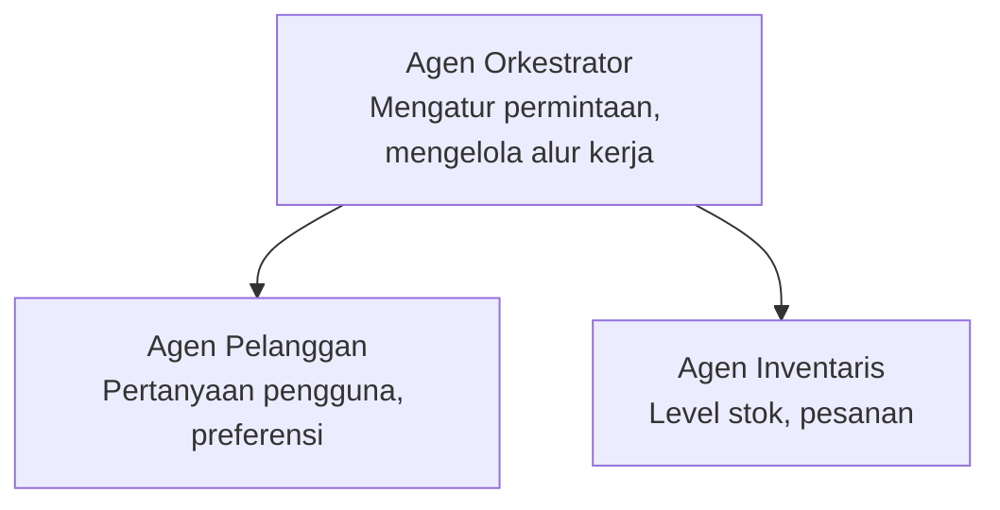

# Bab 5: Solusi AI Multi-Agen

**📚 Kursus**: [AZD Untuk Pemula](../../README.md) | **⏱️ Durasi**: 2-3 jam | **⭐ Kompleksitas**: Lanjutan

---

## Ikhtisar

Bab ini membahas pola arsitektur multi-agen tingkat lanjut, orkestrasi agen, dan penerapan AI siap produksi untuk skenario kompleks.

> Diverifikasi dengan `azd 1.27.1` pada Juli 2026.

## Tujuan Pembelajaran

Dengan menyelesaikan bab ini, Anda akan:
- Memahami pola arsitektur multi-agen
- Menerapkan sistem agen AI yang terkoordinasi
- Mengimplementasikan komunikasi antar-agen
- Membangun solusi multi-agen siap produksi

---

## 📚 Pelajaran

| # | Pelajaran | Deskripsi | Waktu |
|---|--------|-------------|------|
| 1 | [Dasar-Dasar Multi-Agen](multi-agent-basics.md) | Praktik langsung: terapkan aplikasi multi-agen yang berfungsi dengan `azd up` | 45 menit |
| 2 | [Pola Koordinasi](../chapter-06-pre-deployment/coordination-patterns.md) | Strategi orkestrasi agen (lanjutan di Bab 6) | 30 menit |
| 3 | [Penerapan Template ARM](../../examples/retail-multiagent-arm-template/README.md) | Contoh penerapan sekali klik | 30 menit |

> **Mulailah dengan Pelajaran 1.** Ini satu-satunya pelajaran yang sepenuhnya praktis dan dapat diterapkan di bab ini. Pelajaran 2 ada di Bab 6 (dibagikan dengan perencanaan pra-penerapan), dan [Solusi Multi-Agen Ritel](../../examples/retail-scenario.md) adalah cetak biru arsitektur—referensi desain, bukan template perintah tunggal.

---

## 🚀 Mulai Cepat

```bash
# Opsi 1: Deploy dari sebuah template
azd init --template agent-openai-python-prompty
azd up

# Opsi 2: Deploy dari manifest agen (memerlukan ekstensi azure.ai.agents)
azd extension install azure.ai.agents
azd ai agent init -m agent-manifest.yaml
azd up
```

> **Pendekatan mana?** Gunakan `azd init --template` untuk memulai dari sampel yang bekerja. Gunakan `azd ai agent init` ketika Anda memiliki manifes agen sendiri. Lihat [referensi AZD AI CLI](../chapter-08-production/production-ai-practices.md#azd-ai-cli-commands-and-extensions) untuk detail lengkap.

---

## 🤖 Arsitektur Multi-Agen



---

## 🎯 Solusi Unggulan: Multi-Agen Ritel

[Solusi Multi-Agen Ritel](../../examples/retail-scenario.md) menunjukkan:

- **Agen Pelanggan**: Menangani interaksi pengguna dan preferensi
- **Agen Inventori**: Mengelola stok dan pemrosesan pesanan
- **Orkestrator**: Mengkoordinasikan antar agen
- **Memori Bersama**: Manajemen konteks lintas agen

### Layanan yang Digunakan

| Layanan | Tujuan |
|---------|---------|
| Microsoft Foundry Models | Pemahaman bahasa |
| Azure AI Search | Katalog produk |
| Cosmos DB | Status dan memori agen |
| Container Apps | Hosting agen |
| Application Insights | Pemantauan |

---

## 🔗 Navigasi

| Arah | Bab |
|-----------|---------|
| **Sebelumnya** | [Bab 4: Infrastruktur](../chapter-04-infrastructure/README.md) |
| **Selanjutnya** | [Bab 6: Pra-Penerapan](../chapter-06-pre-deployment/README.md) |

---

## 📖 Sumber Daya Terkait

- [Panduan Agen AI](../chapter-02-ai-development/agents.md)
- [Praktik AI Produksi](../chapter-08-production/production-ai-practices.md)
- [Pemecahan Masalah AI](../chapter-07-troubleshooting/ai-troubleshooting.md)

---

<!-- CO-OP TRANSLATOR DISCLAIMER START -->
**Penafian**:
Dokumen ini telah diterjemahkan menggunakan layanan terjemahan AI [Co-op Translator](https://github.com/Azure/co-op-translator). Meskipun kami berupaya untuk mencapai akurasi, harap diketahui bahwa terjemahan otomatis mungkin mengandung kesalahan atau ketidakakuratan. Dokumen asli dalam bahasa aslinya harus dianggap sebagai sumber yang sah. Untuk informasi penting, disarankan menggunakan terjemahan profesional oleh manusia. Kami tidak bertanggung jawab atas kesalahpahaman atau penafsiran yang keliru yang timbul dari penggunaan terjemahan ini.
<!-- CO-OP TRANSLATOR DISCLAIMER END -->