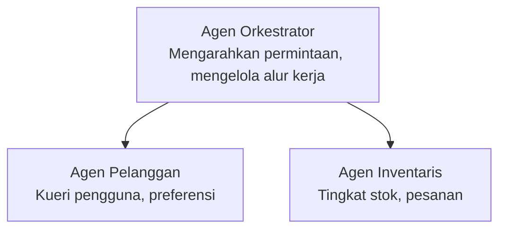

# Bab 5: Solusi AI Multi-Agen

**📚 Kursus**: [AZD Untuk Pemula](../../README.md) | **⏱️ Durasi**: 2-3 jam | **⭐ Kompleksitas**: Lanjutan

---

## Ikhtisar

Bab ini membahas pola arsitektur multi-agen lanjutan, orkestrasi agen, dan penyebaran AI siap produksi untuk skenario kompleks.

## Tujuan Pembelajaran

Dengan menyelesaikan bab ini, Anda akan:
- Memahami pola arsitektur multi-agen
- Menyebarkan sistem agen AI yang terkoordinasi
- Mengimplementasikan komunikasi antar-agen
- Membangun solusi multi-agen siap produksi

---

## 📚 Pelajaran

| # | Pelajaran | Deskripsi | Waktu |
|---|--------|-------------|------|
| 1 | [Solusi Retail Multi-Agen](../../examples/retail-scenario.md) | Panduan implementasi lengkap | 90 menit |
| 2 | [Coordination Patterns](../chapter-06-pre-deployment/coordination-patterns.md) | Strategi orkestrasi agen | 30 menit |
| 3 | [ARM Template Deployment](../../examples/retail-multiagent-arm-template/README.md) | Penerapan sekali klik | 30 menit |

---

## 🚀 Mulai Cepat

```bash
# Opsi 1: Terapkan dari templat
azd init --template agent-openai-python-prompty
azd up

# Opsi 2: Terapkan dari manifest agen (memerlukan ekstensi azure.ai.agents)
azd extension install azure.ai.agents
azd ai agent init -m agent-manifest.yaml
azd up
```

> **Pendekatan mana?** Gunakan `azd init --template` untuk memulai dari contoh yang berfungsi. Gunakan `azd ai agent init` ketika Anda memiliki manifest agen sendiri. Lihat [Referensi AZD AI CLI](../chapter-08-production/production-ai-practices.md#azd-ai-cli-commands-and-extensions) untuk rincian lengkap.

---

## 🤖 Arsitektur Multi-Agen


---

## 🎯 Solusi Unggulan: Retail Multi-Agen

The [Solusi Retail Multi-Agen](../../examples/retail-scenario.md) demonstrates:

- **Agen Pelanggan**: Menangani interaksi pengguna dan preferensi
- **Agen Inventaris**: Mengelola stok dan pemrosesan pesanan
- **Orkestrator**: Mengkoordinasikan antar agen
- **Memori Bersama**: Manajemen konteks lintas-agen

### Layanan yang Digunakan

| Service | Purpose |
|---------|---------|
| Microsoft Foundry Models | Pemahaman bahasa |
| Azure AI Search | Katalog produk |
| Cosmos DB | Status agen dan memori |
| Container Apps | Hosting agen |
| Application Insights | Pemantauan |

---

## 🔗 Navigasi

| Direction | Chapter |
|-----------|---------|
| **Sebelumnya** | [Bab 4: Infrastruktur](../chapter-04-infrastructure/README.md) |
| **Berikutnya** | [Bab 6: Pra-Penyebaran](../chapter-06-pre-deployment/README.md) |

---

## 📖 Sumber Daya Terkait

- [Panduan Agen AI](../chapter-02-ai-development/agents.md)
- [Praktik AI Produksi](../chapter-08-production/production-ai-practices.md)
- [Pemecahan Masalah AI](../chapter-07-troubleshooting/ai-troubleshooting.md)

---

<!-- CO-OP TRANSLATOR DISCLAIMER START -->
**Penafian**:
Dokumen ini telah diterjemahkan menggunakan layanan terjemahan AI [Co-op Translator](https://github.com/Azure/co-op-translator). Meskipun kami berupaya mencapai akurasi, harap diperhatikan bahwa terjemahan otomatis dapat mengandung kesalahan atau ketidakakuratan. Dokumen asli dalam bahasa aslinya harus dianggap sebagai sumber yang berwenang. Untuk informasi yang bersifat kritis, disarankan menggunakan terjemahan profesional oleh manusia. Kami tidak bertanggung jawab atas kesalahpahaman atau salah tafsir yang timbul dari penggunaan terjemahan ini.
<!-- CO-OP TRANSLATOR DISCLAIMER END -->