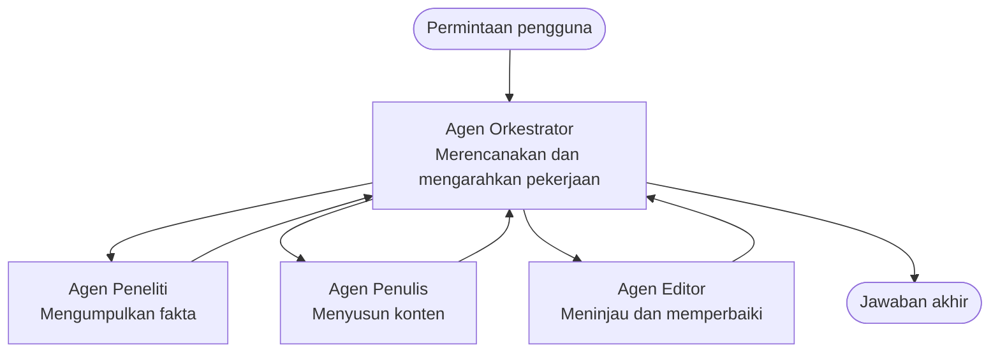

# Dasar-Dasar Multi-Agen - Deploy Sistem AI Terkoordinasi Pertamamu

**Navigasi Bab:**
- **📚 Beranda Kursus**: [AZD Untuk Pemula](../../README.md)
- **📖 Bab Saat Ini**: Bab 5 - Solusi AI Multi-Agen
- **⬅️ Sebelumnya**: [Bab 4: Infrastruktur](../chapter-04-infrastructure/README.md)
- **➡️ Selanjutnya**: [Pola Koordinasi](../chapter-06-pre-deployment/coordination-patterns.md)

> Divalidasi dengan `azd 1.27.1` pada Juli 2026.

## Pendahuluan

Pada bab-bab sebelumnya kamu telah melakukan deploy aplikasi tunggal—dan di Bab 2 kamu telah melakukan deploy satu agen AI. Pelajaran ini mengambil langkah berikutnya: melakukan deploy **sistem multi-agen**, di mana beberapa agen spesialis bekerja sama untuk memecahkan masalah yang tidak bisa ditangani dengan baik oleh satu agen sendiri.

Kabar baik untuk pemula: **kamu tidak memerlukan perintah baru.** Solusi multi-agen tetaplah proyek azd. Kamu akan melakukan `azd init`, `azd up`, menguji, dan `azd down`—persis seperti alur kerja yang sudah kamu kuasai. Yang berubah adalah *bentuk* aplikasi di dalamnya.

## Tujuan Pembelajaran

Pada akhir pelajaran ini, kamu akan:
- Memahami apa arti "multi-agen" dan kapan hal itu layak dengan kerumitan tambahan
- Mengenali peran umum dalam sistem multi-agen (orchestrator + spesialis)
- Melakukan deploy template multi-agen nyata yang berfungsi menggunakan `azd up`
- Memahami sumber daya Azure yang mendukung aplikasi multi-agen
- Mengetahui cara memverifikasi, menyesuaikan, dan membongkar solusi dengan aman

## Hasil Pembelajaran

Setelah menyelesaikan pelajaran ini, kamu akan dapat:
- Menjelaskan perbedaan antara agen tunggal dan sistem multi-agen
- Memilih antara agen tunggal dengan alat dan desain multi-agen sejati
- Melakukan deploy dan pengujian template multi-agen secara menyeluruh dengan azd
- Mengidentifikasi di mana masing-masing agen berjalan dan bagaimana mereka berkomunikasi
- Membersihkan semua sumber daya guna menghindari biaya berkelanjutan

---

## Apa Itu Sistem Multi-Agen?

Satu agen AI adalah satu model dengan seperangkat instruksi dan (opsional) beberapa alat. Itu bekerja baik untuk tugas fokus. Namun saat tugas tumbuh—penelitian, kemudian menulis, lalu pengeditan, dan kemudian pemeriksaan fakta—memadatkan semuanya dalam satu prompt membuat agen menjadi lebih lambat, kurang andal, dan sulit untuk di-debug.

Sistem **multi-agen** memecah pekerjaan menjadi spesialis yang masing-masing mengerjakan satu tugas dengan baik, yang dikoordinasikan oleh seorang orchestrator:



### Dua peran yang selalu kamu temui

| Peran | Tugas | Contoh |
|------|-------|--------|
| **Orchestrator** | Memutuskan *apa yang terjadi selanjutnya* dan mengarahkan pekerjaan antar agen | "Pertama riset, lalu tulis, kemudian sunting" |
| **Spesialis** | Mengerjakan satu pekerjaan fokus dan mengembalikan hasil | Seorang "peneliti" yang hanya mengumpulkan fakta |

### Apakah kamu benar-benar perlu banyak agen?

Mulai dari yang sederhana. Gunakan multi-agen **hanya** ketika salah satu dari ini benar:

- ✅ Tugas memiliki **tahapan berbeda** yang mendapat manfaat dari instruksi berbeda (riset vs menulis vs tinjau)
- ✅ Kamu ingin spesialis berjalan **secara paralel** untuk menghemat waktu
- ✅ Langkah berbeda memerlukan **alat atau sumber data berbeda**
- ✅ Kamu perlu setiap langkah **dapat diuji dan di-debug secara independen**

Jika tugasmu hanya tanya jawab tunggal atau panggilan alat sederhana, **agen tunggal dengan alat** (Bab 2) lebih sederhana, murah, dan mudah dijalankan.

> **Tips pemula:** "Lebih banyak agen" bukan berarti "lebih baik." Setiap agen menambah latensi, biaya, dan hal baru untuk dimonitor. Tambah agen hanya ketika masalah benar-benar terbagi menjadi beberapa bagian.

---

## Dua Cara Membangun Multi-Agen di Azure

| Pendekatan | Apa itu | Terbaik untuk |
|-----------|---------|-------------|
| **Agen tunggal + alat** | Satu agen Foundry yang memanggil fungsi/alat | Alur kerja sederhana, memulai |
| **Beberapa agen terkoordinasi** | Beberapa agen dengan seorang orchestrator | Tahapan berbeda, kerja paralel, spesialisasi |

Pelajaran ini fokus pada pendekatan kedua menggunakan **template siap pakai**, agar kamu bisa melihat sistem multi-agen nyata berjalan sebelum membuat sendiri.

---

## Praktik Langsung: Deploy Aplikasi Multi-Agen yang Berfungsi

Kita akan deploy **Contoso Creative Writer**, contoh resmi Azure yang menggunakan beberapa agen (peneliti, penulis, editor) yang dikoordinasikan untuk menghasilkan sebuah artikel. Ini adalah aplikasi multi-agen pertama yang bagus karena peran-perannya mudah dipahami.

### Langkah 1: Inisialisasi template

```bash
# Buat folder kerja
mkdir creative-writer && cd creative-writer

# Inisialisasi dari template multi-agen resmi
azd init --template contoso-creative-writer
```

> Jelajahi lebih banyak template multi-agen kapan saja di [Galeri Awesome AZD AI](https://azure.github.io/awesome-azd/?tags=ai). Pilihan ramah pemula lainnya termasuk `get-started-with-ai-agents` dan `azure-ai-travel-agents`.

### Langkah 2: Autentikasi

```bash
# Diperlukan untuk alur kerja azd
azd auth login
```

### Langkah 3: Buat environment

```bash
azd env new dev
```

### Langkah 4: Pratinjau, lalu deploy

```bash
# Lihat apa yang akan dibuat sebelum mengeluarkan biaya apa pun (direkomendasikan)
azd provision --preview

# Sediakan infrastruktur dan sebar semua agen dalam satu langkah
azd up
```

`azd up` akan meminta langganan dan wilayah, lalu menyediakan sumber daya Azure dan melakukan deploy aplikasi. Deploy AI dapat memakan waktu lebih lama dibanding aplikasi web sederhana—jika kamu melakukan deploy model yang lebih besar, kamu bisa memperpanjang batas waktu deploy:

```bash
azd deploy --timeout 1800
```

> **Perhatian biaya dan kapasitas:** Aplikasi multi-agen mendeploy model AI yang menggunakan kuota dan menimbulkan biaya. Jika `azd up` gagal karena kuota model, lihat [Pemecahan Masalah AI](../chapter-07-troubleshooting/ai-troubleshooting.md) untuk perbaikan wilayah dan kuota, serta Bab 6 [Perencanaan Kapasitas](../chapter-06-pre-deployment/capacity-planning.md).

---

## Memahami Apa yang Kamu Deploy

Aplikasi multi-agen tipikal seperti ini menyediakan satu set sumber daya Azure yang sesuai dengan tanggung jawab pada diagram di atas:

| Sumber Daya | Alasannya ada |
|------------|---------------|
| **Microsoft Foundry / Models** | Menyimpan model bahasa yang digunakan masing-masing agen |
| **Azure AI Search** | Memberi data berdasarkan tanah untuk pencarian pada agen peneliti |
| **Container Apps** (atau App Service) | Menyimpan kode orchestrator dan agen |
| **Cosmos DB** (di beberapa contoh) | Menyimpan status/memori bersama yang diteruskan antar agen |
| **Application Insights** | Melacak permintaan *melintasi* agen agar kamu bisa debug alur kerja |

### Bagaimana agen saling berkomunikasi

Di kebanyakan contoh azd multi-agen, **orchestrator berjalan dalam kode aplikasi kamu** (misalnya menggunakan kerangka kerja seperti Semantic Kernel atau Microsoft Agent Framework). Orchestrator memanggil masing-masing agen spesialis secara bergantian, meneruskan hasilnya, dan merakit jawaban akhir. Para agen berbagi konteks melalui:

- **Panggilan fungsi/alat** — orchestrator memanggil spesialis dan menerima hasil kembali
- **Memori bersama** — basis data (sering Cosmos DB) menyimpan status yang dapat dibaca oleh kedua agen
- **Pesan/event** — agar longgar terhubung, agen saling berkomunikasi lewat antrean atau Service Bus

> **Mengapa ini penting untuk debugging:** karena tiap langkah terpisah, Application Insights memperlihatkan *agen mana* yang lambat atau gagal. Itu adalah alasan utama membagi kerja ke beberapa agen sejak awal.

---

## Verifikasi Deploy

Pastikan sistem benar-benar bekerja sebelum lanjut:

```bash
# Tampilkan titik akhir yang telah diterapkan
azd show

# Buka dasbor pemantauan aplikasi
azd monitor

# Ikuti log jika ada sesuatu yang terlihat tidak beres
azd monitor --logs
```

Kemudian buka URL aplikasi dari `azd show` dan coba permintaan yang melibatkan semua agen (untuk Creative Writer, minta ia menulis artikel pendek dengan topik tertentu). Dalam **pencarian transaksi** Application Insights, kamu harus melihat permintaan menyebar ke langkah peneliti, penulis, dan editor.

**Kriteria keberhasilan:**
- ✅ `azd show` menampilkan endpoint yang dapat dijangkau
- ✅ Permintaan menghasilkan hasil yang jelas melewati beberapa tahapan
- ✅ Application Insights menunjukkan jejak untuk lebih dari satu langkah agen

---

## Sesuaikan: Tambah atau Atur Agen

Karena setiap agen hanyalah instruksi dan alat, kostumisasi dapat dilakukan dengan mudah:

1. **Temukan definisi agen** di template (biasanya dalam folder `prompts/`, `agents/`, atau kumpulan file `*.prompty`).
2. **Atur instruksi agen** — misalnya, beri tahu agen editor untuk menerapkan nada atau jumlah kata tertentu.
3. **Deploy ulang hanya kode** (infrastruktur tidak berubah):

   ```bash
   azd deploy
   ```

Untuk langkah lebih lanjut dan membangun agen dari *manifes milikmu sendiri*, gunakan ekstensi agen dan siklus hidupnya sepenuhnya:

```bash
azd extension install azure.ai.agents
azd ai agent init -m agent-manifest.yaml
azd up
azd ai agent invoke      # uji, dengan waktu respons
```

Lihat [Bab 2: Agen](../chapter-02-ai-development/agents.md) dan [referensi AZD AI CLI](../chapter-08-production/production-ai-practices.md#azd-ai-cli-commands-and-extensions) untuk siklus hidup agen lengkap (`invoke`, `eval generate`, `optimize`, `delete`).

---

## Bersihkan

Aplikasi multi-agen menjalankan beberapa layanan yang dapat ditagih. Bongkar semuanya saat sudah selesai:

```bash
azd down --force --purge
```

Flag `--purge` juga menghapus sumber daya AI yang dihapus lembut (seperti akun Foundry/Azure AI Services) agar tidak menghalangi deploy ulang atau terus menimbulkan biaya.

---

## Catatan Tentang Sistem Multi-Agen Produksi

[Solusi Multi-Agen Retail](../../examples/retail-scenario.md) dalam repo ini adalah **cetakan arsitektur**, bukan template satu perintah—itu mendokumentasikan bagaimana sistem retail produksi *akan* dibangun (dan secara eksplisit menyatakan bahwa pembangunan lengkap adalah usaha besar). Gunakan sebagai referensi desain *setelah* kamu melakukan deploy contoh yang berfungsi di sini. Untuk kekhawatiran produksi (ketahanan, biaya, monitoring, tata kelola), lanjutkan ke [Bab 8: Praktik AI Produksi](../chapter-08-production/production-ai-practices.md).

---

## Ringkasan

- Sistem multi-agen memecah pekerjaan ke beberapa spesialis yang dikoordinasikan oleh orchestrator.
- Gunakan hanya saat tugas memiliki tahapan berbeda, paralelisme, atau alat berbeda per langkah—kalau tidak, pilih agen tunggal.
- Alur kerja azd tetap sama: `azd init` → `azd up` → uji → `azd down`.
- Template nyata seperti `contoso-creative-writer` memungkinkan kamu melihat dan menyesuaikan aplikasi multi-agen yang berfungsi hari ini.
- Pelacakan Application Insights lintas agen adalah salah satu manfaat praktis terbesar dari desain multi-agen.

---

## 🔗 Navigasi

| Arah | Pelajaran |
|-------|----------|
| **Sebelumnya** | [Bab 4: Infrastruktur](../chapter-04-infrastructure/README.md) |
| **Selanjutnya** | [Pola Koordinasi](../chapter-06-pre-deployment/coordination-patterns.md) |

## 📖 Sumber Daya Terkait

- [Panduan Agen AI](../chapter-02-ai-development/agents.md)
- [Pola Koordinasi](../chapter-06-pre-deployment/coordination-patterns.md)
- [Praktik AI Produksi](../chapter-08-production/production-ai-practices.md)
- [Pemecahan Masalah AI](../chapter-07-troubleshooting/ai-troubleshooting.md)

---

<!-- CO-OP TRANSLATOR DISCLAIMER START -->
**Penafian**:
Dokumen ini telah diterjemahkan menggunakan layanan terjemahan AI [Co-op Translator](https://github.com/Azure/co-op-translator). Meskipun kami berupaya untuk mencapai akurasi, harap diketahui bahwa terjemahan otomatis mungkin mengandung kesalahan atau ketidakakuratan. Dokumen asli dalam bahasa aslinya harus dianggap sebagai sumber yang sah. Untuk informasi penting, disarankan menggunakan terjemahan profesional oleh manusia. Kami tidak bertanggung jawab atas kesalahpahaman atau penafsiran yang keliru yang timbul dari penggunaan terjemahan ini.
<!-- CO-OP TRANSLATOR DISCLAIMER END -->