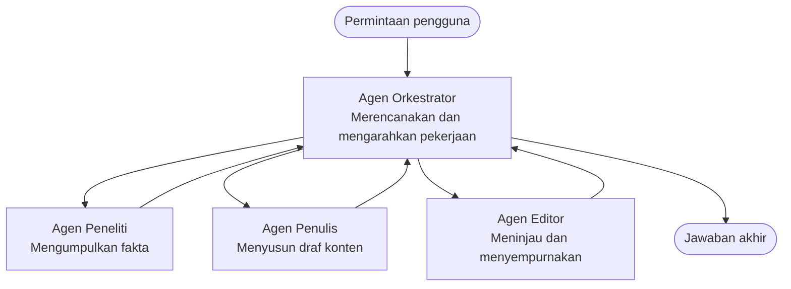

# Dasar Multi-Agen - Terapkan Sistem AI Terkoordinasi Pertama Anda

**Chapter Navigation:**
- **📚 Beranda Kursus**: [AZD Untuk Pemula](../../README.md)
- **📖 Bab Saat Ini**: Bab 5 - Solusi AI Multi-Agen
- **⬅️ Sebelumnya**: [Bab 4: Infrastruktur](../chapter-04-infrastructure/README.md)
- **➡️ Berikutnya**: [Pola Koordinasi](../chapter-06-pre-deployment/coordination-patterns.md)

> Diverifikasi terhadap `azd 1.25.6` pada Juni 2026.

## Pendahuluan

Dalam bab-bab sebelumnya Anda menerapkan sebuah aplikasi tunggal—dan di Bab 2 Anda menerapkan satu agen AI. Pelajaran ini mengambil langkah berikutnya: menerapkan sebuah **sistem multi-agen**, di mana beberapa agen spesialis bekerja bersama untuk menyelesaikan masalah yang tidak bisa ditangani dengan baik oleh satu agen saja.

Kabar baik untuk pemula: **Anda tidak memerlukan perintah baru.** Solusi multi-agen tetap merupakan proyek azd. Anda akan `azd init`, `azd up`, menguji, dan `azd down`—persis alur kerja yang sudah Anda kenal. Yang berubah adalah *bentuk* aplikasi di dalamnya.

## Tujuan Pembelajaran

Di akhir pelajaran ini, Anda akan:
- Memahami apa arti "multi-agen" dan kapan kompleksitas tambahan itu layak
- Mengenali peran umum dalam sistem multi-agen (orkestrator + spesialis)
- Menerapkan templat multi-agen nyata yang berfungsi dengan `azd up`
- Memahami sumber daya Azure yang mendukung aplikasi multi-agen
- Mengetahui cara memverifikasi, menyesuaikan, dan membersihkan solusi dengan aman

## Hasil Pembelajaran

Setelah menyelesaikan pelajaran ini, Anda akan mampu:
- Menjelaskan perbedaan antara agen tunggal dan sistem multi-agen
- Memilih antara agen tunggal dengan alat dan desain multi-agen sejati
- Menerapkan dan menguji templat multi-agen dari ujung ke ujung dengan azd
- Mengidentifikasi di mana setiap agen berjalan dan bagaimana mereka berkomunikasi
- Membersihkan semua sumber daya untuk menghindari biaya berkelanjutan

---

## Apa itu Sistem Multi-Agen?

Satu agen AI adalah satu model dengan seperangkat instruksi dan (opsional) beberapa alat. Itu bekerja baik untuk tugas yang terfokus. Tetapi saat tugas berkembang—penelitian, lalu penulisan, lalu pengeditan, lalu pemeriksaan fakta—memasukkan semuanya ke dalam satu prompt membuat agen menjadi lebih lambat, kurang andal, dan lebih sulit untuk di-debug.

Sebuah **sistem multi-agen** memecah pekerjaan menjadi spesialis yang masing-masing melakukan satu pekerjaan dengan baik, yang dikoordinasikan oleh seorang orkestrator:



### Dua peran yang akan selalu Anda lihat

| Peran | Tugas | Contoh |
|------|-----|---------|
| **Orkestrator** | Memutuskan *apa yang terjadi selanjutnya* dan mengarahkan pekerjaan antar agen | "Pertama penelitian, lalu menulis, lalu mengedit" |
| **Spesialis** | Melakukan satu pekerjaan terfokus dan mengembalikan hasil | Seorang "peneliti" yang hanya mengumpulkan fakta |

### Apakah Anda benar-benar membutuhkan beberapa agen?

Mulailah sederhana. Gunakan multi-agen **hanya** ketika salah satu dari kondisi berikut benar:

- ✅ Tugas memiliki **tahapan yang berbeda** yang mendapat manfaat dari instruksi yang berbeda (penelitian vs. menulis vs. peninjauan)
- ✅ Anda ingin spesialis dijalankan **secara paralel** untuk menghemat waktu
- ✅ Langkah-langkah berbeda membutuhkan **alat atau sumber data yang berbeda**
- ✅ Anda perlu setiap langkah **dapat diuji dan di-debug secara independen**

Jika tugas Anda hanyalah sebuah tanya-jawab tunggal atau panggilan alat sederhana, **agen tunggal dengan alat** (Bab 2) lebih sederhana, lebih murah, dan lebih mudah dioperasikan.

> **Tips untuk pemula:** "Lebih banyak agen" bukan berarti "lebih baik." Setiap agen menambah latensi, biaya, dan hal baru yang harus dipantau. Tambah agen hanya ketika masalah jelas terbagi menjadi bagian-bagian.

---

## Dua Cara Membangun Multi-Agen di Azure

| Approach | What it is | Best for |
|----------|-----------|----------|
| **Agen tunggal + alat** | Satu agen Foundry yang memanggil fungsi/alat | Alur kerja sederhana, memulai |
| **Beberapa agen terkoordinasi** | Beberapa agen dengan seorang orkestrator | Tahapan berbeda, pekerjaan paralel, spesialisasi |

Pelajaran ini berfokus pada pendekatan kedua menggunakan sebuah **templat siap pakai**, sehingga Anda dapat melihat sistem multi-agen nyata berjalan sebelum membangun sendiri.

---

## Praktik: Terapkan Aplikasi Multi-Agen yang Berfungsi

Kita akan menerapkan **Contoso Creative Writer**, sampel resmi Azure yang menggunakan beberapa agen (peneliti, penulis, editor) yang dikoordinasikan untuk menghasilkan sebuah artikel. Ini adalah aplikasi multi-agen pertama yang bagus karena perannya mudah dipahami.

### Langkah 1: Inisialisasi template

```bash
# Buat folder kerja
mkdir creative-writer && cd creative-writer

# Inisialisasi dari template multi-agen resmi
azd init --template contoso-creative-writer
```

> Telusuri lebih banyak template multi-agen kapan saja di [Awesome AZD AI gallery](https://azure.github.io/awesome-azd/?tags=ai). Opsi ramah-pemula lain termasuk `get-started-with-ai-agents` dan `azure-ai-travel-agents`.

### Langkah 2: Otentikasi

```bash
# Diperlukan untuk alur kerja azd
azd auth login
```

### Langkah 3: Buat lingkungan

```bash
azd env new dev
```

### Langkah 4: Pratinjau, lalu terapkan

```bash
# Lihat apa yang akan dibuat sebelum mengeluarkan uang apa pun (disarankan)
azd provision --preview

# Menyediakan infrastruktur dan menerapkan semua agen dalam satu langkah
azd up
```

`azd up` akan meminta langganan dan region, lalu menyediakan sumber daya Azure dan menerapkan aplikasi. Penerapan AI dapat memakan waktu lebih lama daripada aplikasi web sederhana—jika Anda menerapkan model yang lebih besar, Anda dapat memperpanjang batas waktu penerapan:

```bash
azd deploy --timeout 1800
```

> **Catatan soal biaya dan kapasitas:** Aplikasi multi-agen menerapkan model AI yang mengonsumsi kuota dan menimbulkan biaya. Jika `azd up` gagal karena kuota model, lihat [AI Troubleshooting](../chapter-07-troubleshooting/ai-troubleshooting.md) untuk perbaikan region dan kuota, dan Bab 6 [Capacity Planning](../chapter-06-pre-deployment/capacity-planning.md).

---

## Memahami Apa yang Anda Terapkan

Aplikasi multi-agen tipikal seperti ini menyediakan seperangkat sumber daya Azure yang memetakan langsung ke tanggung jawab pada diagram di atas:

| Sumber daya | Mengapa ada |
|----------|----------------|
| **Microsoft Foundry / Models** | Menyediakan host model bahasa yang digunakan setiap agen |
| **Azure AI Search** | Memberi agen peneliti data yang dapat dicari |
| **Container Apps** (atau App Service) | Menjalankan orkestrator dan kode agen |
| **Cosmos DB** (di beberapa contoh) | Menyimpan state/memory bersama yang dilewatkan antar agen |
| **Application Insights** | Menelusuri permintaan *lintas* agen sehingga Anda dapat debug alurnya |

### Bagaimana agen-agen saling berkomunikasi

Di sebagian besar sampel multi-agen azd, **orkestrator berjalan di kode aplikasi Anda** (misalnya, menggunakan kerangka kerja seperti Semantic Kernel atau Microsoft Agent Framework). Orkestrator memanggil setiap agen spesialis secara berurutan, meneruskan hasilnya, dan merangkai jawaban akhir. Agen-agen berbagi konteks melalui:

- **Panggilan fungsi/alat** — orkestrator memanggil seorang spesialis dan mendapatkan hasil kembali
- **Memori bersama** — sebuah basis data (sering Cosmos DB) menyimpan state yang dapat dibaca kedua agen
- **Pesan/event** — untuk kopling yang lebih longgar, agen berkomunikasi melalui antrian atau Service Bus

> **Mengapa ini penting untuk debugging:** karena setiap langkah terpisah, Application Insights menunjukkan *agen mana* yang lambat atau gagal. Itu adalah alasan utama untuk memecah pekerjaan ke beberapa agen.

---

## Verifikasi Penerapan

Pastikan sistem benar-benar bekerja sebelum melanjutkan:

```bash
# Tampilkan endpoint yang telah diterapkan
azd show

# Buka dasbor pemantauan aplikasi
azd monitor

# Ikuti log jika sesuatu terlihat tidak beres
azd monitor --logs
```

Lalu buka URL aplikasi dari `azd show` dan coba permintaan yang melibatkan semua agen (untuk Creative Writer, minta menulis artikel singkat tentang suatu topik). Di pencarian transaksi Application Insights, Anda harus melihat permintaan yang menyebar ke langkah peneliti, penulis, dan editor.

**Kriteria keberhasilan:**
- ✅ `azd show` menampilkan endpoint yang dapat dijangkau
- ✅ Sebuah permintaan menghasilkan hasil yang jelas melalui beberapa tahapan
- ✅ Application Insights menunjukkan jejak untuk lebih dari satu langkah agen

---

## Sesuaikan: Tambah atau Sesuaikan Agen

Karena setiap agen hanyalah instruksi ditambah alat, penyesuaian bisa dilakukan dengan mudah:

1. **Temukan definisi agen** dalam template (seringkali folder `prompts/`, `agents/`, atau sekumpulan `*.prompty`).
2. **Tuning instruksi agen** — misalnya, beri tahu agen editor untuk menegakkan nada atau jumlah kata tertentu.
3. **Redeploy hanya kode** (infrastruktur tidak berubah):

   ```bash
   azd deploy
   ```

Untuk melangkah lebih jauh dan membangun agen dari manifesto *Anda sendiri*, gunakan ekstensi agen dan siklus hidup penuhnya:

```bash
azd extension install azure.ai.agents
azd ai agent init -m agent-manifest.yaml
azd up
azd ai agent invoke      # tes, dengan waktu respons
```

Lihat [Bab 2: Agen](../chapter-02-ai-development/agents.md) dan [AZD AI CLI reference](../chapter-08-production/production-ai-practices.md#azd-ai-cli-commands-and-extensions) untuk siklus hidup agen lengkap (`invoke`, `eval generate`, `optimize`, `delete`).

---

## Bersihkan

Aplikasi multi-agen menjalankan beberapa layanan yang dapat ditagih. Hancurkan semuanya saat Anda selesai:

```bash
azd down --force --purge
```

Flag `--purge` juga menghapus sumber daya AI yang di-soft-delete (seperti akun Foundry/Azure AI Services) sehingga mereka tidak menghalangi redeploy di masa mendatang atau terus menimbulkan biaya.

---

## Catatan tentang Sistem Multi-Agen Produksi

[Solusi Multi-Agen Ritel](../../examples/retail-scenario.md) di repo ini adalah sebuah **cetak biru arsitektur**, bukan templat satu-klik—ia mendokumentasikan bagaimana sistem ritel produksi *akan* dibangun (dan secara eksplisit menyatakan bahwa pembangunan penuh adalah usaha yang substansial). Gunakan itu sebagai referensi desain *setelah* Anda menerapkan sampel yang berfungsi di sini. Untuk perhatian produksi (ketahanan, biaya, pemantauan, tata kelola), lanjutkan ke [Bab 8: Praktik AI Produksi](../chapter-08-production/production-ai-practices.md).

---

## Ringkasan

- Sistem multi-agen memecah pekerjaan ke spesialis yang dikoordinasikan oleh seorang orkestrator.
- Gunakan hanya ketika tugas memiliki tahapan berbeda, kebutuhan paralelisme, atau alat berbeda per langkah—jika tidak, lebih baik agen tunggal.
- Alur kerja azd tidak berubah: `azd init` → `azd up` → uji → `azd down`.
- Templat nyata seperti `contoso-creative-writer` memungkinkan Anda melihat dan menyesuaikan aplikasi multi-agen yang berfungsi hari ini.
- Jejak Application Insights lintas agen adalah salah satu manfaat praktis terbesar dari desain multi-agen.

---

## 🔗 Navigation

| Direction | Lesson |
|-----------|--------|
| **Previous** | [Bab 4: Infrastruktur](../chapter-04-infrastructure/README.md) |
| **Next** | [Pola Koordinasi](../chapter-06-pre-deployment/coordination-patterns.md) |

## 📖 Sumber Daya Terkait

- [Panduan Agen AI](../chapter-02-ai-development/agents.md)
- [Pola Koordinasi](../chapter-06-pre-deployment/coordination-patterns.md)
- [Praktik AI Produksi](../chapter-08-production/production-ai-practices.md)
- [Pemecahan Masalah AI](../chapter-07-troubleshooting/ai-troubleshooting.md)

---

<!-- CO-OP TRANSLATOR DISCLAIMER START -->
**Penafian**:
Dokumen ini telah diterjemahkan menggunakan layanan terjemahan AI [Co-op Translator](https://github.com/Azure/co-op-translator). Meskipun kami berupaya untuk mencapai akurasi, harap diketahui bahwa terjemahan otomatis mungkin mengandung kesalahan atau ketidakakuratan. Dokumen asli dalam bahasa aslinya harus dianggap sebagai sumber yang sah. Untuk informasi penting, disarankan menggunakan terjemahan profesional oleh manusia. Kami tidak bertanggung jawab atas kesalahpahaman atau penafsiran yang keliru yang timbul dari penggunaan terjemahan ini.
<!-- CO-OP TRANSLATOR DISCLAIMER END -->