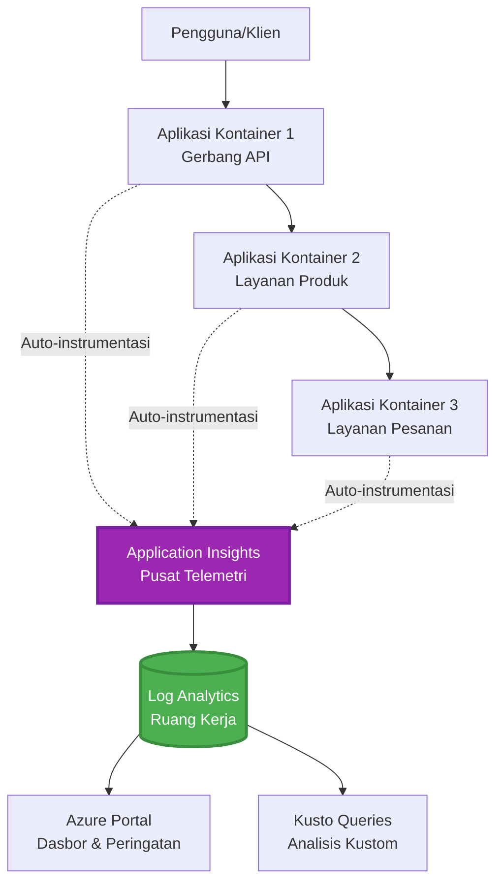
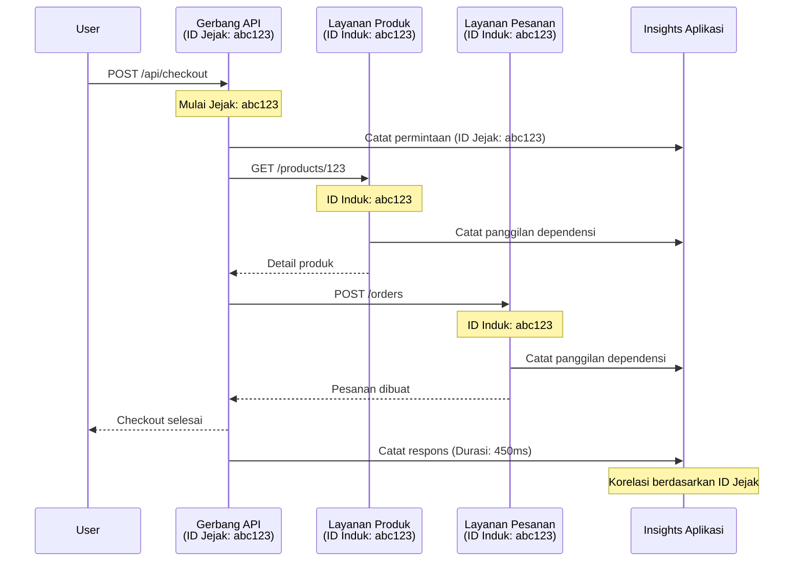

# Integrasi Application Insights dengan AZD

⏱️ **Perkiraan Waktu**: 40-50 menit | 💰 **Dampak Biaya**: ~$5-15/bulan | ⭐ **Kompleksitas**: Menengah

**📚 Jalur Pembelajaran:**
- ← Sebelumnya: [Pemeriksaan Awal](preflight-checks.md) - Validasi sebelum penyebaran
- 🎯 **Anda di Sini**: Integrasi Application Insights (Pemantauan, telemetri, debugging)
- → Berikutnya: [Panduan Penyebaran](../chapter-04-infrastructure/deployment-guide.md) - Menyebarkan ke Azure
- 🏠 [Beranda Kursus](../../README.md)

---

## Apa yang Akan Anda Pelajari

Dengan menyelesaikan pelajaran ini, Anda akan:
- Mengintegrasikan **Application Insights** ke proyek AZD secara otomatis
- Mengonfigurasi **pelacakan terdistribusi** untuk microservices
- Mengimplementasikan **telemetri kustom** (metrik, peristiwa, dependensi)
- Menyiapkan **metrik langsung** untuk pemantauan real-time
- Membuat **peringatan dan dasbor** dari penyebaran AZD
- Men-debug masalah produksi dengan **kueri telemetri**
- Mengoptimalkan **biaya dan strategi sampling**
- Memantau **aplikasi AI/LLM** (token, latensi, biaya)

## Mengapa Application Insights dengan AZD Penting

### Tantangan: Observabilitas Produksi

**Tanpa Application Insights:**
```
❌ No visibility into production behavior
❌ Manual log aggregation across services
❌ Reactive debugging (wait for customer complaints)
❌ No performance metrics
❌ Cannot trace requests across services
❌ Unknown failure rates and bottlenecks
```

**Dengan Application Insights + AZD:**
```
✅ Automatic telemetry collection
✅ Centralized logs from all services
✅ Proactive issue detection
✅ End-to-end request tracing
✅ Performance metrics and insights
✅ Real-time dashboards
✅ AZD provisions everything automatically
```

**Analogi**: Application Insights seperti memiliki perekam penerbangan "black box" + dasbor kokpit untuk aplikasi Anda. Anda melihat segala sesuatu yang terjadi secara real-time dan dapat memutar ulang setiap insiden.

---

## Ikhtisar Arsitektur

### Application Insights dalam Arsitektur AZD


### Apa yang Dipantau Secara Otomatis

| Jenis Telemetri | Apa yang Ditangkap | Kasus Penggunaan |
|----------------|------------------|----------|
| **Permintaan** | Permintaan HTTP, kode status, durasi | Pemantauan kinerja API |
| **Dependensi** | Panggilan eksternal (DB, API, penyimpanan) | Mengidentifikasi hambatan |
| **Pengecualian** | Kesalahan tidak tertangani dengan stack trace | Mendiagnosis kegagalan |
| **Peristiwa Kustom** | Peristiwa bisnis (pendaftaran, pembelian) | Analitik dan funnel |
| **Metrik** | Penghitung kinerja, metrik kustom | Perencanaan kapasitas |
| **Jejak** | Pesan log dengan tingkat keparahan | Debugging dan audit |
| **Ketersediaan** | Uptime dan pengujian waktu respons | Pemantauan SLA |

---

## Prasyarat

### Alat yang Diperlukan

```bash
# Verifikasi Azure Developer CLI
azd version
# ✅ Diharapkan: azd versi 1.0.0 atau lebih tinggi

# Verifikasi Azure CLI
az --version
# ✅ Diharapkan: azure-cli 2.50.0 atau lebih tinggi
```

### Persyaratan Azure

- Langganan Azure aktif
- Izin untuk membuat:
  - Sumber daya Application Insights
  - Ruang kerja Log Analytics
  - Container Apps
  - Grup sumber daya

### Prasyarat Pengetahuan

Anda sebaiknya telah menyelesaikan:
- [Dasar-dasar AZD](../chapter-01-foundation/azd-basics.md) - Konsep inti AZD
- [Konfigurasi](../chapter-03-configuration/configuration.md) - Pengaturan lingkungan
- [Proyek Pertama](../chapter-01-foundation/first-project.md) - Penyebaran dasar

---

## Pelajaran 1: Application Insights Otomatis dengan AZD

### Bagaimana AZD Menyediakan Application Insights

AZD secara otomatis membuat dan mengonfigurasi Application Insights saat Anda menyebarkan. Mari kita lihat bagaimana cara kerjanya.

### Struktur Proyek

```
monitored-app/
├── azure.yaml                     # AZD configuration
├── infra/
│   ├── main.bicep                # Main infrastructure
│   ├── core/
│   │   └── monitoring.bicep      # Application Insights + Log Analytics
│   └── app/
│       └── api.bicep             # Container App with monitoring
└── src/
    ├── app.py                    # Application with telemetry
    ├── requirements.txt
    └── Dockerfile
```

---

### Langkah 1: Konfigurasi AZD (azure.yaml)

**Berkas: `azure.yaml`**

```yaml
name: monitored-app
metadata:
  template: monitored-app@1.0.0

services:
  api:
    project: ./src
    language: python
    host: containerapp

# AZD automatically provisions monitoring!
```

**Itu saja!** AZD akan membuat Application Insights secara default. Tidak perlu konfigurasi tambahan untuk pemantauan dasar.

---

### Langkah 2: Infrastruktur Pemantauan (Bicep)

**Berkas: `infra/core/monitoring.bicep`**

```bicep
param logAnalyticsName string
param applicationInsightsName string
param location string = resourceGroup().location
param tags object = {}

// Log Analytics Workspace (required for Application Insights)
resource logAnalytics 'Microsoft.OperationalInsights/workspaces@2022-10-01' = {
  name: logAnalyticsName
  location: location
  tags: tags
  properties: {
    sku: {
      name: 'PerGB2018'  // Pay-as-you-go pricing
    }
    retentionInDays: 30  // Keep logs for 30 days
    features: {
      enableLogAccessUsingOnlyResourcePermissions: true
    }
  }
}

// Application Insights
resource applicationInsights 'Microsoft.Insights/components@2020-02-02' = {
  name: applicationInsightsName
  location: location
  tags: tags
  kind: 'web'
  properties: {
    Application_Type: 'web'
    WorkspaceResourceId: logAnalytics.id
    IngestionMode: 'LogAnalytics'
    publicNetworkAccessForIngestion: 'Enabled'
    publicNetworkAccessForQuery: 'Enabled'
  }
}

// Outputs for Container Apps
output logAnalyticsWorkspaceId string = logAnalytics.id
output logAnalyticsWorkspaceName string = logAnalytics.name
output applicationInsightsConnectionString string = applicationInsights.properties.ConnectionString
output applicationInsightsInstrumentationKey string = applicationInsights.properties.InstrumentationKey
output applicationInsightsName string = applicationInsights.name
```

---

### Langkah 3: Menghubungkan Container App ke Application Insights

**Berkas: `infra/app/api.bicep`**

```bicep
param name string
param location string
param tags object = {}
param containerAppsEnvironmentName string
param applicationInsightsConnectionString string

resource containerApp 'Microsoft.App/containerApps@2023-05-01' = {
  name: name
  location: location
  tags: tags
  properties: {
    configuration: {
      ingress: {
        external: true
        targetPort: 8000
      }
      secrets: [
        {
          name: 'appinsights-connection-string'
          value: applicationInsightsConnectionString
        }
      ]
    }
    template: {
      containers: [
        {
          name: 'api'
          image: 'myregistry.azurecr.io/api:latest'
          resources: {
            cpu: json('0.5')
            memory: '1Gi'
          }
          env: [
            {
              name: 'APPLICATIONINSIGHTS_CONNECTION_STRING'
              secretRef: 'appinsights-connection-string'
            }
            {
              name: 'APPLICATIONINSIGHTS_ENABLED'
              value: 'true'
            }
          ]
        }
      ]
    }
  }
}

output uri string = 'https://${containerApp.properties.configuration.ingress.fqdn}'
```

---

### Langkah 4: Kode Aplikasi dengan Telemetri

**Berkas: `src/app.py`**

```python
from flask import Flask, request, jsonify
from opencensus.ext.azure.log_exporter import AzureLogHandler
from opencensus.ext.azure.trace_exporter import AzureExporter
from opencensus.ext.flask.flask_middleware import FlaskMiddleware
from opencensus.trace.samplers import ProbabilitySampler
import logging
import os

app = Flask(__name__)

# Dapatkan string koneksi Application Insights
connection_string = os.environ.get('APPLICATIONINSIGHTS_CONNECTION_STRING')

if connection_string:
    # Konfigurasikan pelacakan terdistribusi
    middleware = FlaskMiddleware(
        app,
        exporter=AzureExporter(connection_string=connection_string),
        sampler=ProbabilitySampler(rate=1.0)  # Sampling 100% untuk pengembangan
    )
    
    # Konfigurasikan pencatatan
    logger = logging.getLogger(__name__)
    logger.addHandler(AzureLogHandler(connection_string=connection_string))
    logger.setLevel(logging.INFO)
    
    print("✅ Application Insights enabled")
else:
    logger = logging.getLogger(__name__)
    logger.setLevel(logging.INFO)
    print("⚠️ Application Insights not configured")

@app.route('/health')
def health():
    logger.info('Health check endpoint called')
    return jsonify({'status': 'healthy', 'monitoring': 'enabled'})

@app.route('/api/products')
def get_products():
    logger.info('Fetching products')
    
    # Simulasikan panggilan basis data (secara otomatis dilacak sebagai ketergantungan)
    products = [
        {'id': 1, 'name': 'Laptop', 'price': 999.99},
        {'id': 2, 'name': 'Mouse', 'price': 29.99},
        {'id': 3, 'name': 'Keyboard', 'price': 79.99}
    ]
    
    logger.info(f'Returned {len(products)} products')
    return jsonify(products)

@app.route('/api/error-test')
def error_test():
    """Test error tracking"""
    logger.error('Testing error tracking')
    try:
        raise ValueError('This is a test exception')
    except Exception as e:
        logger.exception('Exception occurred in error-test endpoint')
        return jsonify({'error': str(e)}), 500

@app.route('/api/slow')
def slow_endpoint():
    """Test performance tracking"""
    import time
    logger.info('Slow endpoint called')
    time.sleep(3)  # Simulasikan operasi lambat
    logger.warning('Endpoint took 3 seconds to respond')
    return jsonify({'message': 'Slow operation completed'})

if __name__ == '__main__':
    app.run(host='0.0.0.0', port=8000)
```

**Berkas: `src/requirements.txt`**

```txt
Flask==3.0.0
opencensus-ext-azure==1.1.13
opencensus-ext-flask==0.8.1
gunicorn==21.2.0
```

---

### Langkah 5: Deploy dan Verifikasi

```bash
# Inisialisasi AZD
azd init

# Terapkan (menyediakan Application Insights secara otomatis)
azd up

# Dapatkan URL aplikasi
APP_URL=$(azd env get-values | grep API_URL | cut -d '=' -f2 | tr -d '"')

# Hasilkan telemetri
curl $APP_URL/health
curl $APP_URL/api/products
curl $APP_URL/api/error-test
curl $APP_URL/api/slow
```

**✅ Output yang diharapkan:**
```json
{
  "status": "healthy",
  "monitoring": "enabled"
}
```

---

### Langkah 6: Lihat Telemetri di Azure Portal

```bash
# Dapatkan detail Application Insights
azd env get-values | grep APPLICATIONINSIGHTS

# Buka di Portal Azure
az monitor app-insights component show \
  --app $(azd env get-values | grep APPLICATIONINSIGHTS_NAME | cut -d '=' -f2 | tr -d '"') \
  --resource-group $(azd env get-values | grep AZURE_RESOURCE_GROUP | cut -d '=' -f2 | tr -d '"') \
  --query "appId" -o tsv
```

**Navigasikan ke Azure Portal → Application Insights → Pencarian Transaksi**

Anda akan melihat:
- ✅ Permintaan HTTP dengan kode status
- ✅ Durasi permintaan (3+ detik untuk `/api/slow`)
- ✅ Rincian pengecualian dari `/api/error-test`
- ✅ Pesan log kustom

---

## Pelajaran 2: Telemetri dan Peristiwa Kustom

### Melacak Peristiwa Bisnis

Mari tambahkan telemetri kustom untuk peristiwa penting bisnis.

**Berkas: `src/telemetry.py`**

```python
from opencensus.ext.azure import metrics_exporter
from opencensus.stats import aggregation as aggregation_module
from opencensus.stats import measure as measure_module
from opencensus.stats import stats as stats_module
from opencensus.stats import view as view_module
from opencensus.tags import tag_map as tag_map_module
from opencensus.ext.azure.log_exporter import AzureLogHandler
from opencensus.ext.azure.trace_exporter import AzureExporter
from opencensus.trace import tracer as tracer_module
import logging
import os

class TelemetryClient:
    """Custom telemetry client for Application Insights"""
    
    def __init__(self, connection_string=None):
        self.connection_string = connection_string or os.environ.get('APPLICATIONINSIGHTS_CONNECTION_STRING')
        
        if not self.connection_string:
            print("⚠️ Application Insights connection string not found")
            return
        
        # Siapkan logger
        self.logger = logging.getLogger(__name__)
        self.logger.addHandler(AzureLogHandler(connection_string=self.connection_string))
        self.logger.setLevel(logging.INFO)
        
        # Siapkan pengekspor metrik
        self.stats = stats_module.stats
        self.view_manager = self.stats.view_manager
        self.stats_recorder = self.stats.stats_recorder
        
        exporter = metrics_exporter.new_metrics_exporter(
            connection_string=self.connection_string
        )
        self.view_manager.register_exporter(exporter)
        
        # Siapkan tracer
        self.tracer = tracer_module.Tracer(
            exporter=AzureExporter(connection_string=self.connection_string)
        )
        
        print("✅ Custom telemetry client initialized")
    
    def track_event(self, event_name: str, properties: dict = None):
        """Track custom business event"""
        properties = properties or {}
        self.logger.info(
            f"CustomEvent: {event_name}",
            extra={
                'custom_dimensions': {
                    'event_name': event_name,
                    **properties
                }
            }
        )
    
    def track_metric(self, metric_name: str, value: float, properties: dict = None):
        """Track custom metric"""
        properties = properties or {}
        self.logger.info(
            f"CustomMetric: {metric_name} = {value}",
            extra={
                'custom_dimensions': {
                    'metric_name': metric_name,
                    'value': value,
                    **properties
                }
            }
        )
    
    def track_dependency(self, name: str, dependency_type: str, duration: float, success: bool):
        """Track external dependency call"""
        with self.tracer.span(name=name) as span:
            span.add_attribute('dependency.type', dependency_type)
            span.add_attribute('duration', duration)
            span.add_attribute('success', success)

# Klien telemetri global
telemetry = TelemetryClient()
```

### Perbarui Aplikasi dengan Peristiwa Kustom

**Berkas: `src/app.py` (ditingkatkan)**

```python
from flask import Flask, request, jsonify
from telemetry import telemetry
import time
import random

app = Flask(__name__)

@app.route('/api/purchase', methods=['POST'])
def purchase():
    """Track purchase event with custom telemetry"""
    data = request.json
    product_id = data.get('product_id')
    quantity = data.get('quantity', 1)
    price = data.get('price', 0)
    
    # Lacak peristiwa bisnis
    telemetry.track_event('Purchase', {
        'product_id': product_id,
        'quantity': quantity,
        'total_amount': price * quantity,
        'user_id': request.headers.get('X-User-Id', 'anonymous')
    })
    
    # Lacak metrik pendapatan
    telemetry.track_metric('Revenue', price * quantity, {
        'product_id': product_id,
        'currency': 'USD'
    })
    
    return jsonify({
        'order_id': f'ORD-{random.randint(1000, 9999)}',
        'status': 'confirmed',
        'total': price * quantity
    })

@app.route('/api/search')
def search():
    """Track search queries"""
    query = request.args.get('q', '')
    
    start_time = time.time()
    
    # Simulasikan pencarian (akan menjadi kueri basis data nyata)
    results = [{'id': 1, 'name': f'Result for {query}'}]
    
    duration = (time.time() - start_time) * 1000  # Konversi ke ms
    
    # Lacak peristiwa pencarian
    telemetry.track_event('Search', {
        'query': query,
        'results_count': len(results),
        'duration_ms': duration
    })
    
    # Lacak metrik kinerja pencarian
    telemetry.track_metric('SearchDuration', duration, {
        'query_length': len(query)
    })
    
    return jsonify({'results': results, 'count': len(results)})

@app.route('/api/external-call')
def external_call():
    """Track external API dependency"""
    import requests
    
    start_time = time.time()
    success = True
    
    try:
        # Simulasikan panggilan API eksternal
        response = requests.get('https://api.example.com/data', timeout=5)
        result = response.json()
    except Exception as e:
        success = False
        result = {'error': str(e)}
    
    duration = (time.time() - start_time) * 1000
    
    # Lacak dependensi
    telemetry.track_dependency(
        name='ExternalAPI',
        dependency_type='HTTP',
        duration=duration,
        success=success
    )
    
    return jsonify(result)

if __name__ == '__main__':
    app.run(host='0.0.0.0', port=8000)
```

### Uji Telemetri Kustom

```bash
# Lacak peristiwa pembelian
curl -X POST $APP_URL/api/purchase \
  -H "Content-Type: application/json" \
  -H "X-User-Id: user123" \
  -d '{"product_id": 1, "quantity": 2, "price": 29.99}'

# Lacak peristiwa pencarian
curl "$APP_URL/api/search?q=laptop"

# Lacak dependensi eksternal
curl $APP_URL/api/external-call
```

**Lihat di Azure Portal:**

Arahkan ke Application Insights → Logs, lalu jalankan:

```kusto
// View purchase events
traces
| where customDimensions.event_name == "Purchase"
| project 
    timestamp,
    product_id = tostring(customDimensions.product_id),
    total_amount = todouble(customDimensions.total_amount),
    user_id = tostring(customDimensions.user_id)
| order by timestamp desc

// View revenue metrics
traces
| where customDimensions.metric_name == "Revenue"
| summarize TotalRevenue = sum(todouble(customDimensions.value)) by bin(timestamp, 1h)
| render timechart

// View search performance
traces
| where customDimensions.event_name == "Search"
| summarize 
    AvgDuration = avg(todouble(customDimensions.duration_ms)),
    SearchCount = count()
  by bin(timestamp, 5m)
| render timechart
```

---

## Pelajaran 3: Pelacakan Terdistribusi untuk Microservices

### Aktifkan Pelacakan Lintas-Layanan

Untuk microservices, Application Insights secara otomatis mengorelasikan permintaan antar layanan.

**Berkas: `infra/main.bicep`**

```bicep
targetScope = 'subscription'

param environmentName string
param location string = 'eastus'

var tags = { 'azd-env-name': environmentName }

resource rg 'Microsoft.Resources/resourceGroups@2021-04-01' = {
  name: 'rg-${environmentName}'
  location: location
  tags: tags
}

// Monitoring (shared by all services)
module monitoring './core/monitoring.bicep' = {
  name: 'monitoring'
  scope: rg
  params: {
    logAnalyticsName: 'log-${environmentName}'
    applicationInsightsName: 'appi-${environmentName}'
    location: location
    tags: tags
  }
}

// API Gateway
module apiGateway './app/api-gateway.bicep' = {
  name: 'api-gateway'
  scope: rg
  params: {
    name: 'ca-gateway-${environmentName}'
    location: location
    tags: union(tags, { 'azd-service-name': 'gateway' })
    applicationInsightsConnectionString: monitoring.outputs.applicationInsightsConnectionString
  }
}

// Product Service
module productService './app/product-service.bicep' = {
  name: 'product-service'
  scope: rg
  params: {
    name: 'ca-products-${environmentName}'
    location: location
    tags: union(tags, { 'azd-service-name': 'products' })
    applicationInsightsConnectionString: monitoring.outputs.applicationInsightsConnectionString
  }
}

// Order Service
module orderService './app/order-service.bicep' = {
  name: 'order-service'
  scope: rg
  params: {
    name: 'ca-orders-${environmentName}'
    location: location
    tags: union(tags, { 'azd-service-name': 'orders' })
    applicationInsightsConnectionString: monitoring.outputs.applicationInsightsConnectionString
  }
}

output APPLICATIONINSIGHTS_CONNECTION_STRING string = monitoring.outputs.applicationInsightsConnectionString
output GATEWAY_URL string = apiGateway.outputs.uri
```

### Lihat Transaksi End-to-End


**Kueri jejak end-to-end:**

```kusto
// Find complete request flow
let traceId = "abc123...";  // Get from response header
dependencies
| union requests
| where operation_Id == traceId
| project 
    timestamp,
    type = itemType,
    name,
    duration,
    success,
    cloud_RoleName
| order by timestamp asc
```

---

## Pelajaran 4: Metrik Langsung dan Pemantauan Real-Time

### Aktifkan Aliran Metrik Langsung

Live Metrics menyediakan telemetri real-time dengan latensi <1 detik.

**Akses Live Metrics:**

```bash
# Dapatkan sumber daya Application Insights
APPI_NAME=$(azd env get-values | grep APPLICATIONINSIGHTS_NAME | cut -d '=' -f2 | tr -d '"')

# Dapatkan grup sumber daya
RG_NAME=$(azd env get-values | grep AZURE_RESOURCE_GROUP | cut -d '=' -f2 | tr -d '"')

echo "Navigate to: Azure Portal → Resource Groups → $RG_NAME → $APPI_NAME → Live Metrics"
```

**Yang Anda lihat secara real-time:**
- ✅ Laju permintaan masuk (permintaan/detik)
- ✅ Panggilan dependensi keluar
- ✅ Jumlah pengecualian
- ✅ Penggunaan CPU dan memori
- ✅ Jumlah server aktif
- ✅ Contoh telemetri

### Hasilkan Beban untuk Pengujian

```bash
# Hasilkan beban untuk melihat metrik langsung
for i in {1..100}; do
  curl $APP_URL/api/products &
  curl $APP_URL/api/search?q=test$i &
done

# Pantau metrik langsung di Azure Portal
# Anda seharusnya melihat lonjakan laju permintaan
```

---

## Latihan Praktis

### Latihan 1: Menyiapkan Peringatan ⭐⭐ (Menengah)

**Tujuan**: Buat peringatan untuk tingkat kesalahan tinggi dan respons lambat.

**Langkah-langkah:**

1. **Buat peringatan untuk tingkat kesalahan:**

```bash
# Dapatkan ID sumber daya Application Insights
APPI_ID=$(az monitor app-insights component show \
  --app $APPI_NAME \
  --resource-group $RG_NAME \
  --query "id" -o tsv)

# Buat peringatan metrik untuk permintaan yang gagal
az monitor metrics alert create \
  --name "High-Error-Rate" \
  --resource-group $RG_NAME \
  --scopes $APPI_ID \
  --condition "count requests/failed > 10" \
  --window-size 5m \
  --evaluation-frequency 1m \
  --description "Alert when error rate exceeds 10 per 5 minutes"
```

2. **Buat peringatan untuk respons lambat:**

```bash
az monitor metrics alert create \
  --name "Slow-Responses" \
  --resource-group $RG_NAME \
  --scopes $APPI_ID \
  --condition "avg requests/duration > 3000" \
  --window-size 5m \
  --evaluation-frequency 1m \
  --description "Alert when average response time exceeds 3 seconds"
```

3. **Buat peringatan melalui Bicep (disarankan untuk AZD):**

**Berkas: `infra/core/alerts.bicep`**

```bicep
param applicationInsightsId string
param actionGroupId string = ''
param location string = resourceGroup().location

// High error rate alert
resource errorRateAlert 'Microsoft.Insights/metricAlerts@2018-03-01' = {
  name: 'high-error-rate'
  location: 'global'
  properties: {
    description: 'Alert when error rate exceeds threshold'
    severity: 2
    enabled: true
    scopes: [
      applicationInsightsId
    ]
    evaluationFrequency: 'PT1M'
    windowSize: 'PT5M'
    criteria: {
      'odata.type': 'Microsoft.Azure.Monitor.SingleResourceMultipleMetricCriteria'
      allOf: [
        {
          name: 'Error rate'
          metricName: 'requests/failed'
          operator: 'GreaterThan'
          threshold: 10
          timeAggregation: 'Count'
        }
      ]
    }
    actions: actionGroupId != '' ? [
      {
        actionGroupId: actionGroupId
      }
    ] : []
  }
}

// Slow response alert
resource slowResponseAlert 'Microsoft.Insights/metricAlerts@2018-03-01' = {
  name: 'slow-responses'
  location: 'global'
  properties: {
    description: 'Alert when response time is too high'
    severity: 3
    enabled: true
    scopes: [
      applicationInsightsId
    ]
    evaluationFrequency: 'PT1M'
    windowSize: 'PT5M'
    criteria: {
      'odata.type': 'Microsoft.Azure.Monitor.SingleResourceMultipleMetricCriteria'
      allOf: [
        {
          name: 'Response duration'
          metricName: 'requests/duration'
          operator: 'GreaterThan'
          threshold: 3000
          timeAggregation: 'Average'
        }
      ]
    }
  }
}

output errorAlertId string = errorRateAlert.id
output slowResponseAlertId string = slowResponseAlert.id
```

4. **Uji peringatan:**

```bash
# Menghasilkan kesalahan
for i in {1..20}; do
  curl $APP_URL/api/error-test
done

# Menghasilkan respons lambat
for i in {1..10}; do
  curl $APP_URL/api/slow
done

# Periksa status peringatan (tunggu 5-10 menit)
az monitor metrics alert list \
  --resource-group $RG_NAME \
  --query "[].{Name:name, Enabled:enabled, State:properties.enabled}" \
  --output table
```

**✅ Kriteria Keberhasilan:**
- ✅ Peringatan berhasil dibuat
- ✅ Peringatan aktif saat ambang batas terlampaui
- ✅ Dapat melihat riwayat peringatan di Azure Portal
- ✅ Terintegrasi dengan penyebaran AZD

**Waktu**: 20-25 menit

---

### Latihan 2: Buat Dasbor Kustom ⭐⭐ (Menengah)

**Tujuan**: Bangun dasbor yang menampilkan metrik kunci aplikasi.

**Langkah-langkah:**

1. **Buat dasbor melalui Azure Portal:**

Arahkan ke: Azure Portal → Dashboards → Dasbor Baru

2. **Tambahkan ubin untuk metrik kunci:**

- Jumlah permintaan (24 jam terakhir)
- Rata-rata waktu respons
- Tingkat kesalahan
- 5 operasi terlambat teratas
- Distribusi geografis pengguna

3. **Buat dasbor melalui Bicep:**

**Berkas: `infra/core/dashboard.bicep`**

```bicep
param dashboardName string
param applicationInsightsId string
param location string = resourceGroup().location

resource dashboard 'Microsoft.Portal/dashboards@2020-09-01-preview' = {
  name: dashboardName
  location: location
  properties: {
    lenses: [
      {
        order: 0
        parts: [
          // Request count
          {
            position: { x: 0, y: 0, rowSpan: 4, colSpan: 6 }
            metadata: {
              type: 'Extension/Microsoft_OperationsManagementSuite_Workspace/PartType/LogsDashboardPart'
              inputs: [
                {
                  name: 'resourceId'
                  value: applicationInsightsId
                }
                {
                  name: 'query'
                  value: '''
                    requests
                    | summarize RequestCount = count() by bin(timestamp, 1h)
                    | render timechart
                  '''
                }
              ]
            }
          }
          // Error rate
          {
            position: { x: 6, y: 0, rowSpan: 4, colSpan: 6 }
            metadata: {
              type: 'Extension/Microsoft_OperationsManagementSuite_Workspace/PartType/LogsDashboardPart'
              inputs: [
                {
                  name: 'resourceId'
                  value: applicationInsightsId
                }
                {
                  name: 'query'
                  value: '''
                    requests
                    | summarize 
                        Total = count(),
                        Failed = countif(success == false)
                    | extend ErrorRate = (Failed * 100.0) / Total
                    | project ErrorRate
                  '''
                }
              ]
            }
          }
        ]
      }
    ]
  }
}

output dashboardId string = dashboard.id
```

4. **Deploy dasbor:**

```bash
# Tambahkan ke main.bicep
module dashboard './core/dashboard.bicep' = {
  name: 'dashboard'
  scope: rg
  params: {
    dashboardName: 'dashboard-${environmentName}'
    applicationInsightsId: monitoring.outputs.applicationInsightsId
    location: location
  }
}

# Terapkan
azd up
```

**✅ Kriteria Keberhasilan:**
- ✅ Dasbor menampilkan metrik kunci
- ✅ Dapat dipasang ke beranda Azure Portal
- ✅ Memperbarui secara real-time
- ✅ Dapat dideploy melalui AZD

**Waktu**: 25-30 menit

---

### Latihan 3: Pantau Aplikasi AI/LLM ⭐⭐⭐ (Lanjutan)

**Tujuan**: Lacak penggunaan Azure OpenAI (token, biaya, latensi).

**Langkah-langkah:**

1. **Buat pembungkus pemantauan AI:**

**Berkas: `src/ai_telemetry.py`**

```python
from telemetry import telemetry
from openai import AzureOpenAI
import time

class MonitoredAzureOpenAI:
    """Azure OpenAI client with automatic telemetry"""
    
    def __init__(self, api_key, endpoint, api_version="2024-02-01"):
        self.client = AzureOpenAI(
            api_key=api_key,
            api_version=api_version,
            azure_endpoint=endpoint
        )
    
    def chat_completion(self, model: str, messages: list, **kwargs):
        """Track chat completion with telemetry"""
        start_time = time.time()
        
        try:
            # Panggil Azure OpenAI
            response = self.client.chat.completions.create(
                model=model,
                messages=messages,
                **kwargs
            )
            
            duration = (time.time() - start_time) * 1000  # ms
            
            # Ekstrak penggunaan
            usage = response.usage
            prompt_tokens = usage.prompt_tokens
            completion_tokens = usage.completion_tokens
            total_tokens = usage.total_tokens
            
            # Hitung biaya (harga GPT-4)
            prompt_cost = (prompt_tokens / 1000) * 0.03  # $0.03 per 1K token
            completion_cost = (completion_tokens / 1000) * 0.06  # $0.06 per 1K token
            total_cost = prompt_cost + completion_cost
            
            # Lacak acara kustom
            telemetry.track_event('OpenAI_Request', {
                'model': model,
                'prompt_tokens': prompt_tokens,
                'completion_tokens': completion_tokens,
                'total_tokens': total_tokens,
                'duration_ms': duration,
                'cost_usd': total_cost,
                'success': True
            })
            
            # Lacak metrik
            telemetry.track_metric('OpenAI_Tokens', total_tokens, {
                'model': model,
                'type': 'total'
            })
            
            telemetry.track_metric('OpenAI_Cost', total_cost, {
                'model': model,
                'currency': 'USD'
            })
            
            telemetry.track_metric('OpenAI_Duration', duration, {
                'model': model
            })
            
            return response
            
        except Exception as e:
            duration = (time.time() - start_time) * 1000
            
            telemetry.track_event('OpenAI_Request', {
                'model': model,
                'duration_ms': duration,
                'success': False,
                'error': str(e)
            })
            
            raise
```

2. **Gunakan klien yang dipantau:**

```python
from flask import Flask, request, jsonify
from ai_telemetry import MonitoredAzureOpenAI
import os

app = Flask(__name__)

# Inisialisasi klien OpenAI yang dimonitor
openai_client = MonitoredAzureOpenAI(
    api_key=os.environ['AZURE_OPENAI_API_KEY'],
    endpoint=os.environ['AZURE_OPENAI_ENDPOINT']
)

@app.route('/api/chat', methods=['POST'])
def chat():
    data = request.json
    user_message = data.get('message')
    
    # Panggilan dengan pemantauan otomatis
    response = openai_client.chat_completion(
        model='gpt-4',
        messages=[
            {'role': 'user', 'content': user_message}
        ]
    )
    
    return jsonify({
        'response': response.choices[0].message.content,
        'tokens': response.usage.total_tokens
    })
```

3. **Kueri metrik AI:**

```kusto
// Total AI spend over time
traces
| where customDimensions.event_name == "OpenAI_Request"
| where customDimensions.success == "True"
| summarize TotalCost = sum(todouble(customDimensions.cost_usd)) by bin(timestamp, 1h)
| render timechart

// Token usage by model
traces
| where customDimensions.event_name == "OpenAI_Request"
| summarize 
    TotalTokens = sum(toint(customDimensions.total_tokens)),
    RequestCount = count()
  by Model = tostring(customDimensions.model)

// Average latency
traces
| where customDimensions.event_name == "OpenAI_Request"
| summarize AvgDuration = avg(todouble(customDimensions.duration_ms))
| project AvgDurationSeconds = AvgDuration / 1000

// Cost per request
traces
| where customDimensions.event_name == "OpenAI_Request"
| extend Cost = todouble(customDimensions.cost_usd)
| summarize 
    TotalCost = sum(Cost),
    RequestCount = count(),
    AvgCostPerRequest = avg(Cost)
```

**✅ Kriteria Keberhasilan:**
- ✅ Setiap panggilan OpenAI dilacak secara otomatis
- ✅ Penggunaan token dan biaya terlihat
- ✅ Latensi dimonitor
- ✅ Dapat menetapkan peringatan anggaran

**Waktu**: 35-45 menit

---

## Optimasi Biaya

### Strategi Sampling

Kontrol biaya dengan sampling telemetri:

```python
from opencensus.trace.samplers import ProbabilitySampler

# Pengembangan: pengambilan sampel 100%
sampler = ProbabilitySampler(rate=1.0)

# Produksi: pengambilan sampel 10% (mengurangi biaya sebesar 90%)
sampler = ProbabilitySampler(rate=0.1)

# Pengambilan sampel adaptif (menyesuaikan secara otomatis)
from opencensus.trace.samplers import AdaptiveSampler
sampler = AdaptiveSampler()
```

**Di Bicep:**

```bicep
resource applicationInsights 'Microsoft.Insights/components@2020-02-02' = {
  name: applicationInsightsName
  properties: {
    SamplingPercentage: 10  // 10% sampling
  }
}
```

### Retensi Data

```bicep
resource logAnalytics 'Microsoft.OperationalInsights/workspaces@2022-10-01' = {
  name: logAnalyticsName
  properties: {
    retentionInDays: 30  // Minimum (cheapest)
    // Options: 30, 31, 60, 90, 120, 180, 270, 365, 550, 730
  }
}
```

### Perkiraan Biaya Bulanan

| Volume Data | Retensi | Biaya Bulanan |
|-------------|-----------|--------------|
| 1 GB/bulan | 30 hari | ~$2-5 |
| 5 GB/bulan | 30 hari | ~$10-15 |
| 10 GB/bulan | 90 hari | ~$25-40 |
| 50 GB/bulan | 90 hari | ~$100-150 |

**Tingkat gratis**: 5 GB/bulan termasuk

---

## Titik Pemeriksaan Pengetahuan

### 1. Integrasi Dasar ✓

Uji pemahaman Anda:

- [ ] **Q1**: Bagaimana AZD menyediakan Application Insights?
  - **A**: Secara otomatis melalui template Bicep di `infra/core/monitoring.bicep`

- [ ] **Q2**: Variabel lingkungan apa yang mengaktifkan Application Insights?
  - **A**: `APPLICATIONINSIGHTS_CONNECTION_STRING`

- [ ] **Q3**: Apa tiga jenis telemetri utama?
  - **A**: Permintaan (panggilan HTTP), Dependensi (panggilan eksternal), Pengecualian (kesalahan)

**Verifikasi Praktis:**
```bash
# Periksa apakah Application Insights dikonfigurasi
azd env get-values | grep APPLICATIONINSIGHTS

# Pastikan telemetri mengalir
az monitor app-insights metrics show \
  --app $APPI_NAME \
  --resource-group $RG_NAME \
  --metric "requests/count"
```

---

### 2. Telemetri Kustom ✓

Uji pemahaman Anda:

- [ ] **Q1**: Bagaimana Anda melacak peristiwa bisnis kustom?
  - **A**: Gunakan logger dengan `custom_dimensions` atau `TelemetryClient.track_event()`

- [ ] **Q2**: Apa perbedaan antara peristiwa dan metrik?
  - **A**: Peristiwa adalah kejadian diskrit, metrik adalah pengukuran numerik

- [ ] **Q3**: Bagaimana Anda mengorelasikan telemetri antar layanan?
  - **A**: Application Insights secara otomatis menggunakan `operation_Id` untuk korelasi

**Verifikasi Praktis:**
```kusto
// Verify custom events
traces
| where customDimensions.event_name != ""
| summarize count() by tostring(customDimensions.event_name)
```

---

### 3. Pemantauan Produksi ✓

Uji pemahaman Anda:

- [ ] **Q1**: Apa itu sampling dan mengapa menggunakannya?
  - **A**: Sampling mengurangi volume data (dan biaya) dengan hanya menangkap persentase telemetri

- [ ] **Q2**: Bagaimana Anda menyiapkan peringatan?
  - **A**: Gunakan peringatan metrik di Bicep atau Azure Portal berdasarkan metrik Application Insights

- [ ] **Q3**: Apa perbedaan antara Log Analytics dan Application Insights?
  - **A**: Application Insights menyimpan data di ruang kerja Log Analytics; App Insights menyediakan tampilan spesifik aplikasi

**Verifikasi Praktis:**
```bash
# Periksa konfigurasi pengambilan sampel
az monitor app-insights component show \
  --app $APPI_NAME \
  --resource-group $RG_NAME \
  --query "properties.SamplingPercentage"
```

---

## Praktik Terbaik

### ✅ LAKUKAN:

1. **Gunakan ID korelasi**
   ```python
   logger.info('Processing order', extra={
       'custom_dimensions': {
           'order_id': order_id,
           'user_id': user_id
       }
   })
   ```

2. **Atur peringatan untuk metrik kritis**
   ```bicep
   // Error rate, slow responses, availability
   ```

3. **Gunakan logging terstruktur**
   ```python
   # ✅ BAIK: Terstruktur
   logger.info('User signup', extra={'custom_dimensions': {'user_id': 123}})
   
   # ❌ BURUK: Tidak terstruktur
   logger.info(f'User 123 signed up')
   ```

4. **Pantau dependensi**
   ```python
   # Lacak secara otomatis panggilan basis data, permintaan HTTP, dll.
   ```

5. **Gunakan Live Metrics selama penyebaran**

### ❌ JANGAN:

1. **Jangan mencatat data sensitif**
   ```python
   # ❌ BURUK
   logger.info(f'Login: {username}:{password}')
   
   # ✅ BAIK
   logger.info('Login attempt', extra={'custom_dimensions': {'username': username}})
   ```

2. **Jangan gunakan sampling 100% di produksi**
   ```python
   # ❌ Mahal
   sampler = ProbabilitySampler(rate=1.0)
   
   # ✅ Hemat biaya
   sampler = ProbabilitySampler(rate=0.1)
   ```

3. **Jangan abaikan antrean dead letter**

4. **Jangan lupa menetapkan batas retensi data**

---

## Pemecahan Masalah

### Masalah: Tidak ada telemetri yang muncul

**Diagnosa:**
```bash
# Periksa apakah string koneksi sudah diatur
azd env get-values | grep APPLICATIONINSIGHTS

# Periksa log aplikasi melalui Azure Monitor
azd monitor --logs

# Atau gunakan Azure CLI untuk Container Apps:
az containerapp logs show --name $APP_NAME --resource-group $RG_NAME --tail 50
```

**Solusi:**
```bash
# Verifikasi string koneksi di Aplikasi Kontainer
az containerapp show \
  --name $APP_NAME \
  --resource-group $RG_NAME \
  --query "properties.template.containers[0].env" \
  | grep -i applicationinsights
```

---

### Masalah: Biaya tinggi

**Diagnosa:**
```bash
# Periksa pengambilan data
az monitor app-insights metrics show \
  --app $APPI_NAME \
  --resource-group $RG_NAME \
  --metric "availabilityResults/count"
```

**Solusi:**
- Kurangi tingkat sampling
- Kurangi periode retensi
- Hapus logging yang verbose

---

## Pelajari Lebih Lanjut

### Dokumentasi Resmi
- [Ikhtisar Application Insights](https://learn.microsoft.com/azure/azure-monitor/app/app-insights-overview)
- [Application Insights untuk Python](https://learn.microsoft.com/azure/azure-monitor/app/opencensus-python)
- [Kusto Query Language](https://learn.microsoft.com/azure/data-explorer/kusto/query/)
- [Pemantauan AZD](https://learn.microsoft.com/azure/developer/azure-developer-cli/monitor-your-app)

### Langkah Berikutnya dalam Kursus Ini
- ← Sebelumnya: [Pemeriksaan Awal](preflight-checks.md)
- → Berikutnya: [Panduan Penyebaran](../chapter-04-infrastructure/deployment-guide.md)
- 🏠 [Beranda Kursus](../../README.md)

### Contoh Terkait
- [Contoh Azure OpenAI](../../../../examples/azure-openai-chat) - Telemetri AI
- [Contoh Microservices](../../../../examples/microservices) - Pelacakan terdistribusi

---

## Ringkasan

**Anda telah mempelajari:**
- ✅ Penyediaan Application Insights otomatis dengan AZD
- ✅ Telemetri kustom (peristiwa, metrik, dependensi)
- ✅ Pelacakan terdistribusi di seluruh microservices
- ✅ Metrik langsung dan pemantauan waktu nyata
- ✅ Peringatan dan dasbor
- ✅ Pemantauan aplikasi AI/LLM
- ✅ Strategi optimasi biaya

**Poin Penting:**
1. **AZD menyediakan pemantauan secara otomatis** - Tanpa pengaturan manual
2. **Gunakan pencatatan terstruktur** - Mempermudah pembuatan kueri
3. **Lacak kejadian bisnis** - Tidak hanya metrik teknis
4. **Pantau biaya AI** - Lacak token dan pengeluaran
5. **Atur peringatan** - Bersikap proaktif, bukan reaktif
6. **Optimalkan biaya** - Gunakan pengambilan sampel dan batas retensi

**Langkah Selanjutnya:**
1. Selesaikan latihan praktis
2. Tambahkan Application Insights ke proyek AZD Anda
3. Buat dasbor kustom untuk tim Anda
4. Pelajari [Deployment Guide](../chapter-04-infrastructure/deployment-guide.md)

---

<!-- CO-OP TRANSLATOR DISCLAIMER START -->
Penafian:
Dokumen ini telah diterjemahkan menggunakan layanan terjemahan AI Co-op Translator (https://github.com/Azure/co-op-translator). Meskipun kami berupaya mencapai ketepatan, harap diperhatikan bahwa terjemahan otomatis mungkin mengandung kesalahan atau kekeliruan. Dokumen asli dalam bahasa aslinya harus dianggap sebagai sumber yang otoritatif. Untuk informasi yang bersifat kritis, disarankan menggunakan terjemahan profesional oleh penerjemah manusia. Kami tidak bertanggung jawab atas kesalahpahaman atau penafsiran yang salah yang timbul dari penggunaan terjemahan ini.
<!-- CO-OP TRANSLATOR DISCLAIMER END -->