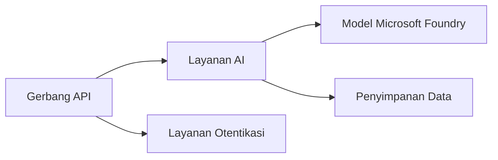
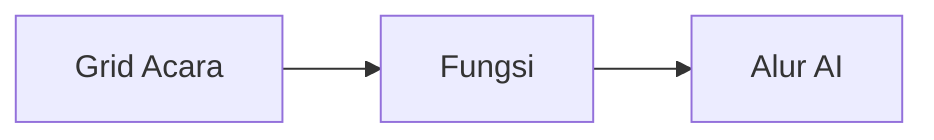

# Bab 8: Pola Produksi & Perusahaan

**📚 Kursus**: [AZD untuk Pemula](../../README.md) | **⏱️ Durasi**: 2-3 hours | **⭐ Kompleksitas**: Lanjutan

---

## Ikhtisar

Bab ini membahas pola penerapan yang siap untuk perusahaan, penguatan keamanan, pemantauan, dan optimisasi biaya untuk beban kerja AI produksi.

> Validated against `azd 1.23.12` in March 2026.

## Tujuan Pembelajaran

Dengan menyelesaikan bab ini, Anda akan:
- Menerapkan aplikasi yang tahan gangguan multi-wilayah
- Mengimplementasikan pola keamanan untuk perusahaan
- Mengonfigurasi pemantauan komprehensif
- Mengoptimalkan biaya dalam skala besar
- Menyiapkan pipeline CI/CD dengan AZD

---

## 📚 Pelajaran

| # | Pelajaran | Deskripsi | Waktu |
|---|--------|-------------|------|
| 1 | [Praktik AI Produksi](production-ai-practices.md) | Pola penerapan perusahaan | 90 menit |

---

## 🚀 Daftar Periksa Produksi

- [ ] Penerapan multi-wilayah untuk ketahanan
- [ ] Identitas terkelola untuk autentikasi (tanpa kunci)
- [ ] Application Insights untuk pemantauan
- [ ] Anggaran biaya dan peringatan dikonfigurasi
- [ ] Pemindaian keamanan diaktifkan
- [ ] Integrasi pipeline CI/CD
- [ ] Rencana pemulihan bencana

---

## 🏗️ Pola Arsitektur

### Pola 1: Microservices untuk AI


### Pola 2: AI Berbasis Peristiwa


---

## 🔐 Praktik Keamanan Terbaik

```bicep
// Use managed identity
identity: {
  type: 'SystemAssigned'
}

// Private endpoints for AI services
properties: {
  publicNetworkAccess: 'Disabled'
  networkAcls: {
    defaultAction: 'Deny'
  }
}
```

---

## 💰 Optimisasi Biaya

| Strategi | Penghematan |
|----------|---------|
| Skalakan ke nol (Container Apps) | 60-80% |
| Gunakan tier konsumsi untuk pengembangan | 50-70% |
| Skalasi terjadwal | 30-50% |
| Kapasitas cadangan | 20-40% |

```bash
# Atur peringatan anggaran
az consumption budget create \
  --budget-name "AI-Budget" \
  --amount 500 \
  --category Cost \
  --time-grain Monthly
```

---

## 📊 Pengaturan Pemantauan

```bash
# Alirkan log
azd monitor --logs

# Periksa Application Insights
azd monitor --overview

# Lihat metrik
az monitor metrics list --resource <resource-id>
```

---

## 🔗 Navigasi

| Arah | Bab |
|-----------|---------|
| **Sebelumnya** | [Bab 7: Pemecahan Masalah](../chapter-07-troubleshooting/README.md) |
| **Selesai Kursus** | [Beranda Kursus](../../README.md) |

---

## 📖 Sumber Terkait

- [Panduan Agen AI](../chapter-02-ai-development/agents.md)
- [Application Insights](../chapter-06-pre-deployment/application-insights.md)
- [Solusi Multi-Agen](../chapter-05-multi-agent/README.md)
- [Contoh Microservices](../../examples/microservices/README.md)

---

<!-- CO-OP TRANSLATOR DISCLAIMER START -->
**Disclaimer**:
Dokumen ini telah diterjemahkan menggunakan layanan terjemahan AI [Co-op Translator](https://github.com/Azure/co-op-translator). Meskipun kami berupaya mencapai akurasi, harap disadari bahwa terjemahan otomatis mungkin mengandung kesalahan atau ketidakakuratan. Dokumen asli dalam bahasa aslinya harus dianggap sebagai sumber yang berwenang. Untuk informasi penting, disarankan terjemahan profesional oleh penerjemah manusia. Kami tidak bertanggung jawab atas setiap kesalahpahaman atau salah tafsir yang timbul dari penggunaan terjemahan ini.
<!-- CO-OP TRANSLATOR DISCLAIMER END -->