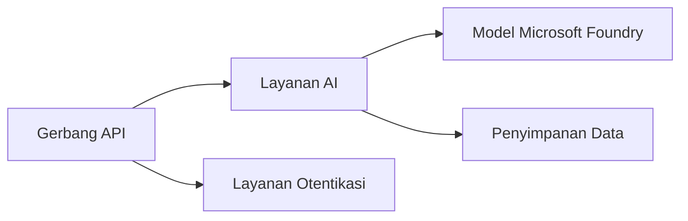
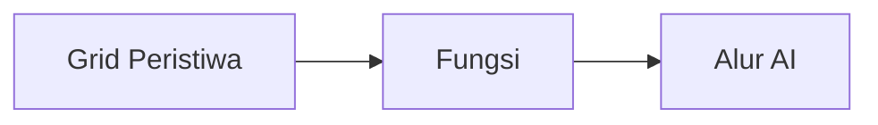

# Bab 8: Pola Produksi & Perusahaan

**📚 Kursus**: [AZD Untuk Pemula](../../README.md) | **⏱️ Durasi**: 2-3 jam | **⭐ Kompleksitas**: Lanjutan

---

## Ikhtisar

Bab ini membahas pola penyebaran yang siap untuk lingkungan perusahaan, penguatan keamanan, pemantauan, dan optimasi biaya untuk beban kerja AI produksi.

> Divalidasi terhadap `azd 1.25.6` pada Juni 2026.

## Tujuan Pembelajaran

Dengan menyelesaikan bab ini, Anda akan:
- Menerapkan aplikasi yang tangguh di multi-wilayah
- Menerapkan pola keamanan tingkat perusahaan
- Mengonfigurasi pemantauan yang komprehensif
- Mengoptimalkan biaya dalam skala besar
- Mengatur pipeline CI/CD dengan AZD

---

## 📚 Pelajaran

| # | Pelajaran | Deskripsi | Waktu |
|---|--------|-------------|------|
| 1 | [Praktik AI Produksi](production-ai-practices.md) | Pola penyebaran tingkat perusahaan | 90 menit |

---

## 🚀 Daftar Periksa Produksi

- [ ] Penyebaran multi-wilayah untuk ketahanan
- [ ] Identitas terkelola untuk otentikasi (tanpa kunci)
- [ ] Application Insights untuk pemantauan
- [ ] Anggaran biaya dan peringatan dikonfigurasi
- [ ] Pemindaian keamanan diaktifkan
- [ ] Integrasi pipeline CI/CD
- [ ] Rencana pemulihan bencana

---

## 🏗️ Pola Arsitektur

### Pola 1: Microservices AI



### Pola 2: Event-Driven AI



---

## 🔐 Praktik Keamanan Terbaik

```bicep
// Use managed identity
identity: {
  type: 'SystemAssigned'
}

// Private endpoints for AI services
properties: {
  publicNetworkAccess: 'Disabled'
  networkAcls: {
    defaultAction: 'Deny'
  }
}
```

---

## 💰 Optimasi Biaya

| Strategi | Penghematan |
|----------|---------|
| Skalakan ke nol (Container Apps) | 60-80% |
| Gunakan tier konsumsi untuk pengembangan | 50-70% |
| Skalasi terjadwal | 30-50% |
| Kapasitas terpesan | 20-40% |

```bash
# Atur peringatan anggaran
az consumption budget create \
  --budget-name "AI-Budget" \
  --amount 500 \
  --category Cost \
  --time-grain Monthly
```

---

## 📊 Pengaturan Pemantauan

```bash
# Alirkan log
azd monitor --logs

# Periksa Application Insights
azd monitor --overview

# Lihat metrik
az monitor metrics list --resource <resource-id>
```

---

## 🔗 Navigasi

| Arah | Bab |
|-----------|---------|
| **Sebelumnya** | [Bab 7: Pemecahan Masalah](../chapter-07-troubleshooting/README.md) |
| **Selesai Kursus** | [Beranda Kursus](../../README.md) |

---

## 📖 Sumber Terkait

- [Panduan Agen AI](../chapter-02-ai-development/agents.md)
- [Application Insights](../chapter-06-pre-deployment/application-insights.md)
- [Solusi Multi-Agen](../chapter-05-multi-agent/README.md)
- [Contoh Microservices](../../examples/microservices/README.md)

---

<!-- CO-OP TRANSLATOR DISCLAIMER START -->
**Penafian**:
Dokumen ini telah diterjemahkan menggunakan layanan terjemahan AI [Co-op Translator](https://github.com/Azure/co-op-translator). Meskipun kami berupaya untuk mencapai akurasi, harap diketahui bahwa terjemahan otomatis mungkin mengandung kesalahan atau ketidakakuratan. Dokumen asli dalam bahasa aslinya harus dianggap sebagai sumber yang sah. Untuk informasi penting, disarankan menggunakan terjemahan profesional oleh manusia. Kami tidak bertanggung jawab atas kesalahpahaman atau penafsiran yang keliru yang timbul dari penggunaan terjemahan ini.
<!-- CO-OP TRANSLATOR DISCLAIMER END -->