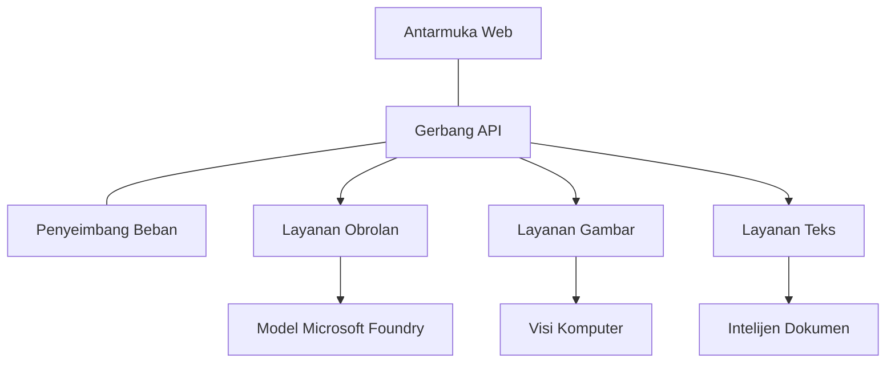

# Praktik Terbaik Beban Kerja AI Produksi dengan AZD

**Navigasi Bab:**
- **📚 Beranda Kursus**: [AZD untuk Pemula](../../README.md)
- **📖 Bab Saat Ini**: Bab 8 - Produksi & Pola Perusahaan
- **⬅️ Bab Sebelumnya**: [Bab 7: Pemecahan Masalah](../chapter-07-troubleshooting/debugging.md)
- **⬅️ Juga Terkait**: [Lab Pelatihan AI](ai-workshop-lab.md)
- **🎯 Kursus Selesai**: [AZD untuk Pemula](../../README.md)

## Ikhtisar

Panduan ini memberikan praktik terbaik yang komprehensif untuk menerapkan beban kerja AI yang siap produksi menggunakan Azure Developer CLI (AZD). Berdasarkan masukan dari komunitas Microsoft Foundry Discord dan penerapan pelanggan di dunia nyata, praktik ini menangani tantangan paling umum pada sistem AI produksi.

## Tantangan Utama yang Ditangani

Berdasarkan hasil polling komunitas kami, ini adalah tantangan teratas yang dihadapi pengembang:

- **45%** kesulitan dengan penyebaran AI multi-layanan
- **38%** memiliki masalah dengan pengelolaan kredensial dan rahasia  
- **35%** menemukan kesiapan produksi dan penskalaan sulit
- **32%** membutuhkan strategi optimisasi biaya yang lebih baik
- **29%** memerlukan pemantauan dan pemecahan masalah yang lebih baik

## Pola Arsitektur untuk AI Produksi

### Pola 1: Arsitektur AI Microservices

**Kapan digunakan**: Aplikasi AI yang kompleks dengan banyak kemampuan


**Implementasi AZD**:

```yaml
# azure.yaml
name: enterprise-ai-platform
services:
  web:
    project: ./web
    host: staticwebapp
  api-gateway:
    project: ./api-gateway
    host: containerapp
  chat-service:
    project: ./services/chat
    host: containerapp
  vision-service:
    project: ./services/vision
    host: containerapp
  text-service:
    project: ./services/text
    host: containerapp
```

### Pola 2: Pemrosesan AI Berbasis Peristiwa

**Kapan digunakan**: Pemrosesan batch, analisis dokumen, alur kerja asinkron

```bicep
// Event Hub for AI processing pipeline
resource eventHub 'Microsoft.EventHub/namespaces@2023-01-01-preview' = {
  name: eventHubNamespaceName
  location: location
  sku: {
    name: 'Standard'
    tier: 'Standard'
    capacity: 1
  }
}

// Service Bus for reliable message processing
resource serviceBus 'Microsoft.ServiceBus/namespaces@2022-10-01-preview' = {
  name: serviceBusNamespaceName
  location: location
  sku: {
    name: 'Premium'
    tier: 'Premium'
    capacity: 1
  }
}

// Function App for processing
resource functionApp 'Microsoft.Web/sites@2023-01-01' = {
  name: functionAppName
  location: location
  kind: 'functionapp,linux'
  properties: {
    siteConfig: {
      appSettings: [
        {
          name: 'FUNCTIONS_EXTENSION_VERSION'
          value: '~4'
        }
        {
          name: 'AZURE_OPENAI_ENDPOINT'
          value: '@Microsoft.KeyVault(VaultName=${keyVault.name};SecretName=openai-endpoint)'
        }
      ]
    }
  }
}
```

## Memikirkan Kesehatan Agen AI

Ketika aplikasi web tradisional rusak, gejalanya sudah familiar: sebuah halaman tidak dimuat, API mengembalikan kesalahan, atau penyebaran gagal. Aplikasi bertenaga AI bisa rusak dengan semua cara itu—tetapi juga bisa berperilaku buruk dengan cara yang lebih halus yang tidak menghasilkan pesan kesalahan yang jelas.

Bagian ini membantu Anda membangun model mental untuk memantau beban kerja AI sehingga Anda tahu ke mana harus melihat ketika sesuatu terasa tidak benar.

### Bagaimana Kesehatan Agen Berbeda dari Kesehatan Aplikasi Tradisional

Aplikasi tradisional bekerja atau tidak. Agen AI bisa tampak bekerja tetapi menghasilkan hasil yang buruk. Pikirkan kesehatan agen dalam dua lapisan:

| Lapisan | Apa yang Dipantau | Tempat Mencari |
|-------|--------------|---------------|
| **Kesehatan infrastruktur** | Apakah layanan berjalan? Apakah sumber daya disediakan? Apakah endpoint dapat dijangkau? | `azd monitor`, Azure Portal resource health, container/app logs |
| **Kesehatan perilaku** | Apakah agen merespons dengan akurat? Apakah respons tepat waktu? Apakah model dipanggil dengan benar? | Application Insights traces, model call latency metrics, response quality logs |

Kesehatan infrastruktur sudah akrab—itu sama untuk aplikasi azd mana pun. Kesehatan perilaku adalah lapisan baru yang diperkenalkan beban kerja AI.

### Ke Mana Harus Melihat Ketika Aplikasi AI Berperilaku Tak Sesuai Ekspektasi

Jika aplikasi AI Anda tidak menghasilkan hasil yang Anda harapkan, berikut daftar periksa konseptual:

1. **Mulai dari dasar.** Apakah aplikasi berjalan? Dapatkah ia menjangkau dependensinya? Periksa `azd monitor` dan resource health seperti yang Anda lakukan untuk aplikasi apa pun.
2. **Periksa koneksi ke model.** Apakah aplikasi Anda berhasil memanggil model AI? Panggilan model yang gagal atau kedaluwarsa adalah penyebab paling umum masalah aplikasi AI dan akan muncul di log aplikasi Anda.
3. **Lihat apa yang diterima model.** Respons AI bergantung pada input (prompt dan konteks yang diambil). Jika output salah, biasanya input yang salah. Periksa apakah aplikasi Anda mengirim data yang benar ke model.
4. **Tinjau latensi respons.** Panggilan model AI lebih lambat daripada panggilan API biasa. Jika aplikasi terasa lambat, periksa apakah waktu respons model meningkat—ini bisa menunjukkan pembatasan, batas kapasitas, atau kemacetan pada tingkat region.
5. **Waspadai sinyal biaya.** Lonjakan tak terduga dalam penggunaan token atau panggilan API bisa menunjukkan loop, prompt yang salah konfigurasi, atau retry berlebih.

Anda tidak perlu menguasai alat observabilitas segera. Inti yang perlu diambil adalah aplikasi AI memiliki lapisan perilaku tambahan untuk dipantau, dan pemantauan bawaan azd (`azd monitor`) memberi Anda titik awal untuk menyelidiki kedua lapisan tersebut.

---

## Praktik Keamanan Terbaik

### 1. Model Keamanan Zero-Trust

**Strategi Implementasi**:
- Tidak ada komunikasi antar-layanan tanpa autentikasi
- Semua panggilan API menggunakan managed identities
- Isolasi jaringan dengan private endpoints
- Kontrol akses prinsip least privilege

```bicep
// Managed Identity for each service
resource chatServiceIdentity 'Microsoft.ManagedIdentity/userAssignedIdentities@2023-01-31' = {
  name: 'chat-service-identity'
  location: location
}

// Role assignments with minimal permissions
resource openAIUserRole 'Microsoft.Authorization/roleAssignments@2022-04-01' = {
  scope: openAIAccount
  name: guid(openAIAccount.id, chatServiceIdentity.id, openAIUserRoleDefinitionId)
  properties: {
    roleDefinitionId: subscriptionResourceId('Microsoft.Authorization/roleDefinitions', '5e0bd9bd-7b93-4f28-af87-19fc36ad61bd')
    principalId: chatServiceIdentity.properties.principalId
    principalType: 'ServicePrincipal'
  }
}
```

### 2. Manajemen Rahasia yang Aman

**Pola Integrasi Key Vault**:

```bicep
// Key Vault with proper access policies
resource keyVault 'Microsoft.KeyVault/vaults@2023-02-01' = {
  name: keyVaultName
  location: location
  properties: {
    tenantId: tenant().tenantId
    sku: {
      family: 'A'
      name: 'premium'  // Use premium for production
    }
    enableRbacAuthorization: true  // Use RBAC instead of access policies
    enablePurgeProtection: true    // Prevent accidental deletion
    enableSoftDelete: true
    softDeleteRetentionInDays: 90
  }
}

// Store all AI service credentials
resource openAIKeySecret 'Microsoft.KeyVault/vaults/secrets@2023-02-01' = {
  parent: keyVault
  name: 'openai-api-key'
  properties: {
    value: openAIAccount.listKeys().key1
    attributes: {
      enabled: true
    }
  }
}
```

### 3. Keamanan Jaringan

**Konfigurasi Private Endpoint**:

```bicep
// Virtual Network for AI services
resource virtualNetwork 'Microsoft.Network/virtualNetworks@2023-04-01' = {
  name: vnetName
  location: location
  properties: {
    addressSpace: {
      addressPrefixes: ['10.0.0.0/16']
    }
    subnets: [
      {
        name: 'ai-services-subnet'
        properties: {
          addressPrefix: '10.0.1.0/24'
          privateEndpointNetworkPolicies: 'Disabled'
        }
      }
      {
        name: 'app-services-subnet'
        properties: {
          addressPrefix: '10.0.2.0/24'
          delegations: [
            {
              name: 'Microsoft.Web/serverFarms'
              properties: {
                serviceName: 'Microsoft.Web/serverFarms'
              }
            }
          ]
        }
      }
    ]
  }
}

// Private endpoints for all AI services
resource openAIPrivateEndpoint 'Microsoft.Network/privateEndpoints@2023-04-01' = {
  name: '${openAIAccountName}-pe'
  location: location
  properties: {
    subnet: {
      id: virtualNetwork.properties.subnets[0].id
    }
    privateLinkServiceConnections: [
      {
        name: 'openai-connection'
        properties: {
          privateLinkServiceId: openAIAccount.id
          groupIds: ['account']
        }
      }
    ]
  }
}
```

## Kinerja dan Penskalaan

### 1. Strategi Auto-Scaling

**Auto-scaling Container Apps**:

```bicep
resource containerApp 'Microsoft.App/containerApps@2023-05-01' = {
  name: containerAppName
  location: location
  properties: {
    configuration: {
      ingress: {
        external: true
        targetPort: 8000
        transport: 'http'
      }
    }
    template: {
      scale: {
        minReplicas: 2  // Always have 2 instances minimum
        maxReplicas: 50 // Scale up to 50 for high load
        rules: [
          {
            name: 'http-scaling'
            http: {
              metadata: {
                concurrentRequests: '20'  // Scale when >20 concurrent requests
              }
            }
          }
          {
            name: 'cpu-scaling'
            custom: {
              type: 'cpu'
              metadata: {
                type: 'Utilization'
                value: '70'  // Scale when CPU >70%
              }
            }
          }
        ]
      }
    }
  }
}
```

### 2. Strategi Caching

**Redis Cache untuk Respons AI**:

```bicep
// Redis Premium for production workloads
resource redisCache 'Microsoft.Cache/redis@2023-04-01' = {
  name: redisCacheName
  location: location
  properties: {
    sku: {
      name: 'Premium'
      family: 'P'
      capacity: 1
    }
    enableNonSslPort: false
    minimumTlsVersion: '1.2'
    redisConfiguration: {
      'maxmemory-policy': 'allkeys-lru'
    }
    // Enable clustering for high availability
    redisVersion: '6.0'
    shardCount: 2
  }
}

// Cache configuration in application
var cacheConnectionString = '${redisCache.properties.hostName}:6380,password=${redisCache.listKeys().primaryKey},ssl=True,abortConnect=False'
```

### 3. Load Balancing dan Manajemen Lalu Lintas

**Application Gateway dengan WAF**:

```bicep
// Application Gateway with Web Application Firewall
resource applicationGateway 'Microsoft.Network/applicationGateways@2023-04-01' = {
  name: appGatewayName
  location: location
  properties: {
    sku: {
      name: 'WAF_v2'
      tier: 'WAF_v2'
      capacity: 2
    }
    webApplicationFirewallConfiguration: {
      enabled: true
      firewallMode: 'Prevention'
      ruleSetType: 'OWASP'
      ruleSetVersion: '3.2'
    }
    // Backend pools for AI services
    backendAddressPools: [
      {
        name: 'ai-services-pool'
        properties: {
          backendAddresses: [
            {
              fqdn: '${containerApp.properties.configuration.ingress.fqdn}'
            }
          ]
        }
      }
    ]
  }
}
```

## 💰 Optimisasi Biaya

### 1. Penentuan Ukuran Sumber Daya yang Tepat

**Konfigurasi Spesifik Lingkungan**:

```bash
# Lingkungan pengembangan
azd env new development
azd env set AZURE_OPENAI_SKU "S0"
azd env set AZURE_OPENAI_CAPACITY 10
azd env set AZURE_SEARCH_SKU "basic"
azd env set CONTAINER_CPU 0.5
azd env set CONTAINER_MEMORY 1.0

# Lingkungan produksi
azd env new production
azd env set AZURE_OPENAI_SKU "S0"
azd env set AZURE_OPENAI_CAPACITY 100
azd env set AZURE_SEARCH_SKU "standard"
azd env set CONTAINER_CPU 2.0
azd env set CONTAINER_MEMORY 4.0
```

### 2. Pemantauan Biaya dan Anggaran

```bicep
// Cost management and budgets
resource budget 'Microsoft.Consumption/budgets@2023-05-01' = {
  name: 'ai-workload-budget'
  properties: {
    timePeriod: {
      startDate: '2024-01-01'
      endDate: '2024-12-31'
    }
    timeGrain: 'Monthly'
    amount: 2000  // $2000 monthly budget
    category: 'Cost'
    notifications: {
      warning: {
        enabled: true
        operator: 'GreaterThan'
        threshold: 80
        contactEmails: [
          'finance@company.com'
          'engineering@company.com'
        ]
        contactRoles: [
          'Owner'
          'Contributor'
        ]
      }
      critical: {
        enabled: true
        operator: 'GreaterThan'
        threshold: 95
        contactEmails: [
          'cto@company.com'
        ]
      }
    }
  }
}
```

### 3. Optimisasi Penggunaan Token

**Manajemen Biaya OpenAI**:

```typescript
// Optimasi token pada tingkat aplikasi
class TokenOptimizer {
  private readonly maxTokens = 4000;
  private readonly reserveTokens = 500;
  
  optimizePrompt(userInput: string, context: string): string {
    const availableTokens = this.maxTokens - this.reserveTokens;
    const estimatedTokens = this.estimateTokens(userInput + context);
    
    if (estimatedTokens > availableTokens) {
      // Pangkas konteks, bukan input pengguna
      context = this.truncateContext(context, availableTokens - this.estimateTokens(userInput));
    }
    
    return `${context}\n\nUser: ${userInput}`;
  }
  
  private estimateTokens(text: string): number {
    // Perkiraan kasar: 1 token ≈ 4 karakter
    return Math.ceil(text.length / 4);
  }
}
```

## Pemantauan dan Observabilitas

### 1. Application Insights yang Komprehensif

```bicep
// Application Insights with advanced features
resource applicationInsights 'Microsoft.Insights/components@2020-02-02' = {
  name: applicationInsightsName
  location: location
  kind: 'web'
  properties: {
    Application_Type: 'web'
    WorkspaceResourceId: logAnalyticsWorkspace.id
    SamplingPercentage: 100  // Full sampling for AI apps
    DisableIpMasking: false  // Enable for security
  }
}

// Custom metrics for AI operations
resource aiMetricAlerts 'Microsoft.Insights/metricAlerts@2018-03-01' = {
  name: 'ai-high-error-rate'
  location: 'global'
  properties: {
    description: 'Alert when AI service error rate is high'
    severity: 2
    enabled: true
    scopes: [
      applicationInsights.id
    ]
    evaluationFrequency: 'PT1M'
    windowSize: 'PT5M'
    criteria: {
      'odata.type': 'Microsoft.Azure.Monitor.SingleResourceMultipleMetricCriteria'
      allOf: [
        {
          name: 'high-error-rate'
          metricName: 'requests/failed'
          operator: 'GreaterThan'
          threshold: 10
          timeAggregation: 'Count'
        }
      ]
    }
  }
}
```

### 2. Pemantauan Khusus AI

**Dashboard Khusus untuk Metrik AI**:

```json
// Dashboard configuration for AI workloads
{
  "dashboard": {
    "name": "AI Application Monitoring",
    "tiles": [
      {
        "name": "OpenAI Request Volume",
        "query": "requests | where name contains 'openai' | summarize count() by bin(timestamp, 5m)"
      },
      {
        "name": "AI Response Latency",
        "query": "requests | where name contains 'openai' | summarize avg(duration) by bin(timestamp, 5m)"
      },
      {
        "name": "Token Usage",
        "query": "customMetrics | where name == 'openai_tokens_used' | summarize sum(value) by bin(timestamp, 1h)"
      },
      {
        "name": "Cost per Hour",
        "query": "customMetrics | where name == 'openai_cost' | summarize sum(value) by bin(timestamp, 1h)"
      }
    ]
  }
}
```

### 3. Pemeriksaan Kesehatan dan Pemantauan Waktu Aktif

```bicep
// Application Insights availability tests
resource availabilityTest 'Microsoft.Insights/webtests@2022-06-15' = {
  name: 'ai-app-availability-test'
  location: location
  tags: {
    'hidden-link:${applicationInsights.id}': 'Resource'
  }
  properties: {
    SyntheticMonitorId: 'ai-app-availability-test'
    Name: 'AI Application Availability Test'
    Description: 'Tests AI application endpoints'
    Enabled: true
    Frequency: 300  // 5 minutes
    Timeout: 120    // 2 minutes
    Kind: 'ping'
    Locations: [
      {
        Id: 'us-east-2-azr'
      }
      {
        Id: 'us-west-2-azr'
      }
    ]
    Configuration: {
      WebTest: '''
        <WebTest Name="AI Health Check" 
                 Id="8d2de8d2-a2b0-4c2e-9a0d-8f9c9a0b8c8d" 
                 Enabled="True" 
                 CssProjectStructure="" 
                 CssIteration="" 
                 Timeout="120" 
                 WorkItemIds="" 
                 xmlns="http://microsoft.com/schemas/VisualStudio/TeamTest/2010" 
                 Description="" 
                 CredentialUserName="" 
                 CredentialPassword="" 
                 PreAuthenticate="True" 
                 Proxy="default" 
                 StopOnError="False" 
                 RecordedResultFile="" 
                 ResultsLocale="">
          <Items>
            <Request Method="GET" 
                     Guid="a5f10126-e4cd-570d-961c-cea43999a200" 
                     Version="1.1" 
                     Url="${webApp.properties.defaultHostName}/health" 
                     ThinkTime="0" 
                     Timeout="120" 
                     ParseDependentRequests="True" 
                     FollowRedirects="True" 
                     RecordResult="True" 
                     Cache="False" 
                     ResponseTimeGoal="0" 
                     Encoding="utf-8" 
                     ExpectedHttpStatusCode="200" 
                     ExpectedResponseUrl="" 
                     ReportingName="" 
                     IgnoreHttpStatusCode="False" />
          </Items>
        </WebTest>
      '''
    }
  }
}
```

## Pemulihan Bencana dan Ketersediaan Tinggi

### 1. Penyebaran Multi-Region

```yaml
# azure.yaml - Multi-region configuration
name: ai-app-multiregion
services:
  api-primary:
    project: ./api
    host: containerapp
    env:
      - AZURE_REGION=eastus
  api-secondary:
    project: ./api
    host: containerapp
    env:
      - AZURE_REGION=westus2
```

```bicep
// Traffic Manager for global load balancing
resource trafficManager 'Microsoft.Network/trafficManagerProfiles@2022-04-01' = {
  name: trafficManagerProfileName
  location: 'global'
  properties: {
    profileStatus: 'Enabled'
    trafficRoutingMethod: 'Priority'
    dnsConfig: {
      relativeName: trafficManagerProfileName
      ttl: 30
    }
    monitorConfig: {
      protocol: 'HTTPS'
      port: 443
      path: '/health'
      intervalInSeconds: 30
      toleratedNumberOfFailures: 3
      timeoutInSeconds: 10
    }
    endpoints: [
      {
        name: 'primary-endpoint'
        type: 'Microsoft.Network/trafficManagerProfiles/azureEndpoints'
        properties: {
          targetResourceId: primaryAppService.id
          endpointStatus: 'Enabled'
          priority: 1
        }
      }
      {
        name: 'secondary-endpoint'
        type: 'Microsoft.Network/trafficManagerProfiles/azureEndpoints'
        properties: {
          targetResourceId: secondaryAppService.id
          endpointStatus: 'Enabled'
          priority: 2
        }
      }
    ]
  }
}
```

### 2. Pencadangan dan Pemulihan Data

```bicep
// Backup configuration for critical data
resource backupVault 'Microsoft.DataProtection/backupVaults@2023-05-01' = {
  name: backupVaultName
  location: location
  identity: {
    type: 'SystemAssigned'
  }
  properties: {
    storageSettings: [
      {
        datastoreType: 'VaultStore'
        type: 'LocallyRedundant'
      }
    ]
  }
}

// Backup policy for AI models and data
resource backupPolicy 'Microsoft.DataProtection/backupVaults/backupPolicies@2023-05-01' = {
  parent: backupVault
  name: 'ai-data-backup-policy'
  properties: {
    policyRules: [
      {
        backupParameters: {
          backupType: 'Full'
          objectType: 'AzureBackupParams'
        }
        trigger: {
          schedule: {
            repeatingTimeIntervals: [
              'R/2024-01-01T02:00:00+00:00/P1D'  // Daily at 2 AM
            ]
          }
          objectType: 'ScheduleBasedTriggerContext'
        }
        dataStore: {
          datastoreType: 'VaultStore'
          objectType: 'DataStoreInfoBase'
        }
        name: 'BackupDaily'
        objectType: 'AzureBackupRule'
      }
    ]
  }
}
```

## Integrasi DevOps dan CI/CD

### 1. Alur Kerja GitHub Actions

```yaml
# .github/workflows/deploy-ai-app.yml
name: Deploy AI Application

on:
  push:
    branches: [main]
  pull_request:
    branches: [main]

jobs:
  test:
    runs-on: ubuntu-latest
    steps:
      - uses: actions/checkout@v4
      
      - name: Setup Python
        uses: actions/setup-python@v4
        with:
          python-version: '3.11'
          
      - name: Install dependencies
        run: |
          pip install -r requirements.txt
          pip install pytest
          
      - name: Run tests
        run: pytest tests/
        
      - name: AI Safety Tests
        run: |
          python scripts/test_ai_safety.py
          python scripts/validate_prompts.py

  deploy-staging:
    needs: test
    if: github.event_name == 'pull_request'
    runs-on: ubuntu-latest
    steps:
      - uses: actions/checkout@v4
      
      - name: Setup AZD
        uses: Azure/setup-azd@v1.0.0
        
      - name: Login to Azure
        uses: azure/login@v1
        with:
          creds: ${{ secrets.AZURE_CREDENTIALS }}
          
      - name: Deploy to Staging
        run: |
          azd env select staging
          azd deploy

  deploy-production:
    needs: test
    if: github.ref == 'refs/heads/main'
    runs-on: ubuntu-latest
    steps:
      - uses: actions/checkout@v4
      
      - name: Setup AZD
        uses: Azure/setup-azd@v1.0.0
        
      - name: Login to Azure
        uses: azure/login@v1
        with:
          creds: ${{ secrets.AZURE_CREDENTIALS }}
          
      - name: Deploy to Production
        run: |
          azd env select production
          azd deploy
          
      - name: Run Production Health Checks
        run: |
          python scripts/health_check.py --env production
```

### 2. Validasi Infrastruktur

```bash
# scripts/validate_infrastructure.sh
#!/bin/bash

echo "Validating AI infrastructure deployment..."

# Periksa apakah semua layanan yang diperlukan sedang berjalan
services=("openai" "search" "storage" "keyvault")
for service in "${services[@]}"; do
    echo "Checking $service..."
    if ! az resource list --resource-type "Microsoft.CognitiveServices/accounts" --query "[?contains(name, '$service')]" -o tsv; then
        echo "ERROR: $service not found"
        exit 1
    fi
done

# Validasi penyebaran model OpenAI
echo "Validating OpenAI model deployments..."
models=$(az cognitiveservices account deployment list --name $AZURE_OPENAI_NAME --resource-group $AZURE_RESOURCE_GROUP --query "[].name" -o tsv)
if [[ ! $models == *"gpt-35-turbo"* ]]; then
    echo "ERROR: Required model gpt-35-turbo not deployed"
    exit 1
fi

# Uji konektivitas layanan AI
echo "Testing AI service connectivity..."
python scripts/test_connectivity.py

echo "Infrastructure validation completed successfully!"
```

## Daftar Periksa Kesiapan Produksi

### Keamanan ✅
- [ ] Semua layanan menggunakan managed identities
- [ ] Rahasia disimpan di Key Vault
- [ ] Private endpoints dikonfigurasi
- [ ] Network security groups diimplementasikan
- [ ] RBAC dengan prinsip least privilege
- [ ] WAF diaktifkan pada endpoint publik

### Kinerja ✅
- [ ] Auto-scaling dikonfigurasi
- [ ] Caching diimplementasikan
- [ ] Load balancing disiapkan
- [ ] CDN untuk konten statis
- [ ] Pooling koneksi database
- [ ] Optimisasi penggunaan token

### Pemantauan ✅
- [ ] Application Insights dikonfigurasi
- [ ] Metrik kustom didefinisikan
- [ ] Aturan alerting disiapkan
- [ ] Dashboard dibuat
- [ ] Pemeriksaan kesehatan diimplementasikan
- [ ] Kebijakan retensi log

### Keandalan ✅
- [ ] Penyebaran multi-region
- [ ] Rencana pencadangan dan pemulihan
- [ ] Circuit breakers diimplementasikan
- [ ] Kebijakan retry dikonfigurasi
- [ ] Degradasi yang anggun
- [ ] Endpoint pemeriksaan kesehatan

### Manajemen Biaya ✅
- [ ] Alert anggaran dikonfigurasi
- [ ] Penentuan ukuran sumber daya yang tepat
- [ ] Diskon dev/test diterapkan
- [ ] Reserved instances dibeli
- [ ] Dashboard pemantauan biaya
- [ ] Tinjauan biaya berkala

### Kepatuhan ✅
- [ ] Persyaratan residensi data dipenuhi
- [ ] Pencatatan audit diaktifkan
- [ ] Kebijakan kepatuhan diterapkan
- [ ] Baseline keamanan diimplementasikan
- [ ] Penilaian keamanan berkala
- [ ] Rencana respons insiden

## Tolok Ukur Kinerja

### Metrik Produksi Umum

| Metrik | Target | Pemantauan |
|--------|--------|------------|
| **Response Time** | < 2 seconds | Application Insights |
| **Availability** | 99.9% | Uptime monitoring |
| **Error Rate** | < 0.1% | Application logs |
| **Token Usage** | < $500/month | Cost management |
| **Concurrent Users** | 1000+ | Load testing |
| **Recovery Time** | < 1 hour | Disaster recovery tests |

### Uji Beban

```bash
# Skrip pengujian beban untuk aplikasi AI
python scripts/load_test.py \
  --endpoint https://your-ai-app.azurewebsites.net \
  --concurrent-users 100 \
  --duration 300 \
  --ramp-up 60
```

## 🤝 Praktik Terbaik Komunitas

Berdasarkan masukan komunitas Microsoft Foundry Discord:

### Rekomendasi Teratas dari Komunitas:

1. **Mulai Kecil, Skala Secara Bertahap**: Mulai dengan SKU dasar dan skala berdasarkan penggunaan aktual
2. **Pantau Segalanya**: Siapkan pemantauan komprehensif sejak hari pertama
3. **Otomatiskan Keamanan**: Gunakan infrastructure as code untuk keamanan yang konsisten
4. **Uji Secara Menyeluruh**: Sertakan pengujian khusus AI dalam pipeline Anda
5. **Rencanakan Biaya**: Pantau penggunaan token dan atur alert anggaran sejak awal

### Kesalahan Umum yang Harus Dihindari:

- ❌ Menyematkan API key di kode
- ❌ Tidak menyiapkan pemantauan yang tepat
- ❌ Mengabaikan optimisasi biaya
- ❌ Tidak menguji skenario kegagalan
- ❌ Menyebarkan tanpa pemeriksaan kesehatan

## Perintah AZD AI CLI dan Ekstensi

AZD menyertakan serangkaian perintah dan ekstensi khusus AI yang terus berkembang untuk menyederhanakan alur kerja AI produksi. Alat-alat ini menjembatani kesenjangan antara pengembangan lokal dan penyebaran produksi untuk beban kerja AI.

### Ekstensi AZD untuk AI

AZD menggunakan sistem ekstensi untuk menambahkan kemampuan khusus AI. Instal dan kelola ekstensi dengan:

```bash
# Daftar semua ekstensi yang tersedia (termasuk AI)
azd extension list

# Pasang ekstensi agen Foundry
azd extension install azure.ai.agents

# Pasang ekstensi penyetelan halus
azd extension install azure.ai.finetune

# Pasang ekstensi model kustom
azd extension install azure.ai.models

# Perbarui semua ekstensi yang terpasang
azd extension upgrade --all
```

**Ekstensi AI yang Tersedia:**

| Extension | Tujuan | Status |
|-----------|---------|--------|
| `azure.ai.agents` | Foundry Agent Service management | Preview |
| `azure.ai.finetune` | Foundry model fine-tuning | Preview |
| `azure.ai.models` | Foundry custom models | Preview |
| `azure.coding-agent` | Coding agent configuration | Available |

### Menginisialisasi Proyek Agen dengan `azd ai agent init`

Perintah `azd ai agent init` membuat kerangka proyek agen AI yang siap produksi yang terintegrasi dengan Microsoft Foundry Agent Service:

```bash
# Inisialisasi proyek agen baru dari manifes agen
azd ai agent init -m <manifest-path-or-uri>

# Inisialisasi dan arahkan ke proyek Foundry tertentu
azd ai agent init -m agent-manifest.yaml --project-id <foundry-project-id>

# Inisialisasi dengan direktori sumber kustom
azd ai agent init -m agent-manifest.yaml --src ./agents/my-agent

# Arahkan Container Apps sebagai host
azd ai agent init -m agent-manifest.yaml --host containerapp
```

**Flag kunci:**

| Flag | Deskripsi |
|------|-------------|
| `-m, --manifest` | Path atau URI ke manifest agen untuk ditambahkan ke proyek Anda |
| `-p, --project-id` | Existing Microsoft Foundry Project ID untuk lingkungan azd Anda |
| `-s, --src` | Direktori untuk mengunduh definisi agen (default ke `src/<agent-id>`) |
| `--host` | Override host default (mis. `containerapp`) |
| `-e, --environment` | Lingkungan azd yang akan digunakan |

**Tip produksi**: Gunakan `--project-id` untuk terhubung langsung ke proyek Foundry yang sudah ada, menjaga kode agen dan sumber daya cloud Anda terhubung sejak awal.

### Model Context Protocol (MCP) dengan `azd mcp`

AZD menyertakan dukungan server MCP bawaan (Alpha), memungkinkan agen dan alat AI berinteraksi dengan sumber daya Azure Anda melalui protokol standar:

```bash
# Mulai server MCP untuk proyek Anda
azd mcp start

# Kelola persetujuan alat untuk operasi MCP
azd mcp consent
```

Server MCP mengekspos konteks proyek azd Anda—lingkungan, layanan, dan sumber daya Azure—ke alat pengembangan bertenaga AI. Ini memungkinkan:

- **Penyebaran berbantuan AI**: Biarkan coding agents menanyakan status proyek Anda dan memicu penyebaran
- **Penemuan sumber daya**: Alat AI dapat menemukan sumber daya Azure yang digunakan proyek Anda
- **Manajemen lingkungan**: Agen dapat beralih antara lingkungan dev/staging/production

### Generasi Infrastruktur dengan `azd infra generate`

Untuk beban kerja AI produksi, Anda dapat menghasilkan dan menyesuaikan Infrastructure as Code daripada mengandalkan provisioning otomatis:

```bash
# Hasilkan file Bicep/Terraform dari definisi proyek Anda
azd infra generate
```

Ini menulis IaC ke disk sehingga Anda dapat:
- Meninjau dan mengaudit infrastruktur sebelum menerapkan
- Menambahkan kebijakan keamanan kustom (aturan jaringan, private endpoints)
- Mengintegrasikan dengan proses review IaC yang sudah ada
- Mengontrol versi perubahan infrastruktur terpisah dari kode aplikasi

### Production Lifecycle Hooks

Hook AZD memungkinkan Anda menyisipkan logika kustom pada setiap tahap siklus hidup penyebaran—krusial untuk alur kerja AI produksi:

```yaml
# azure.yaml - Production hooks example
name: ai-production-app
hooks:
  preprovision:
    shell: sh
    run: scripts/validate-quotas.sh    # Check AI model quota before provisioning
  postprovision:
    shell: sh
    run: scripts/configure-networking.sh  # Set up private endpoints
  predeploy:
    shell: sh
    run: scripts/run-ai-safety-tests.sh  # Run prompt safety checks
  postdeploy:
    shell: sh
    run: scripts/smoke-test.sh           # Verify agent responses post-deploy
services:
  agent-api:
    project: ./src/agent
    host: containerapp
    hooks:
      predeploy:
        shell: sh
        run: scripts/validate-model-access.sh  # Per-service hook
```

```bash
# Jalankan hook tertentu secara manual selama pengembangan
azd hooks run predeploy
```

**Hook produksi yang direkomendasikan untuk beban kerja AI:**

| Hook | Kasus Penggunaan |
|------|----------|
| `preprovision` | Validasi kuota langganan untuk kapasitas model AI |
| `postprovision` | Konfigurasi private endpoints, menyebarkan model weights |
| `predeploy` | Menjalankan tes keselamatan AI, memvalidasi template prompt |
| `postdeploy` | Smoke test respons agen, verifikasi konektivitas model |

### Konfigurasi Pipeline CI/CD

Gunakan `azd pipeline config` untuk menghubungkan proyek Anda ke GitHub Actions atau Azure Pipelines dengan autentikasi Azure yang aman:

```bash
# Konfigurasikan pipeline CI/CD (interaktif)
azd pipeline config

# Konfigurasikan dengan penyedia tertentu
azd pipeline config --provider github
```

Perintah ini:
- Membuat service principal dengan akses paling sedikit
- Mengonfigurasi federated credentials (tanpa menyimpan rahasia)
- Menghasilkan atau memperbarui file definisi pipeline Anda
- Mengatur variabel lingkungan yang diperlukan di sistem CI/CD Anda

**Alur kerja produksi dengan pipeline config:**

```bash
# 1. Siapkan lingkungan produksi
azd env new production
azd env set AZURE_OPENAI_CAPACITY 100

# 2. Konfigurasikan pipeline
azd pipeline config --provider github

# 3. Pipeline menjalankan azd deploy pada setiap push ke main
```

### Menambahkan Komponen dengan `azd add`

Tambahkan layanan Azure secara bertahap ke proyek yang ada:

```bash
# Tambahkan komponen layanan baru secara interaktif
azd add
```

Ini sangat berguna untuk memperluas aplikasi AI produksi—misalnya, menambahkan layanan pencarian vektor, endpoint agen baru, atau komponen pemantauan ke penyebaran yang sudah ada.

## Sumber Daya Tambahan
- **Azure Well-Architected Framework**: [Panduan beban kerja AI](https://learn.microsoft.com/azure/well-architected/ai/)
- **Microsoft Foundry Documentation**: [Dokumentasi resmi](https://learn.microsoft.com/azure/ai-studio/)
- **Community Templates**: [Azure Samples](https://github.com/Azure-Samples)
- **Discord Community**: [#saluran Azure](https://discord.gg/microsoft-azure)
- **Agent Skills for Azure**: [microsoft/github-copilot-for-azure on skills.sh](https://skills.sh/microsoft/github-copilot-for-azure) - 37 keterampilan agen yang tersedia untuk Azure AI, Foundry, penyebaran, optimisasi biaya, dan diagnostik. Pasang di editor Anda:
  ```bash
  npx skills add microsoft/github-copilot-for-azure
  ```

---

**Chapter Navigation:**
- **📚 Course Home**: [AZD For Beginners](../../README.md)
- **📖 Current Chapter**: Bab 8 - Pola Produksi & Perusahaan
- **⬅️ Previous Chapter**: [Bab 7: Pemecahan Masalah](../chapter-07-troubleshooting/debugging.md)
- **⬅️ Also Related**: [Lab Workshop AI](ai-workshop-lab.md)
- **� Course Complete**: [AZD For Beginners](../../README.md)

**Ingat**: Beban kerja AI produksi memerlukan perencanaan yang cermat, pemantauan, dan pengoptimalan berkelanjutan. Mulailah dengan pola-pola ini dan sesuaikan dengan kebutuhan spesifik Anda.

---

<!-- CO-OP TRANSLATOR DISCLAIMER START -->
**Disclaimer**:
Dokumen ini telah diterjemahkan menggunakan layanan terjemahan AI [Co-op Translator](https://github.com/Azure/co-op-translator). Meskipun kami berupaya mencapai ketepatan, harap diperhatikan bahwa terjemahan otomatis mungkin berisi kesalahan atau ketidakakuratan. Dokumen asli dalam bahasa aslinya harus dianggap sebagai sumber yang otoritatif. Untuk informasi yang bersifat kritis, disarankan menggunakan terjemahan profesional oleh penerjemah manusia. Kami tidak bertanggung jawab atas kesalahpahaman atau salah tafsir yang timbul dari penggunaan terjemahan ini.
<!-- CO-OP TRANSLATOR DISCLAIMER END -->