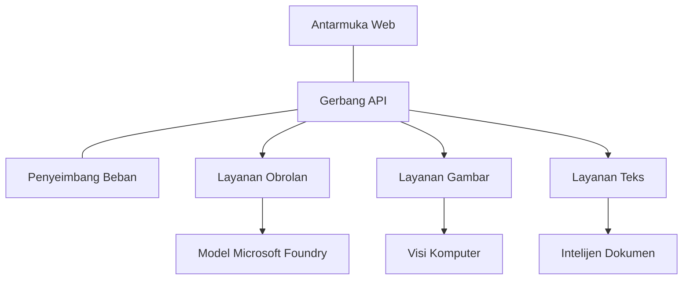

# Praktik Terbaik Workload AI Produksi dengan AZD

**Navigasi Bab:**
- **📚 Beranda Kursus**: [AZD For Beginners](../../README.md)
- **📖 Bab Saat Ini**: Bab 8 - Pola Produksi & Perusahaan
- **⬅️ Bab Sebelumnya**: [Chapter 7: Troubleshooting](../chapter-07-troubleshooting/debugging.md)
- **⬅️ Juga Terkait**: [AI Workshop Lab](ai-workshop-lab.md)
- **🎯 Kursus Selesai**: [AZD For Beginners](../../README.md)

## Ikhtisar

Panduan ini menyediakan praktik terbaik komprehensif untuk menerapkan workload AI siap produksi menggunakan Azure Developer CLI (AZD). Berdasarkan masukan dari komunitas Microsoft Foundry Discord dan penerapan pelanggan di dunia nyata, praktik-praktik ini menangani tantangan paling umum dalam sistem AI produksi.

## Tantangan Utama yang Ditangani

Berdasarkan hasil jajak pendapat komunitas kami, ini adalah tantangan teratas yang dihadapi pengembang:

- **45%** kesulitan dengan penerapan AI multi-layanan
- **38%** memiliki masalah dengan manajemen kredensial dan rahasia  
- **35%** menemukan kesiapan produksi dan penskalaan sulit
- **32%** membutuhkan strategi optimasi biaya yang lebih baik
- **29%** memerlukan pemantauan dan pemecahan masalah yang lebih baik

## Pola Arsitektur untuk AI Produksi

### Pola 1: Arsitektur AI Microservices

**Kapan digunakan**: Aplikasi AI kompleks dengan banyak kapabilitas



**Implementasi AZD**:

```yaml
# azure.yaml
name: enterprise-ai-platform
services:
  web:
    project: ./web
    host: staticwebapp
  api-gateway:
    project: ./api-gateway
    host: containerapp
  chat-service:
    project: ./services/chat
    host: containerapp
  vision-service:
    project: ./services/vision
    host: containerapp
  text-service:
    project: ./services/text
    host: containerapp
```

### Pola 2: Pemrosesan AI Berbasis Event

**Kapan digunakan**: Pemrosesan batch, analisis dokumen, alur kerja asinkron

```bicep
// Event Hub for AI processing pipeline
resource eventHub 'Microsoft.EventHub/namespaces@2023-01-01-preview' = {
  name: eventHubNamespaceName
  location: location
  sku: {
    name: 'Standard'
    tier: 'Standard'
    capacity: 1
  }
}

// Service Bus for reliable message processing
resource serviceBus 'Microsoft.ServiceBus/namespaces@2022-10-01-preview' = {
  name: serviceBusNamespaceName
  location: location
  sku: {
    name: 'Premium'
    tier: 'Premium'
    capacity: 1
  }
}

// Function App for processing
resource functionApp 'Microsoft.Web/sites@2023-01-01' = {
  name: functionAppName
  location: location
  kind: 'functionapp,linux'
  properties: {
    siteConfig: {
      appSettings: [
        {
          name: 'FUNCTIONS_EXTENSION_VERSION'
          value: '~4'
        }
        {
          name: 'AZURE_OPENAI_ENDPOINT'
          value: '@Microsoft.KeyVault(VaultName=${keyVault.name};SecretName=openai-endpoint)'
        }
      ]
    }
  }
}
```

## Memikirkan Kesehatan Agen AI

Ketika aplikasi web tradisional rusak, gejalanya sudah dikenal: sebuah halaman tidak dimuat, sebuah API mengembalikan error, atau sebuah deployment gagal. Aplikasi bertenaga AI bisa rusak dalam semua cara itu juga—tetapi mereka juga bisa berperilaku tidak semestinya dengan cara yang lebih halus yang tidak menghasilkan pesan error yang jelas.

Bagian ini membantu Anda membangun model mental untuk memantau workload AI sehingga Anda tahu ke mana harus melihat ketika sesuatu tampak tidak benar.

### Bagaimana Kesehatan Agen Berbeda dari Kesehatan Aplikasi Tradisional

Aplikasi tradisional bekerja atau tidak. Agen AI bisa terlihat bekerja tetapi menghasilkan hasil yang buruk. Pikirkan kesehatan agen dalam dua lapisan:

| Layer | What to Watch | Where to Look |
|-------|--------------|---------------|
| **Infrastructure health** | Is the service running? Are resources provisioned? Are endpoints reachable? | `azd monitor`, Azure Portal resource health, container/app logs |
| **Behavior health** | Is the agent responding accurately? Are responses timely? Is the model being called correctly? | Application Insights traces, model call latency metrics, response quality logs |

Kesehatan infrastruktur sudah familier—itu sama untuk aplikasi azd mana pun. Kesehatan perilaku adalah lapisan baru yang diperkenalkan oleh workload AI.

### Ke Mana Melihat Saat Aplikasi AI Tidak Berperilaku Seperti Diharapkan

Jika aplikasi AI Anda tidak menghasilkan hasil yang Anda harapkan, berikut daftar periksa konseptual:

1. **Mulai dari dasar.** Apakah aplikasi berjalan? Dapatkah ia menjangkau dependensinya? Periksa `azd monitor` dan resource health seperti yang Anda lakukan untuk aplikasi manapun.
2. **Periksa koneksi model.** Apakah aplikasi Anda berhasil memanggil model AI? Panggilan model yang gagal atau kedaluwarsa adalah penyebab paling umum masalah aplikasi AI dan akan muncul di log aplikasi Anda.
3. **Lihat apa yang diterima model.** Respons AI bergantung pada input (prompt dan konteks yang diambil). Jika output salah, input biasanya salah. Periksa apakah aplikasi Anda mengirim data yang tepat ke model.
4. **Tinjau latensi respons.** Panggilan model AI lebih lambat daripada panggilan API biasa. Jika aplikasi Anda terasa lambat, periksa apakah waktu respons model meningkat—ini dapat menunjukkan throttling, batas kapasitas, atau kemacetan di tingkat region.
5. **Waspadai sinyal biaya.** Lonjakan tak terduga dalam penggunaan token atau panggilan API dapat menunjukkan loop, prompt yang salah konfigurasi, atau retry berlebihan.

Anda tidak perlu menguasai alat observabilitas segera. Inti yang harus diingat adalah aplikasi AI memiliki lapisan perilaku tambahan untuk dipantau, dan pemantauan bawaan azd (`azd monitor`) memberi Anda titik awal untuk menyelidiki kedua lapisan tersebut.

---

## Praktik Keamanan Terbaik

### 1. Model Keamanan Zero-Trust

**Strategi Implementasi**:
- Tidak ada komunikasi layanan-ke-layanan tanpa autentikasi
- Semua panggilan API menggunakan managed identities
- Isolasi jaringan dengan private endpoints
- Kontrol akses least privilege

```bicep
// Managed Identity for each service
resource chatServiceIdentity 'Microsoft.ManagedIdentity/userAssignedIdentities@2023-01-31' = {
  name: 'chat-service-identity'
  location: location
}

// Role assignments with minimal permissions
resource openAIUserRole 'Microsoft.Authorization/roleAssignments@2022-04-01' = {
  scope: openAIAccount
  name: guid(openAIAccount.id, chatServiceIdentity.id, openAIUserRoleDefinitionId)
  properties: {
    roleDefinitionId: subscriptionResourceId('Microsoft.Authorization/roleDefinitions', '5e0bd9bd-7b93-4f28-af87-19fc36ad61bd')
    principalId: chatServiceIdentity.properties.principalId
    principalType: 'ServicePrincipal'
  }
}
```

### 2. Manajemen Rahasia yang Aman

**Polanya Integrasi Key Vault**:

```bicep
// Key Vault with proper access policies
resource keyVault 'Microsoft.KeyVault/vaults@2023-02-01' = {
  name: keyVaultName
  location: location
  properties: {
    tenantId: tenant().tenantId
    sku: {
      family: 'A'
      name: 'premium'  // Use premium for production
    }
    enableRbacAuthorization: true  // Use RBAC instead of access policies
    enablePurgeProtection: true    // Prevent accidental deletion
    enableSoftDelete: true
    softDeleteRetentionInDays: 90
  }
}

// Store all AI service credentials
resource openAIKeySecret 'Microsoft.KeyVault/vaults/secrets@2023-02-01' = {
  parent: keyVault
  name: 'openai-api-key'
  properties: {
    value: openAIAccount.listKeys().key1
    attributes: {
      enabled: true
    }
  }
}
```

### 3. Keamanan Jaringan

**Konfigurasi Private Endpoint**:

```bicep
// Virtual Network for AI services
resource virtualNetwork 'Microsoft.Network/virtualNetworks@2023-04-01' = {
  name: vnetName
  location: location
  properties: {
    addressSpace: {
      addressPrefixes: ['10.0.0.0/16']
    }
    subnets: [
      {
        name: 'ai-services-subnet'
        properties: {
          addressPrefix: '10.0.1.0/24'
          privateEndpointNetworkPolicies: 'Disabled'
        }
      }
      {
        name: 'app-services-subnet'
        properties: {
          addressPrefix: '10.0.2.0/24'
          delegations: [
            {
              name: 'Microsoft.Web/serverFarms'
              properties: {
                serviceName: 'Microsoft.Web/serverFarms'
              }
            }
          ]
        }
      }
    ]
  }
}

// Private endpoints for all AI services
resource openAIPrivateEndpoint 'Microsoft.Network/privateEndpoints@2023-04-01' = {
  name: '${openAIAccountName}-pe'
  location: location
  properties: {
    subnet: {
      id: virtualNetwork.properties.subnets[0].id
    }
    privateLinkServiceConnections: [
      {
        name: 'openai-connection'
        properties: {
          privateLinkServiceId: openAIAccount.id
          groupIds: ['account']
        }
      }
    ]
  }
}
```

## Performa dan Penskalaan

### 1. Strategi Auto-Scaling

**Auto-scaling Container Apps**:

```bicep
resource containerApp 'Microsoft.App/containerApps@2023-05-01' = {
  name: containerAppName
  location: location
  properties: {
    configuration: {
      ingress: {
        external: true
        targetPort: 8000
        transport: 'http'
      }
    }
    template: {
      scale: {
        minReplicas: 2  // Always have 2 instances minimum
        maxReplicas: 50 // Scale up to 50 for high load
        rules: [
          {
            name: 'http-scaling'
            http: {
              metadata: {
                concurrentRequests: '20'  // Scale when >20 concurrent requests
              }
            }
          }
          {
            name: 'cpu-scaling'
            custom: {
              type: 'cpu'
              metadata: {
                type: 'Utilization'
                value: '70'  // Scale when CPU >70%
              }
            }
          }
        ]
      }
    }
  }
}
```

### 2. Strategi Caching

**Redis Cache untuk Respons AI**:

```bicep
// Redis Premium for production workloads
resource redisCache 'Microsoft.Cache/redis@2023-04-01' = {
  name: redisCacheName
  location: location
  properties: {
    sku: {
      name: 'Premium'
      family: 'P'
      capacity: 1
    }
    enableNonSslPort: false
    minimumTlsVersion: '1.2'
    redisConfiguration: {
      'maxmemory-policy': 'allkeys-lru'
    }
    // Enable clustering for high availability
    redisVersion: '6.0'
    shardCount: 2
  }
}

// Cache configuration in application
var cacheConnectionString = '${redisCache.properties.hostName}:6380,password=${redisCache.listKeys().primaryKey},ssl=True,abortConnect=False'
```

### 3. Load Balancing dan Manajemen Lalu Lintas

**Application Gateway dengan WAF**:

```bicep
// Application Gateway with Web Application Firewall
resource applicationGateway 'Microsoft.Network/applicationGateways@2023-04-01' = {
  name: appGatewayName
  location: location
  properties: {
    sku: {
      name: 'WAF_v2'
      tier: 'WAF_v2'
      capacity: 2
    }
    webApplicationFirewallConfiguration: {
      enabled: true
      firewallMode: 'Prevention'
      ruleSetType: 'OWASP'
      ruleSetVersion: '3.2'
    }
    // Backend pools for AI services
    backendAddressPools: [
      {
        name: 'ai-services-pool'
        properties: {
          backendAddresses: [
            {
              fqdn: '${containerApp.properties.configuration.ingress.fqdn}'
            }
          ]
        }
      }
    ]
  }
}
```

## 💰 Optimasi Biaya

### 1. Right-Sizing Sumber Daya

**Konfigurasi Spesifik Lingkungan**:

```bash
# Lingkungan pengembangan
azd env new development
azd env set AZURE_OPENAI_SKU "S0"
azd env set AZURE_OPENAI_CAPACITY 10
azd env set AZURE_SEARCH_SKU "basic"
azd env set CONTAINER_CPU 0.5
azd env set CONTAINER_MEMORY 1.0

# Lingkungan produksi
azd env new production
azd env set AZURE_OPENAI_SKU "S0"
azd env set AZURE_OPENAI_CAPACITY 100
azd env set AZURE_SEARCH_SKU "standard"
azd env set CONTAINER_CPU 2.0
azd env set CONTAINER_MEMORY 4.0
```

### 2. Pemantauan Biaya dan Anggaran

```bicep
// Cost management and budgets
resource budget 'Microsoft.Consumption/budgets@2023-05-01' = {
  name: 'ai-workload-budget'
  properties: {
    timePeriod: {
      startDate: '2024-01-01'
      endDate: '2024-12-31'
    }
    timeGrain: 'Monthly'
    amount: 2000  // $2000 monthly budget
    category: 'Cost'
    notifications: {
      warning: {
        enabled: true
        operator: 'GreaterThan'
        threshold: 80
        contactEmails: [
          'finance@company.com'
          'engineering@company.com'
        ]
        contactRoles: [
          'Owner'
          'Contributor'
        ]
      }
      critical: {
        enabled: true
        operator: 'GreaterThan'
        threshold: 95
        contactEmails: [
          'cto@company.com'
        ]
      }
    }
  }
}
```

### 3. Optimasi Penggunaan Token

**Manajemen Biaya OpenAI**:

```typescript
// Optimisasi token tingkat aplikasi
class TokenOptimizer {
  private readonly maxTokens = 4000;
  private readonly reserveTokens = 500;
  
  optimizePrompt(userInput: string, context: string): string {
    const availableTokens = this.maxTokens - this.reserveTokens;
    const estimatedTokens = this.estimateTokens(userInput + context);
    
    if (estimatedTokens > availableTokens) {
      // Pangkas konteks, bukan input pengguna
      context = this.truncateContext(context, availableTokens - this.estimateTokens(userInput));
    }
    
    return `${context}\n\nUser: ${userInput}`;
  }
  
  private estimateTokens(text: string): number {
    // Perkiraan kasar: 1 token ≈ 4 karakter
    return Math.ceil(text.length / 4);
  }
}
```

## Pemantauan dan Observabilitas

### 1. Application Insights yang Komprehensif

```bicep
// Application Insights with advanced features
resource applicationInsights 'Microsoft.Insights/components@2020-02-02' = {
  name: applicationInsightsName
  location: location
  kind: 'web'
  properties: {
    Application_Type: 'web'
    WorkspaceResourceId: logAnalyticsWorkspace.id
    SamplingPercentage: 100  // Full sampling for AI apps
    DisableIpMasking: false  // Enable for security
  }
}

// Custom metrics for AI operations
resource aiMetricAlerts 'Microsoft.Insights/metricAlerts@2018-03-01' = {
  name: 'ai-high-error-rate'
  location: 'global'
  properties: {
    description: 'Alert when AI service error rate is high'
    severity: 2
    enabled: true
    scopes: [
      applicationInsights.id
    ]
    evaluationFrequency: 'PT1M'
    windowSize: 'PT5M'
    criteria: {
      'odata.type': 'Microsoft.Azure.Monitor.SingleResourceMultipleMetricCriteria'
      allOf: [
        {
          name: 'high-error-rate'
          metricName: 'requests/failed'
          operator: 'GreaterThan'
          threshold: 10
          timeAggregation: 'Count'
        }
      ]
    }
  }
}
```

### 2. Pemantauan Khusus AI

**Dashboard Kustom untuk Metrik AI**:

```json
// Dashboard configuration for AI workloads
{
  "dashboard": {
    "name": "AI Application Monitoring",
    "tiles": [
      {
        "name": "OpenAI Request Volume",
        "query": "requests | where name contains 'openai' | summarize count() by bin(timestamp, 5m)"
      },
      {
        "name": "AI Response Latency",
        "query": "requests | where name contains 'openai' | summarize avg(duration) by bin(timestamp, 5m)"
      },
      {
        "name": "Token Usage",
        "query": "customMetrics | where name == 'openai_tokens_used' | summarize sum(value) by bin(timestamp, 1h)"
      },
      {
        "name": "Cost per Hour",
        "query": "customMetrics | where name == 'openai_cost' | summarize sum(value) by bin(timestamp, 1h)"
      }
    ]
  }
}
```

### 3. Health Checks dan Pemantauan Uptime

```bicep
// Application Insights availability tests
resource availabilityTest 'Microsoft.Insights/webtests@2022-06-15' = {
  name: 'ai-app-availability-test'
  location: location
  tags: {
    'hidden-link:${applicationInsights.id}': 'Resource'
  }
  properties: {
    SyntheticMonitorId: 'ai-app-availability-test'
    Name: 'AI Application Availability Test'
    Description: 'Tests AI application endpoints'
    Enabled: true
    Frequency: 300  // 5 minutes
    Timeout: 120    // 2 minutes
    Kind: 'ping'
    Locations: [
      {
        Id: 'us-east-2-azr'
      }
      {
        Id: 'us-west-2-azr'
      }
    ]
    Configuration: {
      WebTest: '''
        <WebTest Name="AI Health Check" 
                 Id="8d2de8d2-a2b0-4c2e-9a0d-8f9c9a0b8c8d" 
                 Enabled="True" 
                 CssProjectStructure="" 
                 CssIteration="" 
                 Timeout="120" 
                 WorkItemIds="" 
                 xmlns="http://microsoft.com/schemas/VisualStudio/TeamTest/2010" 
                 Description="" 
                 CredentialUserName="" 
                 CredentialPassword="" 
                 PreAuthenticate="True" 
                 Proxy="default" 
                 StopOnError="False" 
                 RecordedResultFile="" 
                 ResultsLocale="">
          <Items>
            <Request Method="GET" 
                     Guid="a5f10126-e4cd-570d-961c-cea43999a200" 
                     Version="1.1" 
                     Url="${webApp.properties.defaultHostName}/health" 
                     ThinkTime="0" 
                     Timeout="120" 
                     ParseDependentRequests="True" 
                     FollowRedirects="True" 
                     RecordResult="True" 
                     Cache="False" 
                     ResponseTimeGoal="0" 
                     Encoding="utf-8" 
                     ExpectedHttpStatusCode="200" 
                     ExpectedResponseUrl="" 
                     ReportingName="" 
                     IgnoreHttpStatusCode="False" />
          </Items>
        </WebTest>
      '''
    }
  }
}
```

## Pemulihan Bencana dan Ketersediaan Tinggi

### 1. Deployment Multi-Region

```yaml
# azure.yaml - Multi-region configuration
name: ai-app-multiregion
services:
  api-primary:
    project: ./api
    host: containerapp
    env:
      - AZURE_REGION=eastus
  api-secondary:
    project: ./api
    host: containerapp
    env:
      - AZURE_REGION=westus2
```

```bicep
// Traffic Manager for global load balancing
resource trafficManager 'Microsoft.Network/trafficManagerProfiles@2022-04-01' = {
  name: trafficManagerProfileName
  location: 'global'
  properties: {
    profileStatus: 'Enabled'
    trafficRoutingMethod: 'Priority'
    dnsConfig: {
      relativeName: trafficManagerProfileName
      ttl: 30
    }
    monitorConfig: {
      protocol: 'HTTPS'
      port: 443
      path: '/health'
      intervalInSeconds: 30
      toleratedNumberOfFailures: 3
      timeoutInSeconds: 10
    }
    endpoints: [
      {
        name: 'primary-endpoint'
        type: 'Microsoft.Network/trafficManagerProfiles/azureEndpoints'
        properties: {
          targetResourceId: primaryAppService.id
          endpointStatus: 'Enabled'
          priority: 1
        }
      }
      {
        name: 'secondary-endpoint'
        type: 'Microsoft.Network/trafficManagerProfiles/azureEndpoints'
        properties: {
          targetResourceId: secondaryAppService.id
          endpointStatus: 'Enabled'
          priority: 2
        }
      }
    ]
  }
}
```

### 2. Backup dan Pemulihan Data

```bicep
// Backup configuration for critical data
resource backupVault 'Microsoft.DataProtection/backupVaults@2023-05-01' = {
  name: backupVaultName
  location: location
  identity: {
    type: 'SystemAssigned'
  }
  properties: {
    storageSettings: [
      {
        datastoreType: 'VaultStore'
        type: 'LocallyRedundant'
      }
    ]
  }
}

// Backup policy for AI models and data
resource backupPolicy 'Microsoft.DataProtection/backupVaults/backupPolicies@2023-05-01' = {
  parent: backupVault
  name: 'ai-data-backup-policy'
  properties: {
    policyRules: [
      {
        backupParameters: {
          backupType: 'Full'
          objectType: 'AzureBackupParams'
        }
        trigger: {
          schedule: {
            repeatingTimeIntervals: [
              'R/2024-01-01T02:00:00+00:00/P1D'  // Daily at 2 AM
            ]
          }
          objectType: 'ScheduleBasedTriggerContext'
        }
        dataStore: {
          datastoreType: 'VaultStore'
          objectType: 'DataStoreInfoBase'
        }
        name: 'BackupDaily'
        objectType: 'AzureBackupRule'
      }
    ]
  }
}
```

## DevOps dan Integrasi CI/CD

### 1. Workflow GitHub Actions

```yaml
# .github/workflows/deploy-ai-app.yml
name: Deploy AI Application

on:
  push:
    branches: [main]
  pull_request:
    branches: [main]

jobs:
  test:
    runs-on: ubuntu-latest
    steps:
      - uses: actions/checkout@v4
      
      - name: Setup Python
        uses: actions/setup-python@v4
        with:
          python-version: '3.11'
          
      - name: Install dependencies
        run: |
          pip install -r requirements.txt
          pip install pytest
          
      - name: Run tests
        run: pytest tests/
        
      - name: AI Safety Tests
        run: |
          python scripts/test_ai_safety.py
          python scripts/validate_prompts.py

  deploy-staging:
    needs: test
    if: github.event_name == 'pull_request'
    runs-on: ubuntu-latest
    steps:
      - uses: actions/checkout@v4
      
      - name: Setup AZD
        uses: Azure/setup-azd@v2
        
      - name: Login to Azure
        uses: azure/login@v1
        with:
          creds: ${{ secrets.AZURE_CREDENTIALS }}
          
      - name: Deploy to Staging
        run: |
          azd env select staging
          azd deploy

  deploy-production:
    needs: test
    if: github.ref == 'refs/heads/main'
    runs-on: ubuntu-latest
    steps:
      - uses: actions/checkout@v4
      
      - name: Setup AZD
        uses: Azure/setup-azd@v2
        
      - name: Login to Azure
        uses: azure/login@v1
        with:
          creds: ${{ secrets.AZURE_CREDENTIALS }}
          
      - name: Deploy to Production
        run: |
          azd env select production
          azd deploy
          
      - name: Run Production Health Checks
        run: |
          python scripts/health_check.py --env production
```

### 2. Validasi Infrastruktur

```bash
# scripts/validate_infrastructure.sh
#!/bin/bash

echo "Validating AI infrastructure deployment..."

# Periksa apakah semua layanan yang diperlukan sedang berjalan
services=("openai" "search" "storage" "keyvault")
for service in "${services[@]}"; do
    echo "Checking $service..."
    if ! az resource list --resource-type "Microsoft.CognitiveServices/accounts" --query "[?contains(name, '$service')]" -o tsv; then
        echo "ERROR: $service not found"
        exit 1
    fi
done

# Validasi penyebaran model OpenAI
echo "Validating OpenAI model deployments..."
models=$(az cognitiveservices account deployment list --name $AZURE_OPENAI_NAME --resource-group $AZURE_RESOURCE_GROUP --query "[].name" -o tsv)
if [[ ! $models == *"gpt-4.1-mini"* ]]; then
  echo "ERROR: Required model gpt-4.1-mini not deployed"
    exit 1
fi

# Uji konektivitas layanan AI
echo "Testing AI service connectivity..."
python scripts/test_connectivity.py

echo "Infrastructure validation completed successfully!"
```

## Daftar Periksa Kesiapan Produksi

### Keamanan ✅
- [ ] Semua layanan menggunakan managed identities
- [ ] Rahasia disimpan di Key Vault
- [ ] Private endpoints dikonfigurasi
- [ ] Network security groups diimplementasikan
- [ ] RBAC dengan least privilege
- [ ] WAF diaktifkan pada endpoint publik

### Performa ✅
- [ ] Auto-scaling dikonfigurasi
- [ ] Caching diimplementasikan
- [ ] Load balancing disiapkan
- [ ] CDN untuk konten statis
- [ ] Connection pooling database
- [ ] Optimasi penggunaan token

### Pemantauan ✅
- [ ] Application Insights dikonfigurasi
- [ ] Metrik kustom didefinisikan
- [ ] Aturan alert disiapkan
- [ ] Dashboard dibuat
- [ ] Health checks diimplementasikan
- [ ] Kebijakan retensi log

### Keandalan ✅
- [ ] Deployment multi-region
- [ ] Rencana backup dan pemulihan
- [ ] Circuit breakers diimplementasikan
- [ ] Kebijakan retry dikonfigurasi
- [ ] Degradasi yang anggun
- [ ] Endpoint health check

### Manajemen Biaya ✅
- [ ] Alert anggaran dikonfigurasi
- [ ] Right-sizing sumber daya
- [ ] Diskon dev/test diterapkan
- [ ] Reserved instances dibeli
- [ ] Dashboard pemantauan biaya
- [ ] Tinjauan biaya rutin

### Kepatuhan ✅
- [ ] Persyaratan residensi data dipenuhi
- [ ] Audit logging diaktifkan
- [ ] Kebijakan kepatuhan diterapkan
- [ ] Baseline keamanan diimplementasikan
- [ ] Penilaian keamanan rutin
- [ ] Rencana respons insiden

## Tolok Ukur Performa

### Metrik Produksi Tipikal

| Metric | Target | Monitoring |
|--------|--------|------------|
| **Response Time** | < 2 seconds | Application Insights |
| **Availability** | 99.9% | Uptime monitoring |
| **Error Rate** | < 0.1% | Application logs |
| **Token Usage** | < $500/month | Cost management |
| **Concurrent Users** | 1000+ | Load testing |
| **Recovery Time** | < 1 hour | Disaster recovery tests |

### Pengujian Beban

```bash
# Skrip pengujian beban untuk aplikasi AI
python scripts/load_test.py \
  --endpoint https://your-ai-app.azurewebsites.net \
  --concurrent-users 100 \
  --duration 300 \
  --ramp-up 60
```

## 🤝 Praktik Terbaik Komunitas

Berdasarkan masukan komunitas Microsoft Foundry Discord:

### Rekomendasi Teratas dari Komunitas:

1. **Mulai Kecil, Skala Secara Bertahap**: Mulailah dengan SKU dasar dan tingkatkan berdasarkan penggunaan nyata
2. **Pantau Segalanya**: Siapkan pemantauan komprehensif sejak hari pertama
3. **Otomatiskan Keamanan**: Gunakan infrastructure as code untuk keamanan yang konsisten
4. **Uji Secara Menyeluruh**: Sertakan pengujian khusus AI dalam pipeline Anda
5. **Rencanakan untuk Biaya**: Pantau penggunaan token dan atur alert anggaran sejak dini

### Kesalahan Umum yang Harus Dihindari:

- ❌ Meng-hardcode API keys di kode
- ❌ Tidak menyiapkan pemantauan yang tepat
- ❌ Mengabaikan optimasi biaya
- ❌ Tidak menguji skenario kegagalan
- ❌ Mendeploy tanpa health checks

## Perintah dan Ekstensi AZD AI

AZD menyertakan satu set perintah dan ekstensi khusus AI yang berkembang yang menyederhanakan workflow AI produksi. Alat-alat ini menjembatani kesenjangan antara pengembangan lokal dan deployment produksi untuk workload AI.

### Ekstensi AZD untuk AI

AZD menggunakan sistem ekstensi untuk menambahkan kapabilitas khusus AI. Instal dan kelola ekstensi dengan:

```bash
# Daftar semua ekstensi yang tersedia (termasuk AI)
azd extension list

# Periksa detail ekstensi yang terpasang
azd extension show azure.ai.agents

# Instal ekstensi agen Foundry
azd extension install azure.ai.agents

# Instal ekstensi penyetelan halus
azd extension install azure.ai.finetune

# Instal ekstensi model khusus
azd extension install azure.ai.models

# Perbarui semua ekstensi yang terpasang
azd extension upgrade --all
```

**Ekstensi AI yang Tersedia:**

| Extension | Purpose | Status |
|-----------|---------|--------|
| `azure.ai.agents` | Foundry Agent Service management | Pratinjau |
| `azure.ai.skills` | Reusable agent skills | Pratinjau |
| `azure.ai.connections` | Foundry connections (data sources, tools) | Pratinjau |
| `azure.ai.finetune` | Foundry model fine-tuning | Pratinjau |
| `azure.ai.models` | Foundry custom models | Pratinjau |
| `azure.coding-agent` | Coding agent configuration | Tersedia |

> The `azure.ai.agents` extension evolves quickly. This course is validated against `0.1.40-preview`. Run `azd extension upgrade --all` to pick up the latest command set, and `azd extension show azure.ai.agents` to confirm your installed version.

**Apa itu ekstensi `skills` dan `connections` yang lebih baru?**

Dua ekstensi pratinjau muncul bersamaan dengan tooling agen dan layak dipahami bahkan saat Anda masih pemula:

- **`azure.ai.skills`** — Sebuah **skill** adalah kapabilitas yang dapat digunakan kembali (sebuah tool atau perilaku yang dipaketkan) yang dapat Anda lampirkan ke satu atau beberapa agen alih-alih mengimplementasikannya berulang kali. Pikirkan ini sebagai blok bangunan bersama: definisikan skill "cari di dokumentasi" atau "cek pesanan" sekali, lalu gunakan ulang di banyak agen. Ini menjaga sistem multi-agen (Bab 5) konsisten dan menghindari copy-paste.
- **`azure.ai.connections`** — Sebuah **connection** adalah tautan yang dikelola dari proyek Foundry Anda ke sumber daya eksternal yang dibutuhkan agen—sebuah sumber data (seperti Azure AI Search), endpoint tool, atau layanan lain. Connections memusatkan *di mana* dan *bagaimana* agen mengakses data, sehingga kredensial dan endpoint berada di satu tempat yang diatur daripada tersebar di seluruh kode.

Anda tidak memerlukan ini untuk mendeploy agen pertama Anda—tetap gunakan `azure.ai.agents` saat belajar. Gunakan `skills` ketika Anda mendapati diri Anda menggandakan tool yang sama di banyak agen, dan `connections` ketika beberapa agen berbagi sumber data yang sama.

### Menginisialisasi Proyek Agen dengan `azd ai agent init`

Perintah `azd ai agent init` membuat kerangka proyek agen AI siap produksi yang terintegrasi dengan Microsoft Foundry Agent Service:

```bash
# Inisialisasi proyek agen baru dari manifest agen
azd ai agent init -m <manifest-path-or-uri>

# Inisialisasi dan arahkan ke proyek Foundry tertentu
azd ai agent init -m agent-manifest.yaml --project-id <foundry-project-id>

# Inisialisasi dengan direktori sumber khusus
azd ai agent init -m agent-manifest.yaml --src ./agents/my-agent

# Tetapkan Container Apps sebagai host
azd ai agent init -m agent-manifest.yaml --host containerapp
```

**Flag utama:**

| Flag | Description |
|------|-------------|
| `-m, --manifest` | Path or URI to an agent manifest to add to your project |
| `-p, --project-id` | Existing Microsoft Foundry Project ID for your azd environment |
| `-s, --src` | Directory to download the agent definition (defaults to `src/<agent-id>`) |
| `--host` | Override the default host (e.g., `containerapp`) |
| `-e, --environment` | The azd environment to use |

**Tip produksi**: Gunakan `--project-id` untuk terhubung langsung ke proyek Foundry yang sudah ada, menjaga kode agen dan sumber daya cloud Anda terhubung sejak awal.

### Mengelola Siklus Hidup Agen

Selain `init`, ekstensi `azure.ai.agents` menyediakan perintah untuk seluruh siklus hidup agen yang dihosting—menguji, mengevaluasi, mengoptimalkan, dan menghapusnya:

```bash
# Memanggil agen yang telah diterapkan dan melihat waktu respons server
# (latensi total dan waktu sampai byte pertama)
azd ai agent invoke

# Tampilkan konfigurasi endpoint langsung sebelum mengubahnya
azd ai agent endpoint show

# Hasilkan dataset evaluasi untuk agen
azd ai agent eval generate --dataset ./eval/dataset.jsonl

# Optimalkan instruksi agen berdasarkan data evaluasi Anda
# (membutuhkan optimization_model dalam proyek agen)
azd ai agent optimize

# Unduh sumber yang dideploy dari agen yang dihosting berbasis kode
# (dengan verifikasi SHA-256)
azd ai agent code download

# Hapus agen yang dihosting dan semua versinya
# (--force menghentikan sesi aktif)
azd ai agent delete --force
```

**Siklus hidup sekilas:**

| Stage | Command | Production use |
|-------|---------|----------------|
| Test | `azd ai agent invoke` | Validate responses and measure latency before release |
| Inspect | `azd ai agent endpoint show` | Review endpoint auth/config; spot breaking changes early |
| Measure | `azd ai agent eval generate` | Build a repeatable evaluation set from real traces |
| Improve | `azd ai agent optimize` | Tune instructions against measured quality |
| Recover | `azd ai agent code download` | Retrieve the exact deployed source for audit/rollback |
| Retire | `azd ai agent delete --force` | Tear down an agent and its versions cleanly |

> These are preview commands and may change between extension releases. Run `azd ai agent --help` to see the exact subcommands available in your installed version.

### Model Context Protocol (MCP) dengan `azd mcp`
AZD includes built-in MCP server support (Alpha), enabling AI agents and tools to interact with your Azure resources through a standardized protocol:

```bash
# Mulai server MCP untuk proyek Anda
azd mcp start

# Tinjau aturan persetujuan Copilot saat ini untuk eksekusi alat
azd copilot consent list
```

The MCP server exposes your azd project context—environments, services, and Azure resources—to AI-powered development tools. This enables:

- **AI-assisted deployment**: Let coding agents query your project state and trigger deployments
- **Resource discovery**: AI tools can discover what Azure resources your project uses
- **Environment management**: Agents can switch between dev/staging/production environments

### Pembuatan Infrastruktur dengan `azd infra generate`

For production AI workloads, you can generate and customize Infrastructure as Code rather than relying on automatic provisioning:

```bash
# Hasilkan file Bicep/Terraform dari definisi proyek Anda
azd infra generate
```

This writes IaC to disk so you can:
- Review and audit infrastructure before deploying
- Add custom security policies (network rules, private endpoints)
- Integrate with existing IaC review processes
- Version control infrastructure changes separately from application code

### Hook Siklus Hidup Produksi

AZD hooks let you inject custom logic at every stage of the deployment lifecycle—critical for production AI workflows:

```yaml
# azure.yaml - Production hooks example
name: ai-production-app
hooks:
  preprovision:
    shell: sh
    run: scripts/validate-quotas.sh    # Check AI model quota before provisioning
  postprovision:
    shell: sh
    run: scripts/configure-networking.sh  # Set up private endpoints
  predeploy:
    shell: sh
    run: scripts/run-ai-safety-tests.sh  # Run prompt safety checks
  postdeploy:
    shell: sh
    run: scripts/smoke-test.sh           # Verify agent responses post-deploy
services:
  agent-api:
    project: ./src/agent
    host: containerapp
    hooks:
      predeploy:
        shell: sh
        run: scripts/validate-model-access.sh  # Per-service hook
```

```bash
# Jalankan hook tertentu secara manual selama pengembangan
azd hooks run predeploy
```

**Hook produksi yang direkomendasikan untuk beban kerja AI:**

| Hook | Kasus Penggunaan |
|------|----------|
| `preprovision` | Validasi kuota langganan untuk kapasitas model AI |
| `postprovision` | Konfigurasi private endpoints, menerapkan bobot model |
| `predeploy` | Jalankan tes keselamatan AI, validasi template prompt |
| `postdeploy` | Uji cepat respons agen, verifikasi konektivitas model |

### Konfigurasi Pipeline CI/CD

Use `azd pipeline config` to connect your project to GitHub Actions or Azure Pipelines with secure Azure authentication:

```bash
# Konfigurasikan pipeline CI/CD (interaktif)
azd pipeline config

# Konfigurasikan dengan penyedia tertentu
azd pipeline config --provider github
```

Perintah ini:
- Membuat service principal dengan akses hak-istimewa paling sedikit
- Mengonfigurasi kredensial federasi (tanpa menyimpan rahasia)
- Menghasilkan atau memperbarui file definisi pipeline Anda
- Menetapkan variabel lingkungan yang diperlukan di sistem CI/CD Anda

#### Langkah demi langkah: pipeline GitHub Actions pertama Anda

Here's the full walkthrough from a working azd project to automated deployments on every push.

**1. Pastikan proyek Anda ada di GitHub**

```bash
git init
git add .
git commit -m "Initial azd project"
gh repo create my-ai-app --private --source=. --push
```

**2. Jalankan pipeline config**

```bash
azd pipeline config --provider github
```

azd akan, secara interaktif:
- Menanyakan langganan Azure dan environment mana yang akan ditargetkan
- Membuat Entra **app registration + service principal** untuk pipeline
- Menyiapkan **federated credentials (OIDC)**—sehingga GitHub mengautentikasi ke Azure dengan token berumur pendek dan **tidak ada rahasia yang disimpan**
- Mendorong **variabel** yang diperlukan ke repo GitHub Anda (`AZURE_CLIENT_ID`, `AZURE_TENANT_ID`, `AZURE_SUBSCRIPTION_ID`, `AZURE_ENV_NAME`, `AZURE_LOCATION`)

**3. Pahami workflow yang dihasilkan**

azd menambahkan `.github/workflows/azure-dev.yml`. Bagian kunci terlihat seperti ini:

```yaml
# .github/workflows/azure-dev.yml
on:
  push:
    branches: [ main ]
  workflow_dispatch:        # lets you run it manually too

permissions:
  id-token: write           # required for OIDC federated login
  contents: read

jobs:
  build:
    runs-on: ubuntu-latest
    env:
      AZURE_CLIENT_ID: ${{ vars.AZURE_CLIENT_ID }}
      AZURE_TENANT_ID: ${{ vars.AZURE_TENANT_ID }}
      AZURE_SUBSCRIPTION_ID: ${{ vars.AZURE_SUBSCRIPTION_ID }}
      AZURE_ENV_NAME: ${{ vars.AZURE_ENV_NAME }}
      AZURE_LOCATION: ${{ vars.AZURE_LOCATION }}
    steps:
      - uses: actions/checkout@v4
      - name: Install azd
        uses: Azure/setup-azd@v2
      - name: Log in with OIDC
        run: azd auth login --client-id "$AZURE_CLIENT_ID" --federated-credential-provider "github" --tenant-id "$AZURE_TENANT_ID"
      - name: Provision infrastructure
        run: azd provision --no-prompt
      - name: Deploy application
        run: azd deploy --no-prompt
```

**4. Verifikasi bahwa itu berhasil**

```bash
# Dorong perubahan untuk memicu pipeline
git commit -am "Trigger pipeline" --allow-empty
git push
```

Buka tab **Actions** di repo GitHub Anda dan saksikan workflow menjalankan `azd provision` dan `azd deploy` secara otomatis.

> **Mengapa kredensial federasi penting:** pipeline lama menyimpan client secret di GitHub. Kredensial federasi OIDC menghapus secret itu sepenuhnya—GitHub meminta token berumur pendek saat runtime, yang lebih aman dan tidak perlu diputar atau bocor. Ini adalah default yang disiapkan `azd pipeline config`.

> **Rahasia vs. variabel:** pengenal yang tidak sensitif (`AZURE_CLIENT_ID`, dll.) dimasukkan ke dalam repo **variabel**. Jika aplikasi Anda benar-benar membutuhkan secret saat build, tambahkan sebagai GitHub **secret** dan rujuk dengan `${{ secrets.NAME }}`—tetapi utamakan Key Vault + managed identity saat runtime (lihat [Bab 3](../chapter-03-configuration/authsecurity.md)).

**Alur kerja produksi dengan pipeline config:**

```bash
# 1. Siapkan lingkungan produksi
azd env new production
azd env set AZURE_OPENAI_CAPACITY 100

# 2. Konfigurasikan pipeline
azd pipeline config --provider github

# 3. Pipeline menjalankan azd deploy setiap kali ada push ke main
```

#### Langkah demi langkah: Azure DevOps Pipelines

Prefer Azure DevOps over GitHub Actions? azd supports it natively with the `azdo` provider. The flow is nearly identical—azd generates the pipeline file, creates a service connection, and wires up authentication.

**1. Pastikan Anda memiliki proyek Azure DevOps**

You need an organization and a project at `https://dev.azure.com/<your-org>`. Generate a Personal Access Token (PAT) with **Build (Read & execute)**, **Code (Read & write)**, and **Service Connections (Read, query & manage)** scopes—azd will prompt you for it.

**2. Konfigurasikan pipeline**

```bash
azd pipeline config --provider azdo
```

azd akan:
- Menanyakan organisasi Azure DevOps dan project Anda
- Membuat (atau menggunakan kembali) sebuah **service connection** ke Azure menggunakan service principal
- Mengonfigurasi **workload identity federation (OIDC)** sehingga tidak ada client secret yang disimpan
- Meng-commit definisi pipeline `azure-dev.yml` ke repo Anda

**3. Tinjau `azure-dev.yml` yang dihasilkan**

azd menulis pipeline yang melakukan provision dan deploy pada setiap push ke `main`:

```yaml
# azure-dev.yml
trigger:
  - main

pool:
  vmImage: ubuntu-latest

steps:
  - task: setup-azd@1
    displayName: Install azd

  - script: azd provision --no-prompt
    displayName: Provision Infrastructure
    env:
      AZURE_SUBSCRIPTION_ID: $(AZURE_SUBSCRIPTION_ID)
      AZURE_ENV_NAME: $(AZURE_ENV_NAME)
      AZURE_LOCATION: $(AZURE_LOCATION)

  - script: azd deploy --no-prompt
    displayName: Deploy Application
    env:
      AZURE_SUBSCRIPTION_ID: $(AZURE_SUBSCRIPTION_ID)
      AZURE_ENV_NAME: $(AZURE_ENV_NAME)
      AZURE_LOCATION: $(AZURE_LOCATION)
```

**4. Dari mana variabel berasal**

azd menyimpan nilai environment (`AZURE_ENV_NAME`, `AZURE_LOCATION`, `AZURE_SUBSCRIPTION_ID`) sebagai sebuah **variable group** di Azure DevOps sehingga pipeline dapat membacanya. Anda dapat melihat dan mengeditnya di **Pipelines → Library**.

> **Manfaat OIDC yang sama seperti GitHub:** provider `azdo` juga mengonfigurasi workload identity federation secara default, sehingga tidak ada client secret yang disimpan dalam service connection—Azure DevOps menukar token berumur pendek saat runtime. Gunakan `--auth-type client-credentials` hanya jika organisasi Anda belum bisa menggunakan OIDC.

**5. Jalankan**

```bash
git commit -am "Add Azure DevOps pipeline" --allow-empty
git push
```

Buka **Pipelines** di Azure DevOps untuk melihat `azd provision` dan `azd deploy` berjalan.

### Menambahkan Komponen dengan `azd add`

Incrementally add Azure services to an existing project:

```bash
# Tambahkan komponen layanan baru secara interaktif
azd add
```

This is particularly useful for expanding production AI applications—for example, adding a vector search service, a new agent endpoint, or a monitoring component to an existing deployment.

## Sumber Daya Tambahan

- **Kerangka Kerja Azure Well-Architected**: [AI workload guidance](https://learn.microsoft.com/azure/well-architected/ai/)
- **Dokumentasi Microsoft Foundry**: [Dokumentasi resmi](https://learn.microsoft.com/azure/ai-studio/)
- **Template Komunitas**: [Azure Samples](https://github.com/Azure-Samples)
- **Komunitas Discord**: [#Azure channel](https://discord.gg/microsoft-azure)
- **Agent Skills for Azure**: [microsoft/github-copilot-for-azure on skills.sh](https://skills.sh/microsoft/github-copilot-for-azure) - 37 open agent skills for Azure AI, Foundry, deployment, cost optimization, and diagnostics. Install in your editor:
  ```bash
  npx skills add microsoft/github-copilot-for-azure
  ```

---

**Navigasi Bab:**
- **📚 Beranda Kursus**: [AZD untuk Pemula](../../README.md)
- **📖 Bab Saat Ini**: Bab 8 - Pola Produksi & Perusahaan
- **⬅️ Bab Sebelumnya**: [Bab 7: Pemecahan Masalah](../chapter-07-troubleshooting/debugging.md)
- **⬅️ Juga Terkait**: [Lab Workshop AI](ai-workshop-lab.md)
- **� Kursus Selesai**: [AZD untuk Pemula](../../README.md)

**Ingat**: Beban kerja AI produksi memerlukan perencanaan yang matang, pemantauan, dan optimalisasi berkelanjutan. Mulailah dengan pola-pola ini dan sesuaikan dengan kebutuhan spesifik Anda.

---

<!-- CO-OP TRANSLATOR DISCLAIMER START -->
**Penafian**:
Dokumen ini telah diterjemahkan menggunakan layanan terjemahan AI [Co-op Translator](https://github.com/Azure/co-op-translator). Meskipun kami berupaya untuk mencapai akurasi, harap diketahui bahwa terjemahan otomatis mungkin mengandung kesalahan atau ketidakakuratan. Dokumen asli dalam bahasa aslinya harus dianggap sebagai sumber yang sah. Untuk informasi penting, disarankan menggunakan terjemahan profesional oleh manusia. Kami tidak bertanggung jawab atas kesalahpahaman atau penafsiran yang keliru yang timbul dari penggunaan terjemahan ini.
<!-- CO-OP TRANSLATOR DISCLAIMER END -->