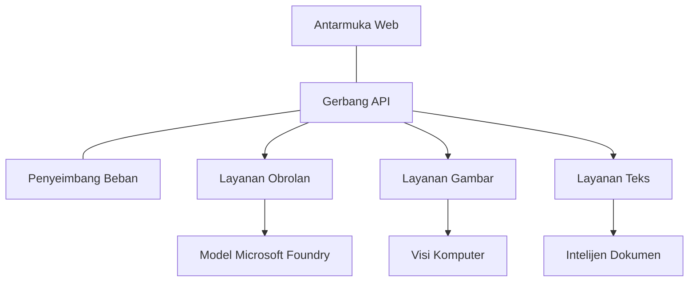

# Praktik Terbaik Beban Kerja AI Produksi dengan AZD

**Chapter Navigation:**
- **📚 Course Home**: [AZD For Beginners](../../README.md)
- **📖 Current Chapter**: Chapter 8 - Production & Enterprise Patterns
- **⬅️ Previous Chapter**: [Chapter 7: Troubleshooting](../chapter-07-troubleshooting/debugging.md)
- **⬅️ Also Related**: [AI Workshop Lab](ai-workshop-lab.md)
- **🎯 Course Complete**: [AZD For Beginners](../../README.md)

## Overview

Panduan ini memberikan praktik terbaik komprehensif untuk menerapkan beban kerja AI siap produksi menggunakan Azure Developer CLI (AZD). Berdasarkan masukan dari komunitas Microsoft Foundry Discord dan penerapan pelanggan di dunia nyata, praktik-praktik ini menangani tantangan yang paling umum dalam sistem AI produksi.

## Key Challenges Addressed

Berdasarkan hasil jajak pendapat komunitas kami, berikut tantangan utama yang dihadapi pengembang:

- **45%** mengalami kesulitan dengan penyebaran AI multi-layanan
- **38%** memiliki masalah dengan manajemen kredensial dan rahasia  
- **35%** merasa kesiapan produksi dan penskalaan sulit
- **32%** membutuhkan strategi optimasi biaya yang lebih baik
- **29%** memerlukan pemantauan dan pemecahan masalah yang lebih baik

## Architecture Patterns for Production AI

### Pattern 1: Microservices AI Architecture

**When to use**: Aplikasi AI kompleks dengan banyak kemampuan


**AZD Implementation**:

```yaml
# azure.yaml
name: enterprise-ai-platform
services:
  web:
    project: ./web
    host: staticwebapp
  api-gateway:
    project: ./api-gateway
    host: containerapp
  chat-service:
    project: ./services/chat
    host: containerapp
  vision-service:
    project: ./services/vision
    host: containerapp
  text-service:
    project: ./services/text
    host: containerapp
```

### Pattern 2: Event-Driven AI Processing

**When to use**: Pemrosesan batch, analisis dokumen, alur kerja asinkron

```bicep
// Event Hub for AI processing pipeline
resource eventHub 'Microsoft.EventHub/namespaces@2023-01-01-preview' = {
  name: eventHubNamespaceName
  location: location
  sku: {
    name: 'Standard'
    tier: 'Standard'
    capacity: 1
  }
}

// Service Bus for reliable message processing
resource serviceBus 'Microsoft.ServiceBus/namespaces@2022-10-01-preview' = {
  name: serviceBusNamespaceName
  location: location
  sku: {
    name: 'Premium'
    tier: 'Premium'
    capacity: 1
  }
}

// Function App for processing
resource functionApp 'Microsoft.Web/sites@2023-01-01' = {
  name: functionAppName
  location: location
  kind: 'functionapp,linux'
  properties: {
    siteConfig: {
      appSettings: [
        {
          name: 'FUNCTIONS_EXTENSION_VERSION'
          value: '~4'
        }
        {
          name: 'AZURE_OPENAI_ENDPOINT'
          value: '@Microsoft.KeyVault(VaultName=${keyVault.name};SecretName=openai-endpoint)'
        }
      ]
    }
  }
}
```

## Thinking About AI Agent Health

Ketika aplikasi web tradisional rusak, gejalanya sudah akrab: halaman tidak dimuat, API mengembalikan kesalahan, atau deployment gagal. Aplikasi berbasis AI bisa rusak dengan semua cara itu—tetapi juga bisa berperilaku tidak semestinya dengan cara yang lebih halus yang tidak menghasilkan pesan kesalahan yang jelas.

Bagian ini membantu Anda membangun model mental untuk memantau beban kerja AI sehingga Anda tahu di mana harus mencari ketika sesuatu tampak tidak benar.

### How Agent Health Differs from Traditional App Health

Aplikasi tradisional bekerja atau tidak. Agen AI bisa tampak bekerja tetapi menghasilkan hasil yang buruk. Pikirkan kesehatan agen dalam dua lapisan:

| Layer | What to Watch | Where to Look |
|-------|--------------|---------------|
| **Infrastructure health** | Apakah layanan berjalan? Apakah sumber daya diprovisikan? Apakah endpoint dapat dijangkau? | `azd monitor`, Azure Portal resource health, container/app logs |
| **Behavior health** | Apakah agen merespons dengan akurat? Apakah respons tepat waktu? Apakah model dipanggil dengan benar? | Application Insights traces, model call latency metrics, response quality logs |

Kesehatan infrastruktur sudah dikenal—itu sama untuk aplikasi azd mana pun. Kesehatan perilaku adalah lapisan baru yang diperkenalkan oleh beban kerja AI.

### Where to Look When AI Apps Don't Behave as Expected

Jika aplikasi AI Anda tidak menghasilkan hasil yang Anda harapkan, berikut daftar pemeriksaan konseptual:

1. **Mulai dari dasar.** Apakah aplikasi berjalan? Dapatkah aplikasi menjangkau dependensinya? Periksa `azd monitor` dan resource health seperti yang Anda lakukan untuk aplikasi manapun.
2. **Periksa koneksi model.** Apakah aplikasi Anda berhasil memanggil model AI? Panggilan model yang gagal atau timeout adalah penyebab paling umum masalah aplikasi AI dan akan muncul di log aplikasi Anda.
3. **Lihat apa yang diterima model.** Respons AI bergantung pada input (prompt dan konteks yang diambil). Jika keluaran salah, biasanya input yang salah. Periksa apakah aplikasi Anda mengirim data yang benar ke model.
4. **Tinjau latensi respons.** Panggilan model AI lebih lambat daripada panggilan API biasa. Jika aplikasi terasa lambat, periksa apakah waktu respons model meningkat—ini bisa mengindikasikan throttling, batas kapasitas, atau kemacetan tingkat regional.
5. **Waspadai sinyal biaya.** Lonjakan tak terduga dalam penggunaan token atau panggilan API bisa menunjukkan loop, prompt yang salah konfigurasi, atau retry yang berlebihan.

Anda tidak perlu menguasai tooling observability segera. Inti yang perlu diingat adalah aplikasi AI memiliki lapisan perilaku tambahan untuk dipantau, dan pemantauan bawaan azd (`azd monitor`) memberi Anda titik awal untuk menyelidiki kedua lapisan.

---

## Security Best Practices

### 1. Zero-Trust Security Model

**Implementation Strategy**:
- Tidak ada komunikasi layanan-ke-layanan tanpa autentikasi
- Semua panggilan API menggunakan managed identities
- Isolasi jaringan dengan private endpoints
- Kontrol akses least privilege

```bicep
// Managed Identity for each service
resource chatServiceIdentity 'Microsoft.ManagedIdentity/userAssignedIdentities@2023-01-31' = {
  name: 'chat-service-identity'
  location: location
}

// Role assignments with minimal permissions
resource openAIUserRole 'Microsoft.Authorization/roleAssignments@2022-04-01' = {
  scope: openAIAccount
  name: guid(openAIAccount.id, chatServiceIdentity.id, openAIUserRoleDefinitionId)
  properties: {
    roleDefinitionId: subscriptionResourceId('Microsoft.Authorization/roleDefinitions', '5e0bd9bd-7b93-4f28-af87-19fc36ad61bd')
    principalId: chatServiceIdentity.properties.principalId
    principalType: 'ServicePrincipal'
  }
}
```

### 2. Secure Secret Management

**Key Vault Integration Pattern**:

```bicep
// Key Vault with proper access policies
resource keyVault 'Microsoft.KeyVault/vaults@2023-02-01' = {
  name: keyVaultName
  location: location
  properties: {
    tenantId: tenant().tenantId
    sku: {
      family: 'A'
      name: 'premium'  // Use premium for production
    }
    enableRbacAuthorization: true  // Use RBAC instead of access policies
    enablePurgeProtection: true    // Prevent accidental deletion
    enableSoftDelete: true
    softDeleteRetentionInDays: 90
  }
}

// Store all AI service credentials
resource openAIKeySecret 'Microsoft.KeyVault/vaults/secrets@2023-02-01' = {
  parent: keyVault
  name: 'openai-api-key'
  properties: {
    value: openAIAccount.listKeys().key1
    attributes: {
      enabled: true
    }
  }
}
```

### 3. Network Security

**Private Endpoint Configuration**:

```bicep
// Virtual Network for AI services
resource virtualNetwork 'Microsoft.Network/virtualNetworks@2023-04-01' = {
  name: vnetName
  location: location
  properties: {
    addressSpace: {
      addressPrefixes: ['10.0.0.0/16']
    }
    subnets: [
      {
        name: 'ai-services-subnet'
        properties: {
          addressPrefix: '10.0.1.0/24'
          privateEndpointNetworkPolicies: 'Disabled'
        }
      }
      {
        name: 'app-services-subnet'
        properties: {
          addressPrefix: '10.0.2.0/24'
          delegations: [
            {
              name: 'Microsoft.Web/serverFarms'
              properties: {
                serviceName: 'Microsoft.Web/serverFarms'
              }
            }
          ]
        }
      }
    ]
  }
}

// Private endpoints for all AI services
resource openAIPrivateEndpoint 'Microsoft.Network/privateEndpoints@2023-04-01' = {
  name: '${openAIAccountName}-pe'
  location: location
  properties: {
    subnet: {
      id: virtualNetwork.properties.subnets[0].id
    }
    privateLinkServiceConnections: [
      {
        name: 'openai-connection'
        properties: {
          privateLinkServiceId: openAIAccount.id
          groupIds: ['account']
        }
      }
    ]
  }
}
```

## Performance and Scaling

### 1. Auto-Scaling Strategies

**Container Apps Auto-scaling**:

```bicep
resource containerApp 'Microsoft.App/containerApps@2023-05-01' = {
  name: containerAppName
  location: location
  properties: {
    configuration: {
      ingress: {
        external: true
        targetPort: 8000
        transport: 'http'
      }
    }
    template: {
      scale: {
        minReplicas: 2  // Always have 2 instances minimum
        maxReplicas: 50 // Scale up to 50 for high load
        rules: [
          {
            name: 'http-scaling'
            http: {
              metadata: {
                concurrentRequests: '20'  // Scale when >20 concurrent requests
              }
            }
          }
          {
            name: 'cpu-scaling'
            custom: {
              type: 'cpu'
              metadata: {
                type: 'Utilization'
                value: '70'  // Scale when CPU >70%
              }
            }
          }
        ]
      }
    }
  }
}
```

### 2. Caching Strategies

**Redis Cache for AI Responses**:

```bicep
// Redis Premium for production workloads
resource redisCache 'Microsoft.Cache/redis@2023-04-01' = {
  name: redisCacheName
  location: location
  properties: {
    sku: {
      name: 'Premium'
      family: 'P'
      capacity: 1
    }
    enableNonSslPort: false
    minimumTlsVersion: '1.2'
    redisConfiguration: {
      'maxmemory-policy': 'allkeys-lru'
    }
    // Enable clustering for high availability
    redisVersion: '6.0'
    shardCount: 2
  }
}

// Cache configuration in application
var cacheConnectionString = '${redisCache.properties.hostName}:6380,password=${redisCache.listKeys().primaryKey},ssl=True,abortConnect=False'
```

### 3. Load Balancing and Traffic Management

**Application Gateway with WAF**:

```bicep
// Application Gateway with Web Application Firewall
resource applicationGateway 'Microsoft.Network/applicationGateways@2023-04-01' = {
  name: appGatewayName
  location: location
  properties: {
    sku: {
      name: 'WAF_v2'
      tier: 'WAF_v2'
      capacity: 2
    }
    webApplicationFirewallConfiguration: {
      enabled: true
      firewallMode: 'Prevention'
      ruleSetType: 'OWASP'
      ruleSetVersion: '3.2'
    }
    // Backend pools for AI services
    backendAddressPools: [
      {
        name: 'ai-services-pool'
        properties: {
          backendAddresses: [
            {
              fqdn: '${containerApp.properties.configuration.ingress.fqdn}'
            }
          ]
        }
      }
    ]
  }
}
```

## 💰 Cost Optimization

### 1. Resource Right-Sizing

**Environment-Specific Configurations**:

```bash
# Lingkungan pengembangan
azd env new development
azd env set AZURE_OPENAI_SKU "S0"
azd env set AZURE_OPENAI_CAPACITY 10
azd env set AZURE_SEARCH_SKU "basic"
azd env set CONTAINER_CPU 0.5
azd env set CONTAINER_MEMORY 1.0

# Lingkungan produksi
azd env new production
azd env set AZURE_OPENAI_SKU "S0"
azd env set AZURE_OPENAI_CAPACITY 100
azd env set AZURE_SEARCH_SKU "standard"
azd env set CONTAINER_CPU 2.0
azd env set CONTAINER_MEMORY 4.0
```

### 2. Cost Monitoring and Budgets

```bicep
// Cost management and budgets
resource budget 'Microsoft.Consumption/budgets@2023-05-01' = {
  name: 'ai-workload-budget'
  properties: {
    timePeriod: {
      startDate: '2024-01-01'
      endDate: '2024-12-31'
    }
    timeGrain: 'Monthly'
    amount: 2000  // $2000 monthly budget
    category: 'Cost'
    notifications: {
      warning: {
        enabled: true
        operator: 'GreaterThan'
        threshold: 80
        contactEmails: [
          'finance@company.com'
          'engineering@company.com'
        ]
        contactRoles: [
          'Owner'
          'Contributor'
        ]
      }
      critical: {
        enabled: true
        operator: 'GreaterThan'
        threshold: 95
        contactEmails: [
          'cto@company.com'
        ]
      }
    }
  }
}
```

### 3. Token Usage Optimization

**OpenAI Cost Management**:

```typescript
// Optimasi token di tingkat aplikasi
class TokenOptimizer {
  private readonly maxTokens = 4000;
  private readonly reserveTokens = 500;
  
  optimizePrompt(userInput: string, context: string): string {
    const availableTokens = this.maxTokens - this.reserveTokens;
    const estimatedTokens = this.estimateTokens(userInput + context);
    
    if (estimatedTokens > availableTokens) {
      // Pangkas konteks, bukan masukan pengguna
      context = this.truncateContext(context, availableTokens - this.estimateTokens(userInput));
    }
    
    return `${context}\n\nUser: ${userInput}`;
  }
  
  private estimateTokens(text: string): number {
    // Perkiraan kasar: 1 token ≈ 4 karakter
    return Math.ceil(text.length / 4);
  }
}
```

## Monitoring and Observability

### 1. Comprehensive Application Insights

```bicep
// Application Insights with advanced features
resource applicationInsights 'Microsoft.Insights/components@2020-02-02' = {
  name: applicationInsightsName
  location: location
  kind: 'web'
  properties: {
    Application_Type: 'web'
    WorkspaceResourceId: logAnalyticsWorkspace.id
    SamplingPercentage: 100  // Full sampling for AI apps
    DisableIpMasking: false  // Enable for security
  }
}

// Custom metrics for AI operations
resource aiMetricAlerts 'Microsoft.Insights/metricAlerts@2018-03-01' = {
  name: 'ai-high-error-rate'
  location: 'global'
  properties: {
    description: 'Alert when AI service error rate is high'
    severity: 2
    enabled: true
    scopes: [
      applicationInsights.id
    ]
    evaluationFrequency: 'PT1M'
    windowSize: 'PT5M'
    criteria: {
      'odata.type': 'Microsoft.Azure.Monitor.SingleResourceMultipleMetricCriteria'
      allOf: [
        {
          name: 'high-error-rate'
          metricName: 'requests/failed'
          operator: 'GreaterThan'
          threshold: 10
          timeAggregation: 'Count'
        }
      ]
    }
  }
}
```

### 2. AI-Specific Monitoring

**Custom Dashboards for AI Metrics**:

```json
// Dashboard configuration for AI workloads
{
  "dashboard": {
    "name": "AI Application Monitoring",
    "tiles": [
      {
        "name": "OpenAI Request Volume",
        "query": "requests | where name contains 'openai' | summarize count() by bin(timestamp, 5m)"
      },
      {
        "name": "AI Response Latency",
        "query": "requests | where name contains 'openai' | summarize avg(duration) by bin(timestamp, 5m)"
      },
      {
        "name": "Token Usage",
        "query": "customMetrics | where name == 'openai_tokens_used' | summarize sum(value) by bin(timestamp, 1h)"
      },
      {
        "name": "Cost per Hour",
        "query": "customMetrics | where name == 'openai_cost' | summarize sum(value) by bin(timestamp, 1h)"
      }
    ]
  }
}
```

### 3. Health Checks and Uptime Monitoring

```bicep
// Application Insights availability tests
resource availabilityTest 'Microsoft.Insights/webtests@2022-06-15' = {
  name: 'ai-app-availability-test'
  location: location
  tags: {
    'hidden-link:${applicationInsights.id}': 'Resource'
  }
  properties: {
    SyntheticMonitorId: 'ai-app-availability-test'
    Name: 'AI Application Availability Test'
    Description: 'Tests AI application endpoints'
    Enabled: true
    Frequency: 300  // 5 minutes
    Timeout: 120    // 2 minutes
    Kind: 'ping'
    Locations: [
      {
        Id: 'us-east-2-azr'
      }
      {
        Id: 'us-west-2-azr'
      }
    ]
    Configuration: {
      WebTest: '''
        <WebTest Name="AI Health Check" 
                 Id="8d2de8d2-a2b0-4c2e-9a0d-8f9c9a0b8c8d" 
                 Enabled="True" 
                 CssProjectStructure="" 
                 CssIteration="" 
                 Timeout="120" 
                 WorkItemIds="" 
                 xmlns="http://microsoft.com/schemas/VisualStudio/TeamTest/2010" 
                 Description="" 
                 CredentialUserName="" 
                 CredentialPassword="" 
                 PreAuthenticate="True" 
                 Proxy="default" 
                 StopOnError="False" 
                 RecordedResultFile="" 
                 ResultsLocale="">
          <Items>
            <Request Method="GET" 
                     Guid="a5f10126-e4cd-570d-961c-cea43999a200" 
                     Version="1.1" 
                     Url="${webApp.properties.defaultHostName}/health" 
                     ThinkTime="0" 
                     Timeout="120" 
                     ParseDependentRequests="True" 
                     FollowRedirects="True" 
                     RecordResult="True" 
                     Cache="False" 
                     ResponseTimeGoal="0" 
                     Encoding="utf-8" 
                     ExpectedHttpStatusCode="200" 
                     ExpectedResponseUrl="" 
                     ReportingName="" 
                     IgnoreHttpStatusCode="False" />
          </Items>
        </WebTest>
      '''
    }
  }
}
```

## Disaster Recovery and High Availability

### 1. Multi-Region Deployment

```yaml
# azure.yaml - Multi-region configuration
name: ai-app-multiregion
services:
  api-primary:
    project: ./api
    host: containerapp
    env:
      - AZURE_REGION=eastus
  api-secondary:
    project: ./api
    host: containerapp
    env:
      - AZURE_REGION=westus2
```

```bicep
// Traffic Manager for global load balancing
resource trafficManager 'Microsoft.Network/trafficManagerProfiles@2022-04-01' = {
  name: trafficManagerProfileName
  location: 'global'
  properties: {
    profileStatus: 'Enabled'
    trafficRoutingMethod: 'Priority'
    dnsConfig: {
      relativeName: trafficManagerProfileName
      ttl: 30
    }
    monitorConfig: {
      protocol: 'HTTPS'
      port: 443
      path: '/health'
      intervalInSeconds: 30
      toleratedNumberOfFailures: 3
      timeoutInSeconds: 10
    }
    endpoints: [
      {
        name: 'primary-endpoint'
        type: 'Microsoft.Network/trafficManagerProfiles/azureEndpoints'
        properties: {
          targetResourceId: primaryAppService.id
          endpointStatus: 'Enabled'
          priority: 1
        }
      }
      {
        name: 'secondary-endpoint'
        type: 'Microsoft.Network/trafficManagerProfiles/azureEndpoints'
        properties: {
          targetResourceId: secondaryAppService.id
          endpointStatus: 'Enabled'
          priority: 2
        }
      }
    ]
  }
}
```

### 2. Data Backup and Recovery

```bicep
// Backup configuration for critical data
resource backupVault 'Microsoft.DataProtection/backupVaults@2023-05-01' = {
  name: backupVaultName
  location: location
  identity: {
    type: 'SystemAssigned'
  }
  properties: {
    storageSettings: [
      {
        datastoreType: 'VaultStore'
        type: 'LocallyRedundant'
      }
    ]
  }
}

// Backup policy for AI models and data
resource backupPolicy 'Microsoft.DataProtection/backupVaults/backupPolicies@2023-05-01' = {
  parent: backupVault
  name: 'ai-data-backup-policy'
  properties: {
    policyRules: [
      {
        backupParameters: {
          backupType: 'Full'
          objectType: 'AzureBackupParams'
        }
        trigger: {
          schedule: {
            repeatingTimeIntervals: [
              'R/2024-01-01T02:00:00+00:00/P1D'  // Daily at 2 AM
            ]
          }
          objectType: 'ScheduleBasedTriggerContext'
        }
        dataStore: {
          datastoreType: 'VaultStore'
          objectType: 'DataStoreInfoBase'
        }
        name: 'BackupDaily'
        objectType: 'AzureBackupRule'
      }
    ]
  }
}
```

## DevOps and CI/CD Integration

### 1. GitHub Actions Workflow

```yaml
# .github/workflows/deploy-ai-app.yml
name: Deploy AI Application

on:
  push:
    branches: [main]
  pull_request:
    branches: [main]

jobs:
  test:
    runs-on: ubuntu-latest
    steps:
      - uses: actions/checkout@v4
      
      - name: Setup Python
        uses: actions/setup-python@v4
        with:
          python-version: '3.11'
          
      - name: Install dependencies
        run: |
          pip install -r requirements.txt
          pip install pytest
          
      - name: Run tests
        run: pytest tests/
        
      - name: AI Safety Tests
        run: |
          python scripts/test_ai_safety.py
          python scripts/validate_prompts.py

  deploy-staging:
    needs: test
    if: github.event_name == 'pull_request'
    runs-on: ubuntu-latest
    steps:
      - uses: actions/checkout@v4
      
      - name: Setup AZD
        uses: Azure/setup-azd@v2
        
      - name: Login to Azure
        uses: azure/login@v1
        with:
          creds: ${{ secrets.AZURE_CREDENTIALS }}
          
      - name: Deploy to Staging
        run: |
          azd env select staging
          azd deploy

  deploy-production:
    needs: test
    if: github.ref == 'refs/heads/main'
    runs-on: ubuntu-latest
    steps:
      - uses: actions/checkout@v4
      
      - name: Setup AZD
        uses: Azure/setup-azd@v2
        
      - name: Login to Azure
        uses: azure/login@v1
        with:
          creds: ${{ secrets.AZURE_CREDENTIALS }}
          
      - name: Deploy to Production
        run: |
          azd env select production
          azd deploy
          
      - name: Run Production Health Checks
        run: |
          python scripts/health_check.py --env production
```

### 2. Infrastructure Validation

```bash
# scripts/validate_infrastructure.sh
#!/bin/bash

echo "Validating AI infrastructure deployment..."

# Periksa apakah semua layanan yang diperlukan sedang berjalan
services=("openai" "search" "storage" "keyvault")
for service in "${services[@]}"; do
    echo "Checking $service..."
    if ! az resource list --resource-type "Microsoft.CognitiveServices/accounts" --query "[?contains(name, '$service')]" -o tsv; then
        echo "ERROR: $service not found"
        exit 1
    fi
done

# Validasi penyebaran model OpenAI
echo "Validating OpenAI model deployments..."
models=$(az cognitiveservices account deployment list --name $AZURE_OPENAI_NAME --resource-group $AZURE_RESOURCE_GROUP --query "[].name" -o tsv)
if [[ ! $models == *"gpt-4.1-mini"* ]]; then
  echo "ERROR: Required model gpt-4.1-mini not deployed"
    exit 1
fi

# Uji konektivitas layanan AI
echo "Testing AI service connectivity..."
python scripts/test_connectivity.py

echo "Infrastructure validation completed successfully!"
```

## Production Readiness Checklist

### Security ✅
- [ ] Semua layanan menggunakan managed identities
- [ ] Rahasia disimpan di Key Vault
- [ ] Private endpoints dikonfigurasi
- [ ] Network security groups diterapkan
- [ ] RBAC dengan prinsip least privilege
- [ ] WAF diaktifkan pada endpoint publik

### Performance ✅
- [ ] Auto-scaling dikonfigurasi
- [ ] Caching diimplementasikan
- [ ] Load balancing disiapkan
- [ ] CDN untuk konten statis
- [ ] Pooling koneksi database
- [ ] Optimasi penggunaan token

### Monitoring ✅
- [ ] Application Insights dikonfigurasi
- [ ] Metrik kustom didefinisikan
- [ ] Aturan alert disiapkan
- [ ] Dashboard dibuat
- [ ] Health checks diimplementasikan
- [ ] Kebijakan retensi log

### Reliability ✅
- [ ] Deploy multi-region
- [ ] Rencana backup dan recovery
- [ ] Circuit breakers diimplementasikan
- [ ] Kebijakan retry dikonfigurasi
- [ ] Degradasi yang anggun (graceful degradation)
- [ ] Endpoint health check

### Cost Management ✅
- [ ] Alert anggaran dikonfigurasi
- [ ] Resource right-sizing
- [ ] Diskon dev/test diterapkan
- [ ] Reserved instances dibeli
- [ ] Dashboard monitoring biaya
- [ ] Tinjauan biaya berkala

### Compliance ✅
- [ ] Persyaratan residency data dipenuhi
- [ ] Audit logging diaktifkan
- [ ] Kebijakan kepatuhan diterapkan
- [ ] Baseline keamanan diimplementasikan
- [ ] Penilaian keamanan berkala
- [ ] Rencana respons insiden

## Performance Benchmarks

### Typical Production Metrics

| Metric | Target | Monitoring |
|--------|--------|------------|
| **Response Time** | < 2 seconds | Application Insights |
| **Availability** | 99.9% | Uptime monitoring |
| **Error Rate** | < 0.1% | Application logs |
| **Token Usage** | < $500/month | Cost management |
| **Concurrent Users** | 1000+ | Load testing |
| **Recovery Time** | < 1 hour | Disaster recovery tests |

### Load Testing

```bash
# Skrip pengujian beban untuk aplikasi AI
python scripts/load_test.py \
  --endpoint https://your-ai-app.azurewebsites.net \
  --concurrent-users 100 \
  --duration 300 \
  --ramp-up 60
```

## 🤝 Community Best Practices

Berdasarkan masukan komunitas Microsoft Foundry Discord:

### Top Recommendations from the Community:

1. **Start Small, Scale Gradually**: Mulailah dengan SKU dasar dan skala naik berdasarkan penggunaan nyata
2. **Monitor Everything**: Siapkan pemantauan komprehensif sejak hari pertama
3. **Automate Security**: Gunakan infrastructure as code untuk keamanan yang konsisten
4. **Test Thoroughly**: Sertakan pengujian khusus AI dalam pipeline Anda
5. **Plan for Costs**: Pantau penggunaan token dan atur alert anggaran sejak dini

### Common Pitfalls to Avoid:

- ❌ Menyematkan API key langsung di kode
- ❌ Tidak menyiapkan pemantauan yang tepat
- ❌ Mengabaikan optimasi biaya
- ❌ Tidak menguji skenario kegagalan
- ❌ Mendeploy tanpa health checks

## AZD AI CLI Commands and Extensions

AZD mencakup sekumpulan perintah dan ekstensi khusus AI yang terus berkembang untuk menyederhanakan alur kerja AI produksi. Alat-alat ini menjembatani kesenjangan antara pengembangan lokal dan deployment produksi untuk beban kerja AI.

### AZD Extensions for AI

AZD menggunakan sistem ekstensi untuk menambahkan kapabilitas khusus AI. Instal dan kelola ekstensi dengan:

```bash
# Daftar semua ekstensi yang tersedia (termasuk AI)
azd extension list

# Periksa detail ekstensi yang terpasang
azd extension show azure.ai.agents

# Pasang ekstensi Foundry agents
azd extension install azure.ai.agents

# Pasang ekstensi fine-tuning
azd extension install azure.ai.finetune

# Pasang ekstensi model kustom
azd extension install azure.ai.models

# Perbarui semua ekstensi yang terpasang
azd extension upgrade --all
```

**Available AI extensions:**

| Extension | Purpose | Status |
|-----------|---------|--------|
| `azure.ai.agents` | Manajemen Foundry Agent Service | Preview |
| `azure.ai.finetune` | Fine-tuning model Foundry | Preview |
| `azure.ai.models` | Model kustom Foundry | Preview |
| `azure.coding-agent` | Konfigurasi coding agent | Available |

### Initializing Agent Projects with `azd ai agent init`

Perintah `azd ai agent init` membuat kerangka proyek agen AI siap produksi yang terintegrasi dengan Microsoft Foundry Agent Service:

```bash
# Inisialisasi proyek agen baru dari manifes agen
azd ai agent init -m <manifest-path-or-uri>

# Inisialisasi dan targetkan proyek Foundry tertentu
azd ai agent init -m agent-manifest.yaml --project-id <foundry-project-id>

# Inisialisasi dengan direktori sumber kustom
azd ai agent init -m agent-manifest.yaml --src ./agents/my-agent

# Targetkan Container Apps sebagai host
azd ai agent init -m agent-manifest.yaml --host containerapp
```

**Key flags:**

| Flag | Description |
|------|-------------|
| `-m, --manifest` | Path atau URI ke agent manifest untuk ditambahkan ke proyek Anda |
| `-p, --project-id` | Existing Microsoft Foundry Project ID untuk lingkungan azd Anda |
| `-s, --src` | Direktori untuk mengunduh definisi agen (defaults to `src/<agent-id>`) |
| `--host` | Timpa host default (mis. `containerapp`) |
| `-e, --environment` | Lingkungan azd yang akan digunakan |

**Production tip**: Gunakan `--project-id` untuk terhubung langsung ke proyek Foundry yang ada, menjaga kode agen dan sumber daya cloud Anda terhubung sejak awal.

### Model Context Protocol (MCP) with `azd mcp`

AZD menyertakan dukungan server MCP bawaan (Alpha), memungkinkan agen AI dan alat berinteraksi dengan sumber daya Azure Anda melalui protokol standar:

```bash
# Mulai server MCP untuk proyek Anda
azd mcp start

# Tinjau aturan persetujuan Copilot saat ini untuk menjalankan alat
azd copilot consent list
```

Server MCP mengekspos konteks proyek azd Anda—lingkungan, layanan, dan sumber daya Azure—ke alat pengembangan bertenaga AI. Ini memungkinkan:

- **AI-assisted deployment**: Biarkan coding agent menanyakan status proyek Anda dan memicu deployment
- **Resource discovery**: Alat AI dapat menemukan sumber daya Azure yang digunakan proyek Anda
- **Environment management**: Agen dapat beralih antara lingkungan dev/staging/production

### Infrastructure Generation with `azd infra generate`

Untuk beban kerja AI produksi, Anda dapat menghasilkan dan menyesuaikan Infrastructure as Code daripada mengandalkan provisi otomatis:

```bash
# Hasilkan file Bicep/Terraform dari definisi proyek Anda
azd infra generate
```

Ini menulis IaC ke disk sehingga Anda dapat:
- Meninjau dan mengaudit infrastruktur sebelum menerapkan
- Menambahkan kebijakan keamanan kustom (aturan jaringan, private endpoints)
- Mengintegrasikan dengan proses review IaC yang sudah ada
- Mengontrol versi perubahan infrastruktur terpisah dari kode aplikasi

### Production Lifecycle Hooks

Hook AZD memungkinkan Anda menyuntikkan logika kustom pada setiap tahap siklus hidup deployment—kritis untuk alur kerja AI produksi:

```yaml
# azure.yaml - Production hooks example
name: ai-production-app
hooks:
  preprovision:
    shell: sh
    run: scripts/validate-quotas.sh    # Check AI model quota before provisioning
  postprovision:
    shell: sh
    run: scripts/configure-networking.sh  # Set up private endpoints
  predeploy:
    shell: sh
    run: scripts/run-ai-safety-tests.sh  # Run prompt safety checks
  postdeploy:
    shell: sh
    run: scripts/smoke-test.sh           # Verify agent responses post-deploy
services:
  agent-api:
    project: ./src/agent
    host: containerapp
    hooks:
      predeploy:
        shell: sh
        run: scripts/validate-model-access.sh  # Per-service hook
```

```bash
# Jalankan hook tertentu secara manual selama pengembangan
azd hooks run predeploy
```

**Recommended production hooks for AI workloads:**

| Hook | Use Case |
|------|----------|
| `preprovision` | Memvalidasi kuota langganan untuk kapasitas model AI |
| `postprovision` | Mengonfigurasi private endpoints, menerapkan bobot model |
| `predeploy` | Menjalankan tes keamanan AI, memvalidasi template prompt |
| `postdeploy` | Smoke test respons agen, verifikasi konektivitas model |

### CI/CD Pipeline Configuration

Gunakan `azd pipeline config` untuk menghubungkan proyek Anda ke GitHub Actions atau Azure Pipelines dengan autentikasi Azure yang aman:

```bash
# Konfigurasikan pipeline CI/CD (interaktif)
azd pipeline config

# Konfigurasikan dengan penyedia tertentu
azd pipeline config --provider github
```

Perintah ini:
- Membuat service principal dengan akses least-privilege
- Mengonfigurasi federated credentials (tanpa menyimpan rahasia)
- Menghasilkan atau memperbarui file definisi pipeline Anda
- Mengatur variabel lingkungan yang diperlukan di sistem CI/CD Anda

**Production workflow with pipeline config:**

```bash
# 1. Menyiapkan lingkungan produksi
azd env new production
azd env set AZURE_OPENAI_CAPACITY 100

# 2. Mengonfigurasi pipeline
azd pipeline config --provider github

# 3. Pipeline menjalankan azd deploy pada setiap push ke main
```

### Adding Components with `azd add`

Tambahkan layanan Azure secara bertahap ke proyek yang sudah ada:

```bash
# Tambahkan komponen layanan baru secara interaktif
azd add
```

Ini sangat berguna untuk memperluas aplikasi AI produksi—misalnya, menambahkan layanan pencarian vektor, endpoint agen baru, atau komponen pemantauan ke deployment yang ada.

## Additional Resources
- **Azure Well-Architected Framework**: [Panduan beban kerja AI](https://learn.microsoft.com/azure/well-architected/ai/)
- **Microsoft Foundry Documentation**: [Dokumentasi resmi](https://learn.microsoft.com/azure/ai-studio/)
- **Community Templates**: [Azure Samples](https://github.com/Azure-Samples)
- **Discord Community**: [saluran #Azure](https://discord.gg/microsoft-azure)
- **Keterampilan Agen untuk Azure**: [microsoft/github-copilot-for-azure on skills.sh](https://skills.sh/microsoft/github-copilot-for-azure) - 37 keterampilan agen yang tersedia untuk Azure AI, Foundry, penyebaran, optimasi biaya, dan diagnostik. Instal di editor Anda:
  ```bash
  npx skills add microsoft/github-copilot-for-azure
  ```

---

**Navigasi Bab:**
- **📚 Beranda Kursus**: [AZD For Beginners](../../README.md)
- **📖 Bab Saat Ini**: Bab 8 - Pola Produksi & Perusahaan
- **⬅️ Bab Sebelumnya**: [Bab 7: Pemecahan Masalah](../chapter-07-troubleshooting/debugging.md)
- **⬅️ Juga Terkait**: [Lab Lokakarya AI](ai-workshop-lab.md)
- **� Kursus Selesai**: [AZD For Beginners](../../README.md)

**Ingat**: Beban kerja AI produksi memerlukan perencanaan yang cermat, pemantauan, dan optimalisasi berkelanjutan. Mulailah dengan pola-pola ini dan sesuaikan dengan kebutuhan spesifik Anda.

---

<!-- CO-OP TRANSLATOR DISCLAIMER START -->
**Penafian**:
Dokumen ini telah diterjemahkan menggunakan layanan terjemahan AI [Co-op Translator](https://github.com/Azure/co-op-translator). Meskipun kami berupaya untuk akurat, harap diperhatikan bahwa terjemahan otomatis dapat mengandung kesalahan atau ketidakakuratan. Dokumen asli dalam bahasa aslinya harus dianggap sebagai sumber yang otoritatif. Untuk informasi penting, disarankan terjemahan profesional oleh penerjemah manusia. Kami tidak bertanggung jawab atas kesalahpahaman atau penafsiran yang salah yang timbul dari penggunaan terjemahan ini.
<!-- CO-OP TRANSLATOR DISCLAIMER END -->