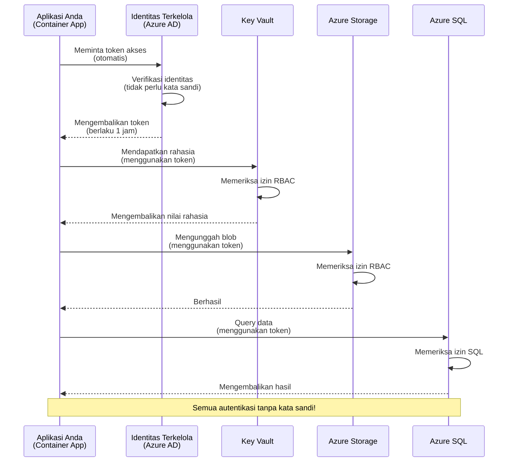
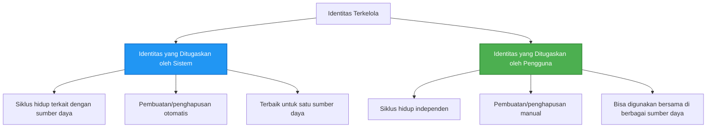

# Pola Otentikasi dan Managed Identity

⏱️ **Perkiraan Waktu**: 45-60 menit | 💰 **Dampak Biaya**: Gratis (tidak ada biaya tambahan) | ⭐ **Kompleksitas**: Menengah

**📚 Jalur Pembelajaran:**
- ← Sebelumnya: [Manajemen Konfigurasi](configuration.md) - Mengelola variabel lingkungan dan rahasia
- 🎯 **Anda Berada di Sini**: Otentikasi & Keamanan (Managed Identity, Key Vault, pola aman)
- → Selanjutnya: [Proyek Pertama](first-project.md) - Bangun aplikasi AZD pertama Anda
- 🏠 [Beranda Kursus](../../README.md)

---

## Apa yang Akan Anda Pelajari

Dengan menyelesaikan pelajaran ini, Anda akan:
- Memahami pola otentikasi Azure (kunci, string koneksi, managed identity)
- Menerapkan **Managed Identity** untuk otentikasi tanpa kata sandi
- Mengamankan rahasia dengan integrasi **Azure Key Vault**
- Mengonfigurasi **role-based access control (RBAC)** untuk deployment AZD
- Menerapkan praktik terbaik keamanan di Container Apps dan layanan Azure
- Migrasi dari otentikasi berbasis kunci ke berbasis identitas

## Mengapa Managed Identity Penting

### Masalah: Otentikasi Tradisional

**Sebelum Managed Identity:**
```javascript
// ❌ RISIKO KEAMANAN: Rahasia yang dikodekan langsung dalam kode
const connectionString = "Server=mydb.database.windows.net;User=admin;Password=P@ssw0rd123";
const storageKey = "xK7mN9pQ2wR5tY8uI0oP3aS6dF1gH4jK...";
const cosmosKey = "C2x7B9n4M1p8Q5w3E6r0T2y5U8i1O4p7...";
```

**Masalah:**
- 🔴 **Rahasia terpapar** dalam kode, file konfigurasi, variabel lingkungan
- 🔴 **Rotasi kredensial** memerlukan perubahan kode dan redeployment
- 🔴 **Mimpi buruk audit** - siapa mengakses apa, kapan?
- 🔴 **Penyebaran** - rahasia tersebar di berbagai sistem
- 🔴 **Risiko kepatuhan** - gagal dalam audit keamanan

### Solusi: Managed Identity

**Setelah Managed Identity:**
```javascript
// ✅ AMAN: Tidak ada rahasia dalam kode
const credential = new DefaultAzureCredential();
const client = new BlobServiceClient(
  "https://mystorageaccount.blob.core.windows.net",
  credential  // Azure secara otomatis menangani autentikasi
);
```

**Keuntungan:**
- ✅ **Tanpa rahasia** dalam kode atau konfigurasi
- ✅ **Rotasi otomatis** - Azure yang mengelola
- ✅ **Jejak audit penuh** dalam log Azure AD
- ✅ **Keamanan terpusat** - dikelola di Azure Portal
- ✅ **Siap kepatuhan** - memenuhi standar keamanan

**Analogi**: Otentikasi tradisional seperti membawa banyak kunci fisik untuk berbagai pintu. Managed Identity seperti memiliki kartu keamanan yang secara otomatis memberikan akses berdasarkan siapa Anda—tidak ada kunci yang hilang, disalin, atau dirotasi.

---

## Gambaran Arsitektur

### Alur Otentikasi dengan Managed Identity


### Jenis Managed Identity


| Fitur | System-Assigned | User-Assigned |
|-------|-----------------|---------------|
| **Siklus Hidup** | Terkait dengan sumber daya | Independen |
| **Pembuatan** | Otomatis dengan sumber daya | Pembuatan manual |
| **Penghapusan** | Dihapus bersama sumber daya | Tetap ada setelah sumber daya dihapus |
| **Berbagi** | Satu sumber daya saja | Banyak sumber daya |
| **Kasus Penggunaan** | Skenario sederhana | Skenario multi-sumber daya yang kompleks |
| **Default AZD** | ✅ Direkomendasikan | Opsional |

---

## Prasyarat

### Alat yang Dibutuhkan

Anda seharusnya sudah menginstal ini dari pelajaran sebelumnya:

```bash
# Verifikasi Azure Developer CLI
azd version
# ✅ Diharapkan: azd versi 1.0.0 atau lebih tinggi

# Verifikasi Azure CLI
az --version
# ✅ Diharapkan: azure-cli 2.50.0 atau lebih tinggi
```

### Persyaratan Azure

- Langganan Azure aktif
- Izin untuk:
  - Membuat managed identity
  - Menetapkan peran RBAC
  - Membuat sumber daya Key Vault
  - Melakukan deployment Container Apps

### Prasyarat Pengetahuan

Anda seharusnya telah menyelesaikan:
- [Panduan Instalasi](installation.md) - Pengaturan AZD
- [Dasar-Dasar AZD](azd-basics.md) - Konsep inti
- [Manajemen Konfigurasi](configuration.md) - Variabel lingkungan

---

## Pelajaran 1: Memahami Pola Otentikasi

### Pola 1: String Koneksi (Legacy - Hindari)

**Cara kerjanya:**
```bash
# String koneksi berisi kredensial
STORAGE_CONNECTION_STRING="DefaultEndpointsProtocol=https;AccountName=myaccount;AccountKey=xK7mN9pQ2wR5..."
COSMOS_CONNECTION_STRING="AccountEndpoint=https://myaccount.documents.azure.com:443/;AccountKey=C2x7..."
SQL_CONNECTION_STRING="Server=myserver.database.windows.net;User=admin;Password=P@ssw0rd..."
```

**Masalah:**
- ❌ Rahasia terlihat dalam variabel lingkungan
- ❌ Tercatat dalam sistem deployment
- ❌ Sulit untuk dirotasi
- ❌ Tidak ada jejak audit akses

**Kapan digunakan:** Hanya untuk pengembangan lokal, tidak pernah untuk produksi.

---

### Pola 2: Referensi Key Vault (Lebih Baik)

**Cara kerjanya:**
```bicep
// Store secret in Key Vault
resource keyVault 'Microsoft.KeyVault/vaults@2023-02-01' = {
  name: 'mykv'
  properties: {
    enableRbacAuthorization: true
  }
}

// Reference in Container App
env: [
  {
    name: 'STORAGE_KEY'
    secretRef: 'storage-key'  // References Key Vault
  }
]
```

**Keuntungan:**
- ✅ Rahasia disimpan dengan aman di Key Vault
- ✅ Manajemen rahasia terpusat
- ✅ Rotasi tanpa perubahan kode

**Keterbatasan:**
- ⚠️ Masih menggunakan kunci/kata sandi
- ⚠️ Perlu mengelola akses Key Vault

**Kapan digunakan:** Langkah transisi dari string koneksi ke managed identity.

---

### Pola 3: Managed Identity (Praktik Terbaik)

**Cara kerjanya:**
```bicep
// Enable managed identity
resource containerApp 'Microsoft.App/containerApps@2023-05-01' = {
  name: 'myapp'
  identity: {
    type: 'SystemAssigned'  // Automatically creates identity
  }
}

// Grant permissions
resource roleAssignment 'Microsoft.Authorization/roleAssignments@2022-04-01' = {
  scope: storageAccount
  properties: {
    roleDefinitionId: storageBlobDataContributorRole
    principalId: containerApp.identity.principalId
  }
}
```

**Kode aplikasi:**
```javascript
// Tidak perlu rahasia!
const { DefaultAzureCredential } = require('@azure/identity');
const { BlobServiceClient } = require('@azure/storage-blob');

const credential = new DefaultAzureCredential();
const blobServiceClient = new BlobServiceClient(
  'https://mystorageaccount.blob.core.windows.net',
  credential
);
```

**Keuntungan:**
- ✅ Tanpa rahasia dalam kode/konfigurasi
- ✅ Rotasi kredensial otomatis
- ✅ Jejak audit penuh
- ✅ Izin berbasis RBAC
- ✅ Siap kepatuhan

**Kapan digunakan:** Selalu, untuk aplikasi produksi.

---

## Pelajaran 2: Menerapkan Managed Identity dengan AZD

### Langkah-Langkah Implementasi

Mari kita bangun Container App yang aman menggunakan managed identity untuk mengakses Azure Storage dan Key Vault.

### Struktur Proyek

```
secure-app/
├── azure.yaml                 # AZD configuration
├── infra/
│   ├── main.bicep            # Main infrastructure
│   ├── core/
│   │   ├── identity.bicep    # Managed identity setup
│   │   ├── keyvault.bicep    # Key Vault configuration
│   │   └── storage.bicep     # Storage with RBAC
│   └── app/
│       └── container-app.bicep
└── src/
    ├── app.js                # Application code
    ├── package.json
    └── Dockerfile
```

### 1. Konfigurasi AZD (azure.yaml)

```yaml
name: secure-app
metadata:
  template: secure-app@1.0.0

services:
  api:
    project: ./src
    language: js
    host: containerapp

# Enable managed identity (AZD handles this automatically)
```

### 2. Infrastruktur: Aktifkan Managed Identity

**File: `infra/main.bicep`**

```bicep
targetScope = 'subscription'

param environmentName string
param location string = 'eastus'

var tags = { 'azd-env-name': environmentName }

// Resource group
resource rg 'Microsoft.Resources/resourceGroups@2021-04-01' = {
  name: 'rg-${environmentName}'
  location: location
  tags: tags
}

// Storage Account
module storage './core/storage.bicep' = {
  name: 'storage'
  scope: rg
  params: {
    name: 'st${uniqueString(rg.id)}'
    location: location
    tags: tags
  }
}

// Key Vault
module keyVault './core/keyvault.bicep' = {
  name: 'keyvault'
  scope: rg
  params: {
    name: 'kv-${uniqueString(rg.id)}'
    location: location
    tags: tags
  }
}

// Container App with Managed Identity
module containerApp './app/container-app.bicep' = {
  name: 'container-app'
  scope: rg
  params: {
    name: 'ca-${environmentName}'
    location: location
    tags: tags
    storageAccountName: storage.outputs.name
    keyVaultName: keyVault.outputs.name
  }
}

// Grant Container App access to Storage
module storageRoleAssignment './core/role-assignment.bicep' = {
  name: 'storage-role'
  scope: rg
  params: {
    principalId: containerApp.outputs.identityPrincipalId
    roleDefinitionId: 'ba92f5b4-2d11-453d-a403-e96b0029c9fe'  // Storage Blob Data Contributor
    targetResourceId: storage.outputs.id
  }
}

// Grant Container App access to Key Vault
module kvRoleAssignment './core/role-assignment.bicep' = {
  name: 'kv-role'
  scope: rg
  params: {
    principalId: containerApp.outputs.identityPrincipalId
    roleDefinitionId: '4633458b-17de-408a-b874-0445c86b69e6'  // Key Vault Secrets User
    targetResourceId: keyVault.outputs.id
  }
}

// Outputs
output AZURE_STORAGE_ACCOUNT_NAME string = storage.outputs.name
output AZURE_KEY_VAULT_NAME string = keyVault.outputs.name
output APP_URL string = containerApp.outputs.url
```

### 3. Container App dengan System-Assigned Identity

**File: `infra/app/container-app.bicep`**

```bicep
param name string
param location string
param tags object = {}
param storageAccountName string
param keyVaultName string

resource containerApp 'Microsoft.App/containerApps@2023-05-01' = {
  name: name
  location: location
  tags: tags
  identity: {
    type: 'SystemAssigned'  // 🔑 Enable managed identity
  }
  properties: {
    configuration: {
      ingress: {
        external: true
        targetPort: 3000
      }
    }
    template: {
      containers: [
        {
          name: 'api'
          image: 'myregistry.azurecr.io/api:latest'
          resources: {
            cpu: json('0.5')
            memory: '1Gi'
          }
          env: [
            {
              name: 'AZURE_STORAGE_ACCOUNT_NAME'
              value: storageAccountName
            }
            {
              name: 'AZURE_KEY_VAULT_NAME'
              value: keyVaultName
            }
            // 🔑 No secrets - managed identity handles authentication!
          ]
        }
      ]
    }
  }
}

// Output the identity for RBAC assignments
output identityPrincipalId string = containerApp.identity.principalId
output id string = containerApp.id
output url string = 'https://${containerApp.properties.configuration.ingress.fqdn}'
```

### 4. Modul Penetapan Peran RBAC

**File: `infra/core/role-assignment.bicep`**

```bicep
param principalId string
param roleDefinitionId string  // Azure built-in role ID
param targetResourceId string

resource roleAssignment 'Microsoft.Authorization/roleAssignments@2022-04-01' = {
  name: guid(principalId, roleDefinitionId, targetResourceId)
  scope: resourceId('Microsoft.Resources/resourceGroups', resourceGroup().name)
  properties: {
    roleDefinitionId: subscriptionResourceId('Microsoft.Authorization/roleDefinitions', roleDefinitionId)
    principalId: principalId
    principalType: 'ServicePrincipal'
  }
}

output id string = roleAssignment.id
```

### 5. Kode Aplikasi dengan Managed Identity

**File: `src/app.js`**

```javascript
const express = require('express');
const { DefaultAzureCredential } = require('@azure/identity');
const { BlobServiceClient } = require('@azure/storage-blob');
const { SecretClient } = require('@azure/keyvault-secrets');

const app = express();
const PORT = process.env.PORT || 3000;

// 🔑 Inisialisasi kredensial (berfungsi secara otomatis dengan identitas terkelola)
const credential = new DefaultAzureCredential();

// Pengaturan Azure Storage
const storageAccountName = process.env.AZURE_STORAGE_ACCOUNT_NAME;
const blobServiceClient = new BlobServiceClient(
  `https://${storageAccountName}.blob.core.windows.net`,
  credential  // Tidak perlu kunci!
);

// Pengaturan Key Vault
const keyVaultName = process.env.AZURE_KEY_VAULT_NAME;
const secretClient = new SecretClient(
  `https://${keyVaultName}.vault.azure.net`,
  credential  // Tidak perlu kunci!
);

// Pemeriksaan kesehatan
app.get('/health', (req, res) => {
  res.json({ status: 'healthy', authentication: 'managed-identity' });
});

// Unggah file ke blob storage
app.post('/upload', async (req, res) => {
  try {
    const containerClient = blobServiceClient.getContainerClient('uploads');
    await containerClient.createIfNotExists();
    
    const blobName = `file-${Date.now()}.txt`;
    const blockBlobClient = containerClient.getBlockBlobClient(blobName);
    
    await blockBlobClient.upload('Hello from managed identity!', 30);
    
    res.json({
      success: true,
      blobName: blobName,
      message: 'File uploaded using managed identity!'
    });
  } catch (error) {
    console.error('Upload error:', error);
    res.status(500).json({ error: error.message });
  }
});

// Ambil rahasia dari Key Vault
app.get('/secret/:name', async (req, res) => {
  try {
    const secretName = req.params.name;
    const secret = await secretClient.getSecret(secretName);
    
    res.json({
      name: secretName,
      value: secret.value,
      message: 'Secret retrieved using managed identity!'
    });
  } catch (error) {
    console.error('Secret error:', error);
    res.status(500).json({ error: error.message });
  }
});

// Daftar kontainer blob (menunjukkan akses baca)
app.get('/containers', async (req, res) => {
  try {
    const containers = [];
    for await (const container of blobServiceClient.listContainers()) {
      containers.push(container.name);
    }
    
    res.json({
      containers: containers,
      count: containers.length,
      message: 'Containers listed using managed identity!'
    });
  } catch (error) {
    console.error('List error:', error);
    res.status(500).json({ error: error.message });
  }
});

app.listen(PORT, () => {
  console.log(`Secure API listening on port ${PORT}`);
  console.log('Authentication: Managed Identity (passwordless)');
});
```

**File: `src/package.json`**

```json
{
  "name": "secure-app",
  "version": "1.0.0",
  "dependencies": {
    "express": "^4.18.2",
    "@azure/identity": "^4.0.0",
    "@azure/storage-blob": "^12.17.0",
    "@azure/keyvault-secrets": "^4.7.0"
  },
  "scripts": {
    "start": "node app.js"
  }
}
```

### 6. Deploy dan Uji

```bash
# Inisialisasi lingkungan AZD
azd init

# Menerapkan infrastruktur dan aplikasi
azd up

# Dapatkan URL aplikasi
APP_URL=$(azd env get-values | grep APP_URL | cut -d '=' -f2 | tr -d '"')

# Uji pemeriksaan kesehatan
curl $APP_URL/health
```

**✅ Output yang diharapkan:**
```json
{
  "status": "healthy",
  "authentication": "managed-identity"
}
```

**Uji unggahan blob:**
```bash
curl -X POST $APP_URL/upload
```

**✅ Output yang diharapkan:**
```json
{
  "success": true,
  "blobName": "file-1700404800000.txt",
  "message": "File uploaded using managed identity!"
}
```

**Uji daftar container:**
```bash
curl $APP_URL/containers
```

**✅ Output yang diharapkan:**
```json
{
  "containers": ["uploads"],
  "count": 1,
  "message": "Containers listed using managed identity!"
}
```

---

## Peran RBAC Azure Umum

### ID Peran Bawaan untuk Managed Identity

| Layanan | Nama Peran | ID Peran | Izin |
|---------|------------|----------|------|
| **Storage** | Storage Blob Data Reader | `2a2b9908-6b94-4a3d-8e5a-a7d8f8cc8a12` | Membaca blob dan container |
| **Storage** | Storage Blob Data Contributor | `ba92f5b4-2d11-453d-a403-e96b0029c9fe` | Membaca, menulis, menghapus blob |
| **Storage** | Storage Queue Data Contributor | `974c5e8b-45b9-4653-ba55-5f855dd0fb88` | Membaca, menulis, menghapus pesan antrian |
| **Key Vault** | Key Vault Secrets User | `4633458b-17de-408a-b874-0445c86b69e6` | Membaca rahasia |
| **Key Vault** | Key Vault Secrets Officer | `b86a8fe4-44ce-4948-aee5-eccb2c155cd7` | Membaca, menulis, menghapus rahasia |
| **Cosmos DB** | Cosmos DB Built-in Data Reader | `00000000-0000-0000-0000-000000000001` | Membaca data Cosmos DB |
| **Cosmos DB** | Cosmos DB Built-in Data Contributor | `00000000-0000-0000-0000-000000000002` | Membaca, menulis data Cosmos DB |
| **SQL Database** | SQL DB Contributor | `9b7fa17d-e63e-47b0-bb0a-15c516ac86ec` | Mengelola database SQL |
| **Service Bus** | Azure Service Bus Data Owner | `090c5cfd-751d-490a-894a-3ce6f1109419` | Mengirim, menerima, mengelola pesan |

### Cara Menemukan ID Peran

```bash
# Daftar semua peran bawaan
az role definition list --query "[].{Name:roleName, ID:name}" --output table

# Cari peran tertentu
az role definition list --query "[?contains(roleName, 'Storage Blob')].{Name:roleName, ID:name}" --output table

# Dapatkan detail peran
az role definition list --name "Storage Blob Data Contributor"
```

---

## Latihan Praktis

### Latihan 1: Aktifkan Managed Identity untuk Aplikasi yang Ada ⭐⭐ (Menengah)

**Tujuan**: Tambahkan managed identity ke deployment Container App yang ada

**Skenario**: Anda memiliki Container App yang menggunakan string koneksi. Konversikan ke managed identity.

**Titik Awal**: Container App dengan konfigurasi ini:

```bicep
// ❌ Current: Using connection string
env: [
  {
    name: 'STORAGE_CONNECTION_STRING'
    secretRef: 'storage-connection'
  }
]
```

**Langkah-Langkah**:

1. **Aktifkan managed identity di Bicep:**

```bicep
resource containerApp 'Microsoft.App/containerApps@2023-05-01' = {
  name: 'myapp'
  identity: {
    type: 'SystemAssigned'  // Add this
  }
  // ... rest of configuration
}
```

2. **Berikan akses Storage:**

```bicep
// Get storage account reference
resource storageAccount 'Microsoft.Storage/storageAccounts@2023-01-01' existing = {
  name: storageAccountName
}

// Assign role
resource roleAssignment 'Microsoft.Authorization/roleAssignments@2022-04-01' = {
  name: guid(containerApp.id, 'ba92f5b4-2d11-453d-a403-e96b0029c9fe', storageAccount.id)
  scope: storageAccount
  properties: {
    roleDefinitionId: subscriptionResourceId('Microsoft.Authorization/roleDefinitions', 'ba92f5b4-2d11-453d-a403-e96b0029c9fe')
    principalId: containerApp.identity.principalId
    principalType: 'ServicePrincipal'
  }
}
```

3. **Perbarui kode aplikasi:**

**Sebelum (string koneksi):**
```javascript
const { BlobServiceClient } = require('@azure/storage-blob');

const blobServiceClient = BlobServiceClient.fromConnectionString(
  process.env.STORAGE_CONNECTION_STRING
);
```

**Setelah (managed identity):**
```javascript
const { DefaultAzureCredential } = require('@azure/identity');
const { BlobServiceClient } = require('@azure/storage-blob');

const credential = new DefaultAzureCredential();
const blobServiceClient = new BlobServiceClient(
  `https://${process.env.STORAGE_ACCOUNT_NAME}.blob.core.windows.net`,
  credential
);
```

4. **Perbarui variabel lingkungan:**

```bicep
env: [
  {
    name: 'STORAGE_ACCOUNT_NAME'
    value: storageAccountName  // Just the name, no secrets!
  }
  // Remove STORAGE_CONNECTION_STRING
]
```

5. **Deploy dan uji:**

```bash
# Terapkan ulang
azd up

# Uji apakah masih berfungsi
curl https://myapp.azurecontainerapps.io/upload
```

**✅ Kriteria Keberhasilan:**
- ✅ Aplikasi terdeploy tanpa error
- ✅ Operasi Storage berfungsi (unggah, daftar, unduh)
- ✅ Tidak ada string koneksi dalam variabel lingkungan
- ✅ Identitas terlihat di Azure Portal di bawah "Identity" blade

**Verifikasi:**

```bash
# Periksa identitas terkelola diaktifkan
az containerapp show \
  --name myapp \
  --resource-group rg-myapp \
  --query "identity.type"
# ✅ Diharapkan: "SystemAssigned"

# Periksa penugasan peran
az role assignment list \
  --assignee $(az containerapp show --name myapp --resource-group rg-myapp --query "identity.principalId" -o tsv) \
  --scope /subscriptions/{sub-id}/resourceGroups/rg-myapp/providers/Microsoft.Storage/storageAccounts/mystorageaccount
# ✅ Diharapkan: Menampilkan peran "Storage Blob Data Contributor"
```

**Waktu**: 20-30 menit

---

### Latihan 2: Akses Multi-Layanan dengan User-Assigned Identity ⭐⭐⭐ (Lanjutan)

**Tujuan**: Buat user-assigned identity yang dibagikan di beberapa Container Apps

**Skenario**: Anda memiliki 3 microservices yang semuanya membutuhkan akses ke akun Storage dan Key Vault yang sama.

**Langkah-Langkah**:

1. **Buat user-assigned identity:**

**File: `infra/core/identity.bicep`**

```bicep
param name string
param location string
param tags object = {}

resource userAssignedIdentity 'Microsoft.ManagedIdentity/userAssignedIdentities@2023-01-31' = {
  name: name
  location: location
  tags: tags
}

output id string = userAssignedIdentity.id
output principalId string = userAssignedIdentity.properties.principalId
output clientId string = userAssignedIdentity.properties.clientId
```

2. **Tetapkan peran ke user-assigned identity:**

```bicep
// In main.bicep
module userIdentity './core/identity.bicep' = {
  name: 'user-identity'
  scope: rg
  params: {
    name: 'id-${environmentName}'
    location: location
    tags: tags
  }
}

// Grant Storage access
resource storageRoleAssignment 'Microsoft.Authorization/roleAssignments@2022-04-01' = {
  name: guid(userIdentity.outputs.principalId, 'storage-contributor')
  scope: storageAccount
  properties: {
    roleDefinitionId: subscriptionResourceId('Microsoft.Authorization/roleDefinitions', 'ba92f5b4-2d11-453d-a403-e96b0029c9fe')
    principalId: userIdentity.outputs.principalId
    principalType: 'ServicePrincipal'
  }
}

// Grant Key Vault access
resource kvRoleAssignment 'Microsoft.Authorization/roleAssignments@2022-04-01' = {
  name: guid(userIdentity.outputs.principalId, 'kv-secrets-user')
  scope: keyVault
  properties: {
    roleDefinitionId: subscriptionResourceId('Microsoft.Authorization/roleDefinitions', '4633458b-17de-408a-b874-0445c86b69e6')
    principalId: userIdentity.outputs.principalId
    principalType: 'ServicePrincipal'
  }
}
```

3. **Tetapkan identitas ke beberapa Container Apps:**

```bicep
resource apiGateway 'Microsoft.App/containerApps@2023-05-01' = {
  name: 'api-gateway'
  identity: {
    type: 'UserAssigned'
    userAssignedIdentities: {
      '${userIdentity.outputs.id}': {}
    }
  }
  // ... rest of config
}

resource productService 'Microsoft.App/containerApps@2023-05-01' = {
  name: 'product-service'
  identity: {
    type: 'UserAssigned'
    userAssignedIdentities: {
      '${userIdentity.outputs.id}': {}
    }
  }
  // ... rest of config
}

resource orderService 'Microsoft.App/containerApps@2023-05-01' = {
  name: 'order-service'
  identity: {
    type: 'UserAssigned'
    userAssignedIdentities: {
      '${userIdentity.outputs.id}': {}
    }
  }
  // ... rest of config
}
```

4. **Kode aplikasi (semua layanan menggunakan pola yang sama):**

```javascript
const { DefaultAzureCredential, ManagedIdentityCredential } = require('@azure/identity');

// Untuk identitas yang ditetapkan pengguna, tentukan ID klien
const credential = new ManagedIdentityCredential(
  process.env.AZURE_CLIENT_ID  // ID klien identitas yang ditetapkan pengguna
);

// Atau gunakan DefaultAzureCredential (mendeteksi secara otomatis)
const credential = new DefaultAzureCredential();

const blobServiceClient = new BlobServiceClient(
  `https://${process.env.STORAGE_ACCOUNT_NAME}.blob.core.windows.net`,
  credential
);
```

5. **Deploy dan verifikasi:**

```bash
azd up

# Uji semua layanan dapat mengakses penyimpanan
curl https://api-gateway.azurecontainerapps.io/upload
curl https://product-service.azurecontainerapps.io/upload
curl https://order-service.azurecontainerapps.io/upload
```

**✅ Kriteria Keberhasilan:**
- ✅ Satu identitas dibagikan di 3 layanan
- ✅ Semua layanan dapat mengakses Storage dan Key Vault
- ✅ Identitas tetap ada jika Anda menghapus satu layanan
- ✅ Manajemen izin terpusat

**Keuntungan User-Assigned Identity:**
- Satu identitas untuk dikelola
- Izin konsisten di seluruh layanan
- Bertahan setelah penghapusan layanan
- Lebih baik untuk arsitektur yang kompleks

**Waktu**: 30-40 menit

---

### Latihan 3: Implementasi Rotasi Rahasia Key Vault ⭐⭐⭐ (Lanjutan)

**Tujuan**: Simpan kunci API pihak ketiga di Key Vault dan akses menggunakan managed identity

**Skenario**: Aplikasi Anda perlu memanggil API eksternal (OpenAI, Stripe, SendGrid) yang memerlukan kunci API.

**Langkah-Langkah**:

1. **Buat Key Vault dengan RBAC:**

**File: `infra/core/keyvault.bicep`**

```bicep
param name string
param location string
param tags object = {}

resource keyVault 'Microsoft.KeyVault/vaults@2023-02-01' = {
  name: name
  location: location
  tags: tags
  properties: {
    enableRbacAuthorization: true  // Use RBAC instead of access policies
    sku: {
      family: 'A'
      name: 'standard'
    }
    tenantId: subscription().tenantId
    enableSoftDelete: true
    softDeleteRetentionInDays: 90
  }
}

// Allow Container App to read secrets
output id string = keyVault.id
output name string = keyVault.name
output uri string = keyVault.properties.vaultUri
```

2. **Simpan rahasia di Key Vault:**

```bash
# Dapatkan nama Key Vault
KV_NAME=$(azd env get-values | grep AZURE_KEY_VAULT_NAME | cut -d '=' -f2 | tr -d '"')

# Simpan kunci API pihak ketiga
az keyvault secret set \
  --vault-name $KV_NAME \
  --name "OpenAI-ApiKey" \
  --value "sk-proj-xxxxxxxxxxxxx"

az keyvault secret set \
  --vault-name $KV_NAME \
  --name "Stripe-ApiKey" \
  --value "sk_live_xxxxxxxxxxxxx"

az keyvault secret set \
  --vault-name $KV_NAME \
  --name "SendGrid-ApiKey" \
  --value "SG.xxxxxxxxxxxxx"
```

3. **Kode aplikasi untuk mengambil rahasia:**

**File: `src/config.js`**

```javascript
const { DefaultAzureCredential } = require('@azure/identity');
const { SecretClient } = require('@azure/keyvault-secrets');

class Config {
  constructor() {
    this.credential = new DefaultAzureCredential();
    this.secretClient = new SecretClient(
      `https://${process.env.AZURE_KEY_VAULT_NAME}.vault.azure.net`,
      this.credential
    );
    this.cache = {};
  }

  async getSecret(secretName) {
    // Periksa cache terlebih dahulu
    if (this.cache[secretName]) {
      return this.cache[secretName];
    }

    try {
      const secret = await this.secretClient.getSecret(secretName);
      this.cache[secretName] = secret.value;
      console.log(`✅ Retrieved secret: ${secretName}`);
      return secret.value;
    } catch (error) {
      console.error(`❌ Failed to get secret ${secretName}:`, error.message);
      throw error;
    }
  }

  async getOpenAIKey() {
    return this.getSecret('OpenAI-ApiKey');
  }

  async getStripeKey() {
    return this.getSecret('Stripe-ApiKey');
  }

  async getSendGridKey() {
    return this.getSecret('SendGrid-ApiKey');
  }
}

module.exports = new Config();
```

4. **Gunakan rahasia dalam aplikasi:**

**File: `src/app.js`**

```javascript
const express = require('express');
const config = require('./config');
const { OpenAI } = require('openai');

const app = express();

// Inisialisasi OpenAI dengan kunci dari Key Vault
let openaiClient;

async function initializeServices() {
  const openaiKey = await config.getOpenAIKey();
  openaiClient = new OpenAI({ apiKey: openaiKey });
  console.log('✅ Services initialized with secrets from Key Vault');
}

// Panggil saat startup
initializeServices().catch(console.error);

app.post('/chat', async (req, res) => {
  try {
    const completion = await openaiClient.chat.completions.create({
      model: 'gpt-4',
      messages: [{ role: 'user', content: 'Hello!' }]
    });
    
    res.json({
      response: completion.choices[0].message.content,
      authentication: 'Key from Key Vault via Managed Identity'
    });
  } catch (error) {
    res.status(500).json({ error: error.message });
  }
});

app.listen(3000, () => {
  console.log('Secure API with Key Vault integration running');
});
```

5. **Deploy dan uji:**

```bash
azd up

# Uji bahwa kunci API berfungsi
curl -X POST https://myapp.azurecontainerapps.io/chat \
  -H "Content-Type: application/json" \
  -d '{"message":"Hello AI"}'
```

**✅ Kriteria Keberhasilan:**
- ✅ Tidak ada kunci API dalam kode atau variabel lingkungan
- ✅ Aplikasi mengambil kunci dari Key Vault
- ✅ API pihak ketiga berfungsi dengan benar
- ✅ Dapat merotasi kunci tanpa perubahan kode

**Rotasi rahasia:**

```bash
# Perbarui rahasia di Key Vault
az keyvault secret set \
  --vault-name $KV_NAME \
  --name "OpenAI-ApiKey" \
  --value "sk-proj-NEW_KEY_HERE"

# Mulai ulang aplikasi untuk mengambil kunci baru
az containerapp revision restart \
  --name myapp \
  --resource-group rg-myapp
```

**Waktu**: 25-35 menit

---

## Pengecekan Pengetahuan

### 1. Pola Otentikasi ✓

Uji pemahaman Anda:

- [ ] **Q1**: Apa tiga pola otentikasi utama? 
  - **A**: String koneksi (legacy), referensi Key Vault (transisi), Managed Identity (terbaik)

- [ ] **Q2**: Mengapa managed identity lebih baik daripada string koneksi?
  - **A**: Tidak ada rahasia dalam kode, rotasi otomatis, jejak audit penuh, izin berbasis RBAC

- [ ] **Q3**: Kapan Anda menggunakan user-assigned identity daripada system-assigned?
  - **A**: Ketika berbagi identitas di beberapa sumber daya atau ketika siklus hidup identitas independen dari siklus hidup sumber daya

**Verifikasi Praktis:**
```bash
# Periksa jenis identitas yang digunakan aplikasi Anda
az containerapp show \
  --name myapp \
  --resource-group rg-myapp \
  --query "identity.type"

# Daftar semua penugasan peran untuk identitas
az role assignment list \
  --assignee $(az containerapp show --name myapp --resource-group rg-myapp --query "identity.principalId" -o tsv)
```

---

### 2. RBAC dan Izin ✓

Uji pemahaman Anda:

- [ ] **Q1**: Apa ID peran untuk "Storage Blob Data Contributor"?
  - **A**: `ba92f5b4-2d11-453d-a403-e96b0029c9fe`

- [ ] **Q2**: Izin apa yang diberikan oleh "Key Vault Secrets User"?
  - **A**: Akses baca saja ke rahasia (tidak dapat membuat, memperbarui, atau menghapus)

- [ ] **Q3**: Bagaimana Anda memberikan akses Container App ke Azure SQL?
  - **A**: Tetapkan peran "SQL DB Contributor" atau konfigurasikan otentikasi Azure AD untuk SQL

**Verifikasi Praktis:**
```bash
# Temukan peran tertentu
az role definition list --name "Storage Blob Data Contributor"

# Periksa peran apa yang ditugaskan ke identitas Anda
PRINCIPAL_ID=$(az containerapp show --name myapp --resource-group rg-myapp --query "identity.principalId" -o tsv)
az role assignment list --assignee $PRINCIPAL_ID --output table
```

---

### 3. Integrasi Key Vault ✓

Uji pemahaman Anda:
- [ ] **Q1**: Bagaimana cara mengaktifkan RBAC untuk Key Vault daripada menggunakan kebijakan akses?
  - **A**: Atur `enableRbacAuthorization: true` di Bicep

- [ ] **Q2**: Library SDK Azure mana yang menangani autentikasi identitas terkelola?
  - **A**: `@azure/identity` dengan kelas `DefaultAzureCredential`

- [ ] **Q3**: Berapa lama rahasia Key Vault tetap berada di cache?
  - **A**: Bergantung pada aplikasi; terapkan strategi caching Anda sendiri

**Verifikasi Praktis:**
```bash
# Uji akses Key Vault
az keyvault secret show \
  --vault-name $KV_NAME \
  --name "OpenAI-ApiKey" \
  --query "value"

# Periksa apakah RBAC diaktifkan
az keyvault show \
  --name $KV_NAME \
  --query "properties.enableRbacAuthorization"
# ✅ Diharapkan: benar
```

---

## Praktik Terbaik Keamanan

### ✅ LAKUKAN:

1. **Selalu gunakan identitas terkelola di produksi**
   ```bicep
   identity: {
     type: 'SystemAssigned'
   }
   ```

2. **Gunakan peran RBAC dengan hak akses minimal**
   - Gunakan peran "Reader" jika memungkinkan
   - Hindari peran "Owner" atau "Contributor" kecuali diperlukan

3. **Simpan kunci pihak ketiga di Key Vault**
   ```javascript
   const apiKey = await secretClient.getSecret('ThirdPartyApiKey');
   ```

4. **Aktifkan pencatatan audit**
   ```bicep
   diagnosticSettings: {
     logs: [{ category: 'AuditEvent', enabled: true }]
   }
   ```

5. **Gunakan identitas berbeda untuk dev/staging/prod**
   ```bash
   azd env new dev
   azd env new staging
   azd env new prod
   ```

6. **Putar rahasia secara berkala**
   - Tetapkan tanggal kedaluwarsa pada rahasia Key Vault
   - Otomatiskan rotasi dengan Azure Functions

### ❌ JANGAN:

1. **Jangan pernah menyematkan rahasia dalam kode**
   ```javascript
   // ❌ BURUK
   const apiKey = "sk-proj-xxxxxxxxxxxxx";
   ```

2. **Jangan gunakan string koneksi di produksi**
   ```javascript
   // ❌ BURUK
   BlobServiceClient.fromConnectionString(process.env.STORAGE_CONNECTION_STRING)
   ```

3. **Jangan memberikan izin berlebihan**
   ```bicep
   // ❌ BAD - too much access
   roleDefinitionId: 'Owner'
   
   // ✅ GOOD - least privilege
   roleDefinitionId: 'Storage Blob Data Reader'
   ```

4. **Jangan mencatat rahasia**
   ```javascript
   // ❌ BURUK
   console.log('API Key:', apiKey);
   
   // ✅ BAIK
   console.log('API Key retrieved successfully');
   ```

5. **Jangan berbagi identitas produksi di berbagai lingkungan**
   ```bicep
   // ❌ BAD - same identity for dev and prod
   // ✅ GOOD - separate identities per environment
   ```

---

## Panduan Pemecahan Masalah

### Masalah: "Unauthorized" saat mengakses Azure Storage

**Gejala:**
```
Error: Unauthorized (403)
AuthorizationPermissionMismatch: This request is not authorized to perform this operation
```

**Diagnosis:**

```bash
# Periksa apakah identitas terkelola diaktifkan
az containerapp show \
  --name myapp \
  --resource-group rg-myapp \
  --query "identity.type"
# ✅ Diharapkan: "SystemAssigned" atau "UserAssigned"

# Periksa penugasan peran
PRINCIPAL_ID=$(az containerapp show --name myapp --resource-group rg-myapp --query "identity.principalId" -o tsv)
az role assignment list --assignee $PRINCIPAL_ID

# Diharapkan: Harus melihat "Storage Blob Data Contributor" atau peran serupa
```

**Solusi:**

1. **Berikan peran RBAC yang benar:**
```bash
STORAGE_ID=$(az storage account show --name mystorageaccount --resource-group rg-myapp --query "id" -o tsv)
az role assignment create \
  --assignee $PRINCIPAL_ID \
  --role "Storage Blob Data Contributor" \
  --scope $STORAGE_ID
```

2. **Tunggu propagasi (dapat memakan waktu 5-10 menit):**
```bash
# Periksa status penugasan peran
az role assignment list --assignee $PRINCIPAL_ID --scope $STORAGE_ID
```

3. **Verifikasi kode aplikasi menggunakan kredensial yang benar:**
```javascript
// Pastikan Anda menggunakan DefaultAzureCredential
const credential = new DefaultAzureCredential();
```

---

### Masalah: Akses Key Vault ditolak

**Gejala:**
```
Error: Forbidden (403)
The user, group or application does not have secrets get permission
```

**Diagnosis:**

```bash
# Periksa RBAC Key Vault diaktifkan
az keyvault show \
  --name $KV_NAME \
  --query "properties.enableRbacAuthorization"
# ✅ Diharapkan: benar

# Periksa penugasan peran
az role assignment list \
  --assignee $PRINCIPAL_ID \
  --scope /subscriptions/{sub-id}/resourceGroups/rg-myapp/providers/Microsoft.KeyVault/vaults/$KV_NAME
```

**Solusi:**

1. **Aktifkan RBAC di Key Vault:**
```bash
az keyvault update \
  --name $KV_NAME \
  --enable-rbac-authorization true
```

2. **Berikan peran Key Vault Secrets User:**
```bash
KV_ID=$(az keyvault show --name $KV_NAME --query "id" -o tsv)
az role assignment create \
  --assignee $PRINCIPAL_ID \
  --role "Key Vault Secrets User" \
  --scope $KV_ID
```

---

### Masalah: DefaultAzureCredential gagal secara lokal

**Gejala:**
```
Error: DefaultAzureCredential failed to retrieve a token
CredentialUnavailableError: No credential available
```

**Diagnosis:**

```bash
# Periksa apakah Anda sudah masuk
az account show

# Periksa autentikasi Azure CLI
az ad signed-in-user show
```

**Solusi:**

1. **Login ke Azure CLI:**
```bash
az login
```

2. **Tetapkan langganan Azure:**
```bash
az account set --subscription "Your Subscription Name"
```

3. **Untuk pengembangan lokal, gunakan variabel lingkungan:**
```bash
export AZURE_TENANT_ID="your-tenant-id"
export AZURE_CLIENT_ID="your-client-id"
export AZURE_CLIENT_SECRET="your-client-secret"
```

4. **Atau gunakan kredensial berbeda secara lokal:**
```javascript
const { DefaultAzureCredential, AzureCliCredential } = require('@azure/identity');

// Gunakan AzureCliCredential untuk pengembangan lokal
const credential = process.env.NODE_ENV === 'production' 
  ? new DefaultAzureCredential()
  : new AzureCliCredential();
```

---

### Masalah: Penugasan peran membutuhkan waktu lama untuk propagasi

**Gejala:**
- Peran berhasil ditugaskan
- Masih mendapatkan kesalahan 403
- Akses tidak konsisten (kadang berhasil, kadang tidak)

**Penjelasan:**
Perubahan RBAC Azure dapat memakan waktu 5-10 menit untuk propagasi secara global.

**Solusi:**

```bash
# Tunggu dan coba lagi
echo "Waiting for RBAC propagation..."
sleep 300  # Tunggu 5 menit

# Uji akses
curl https://myapp.azurecontainerapps.io/upload

# Jika masih gagal, mulai ulang aplikasi
az containerapp revision restart \
  --name myapp \
  --resource-group rg-myapp
```

---

## Pertimbangan Biaya

### Biaya Identitas Terkelola

| Sumber Daya | Biaya |
|-------------|-------|
| **Identitas Terkelola** | 🆓 **GRATIS** - Tidak ada biaya |
| **Penugasan Peran RBAC** | 🆓 **GRATIS** - Tidak ada biaya |
| **Permintaan Token Azure AD** | 🆓 **GRATIS** - Termasuk |
| **Operasi Key Vault** | $0.03 per 10,000 operasi |
| **Penyimpanan Key Vault** | $0.024 per rahasia per bulan |

**Identitas terkelola menghemat uang dengan:**
- ✅ Menghilangkan operasi Key Vault untuk autentikasi antar layanan
- ✅ Mengurangi insiden keamanan (tidak ada kredensial yang bocor)
- ✅ Mengurangi overhead operasional (tidak ada rotasi manual)

**Perbandingan Biaya Contoh (bulanan):**

| Skenario | String Koneksi | Identitas Terkelola | Penghematan |
|----------|----------------|---------------------|-------------|
| Aplikasi kecil (1M permintaan) | ~$50 (Key Vault + operasi) | ~$0 | $50/bulan |
| Aplikasi sedang (10M permintaan) | ~$200 | ~$0 | $200/bulan |
| Aplikasi besar (100M permintaan) | ~$1,500 | ~$0 | $1,500/bulan |

---

## Pelajari Lebih Lanjut

### Dokumentasi Resmi
- [Azure Managed Identity](https://learn.microsoft.com/entra/identity/managed-identities-azure-resources/overview)
- [Azure RBAC](https://learn.microsoft.com/azure/role-based-access-control/overview)
- [Azure Key Vault](https://learn.microsoft.com/azure/key-vault/general/overview)
- [DefaultAzureCredential](https://learn.microsoft.com/dotnet/api/azure.identity.defaultazurecredential)

### Dokumentasi SDK
- [@azure/identity (Node.js)](https://www.npmjs.com/package/@azure/identity)
- [Azure.Identity (C#)](https://www.nuget.org/packages/Azure.Identity/)
- [azure-identity (Python)](https://pypi.org/project/azure-identity/)

### Langkah Selanjutnya dalam Kursus Ini
- ← Sebelumnya: [Manajemen Konfigurasi](configuration.md)
- → Selanjutnya: [Proyek Pertama](first-project.md)
- 🏠 [Beranda Kursus](../../README.md)

### Contoh Terkait
- [Contoh Azure OpenAI Chat](../../../../examples/azure-openai-chat) - Menggunakan identitas terkelola untuk Azure OpenAI
- [Contoh Microservices](../../../../examples/microservices) - Pola autentikasi multi-layanan

---

## Ringkasan

**Anda telah mempelajari:**
- ✅ Tiga pola autentikasi (string koneksi, Key Vault, identitas terkelola)
- ✅ Cara mengaktifkan dan mengonfigurasi identitas terkelola di AZD
- ✅ Penugasan peran RBAC untuk layanan Azure
- ✅ Integrasi Key Vault untuk rahasia pihak ketiga
- ✅ Identitas yang ditetapkan pengguna vs yang ditetapkan sistem
- ✅ Praktik terbaik keamanan dan pemecahan masalah

**Poin Penting:**
1. **Selalu gunakan identitas terkelola di produksi** - Tanpa rahasia, rotasi otomatis
2. **Gunakan peran RBAC dengan hak akses minimal** - Berikan hanya izin yang diperlukan
3. **Simpan kunci pihak ketiga di Key Vault** - Manajemen rahasia terpusat
4. **Pisahkan identitas per lingkungan** - Isolasi dev, staging, prod
5. **Aktifkan pencatatan audit** - Lacak siapa yang mengakses apa

**Langkah Selanjutnya:**
1. Selesaikan latihan praktis di atas
2. Migrasikan aplikasi yang ada dari string koneksi ke identitas terkelola
3. Bangun proyek AZD pertama Anda dengan keamanan sejak awal: [Proyek Pertama](first-project.md)

---

<!-- CO-OP TRANSLATOR DISCLAIMER START -->
**Penafian**:  
Dokumen ini telah diterjemahkan menggunakan layanan terjemahan AI [Co-op Translator](https://github.com/Azure/co-op-translator). Meskipun kami berupaya untuk memberikan terjemahan yang akurat, harap diperhatikan bahwa terjemahan otomatis mungkin mengandung kesalahan atau ketidakakuratan. Dokumen asli dalam bahasa aslinya harus dianggap sebagai sumber yang berwenang. Untuk informasi yang bersifat kritis, disarankan menggunakan jasa penerjemah manusia profesional. Kami tidak bertanggung jawab atas kesalahpahaman atau interpretasi yang salah yang timbul dari penggunaan terjemahan ini.
<!-- CO-OP TRANSLATOR DISCLAIMER END -->