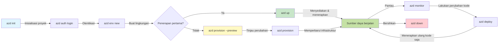
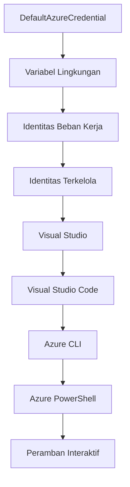

# Dasar-Dasar AZD - Memahami Azure Developer CLI

# Dasar-Dasar AZD - Konsep Inti dan Fundamental

**Navigasi Bab:**
- **📚 Halaman Utama Kursus**: [AZD Untuk Pemula](../../README.md)
- **📖 Bab Saat Ini**: Bab 1 - Dasar & Panduan Cepat
- **⬅️ Sebelumnya**: [Ikhtisar Kursus](../../README.md#-chapter-1-foundation--quick-start)
- **➡️ Selanjutnya**: [Instalasi & Pengaturan](installation.md)
- **🚀 Bab Berikutnya**: [Bab 2: Pengembangan Berbasis AI](../microsoft-foundry/microsoft-foundry-integration.md)

## Pendahuluan

Pelajaran ini memperkenalkan Anda pada Azure Developer CLI (azd), alat baris perintah yang kuat yang mempercepat perjalanan Anda dari pengembangan lokal ke penerapan di Azure. Anda akan mempelajari konsep dasar, fitur inti, dan memahami bagaimana azd menyederhanakan penerapan aplikasi cloud-native.

## Tujuan Pembelajaran

Pada akhir pelajaran ini, Anda akan:
- Memahami apa itu Azure Developer CLI dan tujuan utamanya
- Mempelajari konsep inti seperti template, lingkungan, dan layanan
- Mengeksplorasi fitur utama termasuk pengembangan berbasis template dan Infrastructure as Code
- Memahami struktur proyek azd dan alur kerjanya
- Siap untuk menginstal dan mengonfigurasi azd untuk lingkungan pengembangan Anda

## Hasil Pembelajaran

Setelah menyelesaikan pelajaran ini, Anda akan dapat:
- Menjelaskan peran azd dalam alur kerja pengembangan cloud modern
- Mengidentifikasi komponen struktur proyek azd
- Menjelaskan bagaimana template, lingkungan, dan layanan bekerja bersama
- Memahami manfaat Infrastructure as Code dengan azd
- Mengenali berbagai perintah azd dan tujuannya

## Apa itu Azure Developer CLI (azd)?

Azure Developer CLI (azd) adalah alat baris perintah yang dirancang untuk mempercepat perjalanan Anda dari pengembangan lokal ke penerapan di Azure. Alat ini menyederhanakan proses membangun, menerapkan, dan mengelola aplikasi cloud-native di Azure.

### 🎯 Mengapa Menggunakan AZD? Perbandingan Dunia Nyata

Mari kita bandingkan penerapan aplikasi web sederhana dengan database:

#### ❌ TANPA AZD: Penerapan Azure Manual (30+ menit)

```bash
# Langkah 1: Buat grup sumber daya
az group create --name myapp-rg --location eastus

# Langkah 2: Buat Rencana Layanan Aplikasi
az appservice plan create --name myapp-plan \
  --resource-group myapp-rg \
  --sku B1 --is-linux

# Langkah 3: Buat Aplikasi Web
az webapp create --name myapp-web-unique123 \
  --resource-group myapp-rg \
  --plan myapp-plan \
  --runtime "NODE:18-lts"

# Langkah 4: Buat akun Cosmos DB (10-15 menit)
az cosmosdb create --name myapp-cosmos-unique123 \
  --resource-group myapp-rg \
  --kind MongoDB

# Langkah 5: Buat basis data
az cosmosdb mongodb database create \
  --account-name myapp-cosmos-unique123 \
  --resource-group myapp-rg \
  --name tododb

# Langkah 6: Buat koleksi
az cosmosdb mongodb collection create \
  --account-name myapp-cosmos-unique123 \
  --resource-group myapp-rg \
  --database-name tododb \
  --name todos

# Langkah 7: Dapatkan string koneksi
CONN_STR=$(az cosmosdb keys list \
  --name myapp-cosmos-unique123 \
  --resource-group myapp-rg \
  --type connection-strings \
  --query "connectionStrings[0].connectionString" -o tsv)

# Langkah 8: Konfigurasi pengaturan aplikasi
az webapp config appsettings set \
  --name myapp-web-unique123 \
  --resource-group myapp-rg \
  --settings MONGODB_URI="$CONN_STR"

# Langkah 9: Aktifkan pencatatan
az webapp log config --name myapp-web-unique123 \
  --resource-group myapp-rg \
  --application-logging filesystem \
  --detailed-error-messages true

# Langkah 10: Siapkan Application Insights
az monitor app-insights component create \
  --app myapp-insights \
  --location eastus \
  --resource-group myapp-rg

# Langkah 11: Hubungkan App Insights ke Aplikasi Web
INSTRUMENTATION_KEY=$(az monitor app-insights component show \
  --app myapp-insights \
  --resource-group myapp-rg \
  --query "instrumentationKey" -o tsv)

az webapp config appsettings set \
  --name myapp-web-unique123 \
  --resource-group myapp-rg \
  --settings APPINSIGHTS_INSTRUMENTATIONKEY="$INSTRUMENTATION_KEY"

# Langkah 12: Bangun aplikasi secara lokal
npm install
npm run build

# Langkah 13: Buat paket penyebaran
zip -r app.zip . -x "*.git*" "node_modules/*"

# Langkah 14: Sebarkan aplikasi
az webapp deployment source config-zip \
  --resource-group myapp-rg \
  --name myapp-web-unique123 \
  --src app.zip

# Langkah 15: Tunggu dan berdoa semoga berhasil 🙏
# (Tidak ada validasi otomatis, pengujian manual diperlukan)
```

**Masalah:**
- ❌ 15+ perintah yang harus diingat dan dijalankan secara berurutan
- ❌ 30-45 menit pekerjaan manual
- ❌ Mudah membuat kesalahan (salah ketik, parameter salah)
- ❌ String koneksi terlihat di riwayat terminal
- ❌ Tidak ada rollback otomatis jika terjadi kegagalan
- ❌ Sulit direplikasi untuk anggota tim lain
- ❌ Berbeda setiap kali (tidak dapat direproduksi)

#### ✅ DENGAN AZD: Penerapan Otomatis (5 perintah, 10-15 menit)

```bash
# Langkah 1: Inisialisasi dari template
azd init --template todo-nodejs-mongo

# Langkah 2: Autentikasi
azd auth login

# Langkah 3: Buat lingkungan
azd env new dev

# Langkah 4: Pratinjau perubahan (opsional tetapi disarankan)
azd provision --preview

# Langkah 5: Terapkan semuanya
azd up

# ✨ Selesai! Semuanya telah diterapkan, dikonfigurasi, dan dipantau
```

**Manfaat:**
- ✅ **5 perintah** dibandingkan 15+ langkah manual
- ✅ **10-15 menit** total waktu (kebanyakan menunggu Azure)
- ✅ **Tanpa kesalahan** - otomatis dan teruji
- ✅ **Rahasia dikelola dengan aman** melalui Key Vault
- ✅ **Rollback otomatis** jika terjadi kegagalan
- ✅ **Dapat direproduksi sepenuhnya** - hasil yang sama setiap kali
- ✅ **Siap untuk tim** - siapa pun dapat menerapkan dengan perintah yang sama
- ✅ **Infrastructure as Code** - template Bicep yang dikontrol versi
- ✅ **Pemantauan bawaan** - Application Insights dikonfigurasi secara otomatis

### 📊 Pengurangan Waktu & Kesalahan

| Metrik | Penerapan Manual | Penerapan AZD | Peningkatan |
|:-------|:------------------|:---------------|:------------|
| **Perintah** | 15+ | 5 | 67% lebih sedikit |
| **Waktu** | 30-45 menit | 10-15 menit | 60% lebih cepat |
| **Tingkat Kesalahan** | ~40% | <5% | 88% pengurangan |
| **Konsistensi** | Rendah (manual) | 100% (otomatis) | Sempurna |
| **Onboarding Tim** | 2-4 jam | 30 menit | 75% lebih cepat |
| **Waktu Rollback** | 30+ menit (manual) | 2 menit (otomatis) | 93% lebih cepat |

## Konsep Inti

### Template
Template adalah dasar dari azd. Template mencakup:
- **Kode aplikasi** - Kode sumber dan dependensi Anda
- **Definisi infrastruktur** - Sumber daya Azure yang didefinisikan dalam Bicep atau Terraform
- **File konfigurasi** - Pengaturan dan variabel lingkungan
- **Skrip penerapan** - Alur kerja penerapan otomatis

### Lingkungan
Lingkungan mewakili target penerapan yang berbeda:
- **Pengembangan** - Untuk pengujian dan pengembangan
- **Staging** - Lingkungan pra-produksi
- **Produksi** - Lingkungan produksi langsung

Setiap lingkungan memiliki:
- Grup sumber daya Azure sendiri
- Pengaturan konfigurasi
- Status penerapan

### Layanan
Layanan adalah blok bangunan aplikasi Anda:
- **Frontend** - Aplikasi web, SPA
- **Backend** - API, mikroservis
- **Database** - Solusi penyimpanan data
- **Penyimpanan** - Penyimpanan file dan blob

## Fitur Utama

### 1. Pengembangan Berbasis Template
```bash
# Jelajahi template yang tersedia
azd template list

# Inisialisasi dari template
azd init --template <template-name>
```

### 2. Infrastructure as Code
- **Bicep** - Bahasa khusus domain Azure
- **Terraform** - Alat infrastruktur multi-cloud
- **Template ARM** - Template Azure Resource Manager

### 3. Alur Kerja Terintegrasi
```bash
# Selesaikan alur kerja penyebaran
azd up            # Penyediaan + Penyebaran ini tanpa campur tangan untuk pengaturan pertama kali

# 🧪 BARU: Pratinjau perubahan infrastruktur sebelum penyebaran (AMAN)
azd provision --preview    # Simulasikan penyebaran infrastruktur tanpa membuat perubahan

azd provision     # Buat sumber daya Azure jika Anda memperbarui infrastruktur gunakan ini
azd deploy        # Sebarkan kode aplikasi atau sebarkan ulang kode aplikasi setelah pembaruan
azd down          # Bersihkan sumber daya
```

#### 🛡️ Perencanaan Infrastruktur Aman dengan Pratinjau
Perintah `azd provision --preview` adalah terobosan untuk penerapan yang aman:
- **Analisis dry-run** - Menunjukkan apa yang akan dibuat, diubah, atau dihapus
- **Tanpa risiko** - Tidak ada perubahan nyata yang dilakukan pada lingkungan Azure Anda
- **Kolaborasi tim** - Bagikan hasil pratinjau sebelum penerapan
- **Estimasi biaya** - Memahami biaya sumber daya sebelum komitmen

```bash
# Contoh alur kerja pratinjau
azd provision --preview           # Lihat apa yang akan berubah
# Tinjau hasilnya, diskusikan dengan tim
azd provision                     # Terapkan perubahan dengan percaya diri
```

### 📊 Visual: Alur Kerja Pengembangan AZD


**Penjelasan Alur Kerja:**
1. **Init** - Mulai dengan template atau proyek baru
2. **Auth** - Autentikasi dengan Azure
3. **Environment** - Buat lingkungan penerapan terisolasi
4. **Preview** - 🆕 Selalu pratinjau perubahan infrastruktur terlebih dahulu (praktik aman)
5. **Provision** - Buat/perbarui sumber daya Azure
6. **Deploy** - Dorong kode aplikasi Anda
7. **Monitor** - Amati kinerja aplikasi
8. **Iterate** - Lakukan perubahan dan terapkan ulang kode
9. **Cleanup** - Hapus sumber daya saat selesai

### 4. Manajemen Lingkungan
```bash
# Buat dan kelola lingkungan
azd env new <environment-name>
azd env select <environment-name>
azd env list
```

## 📁 Struktur Proyek

Struktur proyek azd yang khas:
```
my-app/
├── .azd/                    # azd configuration
│   └── config.json
├── .azure/                  # Azure deployment artifacts
├── .devcontainer/          # Development container config
├── .github/workflows/      # GitHub Actions
├── .vscode/               # VS Code settings
├── infra/                 # Infrastructure code
│   ├── main.bicep        # Main infrastructure template
│   ├── main.parameters.json
│   └── modules/          # Reusable modules
├── src/                  # Application source code
│   ├── api/             # Backend services
│   └── web/             # Frontend application
├── azure.yaml           # azd project configuration
└── README.md
```

## 🔧 File Konfigurasi

### azure.yaml
File konfigurasi utama proyek:
```yaml
name: my-awesome-app
metadata:
  template: my-template@1.0.0

services:
  web:
    project: ./src/web
    language: js
    host: appservice
  api:
    project: ./src/api
    language: js
    host: appservice

hooks:
  preprovision:
    shell: pwsh
    run: echo "Preparing to provision..."
```

### .azure/config.json
Konfigurasi khusus lingkungan:
```json
{
  "version": 1,
  "defaultEnvironment": "dev",
  "environments": {
    "dev": {
      "subscriptionId": "your-subscription-id",
      "location": "eastus"
    }
  }
}
```

## 🎪 Alur Kerja Umum dengan Latihan Praktis

> **💡 Tip Pembelajaran:** Ikuti latihan ini secara berurutan untuk membangun keterampilan AZD Anda secara progresif.

### 🎯 Latihan 1: Inisialisasi Proyek Pertama Anda

**Tujuan:** Buat proyek AZD dan jelajahi strukturnya

**Langkah-langkah:**
```bash
# Gunakan template yang terbukti
azd init --template todo-nodejs-mongo

# Jelajahi file yang dihasilkan
ls -la  # Lihat semua file termasuk yang tersembunyi

# File utama yang dibuat:
# - azure.yaml (konfigurasi utama)
# - infra/ (kode infrastruktur)
# - src/ (kode aplikasi)
```

**✅ Keberhasilan:** Anda memiliki direktori azure.yaml, infra/, dan src/

---

### 🎯 Latihan 2: Penerapan ke Azure

**Tujuan:** Selesaikan penerapan end-to-end

**Langkah-langkah:**
```bash
# 1. Autentikasi
az login && azd auth login

# 2. Buat lingkungan
azd env new dev
azd env set AZURE_LOCATION eastus

# 3. Pratinjau perubahan (DISARANKAN)
azd provision --preview

# 4. Terapkan semuanya
azd up

# 5. Verifikasi penerapan
azd show    # Lihat URL aplikasi Anda
```

**Waktu yang Diharapkan:** 10-15 menit  
**✅ Keberhasilan:** URL aplikasi terbuka di browser

---

### 🎯 Latihan 3: Beberapa Lingkungan

**Tujuan:** Terapkan ke dev dan staging

**Langkah-langkah:**
```bash
# Sudah memiliki dev, buat staging
azd env new staging
azd env set AZURE_LOCATION westus2
azd up

# Beralih di antara mereka
azd env list
azd env select dev
```

**✅ Keberhasilan:** Dua grup sumber daya terpisah di Azure Portal

---

### 🛡️ Reset Total: `azd down --force --purge`

Ketika Anda perlu mengatur ulang sepenuhnya:

```bash
azd down --force --purge
```

**Apa yang dilakukan:**
- `--force`: Tidak ada prompt konfirmasi
- `--purge`: Menghapus semua status lokal dan sumber daya Azure

**Gunakan saat:**
- Penerapan gagal di tengah jalan
- Beralih proyek
- Membutuhkan awal yang baru

---

## 🎪 Referensi Alur Kerja Asli

### Memulai Proyek Baru
```bash
# Metode 1: Gunakan template yang ada
azd init --template todo-nodejs-mongo

# Metode 2: Mulai dari awal
azd init

# Metode 3: Gunakan direktori saat ini
azd init .
```

### Siklus Pengembangan
```bash
# Siapkan lingkungan pengembangan
azd auth login
azd env new dev
azd env select dev

# Terapkan semuanya
azd up

# Lakukan perubahan dan terapkan ulang
azd deploy

# Bersihkan setelah selesai
azd down --force --purge # perintah dalam Azure Developer CLI adalah **reset keras** untuk lingkungan Anda—sangat berguna saat Anda memecahkan masalah penerapan yang gagal, membersihkan sumber daya yatim piatu, atau mempersiapkan penerapan ulang yang baru.
```

## Memahami `azd down --force --purge`
Perintah `azd down --force --purge` adalah cara yang ampuh untuk sepenuhnya menghapus lingkungan azd Anda dan semua sumber daya terkait. Berikut adalah rincian apa yang dilakukan setiap flag:
```
--force
```
- Melewati prompt konfirmasi.
- Berguna untuk otomatisasi atau skrip di mana input manual tidak memungkinkan.
- Memastikan penghapusan berjalan tanpa gangguan, bahkan jika CLI mendeteksi inkonsistensi.

```
--purge
```
Menghapus **semua metadata terkait**, termasuk:
Status lingkungan  
Folder lokal `.azure`  
Info penerapan yang di-cache  
Mencegah azd "mengingat" penerapan sebelumnya, yang dapat menyebabkan masalah seperti grup sumber daya yang tidak cocok atau referensi registri lama.

### Mengapa menggunakan keduanya?
Ketika Anda mengalami masalah dengan `azd up` karena status yang tertinggal atau penerapan parsial, kombinasi ini memastikan **awal yang bersih**.

Ini sangat membantu setelah penghapusan sumber daya manual di portal Azure atau saat beralih template, lingkungan, atau konvensi penamaan grup sumber daya.

### Mengelola Beberapa Lingkungan
```bash
# Buat lingkungan staging
azd env new staging
azd env select staging
azd up

# Kembali ke dev
azd env select dev

# Bandingkan lingkungan
azd env list
```

## 🔐 Autentikasi dan Kredensial

Memahami autentikasi sangat penting untuk penerapan azd yang sukses. Azure menggunakan beberapa metode autentikasi, dan azd memanfaatkan rantai kredensial yang sama yang digunakan oleh alat Azure lainnya.

### Autentikasi Azure CLI (`az login`)

Sebelum menggunakan azd, Anda perlu autentikasi dengan Azure. Metode yang paling umum adalah menggunakan Azure CLI:

```bash
# Login interaktif (membuka browser)
az login

# Login dengan penyewa tertentu
az login --tenant <tenant-id>

# Login dengan principal layanan
az login --service-principal -u <app-id> -p <password> --tenant <tenant-id>

# Periksa status login saat ini
az account show

# Daftar langganan yang tersedia
az account list --output table

# Atur langganan default
az account set --subscription <subscription-id>
```

### Alur Autentikasi
1. **Login Interaktif**: Membuka browser default Anda untuk autentikasi
2. **Device Code Flow**: Untuk lingkungan tanpa akses browser
3. **Service Principal**: Untuk otomatisasi dan skenario CI/CD
4. **Managed Identity**: Untuk aplikasi yang di-host di Azure

### DefaultAzureCredential Chain

`DefaultAzureCredential` adalah tipe kredensial yang menyediakan pengalaman autentikasi yang disederhanakan dengan secara otomatis mencoba beberapa sumber kredensial dalam urutan tertentu:

#### Urutan Rantai Kredensial

#### 1. Variabel Lingkungan
```bash
# Atur variabel lingkungan untuk service principal
export AZURE_CLIENT_ID="<app-id>"
export AZURE_CLIENT_SECRET="<password>"
export AZURE_TENANT_ID="<tenant-id>"
```

#### 2. Workload Identity (Kubernetes/GitHub Actions)
Digunakan secara otomatis di:
- Azure Kubernetes Service (AKS) dengan Workload Identity
- GitHub Actions dengan federasi OIDC
- Skenario identitas federasi lainnya

#### 3. Managed Identity
Untuk sumber daya Azure seperti:
- Virtual Machines
- App Service
- Azure Functions
- Container Instances

```bash
# Periksa apakah berjalan pada sumber daya Azure dengan identitas terkelola
az account show --query "user.type" --output tsv
# Mengembalikan: "servicePrincipal" jika menggunakan identitas terkelola
```

#### 4. Integrasi Alat Pengembang
- **Visual Studio**: Secara otomatis menggunakan akun yang masuk
- **VS Code**: Menggunakan kredensial ekstensi Azure Account
- **Azure CLI**: Menggunakan kredensial `az login` (paling umum untuk pengembangan lokal)

### Pengaturan Autentikasi AZD

```bash
# Metode 1: Gunakan Azure CLI (Direkomendasikan untuk pengembangan)
az login
azd auth login  # Menggunakan kredensial Azure CLI yang ada

# Metode 2: Autentikasi langsung azd
azd auth login --use-device-code  # Untuk lingkungan tanpa kepala

# Metode 3: Periksa status autentikasi
azd auth login --check-status

# Metode 4: Logout dan autentikasi ulang
azd auth logout
azd auth login
```

### Praktik Terbaik Autentikasi

#### Untuk Pengembangan Lokal
```bash
# 1. Masuk dengan Azure CLI
az login

# 2. Verifikasi langganan yang benar
az account show
az account set --subscription "Your Subscription Name"

# 3. Gunakan azd dengan kredensial yang ada
azd auth login
```

#### Untuk Pipeline CI/CD
```yaml
# GitHub Actions example
- name: Azure Login
  uses: azure/login@v1
  with:
    creds: ${{ secrets.AZURE_CREDENTIALS }}

- name: Deploy with azd
  run: |
    azd auth login --client-id ${{ secrets.AZURE_CLIENT_ID }} \
                    --client-secret ${{ secrets.AZURE_CLIENT_SECRET }} \
                    --tenant-id ${{ secrets.AZURE_TENANT_ID }}
    azd up --no-prompt
```

#### Untuk Lingkungan Produksi
- Gunakan **Managed Identity** saat berjalan di sumber daya Azure
- Gunakan **Service Principal** untuk skenario otomatisasi
- Hindari menyimpan kredensial dalam kode atau file konfigurasi
- Gunakan **Azure Key Vault** untuk konfigurasi sensitif

### Masalah Autentikasi Umum dan Solusinya

#### Masalah: "Tidak ada langganan yang ditemukan"
```bash
# Solusi: Atur langganan default
az account list --output table
az account set --subscription "<subscription-id>"
azd env set AZURE_SUBSCRIPTION_ID "<subscription-id>"
```

#### Masalah: "Izin tidak mencukupi"
```bash
# Solusi: Periksa dan tetapkan peran yang diperlukan
az role assignment list --assignee $(az account show --query user.name --output tsv)

# Peran yang umum diperlukan:
# - Kontributor (untuk pengelolaan sumber daya)
# - Administrator Akses Pengguna (untuk penetapan peran)
```

#### Masalah: "Token kedaluwarsa"
```bash
# Solusi: Re-autentikasi
az logout
az login
azd auth logout
azd auth login
```

### Autentikasi dalam Berbagai Skenario

#### Pengembangan Lokal
```bash
# Akun pengembangan pribadi
az login
azd auth login
```

#### Pengembangan Tim
```bash
# Gunakan penyewa spesifik untuk organisasi
az login --tenant contoso.onmicrosoft.com
azd auth login
```

#### Skenario Multi-tenant
```bash
# Beralih antara penyewa
az login --tenant tenant1.onmicrosoft.com
# Terapkan ke penyewa 1
azd up

az login --tenant tenant2.onmicrosoft.com  
# Terapkan ke penyewa 2
azd up
```

### Pertimbangan Keamanan

1. **Penyimpanan Kredensial**: Jangan pernah menyimpan kredensial dalam kode sumber
2. **Pembatasan Lingkup**: Gunakan prinsip hak istimewa paling rendah untuk service principal
3. **Rotasi Token**: Secara teratur rotasi rahasia service principal
4. **Jejak Audit**: Pantau aktivitas autentikasi dan penerapan
5. **Keamanan Jaringan**: Gunakan endpoint privat jika memungkinkan

### Pemecahan Masalah Autentikasi

```bash
# Debug masalah autentikasi
azd auth login --check-status
az account show
az account get-access-token

# Perintah diagnostik umum
whoami                          # Konteks pengguna saat ini
az ad signed-in-user show      # Detail pengguna Azure AD
az group list                  # Uji akses sumber daya
```

## Memahami `azd down --force --purge`

### Penemuan
```bash
azd template list              # Jelajahi template
azd template show <template>   # Detail template
azd init --help               # Opsi inisialisasi
```

### Manajemen Proyek
```bash
azd show                     # Gambaran proyek
azd env show                 # Lingkungan saat ini
azd config list             # Pengaturan konfigurasi
```

### Pemantauan
```bash
azd monitor                  # Buka portal Azure
azd pipeline config          # Atur CI/CD
azd logs                     # Lihat log aplikasi
```

## Praktik Terbaik

### 1. Gunakan Nama yang Bermakna
```bash
# Baik
azd env new production-east
azd init --template web-app-secure

# Hindari
azd env new env1
azd init --template template1
```

### 2. Manfaatkan Template
- Mulai dengan template yang ada
- Sesuaikan untuk kebutuhan Anda
- Buat template yang dapat digunakan kembali untuk organisasi Anda

### 3. Isolasi Lingkungan
- Gunakan lingkungan terpisah untuk dev/staging/prod
- Jangan pernah menerapkan langsung ke produksi dari mesin lokal
- Gunakan pipeline CI/CD untuk penerapan produksi

### 4. Manajemen Konfigurasi
- Gunakan variabel lingkungan untuk data sensitif
- Simpan konfigurasi dalam kontrol versi
- Dokumentasikan pengaturan khusus lingkungan

## Perkembangan Pembelajaran

### Pemula (Minggu 1-2)
1. Instal azd dan autentikasi
2. Terapkan template sederhana
3. Pahami struktur proyek
4. Pelajari perintah dasar (up, down, deploy)

### Menengah (Minggu 3-4)
1. Sesuaikan template
2. Kelola beberapa lingkungan
3. Pahami kode infrastruktur
4. Siapkan pipeline CI/CD

### Lanjutan (Minggu 5+)
1. Buat template khusus
2. Pola infrastruktur tingkat lanjut
3. Penerapan multi-region
4. Konfigurasi tingkat perusahaan

## Langkah Selanjutnya

**📖 Lanjutkan Pembelajaran Bab 1:**
- [Instalasi & Pengaturan](installation.md) - Pasang dan konfigurasikan azd
- [Proyek Pertama Anda](first-project.md) - Tutorial praktis lengkap
- [Panduan Konfigurasi](configuration.md) - Opsi konfigurasi lanjutan

**🎯 Siap untuk Bab Selanjutnya?**
- [Bab 2: Pengembangan Berbasis AI](../microsoft-foundry/microsoft-foundry-integration.md) - Mulai membangun aplikasi AI

## Sumber Daya Tambahan

- [Gambaran Umum Azure Developer CLI](https://learn.microsoft.com/en-us/azure/developer/azure-developer-cli/)
- [Galeri Template](https://azure.github.io/awesome-azd/)
- [Contoh Komunitas](https://github.com/Azure-Samples)

---

## 🙋 Pertanyaan yang Sering Diajukan

### Pertanyaan Umum

**T: Apa perbedaan antara AZD dan Azure CLI?**

J: Azure CLI (`az`) digunakan untuk mengelola sumber daya Azure secara individual. AZD (`azd`) digunakan untuk mengelola seluruh aplikasi:

```bash
# Azure CLI - Manajemen sumber daya tingkat rendah
az webapp create --name myapp --resource-group rg
az sql server create --name myserver --resource-group rg
# ...banyak perintah lain yang diperlukan

# AZD - Manajemen tingkat aplikasi
azd up  # Menerapkan seluruh aplikasi dengan semua sumber daya
```

**Pikirkan seperti ini:**
- `az` = Mengoperasikan satu per satu balok Lego
- `azd` = Bekerja dengan set Lego lengkap

---

**T: Apakah saya perlu tahu Bicep atau Terraform untuk menggunakan AZD?**

J: Tidak! Mulailah dengan template:
```bash
# Gunakan template yang ada - tidak perlu pengetahuan IaC
azd init --template todo-nodejs-mongo
azd up
```

Anda dapat mempelajari Bicep nanti untuk menyesuaikan infrastruktur. Template menyediakan contoh kerja untuk dipelajari.

---

**T: Berapa biaya menjalankan template AZD?**

J: Biaya bervariasi tergantung template. Sebagian besar template pengembangan memakan biaya $50-150/bulan:

```bash
# Pratinjau biaya sebelum menerapkan
azd provision --preview

# Selalu bersihkan saat tidak digunakan
azd down --force --purge  # Menghapus semua sumber daya
```

**Tips:** Gunakan tier gratis jika tersedia:
- App Service: Tier F1 (Gratis)
- Azure OpenAI: 50.000 token/bulan gratis
- Cosmos DB: Tier gratis 1000 RU/s

---

**T: Bisakah saya menggunakan AZD dengan sumber daya Azure yang sudah ada?**

J: Bisa, tetapi lebih mudah memulai dari awal. AZD bekerja paling baik saat mengelola seluruh siklus hidup. Untuk sumber daya yang sudah ada:

```bash
# Opsi 1: Impor sumber daya yang ada (lanjutan)
azd init
# Kemudian modifikasi infra/ untuk merujuk sumber daya yang ada

# Opsi 2: Mulai dari awal (disarankan)
azd init --template matching-your-stack
azd up  # Membuat lingkungan baru
```

---

**T: Bagaimana cara saya berbagi proyek dengan rekan tim?**

J: Komit proyek AZD ke Git (tetapi JANGAN folder .azure):

```bash
# Sudah ada di .gitignore secara default
.azure/        # Berisi rahasia dan data lingkungan
*.env          # Variabel lingkungan

# Anggota tim saat itu:
git clone <your-repo>
azd auth login
azd env new <their-name>-dev
azd up
```

Semua orang mendapatkan infrastruktur identik dari template yang sama.

---

### Pertanyaan Pemecahan Masalah

**T: "azd up" gagal di tengah jalan. Apa yang harus saya lakukan?**

J: Periksa kesalahan, perbaiki, lalu coba lagi:

```bash
# Lihat log terperinci
azd show

# Perbaikan umum:

# 1. Jika kuota terlampaui:
azd env set AZURE_LOCATION "westus2"  # Coba wilayah yang berbeda

# 2. Jika konflik nama sumber daya:
azd down --force --purge  # Mulai dari awal
azd up  # Coba lagi

# 3. Jika otentikasi kedaluwarsa:
az login
azd auth login
azd up
```

**Masalah paling umum:** Langganan Azure yang salah dipilih
```bash
az account list --output table
az account set --subscription "<correct-subscription>"
```

---

**T: Bagaimana cara saya hanya menerapkan perubahan kode tanpa reprovisioning?**

J: Gunakan `azd deploy` alih-alih `azd up`:

```bash
azd up          # Pertama kali: penyediaan + penyebaran (lambat)

# Lakukan perubahan kode...

azd deploy      # Kali berikutnya: hanya penyebaran (cepat)
```

Perbandingan kecepatan:
- `azd up`: 10-15 menit (menyediakan infrastruktur)
- `azd deploy`: 2-5 menit (hanya kode)

---

**T: Bisakah saya menyesuaikan template infrastruktur?**

J: Bisa! Edit file Bicep di `infra/`:

```bash
# Setelah azd init
cd infra/
code main.bicep  # Edit di VS Code

# Pratinjau perubahan
azd provision --preview

# Terapkan perubahan
azd provision
```

**Tips:** Mulailah dari yang kecil - ubah SKUs terlebih dahulu:
```bicep
// infra/main.bicep
sku: {
  name: 'B1'  // Change to 'P1V2' for production
}
```

---

**T: Bagaimana cara saya menghapus semua yang dibuat AZD?**

J: Satu perintah menghapus semua sumber daya:

```bash
azd down --force --purge

# Ini menghapus:
# - Semua sumber daya Azure
# - Grup sumber daya
# - Status lingkungan lokal
# - Data penyebaran yang di-cache
```

**Selalu jalankan ini saat:**
- Selesai menguji template
- Beralih ke proyek lain
- Ingin memulai dari awal

**Penghematan biaya:** Menghapus sumber daya yang tidak digunakan = $0 biaya

---

**T: Bagaimana jika saya tidak sengaja menghapus sumber daya di Azure Portal?**

J: Status AZD bisa tidak sinkron. Gunakan pendekatan awal yang bersih:

```bash
# 1. Hapus status lokal
azd down --force --purge

# 2. Mulai dari awal
azd up

# Alternatif: Biarkan AZD mendeteksi dan memperbaiki
azd provision  # Akan membuat sumber daya yang hilang
```

---

### Pertanyaan Lanjutan

**T: Bisakah saya menggunakan AZD di pipeline CI/CD?**

J: Bisa! Contoh GitHub Actions:

```yaml
# .github/workflows/deploy.yml
name: Deploy with AZD

on:
  push:
    branches: [main]

jobs:
  deploy:
    runs-on: ubuntu-latest
    steps:
      - uses: actions/checkout@v2
      
      - name: Install azd
        run: curl -fsSL https://aka.ms/install-azd.sh | bash
      
      - name: Azure Login
        run: |
          azd auth login \
            --client-id ${{ secrets.AZURE_CLIENT_ID }} \
            --client-secret ${{ secrets.AZURE_CLIENT_SECRET }} \
            --tenant-id ${{ secrets.AZURE_TENANT_ID }}
      
      - name: Deploy
        run: azd up --no-prompt
```

---

**T: Bagaimana cara saya menangani rahasia dan data sensitif?**

J: AZD terintegrasi dengan Azure Key Vault secara otomatis:

```bash
# Rahasia disimpan di Key Vault, bukan di kode
azd env set DATABASE_PASSWORD "$(openssl rand -base64 32)"

# AZD secara otomatis:
# 1. Membuat Key Vault
# 2. Menyimpan rahasia
# 3. Memberikan akses aplikasi melalui Managed Identity
# 4. Menyuntikkan saat runtime
```

**Jangan pernah komit:**
- Folder `.azure/` (berisi data lingkungan)
- File `.env` (rahasia lokal)
- String koneksi

---

**T: Bisakah saya menerapkan ke beberapa wilayah?**

J: Bisa, buat lingkungan per wilayah:

```bash
# Lingkungan East US
azd env new prod-eastus
azd env set AZURE_LOCATION eastus
azd up

# Lingkungan West Europe
azd env new prod-westeurope
azd env set AZURE_LOCATION westeurope
azd up

# Setiap lingkungan bersifat independen
azd env list
```

Untuk aplikasi multi-wilayah yang sebenarnya, sesuaikan template Bicep untuk menerapkan ke beberapa wilayah secara bersamaan.

---

**T: Di mana saya bisa mendapatkan bantuan jika saya mengalami kesulitan?**

1. **Dokumentasi AZD:** https://learn.microsoft.com/azure/developer/azure-developer-cli/
2. **GitHub Issues:** https://github.com/Azure/azure-dev/issues
3. **Discord:** [Azure Discord](https://discord.gg/microsoft-azure) - Saluran #azure-developer-cli
4. **Stack Overflow:** Tag `azure-developer-cli`
5. **Kursus Ini:** [Panduan Pemecahan Masalah](../troubleshooting/common-issues.md)

**Tips:** Sebelum bertanya, jalankan:
```bash
azd show       # Menampilkan status saat ini
azd version    # Menampilkan versi Anda
```
Sertakan info ini dalam pertanyaan Anda untuk bantuan lebih cepat.

---

## 🎓 Apa Selanjutnya?

Sekarang Anda memahami dasar-dasar AZD. Pilih jalur Anda:

### 🎯 Untuk Pemula:
1. **Selanjutnya:** [Instalasi & Pengaturan](installation.md) - Instal AZD di mesin Anda
2. **Kemudian:** [Proyek Pertama Anda](first-project.md) - Terapkan aplikasi pertama Anda
3. **Latihan:** Selesaikan semua 3 latihan dalam pelajaran ini

### 🚀 Untuk Pengembang AI:
1. **Langsung ke:** [Bab 2: Pengembangan Berbasis AI](../microsoft-foundry/microsoft-foundry-integration.md)
2. **Terapkan:** Mulai dengan `azd init --template get-started-with-ai-chat`
3. **Pelajari:** Bangun sambil menerapkan

### 🏗️ Untuk Pengembang Berpengalaman:
1. **Tinjau:** [Panduan Konfigurasi](configuration.md) - Pengaturan lanjutan
2. **Jelajahi:** [Infrastructure as Code](../deployment/provisioning.md) - Pendalaman Bicep
3. **Bangun:** Buat template khusus untuk stack Anda

---

**Navigasi Bab:**
- **📚 Beranda Kursus**: [AZD Untuk Pemula](../../README.md)
- **📖 Bab Saat Ini**: Bab 1 - Dasar & Mulai Cepat  
- **⬅️ Sebelumnya**: [Ikhtisar Kursus](../../README.md#-chapter-1-foundation--quick-start)
- **➡️ Selanjutnya**: [Instalasi & Pengaturan](installation.md)
- **🚀 Bab Selanjutnya**: [Bab 2: Pengembangan Berbasis AI](../microsoft-foundry/microsoft-foundry-integration.md)

---

<!-- CO-OP TRANSLATOR DISCLAIMER START -->
**Penafian**:  
Dokumen ini telah diterjemahkan menggunakan layanan terjemahan AI [Co-op Translator](https://github.com/Azure/co-op-translator). Meskipun kami berupaya untuk memberikan terjemahan yang akurat, harap diperhatikan bahwa terjemahan otomatis mungkin mengandung kesalahan atau ketidakakuratan. Dokumen asli dalam bahasa aslinya harus dianggap sebagai sumber yang berwenang. Untuk informasi yang bersifat kritis, disarankan menggunakan jasa penerjemah manusia profesional. Kami tidak bertanggung jawab atas kesalahpahaman atau interpretasi yang salah yang timbul dari penggunaan terjemahan ini.
<!-- CO-OP TRANSLATOR DISCLAIMER END -->